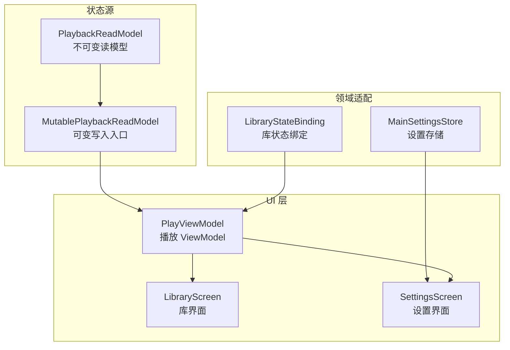
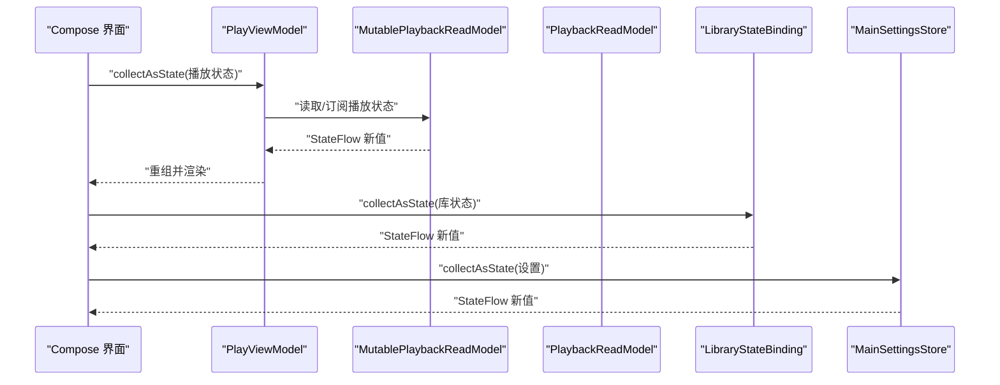
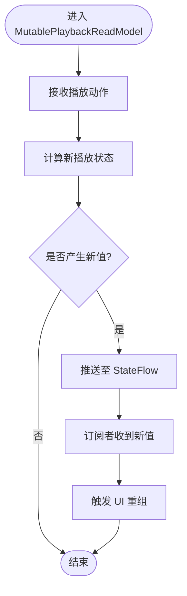
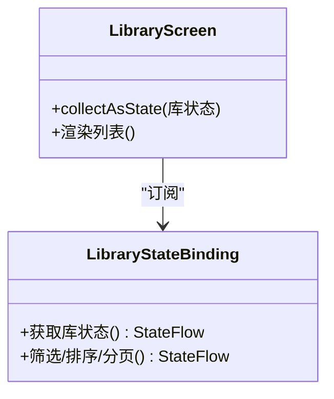
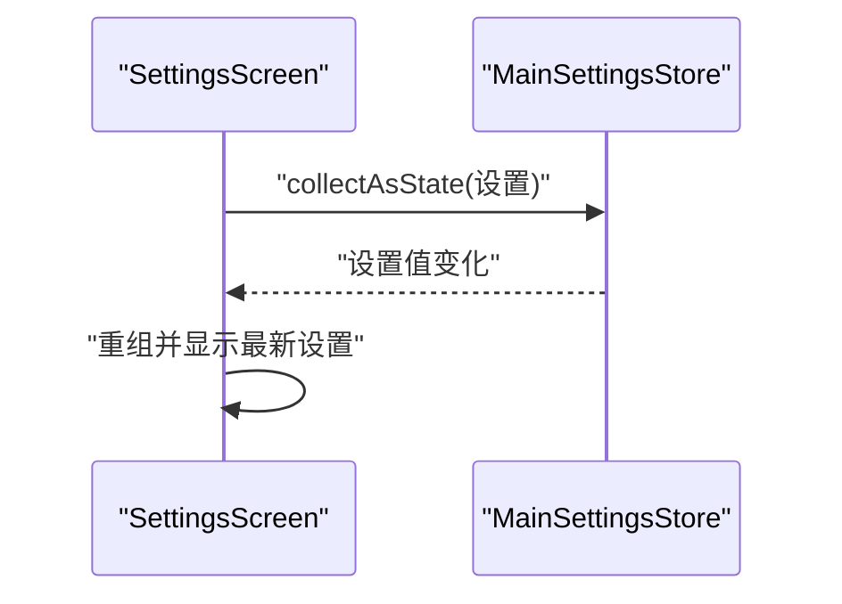
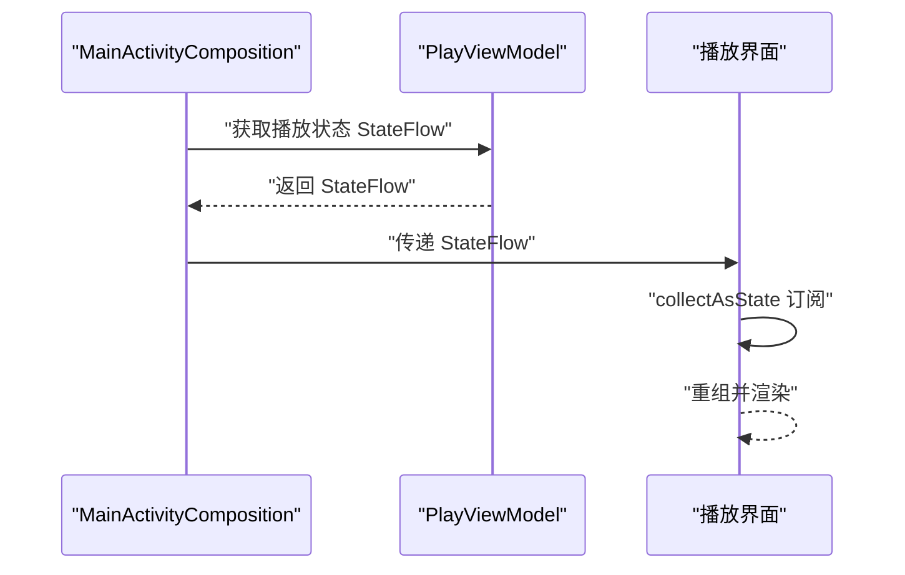
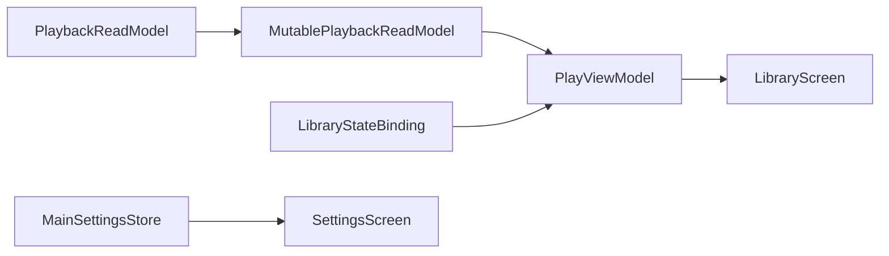

# StateFlow 状态管理

<cite>
**本文引用的文件**   
- [app/src/main/java/app/yukine/playback/PlaybackReadModel.kt](file://app/src/main/java/app/yukine/playback/PlaybackReadModel.kt)
- [app/src/main/java/app/yukine/playback/MutablePlaybackReadModel.kt](file://app/src/main/java/app/yukine/playback/MutablePlaybackReadModel.kt)
- [app/src/main/java/app/yukine/LibraryStateBinding.kt](file://app/src/main/java/app/yukine/LibraryStateBinding.kt)
- [app/src/main/java/app/yukine/MainSettingsStore.kt](file://app/src/main/java/app/yukine/MainSettingsStore.kt)
- [app/src/main/java/app/yukine/MainActivityComposition.kt](file://app/src/main/java/app/yukine/MainActivityComposition.kt)
- [feature/playback/src/main/java/app/yukine/playback/PlayViewModel.kt](file://feature/playback/src/main/java/app/yukine/playback/PlayViewModel.kt)
- [feature/library-ui/src/main/java/app/yukine/library/ui/LibraryScreen.kt](file://feature/library-ui/src/main/java/app/yukine/library/ui/LibraryScreen.kt)
- [feature/settings-ui/src/main/java/app/yukine/settings/ui/SettingsScreen.kt](file://feature/settings-ui/src/main/java/app/yukine/settings/ui/SettingsScreen.kt)
</cite>

## 目录
1. [简介](#简介)
2. [项目结构](#项目结构)
3. [核心组件](#核心组件)
4. [架构总览](#架构总览)
5. [详细组件分析](#详细组件分析)
6. [依赖关系分析](#依赖关系分析)
7. [性能考虑](#性能考虑)
8. [故障排查指南](#故障排查指南)
9. [结论](#结论)
10. [附录](#附录)

## 简介
本文件面向 Echo Android 应用，系统化梳理 StateFlow 在播放、库、设置等核心业务场景中的使用方式与最佳实践。重点说明 MutablePlaybackReadModel 的可变状态管理模式（状态更新、订阅机制、性能优化），并给出 StateFlow 与 Compose 的集成模式（collectAsState）以及常见状态转换与错误处理策略。文档以“渐进式复杂度”组织，既适合初学者快速上手，也便于资深开发者深入理解实现细节。

## 项目结构
围绕 StateFlow 的状态源与消费端，本项目采用分层组织：
- 状态源层：提供不可变读模型与可变写入口（如 PlaybackReadModel、MutablePlaybackReadModel）。
- 领域适配层：将底层服务/仓库状态聚合为 UI 友好的 ReadModel。
- UI 层：通过 ViewModel 暴露 StateFlow，Compose 侧 collectAsState 消费。

图示来源
- [app/src/main/java/app/yukine/playback/PlaybackReadModel.kt](file://app/src/main/java/app/yukine/playback/PlaybackReadModel.kt)
- [app/src/main/java/app/yukine/playback/MutablePlaybackReadModel.kt](file://app/src/main/java/app/yukine/playback/MutablePlaybackReadModel.kt)
- [app/src/main/java/app/yukine/LibraryStateBinding.kt](file://app/src/main/java/app/yukine/LibraryStateBinding.kt)
- [app/src/main/java/app/yukine/MainSettingsStore.kt](file://app/src/main/java/app/yukine/MainSettingsStore.kt)
- [feature/playback/src/main/java/app/yukine/playback/PlayViewModel.kt](file://feature/playback/src/main/java/app/yukine/playback/PlayViewModel.kt)
- [feature/library-ui/src/main/java/app/yukine/library/ui/LibraryScreen.kt](file://feature/library-ui/src/main/java/app/yukine/library/ui/LibraryScreen.kt)
- [feature/settings-ui/src/main/java/app/yukine/settings/ui/SettingsScreen.kt](file://feature/settings-ui/src/main/java/app/yukine/settings/ui/SettingsScreen.kt)

章节来源
- [app/src/main/java/app/yukine/playback/PlaybackReadModel.kt](file://app/src/main/java/app/yukine/playback/PlaybackReadModel.kt)
- [app/src/main/java/app/yukine/playback/MutablePlaybackReadModel.kt](file://app/src/main/java/app/yukine/playback/MutablePlaybackReadModel.kt)
- [app/src/main/java/app/yukine/LibraryStateBinding.kt](file://app/src/main/java/app/yukine/LibraryStateBinding.kt)
- [app/src/main/java/app/yukine/MainSettingsStore.kt](file://app/src/main/java/app/yukine/MainSettingsStore.kt)
- [feature/playback/src/main/java/app/yukine/playback/PlayViewModel.kt](file://feature/playback/src/main/java/app/yukine/playback/PlayViewModel.kt)
- [feature/library-ui/src/main/java/app/yukine/library/ui/LibraryScreen.kt](file://feature/library-ui/src/main/java/app/yukine/library/ui/LibraryScreen.kt)
- [feature/settings-ui/src/main/java/app/yukine/settings/ui/SettingsScreen.kt](file://feature/settings-ui/src/main/java/app/yukine/settings/ui/SettingsScreen.kt)

## 核心组件
- 播放读模型（PlaybackReadModel）：定义播放状态的不可变数据载体，供 UI 只读消费。
- 可变播放读模型（MutablePlaybackReadModel）：对外暴露可变的写入接口，内部维护 StateFlow 或相关流式状态，负责合并多源事件并产出新的播放状态。
- 库状态绑定（LibraryStateBinding）：将库数据源转换为 UI 可读的 StateFlow，供库界面消费。
- 设置存储（MainSettingsStore）：持久化设置项，并通过 StateFlow 暴露当前设置值。
- 播放 ViewModel（PlayViewModel）：聚合播放与库状态，向 Compose 暴露 StateFlow。
- 界面屏幕（LibraryScreen、SettingsScreen）：通过 collectAsState 消费 StateFlow，驱动重组。

章节来源
- [app/src/main/java/app/yukine/playback/PlaybackReadModel.kt](file://app/src/main/java/app/yukine/playback/PlaybackReadModel.kt)
- [app/src/main/java/app/yukine/playback/MutablePlaybackReadModel.kt](file://app/src/main/java/app/yukine/playback/MutablePlaybackReadModel.kt)
- [app/src/main/java/app/yukine/LibraryStateBinding.kt](file://app/src/main/java/app/yukine/LibraryStateBinding.kt)
- [app/src/main/java/app/yukine/MainSettingsStore.kt](file://app/src/main/java/app/yukine/MainSettingsStore.kt)
- [feature/playback/src/main/java/app/yukine/playback/PlayViewModel.kt](file://feature/playback/src/main/java/app/yukine/playback/PlayViewModel.kt)
- [feature/library-ui/src/main/java/app/yukine/library/ui/LibraryScreen.kt](file://feature/library-ui/src/main/java/app/yukine/library/ui/LibraryScreen.kt)
- [feature/settings-ui/src/main/java/app/yukine/settings/ui/SettingsScreen.kt](file://feature/settings-ui/src/main/java/app/yukine/settings/ui/SettingsScreen.kt)

## 架构总览
下图展示了从状态源到 UI 的端到端数据流，包括播放、库、设置三类典型场景。

图示来源
- [app/src/main/java/app/yukine/playback/MutablePlaybackReadModel.kt](file://app/src/main/java/app/yukine/playback/MutablePlaybackReadModel.kt)
- [app/src/main/java/app/yukine/playback/PlaybackReadModel.kt](file://app/src/main/java/app/yukine/playback/PlaybackReadModel.kt)
- [app/src/main/java/app/yukine/LibraryStateBinding.kt](file://app/src/main/java/app/yukine/LibraryStateBinding.kt)
- [app/src/main/java/app/yukine/MainSettingsStore.kt](file://app/src/main/java/app/yukine/MainSettingsStore.kt)
- [feature/playback/src/main/java/app/yukine/playback/PlayViewModel.kt](file://feature/playback/src/main/java/app/yukine/playback/PlayViewModel.kt)
- [feature/library-ui/src/main/java/app/yukine/library/ui/LibraryScreen.kt](file://feature/library-ui/src/main/java/app/yukine/library/ui/LibraryScreen.kt)
- [feature/settings-ui/src/main/java/app/yukine/settings/ui/SettingsScreen.kt](file://feature/settings-ui/src/main/java/app/yukine/settings/ui/SettingsScreen.kt)

## 详细组件分析

### 播放状态：MutablePlaybackReadModel 可变状态管理
- 职责边界
  - 对外暴露不可变读模型（PlaybackReadModel）用于只读消费。
  - 对内维护可变写入入口，接收播放控制事件（如播放、暂停、切歌、队列变更等），合并后产生新的播放状态。
- 状态更新流程
  - 输入：用户操作或系统回调产生的动作。
  - 处理：根据动作类型计算新状态（例如更新当前曲目、进度、播放模式、缓冲状态等）。
  - 输出：通过 StateFlow 推送新状态，触发订阅方重组。
- 订阅机制
  - 上层（ViewModel/界面）通过 collectAsState 订阅 StateFlow，确保仅在值变化时重组。
  - 建议对高频状态（如进度）进行节流或采样，避免过度重组。
- 性能优化
  - 使用不可变数据结构，减少不必要的对象创建。
  - 合并多个上游流时，尽量使用单一 StateFlow 作为最终出口，降低订阅数量。
  - 对大对象进行局部更新（如仅更新必要字段），避免整图重组。

图示来源
- [app/src/main/java/app/yukine/playback/MutablePlaybackReadModel.kt](file://app/src/main/java/app/yukine/playback/MutablePlaybackReadModel.kt)
- [app/src/main/java/app/yukine/playback/PlaybackReadModel.kt](file://app/src/main/java/app/yukine/playback/PlaybackReadModel.kt)

章节来源
- [app/src/main/java/app/yukine/playback/MutablePlaybackReadModel.kt](file://app/src/main/java/app/yukine/playback/MutablePlaybackReadModel.kt)
- [app/src/main/java/app/yukine/playback/PlaybackReadModel.kt](file://app/src/main/java/app/yukine/playback/PlaybackReadModel.kt)

### 库状态：LibraryStateBinding 绑定与消费
- 职责边界
  - 将库数据源（本地/网络）转换为 UI 友好的 StateFlow。
  - 提供分页、排序、过滤等组合能力，统一向上游暴露。
- 与 Compose 集成
  - 在 LibraryScreen 中通过 collectAsState 订阅库状态，按需重组列表。
- 最佳实践
  - 将复杂查询结果封装为不可变数据类，避免共享可变引用。
  - 对大数据集采用懒加载与虚拟滚动，结合 StateFlow 的背压特性提升体验。

图示来源
- [app/src/main/java/app/yukine/LibraryStateBinding.kt](file://app/src/main/java/app/yukine/LibraryStateBinding.kt)
- [feature/library-ui/src/main/java/app/yukine/library/ui/LibraryScreen.kt](file://feature/library-ui/src/main/java/app/yukine/library/ui/LibraryScreen.kt)

章节来源
- [app/src/main/java/app/yukine/LibraryStateBinding.kt](file://app/src/main/java/app/yukine/LibraryStateBinding.kt)
- [feature/library-ui/src/main/java/app/yukine/library/ui/LibraryScreen.kt](file://feature/library-ui/src/main/java/app/yukine/library/ui/LibraryScreen.kt)

### 设置状态：MainSettingsStore 与 SettingsScreen
- 职责边界
  - 持久化保存设置项，并提供当前设置的 StateFlow 视图。
  - 支持默认值、迁移与回退策略。
- 与 Compose 集成
  - SettingsScreen 通过 collectAsState 订阅设置变化，实时更新 UI。
- 最佳实践
  - 将设置项拆分为细粒度 StateFlow，避免单一大对象频繁全量更新。
  - 对敏感设置进行加密存储与访问控制。

图示来源
- [app/src/main/java/app/yukine/MainSettingsStore.kt](file://app/src/main/java/app/yukine/MainSettingsStore.kt)
- [feature/settings-ui/src/main/java/app/yukine/settings/ui/SettingsScreen.kt](file://feature/settings-ui/src/main/java/app/yukine/settings/ui/SettingsScreen.kt)

章节来源
- [app/src/main/java/app/yukine/MainSettingsStore.kt](file://app/src/main/java/app/yukine/MainSettingsStore.kt)
- [feature/settings-ui/src/main/java/app/yukine/settings/ui/SettingsScreen.kt](file://feature/settings-ui/src/main/java/app/yukine/settings/ui/SettingsScreen.kt)

### 播放 ViewModel：PlayViewModel 聚合与暴露
- 职责边界
  - 聚合播放与库状态，向 Compose 暴露统一的 StateFlow。
  - 协调播放生命周期与 UI 状态的一致性。
- 与 Compose 集成
  - MainActivityComposition 中注入 PlayViewModel，并在播放界面通过 collectAsState 消费。
- 最佳实践
  - 将复杂状态分解为多个小 StateFlow，按需组合，减少重组范围。
  - 对异步任务使用结构化并发，确保取消与恢复语义清晰。

图示来源
- [feature/playback/src/main/java/app/yukine/playback/PlayViewModel.kt](file://feature/playback/src/main/java/app/yukine/playback/PlayViewModel.kt)
- [app/src/main/java/app/yukine/MainActivityComposition.kt](file://app/src/main/java/app/yukine/MainActivityComposition.kt)

章节来源
- [feature/playback/src/main/java/app/yukine/playback/PlayViewModel.kt](file://feature/playback/src/main/java/app/yukine/playback/PlayViewModel.kt)
- [app/src/main/java/app/yukine/MainActivityComposition.kt](file://app/src/main/java/app/yukine/MainActivityComposition.kt)

### StateFlow 与 Compose 集成模式与最佳实践
- 基本用法
  - 在可重组函数中使用 collectAsState 订阅 StateFlow，自动在值变化时触发重组。
- 推荐模式
  - 将 StateFlow 暴露于 ViewModel 或独立 Store，界面仅负责消费。
  - 对高频状态（如进度）进行节流或采样，避免频繁重组。
  - 使用 remember 缓存昂贵的派生状态，减少重复计算。
- 示例路径（不展示代码内容）
  - 创建与更新：参考 MutablePlaybackReadModel 的写入入口与状态计算逻辑。
  - 消费与重组：参考 LibraryScreen、SettingsScreen 的 collectAsState 使用。
  - 聚合与暴露：参考 PlayViewModel 的组合与导出。

章节来源
- [app/src/main/java/app/yukine/playback/MutablePlaybackReadModel.kt](file://app/src/main/java/app/yukine/playback/MutablePlaybackReadModel.kt)
- [feature/library-ui/src/main/java/app/yukine/library/ui/LibraryScreen.kt](file://feature/library-ui/src/main/java/app/yukine/library/ui/LibraryScreen.kt)
- [feature/settings-ui/src/main/java/app/yukine/settings/ui/SettingsScreen.kt](file://feature/settings-ui/src/main/java/app/yukine/settings/ui/SettingsScreen.kt)
- [feature/playback/src/main/java/app/yukine/playback/PlayViewModel.kt](file://feature/playback/src/main/java/app/yukine/playback/PlayViewModel.kt)

## 依赖关系分析
- 耦合与内聚
  - MutablePlaybackReadModel 与 PlaybackReadModel 高内聚，明确读写分离。
  - LibraryStateBinding 与 MainSettingsStore 分别聚焦库与设置领域，低耦合。
- 外部依赖
  - Compose 侧通过 collectAsState 消费 StateFlow，形成单向数据流。
- 潜在循环依赖
  - 应避免 UI 直接修改状态源，确保状态流向单向。

图示来源
- [app/src/main/java/app/yukine/playback/PlaybackReadModel.kt](file://app/src/main/java/app/yukine/playback/PlaybackReadModel.kt)
- [app/src/main/java/app/yukine/playback/MutablePlaybackReadModel.kt](file://app/src/main/java/app/yukine/playback/MutablePlaybackReadModel.kt)
- [app/src/main/java/app/yukine/LibraryStateBinding.kt](file://app/src/main/java/app/yukine/LibraryStateBinding.kt)
- [app/src/main/java/app/yukine/MainSettingsStore.kt](file://app/src/main/java/app/yukine/MainSettingsStore.kt)
- [feature/playback/src/main/java/app/yukine/playback/PlayViewModel.kt](file://feature/playback/src/main/java/app/yukine/playback/PlayViewModel.kt)
- [feature/library-ui/src/main/java/app/yukine/library/ui/LibraryScreen.kt](file://feature/library-ui/src/main/java/app/yukine/library/ui/LibraryScreen.kt)
- [feature/settings-ui/src/main/java/app/yukine/settings/ui/SettingsScreen.kt](file://feature/settings-ui/src/main/java/app/yukine/settings/ui/SettingsScreen.kt)

章节来源
- [app/src/main/java/app/yukine/playback/PlaybackReadModel.kt](file://app/src/main/java/app/yukine/playback/PlaybackReadModel.kt)
- [app/src/main/java/app/yukine/playback/MutablePlaybackReadModel.kt](file://app/src/main/java/app/yukine/playback/MutablePlaybackReadModel.kt)
- [app/src/main/java/app/yukine/LibraryStateBinding.kt](file://app/src/main/java/app/yukine/LibraryStateBinding.kt)
- [app/src/main/java/app/yukine/MainSettingsStore.kt](file://app/src/main/java/app/yukine/MainSettingsStore.kt)
- [feature/playback/src/main/java/app/yukine/playback/PlayViewModel.kt](file://feature/playback/src/main/java/app/yukine/playback/PlayViewModel.kt)
- [feature/library-ui/src/main/java/app/yukine/library/ui/LibraryScreen.kt](file://feature/library-ui/src/main/java/app/yukine/library/ui/LibraryScreen.kt)
- [feature/settings-ui/src/main/java/app/yukine/settings/ui/SettingsScreen.kt](file://feature/settings-ui/src/main/java/app/yukine/settings/ui/SettingsScreen.kt)

## 性能考虑
- 状态粒度
  - 将状态拆分为细粒度 StateFlow，减少重组范围。
- 节流与采样
  - 对高频状态（如播放进度）进行节流或采样，避免频繁重组。
- 对象复用
  - 使用不可变数据类与局部更新，减少对象分配与 GC 压力。
- 背压与取消
  - 利用 StateFlow 的背压特性，确保订阅者在界面销毁时及时取消。
- 缓存与记忆
  - 在 Compose 中使用 remember 缓存派生状态，避免重复计算。

[本节为通用指导，无需特定文件来源]

## 故障排查指南
- 常见问题
  - 状态未更新：检查 StateFlow 是否正确推送新值；确认 collectAsState 是否在正确的可重组作用域内。
  - 过度重组：定位高频状态源，增加节流或拆分状态。
  - 内存泄漏：确保在界面销毁时取消订阅（collectAsState 通常自动处理，但需避免持有额外引用）。
- 调试技巧
  - 打印状态变更日志，观察状态转换是否符合预期。
  - 使用性能分析工具检测重组热点与耗时。
- 错误处理
  - 在状态计算阶段捕获异常，转化为 UI 可展示的友好状态。
  - 对网络或 IO 失败，提供重试与降级策略。

章节来源
- [app/src/main/java/app/yukine/playback/MutablePlaybackReadModel.kt](file://app/src/main/java/app/yukine/playback/MutablePlaybackReadModel.kt)
- [feature/library-ui/src/main/java/app/yukine/library/ui/LibraryScreen.kt](file://feature/library-ui/src/main/java/app/yukine/library/ui/LibraryScreen.kt)
- [feature/settings-ui/src/main/java/app/yukine/settings/ui/SettingsScreen.kt](file://feature/settings-ui/src/main/java/app/yukine/settings/ui/SettingsScreen.kt)

## 结论
通过明确的读写分离、细粒度 StateFlow 设计与 Compose 的 collectAsState 集成，Echo Android 应用在播放、库、设置等核心场景中实现了高效、可维护的状态管理。遵循本文的最佳实践与性能建议，可进一步提升用户体验与开发效率。

[本节为总结性内容，无需特定文件来源]

## 附录
- 示例路径（不展示代码内容）
  - 创建与更新状态：参考 MutablePlaybackReadModel 的写入入口与状态计算逻辑。
  - 订阅与重组：参考 LibraryScreen、SettingsScreen 的 collectAsState 使用。
  - 聚合与暴露：参考 PlayViewModel 的组合与导出。
  - 主界面集成：参考 MainActivityComposition 的注入与传递。

章节来源
- [app/src/main/java/app/yukine/playback/MutablePlaybackReadModel.kt](file://app/src/main/java/app/yukine/playback/MutablePlaybackReadModel.kt)
- [feature/library-ui/src/main/java/app/yukine/library/ui/LibraryScreen.kt](file://feature/library-ui/src/main/java/app/yukine/library/ui/LibraryScreen.kt)
- [feature/settings-ui/src/main/java/app/yukine/settings/ui/SettingsScreen.kt](file://feature/settings-ui/src/main/java/app/yukine/settings/ui/SettingsScreen.kt)
- [feature/playback/src/main/java/app/yukine/playback/PlayViewModel.kt](file://feature/playback/src/main/java/app/yukine/playback/PlayViewModel.kt)
- [app/src/main/java/app/yukine/MainActivityComposition.kt](file://app/src/main/java/app/yukine/MainActivityComposition.kt)