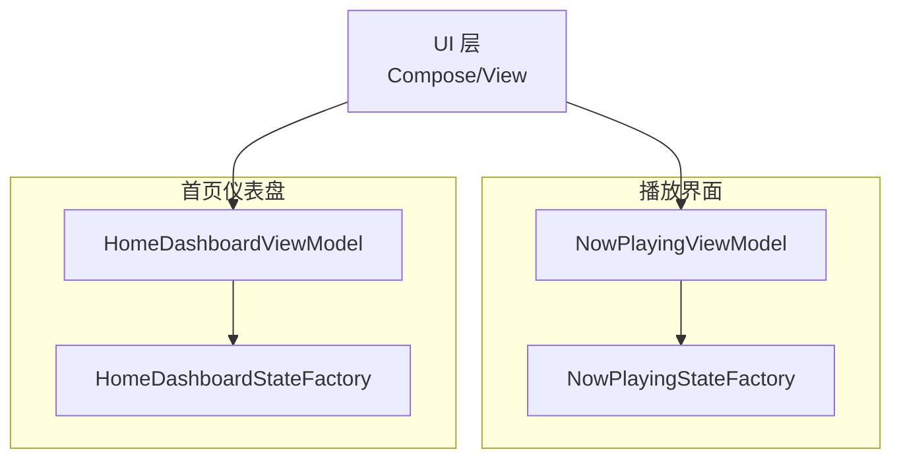
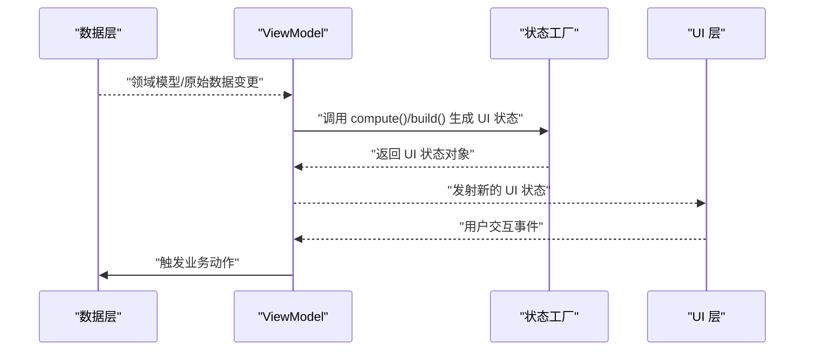
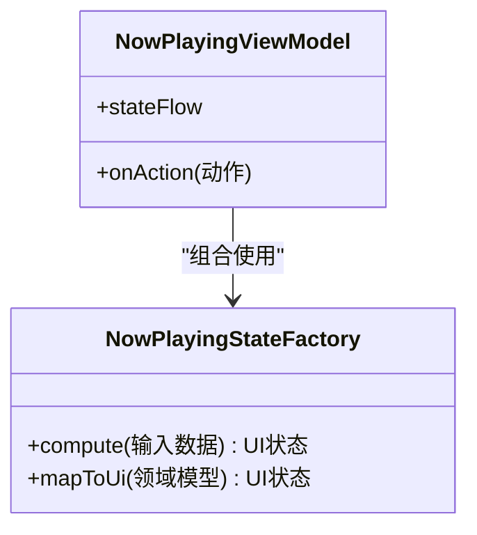
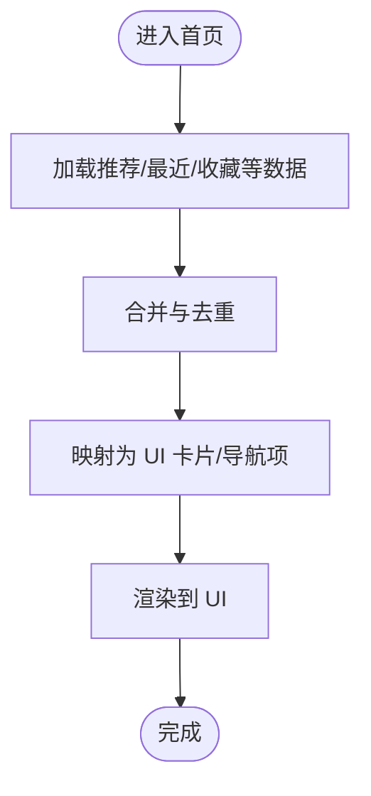
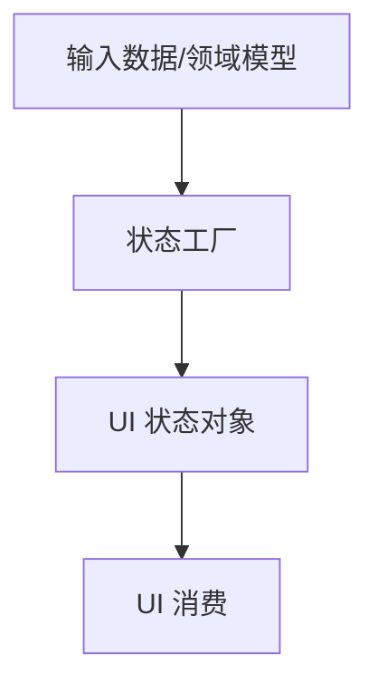
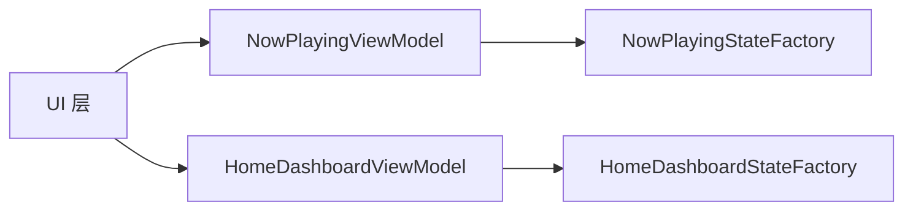

# 状态工厂模式

<cite>
**本文引用的文件**   
- [NowPlayingStateFactory.kt](file://app/src/main/java/app/yukine/now/NowPlayingStateFactory.kt)
- [HomeDashboardStateFactory.kt](file://app/src/main/java/app/yukine/dashboard/HomeDashboardStateFactory.kt)
- [NowPlayingViewModel.kt](file://app/src/main/java/app/yukine/MainActivityViewModels.kt)
- [HomeDashboardViewModel.kt](file://app/src/main/java/app/yukine/dashboard/HomeDashboardViewModel.kt)
- [NowPlayingStateFactoryTest.kt](file://app/src/test/java/app/yukine/now/NowPlayingStateFactoryTest.kt)
- [HomeDashboardStateFactoryTest.kt](file://app/src/test/java/app/yukine/dashboard/HomeDashboardStateFactoryTest.kt)
</cite>

## 目录
1. [简介](#简介)
2. [项目结构](#项目结构)
3. [核心组件](#核心组件)
4. [架构总览](#架构总览)
5. [详细组件分析](#详细组件分析)
6. [依赖关系分析](#依赖关系分析)
7. [性能考虑](#性能考虑)
8. [故障排查指南](#故障排查指南)
9. [结论](#结论)
10. [附录](#附录)

## 简介
本文件面向 Echo Android 应用中的“状态工厂模式”，聚焦于 NowPlayingStateFactory、HomeDashboardStateFactory 等状态工厂的设计原理与实现方式。文档将阐明：
- 状态工厂的职责分离原则：状态计算、数据转换、UI 状态映射
- 状态工厂与 ViewModel 的协作关系
- 如何通过工厂模式提升可测试性与可维护性
- 自定义状态工厂的使用示例与复杂状态转换处理建议

## 项目结构
围绕状态工厂的相关代码主要分布在 app 模块中，涉及播放界面（Now Playing）与首页仪表盘（Home Dashboard）两个特性域。每个特性域通常包含：
- 状态工厂：负责将领域模型转换为 UI 层可直接消费的状态对象
- ViewModel：持有并组合多个状态工厂，暴露给 UI 层
- 单测：针对状态工厂的纯函数式逻辑进行覆盖

图表来源
- [NowPlayingStateFactory.kt](file://app/src/main/java/app/yukine/now/NowPlayingStateFactory.kt)
- [HomeDashboardStateFactory.kt](file://app/src/main/java/app/yukine/dashboard/HomeDashboardStateFactory.kt)
- [NowPlayingViewModel.kt](file://app/src/main/java/app/yukine/MainActivityViewModels.kt)
- [HomeDashboardViewModel.kt](file://app/src/main/java/app/yukine/dashboard/HomeDashboardViewModel.kt)

章节来源
- [NowPlayingStateFactory.kt](file://app/src/main/java/app/yukine/now/NowPlayingStateFactory.kt)
- [HomeDashboardStateFactory.kt](file://app/src/main/java/app/yukine/dashboard/HomeDashboardStateFactory.kt)
- [NowPlayingViewModel.kt](file://app/src/main/java/app/yukine/MainActivityViewModels.kt)
- [HomeDashboardViewModel.kt](file://app/src/main/java/app/yukine/dashboard/HomeDashboardViewModel.kt)

## 核心组件
- 状态工厂（State Factory）
  - 职责：接收领域模型或原始数据，执行状态计算与数据转换，输出 UI 友好的状态对象
  - 特点：无副作用、幂等、可组合、易于单测
- ViewModel
  - 职责：聚合多个状态工厂，订阅数据源变化，触发状态重算，向 UI 暴露稳定状态流
  - 特点：生命周期感知、避免在 UI 中直接做复杂计算

章节来源
- [NowPlayingStateFactory.kt](file://app/src/main/java/app/yukine/now/NowPlayingStateFactory.kt)
- [HomeDashboardStateFactory.kt](file://app/src/main/java/app/yukine/dashboard/HomeDashboardStateFactory.kt)
- [NowPlayingViewModel.kt](file://app/src/main/java/app/yukine/MainActivityViewModels.kt)
- [HomeDashboardViewModel.kt](file://app/src/main/java/app/yukine/dashboard/HomeDashboardViewModel.kt)

## 架构总览
状态工厂模式在 MVVM 中的位置如下：
- 数据层提供领域模型或原始数据
- ViewModel 组合一个或多个状态工厂，将数据转换为 UI 状态
- UI 仅消费状态对象，不关心内部计算细节

图表来源
- [NowPlayingViewModel.kt](file://app/src/main/java/app/yukine/MainActivityViewModels.kt)
- [HomeDashboardViewModel.kt](file://app/src/main/java/app/yukine/dashboard/HomeDashboardViewModel.kt)
- [NowPlayingStateFactory.kt](file://app/src/main/java/app/yukine/now/NowPlayingStateFactory.kt)
- [HomeDashboardStateFactory.kt](file://app/src/main/java/app/yukine/dashboard/HomeDashboardStateFactory.kt)

## 详细组件分析

### NowPlayingStateFactory 分析
- 设计目标
  - 将播放相关的领域模型（如当前曲目、播放进度、队列信息、网络状态等）转换为 NowPlaying 界面的 UI 状态
  - 将复杂的条件判断与格式化逻辑从 ViewModel 和 UI 中剥离
- 关键职责
  - 状态计算：根据输入数据推导最终 UI 可见状态
  - 数据转换：时间、文本、图标资源等格式化处理
  - UI 状态映射：输出 UI 层可直接绑定的不可变状态对象
- 与 ViewModel 协作
  - ViewModel 订阅数据源，收集必要输入，调用状态工厂生成 UI 状态
  - ViewModel 负责调度与缓存策略，状态工厂保持纯函数式
- 可测试性
  - 通过单元测试对多种输入组合进行断言，确保边界条件与异常路径正确
  - 无需 Android 框架依赖，便于快速运行与并行执行

图表来源
- [NowPlayingStateFactory.kt](file://app/src/main/java/app/yukine/now/NowPlayingStateFactory.kt)
- [NowPlayingViewModel.kt](file://app/src/main/java/app/yukine/MainActivityViewModels.kt)

章节来源
- [NowPlayingStateFactory.kt](file://app/src/main/java/app/yukine/now/NowPlayingStateFactory.kt)
- [NowPlayingViewModel.kt](file://app/src/main/java/app/yukine/MainActivityViewModels.kt)
- [NowPlayingStateFactoryTest.kt](file://app/src/test/java/app/yukine/now/NowPlayingStateFactoryTest.kt)

### HomeDashboardStateFactory 分析
- 设计目标
  - 将首页仪表盘所需的聚合数据（推荐、最近播放、收藏、分类入口等）转换为 UI 状态
  - 统一处理空态、加载态、错误态等展示逻辑
- 关键职责
  - 多数据源合并：将多个列表/集合按规则拼接、去重、排序
  - 状态映射：将业务语义映射为 UI 卡片、按钮、导航项等
- 与 ViewModel 协作
  - ViewModel 负责拉取数据、错误重试、分页加载；状态工厂专注呈现逻辑
- 可测试性
  - 针对复杂合并与边界场景编写用例，保证 UI 行为稳定

图表来源
- [HomeDashboardStateFactory.kt](file://app/src/main/java/app/yukine/dashboard/HomeDashboardStateFactory.kt)
- [HomeDashboardViewModel.kt](file://app/src/main/java/app/yukine/dashboard/HomeDashboardViewModel.kt)

章节来源
- [HomeDashboardStateFactory.kt](file://app/src/main/java/app/yukine/dashboard/HomeDashboardStateFactory.kt)
- [HomeDashboardViewModel.kt](file://app/src/main/java/app/yukine/dashboard/HomeDashboardViewModel.kt)
- [HomeDashboardStateFactoryTest.kt](file://app/src/test/java/app/yukine/dashboard/HomeDashboardStateFactoryTest.kt)

### 概念总览
状态工厂模式的核心思想是将“如何把数据变成 UI 状态”的逻辑集中化、模块化与可测试化。其优势包括：
- 单一职责：状态工厂只关注状态计算与映射
- 可组合：多个状态工厂可按需组合，形成更复杂的 UI 状态
- 可替换：不同实现可被注入，便于 A/B 测试或平台差异化
- 可测试：纯函数式逻辑易于断言与回归

[此图为概念流程，不直接对应具体源码文件]

## 依赖关系分析
- 内聚与耦合
  - 状态工厂之间低耦合，各自独立处理特定领域的状态转换
  - ViewModel 作为协调者，组合多个状态工厂，降低 UI 层的复杂度
- 外部依赖
  - 状态工厂应避免直接依赖 Android 框架，必要时通过接口抽象
  - ViewModel 可依赖数据层、存储层、网络层等
- 循环依赖
  - 通过单向依赖（UI -> ViewModel -> StateFactory）避免循环引用

图表来源
- [NowPlayingViewModel.kt](file://app/src/main/java/app/yukine/MainActivityViewModels.kt)
- [HomeDashboardViewModel.kt](file://app/src/main/java/app/yukine/dashboard/HomeDashboardViewModel.kt)
- [NowPlayingStateFactory.kt](file://app/src/main/java/app/yukine/now/NowPlayingStateFactory.kt)
- [HomeDashboardStateFactory.kt](file://app/src/main/java/app/yukine/dashboard/HomeDashboardStateFactory.kt)

章节来源
- [NowPlayingViewModel.kt](file://app/src/main/java/app/yukine/MainActivityViewModels.kt)
- [HomeDashboardViewModel.kt](file://app/src/main/java/app/yukine/dashboard/HomeDashboardViewModel.kt)
- [NowPlayingStateFactory.kt](file://app/src/main/java/app/yukine/now/NowPlayingStateFactory.kt)
- [HomeDashboardStateFactory.kt](file://app/src/main/java/app/yukine/dashboard/HomeDashboardStateFactory.kt)

## 性能考虑
- 状态计算尽量轻量，避免在状态工厂中进行耗时 I/O 操作
- 利用不可变状态对象与差异更新，减少不必要的重组
- 在 ViewModel 层引入必要的缓存与防抖策略，降低重复计算
- 对大数据集合并与排序进行优化，必要时分片或懒加载

## 故障排查指南
- 常见问题
  - 状态未更新：检查 ViewModel 是否正确订阅数据源并触发状态重算
  - UI 显示异常：核对状态工厂的边界条件与空值处理
  - 性能问题：定位状态工厂中的耗时逻辑，拆分或异步化
- 调试建议
  - 为状态工厂添加日志或断点，验证输入输出是否符合预期
  - 使用单测覆盖异常路径，确保稳定性

章节来源
- [NowPlayingStateFactoryTest.kt](file://app/src/test/java/app/yukine/now/NowPlayingStateFactoryTest.kt)
- [HomeDashboardStateFactoryTest.kt](file://app/src/test/java/app/yukine/dashboard/HomeDashboardStateFactoryTest.kt)

## 结论
状态工厂模式通过将状态计算与 UI 映射逻辑解耦，显著提升了代码的可读性、可测试性与可维护性。结合 ViewModel 的组合能力，可以在复杂业务场景中保持清晰的职责边界与稳定的状态流。

## 附录
- 自定义状态工厂创建步骤
  - 定义输入数据结构与输出 UI 状态对象
  - 在状态工厂中实现纯函数式的计算与映射逻辑
  - 在 ViewModel 中组合该工厂，并在数据变化时触发重算
  - 编写单测覆盖正常路径与边界条件
- 复杂状态转换处理建议
  - 将复杂逻辑拆分为多个小工厂，逐步组合
  - 使用中间状态对象表达过渡态，避免一次性大对象
  - 对易错分支增加单测与日志，便于回归与排障