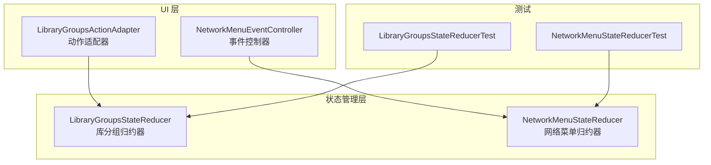
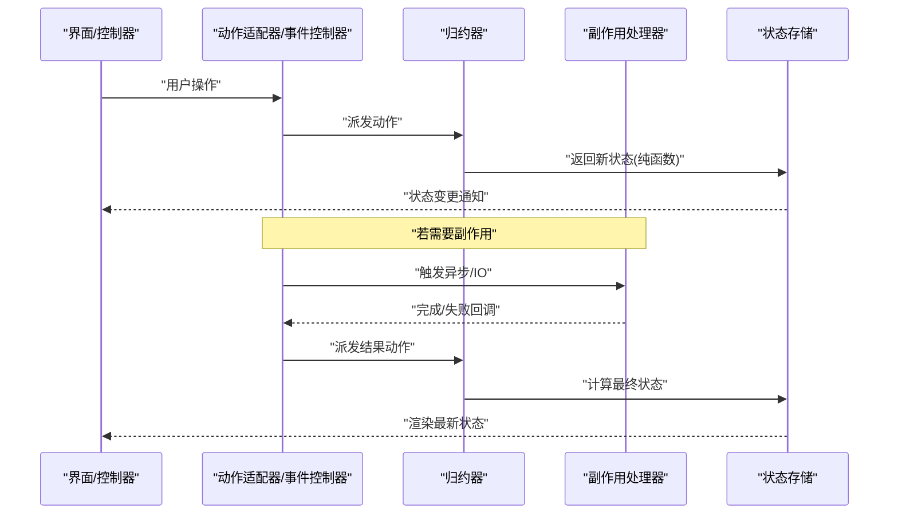
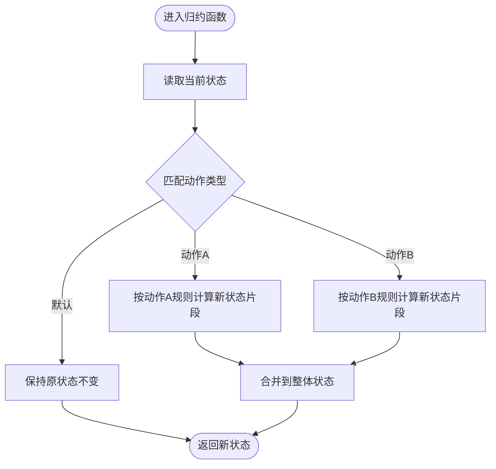
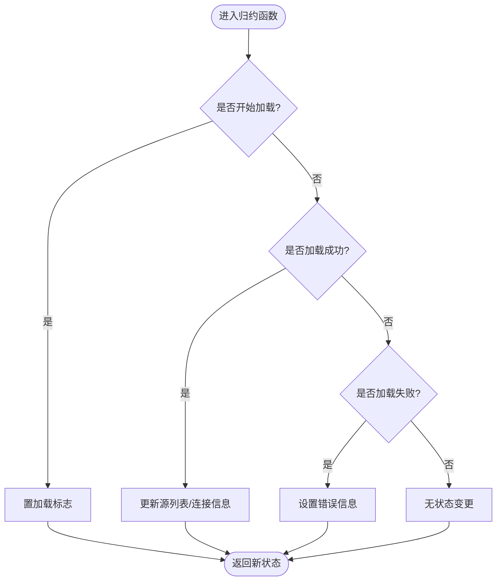
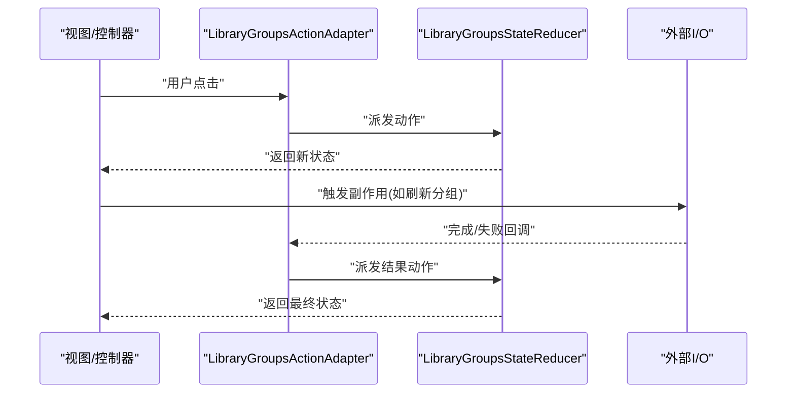
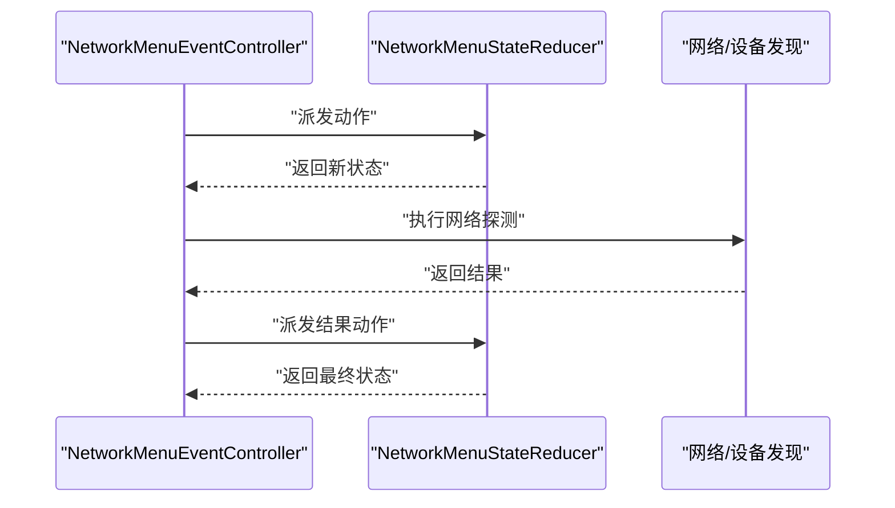
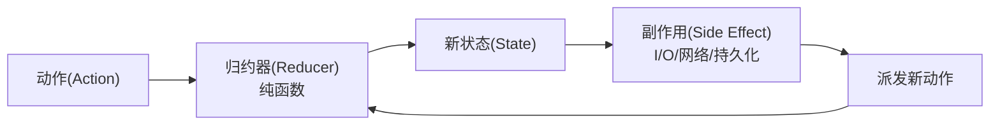
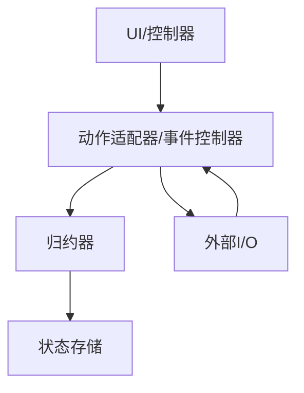

# 状态归约器模式

<cite>
**本文引用的文件**   
- [LibraryGroupsStateReducer.kt](file://app/src/main/java/app/yukine/LibraryGroupsStateReducer.kt)
- [NetworkMenuStateReducer.kt](file://app/src/main/java/app/yukine/NetworkMenuStateReducer.kt)
- [LibraryGroupsActionAdapter.kt](file://app/src/main/java/app/yukine/LibraryGroupsActionAdapter.kt)
- [NetworkMenuEventController.kt](file://app/src/main/java/app/yukine/NetworkMenuEventController.kt)
- [LibraryGroupsStateReducerTest.kt](file://app/src/test/java/app/yukine/LibraryGroupsStateReducerTest.kt)
- [NetworkMenuStateReducerTest.kt](file://app/src/test/java/app/yukine/NetworkMenuStateReducerTest.kt)
</cite>

## 目录
1. [简介](#简介)
2. [项目结构](#项目结构)
3. [核心组件](#核心组件)
4. [架构总览](#架构总览)
5. [详细组件分析](#详细组件分析)
6. [依赖分析](#依赖分析)
7. [性能考虑](#性能考虑)
8. [故障排查指南](#故障排查指南)
9. [结论](#结论)
10. [附录](#附录)

## 简介
本文件面向 Echo Android 应用，系统化阐述“状态归约器模式”的设计思想与实现机制。重点围绕 LibraryGroupsStateReducer、NetworkMenuStateReducer 等归约器，解释其如何遵循单向数据流原则：动作分发 → 纯函数计算新状态 → 副作用处理。文档同时说明该模式如何确保状态变更的可预测性与可追踪性，并给出在 Android 环境下适配 Redux 风格架构的实践要点与示例路径。

## 项目结构
为聚焦归约器模式，本节仅列出与本主题直接相关的源文件与测试文件，便于读者快速定位。

图表来源
- [LibraryGroupsActionAdapter.kt:1-200](file://app/src/main/java/app/yukine/LibraryGroupsActionAdapter.kt#L1-L200)
- [NetworkMenuEventController.kt:1-200](file://app/src/main/java/app/yukine/NetworkMenuEventController.kt#L1-L200)
- [LibraryGroupsStateReducer.kt:1-200](file://app/src/main/java/app/yukine/LibraryGroupsStateReducer.kt#L1-L200)
- [NetworkMenuStateReducer.kt:1-200](file://app/src/main/java/app/yukine/NetworkMenuStateReducer.kt#L1-L200)

章节来源
- [LibraryGroupsActionAdapter.kt:1-200](file://app/src/main/java/app/yukine/LibraryGroupsActionAdapter.kt#L1-L200)
- [NetworkMenuEventController.kt:1-200](file://app/src/main/java/app/yukine/NetworkMenuEventController.kt#L1-L200)
- [LibraryGroupsStateReducer.kt:1-200](file://app/src/main/java/app/yukine/LibraryGroupsStateReducer.kt#L1-L200)
- [NetworkMenuStateReducer.kt:1-200](file://app/src/main/java/app/yukine/NetworkMenuStateReducer.kt#L1-L200)

## 核心组件
- 归约器（Reducer）
  - 职责：接收当前状态与一个不可变动作，返回新的状态；不包含副作用，保证纯函数特性。
  - 关键属性：输入（旧状态 + 动作）、输出（新状态）、确定性（相同输入必得相同输出）。
- 动作（Action）
  - 职责：描述一次用户或系统意图的“发生了什么”。通常以密封类/枚举表示多种动作类型。
- 动作适配器/事件控制器
  - 职责：将 UI 交互转换为统一的动作，并分发给对应的归约器。
- 副作用处理
  - 职责：在归约器之外执行 I/O、网络、持久化等副作用，并通过派发新动作触发状态更新。

章节来源
- [LibraryGroupsStateReducer.kt:1-200](file://app/src/main/java/app/yukine/LibraryGroupsStateReducer.kt#L1-L200)
- [NetworkMenuStateReducer.kt:1-200](file://app/src/main/java/app/yukine/NetworkMenuStateReducer.kt#L1-L200)
- [LibraryGroupsActionAdapter.kt:1-200](file://app/src/main/java/app/yukine/LibraryGroupsActionAdapter.kt#L1-L200)
- [NetworkMenuEventController.kt:1-200](file://app/src/main/java/app/yukine/NetworkMenuEventController.kt#L1-L200)

## 架构总览
下图展示基于归约器的单向数据流：UI 产生动作 → 归约器计算新状态 → 副作用在外部处理 → 再次派发动作驱动状态演进。

图表来源
- [LibraryGroupsActionAdapter.kt:1-200](file://app/src/main/java/app/yukine/LibraryGroupsActionAdapter.kt#L1-L200)
- [NetworkMenuEventController.kt:1-200](file://app/src/main/java/app/yukine/NetworkMenuEventController.kt#L1-L200)
- [LibraryGroupsStateReducer.kt:1-200](file://app/src/main/java/app/yukine/LibraryGroupsStateReducer.kt#L1-L200)
- [NetworkMenuStateReducer.kt:1-200](file://app/src/main/java/app/yukine/NetworkMenuStateReducer.kt#L1-L200)

## 详细组件分析

### LibraryGroupsStateReducer（库分组归约器）
- 设计目标
  - 管理“库分组”相关 UI 状态，如分组列表、选中项、加载态、错误信息等。
  - 通过纯函数对动作进行匹配，生成确定性的新状态。
- 关键流程
  - 初始化：构建初始状态。
  - 动作处理：根据动作类型切换分支，合并或替换局部状态。
  - 副作用：由上层控制器发起网络/磁盘 IO，完成后派发成功/失败动作，再由归约器更新状态。
- 可测试性
  - 由于归约器是纯函数，可直接传入不同动作序列断言最终状态，无需模拟 I/O。

图表来源
- [LibraryGroupsStateReducer.kt:1-200](file://app/src/main/java/app/yukine/LibraryGroupsStateReducer.kt#L1-L200)

章节来源
- [LibraryGroupsStateReducer.kt:1-200](file://app/src/main/java/app/yukine/LibraryGroupsStateReducer.kt#L1-L200)
- [LibraryGroupsStateReducerTest.kt:1-200](file://app/src/test/java/app/yukine/LibraryGroupsStateReducerTest.kt#L1-L200)

### NetworkMenuStateReducer（网络菜单归约器）
- 设计目标
  - 管理网络菜单相关状态，例如连接状态、可用源列表、错误提示、加载指示等。
  - 与网络请求生命周期配合，确保 UI 始终反映一致的状态。
- 关键流程
  - 初始化：设置默认菜单可见性、空列表、未连接等初始值。
  - 动作处理：区分“开始加载”、“加载成功”、“加载失败”、“选择源”等动作，分别更新对应字段。
  - 副作用：由控制器负责发起网络探测/鉴权，成功后派发“加载成功”，失败派发“加载失败”。
- 可观测性
  - 每个动作都明确映射到状态变化，便于日志记录与回放调试。

图表来源
- [NetworkMenuStateReducer.kt:1-200](file://app/src/main/java/app/yukine/NetworkMenuStateReducer.kt#L1-L200)

章节来源
- [NetworkMenuStateReducer.kt:1-200](file://app/src/main/java/app/yukine/NetworkMenuStateReducer.kt#L1-L200)
- [NetworkMenuStateReducerTest.kt:1-200](file://app/src/test/java/app/yukine/NetworkMenuStateReducerTest.kt#L1-L200)

### 动作分发与副作用处理（以 LibraryGroups 为例）
- 动作定义
  - 使用统一的动作类型集合表达所有可能的状态变更意图。
- 分发流程
  - UI 点击 → 动作适配器封装动作 → 调用归约器 → 返回新状态 → 通知 UI 刷新。
- 副作用处理
  - 当需要访问外部资源时，由控制器发起异步任务，并在回调中派发“结果动作”，由归约器更新状态。

图表来源
- [LibraryGroupsActionAdapter.kt:1-200](file://app/src/main/java/app/yukine/LibraryGroupsActionAdapter.kt#L1-L200)
- [LibraryGroupsStateReducer.kt:1-200](file://app/src/main/java/app/yukine/LibraryGroupsStateReducer.kt#L1-L200)

章节来源
- [LibraryGroupsActionAdapter.kt:1-200](file://app/src/main/java/app/yukine/LibraryGroupsActionAdapter.kt#L1-L200)
- [LibraryGroupsStateReducer.kt:1-200](file://app/src/main/java/app/yukine/LibraryGroupsStateReducer.kt#L1-L200)

### 动作分发与副作用处理（以 NetworkMenu 为例）
- 动作定义
  - 包含“打开菜单”、“关闭菜单”、“开始扫描”、“扫描完成”、“扫描失败”等。
- 分发流程
  - 事件控制器捕获 UI 事件，构造动作并交给归约器处理。
- 副作用处理
  - 控制器负责网络探测与鉴权，完成后派发相应动作，归约器据此更新菜单状态。

图表来源
- [NetworkMenuEventController.kt:1-200](file://app/src/main/java/app/yukine/NetworkMenuEventController.kt#L1-L200)
- [NetworkMenuStateReducer.kt:1-200](file://app/src/main/java/app/yukine/NetworkMenuStateReducer.kt#L1-L200)

章节来源
- [NetworkMenuEventController.kt:1-200](file://app/src/main/java/app/yukine/NetworkMenuEventController.kt#L1-L200)
- [NetworkMenuStateReducer.kt:1-200](file://app/src/main/java/app/yukine/NetworkMenuStateReducer.kt#L1-L200)

### 概念总览（不绑定具体源码）
- 单向数据流
  - 动作是唯一的变更入口；归约器只负责计算；副作用在外部执行。
- 可预测性
  - 纯函数保证相同输入得到相同输出，便于单元测试与回归验证。
- 可追踪性
  - 每次状态变更都可追溯到具体动作，支持时间旅行调试与审计。

[此图为概念示意，不附带图表来源]

## 依赖分析
- 耦合关系
  - 动作适配器/事件控制器与归约器之间通过“动作契约”解耦，降低 UI 与状态逻辑的直接依赖。
  - 归约器不依赖任何外部 I/O，提升内聚性与可测试性。
- 外部依赖
  - 副作用处理可能依赖网络、文件系统、系统服务等，这些应在控制器或服务层集中管理。

图表来源
- [LibraryGroupsActionAdapter.kt:1-200](file://app/src/main/java/app/yukine/LibraryGroupsActionAdapter.kt#L1-L200)
- [NetworkMenuEventController.kt:1-200](file://app/src/main/java/app/yukine/NetworkMenuEventController.kt#L1-L200)
- [LibraryGroupsStateReducer.kt:1-200](file://app/src/main/java/app/yukine/LibraryGroupsStateReducer.kt#L1-L200)
- [NetworkMenuStateReducer.kt:1-200](file://app/src/main/java/app/yukine/NetworkMenuStateReducer.kt#L1-L200)

章节来源
- [LibraryGroupsActionAdapter.kt:1-200](file://app/src/main/java/app/yukine/LibraryGroupsActionAdapter.kt#L1-L200)
- [NetworkMenuEventController.kt:1-200](file://app/src/main/java/app/yukine/NetworkMenuEventController.kt#L1-L200)
- [LibraryGroupsStateReducer.kt:1-200](file://app/src/main/java/app/yukine/LibraryGroupsStateReducer.kt#L1-L200)
- [NetworkMenuStateReducer.kt:1-200](file://app/src/main/java/app/yukine/NetworkMenuStateReducer.kt#L1-L200)

## 性能考虑
- 归约器应保持轻量与纯函数特性，避免阻塞主线程。
- 大对象更新建议使用不可变数据结构与增量合并策略，减少不必要的重建。
- 副作用应批量合并与去抖，避免频繁派发动作导致 UI 抖动。
- 对热点状态可使用快照或差异比较，仅在必要时触发重绘。

[本节提供通用指导，不附带章节来源]

## 故障排查指南
- 常见问题
  - 状态不一致：检查是否存在非纯函数的状态修改或并发写入。
  - 副作用未派发结果动作：确认回调路径是否正确派发成功/失败动作。
  - UI 未刷新：确认状态变更后是否有正确的订阅与通知机制。
- 定位方法
  - 利用单元测试覆盖关键动作序列，复现问题路径。
  - 在控制器层增加动作派发与副作用结果的日志埋点。
  - 使用状态快照对比工具，定位异常分支。

章节来源
- [LibraryGroupsStateReducerTest.kt:1-200](file://app/src/test/java/app/yukine/LibraryGroupsStateReducerTest.kt#L1-L200)
- [NetworkMenuStateReducerTest.kt:1-200](file://app/src/test/java/app/yukine/NetworkMenuStateReducerTest.kt#L1-L200)

## 结论
通过引入归约器模式，Echo Android 应用在状态管理方面实现了清晰的单向数据流、纯函数计算与副作用隔离。LibraryGroupsStateReducer 与 NetworkMenuStateReducer 展示了如何在不同业务域中复用同一套模式，从而提升代码的可维护性、可测试性与可追踪性。结合动作适配器/事件控制器，UI 与状态逻辑有效解耦，为后续扩展与重构奠定了坚实基础。

[本节为总结性内容，不附带章节来源]

## 附录
- 实践建议
  - 动作类型采用密封类/枚举，确保穷尽匹配。
  - 归约函数按动作分支组织，保持单一职责。
  - 副作用集中在控制器或服务层，避免侵入归约器。
  - 为关键状态编写端到端测试，覆盖正常与异常路径。
- 参考路径
  - 动作适配器示例：[LibraryGroupsActionAdapter.kt](file://app/src/main/java/app/yukine/LibraryGroupsActionAdapter.kt)
  - 事件控制器示例：[NetworkMenuEventController.kt](file://app/src/main/java/app/yukine/NetworkMenuEventController.kt)
  - 归约器示例：[LibraryGroupsStateReducer.kt](file://app/src/main/java/app/yukine/LibraryGroupsStateReducer.kt)、[NetworkMenuStateReducer.kt](file://app/src/main/java/app/yukine/NetworkMenuStateReducer.kt)
  - 单元测试示例：[LibraryGroupsStateReducerTest.kt](file://app/src/test/java/app/yukine/LibraryGroupsStateReducerTest.kt)、[NetworkMenuStateReducerTest.kt](file://app/src/test/java/app/yukine/NetworkMenuStateReducerTest.kt)