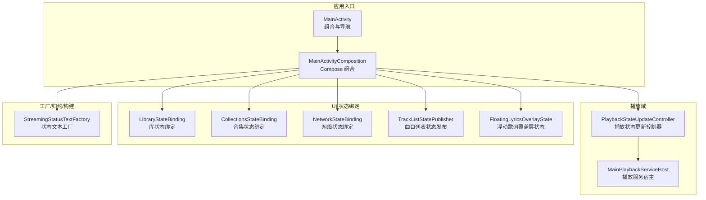
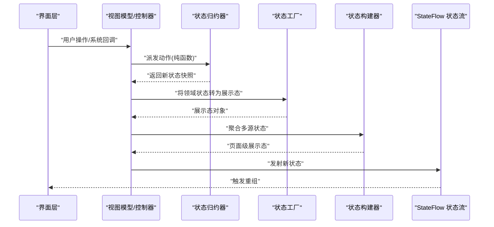
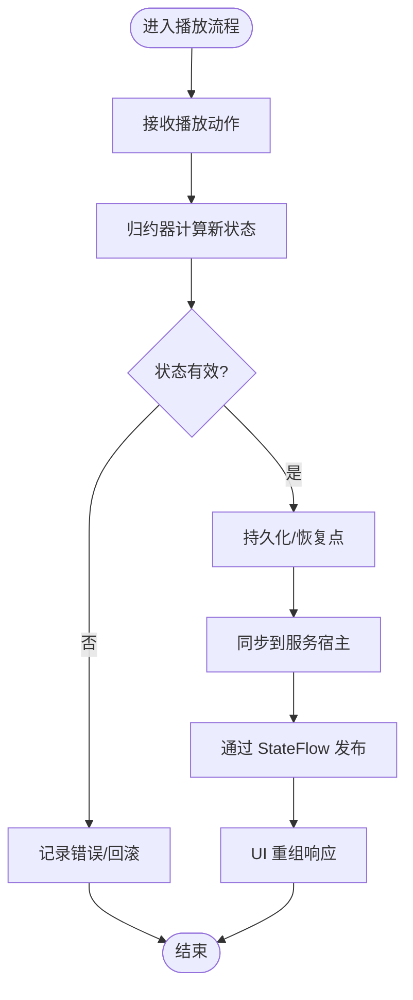
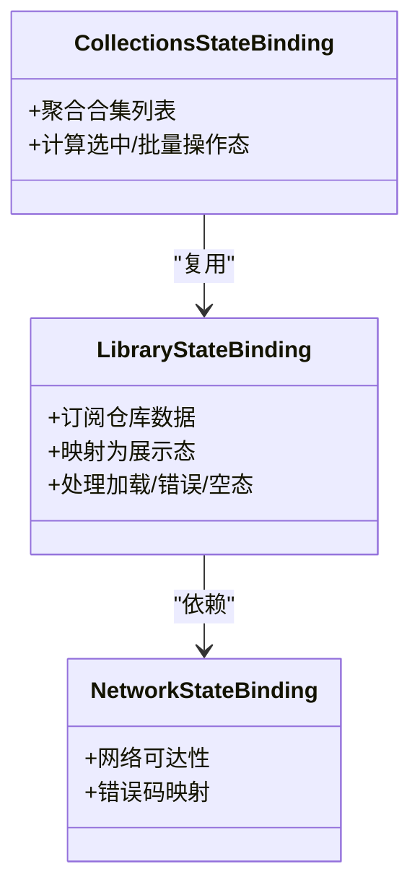
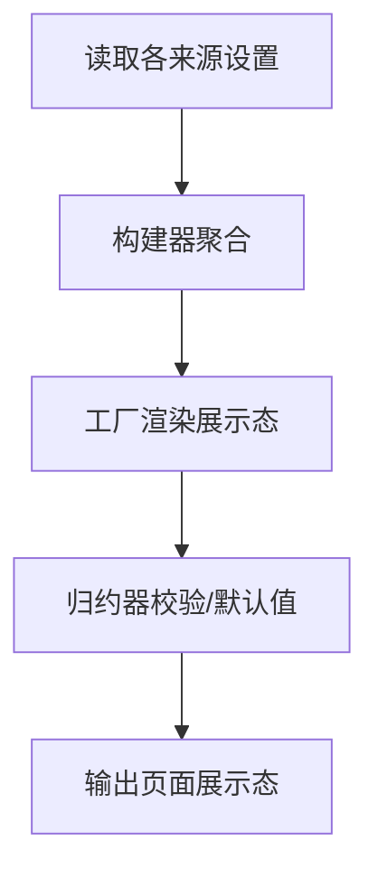
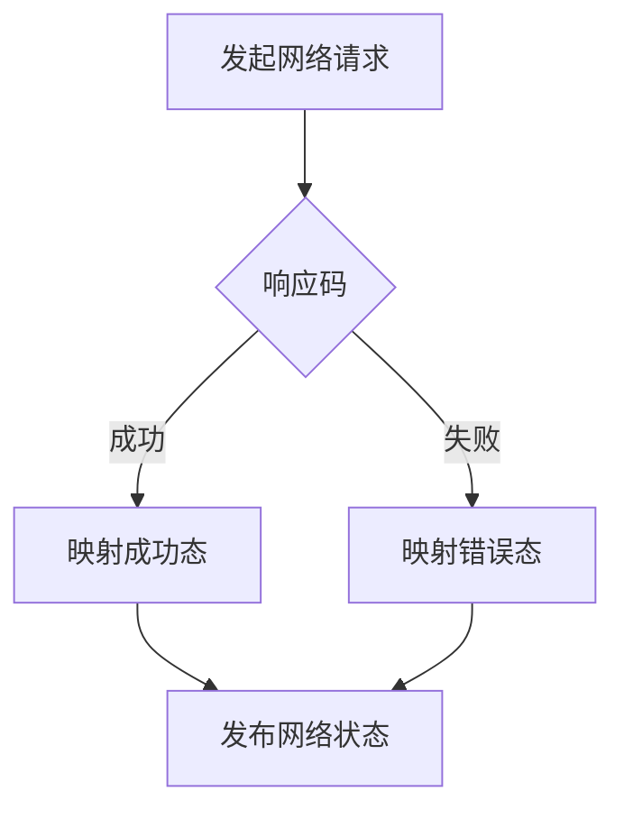
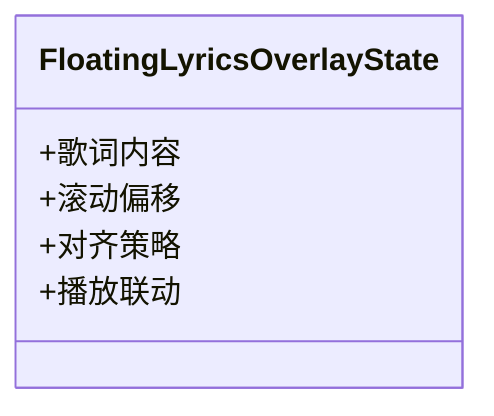
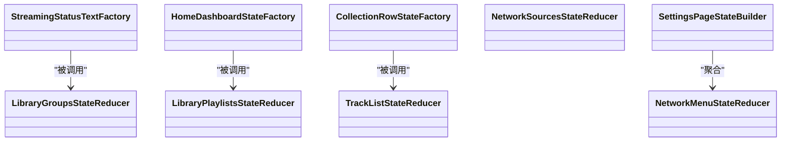
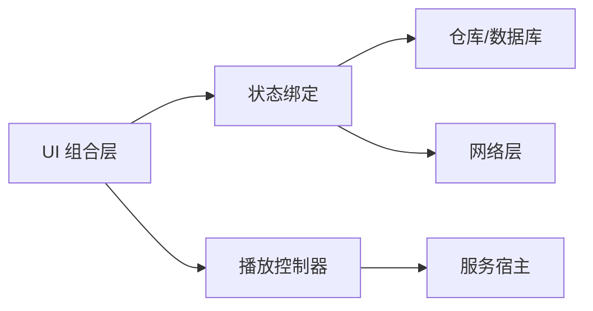

# 状态管理模式

<cite>
**本文引用的文件**   
- [MainActivity.kt](file://app/src/main/java/app/yukine/MainActivity.kt)
- [MainActivityComposition.kt](file://app/src/main/java/app/yukine/MainActivityComposition.kt)
- [PlaybackStateUpdateController.kt](file://app/src/main/java/app/yukine/PlaybackStateUpdateController.kt)
- [MainPlaybackServiceHost.kt](file://app/src/main/java/app/yukine/MainPlaybackServiceHost.kt)
- [NowPlayingViewModelTest.kt](file://app/src/test/java/app/yukine/now/NowPlayingViewModelTest.kt)
- [LibraryStateBinding.kt](file://app/src/main/java/app/yukine/LibraryStateBinding.kt)
- [CollectionsStateBinding.kt](file://app/src/main/java/app/yukine/CollectionsStateBinding.kt)
- [NetworkStateBinding.kt](file://app/src/main/java/app/yukine/NetworkStateBinding.kt)
- [TrackListStatePublisher.kt](file://app/src/main/java/app/yukine/TrackListStatePublisher.kt)
- [FloatingLyricsOverlayState.kt](file://app/src/main/java/app/yukine/FloatingLyricsOverlayState.kt)
- [SettingsPageStateBuilderTest.kt](file://app/src/test/java/app/yukine/settings/SettingsPageStateBuilderTest.kt)
- [HomeDashboardStateFactoryTest.kt](file://app/src/test/java/app/yukine/dashboard/HomeDashboardStateFactoryTest.kt)
- [CollectionRowStateFactoryTest.kt](file://app/src/test/java/app/yukine/collections/CollectionRowStateFactoryTest.kt)
- [LibraryGroupsStateReducerTest.kt](file://app/src/test/java/app/yukine/library/LibraryGroupsStateReducerTest.kt)
- [LibraryPlaylistsStateReducerTest.kt](file://app/src/test/java/app/yukine/library/LibraryPlaylistsStateReducerTest.kt)
- [NetworkMenuStateReducerTest.kt](file://app/src/test/java/app/yukine/network/NetworkMenuStateReducerTest.kt)
- [NetworkSourcesStateReducerTest.kt](file://app/src/test/java/app/yukine/network/NetworkSourcesStateReducerTest.kt)
- [TrackListStateReducerTest.kt](file://app/src/test/java/app/yukine/queue/TrackListStateReducerTest.kt)
- [StreamingStatusTextFactory.kt](file://app/src/main/java/app/yukine/StreamingStatusTextFactory.kt)
</cite>

## 目录
1. [简介](#简介)
2. [项目结构](#项目结构)
3. [核心组件](#核心组件)
4. [架构总览](#架构总览)
5. [详细组件分析](#详细组件分析)
6. [依赖分析](#依赖分析)
7. [性能考量](#性能考量)
8. [故障排查指南](#故障排查指南)
9. [结论](#结论)
10. [附录](#附录)

## 简介
本文件面向 Echo Android 应用的状态管理，系统性梳理并文档化以下主题：
- 状态容器选型与使用场景：StateFlow、State、MutableState 等
- 设计模式落地：状态工厂（StateFactory）、状态归约器（StateReducer）、状态构建器（StateBuilder）
- 关键业务域状态：播放状态、库状态、设置状态、网络状态、浮动歌词覆盖层状态等
- 高级特性：状态持久化、状态恢复、状态同步
- 状态流转图与转换示例，帮助理解复杂状态逻辑

## 项目结构
从模块划分看，状态相关代码主要分布在 app 主工程与 feature 模块中：
- app 层负责 UI 组合、状态绑定、跨进程服务通信与宿主桥接
- feature 模块（如 playback、library-ui、streaming-ui、settings-ui）承载领域状态与展示态
- test 目录包含大量针对 StateFactory、StateReducer、StateBuilder 的单元测试，体现“可测试性优先”的状态设计

图示来源
- [MainActivity.kt](file://app/src/main/java/app/yukine/MainActivity.kt)
- [MainActivityComposition.kt](file://app/src/main/java/app/yukine/MainActivityComposition.kt)
- [PlaybackStateUpdateController.kt](file://app/src/main/java/app/yukine/PlaybackStateUpdateController.kt)
- [MainPlaybackServiceHost.kt](file://app/src/main/java/app/yukine/MainPlaybackServiceHost.kt)
- [LibraryStateBinding.kt](file://app/src/main/java/app/yukine/LibraryStateBinding.kt)
- [CollectionsStateBinding.kt](file://app/src/main/java/app/yukine/CollectionsStateBinding.kt)
- [NetworkStateBinding.kt](file://app/src/main/java/app/yukine/NetworkStateBinding.kt)
- [TrackListStatePublisher.kt](file://app/src/main/java/app/yukine/TrackListStatePublisher.kt)
- [FloatingLyricsOverlayState.kt](file://app/src/main/java/app/yukine/FloatingLyricsOverlayState.kt)
- [StreamingStatusTextFactory.kt](file://app/src/main/java/app/yukine/StreamingStatusTextFactory.kt)

章节来源
- [MainActivity.kt](file://app/src/main/java/app/yukine/MainActivity.kt)
- [MainActivityComposition.kt](file://app/src/main/java/app/yukine/MainActivityComposition.kt)

## 核心组件
- 状态容器
  - StateFlow：用于跨层/跨进程广播不可变状态流，典型于播放状态、网络状态、列表数据流
  - State/MutableState：Compose 本地状态，适合单屏或小组件内局部 UI 状态
- 设计模式
  - 状态工厂（StateFactory）：将外部事件/输入转换为展示态，解耦业务与展示
  - 状态归约器（StateReducer）：以纯函数方式根据当前状态与动作计算新状态，保证可预测性与可测试性
  - 状态构建器（StateBuilder）：聚合多个子状态源，组装为页面级展示态
- 关键状态域
  - 播放状态：由播放控制器与服务宿主协同维护，通过更新控制器对外暴露
  - 库状态：通过状态绑定将仓库/数据库变化映射到 UI 展示态
  - 设置状态：通过设置页状态构建器聚合多来源配置项
  - 网络状态：统一网络能力与错误码映射到 UI 友好提示
  - 浮动歌词覆盖层状态：独立覆盖层的全局可见状态

章节来源
- [PlaybackStateUpdateController.kt](file://app/src/main/java/app/yukine/PlaybackStateUpdateController.kt)
- [MainPlaybackServiceHost.kt](file://app/src/main/java/app/yukine/MainPlaybackServiceHost.kt)
- [LibraryStateBinding.kt](file://app/src/main/java/app/yukine/LibraryStateBinding.kt)
- [CollectionsStateBinding.kt](file://app/src/main/java/app/yukine/CollectionsStateBinding.kt)
- [NetworkStateBinding.kt](file://app/src/main/java/app/yukine/NetworkStateBinding.kt)
- [TrackListStatePublisher.kt](file://app/src/main/java/app/yukine/TrackListStatePublisher.kt)
- [FloatingLyricsOverlayState.kt](file://app/src/main/java/app/yukine/FloatingLyricsOverlayState.kt)
- [StreamingStatusTextFactory.kt](file://app/src/main/java/app/yukine/StreamingStatusTextFactory.kt)

## 架构总览
Echo 的状态架构遵循“单向数据流 + 可测试驱动”的原则：
- 事件进入控制器/归约器，产生新状态
- 状态以不可变对象形式通过 StateFlow 下发至 UI
- UI 仅消费状态，不直接修改底层数据
- 跨进程播放状态通过宿主桥接进行同步

图示来源
- [PlaybackStateUpdateController.kt](file://app/src/main/java/app/yukine/PlaybackStateUpdateController.kt)
- [LibraryStateBinding.kt](file://app/src/main/java/app/yukine/LibraryStateBinding.kt)
- [CollectionsStateBinding.kt](file://app/src/main/java/app/yukine/CollectionsStateBinding.kt)
- [NetworkStateBinding.kt](file://app/src/main/java/app/yukine/NetworkStateBinding.kt)
- [TrackListStatePublisher.kt](file://app/src/main/java/app/yukine/TrackListStatePublisher.kt)
- [FloatingLyricsOverlayState.kt](file://app/src/main/java/app/yukine/FloatingLyricsOverlayState.kt)
- [StreamingStatusTextFactory.kt](file://app/src/main/java/app/yukine/StreamingStatusTextFactory.kt)

## 详细组件分析

### 播放状态管理
- 职责边界
  - 播放状态更新控制器：集中处理播放生命周期、队列变更、进度更新等，对外暴露稳定的状态流
  - 播放服务宿主：封装与后台服务的交互，屏蔽进程间差异
- 状态容器
  - 使用 StateFlow 暴露播放状态，确保 UI 在任意位置订阅一致
- 设计模式
  - 归约器：将播放事件（播放、暂停、下一首、跳转）映射为确定性状态转移
  - 工厂：将内部播放模型转换为 UI 友好的展示态（含按钮文案、图标、可用性）
- 状态同步
  - 通过宿主监听服务状态变化，合并到本地状态流，实现跨进程一致性

图示来源
- [PlaybackStateUpdateController.kt](file://app/src/main/java/app/yukine/PlaybackStateUpdateController.kt)
- [MainPlaybackServiceHost.kt](file://app/src/main/java/app/yukine/MainPlaybackServiceHost.kt)

章节来源
- [PlaybackStateUpdateController.kt](file://app/src/main/java/app/yukine/PlaybackStateUpdateController.kt)
- [MainPlaybackServiceHost.kt](file://app/src/main/java/app/yukine/MainPlaybackServiceHost.kt)
- [NowPlayingViewModelTest.kt](file://app/src/test/java/app/yukine/now/NowPlayingViewModelTest.kt)

### 库状态管理
- 状态来源
  - 本地数据库/仓库、网络同步、导入导出任务
- 状态绑定
  - LibraryStateBinding/CollectionsStateBinding 将仓库数据映射为 UI 展示态，屏蔽底层差异
- 归约与工厂
  - 对分组、搜索、筛选等复杂逻辑采用归约器；对展示文案、图标、排序策略采用工厂

图示来源
- [LibraryStateBinding.kt](file://app/src/main/java/app/yukine/LibraryStateBinding.kt)
- [CollectionsStateBinding.kt](file://app/src/main/java/app/yukine/CollectionsStateBinding.kt)
- [NetworkStateBinding.kt](file://app/src/main/java/app/yukine/NetworkStateBinding.kt)

章节来源
- [LibraryStateBinding.kt](file://app/src/main/java/app/yukine/LibraryStateBinding.kt)
- [CollectionsStateBinding.kt](file://app/src/main/java/app/yukine/CollectionsStateBinding.kt)
- [NetworkStateBinding.kt](file://app/src/main/java/app/yukine/NetworkStateBinding.kt)

### 设置状态管理
- 状态构建器
  - SettingsPageStateBuilder 聚合多来源设置项，生成页面级展示态
- 工厂与归约
  - 对开关、下拉选项、校验结果等进行工厂化与归约化处理，保证展示一致性

图示来源
- [SettingsPageStateBuilderTest.kt](file://app/src/test/java/app/yukine/settings/SettingsPageStateBuilderTest.kt)

章节来源
- [SettingsPageStateBuilderTest.kt](file://app/src/test/java/app/yukine/settings/SettingsPageStateBuilderTest.kt)

### 网络状态管理
- 统一网络能力与错误码映射
- 提供重试、降级、离线缓存提示等展示态

图示来源
- [NetworkStateBinding.kt](file://app/src/main/java/app/yukine/NetworkStateBinding.kt)

章节来源
- [NetworkStateBinding.kt](file://app/src/main/java/app/yukine/NetworkStateBinding.kt)

### 浮动歌词覆盖层状态
- 全局可见覆盖层状态，独立于主界面
- 与播放状态联动，显示歌词、滚动、对齐等

图示来源
- [FloatingLyricsOverlayState.kt](file://app/src/main/java/app/yukine/FloatingLyricsOverlayState.kt)

章节来源
- [FloatingLyricsOverlayState.kt](file://app/src/main/java/app/yukine/FloatingLyricsOverlayState.kt)

### 状态工厂/归约器/构建器实践
- 状态工厂
  - StreamingStatusTextFactory：将不同来源的状态文本标准化为 UI 友好文案
  - HomeDashboardStateFactory/CollectionRowStateFactory：将领域模型转为卡片/行展示态
- 状态归约器
  - LibraryGroupsStateReducer/LibraryPlaylistsStateReducer：对分组/歌单集合进行确定性的状态转换
  - NetworkMenuStateReducer/NetworkSourcesStateReducer：菜单与网络源状态归约
  - TrackListStateReducer：队列/曲目列表状态归约
- 状态构建器
  - SettingsPageStateBuilder：聚合设置项，生成页面态

图示来源
- [StreamingStatusTextFactory.kt](file://app/src/main/java/app/yukine/StreamingStatusTextFactory.kt)
- [HomeDashboardStateFactoryTest.kt](file://app/src/test/java/app/yukine/dashboard/HomeDashboardStateFactoryTest.kt)
- [CollectionRowStateFactoryTest.kt](file://app/src/test/java/app/yukine/collections/CollectionRowStateFactoryTest.kt)
- [LibraryGroupsStateReducerTest.kt](file://app/src/test/java/app/yukine/library/LibraryGroupsStateReducerTest.kt)
- [LibraryPlaylistsStateReducerTest.kt](file://app/src/test/java/app/yukine/library/LibraryPlaylistsStateReducerTest.kt)
- [NetworkMenuStateReducerTest.kt](file://app/src/test/java/app/yukine/network/NetworkMenuStateReducerTest.kt)
- [NetworkSourcesStateReducerTest.kt](file://app/src/test/java/app/yukine/network/NetworkSourcesStateReducerTest.kt)
- [TrackListStateReducerTest.kt](file://app/src/test/java/app/yukine/queue/TrackListStateReducerTest.kt)
- [SettingsPageStateBuilderTest.kt](file://app/src/test/java/app/yukine/settings/SettingsPageStateBuilderTest.kt)

章节来源
- [StreamingStatusTextFactory.kt](file://app/src/main/java/app/yukine/StreamingStatusTextFactory.kt)
- [HomeDashboardStateFactoryTest.kt](file://app/src/test/java/app/yukine/dashboard/HomeDashboardStateFactoryTest.kt)
- [CollectionRowStateFactoryTest.kt](file://app/src/test/java/app/yukine/collections/CollectionRowStateFactoryTest.kt)
- [LibraryGroupsStateReducerTest.kt](file://app/src/test/java/app/yukine/library/LibraryGroupsStateReducerTest.kt)
- [LibraryPlaylistsStateReducerTest.kt](file://app/src/test/java/app/yukine/library/LibraryPlaylistsStateReducerTest.kt)
- [NetworkMenuStateReducerTest.kt](file://app/src/test/java/app/yukine/network/NetworkMenuStateReducerTest.kt)
- [NetworkSourcesStateReducerTest.kt](file://app/src/test/java/app/yukine/network/NetworkSourcesStateReducerTest.kt)
- [TrackListStateReducerTest.kt](file://app/src/test/java/app/yukine/queue/TrackListStateReducerTest.kt)
- [SettingsPageStateBuilderTest.kt](file://app/src/test/java/app/yukine/settings/SettingsPageStateBuilderTest.kt)

## 依赖分析
- 耦合关系
  - UI 组合层依赖状态绑定与控制器，避免直接访问数据层
  - 控制器依赖宿主与服务，屏蔽进程细节
  - 归约器/工厂/构建器之间低耦合，便于替换与扩展
- 外部依赖
  - 播放服务、网络层、数据库、偏好存储等通过接口注入，利于测试与替换

图示来源
- [MainActivityComposition.kt](file://app/src/main/java/app/yukine/MainActivityComposition.kt)
- [PlaybackStateUpdateController.kt](file://app/src/main/java/app/yukine/PlaybackStateUpdateController.kt)
- [MainPlaybackServiceHost.kt](file://app/src/main/java/app/yukine/MainPlaybackServiceHost.kt)
- [LibraryStateBinding.kt](file://app/src/main/java/app/yukine/LibraryStateBinding.kt)
- [NetworkStateBinding.kt](file://app/src/main/java/app/yukine/NetworkStateBinding.kt)

章节来源
- [MainActivityComposition.kt](file://app/src/main/java/app/yukine/MainActivityComposition.kt)
- [PlaybackStateUpdateController.kt](file://app/src/main/java/app/yukine/PlaybackStateUpdateController.kt)
- [MainPlaybackServiceHost.kt](file://app/src/main/java/app/yukine/MainPlaybackServiceHost.kt)
- [LibraryStateBinding.kt](file://app/src/main/java/app/yukine/LibraryStateBinding.kt)
- [NetworkStateBinding.kt](file://app/src/main/java/app/yukine/NetworkStateBinding.kt)

## 性能考量
- 状态粒度
  - 按域拆分状态，避免大对象频繁重组；使用 StateFlow 的 distinctUntilChanged 减少无效刷新
- 计算优化
  - 归约器保持纯函数，避免阻塞主线程；耗时计算放入协程/调度器
- 内存与重建
  - 合理使用 remember 与 key，避免不必要的 recomposition
- 跨进程同步
  - 合并服务状态时去抖与节流，防止高频抖动导致 UI 闪烁

[本节为通用指导，无需源码引用]

## 故障排查指南
- 常见问题定位
  - 播放状态不一致：检查控制器与服务宿主的同步路径与错误分支
  - 列表状态错乱：确认归约器是否幂等、是否遗漏去重键
  - 设置未生效：验证构建器聚合顺序与默认值覆盖逻辑
- 日志与断点
  - 在归约器入口/出口打印动作与新状态快照
  - 在工厂输出前打印展示态关键字段
- 回归测试
  - 利用现有单元测试用例快速复现与验证修复

章节来源
- [PlaybackStateUpdateController.kt](file://app/src/main/java/app/yukine/PlaybackStateUpdateController.kt)
- [TrackListStateReducerTest.kt](file://app/src/test/java/app/yukine/queue/TrackListStateReducerTest.kt)
- [SettingsPageStateBuilderTest.kt](file://app/src/test/java/app/yukine/settings/SettingsPageStateBuilderTest.kt)

## 结论
Echo 的状态管理以“可测试、可预测、可组合”为核心目标：
- 通过 StateFlow 暴露稳定状态流，结合 State/MutableState 管理局部 UI 状态
- 以工厂/归约器/构建器明确职责边界，提升可读性与可维护性
- 借助状态绑定与宿主桥接，屏蔽底层差异，保障跨进程一致性
- 配合完善的单元测试，形成闭环的质量保障体系

[本节为总结性内容，无需源码引用]

## 附录
- 术语
  - 状态工厂：将领域状态转换为展示态
  - 状态归约器：基于当前状态与动作计算新状态的纯函数
  - 状态构建器：聚合多源状态，生成页面级展示态
- 参考测试
  - 各模块的 *Test 文件可作为具体用法与边界条件的参考

[本节为补充说明，无需源码引用]