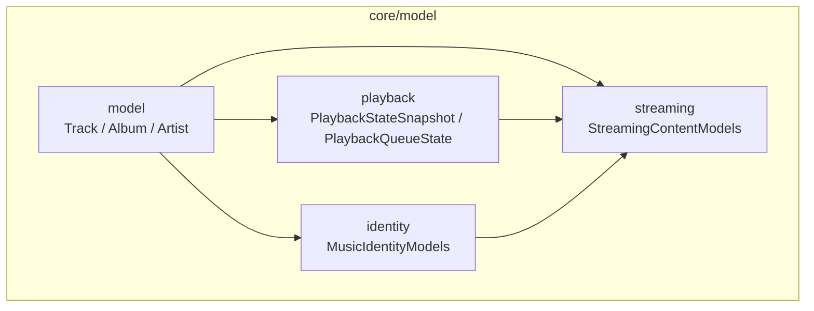
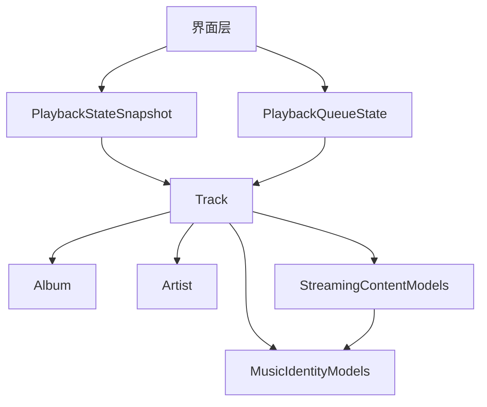
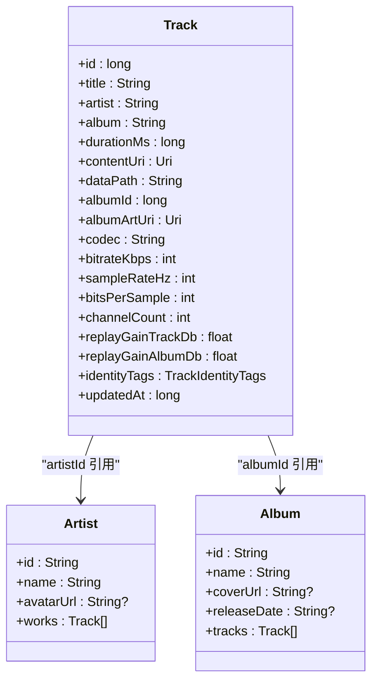
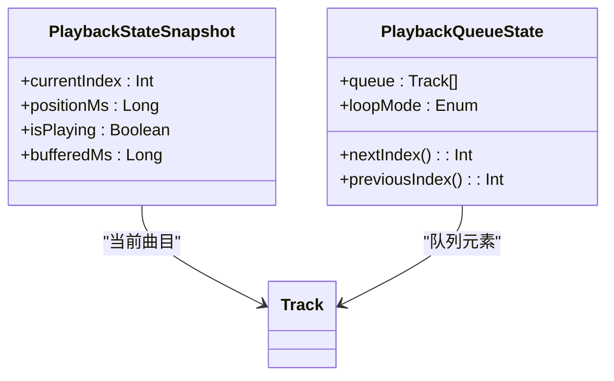
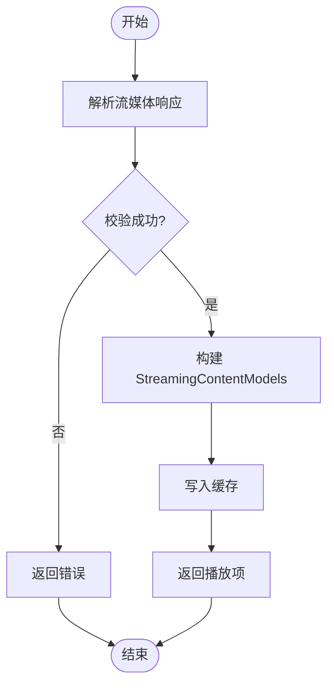
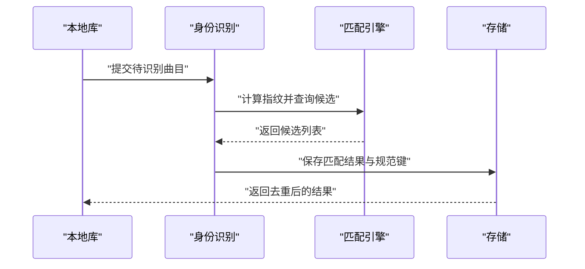
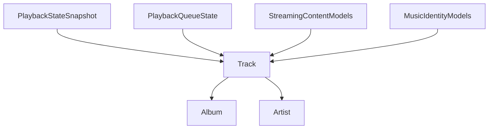

# 数据模型模块 (core/model)

<cite>
**本文引用的文件**   
- [Track.java](file://core/model/src/main/java/app/yukine/model/Track.java)
- [TrackIdentityTags.java](file://core/model/src/main/java/app/yukine/model/TrackIdentityTags.java)
</cite>

## 更新摘要
**变更内容**   
- 更新了 Track 实体，新增 updatedAt 时间戳字段用于更好的曲目版本控制和同步能力
- 完善了 Track 实体的字段说明和业务规则
- 更新了序列化约定和验证规则以反映新的时间戳字段

## 目录
1. [简介](#简介)
2. [项目结构](#项目结构)
3. [核心组件](#核心组件)
4. [架构总览](#架构总览)
5. [详细组件分析](#详细组件分析)
6. [依赖关系分析](#依赖关系分析)
7. [性能考量](#性能考量)
8. [故障排查指南](#故障排查指南)
9. [结论](#结论)
10. [附录](#附录)

## 简介
本章节聚焦 core/model 模块的数据模型，涵盖音乐实体（Track、Album、Artist）、播放状态（PlaybackStateSnapshot、PlaybackQueueState）、流媒体数据模型（StreamingContentModels）与身份识别模型（MusicIdentityModels）。文档将说明各实体的字段含义、数据类型、业务规则、实体间关系、序列化约定、验证规则以及最佳使用模式，并提供创建、转换与序列化的完整流程示例路径。

**更新** 新增了 Track 实体的 updatedAt 时间戳字段，支持更好的曲目版本控制和同步能力。

## 项目结构
core/model 模块按领域分层组织：
- model: 通用音乐实体（曲库层）
- playback: 播放状态快照与队列状态
- streaming: 流媒体内容相关的数据契约
- identity: 音乐身份识别与匹配相关的数据契约

## 核心组件
本节概述核心数据实体及其职责边界：
- Track: 曲目级信息，包含标题、时长、来源标识、封面等，现支持更新时间戳
- Album: 专辑级聚合，包含专辑名、发行时间、封面与曲目列表引用
- Artist: 艺术家信息，包含名称、头像、关联作品集合
- PlaybackStateSnapshot: 当前播放状态的不可变快照，用于 UI 渲染与跨进程传递
- PlaybackQueueState: 播放队列的有序状态，支持前进/后退/循环策略
- StreamingContentModels: 流媒体内容元数据与播放解析结果
- MusicIdentityModels: 音乐身份指纹、匹配结果与去重键

## 架构总览
数据模型在应用中的交互关系如下：UI 层消费 PlaybackStateSnapshot 与 PlaybackQueueState；播放服务维护并广播状态变更；流媒体层基于 StreamingContentModels 进行解析与缓存；身份识别层通过 MusicIdentityModels 完成匹配与去重。

## 详细组件分析

### 音乐实体：Track、Album、Artist
- 实体职责
  - Track: 描述一首可播放的最小单元，包含标题、时长、来源 ID、封面 URL、艺术家与专辑引用等，现支持更新时间戳用于版本控制
  - Album: 描述一张专辑，包含专辑名、封面、发行日期、曲目列表
  - Artist: 描述一位艺术家，包含名称、头像、代表作集合
- 字段与类型（概念性说明）
  - Track.id: 唯一标识（字符串或 UUID）
  - Track.title: 标题（非空）
  - Track.durationMs: 时长（毫秒，非负）
  - Track.artworkUrl: 封面地址（可选）
  - Track.artistId: 关联艺术家（可选）
  - Track.albumId: 关联专辑（可选）
  - Track.updatedAt: 更新时间戳（毫秒，用于版本控制和同步）
  - Album.tracks: 曲目集合（有序）
  - Artist.name: 名称（非空）
- 业务规则
  - 时长为 0 表示未知时长，需允许为空或占位值
  - 封面 URL 可为空，UI 应提供默认占位图
  - 曲目与专辑/艺术家的关系为弱引用，避免强耦合导致内存泄漏
  - **更新** updatedAt 字段用于追踪曲目最后修改时间，支持增量同步和版本冲突解决
- 序列化约定
  - 建议采用 JSON 序列化，字段命名保持小写下划线或驼峰一致性
  - 对可选字段使用 null 安全处理
  - **更新** 时间戳字段应使用 Unix 时间戳格式（毫秒）
- 验证规则
  - 必填字段校验（如标题、名称）
  - 数值范围校验（时长 >= 0，更新时间戳 >= 0）
  - URL 格式校验（可选）
- 使用模式
  - 构建器模式创建复杂对象
  - 只读视图封装可变状态
  - 使用不可变数据类提升线程安全性
  - **更新** 在数据同步场景中比较 updatedAt 字段判断是否需要更新

**图表来源**
- [Track.java:14-35](file://core/model/src/main/java/app/yukine/model/Track.java#L14-L35)
- [TrackIdentityTags.java:14-18](file://core/model/src/main/java/app/yukine/model/TrackIdentityTags.java#L14-L18)

**章节来源**
- [Track.java:14-35](file://core/model/src/main/java/app/yukine/model/Track.java#L14-L35)
- [TrackIdentityTags.java:14-18](file://core/model/src/main/java/app/yukine/model/TrackIdentityTags.java#L14-L18)

### 播放状态：PlaybackStateSnapshot、PlaybackQueueState
- 实体职责
  - PlaybackStateSnapshot: 记录当前播放进度、播放位置、是否正在播放、缓冲状态等
  - PlaybackQueueState: 管理播放队列顺序、循环模式、下一首/上一首索引
- 字段与类型（概念性说明）
  - PlaybackStateSnapshot.currentIndex: 当前索引
  - PlaybackStateSnapshot.positionMs: 播放位置（毫秒）
  - PlaybackStateSnapshot.isPlaying: 是否正在播放
  - PlaybackStateSnapshot.bufferedMs: 缓冲长度（毫秒）
  - PlaybackQueueState.queue: 曲目列表
  - PlaybackQueueState.loopMode: 循环模式（单曲/列表/随机）
- 业务规则
  - 当 isPlaying 为 false 时，positionMs 不应继续递增
  - 超出队列边界时应根据 loopMode 决定行为
  - 缓冲长度不得超过曲目时长
- 序列化约定
  - 快照对象应为不可变且可序列化，便于跨进程传输
- 验证规则
  - 索引越界检查
  - 时长与缓冲长度上限检查
- 使用模式
  - 以事件驱动更新状态
  - 使用幂等操作确保状态一致

### 流媒体数据模型：StreamingContentModels
- 实体职责
  - 定义流媒体内容的元数据结构、播放解析结果、质量选择策略等
- 字段与类型（概念性说明）
  - contentId: 内容唯一标识
  - streamUrl: 流地址
  - quality: 音质等级
  - codec: 编码格式
  - durationMs: 预计时长
- 业务规则
  - 流地址需具备时效性与鉴权信息
  - 质量选择需考虑网络状况与用户偏好
- 序列化约定
  - 与后端 API 保持一致的字段命名
- 验证规则
  - URL 合法性校验
  - 编码与质量枚举校验
- 使用模式
  - 工厂方法生成不同质量的播放项
  - 适配器模式适配不同提供商的响应

### 身份识别模型：MusicIdentityModels
- 实体职责
  - 定义音乐身份指纹、匹配结果、去重键与置信度评分
- 字段与类型（概念性说明）
  - fingerprint: 音频指纹
  - matchResult: 匹配结果（候选列表）
  - canonicalKey: 规范键（用于去重）
  - confidence: 置信度（0-1）
- 业务规则
  - 置信度阈值用于决定是否合并条目
  - 规范键由多字段组合生成，保证稳定性
- 序列化约定
  - 指纹与匹配结果需高效序列化
- 验证规则
  - 指纹长度与格式校验
  - 置信度范围校验
- 使用模式
  - 批量匹配后统一去重
  - 增量更新匹配结果

## 依赖关系分析
- 低耦合高内聚
  - 实体之间通过弱引用（ID）建立关系，避免循环依赖
- 外部依赖
  - 序列化框架（JSON）
  - 网络协议（流媒体端点）
  - 指纹算法（身份识别）
- 潜在风险
  - 大对象频繁序列化导致的性能开销
  - 未处理的空指针与非法枚举值

## 性能考量
- 避免在大对象上频繁序列化，必要时使用增量更新
- 使用不可变数据类减少同步开销
- 对大图封面进行懒加载与缓存
- 合理设置流媒体质量以降低带宽占用
- **更新** 合理使用 updatedAt 字段进行增量同步，避免全量数据传输

## 故障排查指南
- 常见问题
  - 字段缺失导致反序列化失败：检查必填字段与默认值
  - 索引越界引发崩溃：在切换曲目前校验边界
  - 流地址失效：实现重试与降级策略
  - **更新** 时间戳同步问题：检查 updatedAt 字段的正确性和时区处理
- 定位步骤
  - 打印关键状态快照（PlaybackStateSnapshot）
  - 核对身份识别置信度阈值
  - 检查流媒体响应结构与字段映射
  - **更新** 对比本地与远程的 updatedAt 字段确定同步方向

## 结论
core/model 模块提供了清晰、稳定的数据契约，支撑播放、流媒体与身份识别等上层能力。遵循不可变设计、严格校验与良好序列化约定，可显著提升系统稳定性与可维护性。**更新** 新增的 updatedAt 字段进一步增强了版本控制和同步能力。

## 附录
- 创建与转换示例路径
  - 创建 Track 对象：[Track.java](file://core/model/src/main/java/app/yukine/model/Track.java)
  - 初始化播放状态与队列：[PlaybackStateSnapshot.kt](file://core/model/src/main/java/app/yukine/playback/PlaybackStateSnapshot.kt)、[PlaybackQueueState.kt](file://core/model/src/main/java/app/yukine/playback/PlaybackQueueState.kt)
  - 解析流媒体内容：[StreamingContentModels.kt](file://core/model/src/main/java/app/yukine/streaming/StreamingContentModels.kt)
  - 执行身份识别与去重：[MusicIdentityModels.kt](file://core/model/src/main/java/app/yukine/identity/MusicIdentityModels.kt)
- 序列化与验证示例路径
  - JSON 序列化配置与字段映射：参考各模型文件中的注解与构造逻辑
  - 输入校验与异常处理：在各模型的构建与解析入口处实现
  - **更新** 时间戳处理：使用 Math.max(updatedAt, 0L) 确保非负值