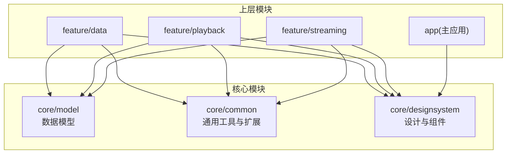
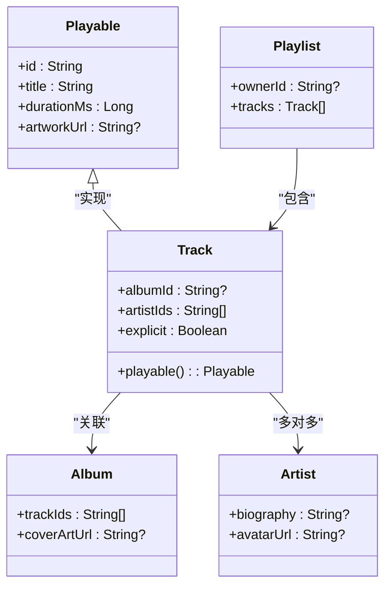
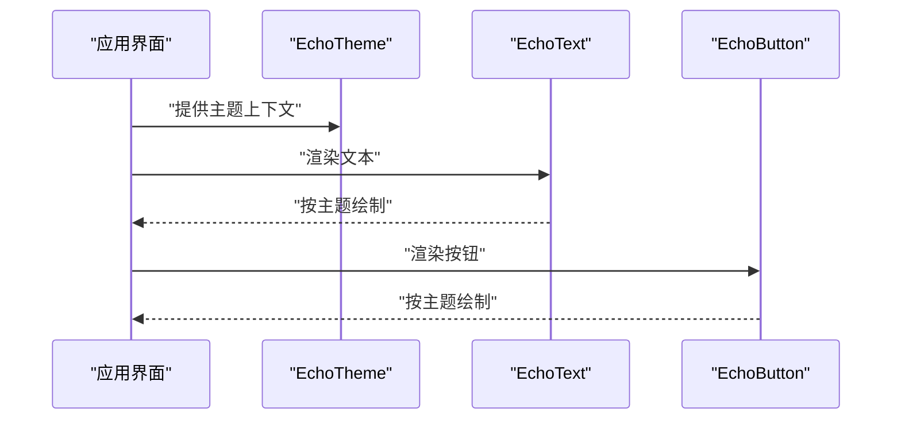
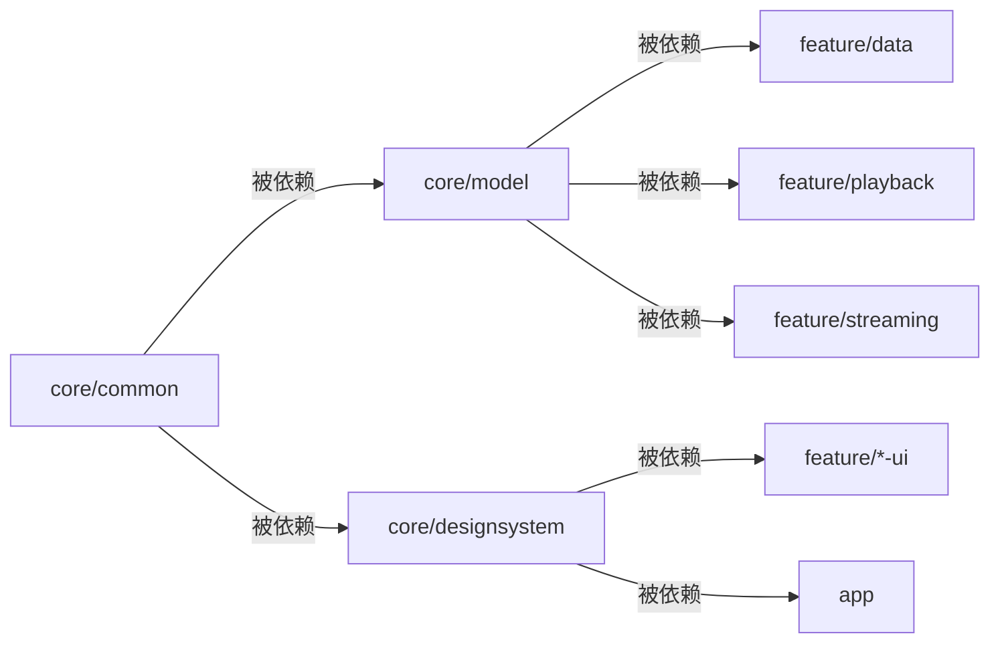

# 核心模块

<cite>
**本文引用的文件**   
- [core/model/src/main/java/app/yukine/model/Track.kt](file://core/model/src/main/java/app/yukine/model/Track.kt)
- [core/model/src/main/java/app/yukine/model/Album.kt](file://core/model/src/main/java/app/yukine/model/Album.kt)
- [core/model/src/main/java/app/yukine/model/Artist.kt](file://core/model/src/main/java/app/yukine/model/Artist.kt)
- [core/model/src/main/java/app/yukine/model/Playlist.kt](file://core/model/src/main/java/app/yukine/model/Playlist.kt)
- [core/model/src/main/java/app/yukine/model/Playable.kt](file://core/model/src/main/java/app/yukine/model/Playable.kt)
- [core/common/src/main/java/app/yukine/common/Extensions.kt](file://core/common/src/main/java/app/yukine/common/Extensions.kt)
- [core/common/src/main/java/app/yukine/common/Constants.kt](file://core/common/src/main/java/app/yukine/common/Constants.kt)
- [core/designsystem/src/main/java/app/yukine/ui/theme/EchoTheme.kt](file://core/designsystem/src/main/java/app/yukine/ui/theme/EchoTheme.kt)
- [core/designsystem/src/main/java/app/yukine/ui/components/EchoText.kt](file://core/designsystem/src/main/java/app/yukine/ui/components/EchoText.kt)
- [core/designsystem/src/main/java/app/yukine/ui/components/EchoButton.kt](file://core/designsystem/src/main/java/app/yukine/ui/components/EchoButton.kt)
</cite>

## 目录
1. [简介](#简介)
2. [项目结构](#项目结构)
3. [核心组件](#核心组件)
4. [架构总览](#架构总览)
5. [详细组件分析](#详细组件分析)
6. [依赖分析](#依赖分析)
7. [性能考虑](#性能考虑)
8. [故障排查指南](#故障排查指南)
9. [结论](#结论)
10. [附录](#附录)

## 简介
本文件面向 Echo Android 项目的“核心共享模块”，聚焦以下三个子模块的职责、边界与使用规范：
- core/model：领域数据模型定义，如 Track、Album、Artist、Playlist 等，作为跨层、跨模块的通用数据结构。
- core/common：通用工具与扩展函数，提供类型安全、可复用的基础能力（常量、转换、校验、格式化等）。
- core/designsystem：设计系统与 UI 组件，统一主题、颜色、字体与常用控件，确保全应用视觉一致性。

目标读者包括业务模块开发者、UI 开发者以及需要复用核心能力的工程师。文档将给出清晰的职责边界、公共接口约定、最佳实践与常见问题排查建议。

## 项目结构
核心模块采用分层模块化组织，遵循“低耦合、高内聚”的原则：
- core/model 仅包含纯数据模型与必要的序列化注解，不依赖 UI 或平台特性。
- core/common 提供无状态的工具类与扩展函数，避免引入运行时副作用。
- core/designsystem 基于 Jetpack Compose 构建主题与基础组件，供上层 feature 模块消费。

图表来源
- [core/model/src/main/java/app/yukine/model/Track.kt](file://core/model/src/main/java/app/yukine/model/Track.kt)
- [core/common/src/main/java/app/yukine/common/Extensions.kt](file://core/common/src/main/java/app/yukine/common/Extensions.kt)
- [core/designsystem/src/main/java/app/yukine/ui/theme/EchoTheme.kt](file://core/designsystem/src/main/java/app/yukine/ui/theme/EchoTheme.kt)

章节来源
- [core/model/src/main/java/app/yukine/model/Track.kt](file://core/model/src/main/java/app/yukine/model/Track.kt)
- [core/common/src/main/java/app/yukine/common/Extensions.kt](file://core/common/src/main/java/app/yukine/common/Extensions.kt)
- [core/designsystem/src/main/java/app/yukine/ui/theme/EchoTheme.kt](file://core/designsystem/src/main/java/app/yukine/ui/theme/EchoTheme.kt)

## 核心组件
本节概述三大核心模块的职责与边界：
- core/model
  - 职责：定义领域实体与值对象，承载播放列表、专辑、艺术家、音轨等核心信息。
  - 边界：不包含业务逻辑与持久化细节；如需序列化，应通过注解声明且保持轻量。
  - 典型实体：Track、Album、Artist、Playlist、Playable（抽象可播放项）。
- core/common
  - 职责：提供跨模块复用的工具方法、扩展函数与常量定义。
  - 边界：无状态、幂等、尽量不依赖 Android 框架；对平台相关能力进行封装隔离。
  - 典型能力：字符串处理、时间/时长格式化、集合操作、URL/URI 校验、错误码常量等。
- core/designsystem
  - 职责：集中管理主题、色彩、排版与基础 UI 组件，保证一致的设计语言。
  - 边界：仅提供展示与交互基础能力，不含业务逻辑；组件应具备可组合性与可测试性。
  - 典型内容：EchoTheme 主题入口、EchoText/EchoButton 等基础组件。

章节来源
- [core/model/src/main/java/app/yukine/model/Track.kt](file://core/model/src/main/java/app/yukine/model/Track.kt)
- [core/model/src/main/java/app/yukine/model/Album.kt](file://core/model/src/main/java/app/yukine/model/Album.kt)
- [core/model/src/main/java/app/yukine/model/Artist.kt](file://core/model/src/main/java/app/yukine/model/Artist.kt)
- [core/model/src/main/java/app/yukine/model/Playlist.kt](file://core/model/src/main/java/app/yukine/model/Playlist.kt)
- [core/model/src/main/java/app/yukine/model/Playable.kt](file://core/model/src/main/java/app/yukine/model/Playable.kt)
- [core/common/src/main/java/app/yukine/common/Extensions.kt](file://core/common/src/main/java/app/yukine/common/Extensions.kt)
- [core/common/src/main/java/app/yukine/common/Constants.kt](file://core/common/src/main/java/app/yukine/common/Constants.kt)
- [core/designsystem/src/main/java/app/yukine/ui/theme/EchoTheme.kt](file://core/designsystem/src/main/java/app/yukine/ui/theme/EchoTheme.kt)
- [core/designsystem/src/main/java/app/yukine/ui/components/EchoText.kt](file://core/designsystem/src/main/java/app/yukine/ui/components/EchoText.kt)
- [core/designsystem/src/main/java/app/yukine/ui/components/EchoButton.kt](file://core/designsystem/src/main/java/app/yukine/ui/components/EchoButton.kt)

## 架构总览
核心模块在整体架构中的位置如下：
- 数据层与业务层通过 core/model 交换领域数据，避免在各层重复定义结构。
- 工具与扩展集中在 core/common，减少样板代码并提升可读性。
- UI 层通过 core/designsystem 获取统一的主题与组件，降低样式差异与维护成本。

图表来源
- [core/model/src/main/java/app/yukine/model/Playable.kt](file://core/model/src/main/java/app/yukine/model/Playable.kt)
- [core/model/src/main/java/app/yukine/model/Track.kt](file://core/model/src/main/java/app/yukine/model/Track.kt)
- [core/model/src/main/java/app/yukine/model/Album.kt](file://core/model/src/main/java/app/yukine/model/Album.kt)
- [core/model/src/main/java/app/yukine/model/Artist.kt](file://core/model/src/main/java/app/yukine/model/Artist.kt)
- [core/model/src/main/java/app/yukine/model/Playlist.kt](file://core/model/src/main/java/app/yukine/model/Playlist.kt)

## 详细组件分析

### 数据模型（core/model）
- 设计原则
  - 不可变性优先：字段尽量只读，变更通过构造新实例完成。
  - 明确关系：通过外键式 ID 建立实体间关系，避免循环引用。
  - 可扩展性：为未来新增字段预留默认值与兼容策略。
- 关键实体
  - Playable：可播放项抽象，提供统一的标识、标题、时长与封面图访问方式。
  - Track：音轨实体，包含专辑与艺术家关联、是否显式标记等元数据。
  - Album：专辑实体，维护曲目集合与封面资源。
  - Artist：艺术家实体，保存传记与头像等描述信息。
  - Playlist：播放列表实体，聚合多个 Track 引用。
- 复杂度与性能
  - 实体本身为轻量 POJO/数据类，内存占用小；复杂计算应在服务层进行。
  - 大列表渲染时建议使用分页与懒加载，避免一次性加载过多实体。
- 使用示例与最佳实践
  - 在业务层根据 Track.artistIds 批量查询艺术家详情，避免 N+1 问题。
  - 使用 Playable 抽象统一处理不同来源的可播放项（本地/流媒体）。
  - 对可选字段（如 artworkUrl）做空值处理与降级显示。

章节来源
- [core/model/src/main/java/app/yukine/model/Playable.kt](file://core/model/src/main/java/app/yukine/model/Playable.kt)
- [core/model/src/main/java/app/yukine/model/Track.kt](file://core/model/src/main/java/app/yukine/model/Track.kt)
- [core/model/src/main/java/app/yukine/model/Album.kt](file://core/model/src/main/java/app/yukine/model/Album.kt)
- [core/model/src/main/java/app/yukine/model/Artist.kt](file://core/model/src/main/java/app/yukine/model/Artist.kt)
- [core/model/src/main/java/app/yukine/model/Playlist.kt](file://core/model/src/main/java/app/yukine/model/Playlist.kt)

### 通用工具与扩展（core/common）
- 设计原则
  - 无副作用：工具函数应为纯函数，便于单元测试与并行执行。
  - 类型安全：利用 Kotlin 扩展与泛型约束减少运行时异常。
  - 可组合：小粒度函数组合成更高层能力，避免巨型工具类。
- 典型能力
  - 字符串与 URI 处理：规范化路径、解析查询参数、安全拼接 URL。
  - 时间与时长格式化：毫秒转分秒、相对时间、国际化友好格式。
  - 集合与序列操作：去重、分组、映射优化，结合延迟求值提升性能。
  - 常量与错误码：集中管理错误码、阈值与配置常量，避免魔法值。
- 使用示例与最佳实践
  - 使用扩展函数简化常见判断与转换，提高可读性。
  - 对耗时操作使用协程调度器或线程池包装，避免阻塞主线程。
  - 对外暴露的 API 需做好入参校验与异常分类，便于上层捕获与提示。

章节来源
- [core/common/src/main/java/app/yukine/common/Extensions.kt](file://core/common/src/main/java/app/yukine/common/Extensions.kt)
- [core/common/src/main/java/app/yukine/common/Constants.kt](file://core/common/src/main/java/app/yukine/common/Constants.kt)

### 设计系统与 UI 组件（core/designsystem）
- 主题系统
  - 主题入口：通过统一主题配置色板、字体族、字号层级与对比度模式。
  - 暗色支持：提供明暗两套配色，自动适配系统主题。
  - 可定制性：允许上层覆盖部分 Token，但需保持语义化命名。
- 基础组件
  - EchoText：文本展示组件，内置字体、字号、行高与颜色规范。
  - EchoButton：按钮组件，包含状态（正常/禁用/按下）、尺寸与图标对齐。
- 使用示例与最佳实践
  - 在页面根节点注入主题，确保全局样式一致。
  - 使用组件提供的变体与属性，避免手写样式导致不一致。
  - 自定义组件应继承设计系统的 Token，保持可维护性。

图表来源
- [core/designsystem/src/main/java/app/yukine/ui/theme/EchoTheme.kt](file://core/designsystem/src/main/java/app/yukine/ui/theme/EchoTheme.kt)
- [core/designsystem/src/main/java/app/yukine/ui/components/EchoText.kt](file://core/designsystem/src/main/java/app/yukine/ui/components/EchoText.kt)
- [core/designsystem/src/main/java/app/yukine/ui/components/EchoButton.kt](file://core/designsystem/src/main/java/app/yukine/ui/components/EchoButton.kt)

章节来源
- [core/designsystem/src/main/java/app/yukine/ui/theme/EchoTheme.kt](file://core/designsystem/src/main/java/app/yukine/ui/theme/EchoTheme.kt)
- [core/designsystem/src/main/java/app/yukine/ui/components/EchoText.kt](file://core/designsystem/src/main/java/app/yukine/ui/components/EchoText.kt)
- [core/designsystem/src/main/java/app/yukine/ui/components/EchoButton.kt](file://core/designsystem/src/main/java/app/yukine/ui/components/EchoButton.kt)

## 依赖分析
核心模块之间的依赖关系清晰且单向：
- core/common 不依赖 core/model 与 core/designsystem，保持最底层通用性。
- core/model 不依赖 core/common 与 core/designsystem，保持领域纯净。
- core/designsystem 不依赖 core/model 与 core/common（若确有需要，应通过接口解耦），专注于展示层。

图表来源
- [core/common/src/main/java/app/yukine/common/Extensions.kt](file://core/common/src/main/java/app/yukine/common/Extensions.kt)
- [core/model/src/main/java/app/yukine/model/Track.kt](file://core/model/src/main/java/app/yukine/model/Track.kt)
- [core/designsystem/src/main/java/app/yukine/ui/theme/EchoTheme.kt](file://core/designsystem/src/main/java/app/yukine/ui/theme/EchoTheme.kt)

章节来源
- [core/common/src/main/java/app/yukine/common/Extensions.kt](file://core/common/src/main/java/app/yukine/common/Extensions.kt)
- [core/model/src/main/java/app/yukine/model/Track.kt](file://core/model/src/main/java/app/yukine/model/Track.kt)
- [core/designsystem/src/main/java/app/yukine/ui/theme/EchoTheme.kt](file://core/designsystem/src/main/java/app/yukine/ui/theme/EchoTheme.kt)

## 性能考虑
- 数据模型
  - 避免在模型中执行 I/O 或重型计算；必要时提供惰性加载或视图模型层转换。
  - 合理使用不可变数据结构，配合快照与增量更新提升列表渲染性能。
- 通用工具
  - 对字符串与集合操作使用延迟求值与流式 API，减少中间对象创建。
  - 将耗时任务放入后台线程，并提供取消机制。
- 设计系统
  - 组件内部缓存计算结果（如测量、布局），避免重复计算。
  - 主题切换时尽量减少重组范围，使用稳定的 key 与局部状态。

[本节为通用指导，无需具体文件来源]

## 故障排查指南
- 数据模型相关问题
  - 现象：序列化失败或字段缺失。
  - 排查：检查模型字段是否具备必要注解与默认值；确认反序列化策略与版本迁移。
  - 参考：[core/model/src/main/java/app/yukine/model/Track.kt](file://core/model/src/main/java/app/yukine/model/Track.kt)
- 工具函数异常
  - 现象：空指针或格式错误。
  - 排查：确认输入合法性与边界条件；查看扩展函数的前置校验逻辑。
  - 参考：[core/common/src/main/java/app/yukine/common/Extensions.kt](file://core/common/src/main/java/app/yukine/common/Extensions.kt)
- UI 主题不一致
  - 现象：颜色或字体不符合预期。
  - 排查：确认是否在页面根节点注入了主题；检查组件使用的 Token 是否正确。
  - 参考：[core/designsystem/src/main/java/app/yukine/ui/theme/EchoTheme.kt](file://core/designsystem/src/main/java/app/yukine/ui/theme/EchoTheme.kt)

章节来源
- [core/model/src/main/java/app/yukine/model/Track.kt](file://core/model/src/main/java/app/yukine/model/Track.kt)
- [core/common/src/main/java/app/yukine/common/Extensions.kt](file://core/common/src/main/java/app/yukine/common/Extensions.kt)
- [core/designsystem/src/main/java/app/yukine/ui/theme/EchoTheme.kt](file://core/designsystem/src/main/java/app/yukine/ui/theme/EchoTheme.kt)

## 结论
core/model、core/common 与 core/designsystem 构成了 Echo Android 的核心共享能力：
- 以领域模型为中心的数据契约，保障跨层一致性。
- 以工具与扩展为核心的工程效率提升点，减少重复与错误。
- 以设计系统为基座的 UI 一致性保障，提升可维护性与用户体验。

建议在业务模块中严格遵循上述职责边界与使用规范，最大化复用核心能力，降低耦合与回归风险。

[本节为总结性内容，无需具体文件来源]

## 附录
- 术语表
  - 可播放项：具备统一播放接口的抽象实体，如音轨、播客片段等。
  - 主题 Token：用于控制颜色、字体、间距等设计变量的命名集合。
- 快速上手清单
  - 在业务模块引入 core/model 与 core/common 依赖。
  - 在 UI 层使用 core/designsystem 的基础组件与主题。
  - 对复杂数据展示使用分页与懒加载，避免一次性加载。

[本节为补充说明，无需具体文件来源]