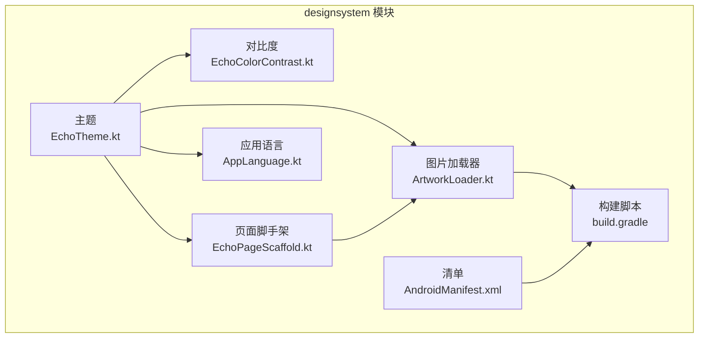
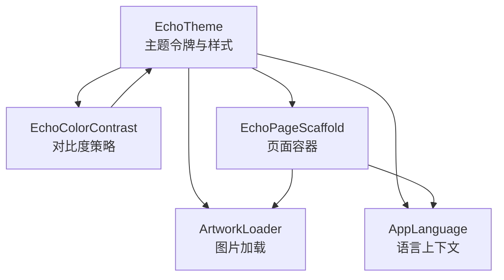
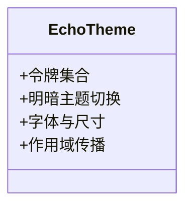
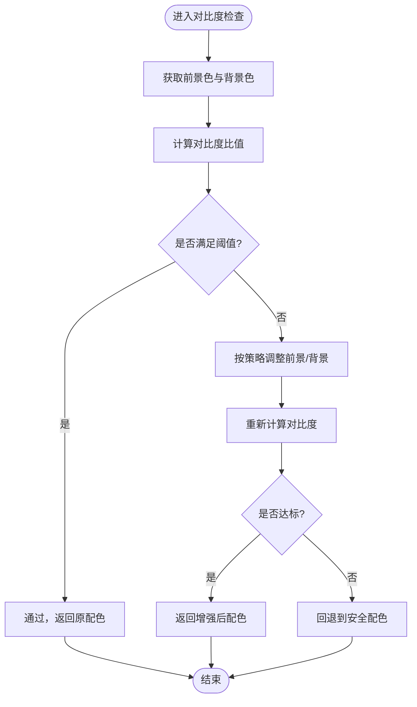
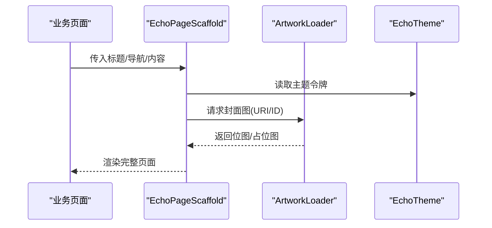
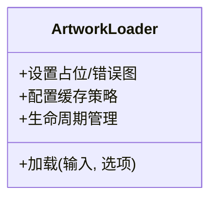
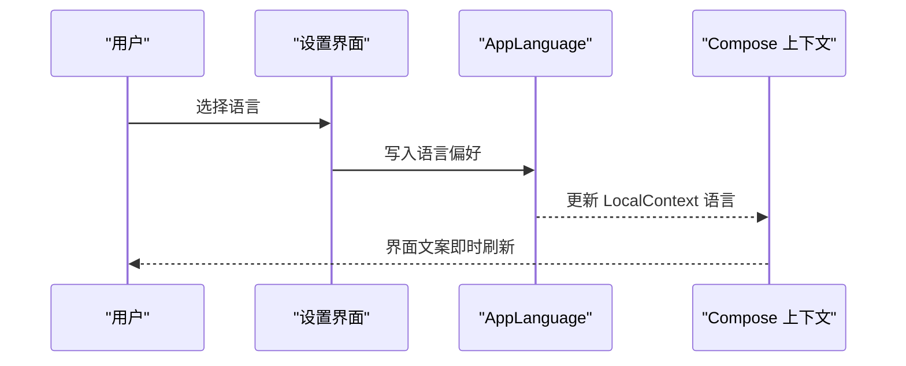
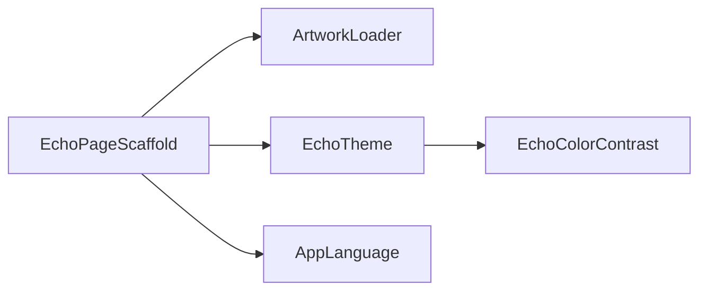

# 设计系统模块 (core/designsystem)

<cite>
**本文引用的文件**   
- [build.gradle](file://core/designsystem/build.gradle)
- [AndroidManifest.xml](file://core/designsystem/src/main/AndroidManifest.xml)
- [EchoTheme.kt](file://core/designsystem/src/main/java/app/yukine/ui/theme/EchoTheme.kt)
- [EchoColorContrast.kt](file://core/designsystem/src/main/java/app/yukine/ui/theme/EchoColorContrast.kt)
- [EchoPageScaffold.kt](file://core/designsystem/src/main/java/app/yukine/ui/page/EchoPageScaffold.kt)
- [ArtworkLoader.kt](file://core/designsystem/src/main/java/app/yukine/ui/image/ArtworkLoader.kt)
- [AppLanguage.kt](file://core/designsystem/src/main/java/app/yukine/ui/language/AppLanguage.kt)
- [ArtworkDiskCachePolicyTest.kt](file://core/designsystem/src/test/java/app/yukine/ui/ArtworkDiskCachePolicyTest.kt)
- [BackgroundTransformGeometryTest.kt](file://core/designsystem/src/test/java/app/yukine/ui/BackgroundTransformGeometryTest.kt)
- [EchoThemeContrastTest.kt](file://core/designsystem/src/test/java/app/yukine/ui/EchoThemeContrastTest.kt)
</cite>

## 目录
1. [简介](#简介)
2. [项目结构](#项目结构)
3. [核心组件](#核心组件)
4. [架构总览](#架构总览)
5. [详细组件分析](#详细组件分析)
6. [依赖关系分析](#依赖关系分析)
7. [性能考虑](#性能考虑)
8. [故障排查指南](#故障排查指南)
9. [结论](#结论)
10. [附录](#附录)

## 简介
本文件系统化梳理 core/designsystem 模块的设计规范与 UI 组件库，围绕主题系统（EchoTheme）、颜色对比度管理（EchoColorContrast）、页面脚手架（EchoPageScaffold）、图片加载器（ArtworkLoader）与应用语言支持（AppLanguage）等核心能力展开。文档覆盖主题配置项、颜色与字体规范、组件属性与自定义方式，并提供深色模式适配、响应式设计与无障碍支持的实践要点，帮助开发者在业务界面中一致地应用设计系统。

## 项目结构
core/designsystem 模块以 Kotlin + Jetpack Compose 为主，提供跨功能复用的主题、布局、图片加载与国际化能力。模块通过 Gradle 构建并声明 Android 清单，测试用例覆盖关键算法与策略（如磁盘缓存策略、背景变换几何计算、主题对比度）。

图表来源
- [build.gradle](file://core/designsystem/build.gradle)
- [AndroidManifest.xml](file://core/designsystem/src/main/AndroidManifest.xml)
- [EchoTheme.kt](file://core/designsystem/src/main/java/app/yukine/ui/theme/EchoTheme.kt)
- [EchoColorContrast.kt](file://core/designsystem/src/main/java/app/yukine/ui/theme/EchoColorContrast.kt)
- [EchoPageScaffold.kt](file://core/designsystem/src/main/java/app/yukine/ui/page/EchoPageScaffold.kt)
- [ArtworkLoader.kt](file://core/designsystem/src/main/java/app/yukine/ui/image/ArtworkLoader.kt)
- [AppLanguage.kt](file://core/designsystem/src/main/java/app/yukine/ui/language/AppLanguage.kt)

章节来源
- [build.gradle](file://core/designsystem/build.gradle)
- [AndroidManifest.xml](file://core/designsystem/src/main/AndroidManifest.xml)

## 核心组件
- EchoTheme：集中定义主题令牌（颜色、字体、圆角、阴影等），提供明暗主题切换入口，供全局或局部作用域使用。
- EchoColorContrast：负责颜色对比度校验与增强策略，确保文本与背景的对比度满足可访问性标准。
- EchoPageScaffold：统一的页面容器，封装顶部栏、底部导航、内容区与状态栏处理，便于快速搭建页面骨架。
- ArtworkLoader：统一的图片加载抽象，屏蔽底层实现差异，提供占位图、错误图、裁剪与缓存策略。
- AppLanguage：应用级语言选择与切换能力，配合 Compose 的 LocalContext 进行运行时语言生效。

章节来源
- [EchoTheme.kt](file://core/designsystem/src/main/java/app/yukine/ui/theme/EchoTheme.kt)
- [EchoColorContrast.kt](file://core/designsystem/src/main/java/app/yukine/ui/theme/EchoColorContrast.kt)
- [EchoPageScaffold.kt](file://core/designsystem/src/main/java/app/yukine/ui/page/EchoPageScaffold.kt)
- [ArtworkLoader.kt](file://core/designsystem/src/main/java/app/yukine/ui/image/ArtworkLoader.kt)
- [AppLanguage.kt](file://core/designsystem/src/main/java/app/yukine/ui/language/AppLanguage.kt)

## 架构总览
设计系统采用“主题驱动”的层次化架构：主题层提供 Token；对比度层保障可读性；脚手架层组织页面结构；图片加载层统一资源消费；语言层提供本地化上下文。各组件通过 Compose 的 CompositionLocal 与参数注入形成松耦合。

图表来源
- [EchoTheme.kt](file://core/designsystem/src/main/java/app/yukine/ui/theme/EchoTheme.kt)
- [EchoColorContrast.kt](file://core/designsystem/src/main/java/app/yukine/ui/theme/EchoColorContrast.kt)
- [EchoPageScaffold.kt](file://core/designsystem/src/main/java/app/yukine/ui/page/EchoPageScaffold.kt)
- [ArtworkLoader.kt](file://core/designsystem/src/main/java/app/yukine/ui/image/ArtworkLoader.kt)
- [AppLanguage.kt](file://core/designsystem/src/main/java/app/yukine/ui/language/AppLanguage.kt)

## 详细组件分析

### 主题系统（EchoTheme）
- 职责：集中管理颜色、字体、尺寸、圆角、阴影等设计令牌；暴露明/暗主题切换；为子树提供主题上下文。
- 关键能力：
  - 主题令牌集合：主色、中性色、语义色、表面色、描边与阴影等。
  - 字体族与字号体系：标题、正文、辅助文本、标签等。
  - 明暗主题：基于系统或用户偏好自动切换，也可手动覆盖。
  - 组合式 API：通过 Composable 包裹应用或局部区域，使主题在 Composition 中传播。
- 自定义方式：
  - 扩展主题令牌：新增颜色或字体变体，保持命名一致性。
  - 覆盖默认值：在特定作用域内覆写部分令牌，实现差异化风格。
  - 动态主题：结合运行时数据（如品牌色）生成派生令牌。

图表来源
- [EchoTheme.kt](file://core/designsystem/src/main/java/app/yukine/ui/theme/EchoTheme.kt)

章节来源
- [EchoTheme.kt](file://core/designsystem/src/main/java/app/yukine/ui/theme/EchoTheme.kt)

### 颜色对比度管理（EchoColorContrast）
- 职责：对前景/背景色进行对比度计算与校验，必要时返回增强后的配色方案，以满足 WCAG 等无障碍要求。
- 关键能力：
  - 对比度阈值策略：根据文本用途（正文/标题/提示）设定不同阈值。
  - 自动增强：当不达标时，按策略调整亮度或饱和度以提升对比度。
  - 可配置规则：允许在不同场景下启用/禁用增强逻辑。
- 典型流程：

图表来源
- [EchoColorContrast.kt](file://core/designsystem/src/main/java/app/yukine/ui/theme/EchoColorContrast.kt)

章节来源
- [EchoColorContrast.kt](file://core/designsystem/src/main/java/app/yukine/ui/theme/EchoColorContrast.kt)

### 页面脚手架（EchoPageScaffold）
- 职责：提供一致的页面外壳，包括顶部栏、导航、内容区、状态栏与沉浸式行为，减少重复样板代码。
- 关键能力：
  - 顶部栏与操作按钮：标题、返回、菜单、搜索等。
  - 底部导航/标签：多页签切换与选中态。
  - 内容区：滚动、对齐、间距与边距的统一控制。
  - 状态处理：加载中、空状态、错误状态的占位与重试。
  - 与主题联动：自动适配明暗主题与对比度策略。
- 与图片加载集成：在列表或卡片中统一使用 ArtworkLoader 展示封面图。

图表来源
- [EchoPageScaffold.kt](file://core/designsystem/src/main/java/app/yukine/ui/page/EchoPageScaffold.kt)
- [ArtworkLoader.kt](file://core/designsystem/src/main/java/app/yukine/ui/image/ArtworkLoader.kt)
- [EchoTheme.kt](file://core/designsystem/src/main/java/app/yukine/ui/theme/EchoTheme.kt)

章节来源
- [EchoPageScaffold.kt](file://core/designsystem/src/main/java/app/yukine/ui/page/EchoPageScaffold.kt)
- [ArtworkLoader.kt](file://core/designsystem/src/main/java/app/yukine/ui/image/ArtworkLoader.kt)

### 图片加载器（ArtworkLoader）
- 职责：统一图片加载接口，屏蔽底层实现差异，提供占位图、错误图、裁剪、缩放与缓存策略。
- 关键能力：
  - 输入源：URI、资源 ID、网络地址等。
  - 显示选项：占位图、错误图、圆角、中心裁剪、比例保持。
  - 缓存策略：内存/磁盘缓存策略可配置，提升加载性能与稳定性。
  - 生命周期感知：随 Composable 生命周期自动取消无效请求。
- 测试覆盖：磁盘缓存策略与背景变换几何计算均有对应测试用例，保障核心路径稳定。

图表来源
- [ArtworkLoader.kt](file://core/designsystem/src/main/java/app/yukine/ui/image/ArtworkLoader.kt)

章节来源
- [ArtworkLoader.kt](file://core/designsystem/src/main/java/app/yukine/ui/image/ArtworkLoader.kt)
- [ArtworkDiskCachePolicyTest.kt](file://core/designsystem/src/test/java/app/yukine/ui/ArtworkDiskCachePolicyTest.kt)
- [BackgroundTransformGeometryTest.kt](file://core/designsystem/src/test/java/app/yukine/ui/BackgroundTransformGeometryTest.kt)

### 应用语言支持（AppLanguage）
- 职责：提供应用级语言选择与切换能力，配合 Compose 的 LocalContext 在运行时生效。
- 关键能力：
  - 语言枚举/标识：统一管理可用语言。
  - 持久化：保存用户选择，重启后恢复。
  - 即时生效：切换后更新当前 Composition 的语言环境。
  - 与系统同步：可选跟随系统语言或强制应用语言。
- 使用建议：在应用根节点设置语言上下文，避免在每个页面重复配置。

图表来源
- [AppLanguage.kt](file://core/designsystem/src/main/java/app/yukine/ui/language/AppLanguage.kt)

章节来源
- [AppLanguage.kt](file://core/designsystem/src/main/java/app/yukine/ui/language/AppLanguage.kt)

## 依赖关系分析
- 内部依赖：
  - EchoPageScaffold 依赖 ArtworkLoader 与 EchoTheme。
  - EchoColorContrast 被 EchoTheme 或其他 UI 组件调用以保障可读性。
  - AppLanguage 通过 Compose 上下文影响所有需要本地化的组件。
- 外部依赖：
  - 图片加载可能依赖第三方库（由 build.gradle 声明）。
  - 资源与清单由 Android 平台提供。

图表来源
- [EchoPageScaffold.kt](file://core/designsystem/src/main/java/app/yukine/ui/page/EchoPageScaffold.kt)
- [ArtworkLoader.kt](file://core/designsystem/src/main/java/app/yukine/ui/image/ArtworkLoader.kt)
- [EchoTheme.kt](file://core/designsystem/src/main/java/app/yukine/ui/theme/EchoTheme.kt)
- [EchoColorContrast.kt](file://core/designsystem/src/main/java/app/yukine/ui/theme/EchoColorContrast.kt)
- [AppLanguage.kt](file://core/designsystem/src/main/java/app/yukine/ui/language/AppLanguage.kt)

章节来源
- [build.gradle](file://core/designsystem/build.gradle)

## 性能考虑
- 图片加载：
  - 启用合适的内存与磁盘缓存策略，避免重复下载与解码开销。
  - 使用占位图与错误图降低首屏等待时间。
  - 按需加载与懒加载，结合列表回收机制减少内存峰值。
- 主题与对比度：
  - 将对比度计算结果缓存，避免频繁重算。
  - 仅在必要时触发主题切换，减少重组范围。
- 页面脚手架：
  - 合理拆分内容区，避免整页重组。
  - 使用稳定的键与 key 函数优化列表性能。

[本节为通用指导，无需源码引用]

## 故障排查指南
- 图片加载失败：
  - 检查输入源合法性与权限。
  - 确认缓存策略与磁盘空间。
  - 查看错误图是否配置正确。
- 对比度不达标：
  - 验证前景/背景色是否正确传入。
  - 检查阈值策略与增强开关。
  - 参考对比度测试用例定位问题。
- 语言切换未生效：
  - 确认是否在应用根节点设置了语言上下文。
  - 检查偏好存储与读取逻辑。
  - 观察 Compose 重组是否触发。

章节来源
- [ArtworkDiskCachePolicyTest.kt](file://core/designsystem/src/test/java/app/yukine/ui/ArtworkDiskCachePolicyTest.kt)
- [BackgroundTransformGeometryTest.kt](file://core/designsystem/src/test/java/app/yukine/ui/BackgroundTransformGeometryTest.kt)
- [EchoThemeContrastTest.kt](file://core/designsystem/src/test/java/app/yukine/ui/EchoThemeContrastTest.kt)

## 结论
core/designsystem 模块通过主题驱动与组件化设计，为 Echo Android 应用提供了统一、可扩展且可维护的 UI 基础能力。借助 EchoTheme、EchoColorContrast、EchoPageScaffold、ArtworkLoader 与 AppLanguage，团队可以快速构建符合设计规范、具备良好可访问性与国际化能力的界面。建议在业务模块中优先复用这些组件，并通过测试用例持续保障核心路径质量。

## 附录
- 深色模式适配：
  - 在主题层提供明/暗两套令牌集，并在应用启动时根据系统或用户偏好选择。
  - 在页面中使用脚手架组件，自动继承主题与对比度策略。
- 响应式设计：
  - 使用相对单位与自适应布局，避免硬编码尺寸。
  - 针对平板与大屏优化导航与内容密度。
- 无障碍支持：
  - 保证文本与背景对比度达标。
  - 为交互元素提供描述与焦点顺序。
  - 使用语义化组件与标签，便于读屏器识别。

[本节为概念性说明，无需源码引用]