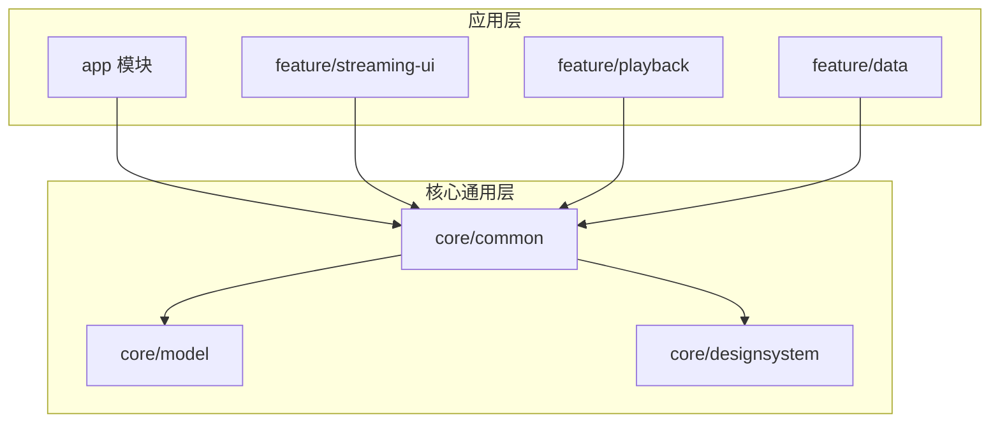
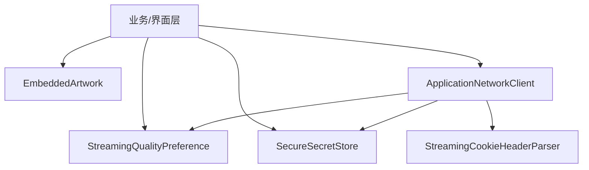
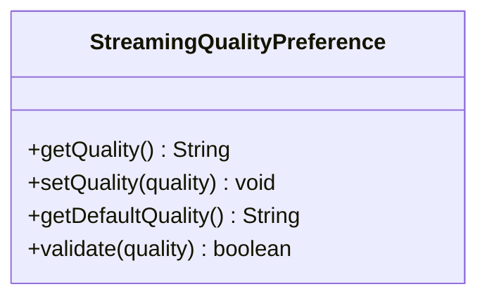
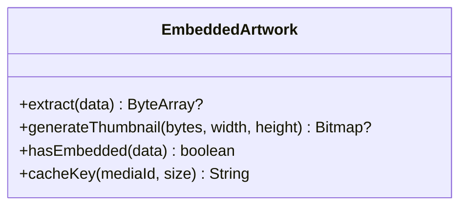
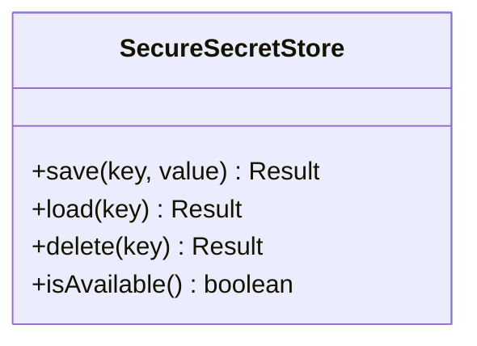
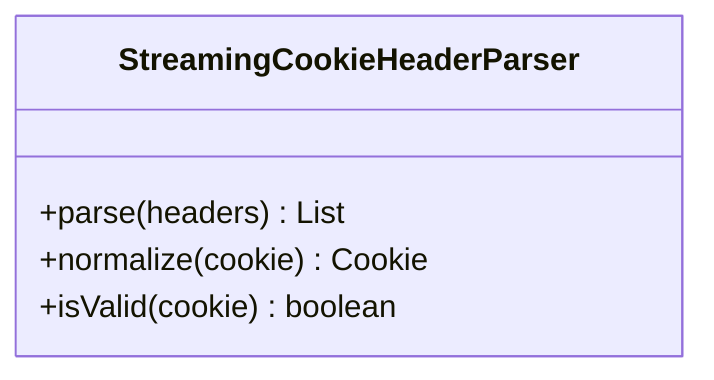
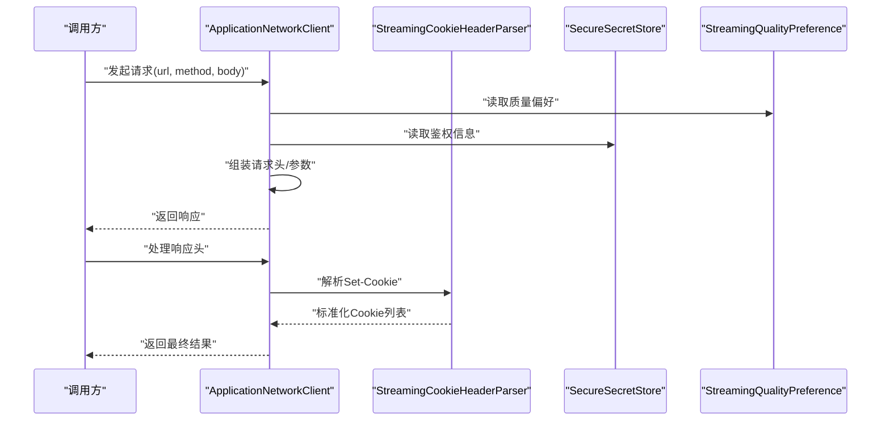
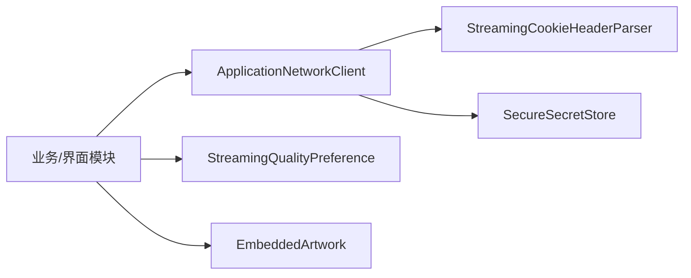

# 通用工具模块 (core/common)

<cite>
**本文引用的文件**   
- [StreamingQualityPreference.kt](file://core/common/src/main/java/app/yukine/common/streaming/StreamingQualityPreference.kt)
- [EmbeddedArtwork.kt](file://core/common/src/main/java/app/yukine/common/media/EmbeddedArtwork.kt)
- [SecureSecretStore.kt](file://core/common/src/main/java/app/yukine/common/security/SecureSecretStore.kt)
- [StreamingCookieHeaderParser.kt](file://core/common/src/main/java/app/yukine/common/network/StreamingCookieHeaderParser.kt)
- [ApplicationNetworkClient.kt](file://core/common/src/main/java/app/yukine/common/network/ApplicationNetworkClient.kt)
</cite>

## 目录
1. [简介](#简介)
2. [项目结构](#项目结构)
3. [核心组件](#核心组件)
4. [架构总览](#架构总览)
5. [详细组件分析](#详细组件分析)
6. [依赖分析](#依赖分析)
7. [性能考虑](#性能考虑)
8. [故障排查指南](#故障排查指南)
9. [结论](#结论)
10. [附录](#附录)

## 简介
本文件聚焦于 Echo Android 项目的 core/common 模块，系统化梳理其提供的通用能力与工具类。重点覆盖以下能力：
- 流媒体质量偏好设置（StreamingQualityPreference）
- 嵌入式艺术图处理（EmbeddedArtwork）
- 安全存储（SecureSecretStore）
- Cookie 头解析器（StreamingCookieHeaderParser）
- 网络客户端封装（ApplicationNetworkClient）

文档将说明每个工具类的职责、接口方法、参数配置、使用场景，并提供复用示例路径、错误处理与性能优化建议，帮助各功能模块正确复用这些通用能力。

## 项目结构
core/common 模块以“按领域划分”的方式组织代码，提供跨模块复用的基础能力。下图展示了该模块在整体工程中的位置以及与其他模块的依赖关系。

图表来源
- [StreamingQualityPreference.kt:1-50](file://core/common/src/main/java/app/yukine/common/streaming/StreamingQualityPreference.kt#L1-L50)
- [EmbeddedArtwork.kt:1-50](file://core/common/src/main/java/app/yukine/common/media/EmbeddedArtwork.kt#L1-L50)
- [SecureSecretStore.kt:1-50](file://core/common/src/main/java/app/yukine/common/security/SecureSecretStore.kt#L1-L50)
- [StreamingCookieHeaderParser.kt:1-50](file://core/common/src/main/java/app/yukine/common/network/StreamingCookieHeaderParser.kt#L1-L50)
- [ApplicationNetworkClient.kt:1-50](file://core/common/src/main/java/app/yukine/common/network/ApplicationNetworkClient.kt#L1-L50)

章节来源
- [StreamingQualityPreference.kt:1-50](file://core/common/src/main/java/app/yukine/common/streaming/StreamingQualityPreference.kt#L1-L50)
- [EmbeddedArtwork.kt:1-50](file://core/common/src/main/java/app/yukine/common/media/EmbeddedArtwork.kt#L1-L50)
- [SecureSecretStore.kt:1-50](file://core/common/src/main/java/app/yukine/common/security/SecureSecretStore.kt#L1-L50)
- [StreamingCookieHeaderParser.kt:1-50](file://core/common/src/main/java/app/yukine/common/network/StreamingCookieHeaderParser.kt#L1-L50)
- [ApplicationNetworkClient.kt:1-50](file://core/common/src/main/java/app/yukine/common/network/ApplicationNetworkClient.kt#L1-L50)

## 核心组件
本节概述 core/common 中五大核心工具的职责边界与协作方式：
- StreamingQualityPreference：集中管理流媒体播放质量偏好，支持读取、写入与默认值策略。
- EmbeddedArtwork：负责从媒体元数据中提取或生成嵌入式封面图，供 UI 展示与缓存。
- SecureSecretStore：基于系统安全存储机制，提供密钥/敏感信息的持久化读写。
- StreamingCookieHeaderParser：解析服务端返回的 Cookie 响应头，统一转换为内部结构。
- ApplicationNetworkClient：对底层网络库进行轻量封装，提供统一的请求发起、拦截与错误归一化。

章节来源
- [StreamingQualityPreference.kt:1-50](file://core/common/src/main/java/app/yukine/common/streaming/StreamingQualityPreference.kt#L1-L50)
- [EmbeddedArtwork.kt:1-50](file://core/common/src/main/java/app/yukine/common/media/EmbeddedArtwork.kt#L1-L50)
- [SecureSecretStore.kt:1-50](file://core/common/src/main/java/app/yukine/common/security/SecureSecretStore.kt#L1-L50)
- [StreamingCookieHeaderParser.kt:1-50](file://core/common/src/main/java/app/yukine/common/network/StreamingCookieHeaderParser.kt#L1-L50)
- [ApplicationNetworkClient.kt:1-50](file://core/common/src/main/java/app/yukine/common/network/ApplicationNetworkClient.kt#L1-L50)

## 架构总览
下图展示了核心工具之间的交互关系与典型调用链：上层业务通过 ApplicationNetworkClient 发起请求，必要时借助 StreamingCookieHeaderParser 解析 Cookie；业务侧根据 StreamingQualityPreference 决定请求质量；若需要登录态或鉴权信息，则通过 SecureSecretStore 获取；UI 层使用 EmbeddedArtwork 渲染封面。

图表来源
- [StreamingQualityPreference.kt:1-50](file://core/common/src/main/java/app/yukine/common/streaming/StreamingQualityPreference.kt#L1-L50)
- [EmbeddedArtwork.kt:1-50](file://core/common/src/main/java/app/yukine/common/media/EmbeddedArtwork.kt#L1-L50)
- [SecureSecretStore.kt:1-50](file://core/common/src/main/java/app/yukine/common/security/SecureSecretStore.kt#L1-L50)
- [StreamingCookieHeaderParser.kt:1-50](file://core/common/src/main/java/app/yukine/common/network/StreamingCookieHeaderParser.kt#L1-L50)
- [ApplicationNetworkClient.kt:1-50](file://core/common/src/main/java/app/yukine/common/network/ApplicationNetworkClient.kt#L1-L50)

## 详细组件分析

### 流媒体质量偏好设置（StreamingQualityPreference）
- 职责
  - 提供统一的流媒体质量偏好读写入口，屏蔽具体实现细节。
  - 暴露默认值策略与校验逻辑，确保偏好值合法。
- 关键方法与行为
  - 读取当前质量偏好（如低/标准/高/自动）。
  - 更新质量偏好并持久化。
  - 提供默认值与回退策略。
- 参数与配置
  - 偏好键名、枚举值定义、默认值。
- 使用场景
  - 在发起流媒体请求前，依据用户偏好选择码率/分辨率。
  - 在设置页中同步显示与修改当前质量。
- 错误处理
  - 非法值回退到默认值。
  - 持久化失败时记录日志并提示重试。
- 性能建议
  - 避免频繁读写，采用内存缓存 + 延迟落盘策略。
  - 批量更新时使用事务或合并写入。

图表来源
- [StreamingQualityPreference.kt:1-50](file://core/common/src/main/java/app/yukine/common/streaming/StreamingQualityPreference.kt#L1-L50)

章节来源
- [StreamingQualityPreference.kt:1-50](file://core/common/src/main/java/app/yukine/common/streaming/StreamingQualityPreference.kt#L1-L50)

### 嵌入式艺术图处理（EmbeddedArtwork）
- 职责
  - 从媒体元数据中提取嵌入式封面图，或生成占位图。
  - 提供尺寸裁剪、格式转换与缓存键生成等辅助能力。
- 关键方法与行为
  - 提取嵌入图片数据。
  - 生成缩略图与缓存键。
  - 判断是否包含有效封面。
- 参数与配置
  - 目标尺寸、压缩质量、输出格式。
- 使用场景
  - 列表项封面加载、播放器封面展示、分享卡片生成。
- 错误处理
  - 无封面时返回空或占位图。
  - 解码失败时降级为默认图。
- 性能建议
  - 使用异步任务与线程池，避免阻塞主线程。
  - 结合磁盘/内存双级缓存，减少重复计算。

图表来源
- [EmbeddedArtwork.kt:1-50](file://core/common/src/main/java/app/yukine/common/media/EmbeddedArtwork.kt#L1-L50)

章节来源
- [EmbeddedArtwork.kt:1-50](file://core/common/src/main/java/app/yukine/common/media/EmbeddedArtwork.kt#L1-L50)

### 安全存储（SecureSecretStore）
- 职责
  - 提供安全的密钥/敏感信息持久化能力，封装系统安全存储 API。
- 关键方法与行为
  - 保存密钥（字符串或字节数组）。
  - 读取密钥并处理缺失/损坏情况。
  - 删除指定密钥。
- 参数与配置
  - 密钥别名、加密算法选择、设备安全级别要求。
- 使用场景
  - 保存会话令牌、第三方服务凭据、本地加密密钥。
- 错误处理
  - 设备不支持安全存储时抛出明确异常。
  - 解密失败时清理残留数据并上报。
- 性能建议
  - 避免在主线程执行加解密操作。
  - 合理缓存已解密的短期令牌，降低 IO 次数。

图表来源
- [SecureSecretStore.kt:1-50](file://core/common/src/main/java/app/yukine/common/security/SecureSecretStore.kt#L1-L50)

章节来源
- [SecureSecretStore.kt:1-50](file://core/common/src/main/java/app/yukine/common/security/SecureSecretStore.kt#L1-L50)

### Cookie 头解析器（StreamingCookieHeaderParser）
- 职责
  - 解析 HTTP 响应头中的 Set-Cookie 字段，转换为结构化对象。
- 关键方法与行为
  - 解析单个或多个 Set-Cookie 头。
  - 标准化域名、路径、过期时间等属性。
  - 过滤无效或不支持的属性。
- 参数与配置
  - 严格模式开关、忽略未知属性策略。
- 使用场景
  - 登录态维持、会话续期、跨域访问控制。
- 错误处理
  - 非法日期格式或语法错误时跳过对应条目。
  - 记录解析失败的详细信息以便定位问题。
- 性能建议
  - 批量解析时复用正则表达式实例。
  - 避免在高频路径上创建过多临时对象。

图表来源
- [StreamingCookieHeaderParser.kt:1-50](file://core/common/src/main/java/app/yukine/common/network/StreamingCookieHeaderParser.kt#L1-L50)

章节来源
- [StreamingCookieHeaderParser.kt:1-50](file://core/common/src/main/java/app/yukine/common/network/StreamingCookieHeaderParser.kt#L1-L50)

### 网络客户端封装（ApplicationNetworkClient）
- 职责
  - 对底层网络库进行统一封装，提供请求发起、拦截、重试与错误归一化。
- 关键方法与行为
  - 发起 GET/POST/PUT/DELETE 请求。
  - 附加认证头、Cookie、质量偏好等公共参数。
  - 统一错误码映射与异常包装。
- 参数与配置
  - 超时时间、重试次数、最大并发、代理设置。
- 使用场景
  - 所有网络相关功能模块的统一入口。
- 错误处理
  - 网络不可用、超时、服务端错误分别归类。
  - 提供可观测性钩子用于埋点与告警。
- 性能建议
  - 连接复用与 Keep-Alive。
  - 请求去重与合并策略。
  - 大响应体分块处理与背压。

图表来源
- [ApplicationNetworkClient.kt:1-50](file://core/common/src/main/java/app/yukine/common/network/ApplicationNetworkClient.kt#L1-L50)
- [StreamingCookieHeaderParser.kt:1-50](file://core/common/src/main/java/app/yukine/common/network/StreamingCookieHeaderParser.kt#L1-L50)
- [SecureSecretStore.kt:1-50](file://core/common/src/main/java/app/yukine/common/security/SecureSecretStore.kt#L1-L50)
- [StreamingQualityPreference.kt:1-50](file://core/common/src/main/java/app/yukine/common/streaming/StreamingQualityPreference.kt#L1-L50)

章节来源
- [ApplicationNetworkClient.kt:1-50](file://core/common/src/main/java/app/yukine/common/network/ApplicationNetworkClient.kt#L1-L50)

## 依赖分析
core/common 模块内部组件之间保持低耦合，主要依赖如下：
- ApplicationNetworkClient 依赖 StreamingCookieHeaderParser 与 SecureSecretStore。
- 业务模块依赖 ApplicationNetworkClient 作为统一网络入口。
- UI 模块依赖 EmbeddedArtwork 进行封面渲染。
- 所有模块均可通过 StreamingQualityPreference 获取质量偏好。

图表来源
- [ApplicationNetworkClient.kt:1-50](file://core/common/src/main/java/app/yukine/common/network/ApplicationNetworkClient.kt#L1-L50)
- [StreamingCookieHeaderParser.kt:1-50](file://core/common/src/main/java/app/yukine/common/network/StreamingCookieHeaderParser.kt#L1-L50)
- [SecureSecretStore.kt:1-50](file://core/common/src/main/java/app/yukine/common/security/SecureSecretStore.kt#L1-L50)
- [StreamingQualityPreference.kt:1-50](file://core/common/src/main/java/app/yukine/common/streaming/StreamingQualityPreference.kt#L1-L50)
- [EmbeddedArtwork.kt:1-50](file://core/common/src/main/java/app/yukine/common/media/EmbeddedArtwork.kt#L1-L50)

章节来源
- [ApplicationNetworkClient.kt:1-50](file://core/common/src/main/java/app/yukine/common/network/ApplicationNetworkClient.kt#L1-L50)
- [StreamingCookieHeaderParser.kt:1-50](file://core/common/src/main/java/app/yukine/common/network/StreamingCookieHeaderParser.kt#L1-L50)
- [SecureSecretStore.kt:1-50](file://core/common/src/main/java/app/yukine/common/security/SecureSecretStore.kt#L1-L50)
- [StreamingQualityPreference.kt:1-50](file://core/common/src/main/java/app/yukine/common/streaming/StreamingQualityPreference.kt#L1-L50)
- [EmbeddedArtwork.kt:1-50](file://core/common/src/main/java/app/yukine/common/media/EmbeddedArtwork.kt#L1-L50)

## 性能考虑
- 网络层
  - 启用连接复用与 Keep-Alive，减少握手开销。
  - 对相同请求进行去重与合并，避免重复网络往返。
  - 大响应体采用流式处理，限制内存峰值。
- 存储层
  - 安全存储加解密在后台线程执行，避免阻塞 UI。
  - 对热点密钥进行短期内存缓存，降低 IO 频率。
- 图像处理
  - 缩略图生成使用异步任务与线程池，配合 LRU 缓存。
  - 按需裁剪与压缩，减少内存占用与 CPU 消耗。
- 偏好设置
  - 读写合并与延迟落盘，避免频繁 I/O。
  - 提供默认值快速路径，减少分支判断。

[本节为通用指导，不直接分析具体文件]

## 故障排查指南
- 网络请求失败
  - 检查超时与重试配置是否合理。
  - 查看错误分类与日志，区分网络错误与服务端错误。
  - 确认鉴权信息与 Cookie 是否正确注入。
- Cookie 解析异常
  - 核对 Set-Cookie 字段是否符合规范。
  - 开启严格模式以捕获更多异常信息。
- 安全存储不可用
  - 检测设备安全级别与硬件支持。
  - 验证密钥别名是否存在且未被篡改。
- 封面图加载缓慢
  - 检查缩略图尺寸与压缩参数。
  - 确认缓存命中情况与磁盘空间。

章节来源
- [ApplicationNetworkClient.kt:1-50](file://core/common/src/main/java/app/yukine/common/network/ApplicationNetworkClient.kt#L1-L50)
- [StreamingCookieHeaderParser.kt:1-50](file://core/common/src/main/java/app/yukine/common/network/StreamingCookieHeaderParser.kt#L1-L50)
- [SecureSecretStore.kt:1-50](file://core/common/src/main/java/app/yukine/common/security/SecureSecretStore.kt#L1-L50)
- [EmbeddedArtwork.kt:1-50](file://core/common/src/main/java/app/yukine/common/media/EmbeddedArtwork.kt#L1-L50)

## 结论
core/common 模块通过清晰的职责划分与稳定的接口设计，为上层模块提供了高质量的基础能力。建议在业务集成中遵循以下原则：
- 统一通过 ApplicationNetworkClient 发起网络请求，保证一致的错误处理与可观测性。
- 使用 StreamingQualityPreference 集中管理质量偏好，避免分散配置。
- 利用 SecureSecretStore 保护敏感信息，注意线程与缓存策略。
- 借助 StreamingCookieHeaderParser 规范化 Cookie 处理，提升稳定性。
- 使用 EmbeddedArtwork 高效渲染封面，结合缓存提升体验。

[本节为总结性内容，不直接分析具体文件]

## 附录
- 使用示例路径（仅列出文件路径，不包含代码内容）
  - 在业务模块中读取质量偏好：参考 [StreamingQualityPreference.kt](file://core/common/src/main/java/app/yukine/common/streaming/StreamingQualityPreference.kt)
  - 在 UI 模块中加载封面图：参考 [EmbeddedArtwork.kt](file://core/common/src/main/java/app/yukine/common/media/EmbeddedArtwork.kt)
  - 在鉴权流程中存取密钥：参考 [SecureSecretStore.kt](file://core/common/src/main/java/app/yukine/common/security/SecureSecretStore.kt)
  - 在响应处理中解析 Cookie：参考 [StreamingCookieHeaderParser.kt](file://core/common/src/main/java/app/yukine/common/network/StreamingCookieHeaderParser.kt)
  - 在数据层发起网络请求：参考 [ApplicationNetworkClient.kt](file://core/common/src/main/java/app/yukine/common/network/ApplicationNetworkClient.kt)

[本节为补充信息，不直接分析具体文件]