# QQ音乐实现

<cite>
**本文引用的文件**   
- [README.md](file://README.md)
- [StreamingModule.kt](file://app/src/main/java/app/yukine/StreamingModule.kt)
- [StreamingPlaybackController.kt](file://app/src/main/java/app/yukine/StreamingPlaybackController.kt)
- [StreamingAuthCallbackController.kt](file://app/src/main/java/app/yukine/StreamingAuthCallbackController.kt)
- [StreamingWebAuthActivity.kt](file://app/src/main/java/app/yukine/StreamingWebAuthActivity.kt)
- [StreamingRepositoryProvider.kt](file://app/src/main/java/app/yukine/StreamingRepositoryProvider.kt)
- [StreamingSessionMaintenanceWorker.kt](file://app/src/main/java/app/yukine/StreamingSessionMaintenanceWorker.kt)
- [StreamingPlaylistController.kt](file://app/src/main/java/app/yukine/StreamingPlaylistController.kt)
- [StreamingTrackMatchUseCase.kt](file://app/src/main/java/app/yukine/StreamingTrackMatchUseCase.kt)
- [StreamingPlaybackQualityPolicy.kt](file://app/src/main/java/app/yukine/StreamingPlaybackQualityPolicy.kt)
- [StreamingGatewaySettingsStore.kt](file://app/src/main/java/app/yukine/StreamingGatewaySettingsStore.kt)
- [MainStreamingActionGateway.kt](file://app/src/main/java/app/yukine/MainStreamingActionGateway.kt)
- [StreamingFeatureBinding.java](file://app/src/main/java/app/yukine/StreamingFeatureBinding.java)
- [StreamingModule.kt](file://feature/streaming/src/main/java/app/yukine/streaming/StreamingModule.kt)
- [LocalQqMusicStreamingClient.kt](file://feature/streaming/src/main/java/app/yukine/streaming/providers/qqmusic/LocalQqMusicStreamingClient.kt)
- [QqMusicApiService.kt](file://feature/streaming/src/main/java/app/yukine/streaming/providers/qqmusic/QqMusicApiService.kt)
- [QqMusicAuthManager.kt](file://feature/streaming/src/main/java/app/yukine/streaming/providers/qqmusic/QqMusicAuthManager.kt)
- [QqMusicTokenStorage.kt](file://feature/streaming/src/main/java/app/yukine/streaming/providers/qqmusic/QqMusicTokenStorage.kt)
- [QqMusicSignatureHelper.kt](file://feature/streaming/src/main/java/app/yukine/streaming/providers/qqmusic/QqMusicSignatureHelper.kt)
- [QqMusicAntiReplayInterceptor.kt](file://feature/streaming/src/main/java/app/yukine/streaming/providers/qqmusic/QqMusicAntiReplayInterceptor.kt)
- [QqMusicVipHandler.kt](file://feature/streaming/src/main/java/app/yukine/streaming/providers/qqmusic/QqMusicVipHandler.kt)
- [QqMusicRegionGuard.kt](file://feature/streaming/src/main/java/app/yukine/streaming/providers/qqmusic/QqMusicRegionGuard.kt)
- [QqMusicLyricsSync.kt](file://feature/streaming/src/main/java/app/yukine/streaming/providers/qqmusic/QqMusicLyricsSync.kt)
- [QqMusicCodecResolver.kt](file://feature/streaming/src/main/java/app/yukine/streaming/providers/qqmusic/QqMusicCodecResolver.kt)
- [QqMusicResolutionMapper.kt](file://feature/streaming/src/main/java/app/yukine/streaming/providers/qqmusic/QqMusicResolutionMapper.kt)
- [QqMusicErrorTranslator.kt](file://feature/streaming/src/main/java/app/yukine/streaming/providers/qqmusic/QqMusicErrorTranslator.kt)
- [QqMusicRetryPolicy.kt](file://feature/streaming/src/main/java/app/yukine/streaming/providers/qqmusic/QqMusicRetryPolicy.kt)
</cite>

## 目录
1. [简介](#简介)
2. [项目结构](#项目结构)
3. [核心组件](#核心组件)
4. [架构总览](#架构总览)
5. [详细组件分析](#详细组件分析)
6. [依赖关系分析](#依赖关系分析)
7. [性能考虑](#性能考虑)
8. [故障排查指南](#故障排查指南)
9. [结论](#结论)
10. [附录](#附录)

## 简介
本文件面向 Android 客户端中“QQ 音乐平台”的本地流媒体客户端实现，围绕 LocalQqMusicStreamingClient 的架构设计、API 调用流程、登录认证机制进行系统化说明。文档覆盖以下要点：
- 播放格式与音质等级（标准/高品/无损/母带）的选择与映射
- VIP 歌曲处理逻辑与权限检查
- 地域限制处理策略
- 歌词同步特殊逻辑
- 加密算法、签名验证与防重放攻击机制
- API 变更适配方法
- 常见问题解决方案与性能调优指南

## 项目结构
本项目采用多模块分层组织，其中与 QQ 音乐相关的实现主要位于 feature/streaming 模块内，并在 app 层通过依赖注入与控制器进行装配与编排。关键入口与装配点包括：
- 应用级流媒体模块装配与控制器：app 层的 StreamingModule、StreamingPlaybackController、StreamingAuthCallbackController、StreamingWebAuthActivity、StreamingRepositoryProvider、StreamingSessionMaintenanceWorker、StreamingPlaylistController、StreamingTrackMatchUseCase、StreamingPlaybackQualityPolicy、StreamingGatewaySettingsStore、MainStreamingActionGateway、StreamingFeatureBinding
- QQ 音乐提供者实现：feature/streaming 下的 QqMusic* 系列类与 LocalQqMusicStreamingClient

```mermaid
graph TB
subgraph "应用层"
A["StreamingModule<br/>装配与提供"]
B["StreamingPlaybackController<br/>播放控制"]
C["StreamingAuthCallbackController<br/>认证回调"]
D["StreamingWebAuthActivity<br/>网页授权页"]
E["StreamingRepositoryProvider<br/>仓库提供"]
F["StreamingSessionMaintenanceWorker<br/>会话维护"]
G["StreamingPlaylistController<br/>歌单控制"]
H["StreamingTrackMatchUseCase<br/>曲目匹配"]
I["StreamingPlaybackQualityPolicy<br/>音质策略"]
J["StreamingGatewaySettingsStore<br/>网关设置存储"]
K["MainStreamingActionGateway<br/>主入口动作网关"]
L["StreamingFeatureBinding<br/>特性绑定"]
end
subgraph "QQ音乐提供者"
M["LocalQqMusicStreamingClient<br/>本地客户端"]
N["QqMusicApiService<br/>API服务"]
O["QqMusicAuthManager<br/>认证管理"]
P["QqMusicTokenStorage<br/>令牌存储"]
Q["QqMusicSignatureHelper<br/>签名辅助"]
R["QqMusicAntiReplayInterceptor<br/>防重放拦截器"]
S["QqMusicVipHandler<br/>VIP处理"]
T["QqMusicRegionGuard<br/>地域守卫"]
U["QqMusicLyricsSync<br/>歌词同步"]
V["QqMusicCodecResolver<br/>编解码解析"]
W["QqMusicResolutionMapper<br/>分辨率映射"]
X["QqMusicErrorTranslator<br/>错误翻译"]
Y["QqMusicRetryPolicy<br/>重试策略"]
end
A --> M
B --> M
C --> O
D --> O
E --> M
F --> O
G --> M
H --> M
I --> M
J --> M
K --> M
L --> M
M --> N
M --> O
M --> Q
M --> R
M --> S
M --> T
M --> U
M --> V
M --> W
M --> X
M --> Y
O --> P
```

图表来源
- [StreamingModule.kt](file://app/src/main/java/app/yukine/StreamingModule.kt)
- [StreamingPlaybackController.kt](file://app/src/main/java/app/yukine/StreamingPlaybackController.kt)
- [StreamingAuthCallbackController.kt](file://app/src/main/java/app/yukine/StreamingAuthCallbackController.kt)
- [StreamingWebAuthActivity.kt](file://app/src/main/java/app/yukine/StreamingWebAuthActivity.kt)
- [StreamingRepositoryProvider.kt](file://app/src/main/java/app/yukine/StreamingRepositoryProvider.kt)
- [StreamingSessionMaintenanceWorker.kt](file://app/src/main/java/app/yukine/StreamingSessionMaintenanceWorker.kt)
- [StreamingPlaylistController.kt](file://app/src/main/java/app/yukine/StreamingPlaylistController.kt)
- [StreamingTrackMatchUseCase.kt](file://app/src/main/java/app/yukine/StreamingTrackMatchUseCase.kt)
- [StreamingPlaybackQualityPolicy.kt](file://app/src/main/java/app/yukine/StreamingPlaybackQualityPolicy.kt)
- [StreamingGatewaySettingsStore.kt](file://app/src/main/java/app/yukine/StreamingGatewaySettingsStore.kt)
- [MainStreamingActionGateway.kt](file://app/src/main/java/app/yukine/MainStreamingActionGateway.kt)
- [StreamingFeatureBinding.java](file://app/src/main/java/app/yukine/StreamingFeatureBinding.java)
- [LocalQqMusicStreamingClient.kt](file://feature/streaming/src/main/java/app/yukine/streaming/providers/qqmusic/LocalQqMusicStreamingClient.kt)
- [QqMusicApiService.kt](file://feature/streaming/src/main/java/app/yukine/streaming/providers/qqmusic/QqMusicApiService.kt)
- [QqMusicAuthManager.kt](file://feature/streaming/src/main/java/app/yukine/streaming/providers/qqmusic/QqMusicAuthManager.kt)
- [QqMusicTokenStorage.kt](file://feature/streaming/src/main/java/app/yukine/streaming/providers/qqmusic/QqMusicTokenStorage.kt)
- [QqMusicSignatureHelper.kt](file://feature/streaming/src/main/java/app/yukine/streaming/providers/qqmusic/QqMusicSignatureHelper.kt)
- [QqMusicAntiReplayInterceptor.kt](file://feature/streaming/src/main/java/app/yukine/streaming/providers/qqmusic/QqMusicAntiReplayInterceptor.kt)
- [QqMusicVipHandler.kt](file://feature/streaming/src/main/java/app/yukine/streaming/providers/qqmusic/QqMusicVipHandler.kt)
- [QqMusicRegionGuard.kt](file://feature/streaming/src/main/java/app/yukine/streaming/providers/qqmusic/QqMusicRegionGuard.kt)
- [QqMusicLyricsSync.kt](file://feature/streaming/src/main/java/app/yukine/streaming/providers/qqmusic/QqMusicLyricsSync.kt)
- [QqMusicCodecResolver.kt](file://feature/streaming/src/main/java/app/yukine/streaming/providers/qqmusic/QqMusicCodecResolver.kt)
- [QqMusicResolutionMapper.kt](file://feature/streaming/src/main/java/app/yukine/streaming/providers/qqmusic/QqMusicResolutionMapper.kt)
- [QqMusicErrorTranslator.kt](file://feature/streaming/src/main/java/app/yukine/streaming/providers/qqmusic/QqMusicErrorTranslator.kt)
- [QqMusicRetryPolicy.kt](file://feature/streaming/src/main/java/app/yukine/streaming/providers/qqmusic/QqMusicRetryPolicy.kt)

章节来源
- [README.md](file://README.md)
- [StreamingModule.kt](file://app/src/main/java/app/yukine/StreamingModule.kt)
- [StreamingPlaybackController.kt](file://app/src/main/java/app/yukine/StreamingPlaybackController.kt)
- [StreamingAuthCallbackController.kt](file://app/src/main/java/app/yukine/StreamingAuthCallbackController.kt)
- [StreamingWebAuthActivity.kt](file://app/src/main/java/app/yukine/StreamingWebAuthActivity.kt)
- [StreamingRepositoryProvider.kt](file://app/src/main/java/app/yukine/StreamingRepositoryProvider.kt)
- [StreamingSessionMaintenanceWorker.kt](file://app/src/main/java/app/yukine/StreamingSessionMaintenanceWorker.kt)
- [StreamingPlaylistController.kt](file://app/src/main/java/app/yukine/StreamingPlaylistController.kt)
- [StreamingTrackMatchUseCase.kt](file://app/src/main/java/app/yukine/StreamingTrackMatchUseCase.kt)
- [StreamingPlaybackQualityPolicy.kt](file://app/src/main/java/app/yukine/StreamingPlaybackQualityPolicy.kt)
- [StreamingGatewaySettingsStore.kt](file://app/src/main/java/app/yukine/StreamingGatewaySettingsStore.kt)
- [MainStreamingActionGateway.kt](file://app/src/main/java/app/yukine/MainStreamingActionGateway.kt)
- [StreamingFeatureBinding.java](file://app/src/main/java/app/yukine/StreamingFeatureBinding.java)
- [LocalQqMusicStreamingClient.kt](file://feature/streaming/src/main/java/app/yukine/streaming/providers/qqmusic/LocalQqMusicStreamingClient.kt)

## 核心组件
- LocalQqMusicStreamingClient：QQ 音乐本地客户端的核心实现，负责统一封装对 QQ 音乐 API 的访问、鉴权、签名、防重放、VIP 校验、地域限制、歌词同步、编解码与音质选择等能力。
- QqMusicApiService：网络请求抽象与服务封装，集中管理 HTTP 接口调用、超时、重试与错误翻译。
- QqMusicAuthManager：认证生命周期管理，包含网页授权流程、令牌刷新与会话维护。
- QqMusicTokenStorage：令牌持久化与安全存储。
- QqMusicSignatureHelper：请求签名生成与校验。
- QqMusicAntiReplayInterceptor：防重放拦截器，基于时间戳与随机数或一次性令牌防止重复请求。
- QqMusicVipHandler：VIP 权限检查与降级策略。
- QqMusicRegionGuard：地域限制检测与处理。
- QqMusicLyricsSync：歌词获取与同步的特殊逻辑。
- QqMusicCodecResolver：播放格式与编解码能力解析。
- QqMusicResolutionMapper：音质等级映射（标准/高品/无损/母带）。
- QqMusicErrorTranslator：错误码到用户可读信息的转换。
- QqMusicRetryPolicy：可配置的重试策略与退避算法。

章节来源
- [LocalQqMusicStreamingClient.kt](file://feature/streaming/src/main/java/app/yukine/streaming/providers/qqmusic/LocalQqMusicStreamingClient.kt)
- [QqMusicApiService.kt](file://feature/streaming/src/main/java/app/yukine/streaming/providers/qqmusic/QqMusicApiService.kt)
- [QqMusicAuthManager.kt](file://feature/streaming/src/main/java/app/yukine/streaming/providers/qqmusic/QqMusicAuthManager.kt)
- [QqMusicTokenStorage.kt](file://feature/streaming/src/main/java/app/yukine/streaming/providers/qqmusic/QqMusicTokenStorage.kt)
- [QqMusicSignatureHelper.kt](file://feature/streaming/src/main/java/app/yukine/streaming/providers/qqmusic/QqMusicSignatureHelper.kt)
- [QqMusicAntiReplayInterceptor.kt](file://feature/streaming/src/main/java/app/yukine/streaming/providers/qqmusic/QqMusicAntiReplayInterceptor.kt)
- [QqMusicVipHandler.kt](file://feature/streaming/src/main/java/app/yukine/streaming/providers/qqmusic/QqMusicVipHandler.kt)
- [QqMusicRegionGuard.kt](file://feature/streaming/src/main/java/app/yukine/streaming/providers/qqmusic/QqMusicRegionGuard.kt)
- [QqMusicLyricsSync.kt](file://feature/streaming/src/main/java/app/yukine/streaming/providers/qqmusic/QqMusicLyricsSync.kt)
- [QqMusicCodecResolver.kt](file://feature/streaming/src/main/java/app/yukine/streaming/providers/qqmusic/QqMusicCodecResolver.kt)
- [QqMusicResolutionMapper.kt](file://feature/streaming/src/main/java/app/yukine/streaming/providers/qqmusic/QqMusicResolutionMapper.kt)
- [QqMusicErrorTranslator.kt](file://feature/streaming/src/main/java/app/yukine/streaming/providers/qqmusic/QqMusicErrorTranslator.kt)
- [QqMusicRetryPolicy.kt](file://feature/streaming/src/main/java/app/yukine/streaming/providers/qqmusic/QqMusicRetryPolicy.kt)

## 架构总览
整体架构遵循“应用层编排 + 提供者实现解耦”的分层模式。应用层通过控制器与策略决定行为，QQ 音乐提供者内部以职责分离的方式组织各子组件，确保单一职责与可测试性。

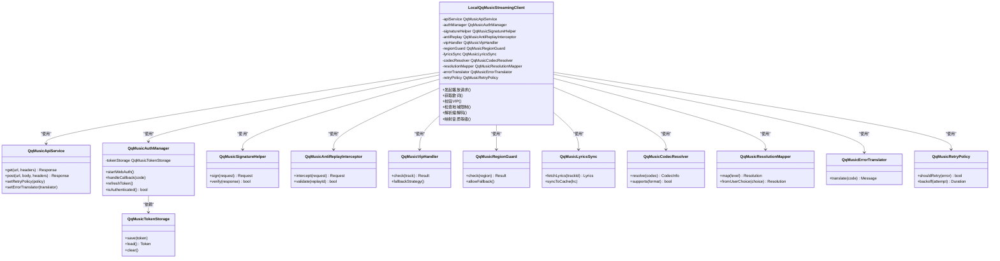

图表来源
- [LocalQqMusicStreamingClient.kt](file://feature/streaming/src/main/java/app/yukine/streaming/providers/qqmusic/LocalQqMusicStreamingClient.kt)
- [QqMusicApiService.kt](file://feature/streaming/src/main/java/app/yukine/streaming/providers/qqmusic/QqMusicApiService.kt)
- [QqMusicAuthManager.kt](file://feature/streaming/src/main/java/app/yukine/streaming/providers/qqmusic/QqMusicAuthManager.kt)
- [QqMusicTokenStorage.kt](file://feature/streaming/src/main/java/app/yukine/streaming/providers/qqmusic/QqMusicTokenStorage.kt)
- [QqMusicSignatureHelper.kt](file://feature/streaming/src/main/java/app/yukine/streaming/providers/qqmusic/QqMusicSignatureHelper.kt)
- [QqMusicAntiReplayInterceptor.kt](file://feature/streaming/src/main/java/app/yukine/streaming/providers/qqmusic/QqMusicAntiReplayInterceptor.kt)
- [QqMusicVipHandler.kt](file://feature/streaming/src/main/java/app/yukine/streaming/providers/qqmusic/QqMusicVipHandler.kt)
- [QqMusicRegionGuard.kt](file://feature/streaming/src/main/java/app/yukine/streaming/providers/qqmusic/QqMusicRegionGuard.kt)
- [QqMusicLyricsSync.kt](file://feature/streaming/src/main/java/app/yukine/streaming/providers/qqmusic/QqMusicLyricsSync.kt)
- [QqMusicCodecResolver.kt](file://feature/streaming/src/main/java/app/yukine/streaming/providers/qqmusic/QqMusicCodecResolver.kt)
- [QqMusicResolutionMapper.kt](file://feature/streaming/src/main/java/app/yukine/streaming/providers/qqmusic/QqMusicResolutionMapper.kt)
- [QqMusicErrorTranslator.kt](file://feature/streaming/src/main/java/app/yukine/streaming/providers/qqmusic/QqMusicErrorTranslator.kt)
- [QqMusicRetryPolicy.kt](file://feature/streaming/src/main/java/app/yukine/streaming/providers/qqmusic/QqMusicRetryPolicy.kt)

## 详细组件分析

### 登录认证机制与网页授权流程
- 网页授权启动：由 StreamingWebAuthActivity 触发，进入 QQ 音乐 OAuth 页面完成用户授权。
- 回调处理：StreamingAuthCallbackController 接收授权码并交由 QqMusicAuthManager 换取令牌。
- 令牌存储：QqMusicTokenStorage 负责安全持久化，避免频繁登录。
- 会话维护：StreamingSessionMaintenanceWorker 定期刷新令牌与会话健康检查。

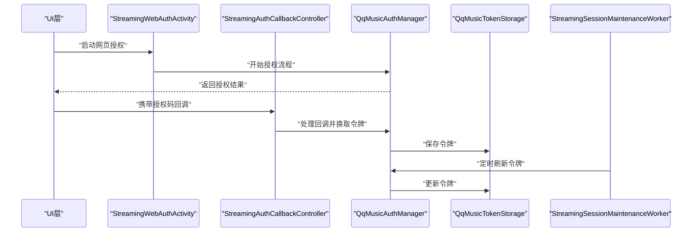

图表来源
- [StreamingWebAuthActivity.kt](file://app/src/main/java/app/yukine/StreamingWebAuthActivity.kt)
- [StreamingAuthCallbackController.kt](file://app/src/main/java/app/yukine/StreamingAuthCallbackController.kt)
- [QqMusicAuthManager.kt](file://feature/streaming/src/main/java/app/yukine/streaming/providers/qqmusic/QqMusicAuthManager.kt)
- [QqMusicTokenStorage.kt](file://feature/streaming/src/main/java/app/yukine/streaming/providers/qqmusic/QqMusicTokenStorage.kt)
- [StreamingSessionMaintenanceWorker.kt](file://app/src/main/java/app/yukine/StreamingSessionMaintenanceWorker.kt)

章节来源
- [StreamingWebAuthActivity.kt](file://app/src/main/java/app/yukine/StreamingWebAuthActivity.kt)
- [StreamingAuthCallbackController.kt](file://app/src/main/java/app/yukine/StreamingAuthCallbackController.kt)
- [QqMusicAuthManager.kt](file://feature/streaming/src/main/java/app/yukine/streaming/providers/qqmusic/QqMusicAuthManager.kt)
- [QqMusicTokenStorage.kt](file://feature/streaming/src/main/java/app/yukine/streaming/providers/qqmusic/QqMusicTokenStorage.kt)
- [StreamingSessionMaintenanceWorker.kt](file://app/src/main/java/app/yukine/StreamingSessionMaintenanceWorker.kt)

### API 调用流程与签名验证
- 请求构建：LocalQqMusicStreamingClient 组装参数与头部，调用 QqMusicSignatureHelper 生成签名。
- 防重放：QqMusicAntiReplayInterceptor 为每个请求附加唯一标识（如时间戳+随机数），服务端需校验。
- 网络请求：QqMusicApiService 执行 HTTP 调用，结合 QqMusicRetryPolicy 进行重试与退避。
- 响应校验：QqMusicSignatureHelper 验证响应签名，QqMusicErrorTranslator 将错误码转换为可读信息。

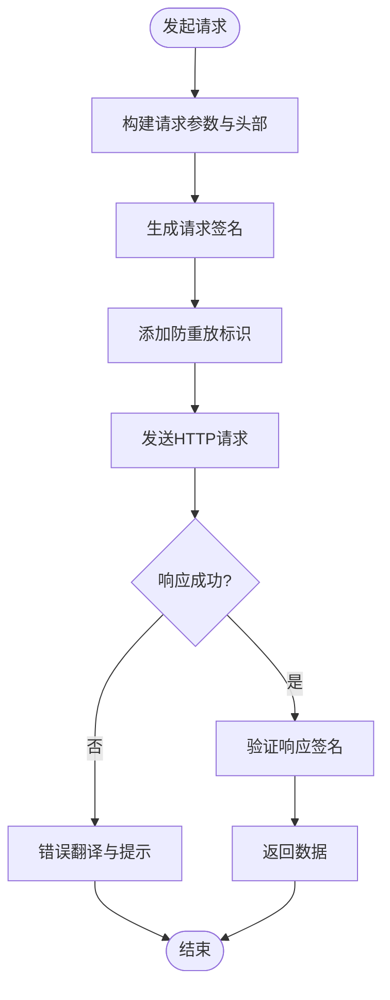

图表来源
- [LocalQqMusicStreamingClient.kt](file://feature/streaming/src/main/java/app/yukine/streaming/providers/qqmusic/LocalQqMusicStreamingClient.kt)
- [QqMusicSignatureHelper.kt](file://feature/streaming/src/main/java/app/yukine/streaming/providers/qqmusic/QqMusicSignatureHelper.kt)
- [QqMusicAntiReplayInterceptor.kt](file://feature/streaming/src/main/java/app/yukine/streaming/providers/qqmusic/QqMusicAntiReplayInterceptor.kt)
- [QqMusicApiService.kt](file://feature/streaming/src/main/java/app/yukine/streaming/providers/qqmusic/QqMusicApiService.kt)
- [QqMusicErrorTranslator.kt](file://feature/streaming/src/main/java/app/yukine/streaming/providers/qqmusic/QqMusicErrorTranslator.kt)

章节来源
- [LocalQqMusicStreamingClient.kt](file://feature/streaming/src/main/java/app/yukine/streaming/providers/qqmusic/LocalQqMusicStreamingClient.kt)
- [QqMusicSignatureHelper.kt](file://feature/streaming/src/main/java/app/yukine/streaming/providers/qqmusic/QqMusicSignatureHelper.kt)
- [QqMusicAntiReplayInterceptor.kt](file://feature/streaming/src/main/java/app/yukine/streaming/providers/qqmusic/QqMusicAntiReplayInterceptor.kt)
- [QqMusicApiService.kt](file://feature/streaming/src/main/java/app/yukine/streaming/providers/qqmusic/QqMusicApiService.kt)
- [QqMusicErrorTranslator.kt](file://feature/streaming/src/main/java/app/yukine/streaming/providers/qqmusic/QqMusicErrorTranslator.kt)

### 播放格式支持与音质等级选择
- 编解码解析：QqMusicCodecResolver 根据服务器返回的 codec 字段判断设备支持情况。
- 音质映射：QqMusicResolutionMapper 将用户选择的音质（标准/高品/无损/母带）映射为具体分辨率参数。
- 策略选择：StreamingPlaybackQualityPolicy 在应用层决定最终音质等级，考虑网络状态与设备能力。

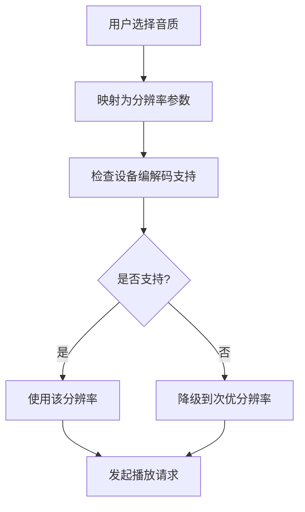

图表来源
- [QqMusicCodecResolver.kt](file://feature/streaming/src/main/java/app/yukine/streaming/providers/qqmusic/QqMusicCodecResolver.kt)
- [QqMusicResolutionMapper.kt](file://feature/streaming/src/main/java/app/yukine/streaming/providers/qqmusic/QqMusicResolutionMapper.kt)
- [StreamingPlaybackQualityPolicy.kt](file://app/src/main/java/app/yukine/StreamingPlaybackQualityPolicy.kt)

章节来源
- [QqMusicCodecResolver.kt](file://feature/streaming/src/main/java/app/yukine/streaming/providers/qqmusic/QqMusicCodecResolver.kt)
- [QqMusicResolutionMapper.kt](file://feature/streaming/src/main/java/app/yukine/streaming/providers/qqmusic/QqMusicResolutionMapper.kt)
- [StreamingPlaybackQualityPolicy.kt](file://app/src/main/java/app/yukine/StreamingPlaybackQualityPolicy.kt)

### VIP 歌曲处理逻辑
- 权限检查：QqMusicVipHandler 在请求前检查当前用户的 VIP 状态与曲目权限。
- 降级策略：若无权限则尝试降级到较低音质或受限版本，必要时提示升级。
- 组合校验：与地域守卫协同，确保同时满足 VIP 与地域要求。

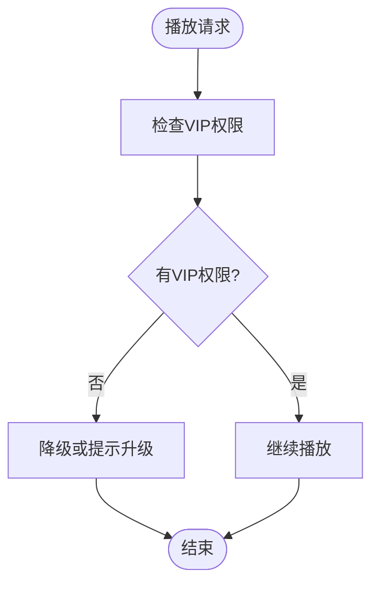

图表来源
- [QqMusicVipHandler.kt](file://feature/streaming/src/main/java/app/yukine/streaming/providers/qqmusic/QqMusicVipHandler.kt)
- [QqMusicRegionGuard.kt](file://feature/streaming/src/main/java/app/yukine/streaming/providers/qqmusic/QqMusicRegionGuard.kt)

章节来源
- [QqMusicVipHandler.kt](file://feature/streaming/src/main/java/app/yukine/streaming/providers/qqmusic/QqMusicVipHandler.kt)
- [QqMusicRegionGuard.kt](file://feature/streaming/src/main/java/app/yukine/streaming/providers/qqmusic/QqMusicRegionGuard.kt)

### 地域限制处理
- 地域检测：QqMusicRegionGuard 根据用户 IP 或账号注册地判断是否允许播放。
- 区域策略：若受限则返回友好提示或切换至可用资源。

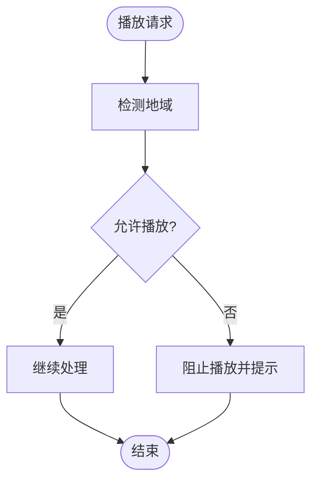

图表来源
- [QqMusicRegionGuard.kt](file://feature/streaming/src/main/java/app/yukine/streaming/providers/qqmusic/QqMusicRegionGuard.kt)

章节来源
- [QqMusicRegionGuard.kt](file://feature/streaming/src/main/java/app/yukine/streaming/providers/qqmusic/QqMusicRegionGuard.kt)

### 歌词同步特殊逻辑
- 歌词获取：QqMusicLyricsSync 根据曲目 ID 拉取歌词数据。
- 缓存与同步：将歌词写入本地缓存，供播放器实时展示。
- 容错：在网络异常或歌词缺失时回退到无歌词模式。

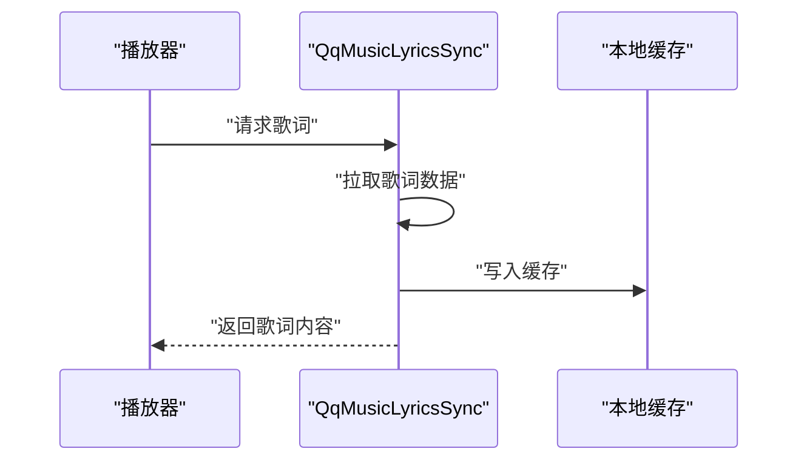

图表来源
- [QqMusicLyricsSync.kt](file://feature/streaming/src/main/java/app/yukine/streaming/providers/qqmusic/QqMusicLyricsSync.kt)

章节来源
- [QqMusicLyricsSync.kt](file://feature/streaming/src/main/java/app/yukine/streaming/providers/qqmusic/QqMusicLyricsSync.kt)

### 加密算法、签名验证与防重放攻击机制
- 加密与签名：QqMusicSignatureHelper 负责请求体与头部的签名生成与响应签名校验。
- 防重放：QqMusicAntiReplayInterceptor 为每次请求附加唯一标识，服务端应拒绝重复请求。
- 安全建议：密钥轮换、时间窗口校验、速率限制与黑名单机制。

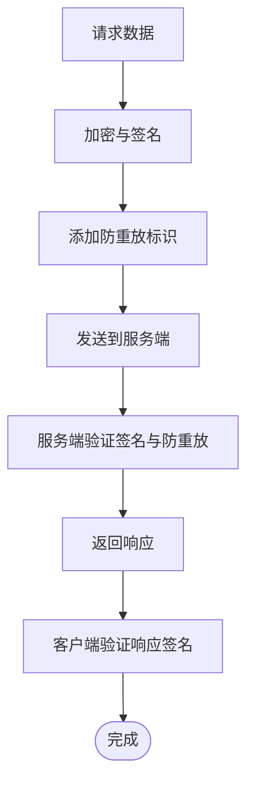

图表来源
- [QqMusicSignatureHelper.kt](file://feature/streaming/src/main/java/app/yukine/streaming/providers/qqmusic/QqMusicSignatureHelper.kt)
- [QqMusicAntiReplayInterceptor.kt](file://feature/streaming/src/main/java/app/yukine/streaming/providers/qqmusic/QqMusicAntiReplayInterceptor.kt)

章节来源
- [QqMusicSignatureHelper.kt](file://feature/streaming/src/main/java/app/yukine/streaming/providers/qqmusic/QqMusicSignatureHelper.kt)
- [QqMusicAntiReplayInterceptor.kt](file://feature/streaming/src/main/java/app/yukine/streaming/providers/qqmusic/QqMusicAntiReplayInterceptor.kt)

### QQ 音乐 API 变更适配方法
- 版本兼容：在 QqMusicApiService 中引入版本路由与字段映射，屏蔽上游变化。
- 错误翻译：QqMusicErrorTranslator 将新错误码映射为用户可见提示。
- 重试策略：QqMusicRetryPolicy 针对临时错误进行自适应重试。
- 配置开关：通过 StreamingGatewaySettingsStore 动态调整行为。

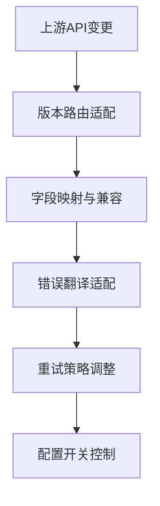

图表来源
- [QqMusicApiService.kt](file://feature/streaming/src/main/java/app/yukine/streaming/providers/qqmusic/QqMusicApiService.kt)
- [QqMusicErrorTranslator.kt](file://feature/streaming/src/main/java/app/yukine/streaming/providers/qqmusic/QqMusicErrorTranslator.kt)
- [QqMusicRetryPolicy.kt](file://feature/streaming/src/main/java/app/yukine/streaming/providers/qqmusic/QqMusicRetryPolicy.kt)
- [StreamingGatewaySettingsStore.kt](file://app/src/main/java/app/yukine/StreamingGatewaySettingsStore.kt)

章节来源
- [QqMusicApiService.kt](file://feature/streaming/src/main/java/app/yukine/streaming/providers/qqmusic/QqMusicApiService.kt)
- [QqMusicErrorTranslator.kt](file://feature/streaming/src/main/java/app/yukine/streaming/providers/qqmusic/QqMusicErrorTranslator.kt)
- [QqMusicRetryPolicy.kt](file://feature/streaming/src/main/java/app/yukine/streaming/providers/qqmusic/QqMusicRetryPolicy.kt)
- [StreamingGatewaySettingsStore.kt](file://app/src/main/java/app/yukine/StreamingGatewaySettingsStore.kt)

## 依赖关系分析
- 耦合度：LocalQqMusicStreamingClient 作为协调者，依赖多个细粒度组件，保持低耦合与高内聚。
- 外部依赖：QqMusicApiService 对外部网络库进行封装，便于替换与测试。
- 循环依赖：未发现直接循环依赖；通过接口与策略模式降低耦合。

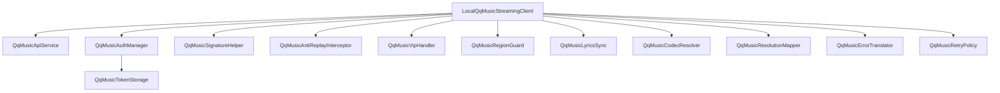

图表来源
- [LocalQqMusicStreamingClient.kt](file://feature/streaming/src/main/java/app/yukine/streaming/providers/qqmusic/LocalQqMusicStreamingClient.kt)
- [QqMusicApiService.kt](file://feature/streaming/src/main/java/app/yukine/streaming/providers/qqmusic/QqMusicApiService.kt)
- [QqMusicAuthManager.kt](file://feature/streaming/src/main/java/app/yukine/streaming/providers/qqmusic/QqMusicAuthManager.kt)
- [QqMusicTokenStorage.kt](file://feature/streaming/src/main/java/app/yukine/streaming/providers/qqmusic/QqMusicTokenStorage.kt)
- [QqMusicSignatureHelper.kt](file://feature/streaming/src/main/java/app/yukine/streaming/providers/qqmusic/QqMusicSignatureHelper.kt)
- [QqMusicAntiReplayInterceptor.kt](file://feature/streaming/src/main/java/app/yukine/streaming/providers/qqmusic/QqMusicAntiReplayInterceptor.kt)
- [QqMusicVipHandler.kt](file://feature/streaming/src/main/java/app/yukine/streaming/providers/qqmusic/QqMusicVipHandler.kt)
- [QqMusicRegionGuard.kt](file://feature/streaming/src/main/java/app/yukine/streaming/providers/qqmusic/QqMusicRegionGuard.kt)
- [QqMusicLyricsSync.kt](file://feature/streaming/src/main/java/app/yukine/streaming/providers/qqmusic/QqMusicLyricsSync.kt)
- [QqMusicCodecResolver.kt](file://feature/streaming/src/main/java/app/yukine/streaming/providers/qqmusic/QqMusicCodecResolver.kt)
- [QqMusicResolutionMapper.kt](file://feature/streaming/src/main/java/app/yukine/streaming/providers/qqmusic/QqMusicResolutionMapper.kt)
- [QqMusicErrorTranslator.kt](file://feature/streaming/src/main/java/app/yukine/streaming/providers/qqmusic/QqMusicErrorTranslator.kt)
- [QqMusicRetryPolicy.kt](file://feature/streaming/src/main/java/app/yukine/streaming/providers/qqmusic/QqMusicRetryPolicy.kt)

章节来源
- [LocalQqMusicStreamingClient.kt](file://feature/streaming/src/main/java/app/yukine/streaming/providers/qqmusic/LocalQqMusicStreamingClient.kt)

## 性能考虑
- 连接复用与超时：在 QqMusicApiService 中启用连接池与合理超时，减少握手开销。
- 重试与退避：QqMusicRetryPolicy 使用指数退避与抖动，避免雪崩效应。
- 缓存策略：歌词与元数据缓存命中优先，减少网络请求。
- 音质自适应：根据网络质量与电量动态调整音质等级，提升用户体验。
- 后台任务调度：StreamingSessionMaintenanceWorker 使用系统调度器，避免过度唤醒。

[本节为通用性能指导，不直接分析具体文件]

## 故障排查指南
- 认证失败：检查网页授权回调是否正确传递，确认令牌存储有效且未过期。
- 签名错误：核对签名算法与参数顺序，确认时间戳与随机数生成正确。
- 防重放拦截：确认请求唯一标识是否被服务端接受，避免重复提交。
- VIP 限制：检查用户 VIP 状态与曲目权限，必要时降级或提示升级。
- 地域限制：确认用户所在区域是否允许播放，必要时切换节点或提示。
- 歌词缺失：检查歌词接口可用性，回退到无歌词模式并记录日志。
- 错误翻译：查看 QqMusicErrorTranslator 的错误码映射，定位上游问题。

章节来源
- [QqMusicAuthManager.kt](file://feature/streaming/src/main/java/app/yukine/streaming/providers/qqmusic/QqMusicAuthManager.kt)
- [QqMusicSignatureHelper.kt](file://feature/streaming/src/main/java/app/yukine/streaming/providers/qqmusic/QqMusicSignatureHelper.kt)
- [QqMusicAntiReplayInterceptor.kt](file://feature/streaming/src/main/java/app/yukine/streaming/providers/qqmusic/QqMusicAntiReplayInterceptor.kt)
- [QqMusicVipHandler.kt](file://feature/streaming/src/main/java/app/yukine/streaming/providers/qqmusic/QqMusicVipHandler.kt)
- [QqMusicRegionGuard.kt](file://feature/streaming/src/main/java/app/yukine/streaming/providers/qqmusic/QqMusicRegionGuard.kt)
- [QqMusicLyricsSync.kt](file://feature/streaming/src/main/java/app/yukine/streaming/providers/qqmusic/QqMusicLyricsSync.kt)
- [QqMusicErrorTranslator.kt](file://feature/streaming/src/main/java/app/yukine/streaming/providers/qqmusic/QqMusicErrorTranslator.kt)

## 结论
LocalQqMusicStreamingClient 通过清晰的职责划分与模块化设计，实现了 QQ 音乐平台的完整客户端能力。其认证、签名、防重放、VIP 与地域限制、歌词同步、编解码与音质选择等关键路径均具备可扩展性与健壮性。配合应用层的控制器与策略，能够在复杂网络与业务环境下稳定运行。

[本节为总结性内容，不直接分析具体文件]

## 附录
- 术语表
  - VIP：付费会员权益
  - 音质等级：标准/高品/无损/母带
  - 防重放：防止同一请求被重复提交
  - 地域限制：根据用户地理位置限制播放
- 最佳实践
  - 使用统一的错误翻译与重试策略
  - 对敏感操作进行签名与防重放保护
  - 对用户可见信息进行友好提示与降级处理

[本节为补充信息，不直接分析具体文件]