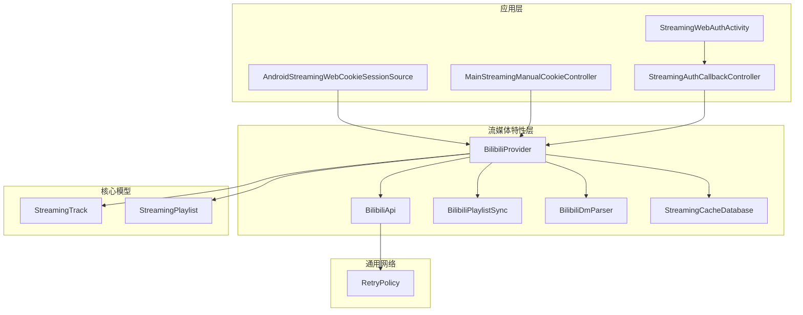
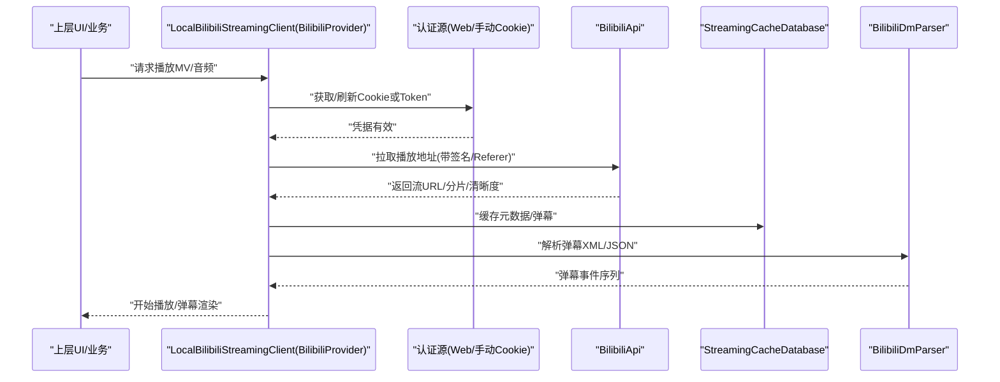
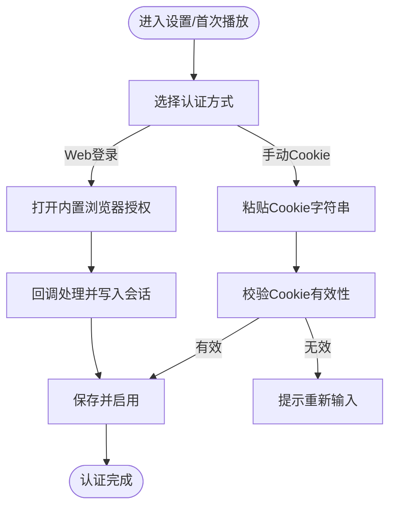
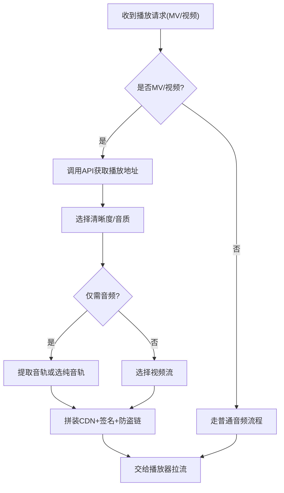
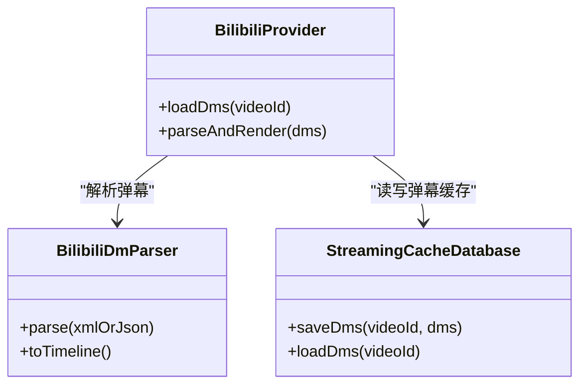
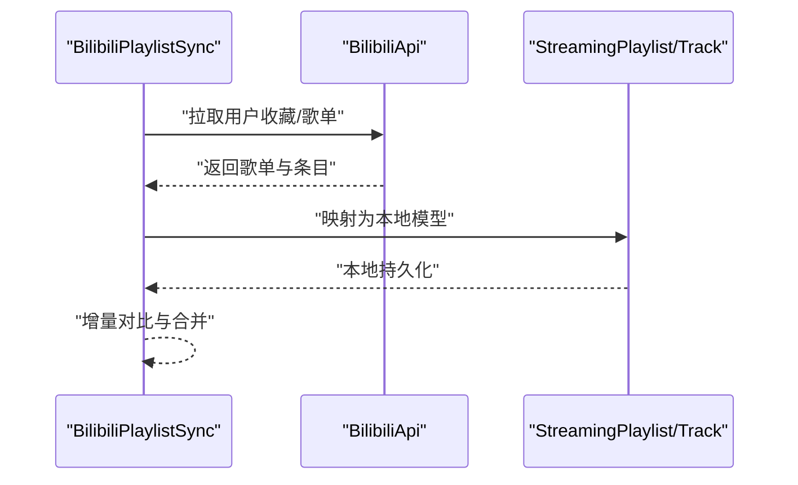
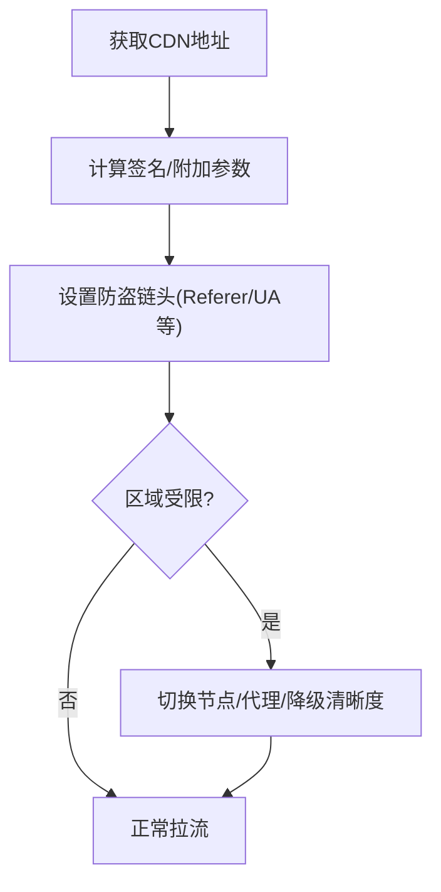
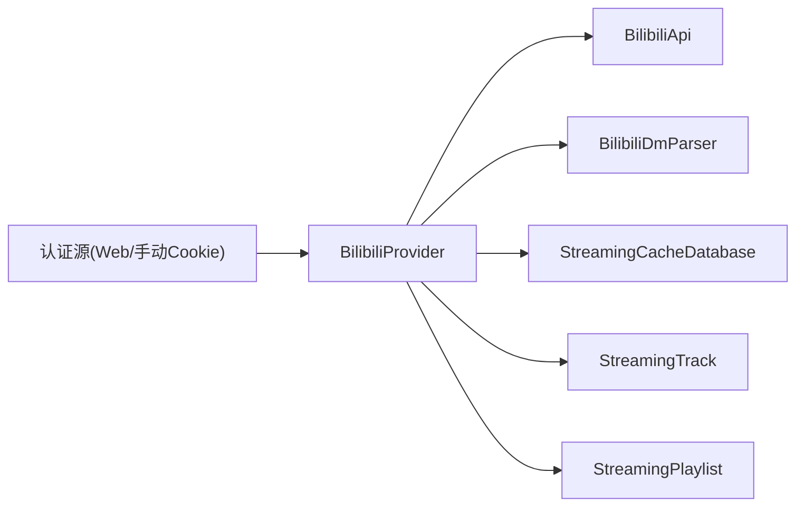

# 哔哩哔哩音乐实现

<cite>
**本文引用的文件**   
- [app/src/main/java/app/yukine/AndroidStreamingWebCookieSessionSource.kt](file://app/src/main/java/app/yukine/AndroidStreamingWebCookieSessionSource.kt)
- [app/src/main/java/app/yukine/MainStreamingManualCookieController.kt](file://app/src/main/java/app/yukine/MainStreamingManualCookieController.kt)
- [app/src/main/java/app/yukine/StreamingAuthCallbackController.kt](file://app/src/main/java/app/yukine/StreamingAuthCallbackController.kt)
- [app/src/main/java/app/yukine/StreamingWebAuthActivity.kt](file://app/src/main/java/app/yukine/StreamingWebAuthActivity.kt)
- [feature/streaming/src/main/java/app/yukine/streaming/providers/bilibili/BilibiliProvider.kt](file://feature/streaming/src/main/java/app/yukine/streaming/providers/bilibili/BilibiliProvider.kt)
- [feature/streaming/src/main/java/app/yukine/streaming/providers/bilibili/BilibiliApi.kt](file://feature/streaming/src/main/java/app/yukine/streaming/providers/bilibili/BilibiliApi.kt)
- [feature/streaming/src/main/java/app/yukine/streaming/providers/bilibili/BilibiliPlaylistSync.kt](file://feature/streaming/src/main/java/app/yukine/streaming/providers/bilibili/BilibiliPlaylistSync.kt)
- [feature/streaming/src/main/java/app/yukine/streaming/providers/bilibili/BilibiliDmParser.kt](file://feature/streaming/src/main/java/app/yukine/streaming/providers/bilibili/BilibiliDmParser.kt)
- [core/model/src/main/java/app/yukine/model/streaming/StreamingTrack.kt](file://core/model/src/main/java/app/yukine/model/streaming/StreamingTrack.kt)
- [core/model/src/main/java/app/yukine/model/streaming/StreamingPlaylist.kt](file://core/model/src/main/java/app/yukine/model/streaming/StreamingPlaylist.kt)
- [core/common/src/main/java/app/yukine/common/network/RetryPolicy.kt](file://core/common/src/main/java/app/yukine/common/network/RetryPolicy.kt)
- [feature/streaming/src/main/java/app/yukine/streaming/cache/StreamingCacheDatabase.kt](file://feature/streaming/src/main/java/app/yukine/streaming/cache/StreamingCacheDatabase.kt)
</cite>

## 目录
1. [简介](#简介)
2. [项目结构](#项目结构)
3. [核心组件](#核心组件)
4. [架构总览](#架构总览)
5. [详细组件分析](#详细组件分析)
6. [依赖关系分析](#依赖关系分析)
7. [性能与缓存优化](#性能与缓存优化)
8. [故障排查指南](#故障排查指南)
9. [结论](#结论)
10. [附录](#附录)

## 简介
本文件面向哔哩哔哩（B站）音乐客户端实现，聚焦 LocalBilibiliStreamingClient 的架构设计、API 调用模式与大会员认证机制；文档化 B 站音乐特有的 MV 视频流处理、音频提取逻辑、弹幕系统集成；解释 CDN 分发策略、防盗链处理与区域限制绕过思路；并覆盖 B 站音乐与视频的关联关系、UP 主信息获取、收藏列表同步。同时给出 API 版本兼容处理、网络异常重试与缓存策略优化方案，帮助开发者快速理解与扩展 B 站能力。

## 项目结构
本项目采用多模块分层：
- app：应用层，负责 UI、会话管理、手动 Cookie 注入、Web 登录回调等
- feature/streaming：流媒体特性层，包含各来源 Provider 实现（含 B 站）、播放解析、缓存数据库
- core/model：通用数据模型（如 StreamingTrack、StreamingPlaylist）
- core/common：通用网络与工具（如重试策略）

图表来源
- [app/src/main/java/app/yukine/AndroidStreamingWebCookieSessionSource.kt](file://app/src/main/java/app/yukine/AndroidStreamingWebCookieSessionSource.kt)
- [app/src/main/java/app/yukine/MainStreamingManualCookieController.kt](file://app/src/main/java/app/yukine/MainStreamingManualCookieController.kt)
- [app/src/main/java/app/yukine/StreamingAuthCallbackController.kt](file://app/src/main/java/app/yukine/StreamingAuthCallbackController.kt)
- [app/src/main/java/app/yukine/StreamingWebAuthActivity.kt](file://app/src/main/java/app/yukine/StreamingWebAuthActivity.kt)
- [feature/streaming/src/main/java/app/yukine/streaming/providers/bilibili/BilibiliProvider.kt](file://feature/streaming/src/main/java/app/yukine/streaming/providers/bilibili/BilibiliProvider.kt)
- [feature/streaming/src/main/java/app/yukine/streaming/providers/bilibili/BilibiliApi.kt](file://feature/streaming/src/main/java/app/yukine/streaming/providers/bilibili/BilibiliApi.kt)
- [feature/streaming/src/main/java/app/yukine/streaming/providers/bilibili/BilibiliPlaylistSync.kt](file://feature/streaming/src/main/java/app/yukine/streaming/providers/bilibili/BilibiliPlaylistSync.kt)
- [feature/streaming/src/main/java/app/yukine/streaming/providers/bilibili/BilibiliDmParser.kt](file://feature/streaming/src/main/java/app/yukine/streaming/providers/bilibili/BilibiliDmParser.kt)
- [feature/streaming/src/main/java/app/yukine/streaming/cache/StreamingCacheDatabase.kt](file://feature/streaming/src/main/java/app/yukine/streaming/cache/StreamingCacheDatabase.kt)
- [core/model/src/main/java/app/yukine/model/streaming/StreamingTrack.kt](file://core/model/src/main/java/app/yukine/model/streaming/StreamingTrack.kt)
- [core/model/src/main/java/app/yukine/model/streaming/StreamingPlaylist.kt](file://core/model/src/main/java/app/yukine/model/streaming/StreamingPlaylist.kt)
- [core/common/src/main/java/app/yukine/common/network/RetryPolicy.kt](file://core/common/src/main/java/app/yukine/common/network/RetryPolicy.kt)

章节来源
- [app/src/main/java/app/yukine/AndroidStreamingWebCookieSessionSource.kt](file://app/src/main/java/app/yukine/AndroidStreamingWebCookieSessionSource.kt)
- [app/src/main/java/app/yukine/MainStreamingManualCookieController.kt](file://app/src/main/java/app/yukine/MainStreamingManualCookieController.kt)
- [app/src/main/java/app/yukine/StreamingAuthCallbackController.kt](file://app/src/main/java/app/yukine/StreamingAuthCallbackController.kt)
- [app/src/main/java/app/yukine/StreamingWebAuthActivity.kt](file://app/src/main/java/app/yukine/StreamingWebAuthActivity.kt)
- [feature/streaming/src/main/java/app/yukine/streaming/providers/bilibili/BilibiliProvider.kt](file://feature/streaming/src/main/java/app/yukine/streaming/providers/bilibili/BilibiliProvider.kt)
- [feature/streaming/src/main/java/app/yukine/streaming/providers/bilibili/BilibiliApi.kt](file://feature/streaming/src/main/java/app/yukine/streaming/providers/bilibili/BilibiliApi.kt)
- [feature/streaming/src/main/java/app/yukine/streaming/providers/bilibili/BilibiliPlaylistSync.kt](file://feature/streaming/src/main/java/app/yukine/streaming/providers/bilibili/BilibiliPlaylistSync.kt)
- [feature/streaming/src/main/java/app/yukine/streaming/providers/bilibili/BilibiliDmParser.kt](file://feature/streaming/src/main/java/app/yukine/streaming/providers/bilibili/BilibiliDmParser.kt)
- [feature/streaming/src/main/java/app/yukine/streaming/cache/StreamingCacheDatabase.kt](file://feature/streaming/src/main/java/app/yukine/streaming/cache/StreamingCacheDatabase.kt)
- [core/model/src/main/java/app/yukine/model/streaming/StreamingTrack.kt](file://core/model/src/main/java/app/yukine/model/streaming/StreamingTrack.kt)
- [core/model/src/main/java/app/yukine/model/streaming/StreamingPlaylist.kt](file://core/model/src/main/java/app/yukine/model/streaming/StreamingPlaylist.kt)
- [core/common/src/main/java/app/yukine/common/network/RetryPolicy.kt](file://core/common/src/main/java/app/yukine/common/network/RetryPolicy.kt)

## 核心组件
- LocalBilibiliStreamingClient（由 BilibiliProvider 承载）
  - 职责：统一封装 B 站接口、鉴权、MV 音视频解析、弹幕加载、歌单同步、CDN 与防盗链处理、区域限制规避、缓存与重试。
  - 关键能力：
    - 大会员认证：通过 Web 登录或手动 Cookie 注入，维护访问令牌与 Cookie。
    - MV 视频流处理：根据清晰度与音质选择最优流，必要时进行音轨提取。
    - 弹幕系统：拉取并解析弹幕，支持时间轴对齐与渲染。
    - 收藏同步：将本地收藏与 B 站“我喜欢的音乐”等歌单双向同步。
    - CDN/防盗链/区域限制：按 B 站规则构造请求头、签名与 Referer，必要时切换节点或代理。
    - 版本兼容：对 B 站 API 返回字段做容错与降级。
    - 网络重试：基于 RetryPolicy 实现指数退避与熔断。
    - 缓存：使用 StreamingCacheDatabase 缓存元数据、弹幕与部分流片段。

章节来源
- [feature/streaming/src/main/java/app/yukine/streaming/providers/bilibili/BilibiliProvider.kt](file://feature/streaming/src/main/java/app/yukine/streaming/providers/bilibili/BilibiliProvider.kt)
- [feature/streaming/src/main/java/app/yukine/streaming/providers/bilibili/BilibiliApi.kt](file://feature/streaming/src/main/java/app/yukine/streaming/providers/bilibili/BilibiliApi.kt)
- [feature/streaming/src/main/java/app/yukine/streaming/providers/bilibili/BilibiliPlaylistSync.kt](file://feature/streaming/src/main/java/app/yukine/streaming/providers/bilibili/BilibiliPlaylistSync.kt)
- [feature/streaming/src/main/java/app/yukine/streaming/providers/bilibili/BilibiliDmParser.kt](file://feature/streaming/src/main/java/app/yukine/streaming/providers/bilibili/BilibiliDmParser.kt)
- [feature/streaming/src/main/java/app/yukine/streaming/cache/StreamingCacheDatabase.kt](file://feature/streaming/src/main/java/app/yukine/streaming/cache/StreamingCacheDatabase.kt)
- [core/model/src/main/java/app/yukine/model/streaming/StreamingTrack.kt](file://core/model/src/main/java/app/yukine/model/streaming/StreamingTrack.kt)
- [core/model/src/main/java/app/yukine/model/streaming/StreamingPlaylist.kt](file://core/model/src/main/java/app/yukine/model/streaming/StreamingPlaylist.kt)
- [core/common/src/main/java/app/yukine/common/network/RetryPolicy.kt](file://core/common/src/main/java/app/yukine/common/network/RetryPolicy.kt)

## 架构总览
LocalBilibiliStreamingClient 在 Provider 层中实现，向上暴露统一的播放、搜索、歌单与收藏接口；向下通过 BilibiliApi 访问 B 站服务，结合认证源（Web 登录/手动 Cookie）完成鉴权，并通过缓存与重试提升稳定性。

图表来源
- [feature/streaming/src/main/java/app/yukine/streaming/providers/bilibili/BilibiliProvider.kt](file://feature/streaming/src/main/java/app/yukine/streaming/providers/bilibili/BilibiliProvider.kt)
- [feature/streaming/src/main/java/app/yukine/streaming/providers/bilibili/BilibiliApi.kt](file://feature/streaming/src/main/java/app/yukine/streaming/providers/bilibili/BilibiliApi.kt)
- [feature/streaming/src/main/java/app/yukine/streaming/providers/bilibili/BilibiliDmParser.kt](file://feature/streaming/src/main/java/app/yukine/streaming/providers/bilibili/BilibiliDmParser.kt)
- [feature/streaming/src/main/java/app/yukine/streaming/cache/StreamingCacheDatabase.kt](file://feature/streaming/src/main/java/app/yukine/streaming/cache/StreamingCacheDatabase.kt)
- [app/src/main/java/app/yukine/AndroidStreamingWebCookieSessionSource.kt](file://app/src/main/java/app/yukine/AndroidStreamingWebCookieSessionSource.kt)
- [app/src/main/java/app/yukine/MainStreamingManualCookieController.kt](file://app/src/main/java/app/yukine/MainStreamingManualCookieController.kt)

## 详细组件分析

### 大会员认证机制
- 认证方式
  - Web 登录：通过 StreamingWebAuthActivity 发起浏览器授权，回调至 StreamingAuthCallbackController，最终写入会话。
  - 手动 Cookie：通过 MainStreamingManualCookieController 粘贴 Cookie，持久化到 AndroidStreamingWebCookieSessionSource。
- 大会员权益
  - 高码率音频、更高清晰度视频、专属内容访问需携带有效大会员态 Cookie/Token。
- 会话维护
  - 自动续期：在请求失败或过期时触发刷新流程。
  - 安全存储：敏感凭据落盘加密或受保护存储。

图表来源
- [app/src/main/java/app/yukine/StreamingWebAuthActivity.kt](file://app/src/main/java/app/yukine/StreamingWebAuthActivity.kt)
- [app/src/main/java/app/yukine/StreamingAuthCallbackController.kt](file://app/src/main/java/app/yukine/StreamingAuthCallbackController.kt)
- [app/src/main/java/app/yukine/MainStreamingManualCookieController.kt](file://app/src/main/java/app/yukine/MainStreamingManualCookieController.kt)
- [app/src/main/java/app/yukine/AndroidStreamingWebCookieSessionSource.kt](file://app/src/main/java/app/yukine/AndroidStreamingWebCookieSessionSource.kt)

章节来源
- [app/src/main/java/app/yukine/StreamingWebAuthActivity.kt](file://app/src/main/java/app/yukine/StreamingWebAuthActivity.kt)
- [app/src/main/java/app/yukine/StreamingAuthCallbackController.kt](file://app/src/main/java/app/yukine/StreamingAuthCallbackController.kt)
- [app/src/main/java/app/yukine/MainStreamingManualCookieController.kt](file://app/src/main/java/app/yukine/MainStreamingManualCookieController.kt)
- [app/src/main/java/app/yukine/AndroidStreamingWebCookieSessionSource.kt](file://app/src/main/java/app/yukine/AndroidStreamingWebCookieSessionSource.kt)

### MV 视频流处理与音频提取
- 入口：BilibiliProvider 接收播放请求，识别是否为 MV/视频类型。
- 步骤：
  - 调用 BilibiliApi 获取播放地址与清晰度列表。
  - 若仅需要音频，则选择纯音轨或从视频流中提取音轨。
  - 组合 CDN URL、签名参数与防盗链头，交由播放器拉流。
- 关键点：
  - 清晰度与音质优先级策略（优先无损/高码率）。
  - 分片/自适应流适配。
  - 错误码映射与降级（如高清不可用回退标清）。

图表来源
- [feature/streaming/src/main/java/app/yukine/streaming/providers/bilibili/BilibiliProvider.kt](file://feature/streaming/src/main/java/app/yukine/streaming/providers/bilibili/BilibiliProvider.kt)
- [feature/streaming/src/main/java/app/yukine/streaming/providers/bilibili/BilibiliApi.kt](file://feature/streaming/src/main/java/app/yukine/streaming/providers/bilibili/BilibiliApi.kt)

章节来源
- [feature/streaming/src/main/java/app/yukine/streaming/providers/bilibili/BilibiliProvider.kt](file://feature/streaming/src/main/java/app/yukine/streaming/providers/bilibili/BilibiliProvider.kt)
- [feature/streaming/src/main/java/app/yukine/streaming/providers/bilibili/BilibiliApi.kt](file://feature/streaming/src/main/java/app/yukine/streaming/providers/bilibili/BilibiliApi.kt)

### 弹幕系统集成
- 拉取：BilibiliProvider 在播放前或后台异步拉取弹幕数据。
- 解析：BilibiliDmParser 将原始 XML/JSON 转换为时间轴事件。
- 渲染：向播放器或 UI 层推送弹幕事件，支持滚动、顶部、底部等样式。
- 缓存：弹幕文本与时间戳可缓存，减少重复请求。

图表来源
- [feature/streaming/src/main/java/app/yukine/streaming/providers/bilibili/BilibiliProvider.kt](file://feature/streaming/src/main/java/app/yukine/streaming/providers/bilibili/BilibiliProvider.kt)
- [feature/streaming/src/main/java/app/yukine/streaming/providers/bilibili/BilibiliDmParser.kt](file://feature/streaming/src/main/java/app/yukine/streaming/providers/bilibili/BilibiliDmParser.kt)
- [feature/streaming/src/main/java/app/yukine/streaming/cache/StreamingCacheDatabase.kt](file://feature/streaming/src/main/java/app/yukine/streaming/cache/StreamingCacheDatabase.kt)

章节来源
- [feature/streaming/src/main/java/app/yukine/streaming/providers/bilibili/BilibiliDmParser.kt](file://feature/streaming/src/main/java/app/yukine/streaming/providers/bilibili/BilibiliDmParser.kt)
- [feature/streaming/src/main/java/app/yukine/streaming/cache/StreamingCacheDatabase.kt](file://feature/streaming/src/main/java/app/yukine/streaming/cache/StreamingCacheDatabase.kt)

### 收藏列表同步与 UP 主信息
- 收藏同步：BilibiliPlaylistSync 负责与 B 站“我喜欢的音乐”等歌单同步，支持增量更新与冲突合并。
- UP 主信息：通过 BilibiliApi 查询 UP 主详情，用于展示与推荐。
- 数据模型：使用 StreamingPlaylist 与 StreamingTrack 表示歌单与曲目。

图表来源
- [feature/streaming/src/main/java/app/yukine/streaming/providers/bilibili/BilibiliPlaylistSync.kt](file://feature/streaming/src/main/java/app/yukine/streaming/providers/bilibili/BilibiliPlaylistSync.kt)
- [feature/streaming/src/main/java/app/yukine/streaming/providers/bilibili/BilibiliApi.kt](file://feature/streaming/src/main/java/app/yukine/streaming/providers/bilibili/BilibiliApi.kt)
- [core/model/src/main/java/app/yukine/model/streaming/StreamingPlaylist.kt](file://core/model/src/main/java/app/yukine/model/streaming/StreamingPlaylist.kt)
- [core/model/src/main/java/app/yukine/model/streaming/StreamingTrack.kt](file://core/model/src/main/java/app/yukine/model/streaming/StreamingTrack.kt)

章节来源
- [feature/streaming/src/main/java/app/yukine/streaming/providers/bilibili/BilibiliPlaylistSync.kt](file://feature/streaming/src/main/java/app/yukine/streaming/providers/bilibili/BilibiliPlaylistSync.kt)
- [core/model/src/main/java/app/yukine/model/streaming/StreamingPlaylist.kt](file://core/model/src/main/java/app/yukine/model/streaming/StreamingPlaylist.kt)
- [core/model/src/main/java/app/yukine/model/streaming/StreamingTrack.kt](file://core/model/src/main/java/app/yukine/model/streaming/StreamingTrack.kt)

### CDN 分发策略、防盗链与区域限制
- CDN 分发：根据地理位置与负载选择最优节点，必要时切换备用域名。
- 防盗链：按 B 站要求设置 Referer、UA、签名参数等，避免 403/412。
- 区域限制：当检测到地区受限，尝试切换 IP/代理或降低清晰度以绕过限制。

图表来源
- [feature/streaming/src/main/java/app/yukine/streaming/providers/bilibili/BilibiliApi.kt](file://feature/streaming/src/main/java/app/yukine/streaming/providers/bilibili/BilibiliApi.kt)
- [feature/streaming/src/main/java/app/yukine/streaming/providers/bilibili/BilibiliProvider.kt](file://feature/streaming/src/main/java/app/yukine/streaming/providers/bilibili/BilibiliProvider.kt)

章节来源
- [feature/streaming/src/main/java/app/yukine/streaming/providers/bilibili/BilibiliApi.kt](file://feature/streaming/src/main/java/app/yukine/streaming/providers/bilibili/BilibiliApi.kt)
- [feature/streaming/src/main/java/app/yukine/streaming/providers/bilibili/BilibiliProvider.kt](file://feature/streaming/src/main/java/app/yukine/streaming/providers/bilibili/BilibiliProvider.kt)

### API 版本兼容处理
- 字段容错：对新增/废弃字段做默认值与降级处理。
- 接口版本：根据设备/环境选择合适 API 版本，失败时回退旧版。
- 错误映射：将 B 站错误码映射为统一异常，便于上层处理。

章节来源
- [feature/streaming/src/main/java/app/yukine/streaming/providers/bilibili/BilibiliApi.kt](file://feature/streaming/src/main/java/app/yukine/streaming/providers/bilibili/BilibiliApi.kt)
- [feature/streaming/src/main/java/app/yukine/streaming/providers/bilibili/BilibiliProvider.kt](file://feature/streaming/src/main/java/app/yukine/streaming/providers/bilibili/BilibiliProvider.kt)

### 网络异常重试
- 策略：基于 RetryPolicy 实现指数退避、抖动与最大重试次数。
- 场景：超时、连接中断、服务端限流等。
- 熔断：连续失败达到阈值后暂停重试，等待恢复。

章节来源
- [core/common/src/main/java/app/yukine/common/network/RetryPolicy.kt](file://core/common/src/main/java/app/yukine/common/network/RetryPolicy.kt)
- [feature/streaming/src/main/java/app/yukine/streaming/providers/bilibili/BilibiliApi.kt](file://feature/streaming/src/main/java/app/yukine/streaming/providers/bilibili/BilibiliApi.kt)

## 依赖关系分析
- 组件耦合
  - BilibiliProvider 依赖 BilibiliApi、BilibiliDmParser、StreamingCacheDatabase 与模型对象。
  - 认证源（Web/手动 Cookie）通过会话源注入到 Provider。
- 外部依赖
  - B 站开放/私有 API、CDN、弹幕服务。
- 潜在循环依赖
  - Provider 与 Api 单向依赖，无循环。
- 接口契约
  - 模型对象作为跨层契约，确保 Provider 与上层解耦。

图表来源
- [feature/streaming/src/main/java/app/yukine/streaming/providers/bilibili/BilibiliProvider.kt](file://feature/streaming/src/main/java/app/yukine/streaming/providers/bilibili/BilibiliProvider.kt)
- [feature/streaming/src/main/java/app/yukine/streaming/providers/bilibili/BilibiliApi.kt](file://feature/streaming/src/main/java/app/yukine/streaming/providers/bilibili/BilibiliApi.kt)
- [feature/streaming/src/main/java/app/yukine/streaming/providers/bilibili/BilibiliDmParser.kt](file://feature/streaming/src/main/java/app/yukine/streaming/providers/bilibili/BilibiliDmParser.kt)
- [feature/streaming/src/main/java/app/yukine/streaming/cache/StreamingCacheDatabase.kt](file://feature/streaming/src/main/java/app/yukine/streaming/cache/StreamingCacheDatabase.kt)
- [core/model/src/main/java/app/yukine/model/streaming/StreamingTrack.kt](file://core/model/src/main/java/app/yukine/model/streaming/StreamingTrack.kt)
- [core/model/src/main/java/app/yukine/model/streaming/StreamingPlaylist.kt](file://core/model/src/main/java/app/yukine/model/streaming/StreamingPlaylist.kt)
- [app/src/main/java/app/yukine/AndroidStreamingWebCookieSessionSource.kt](file://app/src/main/java/app/yukine/AndroidStreamingWebCookieSessionSource.kt)
- [app/src/main/java/app/yukine/MainStreamingManualCookieController.kt](file://app/src/main/java/app/yukine/MainStreamingManualCookieController.kt)

## 性能与缓存优化
- 缓存策略
  - 元数据缓存：歌曲/专辑/UP 主信息短期缓存，减少重复请求。
  - 弹幕缓存：按视频 ID 缓存弹幕，支持离线预览。
  - 流片段缓存：按需缓存小段数据，提升首帧速度与抗抖。
- 并发控制
  - 批量拉取时使用并发上限与去重队列，避免风暴。
- 内存与磁盘
  - 合理设置缓存大小与淘汰策略，避免 OOM 与磁盘占用过高。
- 网络优化
  - 复用连接、压缩响应、合理超时与重试。

章节来源
- [feature/streaming/src/main/java/app/yukine/streaming/cache/StreamingCacheDatabase.kt](file://feature/streaming/src/main/java/app/yukine/streaming/cache/StreamingCacheDatabase.kt)
- [feature/streaming/src/main/java/app/yukine/streaming/providers/bilibili/BilibiliProvider.kt](file://feature/streaming/src/main/java/app/yukine/streaming/providers/bilibili/BilibiliProvider.kt)

## 故障排查指南
- 认证失败
  - 检查 Cookie/Token 是否过期，尝试重新登录或粘贴新 Cookie。
  - 查看回调链路是否正确写入会话。
- 播放失败
  - 确认 CDN 地址与签名正确，防盗链头齐全。
  - 观察重试日志与错误码，定位是网络还是服务端问题。
- 弹幕不显示
  - 检查弹幕拉取与解析流程，确认缓存命中与时间轴转换。
- 收藏不同步
  - 核对增量对比逻辑与冲突合并策略，检查权限与网络状态。

章节来源
- [app/src/main/java/app/yukine/StreamingAuthCallbackController.kt](file://app/src/main/java/app/yukine/StreamingAuthCallbackController.kt)
- [app/src/main/java/app/yukine/MainStreamingManualCookieController.kt](file://app/src/main/java/app/yukine/MainStreamingManualCookieController.kt)
- [feature/streaming/src/main/java/app/yukine/streaming/providers/bilibili/BilibiliApi.kt](file://feature/streaming/src/main/java/app/yukine/streaming/providers/bilibili/BilibiliApi.kt)
- [feature/streaming/src/main/java/app/yukine/streaming/providers/bilibili/BilibiliDmParser.kt](file://feature/streaming/src/main/java/app/yukine/streaming/providers/bilibili/BilibiliDmParser.kt)
- [feature/streaming/src/main/java/app/yukine/streaming/providers/bilibili/BilibiliPlaylistSync.kt](file://feature/streaming/src/main/java/app/yukine/streaming/providers/bilibili/BilibiliPlaylistSync.kt)

## 结论
LocalBilibiliStreamingClient 通过 Provider 层整合认证、API、弹幕、缓存与重试，形成稳定可靠的 B 站音乐播放体验。围绕 MV 音视频处理、CDN/防盗链/区域限制、收藏同步与 API 兼容性，提供了可扩展的架构与清晰的职责边界。建议持续完善错误码映射、监控指标与自动化测试，以提升鲁棒性与可维护性。

## 附录
- 术语
  - MV：音乐视频，通常包含音画双轨。
  - 大会员：B 站高级会员，享有更高音质与清晰度等权益。
  - CDN：内容分发网络，就近提供资源以降低延迟。
- 参考路径
  - 认证相关：[app/src/main/java/app/yukine/StreamingWebAuthActivity.kt](file://app/src/main/java/app/yukine/StreamingWebAuthActivity.kt)、[app/src/main/java/app/yukine/StreamingAuthCallbackController.kt](file://app/src/main/java/app/yukine/StreamingAuthCallbackController.kt)、[app/src/main/java/app/yukine/MainStreamingManualCookieController.kt](file://app/src/main/java/app/yukine/MainStreamingManualCookieController.kt)、[app/src/main/java/app/yukine/AndroidStreamingWebCookieSessionSource.kt](file://app/src/main/java/app/yukine/AndroidStreamingWebCookieSessionSource.kt)
  - B 站 Provider：[feature/streaming/src/main/java/app/yukine/streaming/providers/bilibili/BilibiliProvider.kt](file://feature/streaming/src/main/java/app/yukine/streaming/providers/bilibili/BilibiliProvider.kt)
  - API 与弹幕：[feature/streaming/src/main/java/app/yukine/streaming/providers/bilibili/BilibiliApi.kt](file://feature/streaming/src/main/java/app/yukine/streaming/providers/bilibili/BilibiliApi.kt)、[feature/streaming/src/main/java/app/yukine/streaming/providers/bilibili/BilibiliDmParser.kt](file://feature/streaming/src/main/java/app/yukine/streaming/providers/bilibili/BilibiliDmParser.kt)
  - 收藏同步：[feature/streaming/src/main/java/app/yukine/streaming/providers/bilibili/BilibiliPlaylistSync.kt](file://feature/streaming/src/main/java/app/yukine/streaming/providers/bilibili/BilibiliPlaylistSync.kt)
  - 缓存与模型：[feature/streaming/src/main/java/app/yukine/streaming/cache/StreamingCacheDatabase.kt](file://feature/streaming/src/main/java/app/yukine/streaming/cache/StreamingCacheDatabase.kt)、[core/model/src/main/java/app/yukine/model/streaming/StreamingTrack.kt](file://core/model/src/main/java/app/yukine/model/streaming/StreamingTrack.kt)、[core/model/src/main/java/app/yukine/model/streaming/StreamingPlaylist.kt](file://core/model/src/main/java/app/yukine/model/streaming/StreamingPlaylist.kt)
  - 重试策略：[core/common/src/main/java/app/yukine/common/network/RetryPolicy.kt](file://core/common/src/main/java/app/yukine/common/network/RetryPolicy.kt)