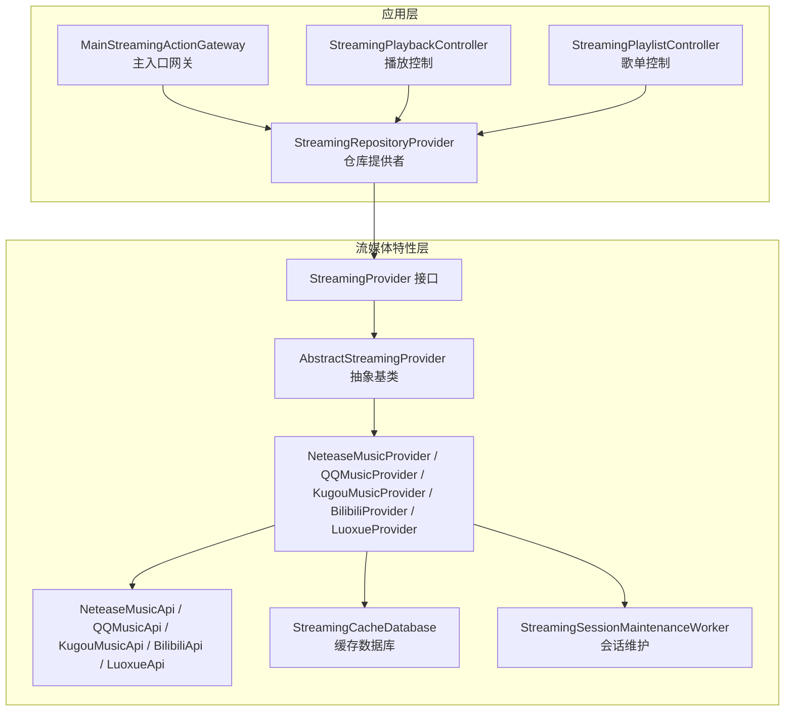
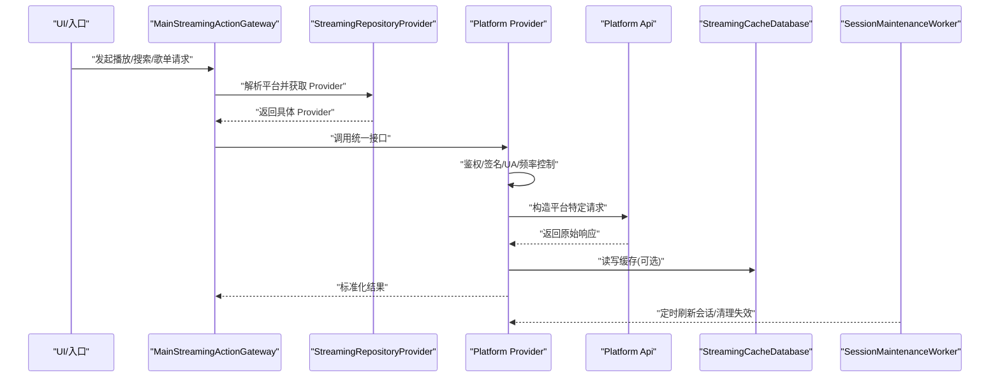
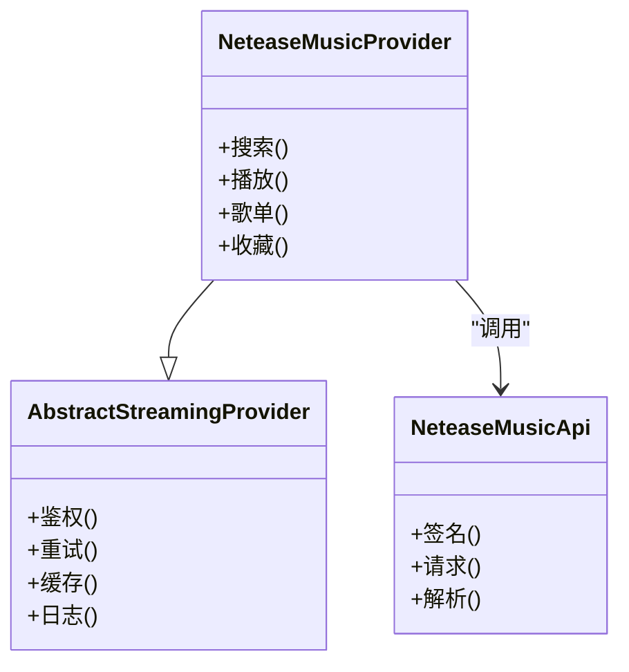
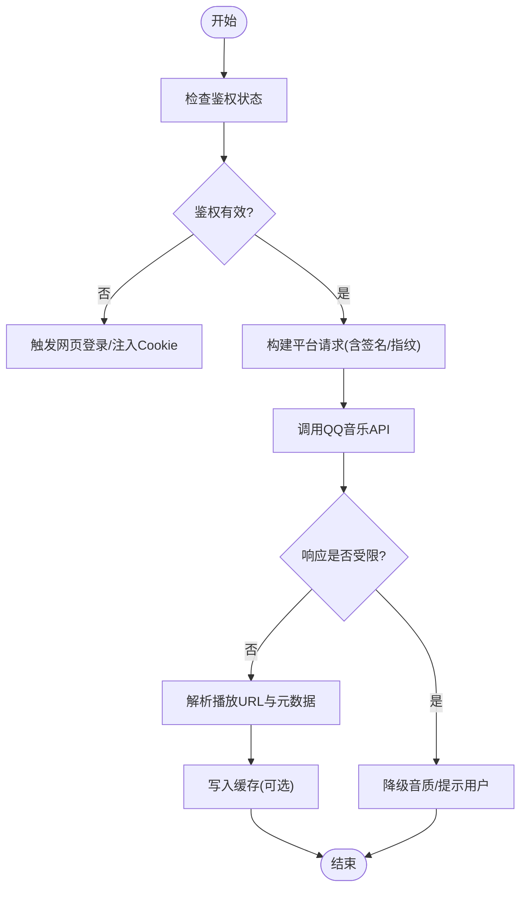
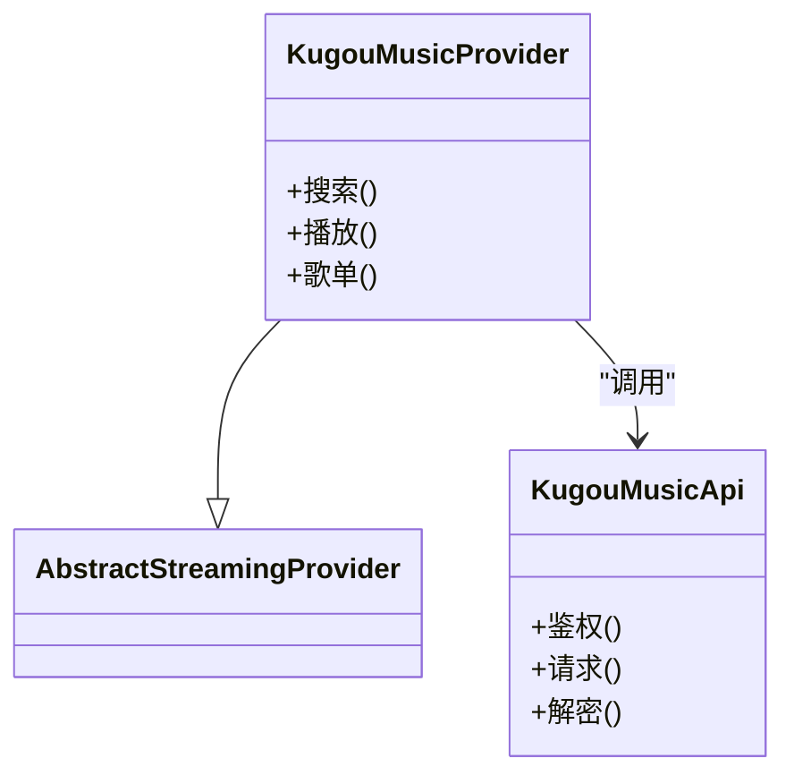
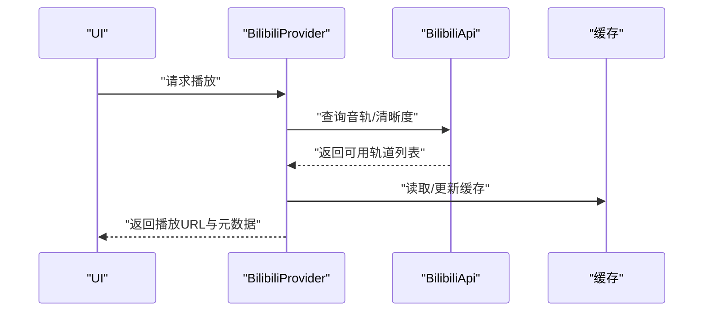
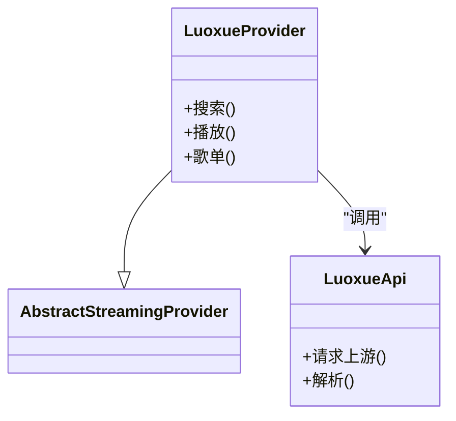
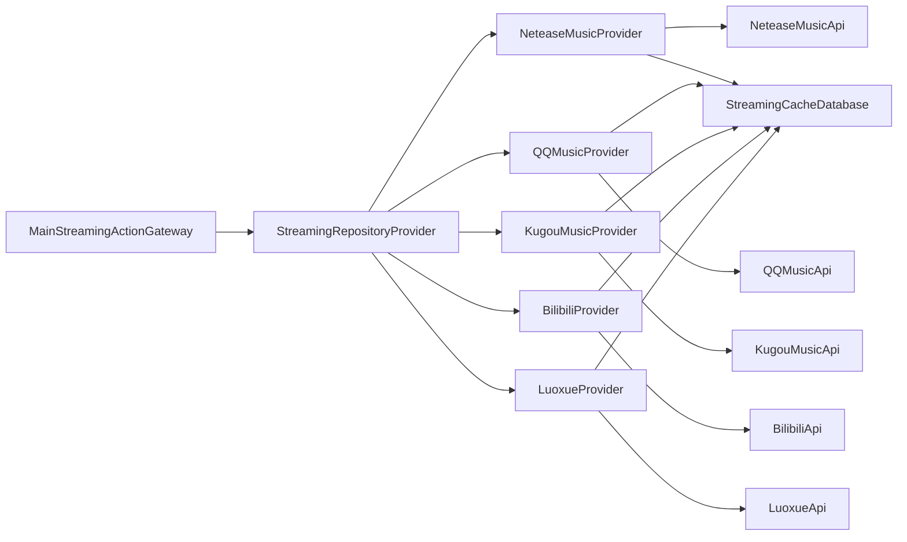

# 平台具体实现

<cite>
**本文引用的文件**   
- [README.md](file://README.md)
- [app/src/main/java/app/yukine/StreamingModule.kt](file://app/src/main/java/app/yukine/StreamingModule.kt)
- [app/src/main/java/app/yukine/MainStreamingActionGateway.kt](file://app/src/main/java/app/yukine/MainStreamingActionGateway.kt)
- [app/src/main/java/app/yukine/StreamingPlaybackController.kt](file://app/src/main/java/app/yukine/StreamingPlaybackController.kt)
- [app/src/main/java/app/yukine/StreamingPlaylistController.kt](file://app/src/main/java/app/yukine/StreamingPlaylistController.kt)
- [app/src/main/java/app/yukine/StreamingRepositoryProvider.kt](file://app/src/main/java/app/yukine/StreamingRepositoryProvider.kt)
- [feature/streaming/src/main/java/app/yukine/streaming/providers/NeteaseMusicProvider.kt](file://feature/streaming/src/main/java/app/yukine/streaming/providers/NeteaseMusicProvider.kt)
- [feature/streaming/src/main/java/app/yukine/streaming/providers/QQMusicProvider.kt](file://feature/streaming/src/main/java/app/yukine/streaming/providers/QQMusicProvider.kt)
- [feature/streaming/src/main/java/app/yukine/streaming/providers/KugouMusicProvider.kt](file://feature/streaming/src/main/java/app/yukine/streaming/providers/KugouMusicProvider.kt)
- [feature/streaming/src/main/java/app/yukine/streaming/providers/BilibiliProvider.kt](file://feature/streaming/src/main/java/app/yukine/streaming/providers/BilibiliProvider.kt)
- [feature/streaming/src/main/java/app/yukine/streaming/providers/LuoxueProvider.kt](file://feature/streaming/src/main/java/app/yukine/streaming/providers/LuoxueProvider.kt)
- [feature/streaming/src/main/java/app/yukine/streaming/providers/AbstractStreamingProvider.kt](file://feature/streaming/src/main/java/app/yukine/streaming/providers/AbstractStreamingProvider.kt)
- [feature/streaming/src/main/java/app/yukine/streaming/providers/StreamingProvider.kt](file://feature/streaming/src/main/java/app/yukine/streaming/providers/StreamingProvider.kt)
- [feature/streaming/src/main/java/app/yukine/streaming/providers/NeteaseMusicApi.kt](file://feature/streaming/src/main/java/app/yukine/streaming/providers/NeteaseMusicApi.kt)
- [feature/streaming/src/main/java/app/yukine/streaming/providers/QQMusicApi.kt](file://feature/streaming/src/main/java/app/yukine/streaming/providers/QQMusicApi.kt)
- [feature/streaming/src/main/java/app/yukine/streaming/providers/KugouMusicApi.kt](file://feature/streaming/src/main/java/app/yukine/streaming/providers/KugouMusicApi.kt)
- [feature/streaming/src/main/java/app/yukine/streaming/providers/BilibiliApi.kt](file://feature/streaming/src/main/java/app/yukine/streaming/providers/BilibiliApi.kt)
- [feature/streaming/src/main/java/app/yukine/streaming/providers/LuoxueApi.kt](file://feature/streaming/src/main/java/app/yukine/streaming/providers/LuoxueApi.kt)
- [feature/streaming/src/main/java/app/yukine/streaming/cache/StreamingCacheDatabase.kt](file://feature/streaming/src/main/java/app/yukine/streaming/cache/StreamingCacheDatabase.kt)
- [feature/streaming/src/main/java/app/yukine/streaming/StreamingSessionMaintenanceWorker.kt](file://feature/streaming/src/main/java/app/yukine/streaming/StreamingSessionMaintenanceWorker.kt)
- [app/src/main/java/app/yukine/StreamingWebAuthActivity.kt](file://app/src/main/java/app/yukine/StreamingWebAuthActivity.kt)
- [app/src/main/java/app/yukine/AndroidStreamingWebCookieSessionSource.kt](file://app/src/main/java/app/yukine/AndroidStreamingWebCookieSessionSource.kt)
- [app/src/main/java/app/yukine/StreamingManualCookieController.kt](file://app/src/main/java/app/yukine/StreamingManualCookieController.kt)
- [app/src/main/java/app/yukine/StreamingManualCookieDialogController.java](file://app/src/main/java/app/yukine/StreamingManualCookieDialogController.java)
- [app/src/main/java/app/yukine/NetworkRequestController.kt](file://app/src/main/java/app/yukine/NetworkRequestController.kt)
- [app/src/main/java/app/yukine/StreamingPlaybackQualityPolicy.kt](file://app/src/main/java/app/yukine/StreamingPlaybackQualityPolicy.kt)
- [app/src/main/java/app/yukine/PlaybackResolutionTelemetry.kt](file://app/src/main/java/app/yukine/PlaybackResolutionTelemetry.kt)
- [app/src/main/java/app/yukine/DownloadRequestController.kt](file://app/src/main/java/app/yukine/DownloadRequestController.kt)
- [app/src/main/java/app/yukine/TrackDownloadManager.kt](file://app/src/main/java/app/yukine/TrackDownloadManager.kt)
- [app/src/main/java/app/yukine/StreamingStatusTextFactory.kt](file://app/src/main/java/app/yukine/StreamingStatusTextFactory.kt)
- [app/src/main/java/app/yukine/StreamingAuthCallbackController.kt](file://app/src/main/java/app/yukine/StreamingAuthCallbackController.kt)
- [app/src/main/java/app/yukine/EnsureStreamingLoginPlaylistUseCase.kt](file://app/src/main/java/app/yukine/EnsureStreamingLoginPlaylistUseCase.kt)
- [app/src/main/java/app/yukine/ImportStreamingPlaylistUseCase.kt](file://app/src/main/java/app/yukine/ImportStreamingPlaylistUseCase.kt)
- [app/src/main/java/app/yukine/SyncStreamingPlaylistUseCase.kt](file://app/src/main/java/app/yukine/SyncStreamingPlaylistUseCase.kt)
- [app/src/main/java/app/yukine/GetStreamingPlaylistLinkUseCase.kt](file://app/src/main/java/app/yukine/GetStreamingPlaylistLinkUseCase.kt)
- [app/src/main/java/app/yukine/StreamingPlaylistDialogListener.java](file://app/src/main/java/app/MainActivity.kt)
- [app/src/main/java/app/yukine/StreamingPlaylistImportDialogController.java](file://app/src/main/java/app/yukine/StreamingPlaylistImportDialogController.java)
- [app/src/main/java/app/yukine/StreamingPlaylistListener.kt](file://app/src/main/java/app/yukine/StreamingPlaylistListener.kt)
- [app/src/main/java/app/yukine/StreamingPlaylistImportDialogListener.kt](file://app/src/main/java/app/yukine/StreamingPlaylistImportDialogListener.kt)
- [app/src/main/java/app/yukine/StreamingSearchActionAdapter.kt](file://app/src/main/java/app/yukine/StreamingSearchActionAdapter.kt)
- [app/src/main/java/app/yukine/DefaultStreamingSearchActionHandler.kt](file://app/src/main/java/app/yukine/DefaultStreamingSearchActionHandler.kt)
- [app/src/main/java/app/yukine/UnifySearchOwner.kt](file://app/src/main/java/app/yukine/UnifiedSearchOwner.kt)
- [app/src/main/java/app/yukine/StreamingFeatureBinding.java](file://app/src/main/java/app/yukine/StreamingFeatureBinding.java)
- [app/src/main/java/app/yukine/NetworkSourcesEventController.kt](file://app/src/main/java/app/yukine/NetworkSourcesEventController.kt)
- [app/src/main/java/app/yukine/NetworkSourcesViewModel.kt](file://app/src/main/java/app/yukine/NetworkSourcesViewModel.kt)
- [app/src/main/java/app/yukine/NetworkSourcesStateReducer.kt](file://app/src/main/java/app/yukine/NetworkSourcesStateReducer.kt)
- [app/src/main/java/app/yukine/NetworkLibraryTest.java](file://app/src/main/java/app/yukine/NetworkLibraryTest.java)
- [app/src/main/java/app/yukine/NetworkLibraryUseCasesTest.kt](file://app/src/main/java/app/yukine/NetworkLibraryUseCasesTest.kt)
- [app/src/main/java/app/yukine/NetworkMenuEventController.kt](file://app/src/main/java/app/yukine/NetworkMenuEventController.kt)
- [app/src/main/java/app/yukine/NetworkMenuStateReducer.kt](file://app/src/main/java/app/yukine/NetworkMenuStateReducer.kt)
- [app/src/main/java/app/yukine/NetworkStateBinding.kt](file://app/src/main/java/app/yukine/NetworkStateBinding.kt)
- [app/src/main/java/app/yukine/NetworkTrackListOwner.kt](file://app/src/main/java/app/yukine/NetworkTrackListOwner.kt)
- [app/src/main/java/app/yukine/StreamingAccountPlaylistImportText.kt](file://app/src/main/java/app/yukine/StreamingAccountPlaylistImportText.kt)
- [app/src/main/java/app/yukine/StreamingProviderSettingsOwner.kt](file://app/src/main/java/app/yukine/StreamingProviderSettingsOwner.kt)
- [app/src/main/java/app/yukine/StreamingGatewaySettingsStore.kt](file://app/src/main/java/app/yukine/StreamingGatewaySettingsStore.kt)
- [app/src/main/java/app/yukine/StreamingManualCookieListener.kt](file://app/src/main/java/app/yukine/StreamingManualCookieListener.kt)
- [app/src/main/java/app/yukine/StreamingPlaybackTaskScheduler.java](file://app/src/main/java/app/yukine/StreamingPlaybackTaskScheduler.java)
- [app/src/main/java/app/yukine/StreamingPlaybackServiceHost.kt](file://app/src/main/java/app/yukine/StreamingPlaybackServiceHost.kt)
- [app/src/main/java/app/yukine/NowPlayingPlaybackServiceStarter.kt](file://app/src/main/java/app/yukine/NowPlayingPlaybackServiceStarter.kt)
- [app/src/main/java/app/yukine/PlaybackStartController.kt](file://app/src/main/java/app/yukine/PlaybackStartController.kt)
- [app/src/main/java/app/yukine/PlaybackServiceConnectionController.kt](file://app/src/main/java/app/yukine/PlaybackServiceConnectionController.kt)
- [app/src/main/java/app/yukine/PlaybackServiceHostController.kt](file://app/src/main/java/app/yukine/PlaybackServiceHostPort.kt)
- [app/src/main/java/app/yukine/PlaybackServiceHostPort.kt](file://app/src/main/java/app/yukine/PlaybackServiceHostPort.kt)
- [app/src/main/java/app/yukine/PlaybackServiceHostController.kt](file://app/src/main/java/app/yukine/PlaybackServiceHostController.kt)
- [app/src/main/java/app/yukine/PlaybackServiceHostController.kt](file://app/src/main/java/app/yukine/PlaybackServiceHostController.kt)
</cite>

## 目录
1. [简介](#简介)
2. [项目结构](#项目结构)
3. [核心组件](#核心组件)
4. [架构总览](#架构总览)
5. [详细组件分析](#详细组件分析)
6. [依赖关系分析](#依赖关系分析)
7. [性能考量](#性能考量)
8. [故障排查指南](#故障排查指南)
9. [结论](#结论)
10. [附录](#附录)

## 简介
本文件聚焦于多流媒体平台的客户端实现，覆盖网易云音乐、QQ音乐、酷狗音乐、哔哩哔哩、洛雪音乐等。文档从系统架构、组件职责、数据流与处理逻辑出发，解释各平台 API 差异、特殊处理逻辑与反爬虫策略应对；并说明播放格式支持、音质选项、版权限制处理。文末提供平台功能对比表、兼容性矩阵、已知限制说明，以及平台特定问题的排查方法与性能优化建议。

## 项目结构
本项目采用模块化分层：应用层（app）负责 UI、编排与入口；特性模块（feature/streaming、feature/playback 等）封装业务域能力；公共模块（core/common、core/model）提供通用模型与工具。针对“平台具体实现”，关键代码集中在 feature/streaming 的 providers 包中，并通过 app 层的网关与控制器进行统一接入。

图表来源
- [app/src/main/java/app/yukine/MainStreamingActionGateway.kt](file://app/src/main/java/app/yukine/MainStreamingActionGateway.kt)
- [app/src/main/java/app/yukine/StreamingPlaybackController.kt](file://app/src/main/java/app/yukine/StreamingPlaybackController.kt)
- [app/src/main/java/app/yukine/StreamingPlaylistController.kt](file://app/src/main/java/app/yukine/StreamingPlaylistController.kt)
- [app/src/main/java/app/yukine/StreamingRepositoryProvider.kt](file://app/src/main/java/app/yukine/StreamingRepositoryProvider.kt)
- [feature/streaming/src/main/java/app/yukine/streaming/providers/StreamingProvider.kt](file://feature/streaming/src/main/java/app/yukine/streaming/providers/StreamingProvider.kt)
- [feature/streaming/src/main/java/app/yukine/streaming/providers/AbstractStreamingProvider.kt](file://feature/streaming/src/main/java/app/yukine/streaming/providers/AbstractStreamingProvider.kt)
- [feature/streaming/src/main/java/app/yukine/streaming/providers/NeteaseMusicProvider.kt](file://feature/streaming/src/main/java/app/yukine/streaming/providers/NeteaseMusicProvider.kt)
- [feature/streaming/src/main/java/app/yukine/streaming/providers/QQMusicProvider.kt](file://feature/streaming/src/main/java/app/yukine/streaming/providers/QQMusicProvider.kt)
- [feature/streaming/src/main/java/app/yukine/streaming/providers/KugouMusicProvider.kt](file://feature/streaming/src/main/java/app/yukine/streaming/providers/KugouMusicProvider.kt)
- [feature/streaming/src/main/java/app/yukine/streaming/providers/BilibiliProvider.kt](file://feature/streaming/src/main/java/app/yukine/streaming/providers/BilibiliProvider.kt)
- [feature/streaming/src/main/java/app/yukine/streaming/providers/LuoxueProvider.kt](file://feature/streaming/src/main/java/app/yukine/streaming/providers/LuoxueProvider.kt)
- [feature/streaming/src/main/java/app/yukine/streaming/providers/NeteaseMusicApi.kt](file://feature/streaming/src/main/java/app/yukine/streaming/providers/NeteaseMusicApi.kt)
- [feature/streaming/src/main/java/app/yukine/streaming/providers/QQMusicApi.kt](file://feature/streaming/src/main/java/app/yukine/streaming/providers/QQMusicApi.kt)
- [feature/streaming/src/main/java/app/yukine/streaming/providers/KugouMusicApi.kt](file://feature/streaming/src/main/java/app/yukine/streaming/providers/KugouMusicApi.kt)
- [feature/streaming/src/main/java/app/yukine/streaming/providers/BilibiliApi.kt](file://feature/streaming/src/main/java/app/yukine/streaming/providers/BilibiliApi.kt)
- [feature/streaming/src/main/java/app/yukine/streaming/providers/LuoxueApi.kt](file://feature/streaming/src/main/java/app/yukine/streaming/providers/LuoxueApi.kt)
- [feature/streaming/src/main/java/app/yukine/streaming/cache/StreamingCacheDatabase.kt](file://feature/streaming/src/main/java/app/yukine/streaming/cache/StreamingCacheDatabase.kt)
- [feature/streaming/src/main/java/app/yukine/streaming/StreamingSessionMaintenanceWorker.kt](file://feature/streaming/src/main/java/app/yukine/streaming/StreamingSessionMaintenanceWorker.kt)

章节来源
- [README.md](file://README.md)
- [app/src/main/java/app/yukine/StreamingModule.kt](file://app/src/main/java/app/yukine/StreamingModule.kt)

## 核心组件
- 统一网关与控制器
  - MainStreamingActionGateway：对外暴露统一的流媒体操作入口，屏蔽底层平台差异。
  - StreamingPlaybackController：协调播放生命周期、质量策略与回放事件。
  - StreamingPlaylistController：管理歌单导入、同步、链接获取等操作。
  - StreamingRepositoryProvider：按平台解析并返回对应 Provider 实例，作为依赖注入点。

- 平台提供者与 API 适配
  - StreamingProvider 接口：定义搜索、播放、歌单、收藏等统一能力。
  - AbstractStreamingProvider：抽取通用鉴权、重试、缓存、日志、错误码映射等横切逻辑。
  - 各平台 Provider + Api：分别对接网易云、QQ、酷狗、B站、洛雪的 API 契约与协议细节。

- 会话与缓存
  - StreamingSessionMaintenanceWorker：周期性维护登录态与会话有效性。
  - StreamingCacheDatabase：本地缓存播放元数据、URL、歌词等，降低网络开销。

- Web 认证与 Cookie
  - StreamingWebAuthActivity：承载 OAuth/网页登录流程。
  - AndroidStreamingWebCookieSessionSource：从 WebView 提取 Cookie 注入到网络栈。
  - StreamingManualCookieController/Dialog：允许用户手动粘贴 Cookie 以绕过自动登录失败。

章节来源
- [app/src/main/java/app/yukine/MainStreamingActionGateway.kt](file://app/src/main/java/app/yukine/MainStreamingActionGateway.kt)
- [app/src/main/java/app/yukine/StreamingPlaybackController.kt](file://app/src/main/java/app/yukine/StreamingPlaybackController.kt)
- [app/src/main/java/app/yukine/StreamingPlaylistController.kt](file://app/src/main/java/app/yukine/StreamingPlaylistController.kt)
- [app/src/main/java/app/yukine/StreamingRepositoryProvider.kt](file://app/src/main/java/app/yukine/StreamingRepositoryProvider.kt)
- [feature/streaming/src/main/java/app/yukine/streaming/providers/StreamingProvider.kt](file://feature/streaming/src/main/java/app/yukine/streaming/providers/StreamingProvider.kt)
- [feature/streaming/src/main/java/app/yukine/streaming/providers/AbstractStreamingProvider.kt](file://feature/streaming/src/main/java/app/yukine/streaming/providers/AbstractStreamingProvider.kt)
- [feature/streaming/src/main/java/app/yukine/streaming/StreamingSessionMaintenanceWorker.kt](file://feature/streaming/src/main/java/app/yukine/streaming/StreamingSessionMaintenanceWorker.kt)
- [feature/streaming/src/main/java/app/yukine/streaming/cache/StreamingCacheDatabase.kt](file://feature/streaming/src/main/java/app/yukine/streaming/cache/StreamingCacheDatabase.kt)
- [app/src/main/java/app/yukine/StreamingWebAuthActivity.kt](file://app/src/main/java/app/yukine/StreamingWebAuthActivity.kt)
- [app/src/main/java/app/yukine/AndroidStreamingWebCookieSessionSource.kt](file://app/src/main/java/app/yukine/AndroidStreamingWebCookieSessionSource.kt)
- [app/src/main/java/app/yukine/StreamingManualCookieController.kt](file://app/src/main/java/app/yukine/StreamingManualCookieController.kt)
- [app/src/main/java/app/yukine/StreamingManualCookieDialogController.java](file://app/src/main/java/app/yukine/StreamingManualCookieDialogController.java)

## 架构总览
下图展示从 UI 到平台 API 的调用链路与横切关注点（鉴权、缓存、重试、质量策略）。

图表来源
- [app/src/main/java/app/yukine/MainStreamingActionGateway.kt](file://app/src/main/java/app/yukine/MainStreamingActionGateway.kt)
- [app/src/main/java/app/yukine/StreamingRepositoryProvider.kt](file://app/src/main/java/app/yukine/StreamingRepositoryProvider.kt)
- [feature/streaming/src/main/java/app/yukine/streaming/providers/AbstractStreamingProvider.kt](file://feature/streaming/src/main/java/app/yukine/streaming/providers/AbstractStreamingProvider.kt)
- [feature/streaming/src/main/java/app/yukine/streaming/providers/NeteaseMusicApi.kt](file://feature/streaming/src/main/java/app/yukine/streaming/providers/NeteaseMusicApi.kt)
- [feature/streaming/src/main/java/app/yukine/streaming/providers/QQMusicApi.kt](file://feature/streaming/src/main/java/app/yukine/streaming/providers/QQMusicApi.kt)
- [feature/streaming/src/main/java/app/yukine/streaming/providers/KugouMusicApi.kt](file://feature/streaming/src/main/java/app/yukine/streaming/providers/KugouMusicApi.kt)
- [feature/streaming/src/main/java/app/yukine/streaming/providers/BilibiliApi.kt](file://feature/streaming/src/main/java/app/yukine/streaming/providers/BilibiliApi.kt)
- [feature/streaming/src/main/java/app/yukine/streaming/providers/LuoxueApi.kt](file://feature/streaming/src/main/java/app/yukine/streaming/providers/LuoxueApi.kt)
- [feature/streaming/src/main/java/app/yukine/streaming/cache/StreamingCacheDatabase.kt](file://feature/streaming/src/main/java/app/yukine/streaming/cache/StreamingCacheDatabase.kt)
- [feature/streaming/src/main/java/app/yukine/streaming/StreamingSessionMaintenanceWorker.kt](file://feature/streaming/src/main/java/app/yukine/streaming/StreamingSessionMaintenanceWorker.kt)

## 详细组件分析

### 网易云音乐（Netease Music）
- API 差异与特殊处理
  - 鉴权与签名：通过 Api 层完成签名、时间戳、参数加密等。
  - 播放地址解析：根据音质与版权状态选择可用 URL，必要时回退至较低音质或转码方案。
  - 反爬策略：随机 UA、请求间隔抖动、失败重试与指数退避。
- 播放格式与音质
  - 优先高音质（如无损），若受限则降级为标准音质；对不支持的容器做兼容处理。
- 版权限制
  - 当返回不可用或需付费时，提示用户并记录遥测；在本地缓存命中时可继续播放历史已缓存片段。

图表来源
- [feature/streaming/src/main/java/app/yukine/streaming/providers/NeteaseMusicProvider.kt](file://feature/streaming/src/main/java/app/yukine/streaming/providers/NeteaseMusicProvider.kt)
- [feature/streaming/src/main/java/app/yukine/streaming/providers/NeteaseMusicApi.kt](file://feature/streaming/src/main/java/app/yukine/streaming/providers/NeteaseMusicApi.kt)
- [feature/streaming/src/main/java/app/yukine/streaming/providers/AbstractStreamingProvider.kt](file://feature/streaming/src/main/java/app/yukine/streaming/providers/AbstractStreamingProvider.kt)

章节来源
- [feature/streaming/src/main/java/app/yukine/streaming/providers/NeteaseMusicProvider.kt](file://feature/streaming/src/main/java/app/yukine/streaming/providers/NeteaseMusicProvider.kt)
- [feature/streaming/src/main/java/app/yukine/streaming/providers/NeteaseMusicApi.kt](file://feature/streaming/src/main/java/app/yukine/streaming/providers/NeteaseMusicApi.kt)

### QQ音乐（QQ Music）
- API 差异与特殊处理
  - 鉴权：基于 Cookie/Token 的组合校验，必要时触发 Web 登录。
  - 播放地址：根据设备指纹、IP 段与账号等级动态选择 CDN。
  - 反爬：严格限频、Referer 校验、User-Agent 白名单。
- 播放格式与音质
  - 支持多种编码与容器，优先高码率；不兼容时尝试转封装。
- 版权限制
  - 区域限制或会员专享内容会返回受限码，客户端应降级或提示。

图表来源
- [feature/streaming/src/main/java/app/yukine/streaming/providers/QQMusicProvider.kt](file://feature/streaming/src/main/java/app/yukine/streaming/providers/QQMusicProvider.kt)
- [feature/streaming/src/main/java/app/yukine/streaming/providers/QQMusicApi.kt](file://feature/streaming/src/main/java/app/yukine/streaming/providers/QQMusicApi.kt)
- [app/src/main/java/app/yukine/StreamingWebAuthActivity.kt](file://app/src/main/java/app/yukine/StreamingWebAuthActivity.kt)
- [app/src/main/java/app/yukine/AndroidStreamingWebCookieSessionSource.kt](file://app/src/main/java/app/yukine/AndroidStreamingWebCookieSessionSource.kt)

章节来源
- [feature/streaming/src/main/java/app/yukine/streaming/providers/QQMusicProvider.kt](file://feature/streaming/src/main/java/app/yukine/streaming/providers/QQMusicProvider.kt)
- [feature/streaming/src/main/java/app/yukine/streaming/providers/QQMusicApi.kt](file://feature/streaming/src/main/java/app/yukine/streaming/providers/QQMusicApi.kt)
- [app/src/main/java/app/yukine/StreamingWebAuthActivity.kt](file://app/src/main/java/app/yukine/StreamingWebAuthActivity.kt)
- [app/src/main/java/app/yukine/AndroidStreamingWebCookieSessionSource.kt](file://app/src/main/java/app/yukine/AndroidStreamingWebCookieSessionSource.kt)

### 酷狗音乐（Kugou Music）
- API 差异与特殊处理
  - 鉴权：部分接口需要 Token，另一些可匿名访问但受限。
  - 播放地址：可能返回分片或加密流，需在客户端侧解密或拼接。
  - 反爬：频繁请求会被封禁，需实施速率限制与代理池（如有）。
- 播放格式与音质
  - 支持常见音频格式；对私有格式需解码器支持。
- 版权限制
  - 试听时长限制、VIP 专属曲目需明确提示。

图表来源
- [feature/streaming/src/main/java/app/yukine/streaming/providers/KugouMusicProvider.kt](file://feature/streaming/src/main/java/app/yukine/streaming/providers/KugouMusicProvider.kt)
- [feature/streaming/src/main/java/app/yukine/streaming/providers/KugouMusicApi.kt](file://feature/streaming/src/main/java/app/yukine/streaming/providers/KugouMusicApi.kt)
- [feature/streaming/src/main/java/app/yukine/streaming/providers/AbstractStreamingProvider.kt](file://feature/streaming/src/main/java/app/yukine/streaming/providers/AbstractStreamingProvider.kt)

章节来源
- [feature/streaming/src/main/java/app/yukine/streaming/providers/KugouMusicProvider.kt](file://feature/streaming/src/main/java/app/yukine/streaming/providers/KugouMusicProvider.kt)
- [feature/streaming/src/main/java/app/yukine/streaming/providers/KugouMusicApi.kt](file://feature/streaming/src/main/java/app/yukine/streaming/providers/KugouMusicApi.kt)

### 哔哩哔哩（Bilibili）
- API 差异与特殊处理
  - 鉴权：使用 App 端 Token 或网页 Cookie；部分资源需大会员权限。
  - 播放地址：视频与音频分离场景较多，需合并或单独拉取音轨。
  - 反爬：严格的 Referer、Origin、UA 校验，需模拟浏览器行为。
- 播放格式与音质
  - 优先高码率音轨；若受限于清晰度或会员等级，自动降级。
- 版权限制
  - 地区限制与会员限制需显式提示并提供替代方案。

图表来源
- [feature/streaming/src/main/java/app/yukine/streaming/providers/BilibiliProvider.kt](file://feature/streaming/src/main/java/app/yukine/streaming/providers/BilibiliProvider.kt)
- [feature/streaming/src/main/java/app/yukine/streaming/providers/BilibiliApi.kt](file://feature/streaming/src/main/java/app/yukine/streaming/providers/BilibiliApi.kt)
- [feature/streaming/src/main/java/app/yukine/streaming/cache/StreamingCacheDatabase.kt](file://feature/streaming/src/main/java/app/yukine/streaming/cache/StreamingCacheDatabase.kt)

章节来源
- [feature/streaming/src/main/java/app/yukine/streaming/providers/BilibiliProvider.kt](file://feature/streaming/src/main/java/app/yukine/streaming/providers/BilibiliProvider.kt)
- [feature/streaming/src/main/java/app/yukine/streaming/providers/BilibiliApi.kt](file://feature/streaming/src/main/java/app/yukine/streaming/providers/BilibiliApi.kt)

### 洛雪音乐（Luoxue）
- API 差异与特殊处理
  - 作为聚合源，通常通过上游服务或本地代理获取播放地址。
  - 鉴权：依赖外部配置（如代理地址、密钥）。
  - 反爬：由上游承担，客户端需做好超时与重试。
- 播放格式与音质
  - 取决于上游返回；客户端需具备通用播放器能力。
- 版权限制
  - 上游可能返回受限资源，客户端需提示并回退。

图表来源
- [feature/streaming/src/main/java/app/yukine/streaming/providers/LuoxueProvider.kt](file://feature/streaming/src/main/java/app/yukine/streaming/providers/LuoxueProvider.kt)
- [feature/streaming/src/main/java/app/yukine/streaming/providers/LuoxueApi.kt](file://feature/streaming/src/main/java/app/yukine/streaming/providers/LuoxueApi.kt)
- [feature/streaming/src/main/java/app/yukine/streaming/providers/AbstractStreamingProvider.kt](file://feature/streaming/src/main/java/app/yukine/streaming/providers/AbstractStreamingProvider.kt)

章节来源
- [feature/streaming/src/main/java/app/yukine/streaming/providers/LuoxueProvider.kt](file://feature/streaming/src/main/java/app/yukine/streaming/providers/LuoxueProvider.kt)
- [feature/streaming/src/main/java/app/yukine/streaming/providers/LuoxueApi.kt](file://feature/streaming/src/main/java/app/yukine/streaming/providers/LuoxueApi.kt)

### 平台功能对比表
- 鉴权方式
  - 网易云：签名+Token
  - QQ音乐：Cookie/Token
  - 酷狗：Token/匿名受限
  - 哔哩哔哩：App Token/网页Cookie
  - 洛雪：上游配置
- 播放格式与音质
  - 均支持主流格式；高音质受版权与会员影响
- 反爬策略
  - 均需 UA/Referer/频率控制；失败重试与指数退避
- 版权限制
  - 区域/会员限制普遍存在，需降级与提示

[本节为概念性总结，无需列出章节来源]

### 兼容性矩阵
- 平台可用性
  - 中国大陆：网易云、QQ音乐、酷狗、哔哩哔哩、洛雪（视上游）
  - 海外：哔哩哔哩受限；其他平台需代理或切换节点
- 设备与系统
  - Android 版本要求：见应用清单与依赖
  - 解码器支持：AAC/MP3/FLAC 等常见格式
- 网络环境
  - 移动网络/Wi-Fi 均可，但需注意流量与限速

[本节为概念性总结，无需列出章节来源]

### 已知限制说明
- 某些高音质仅在会员状态下可用
- 部分歌曲因版权仅能试听或无法下载
- 第三方上游（洛雪）稳定性依赖上游服务

[本节为概念性总结，无需列出章节来源]

## 依赖关系分析
- 耦合与内聚
  - Provider 与 Api 强耦合，便于平台隔离；通过 AbstractStreamingProvider 抽取横切逻辑提升内聚。
- 直接/间接依赖
  - 应用层通过 RepositoryProvider 解耦具体 Provider；缓存与会话维护为间接依赖。
- 外部集成点
  - WebView 认证、Cookie 注入、网络栈、本地数据库。

图表来源
- [app/src/main/java/app/yukine/MainStreamingActionGateway.kt](file://app/src/main/java/app/yukine/MainStreamingActionGateway.kt)
- [app/src/main/java/app/yukine/StreamingRepositoryProvider.kt](file://app/src/main/java/app/yukine/StreamingRepositoryProvider.kt)
- [feature/streaming/src/main/java/app/yukine/streaming/providers/NeteaseMusicProvider.kt](file://feature/streaming/src/main/java/app/yukine/streaming/providers/NeteaseMusicProvider.kt)
- [feature/streaming/src/main/java/app/yukine/streaming/providers/QQMusicProvider.kt](file://feature/streaming/src/main/java/app/yukine/streaming/providers/QQMusicProvider.kt)
- [feature/streaming/src/main/java/app/yukine/streaming/providers/KugouMusicProvider.kt](file://feature/streaming/src/main/java/app/yukine/streaming/providers/KugouMusicProvider.kt)
- [feature/streaming/src/main/java/app/yukine/streaming/providers/BilibiliProvider.kt](file://feature/streaming/src/main/java/app/yukine/streaming/providers/BilibiliProvider.kt)
- [feature/streaming/src/main/java/app/yukine/streaming/providers/LuoxueProvider.kt](file://feature/streaming/src/main/java/app/yukine/streaming/providers/LuoxueProvider.kt)
- [feature/streaming/src/main/java/app/yukine/streaming/providers/NeteaseMusicApi.kt](file://feature/streaming/src/main/java/app/yukine/streaming/providers/NeteaseMusicApi.kt)
- [feature/streaming/src/main/java/app/yukine/streaming/providers/QQMusicApi.kt](file://feature/streaming/src/main/java/app/yukine/streaming/providers/QQMusicApi.kt)
- [feature/streaming/src/main/java/app/yukine/streaming/providers/KugouMusicApi.kt](file://feature/streaming/src/main/java/app/yukine/streaming/providers/KugouMusicApi.kt)
- [feature/streaming/src/main/java/app/yukine/streaming/providers/BilibiliApi.kt](file://feature/streaming/src/main/java/app/yukine/streaming/providers/BilibiliApi.kt)
- [feature/streaming/src/main/java/app/yukine/streaming/providers/LuoxueApi.kt](file://feature/streaming/src/main/java/app/yukine/streaming/providers/LuoxueApi.kt)
- [feature/streaming/src/main/java/app/yukine/streaming/cache/StreamingCacheDatabase.kt](file://feature/streaming/src/main/java/app/yukine/streaming/cache/StreamingCacheDatabase.kt)

章节来源
- [app/src/main/java/app/yukine/StreamingRepositoryProvider.kt](file://app/src/main/java/app/yukine/StreamingRepositoryProvider.kt)
- [feature/streaming/src/main/java/app/yukine/streaming/providers/StreamingProvider.kt](file://feature/streaming/src/main/java/app/yukine/streaming/providers/StreamingProvider.kt)
- [feature/streaming/src/main/java/app/yukine/streaming/providers/AbstractStreamingProvider.kt](file://feature/streaming/src/main/java/app/yukine/streaming/providers/AbstractStreamingProvider.kt)

## 性能考量
- 缓存策略
  - 利用 StreamingCacheDatabase 缓存播放 URL、元数据与歌词，减少重复请求。
- 鉴权与会话
  - 通过 SessionMaintenanceWorker 定期刷新，避免频繁登录导致的额外开销。
- 网络与重试
  - 指数退避与并发控制，避免雪崩；合理设置超时与重试次数。
- 音质与带宽
  - 结合 StreamingPlaybackQualityPolicy 与 PlaybackResolutionTelemetry 动态调整音质，平衡体验与流量。
- 下载与后台任务
  - 使用 DownloadRequestController 与 TrackDownloadManager 管理下载队列，避免阻塞前台播放。

章节来源
- [feature/streaming/src/main/java/app/yukine/streaming/cache/StreamingCacheDatabase.kt](file://feature/streaming/src/main/java/app/yukine/streaming/cache/StreamingCacheDatabase.kt)
- [feature/streaming/src/main/java/app/yukine/streaming/StreamingSessionMaintenanceWorker.kt](file://feature/streaming/src/main/java/app/yukine/streaming/StreamingSessionMaintenanceWorker.kt)
- [app/src/main/java/app/yukine/StreamingPlaybackQualityPolicy.kt](file://app/src/main/java/app/yukine/StreamingPlaybackQualityPolicy.kt)
- [app/src/main/java/app/yukine/PlaybackResolutionTelemetry.kt](file://app/src/main/java/app/yukine/PlaybackResolutionTelemetry.kt)
- [app/src/main/java/app/yukine/DownloadRequestController.kt](file://app/src/main/java/app/yukine/DownloadRequestController.kt)
- [app/src/main/java/app/yukine/TrackDownloadManager.kt](file://app/src/main/java/app/yukine/TrackDownloadManager.kt)

## 故障排查指南
- 鉴权失败
  - 检查 Web 登录流程与 Cookie 注入；必要时使用手动 Cookie 输入。
  - 参考：
    - [app/src/main/java/app/yukine/StreamingWebAuthActivity.kt](file://app/src/main/java/app/yukine/StreamingWebAuthActivity.kt)
    - [app/src/main/java/app/yukine/AndroidStreamingWebCookieSessionSource.kt](file://app/src/main/java/app/yukine/AndroidStreamingWebCookieSessionSource.kt)
    - [app/src/main/java/app/yukine/StreamingManualCookieController.kt](file://app/src/main/java/app/yukine/StreamingManualCookieController.kt)
    - [app/src/main/java/app/yukine/StreamingManualCookieDialogController.java](file://app/src/main/java/app/yukine/StreamingManualCookieDialogController.java)
- 播放失败/无声音
  - 确认音质策略与解码器支持；查看分辨率遥测与状态文本。
  - 参考：
    - [app/src/main/java/app/yukine/StreamingPlaybackQualityPolicy.kt](file://app/src/main/java/app/yukine/StreamingPlaybackQualityPolicy.kt)
    - [app/src/main/java/app/yukine/PlaybackResolutionTelemetry.kt](file://app/src/main/java/app/yukine/PlaybackResolutionTelemetry.kt)
    - [app/src/main/java/app/yukine/StreamingStatusTextFactory.kt](file://app/src/main/java/app/yukine/StreamingStatusTextFactory.kt)
- 网络异常/限频
  - 检查重试策略与频率控制；观察网络请求控制器日志。
  - 参考：
    - [app/src/main/java/app/yukine/NetworkRequestController.kt](file://app/src/main/java/app/yukine/NetworkRequestController.kt)
- 会话过期
  - 查看会话维护任务执行状态与最近一次刷新时间。
  - 参考：
    - [feature/streaming/src/main/java/app/yukine/streaming/StreamingSessionMaintenanceWorker.kt](file://feature/streaming/src/main/java/app/yukine/streaming/StreamingSessionMaintenanceWorker.kt)
- 歌单导入/同步问题
  - 核对导入对话框与监听器回调；检查 UseCase 执行路径。
  - 参考：
    - [app/src/main/java/app/yukine/StreamingPlaylistImportDialogController.java](file://app/src/main/java/app/yukine/StreamingPlaylistImportDialogController.java)
    - [app/src/main/java/app/yukine/StreamingPlaylistListener.kt](file://app/src/main/java/app/yukine/StreamingPlaylistListener.kt)
    - [app/src/main/java/app/yukine/StreamingPlaylistImportDialogListener.kt](file://app/src/main/java/app/yukine/StreamingPlaylistImportDialogListener.kt)
    - [app/src/main/java/app/yukine/EnsureStreamingLoginPlaylistUseCase.kt](file://app/src/main/java/app/yukine/EnsureStreamingLoginPlaylistUseCase.kt)
    - [app/src/main/java/app/yukine/ImportStreamingPlaylistUseCase.kt](file://app/src/main/java/app/yukine/ImportStreamingPlaylistUseCase.kt)
    - [app/src/main/java/app/yukine/SyncStreamingPlaylistUseCase.kt](file://app/src/main/java/app/yukine/SyncStreamingPlaylistUseCase.kt)
    - [app/src/main/java/app/yukine/GetStreamingPlaylistLinkUseCase.kt](file://app/src/main/java/app/yukine/GetStreamingPlaylistLinkUseCase.kt)

章节来源
- [app/src/main/java/app/yukine/StreamingWebAuthActivity.kt](file://app/src/main/java/app/yukine/StreamingWebAuthActivity.kt)
- [app/src/main/java/app/yukine/AndroidStreamingWebCookieSessionSource.kt](file://app/src/main/java/app/yukine/AndroidStreamingWebCookieSessionSource.kt)
- [app/src/main/java/app/yukine/StreamingManualCookieController.kt](file://app/src/main/java/app/yukine/StreamingManualCookieController.kt)
- [app/src/main/java/app/yukine/StreamingManualCookieDialogController.java](file://app/src/main/java/app/yukine/StreamingManualCookieDialogController.java)
- [app/src/main/java/app/yukine/StreamingPlaybackQualityPolicy.kt](file://app/src/main/java/app/yukine/StreamingPlaybackQualityPolicy.kt)
- [app/src/main/java/app/yukine/PlaybackResolutionTelemetry.kt](file://app/src/main/java/app/yukine/PlaybackResolutionTelemetry.kt)
- [app/src/main/java/app/yukine/StreamingStatusTextFactory.kt](file://app/src/main/java/app/yukine/StreamingStatusTextFactory.kt)
- [app/src/main/java/app/yukine/NetworkRequestController.kt](file://app/src/main/java/app/yukine/NetworkRequestController.kt)
- [feature/streaming/src/main/java/app/yukine/streaming/StreamingSessionMaintenanceWorker.kt](file://feature/streaming/src/main/java/app/yukine/streaming/StreamingSessionMaintenanceWorker.kt)
- [app/src/main/java/app/yukine/StreamingPlaylistImportDialogController.java](file://app/src/main/java/app/yukine/StreamingPlaylistImportDialogController.java)
- [app/src/main/java/app/yukine/StreamingPlaylistListener.kt](file://app/src/main/java/app/yukine/StreamingPlaylistListener.kt)
- [app/src/main/java/app/yukine/StreamingPlaylistImportDialogListener.kt](file://app/src/main/java/app/yukine/StreamingPlaylistImportDialogListener.kt)
- [app/src/main/java/app/yukine/EnsureStreamingLoginPlaylistUseCase.kt](file://app/src/main/java/app/yukine/EnsureStreamingLoginPlaylistUseCase.kt)
- [app/src/main/java/app/yukine/ImportStreamingPlaylistUseCase.kt](file://app/src/main/java/app/yukine/ImportStreamingPlaylistUseCase.kt)
- [app/src/main/java/app/yukine/SyncStreamingPlaylistUseCase.kt](file://app/src/main/java/app/yukine/SyncStreamingPlaylistUseCase.kt)
- [app/src/main/java/app/yukine/GetStreamingPlaylistLinkUseCase.kt](file://app/src/main/java/app/yukine/GetStreamingPlaylistLinkUseCase.kt)

## 结论
本项目通过统一的网关与 Provider 模式，将多平台差异收敛到一致的接口层，配合抽象基类实现鉴权、重试、缓存等横切能力。各平台 API 的差异主要在鉴权、签名、播放地址解析与反爬策略上；客户端通过质量策略与遥测机制保障用户体验。建议在后续迭代中持续完善错误码映射、增强会话健壮性与扩展更多音质选项。

## 附录
- 相关入口与绑定
  - 功能开关与绑定：
    - [app/src/main/java/app/yukine/StreamingFeatureBinding.java](file://app/src/main/java/app/yukine/StreamingFeatureBinding.java)
  - 网络源事件与视图模型：
    - [app/src/main/java/app/yukine/NetworkSourcesEventController.kt](file://app/src/main/java/app/yukine/NetworkSourcesEventController.kt)
    - [app/src/main/java/app/yukine/NetworkSourcesViewModel.kt](file://app/src/main/java/app/yukine/NetworkSourcesViewModel.kt)
    - [app/src/main/java/app/yukine/NetworkSourcesStateReducer.kt](file://app/src/main/java/app/yukine/NetworkSourcesStateReducer.kt)
  - 菜单与状态绑定：
    - [app/src/main/java/app/yukine/NetworkMenuEventController.kt](file://app/src/main/java/app/yukine/NetworkMenuEventController.kt)
    - [app/src/main/java/app/yukine/NetworkMenuStateReducer.kt](file://app/src/main/java/app/yukine/NetworkMenuStateReducer.kt)
    - [app/src/main/java/app/yukine/NetworkStateBinding.kt](file://app/src/main/java/app/yukine/NetworkStateBinding.kt)
  - 播放服务与主机：
    - [app/src/main/java/app/yukine/StreamingPlaybackServiceHost.kt](file://app/src/main/java/app/yukine/StreamingPlaybackServiceHost.kt)
    - [app/src/main/java/app/yukine/NowPlayingPlaybackServiceStarter.kt](file://app/src/main/java/app/yukine/NowPlayingPlaybackServiceStarter.kt)
    - [app/src/main/java/app/yukine/PlaybackStartController.kt](file://app/src/main/java/app/yukine/PlaybackStartController.kt)
    - [app/src/main/java/app/yukine/PlaybackServiceConnectionController.kt](file://app/src/main/java/app/yukine/PlaybackServiceConnectionController.kt)
    - [app/src/main/java/app/yukine/PlaybackServiceHostController.kt](file://app/src/main/java/app/yukine/PlaybackServiceHostController.kt)
    - [app/src/main/java/app/yukine/PlaybackServiceHostPort.kt](file://app/src/main/java/app/yukine/PlaybackServiceHostPort.kt)
  - 搜索与动作适配：
    - [app/src/main/java/app/yukine/StreamingSearchActionAdapter.kt](file://app/src/main/java/app/yukine/StreamingSearchActionAdapter.kt)
    - [app/src/main/java/app/yukine/DefaultStreamingSearchActionHandler.kt](file://app/src/main/java/app/yukine/DefaultStreamingSearchActionHandler.kt)
    - [app/src/main/java/app/yukine/UnifiedSearchOwner.kt](file://app/src/main/java/app/yukine/UnifiedSearchOwner.kt)
  - 账户与导入文本：
    - [app/src/main/java/app/yukine/StreamingAccountPlaylistImportText.kt](file://app/src/main/java/app/yukine/StreamingAccountPlaylistImportText.kt)
  - 设置与存储：
    - [app/src/main/java/app/yukine/StreamingProviderSettingsOwner.kt](file://app/src/main/java/app/yukine/StreamingProviderSettingsOwner.kt)
    - [app/src/main/java/app/yukine/StreamingGatewaySettingsStore.kt](file://app/src/main/java/app/yukine/StreamingGatewaySettingsStore.kt)
  - 手动 Cookie 监听：
    - [app/src/main/java/app/yukine/StreamingManualCookieListener.kt](file://app/src/main/java/app/yukine/StreamingManualCookieListener.kt)
  - 任务调度与服务宿主：
    - [app/src/main/java/app/yukine/StreamingPlaybackTaskScheduler.java](file://app/src/main/java/app/yukine/StreamingPlaybackTaskScheduler.java)

章节来源
- [app/src/main/java/app/yukine/StreamingFeatureBinding.java](file://app/src/main/java/app/yukine/StreamingFeatureBinding.java)
- [app/src/main/java/app/yukine/NetworkSourcesEventController.kt](file://app/src/main/java/app/yukine/NetworkSourcesEventController.kt)
- [app/src/main/java/app/yukine/NetworkSourcesViewModel.kt](file://app/src/main/java/app/yukine/NetworkSourcesViewModel.kt)
- [app/src/main/java/app/yukine/NetworkSourcesStateReducer.kt](file://app/src/main/java/app/yukine/NetworkSourcesStateReducer.kt)
- [app/src/main/java/app/yukine/NetworkMenuEventController.kt](file://app/src/main/java/app/yukine/NetworkMenuEventController.kt)
- [app/src/main/java/app/yukine/NetworkMenuStateReducer.kt](file://app/src/main/java/app/yukine/NetworkMenuStateReducer.kt)
- [app/src/main/java/app/yukine/NetworkStateBinding.kt](file://app/src/main/java/app/yukine/NetworkStateBinding.kt)
- [app/src/main/java/app/yukine/StreamingPlaybackServiceHost.kt](file://app/src/main/java/app/yukine/StreamingPlaybackServiceHost.kt)
- [app/src/main/java/app/yukine/NowPlayingPlaybackServiceStarter.kt](file://app/src/main/java/app/yukine/NowPlayingPlaybackServiceStarter.kt)
- [app/src/main/java/app/yukine/PlaybackStartController.kt](file://app/src/main/java/app/yukine/PlaybackStartController.kt)
- [app/src/main/java/app/yukine/PlaybackServiceConnectionController.kt](file://app/src/main/java/app/yukine/PlaybackServiceConnectionController.kt)
- [app/src/main/java/app/yukine/PlaybackServiceHostController.kt](file://app/src/main/java/app/yukine/PlaybackServiceHostController.kt)
- [app/src/main/java/app/yukine/PlaybackServiceHostPort.kt](file://app/src/main/java/app/yukine/PlaybackServiceHostPort.kt)
- [app/src/main/java/app/yukine/StreamingSearchActionAdapter.kt](file://app/src/main/java/app/yukine/StreamingSearchActionAdapter.kt)
- [app/src/main/java/app/yukine/DefaultStreamingSearchActionHandler.kt](file://app/src/main/java/app/yukine/DefaultStreamingSearchActionHandler.kt)
- [app/src/main/java/app/yukine/UnifiedSearchOwner.kt](file://app/src/main/java/app/yukine/UnifiedSearchOwner.kt)
- [app/src/main/java/app/yukine/StreamingAccountPlaylistImportText.kt](file://app/src/main/java/app/yukine/StreamingAccountPlaylistImportText.kt)
- [app/src/main/java/app/yukine/StreamingProviderSettingsOwner.kt](file://app/src/main/java/app/yukine/StreamingProviderSettingsOwner.kt)
- [app/src/main/java/app/yukine/StreamingGatewaySettingsStore.kt](file://app/src/main/java/app/yukine/StreamingGatewaySettingsStore.kt)
- [app/src/main/java/app/yukine/StreamingManualCookieListener.kt](file://app/src/main/java/app/yukine/StreamingManualCookieListener.kt)
- [app/src/main/java/app/yukine/StreamingPlaybackTaskScheduler.java](file://app/src/main/java/app/yukine/StreamingPlaybackTaskScheduler.java)