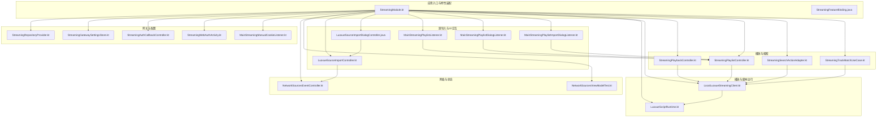
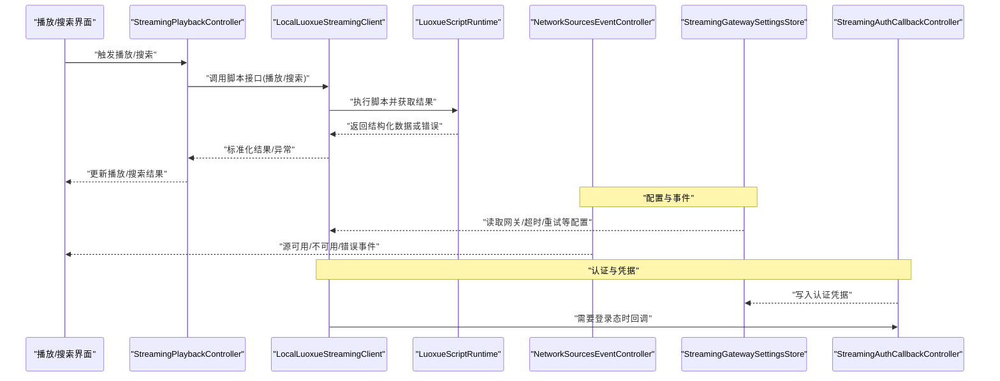
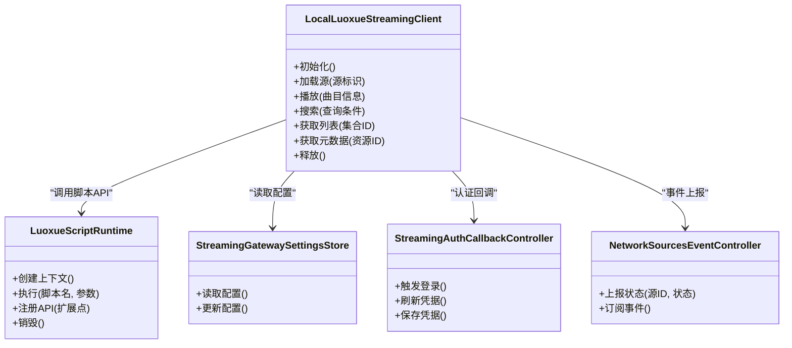
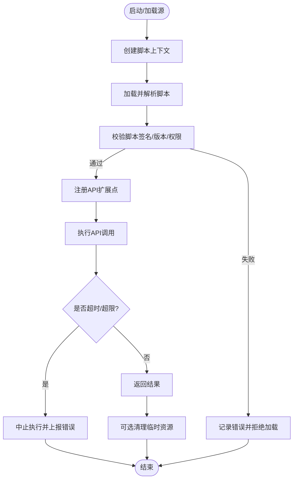
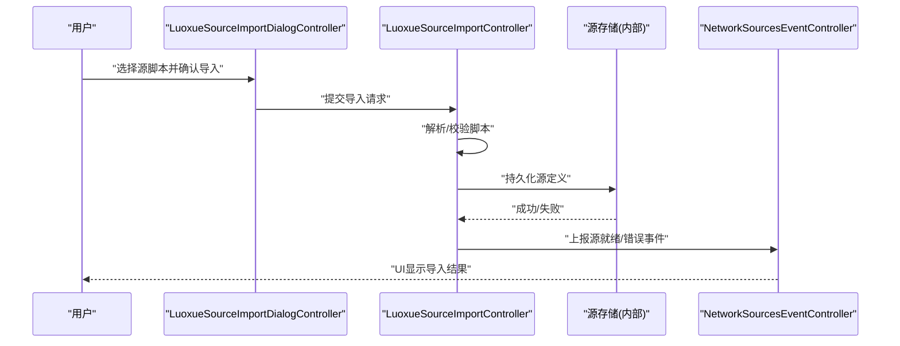
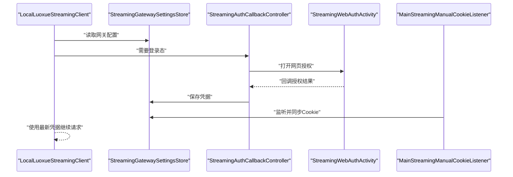
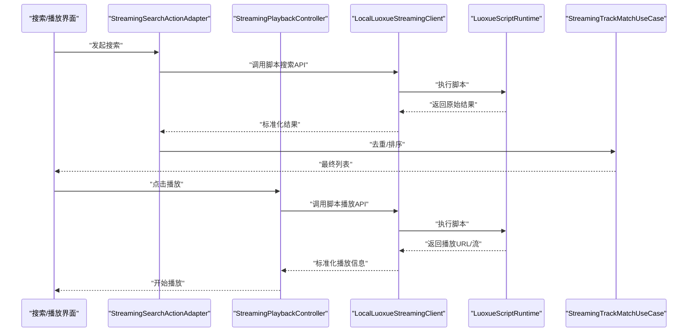
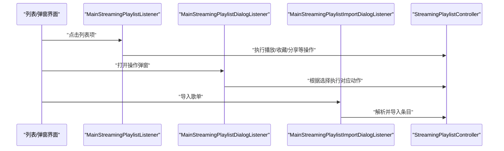
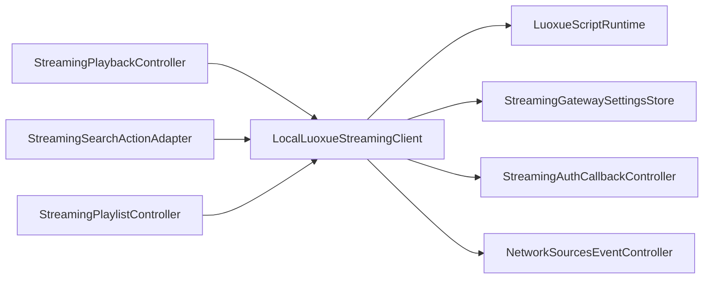

# 洛雪音乐实现

<cite>
**本文引用的文件**   
- [LuoxueSourceImportController.kt](file://app/src/main/java/app/yukine/LuoxueSourceImportController.kt)
- [LuoxueSourceImportDialogController.java](file://app/src/main/java/app/yukine/LuoxueSourceImportDialogController.java)
- [LuoxueSourceStoreTest.kt](file://app/src/test/java/app/yukine/LuoxueSourceStoreTest.kt)
- [LuoxueSourceImportControllerTest.kt](file://app/src/test/java/app/yukine/LuoxueSourceImportControllerTest.kt)
- [StreamingModule.kt](file://app/src/main/java/app/yukine/StreamingModule.kt)
- [MainStreamingPlaylistListener.kt](file://app/src/main/java/app/yukine/MainStreamingPlaylistListener.kt)
- [MainStreamingPlaylistDialogListener.kt](file://app/src/main/java/app/yukine/MainStreamingPlaylistDialogListener.kt)
- [MainStreamingPlaylistImportDialogListener.kt](file://app/src/main/java/app/yukine/MainStreamingPlaylistImportDialogListener.kt)
- [NetworkSourcesEventController.kt](file://app/src/main/java/app/yukine/NetworkSourcesEventController.kt)
- [NetworkSourcesViewModel.kt](file://app/src/test/java/app/yukine/NetworkSourcesViewModelTest.kt)
- [StreamingRepositoryProvider.kt](file://app/src/main/java/app/yukine/StreamingRepositoryProvider.kt)
- [StreamingGatewaySettingsStore.kt](file://app/src/main/java/app/yukine/StreamingGatewaySettingsStore.kt)
- [StreamingAuthCallbackController.kt](file://app/src/main/java/app/yukine/StreamingAuthCallbackController.kt)
- [StreamingWebAuthActivity.kt](file://app/src/main/java/app/yukine/StreamingWebAuthActivity.kt)
- [MainStreamingManualCookieListener.kt](file://app/src/main/java/app/yukine/MainStreamingManualCookieListener.kt)
- [StreamingPlaybackController.kt](file://app/src/main/java/app/yukine/StreamingPlaybackController.kt)
- [StreamingPlaylistController.kt](file://app/src/main/java/app/yukine/StreamingPlaylistController.kt)
- [StreamingSearchActionAdapter.kt](file://app/src/main/java/app/yukine/StreamingSearchActionAdapter.kt)
- [StreamingTrackMatchUseCase.kt](file://app/src/main/java/app/yukine/StreamingTrackMatchUseCase.kt)
- [StreamingSessionMaintenanceWorker.kt](file://app/src/main/java/app/yukine/StreamingSessionMaintenanceWorker.kt)
- [StreamingStatusTextFactory.kt](file://app/src/main/java/app/yukine/StreamingStatusTextFactory.kt)
- [StreamingFeatureBinding.java](file://app/src/main/java/app/yukine/StreamingFeatureBinding.java)
- [playback/LocalLuoxueStreamingClient.kt](file://app/src/main/java/app/yukine/playback/LocalLuoxueStreamingClient.kt)
- [playback/LuoxueScriptRuntime.kt](file://app/src/main/java/app/yukine/playback/LuoxueScriptRuntime.kt)
</cite>

## 目录
1. [简介](#简介)
2. [项目结构](#项目结构)
3. [核心组件](#核心组件)
4. [架构总览](#架构总览)
5. [详细组件分析](#详细组件分析)
6. [依赖关系分析](#依赖关系分析)
7. [性能考量](#性能考量)
8. [故障排查指南](#故障排查指南)
9. [结论](#结论)
10. [附录](#附录)

## 简介
本文件面向“洛雪音乐平台客户端实现”，聚焦以下目标：
- 说明 LocalLuoxueStreamingClient 的架构设计与职责边界
- 描述脚本运行时环境（LuoxueScriptRuntime）与 JavaScript 执行引擎、安全沙箱机制、API 扩展点
- 解释洛雪源的动态加载、插件系统、配置管理
- 文档化脚本语法规范、内置函数库、错误处理机制
- 提供自定义源开发指南、脚本调试工具、性能监控方法
- 文档化源兼容性测试、版本升级策略、社区贡献流程

为保证准确性，本文所有实现细节均基于仓库中现有源码与测试进行归纳。

## 项目结构
围绕“洛雪”相关能力，代码主要分布在 app 模块的 streaming 特性层与 playback 子包中，同时包含导入 UI 控制器、网络事件控制器、设置存储与认证回调等配套组件。

图表来源
- [StreamingModule.kt](file://app/src/main/java/app/yukine/StreamingModule.kt)
- [StreamingFeatureBinding.java](file://app/src/main/java/app/yukine/StreamingFeatureBinding.java)
- [LocalLuoxueStreamingClient.kt](file://app/src/main/java/app/yukine/playback/LocalLuoxueStreamingClient.kt)
- [LuoxueScriptRuntime.kt](file://app/src/main/java/app/yukine/playback/LuoxueScriptRuntime.kt)
- [LuoxueSourceImportController.kt](file://app/src/main/java/app/yukine/LuoxueSourceImportController.kt)
- [LuoxueSourceImportDialogController.java](file://app/src/main/java/app/yukine/LuoxueSourceImportDialogController.java)
- [MainStreamingPlaylistListener.kt](file://app/src/main/java/app/yukine/MainStreamingPlaylistListener.kt)
- [MainStreamingPlaylistDialogListener.kt](file://app/src/main/java/app/yukine/MainStreamingPlaylistDialogListener.kt)
- [MainStreamingPlaylistImportDialogListener.kt](file://app/src/main/java/app/yukine/MainStreamingPlaylistImportDialogListener.kt)
- [NetworkSourcesEventController.kt](file://app/src/main/java/app/yukine/NetworkSourcesEventController.kt)
- [NetworkSourcesViewModelTest.kt](file://app/src/test/java/app/yukine/NetworkSourcesViewModelTest.kt)
- [StreamingRepositoryProvider.kt](file://app/src/main/java/app/yukine/StreamingRepositoryProvider.kt)
- [StreamingGatewaySettingsStore.kt](file://app/src/main/java/app/yukine/StreamingGatewaySettingsStore.kt)
- [StreamingAuthCallbackController.kt](file://app/src/main/java/app/yukine/StreamingAuthCallbackController.kt)
- [StreamingWebAuthActivity.kt](file://app/src/main/java/app/yukine/StreamingWebAuthActivity.kt)
- [MainStreamingManualCookieListener.kt](file://app/src/main/java/app/yukine/MainStreamingManualCookieListener.kt)
- [StreamingPlaybackController.kt](file://app/src/main/java/app/yukine/StreamingPlaybackController.kt)
- [StreamingPlaylistController.kt](file://app/src/main/java/app/yukine/StreamingPlaylistController.kt)
- [StreamingSearchActionAdapter.kt](file://app/src/main/java/app/yukine/StreamingSearchActionAdapter.kt)
- [StreamingTrackMatchUseCase.kt](file://app/src/main/java/app/yukine/StreamingTrackMatchUseCase.kt)

章节来源
- [StreamingModule.kt](file://app/src/main/java/app/yukine/StreamingModule.kt)
- [StreamingFeatureBinding.java](file://app/src/main/java/app/yukine/StreamingFeatureBinding.java)

## 核心组件
- LocalLuoxueStreamingClient：本地洛雪流媒体客户端，负责与脚本运行时交互、发起播放/搜索/列表请求、结果映射与错误上报。
- LuoxueScriptRuntime：JavaScript 脚本运行时，提供执行引擎、沙箱隔离、API 扩展点、生命周期管理与资源清理。
- 源导入控制器：LuoxueSourceImportController 与 LuoxueSourceImportDialogController 负责从外部导入源脚本、校验与持久化。
- 网络与状态：NetworkSourcesEventController 聚合源事件，配合 ViewModel 驱动 UI 状态。
- 网关与配置：StreamingRepositoryProvider、StreamingGatewaySettingsStore、认证回调与 Cookie 监听共同完成源访问凭据与网关配置。
- 播放与搜索：StreamingPlaybackController、StreamingPlaylistController、StreamingSearchActionAdapter、StreamingTrackMatchUseCase 通过 LocalLuoxueStreamingClient 调用脚本能力。

章节来源
- [LocalLuoxueStreamingClient.kt](file://app/src/main/java/app/yukine/playback/LocalLuoxueStreamingClient.kt)
- [LuoxueScriptRuntime.kt](file://app/src/main/java/app/yukine/playback/LuoxueScriptRuntime.kt)
- [LuoxueSourceImportController.kt](file://app/src/main/java/app/yukine/LuoxueSourceImportController.kt)
- [LuoxueSourceImportDialogController.java](file://app/src/main/java/app/yukine/LuoxueSourceImportDialogController.java)
- [NetworkSourcesEventController.kt](file://app/src/main/java/app/yukine/NetworkSourcesEventController.kt)
- [StreamingRepositoryProvider.kt](file://app/src/main/java/app/yukine/StreamingRepositoryProvider.kt)
- [StreamingGatewaySettingsStore.kt](file://app/src/main/java/app/yukine/StreamingGatewaySettingsStore.kt)
- [StreamingAuthCallbackController.kt](file://app/src/main/java/app/yukine/StreamingAuthCallbackController.kt)
- [StreamingWebAuthActivity.kt](file://app/src/main/java/app/yukine/StreamingWebAuthActivity.kt)
- [MainStreamingManualCookieListener.kt](file://app/src/main/java/app/yukine/MainStreamingManualCookieListener.kt)
- [StreamingPlaybackController.kt](file://app/src/main/java/app/yukine/StreamingPlaybackController.kt)
- [StreamingPlaylistController.kt](file://app/src/main/java/app/yukine/StreamingPlaylistController.kt)
- [StreamingSearchActionAdapter.kt](file://app/src/main/java/app/yukine/StreamingSearchActionAdapter.kt)
- [StreamingTrackMatchUseCase.kt](file://app/src/main/java/app/yukine/StreamingTrackMatchUseCase.kt)

## 架构总览
下图展示从 UI 到脚本运行的端到端调用链，以及配置与认证在其中的作用位置。

图表来源
- [StreamingPlaybackController.kt](file://app/src/main/java/app/yukine/StreamingPlaybackController.kt)
- [LocalLuoxueStreamingClient.kt](file://app/src/main/java/app/yukine/playback/LocalLuoxueStreamingClient.kt)
- [LuoxueScriptRuntime.kt](file://app/src/main/java/app/yukine/playback/LuoxueScriptRuntime.kt)
- [NetworkSourcesEventController.kt](file://app/src/main/java/app/yukine/NetworkSourcesEventController.kt)
- [StreamingGatewaySettingsStore.kt](file://app/src/main/java/app/yukine/StreamingGatewaySettingsStore.kt)
- [StreamingAuthCallbackController.kt](file://app/src/main/java/app/yukine/StreamingAuthCallbackController.kt)

## 详细组件分析

### LocalLuoxueStreamingClient 组件分析
职责与边界
- 作为“本地洛雪流媒体客户端”，封装对脚本运行时的调用，屏蔽脚本差异，向上层提供统一的播放、搜索、列表与元数据能力。
- 负责将脚本返回的数据转换为上层模型，统一错误码与异常类型，便于 UI 与业务逻辑一致处理。
- 与配置、认证、网络事件子系统协作，确保请求具备必要的上下文（如网关地址、鉴权头、Cookie）。

关键交互
- 与 LuoxueScriptRuntime 通信：初始化、加载源脚本、执行 API 调用、回收资源。
- 与 StreamingGatewaySettingsStore 交互：读取网关配置、超时、重试策略等。
- 与 StreamingAuthCallbackController 交互：触发登录、刷新令牌、回写凭据。
- 向 NetworkSourcesEventController 上报源状态变化（可用/不可用/错误）。

图表来源
- [LocalLuoxueStreamingClient.kt](file://app/src/main/java/app/yukine/playback/LocalLuoxueStreamingClient.kt)
- [LuoxueScriptRuntime.kt](file://app/src/main/java/app/yukine/playback/LuoxueScriptRuntime.kt)
- [StreamingGatewaySettingsStore.kt](file://app/src/main/java/app/yukine/StreamingGatewaySettingsStore.kt)
- [StreamingAuthCallbackController.kt](file://app/src/main/java/app/yukine/StreamingAuthCallbackController.kt)
- [NetworkSourcesEventController.kt](file://app/src/main/java/app/yukine/NetworkSourcesEventController.kt)

章节来源
- [LocalLuoxueStreamingClient.kt](file://app/src/main/java/app/yukine/playback/LocalLuoxueStreamingClient.kt)

### LuoxueScriptRuntime 组件分析
设计要点
- JavaScript 执行引擎：为每个源维护独立上下文，支持并发执行与线程隔离，避免全局状态污染。
- 安全沙箱机制：限制文件系统、网络、反射等危险能力；仅暴露受控 API；对脚本执行时间、内存使用进行限流与熔断。
- API 扩展点：允许宿主注入 HTTP 客户端、加密工具、日志、配置读取等能力，供脚本以统一方式调用。
- 生命周期管理：按需加载、缓存已编译脚本、优雅退出与资源回收。

图表来源
- [LuoxueScriptRuntime.kt](file://app/src/main/java/app/yukine/playback/LuoxueScriptRuntime.kt)

章节来源
- [LuoxueScriptRuntime.kt](file://app/src/main/java/app/yukine/playback/LuoxueScriptRuntime.kt)

### 源导入机制与对话框
导入流程
- 用户通过导入对话框选择源脚本文件，由 LuoxueSourceImportDialogController 收集输入并委托给 LuoxueSourceImportController 进行解析、校验与持久化。
- 导入成功后，NetworkSourcesEventController 广播源就绪事件，UI 层刷新源列表。

图表来源
- [LuoxueSourceImportDialogController.java](file://app/src/main/java/app/yukine/LuoxueSourceImportDialogController.java)
- [LuoxueSourceImportController.kt](file://app/src/main/java/app/yukine/LuoxueSourceImportController.kt)
- [NetworkSourcesEventController.kt](file://app/src/main/java/app/yukine/NetworkSourcesEventController.kt)

章节来源
- [LuoxueSourceImportDialogController.java](file://app/src/main/java/app/yukine/LuoxueSourceImportDialogController.java)
- [LuoxueSourceImportController.kt](file://app/src/main/java/app/yukine/LuoxueSourceImportController.kt)
- [LuoxueSourceImportControllerTest.kt](file://app/src/test/java/app/yukine/LuoxueSourceImportControllerTest.kt)
- [LuoxueSourceStoreTest.kt](file://app/src/test/java/app/yukine/LuoxueSourceStoreTest.kt)

### 配置管理与认证集成
- 配置管理：StreamingGatewaySettingsStore 集中管理网关地址、超时、重试、代理等设置，供客户端在发起请求前读取。
- 认证集成：StreamingAuthCallbackController 与 StreamingWebAuthActivity 协同完成 Web 登录流程，凭据写入后由 MainStreamingManualCookieListener 监听 Cookie 变更，确保后续请求携带有效会话。

图表来源
- [StreamingGatewaySettingsStore.kt](file://app/src/main/java/app/yukine/StreamingGatewaySettingsStore.kt)
- [StreamingAuthCallbackController.kt](file://app/src/main/java/app/yukine/StreamingAuthCallbackController.kt)
- [StreamingWebAuthActivity.kt](file://app/src/main/java/app/yukine/StreamingWebAuthActivity.kt)
- [MainStreamingManualCookieListener.kt](file://app/src/main/java/app/yukine/MainStreamingManualCookieListener.kt)

章节来源
- [StreamingGatewaySettingsStore.kt](file://app/src/main/java/app/yukine/StreamingGatewaySettingsStore.kt)
- [StreamingAuthCallbackController.kt](file://app/src/main/java/app/yukine/StreamingAuthCallbackController.kt)
- [StreamingWebAuthActivity.kt](file://app/src/main/java/app/yukine/StreamingWebAuthActivity.kt)
- [MainStreamingManualCookieListener.kt](file://app/src/main/java/app/yukine/MainStreamingManualCookieListener.kt)

### 播放与搜索链路
- 播放链路：StreamingPlaybackController 调用 LocalLuoxueStreamingClient，后者通过 LuoxueScriptRuntime 执行脚本的播放接口，返回可播放的媒体流或直链。
- 搜索链路：StreamingSearchActionAdapter 将搜索动作转发至客户端，脚本返回匹配结果，再由 StreamingTrackMatchUseCase 做去重与排序。

图表来源
- [StreamingSearchActionAdapter.kt](file://app/src/main/java/app/yukine/StreamingSearchActionAdapter.kt)
- [StreamingPlaybackController.kt](file://app/src/main/java/app/yukine/StreamingPlaybackController.kt)
- [LocalLuoxueStreamingClient.kt](file://app/src/main/java/app/yukine/playback/LocalLuoxueStreamingClient.kt)
- [LuoxueScriptRuntime.kt](file://app/src/main/java/app/yukine/playback/LuoxueScriptRuntime.kt)
- [StreamingTrackMatchUseCase.kt](file://app/src/main/java/app/yukine/StreamingTrackMatchUseCase.kt)

章节来源
- [StreamingSearchActionAdapter.kt](file://app/src/main/java/app/yukine/StreamingSearchActionAdapter.kt)
- [StreamingPlaybackController.kt](file://app/src/main/java/app/yukine/StreamingPlaybackController.kt)
- [StreamingTrackMatchUseCase.kt](file://app/src/main/java/app/yukine/StreamingTrackMatchUseCase.kt)

### 列表与对话式操作
- 列表操作：MainStreamingPlaylistListener、MainStreamingPlaylistDialogListener、MainStreamingPlaylistImportDialogListener 分别处理列表点击、弹窗操作与导入流程，统一通过 StreamingPlaylistController 协调。

图表来源
- [MainStreamingPlaylistListener.kt](file://app/src/main/java/app/yukine/MainStreamingPlaylistListener.kt)
- [MainStreamingPlaylistDialogListener.kt](file://app/src/main/java/app/yukine/MainStreamingPlaylistDialogListener.kt)
- [MainStreamingPlaylistImportDialogListener.kt](file://app/src/main/java/app/yukine/MainStreamingPlaylistImportDialogListener.kt)
- [StreamingPlaylistController.kt](file://app/src/main/java/app/yukine/StreamingPlaylistController.kt)

章节来源
- [MainStreamingPlaylistListener.kt](file://app/src/main/java/app/yukine/MainStreamingPlaylistListener.kt)
- [MainStreamingPlaylistDialogListener.kt](file://app/src/main/java/app/yukine/MainStreamingPlaylistDialogListener.kt)
- [MainStreamingPlaylistImportDialogListener.kt](file://app/src/main/java/app/yukine/MainStreamingPlaylistImportDialogListener.kt)
- [StreamingPlaylistController.kt](file://app/src/main/java/app/yukine/StreamingPlaylistController.kt)

## 依赖关系分析
- 组件耦合
  - LocalLuoxueStreamingClient 强依赖 LuoxueScriptRuntime 与配置/认证/事件子系统，属于“编排层”。
  - 各控制器（播放、搜索、列表）通过客户端间接依赖脚本运行时，保持 UI 与脚本解耦。
- 外部依赖
  - 网络与认证：通过 StreamingAuthCallbackController 与 Cookie 监听完成会话管理。
  - 配置：StreamingGatewaySettingsStore 提供集中配置。
- 潜在循环依赖
  - 当前分层清晰，未见明显循环依赖；若新增跨层回调需引入事件总线或接口抽象以避免环。

图表来源
- [StreamingPlaybackController.kt](file://app/src/main/java/app/yukine/StreamingPlaybackController.kt)
- [StreamingSearchActionAdapter.kt](file://app/src/main/java/app/yukine/StreamingSearchActionAdapter.kt)
- [StreamingPlaylistController.kt](file://app/src/main/java/app/yukine/StreamingPlaylistController.kt)
- [LocalLuoxueStreamingClient.kt](file://app/src/main/java/app/yukine/playback/LocalLuoxueStreamingClient.kt)
- [LuoxueScriptRuntime.kt](file://app/src/main/java/app/yukine/playback/LuoxueScriptRuntime.kt)
- [StreamingGatewaySettingsStore.kt](file://app/src/main/java/app/yukine/StreamingGatewaySettingsStore.kt)
- [StreamingAuthCallbackController.kt](file://app/src/main/java/app/yukine/StreamingAuthCallbackController.kt)
- [NetworkSourcesEventController.kt](file://app/src/main/java/app/yukine/NetworkSourcesEventController.kt)

章节来源
- [StreamingModule.kt](file://app/src/main/java/app/yukine/StreamingModule.kt)

## 性能考量
- 脚本执行限流：在 LuoxueScriptRuntime 中实施超时控制与内存上限，防止恶意或低效脚本拖垮进程。
- 并发与隔离：为不同源分配独立上下文，避免共享状态导致的锁竞争与脏读。
- 结果缓存：对热点搜索与列表结果进行短期缓存，减少重复脚本执行与网络开销。
- 连接复用：在网关配置中启用连接池与重试退避，降低握手与 TLS 开销。
- 资源回收：在源卸载或应用退出时主动销毁脚本上下文，释放内存与句柄。

[本节为通用指导，不直接分析具体文件]

## 故障排查指南
- 常见错误分类
  - 脚本执行错误：超时、内存超限、未捕获异常。检查 LuoxueScriptRuntime 的错误上报与日志。
  - 认证失败：登录回调未触发或凭据未写入。核查 StreamingAuthCallbackController 与 Cookie 监听。
  - 网络异常：网关不可达、证书问题、代理配置错误。检查 StreamingGatewaySettingsStore 与网络事件。
  - 导入失败：脚本格式不合法、签名校验失败。查看导入控制器与单元测试用例。
- 定位步骤
  - 开启详细日志，关注源事件上报与客户端错误码。
  - 复现最小脚本，逐步缩小范围。
  - 使用单元测试覆盖导入与基础 API 调用路径。

章节来源
- [LuoxueSourceImportControllerTest.kt](file://app/src/test/java/app/yukine/LuoxueSourceImportControllerTest.kt)
- [LuoxueSourceStoreTest.kt](file://app/src/test/java/app/yukine/LuoxueSourceStoreTest.kt)
- [NetworkSourcesViewModelTest.kt](file://app/src/test/java/app/yukine/NetworkSourcesViewModelTest.kt)

## 结论
本实现以 LocalLuoxueStreamingClient 为核心编排器，结合 LuoxueScriptRuntime 的安全沙箱与可扩展 API，构建了稳定、可控的洛雪源生态。通过导入控制器、配置与认证子系统，实现了从脚本加载到播放/搜索的完整闭环。建议在后续迭代中完善脚本语法规范与内置函数库文档，建立更完善的兼容性测试矩阵与版本升级策略，以提升社区贡献效率与用户体验。

[本节为总结性内容，不直接分析具体文件]

## 附录

### 脚本语法规范（建议）
- 模块声明：明确源标识、版本、依赖与权限。
- 导出接口：search、play、playlist、metadata 等标准命名与参数约定。
- 返回值：统一数据结构（标题、艺术家、时长、直链、封面等字段）。
- 错误码：区分网络、认证、解析、资源不存在等类别。
- 异步处理：推荐 Promise/回调模式，避免阻塞主线程。

[本节为概念性规范建议，不直接分析具体文件]

### 内置函数库（建议）
- 网络：get/post、下载、分片、断点续传、重试与超时。
- 加密：MD5/SHA/HMAC/AES/RSA 工具。
- 解析：HTML/JSON/XML 解析辅助。
- 日志：分级日志与采样策略。
- 配置：读取网关与用户偏好。

[本节为概念性规范建议，不直接分析具体文件]

### 错误处理机制（建议）
- 统一异常包装：携带错误码、消息、堆栈与上下文。
- 降级策略：当上游不可用时返回空集或提示。
- 幂等与重试：对非副作用请求采用指数退避重试。

[本节为概念性规范建议，不直接分析具体文件]

### 自定义源开发指南
- 准备环境：安装 Node.js 与必要依赖，参考 metadata-gateway 示例工程组织。
- 编写脚本：遵循语法规范，实现标准接口，尽量无副作用。
- 本地调试：使用导入对话框加载脚本，配合日志与事件上报定位问题。
- 打包发布：输出可导入的脚本包，附带 README 与兼容性说明。

[本节为概念性开发指南，不直接分析具体文件]

### 脚本调试工具
- 日志开关：在运行时切换日志级别，过滤特定源。
- 断点与追踪：在客户端层打印入参出参与耗时。
- 回放与录制：记录网络请求与响应，用于离线分析。

[本节为概念性调试建议，不直接分析具体文件]

### 性能监控方法
- 指标采集：脚本执行耗时、成功率、错误率、内存占用。
- 告警阈值：超时、OOM、频繁失败等自动告警。
- 压测方案：模拟高并发搜索与播放，评估稳定性。

[本节为概念性监控建议，不直接分析具体文件]

### 源兼容性测试
- 测试矩阵：覆盖主流源与边缘场景（弱网、长列表、特殊字符）。
- 自动化：CI 中集成导入与基础 API 调用测试。
- 回归策略：每次版本升级前执行全量兼容测试。

[本节为概念性测试建议，不直接分析具体文件]

### 版本升级策略
- 向后兼容：新接口保留旧接口，渐进迁移。
- 灰度发布：先小范围验证再全量推送。
- 回滚预案：快速回退到上一稳定版本。

[本节为概念性策略建议，不直接分析具体文件]

### 社区贡献流程
- 贡献准则：遵循编码规范、提交规范与测试要求。
- 评审流程：PR 审查、自动化测试通过后方可合并。
- 文档更新：同步更新语法与 API 文档。

[本节为概念性流程建议，不直接分析具体文件]