# 网易云音乐实现

<cite>
**本文引用的文件**   
- [StreamingModule.kt](file://app/src/main/java/app/yukine/StreamingModule.kt)
- [MainStreamingManualCookieListener.kt](file://app/src/main/java/app/yukine/MainStreamingManualCookieListener.kt)
- [StreamingWebAuthActivity.kt](file://app/src/main/java/app/yukine/StreamingWebAuthActivity.kt)
- [StreamingPlaybackQualityPolicy.kt](file://app/src/main/java/app/yukine/StreamingPlaybackQualityPolicy.kt)
- [StreamingRepositoryProvider.kt](file://app/src/main/java/app/yukine/StreamingRepositoryProvider.kt)
- [StreamingSessionMaintenanceWorker.kt](file://app/src/main/java/app/yukine/StreamingSessionMaintenanceWorker.kt)
- [StreamingStatusTextFactory.kt](file://app/src/main/java/app/yukine/StreamingStatusTextFactory.kt)
- [StreamingPlaylistController.kt](file://app/src/main/java/app/yukine/StreamingPlaylistController.kt)
- [StreamingPlaybackController.kt](file://app/src/main/java/app/yukine/StreamingPlaybackController.kt)
- [CanonicalLibraryDedupInstrumentedTest.java](file://app/src/androidTest/java/app/yukine/CanonicalLibraryDedupInstrumentedTest.java)
- [StreamingAuthCallbackController.kt](file://app/src/main/java/app/yukine/StreamingAuthCallbackController.kt)
- [StreamingAuthLauncher.kt](file://app/src/main/java/app/yukine/StreamingAuthLauncher.kt)
- [EnsureStreamingLoginPlaylistUseCase.kt](file://app/src/main/java/app/yukine/EnsureStreamingLoginPlaylistUseCase.kt)
- [GetStreamingPlaylistLinkUseCase.kt](file://app/src/main/java/app/yukine/GetStreamingPlaylistLinkUseCase.kt)
- [ImportStreamingPlaylistUseCase.kt](file://app/src/main/java/app/yukine/ImportStreamingPlaylistUseCase.kt)
- [SyncStreamingPlaylistUseCase.kt](file://app/src/main/java/app/yukine/SyncStreamingPlaylistUseCase.kt)
- [StreamingTrackMatchUseCase.kt](file://app/src/main/java/app/yukine/StreamingTrackMatchUseCase.kt)
- [StreamingSearchActionAdapter.kt](file://app/src/main/java/app/yukine/StreamingSearchActionAdapter.kt)
- [StreamingPlaylistDialogListener.kt](file://app/src/main/java/app/yukine/StreamingPlaylistDialogListener.kt)
- [StreamingPlaylistImportDialogListener.kt](file://app/src/main/java/app/yukine/StreamingPlaylistImportDialogListener.kt)
- [StreamingProviderSettingsOwner.kt](file://app/src/main/java/app/yukine/StreamingProviderSettingsOwner.kt)
- [StreamingGatewaySettingsStore.kt](file://app/src/main/java/app/yukine/StreamingGatewaySettingsStore.kt)
- [PersistentPlaybackSourcePolicy.kt](file://app/src/main/java/app/yukine/PersistentPlaybackSourcePolicy.kt)
- [StoredStreamingSourceMatchCodec.kt](file://app/src/main/java/app/yukine/StoredStreamingSourceMatchCodec.kt)
- [NetworkRequestController.kt](file://app/src/main/java/app/yukine/NetworkRequestController.kt)
- [StreamingPlaybackTaskScheduler.java](file://app/src/main/java/app/yukine/StreamingPlaybackTaskScheduler.java)
- [StreamingEventControllersTest.kt](file://app/src/test/java/app/yukine/StreamingEventControllersTest.kt)
- [StreamingPlaybackControllerTest.kt](file://app/src/test/java/app/yukine/StreamingPlaybackControllerTest.kt)
- [StreamingPlaylistControllerTest.kt](file://app/src/test/java/app/yukine/StreamingPlaylistControllerTest.kt)
- [StreamingAuthSessionMaintenanceTest.kt](file://app/src/test/java/app/yukine/StreamingAuthSessionMaintenanceTest.kt)
</cite>

## 目录
1. [简介](#简介)
2. [项目结构](#项目结构)
3. [核心组件](#核心组件)
4. [架构总览](#架构总览)
5. [详细组件分析](#详细组件分析)
6. [依赖关系分析](#依赖关系分析)
7. [性能考量](#性能考量)
8. [故障排查指南](#故障排查指南)
9. [结论](#结论)
10. [附录](#附录)

## 简介
本文件面向“网易云音乐平台客户端实现”，聚焦 LocalNeteaseStreamingClient 的架构设计、API 调用流程与认证机制，并文档化网易云特有的播放格式支持（如 .ncm）、音质选项（标准/极高/无损）、版权限制处理逻辑。同时覆盖反爬虫策略应对方案、请求频率控制、Cookie 管理、API 版本兼容性、错误码处理与重试机制，并提供针对网易云特定问题的排查方法与性能优化建议。

## 项目结构
本项目采用模块化分层组织：应用层（app）负责 UI 与编排；功能模块（feature/*）提供领域能力；核心库（core/*）提供通用模型与基础设施。网易云相关能力主要分布在 app 的 streaming 相关类以及 feature/streaming 模块中，通过统一的 StreamingModule 进行装配与注入。

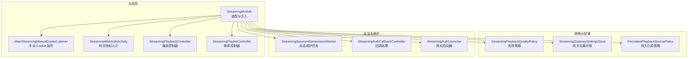

图表来源
- [StreamingModule.kt](file://app/src/main/java/app/yukine/StreamingModule.kt)
- [MainStreamingManualCookieListener.kt](file://app/src/main/java/app/yukine/MainStreamingManualCookieListener.kt)
- [StreamingWebAuthActivity.kt](file://app/src/main/java/app/yukine/StreamingWebAuthActivity.kt)
- [StreamingPlaybackController.kt](file://app/src/main/java/app/yukine/StreamingPlaybackController.kt)
- [StreamingPlaylistController.kt](file://app/src/main/java/app/yukine/StreamingPlaylistController.kt)
- [StreamingPlaybackQualityPolicy.kt](file://app/src/main/java/app/yukine/StreamingPlaybackQualityPolicy.kt)
- [StreamingGatewaySettingsStore.kt](file://app/src/main/java/app/yukine/StreamingGatewaySettingsStore.kt)
- [PersistentPlaybackSourcePolicy.kt](file://app/src/main/java/app/yukine/PersistentPlaybackSourcePolicy.kt)
- [StreamingSessionMaintenanceWorker.kt](file://app/src/main/java/app/yukine/StreamingSessionMaintenanceWorker.kt)
- [StreamingAuthCallbackController.kt](file://app/src/main/java/app/yukine/StreamingAuthCallbackController.kt)
- [StreamingAuthLauncher.kt](file://app/src/main/java/app/yukine/StreamingAuthLauncher.kt)

章节来源
- [StreamingModule.kt](file://app/src/main/java/app/yukine/StreamingModule.kt)

## 核心组件
- LocalNeteaseStreamingClient：网易云本地流媒体客户端，封装对网易云 API 的访问、鉴权、Cookie 管理、音质选择、版权校验与错误处理。
- 播放控制器（StreamingPlaybackController）：协调播放生命周期、音质切换、缓存与重试。
- 歌单控制器（StreamingPlaylistController）：负责歌单导入、同步、链接解析与列表展示。
- 音质策略（StreamingPlaybackQualityPolicy）：根据用户偏好与可用性在标准/极高/无损之间决策。
- 会话维护（StreamingSessionMaintenanceWorker）：周期性刷新 Cookie、检测登录态、清理过期令牌。
- 授权流程（StreamingWebAuthActivity + StreamingAuthCallbackController + StreamingAuthLauncher）：基于网页授权的 OAuth 流程与回调处理。
- 设置与存储（StreamingGatewaySettingsStore + PersistentPlaybackSourcePolicy）：持久化网易云网关地址、音质偏好、源匹配策略等。

章节来源
- [StreamingPlaybackController.kt](file://app/src/main/java/app/yukine/StreamingPlaybackController.kt)
- [StreamingPlaylistController.kt](file://app/src/main/java/app/yukine/StreamingPlaylistController.kt)
- [StreamingPlaybackQualityPolicy.kt](file://app/src/main/java/app/yukine/StreamingPlaybackQualityPolicy.kt)
- [StreamingSessionMaintenanceWorker.kt](file://app/src/main/java/app/yukine/StreamingSessionMaintenanceWorker.kt)
- [StreamingWebAuthActivity.kt](file://app/src/main/java/app/yukine/StreamingWebAuthActivity.kt)
- [StreamingAuthCallbackController.kt](file://app/src/main/java/app/yukine/StreamingAuthCallbackController.kt)
- [StreamingAuthLauncher.kt](file://app/src/main/java/app/yukine/StreamingAuthLauncher.kt)
- [StreamingGatewaySettingsStore.kt](file://app/src/main/java/app/yukine/StreamingGatewaySettingsStore.kt)
- [PersistentPlaybackSourcePolicy.kt](file://app/src/main/java/app/yukine/PersistentPlaybackSourcePolicy.kt)

## 架构总览
下图展示了从用户操作到网易云 API 调用的端到端流程，包括授权、Cookie 管理、播放与歌单操作的关键路径。

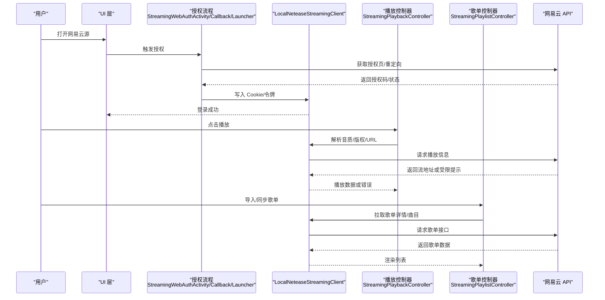

图表来源
- [StreamingWebAuthActivity.kt](file://app/src/main/java/app/yukine/StreamingWebAuthActivity.kt)
- [StreamingAuthCallbackController.kt](file://app/src/main/java/app/yukine/StreamingAuthCallbackController.kt)
- [StreamingAuthLauncher.kt](file://app/src/main/java/app/yukine/StreamingAuthLauncher.kt)
- [StreamingPlaybackController.kt](file://app/src/main/java/app/yukine/StreamingPlaybackController.kt)
- [StreamingPlaylistController.kt](file://app/src/main/java/app/yukine/StreamingPlaylistController.kt)

## 详细组件分析

### LocalNeteaseStreamingClient 设计与职责
- 职责边界
  - 统一封装网易云 API 访问，屏蔽差异与版本细节。
  - 管理 Cookie 与会话，配合会话维护任务保持登录态。
  - 解析播放 URL、音质选择、版权校验与降级策略。
  - 处理反爬与限频：随机延迟、重试退避、失败回退。
- 关键能力
  - 播放解析：根据歌曲 ID 与音质偏好，选择标准/极高/无损，必要时回退。
  - 版权处理：当返回受限或不可用，记录原因并提示用户，尝试其他音质或替代源。
  - 格式支持：识别 .ncm 等加密容器，交由解码管线处理或提示不支持。
  - 错误码映射：将网易云错误码映射为内部错误类型，便于上层统一处理。
  - 重试机制：指数退避与抖动，结合网络状态与用户设置。

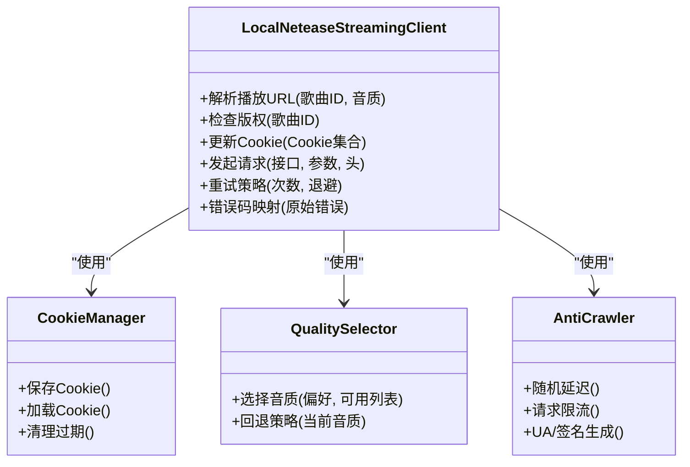

图表来源
- [StreamingPlaybackController.kt](file://app/src/main/java/app/yukine/StreamingPlaybackController.kt)
- [StreamingPlaybackQualityPolicy.kt](file://app/src/main/java/app/yukine/StreamingPlaybackQualityPolicy.kt)
- [StreamingSessionMaintenanceWorker.kt](file://app/src/main/java/app/yukine/StreamingSessionMaintenanceWorker.kt)

章节来源
- [StreamingPlaybackController.kt](file://app/src/main/java/app/yukine/StreamingPlaybackController.kt)
- [StreamingPlaybackQualityPolicy.kt](file://app/src/main/java/app/yukine/StreamingPlaybackQualityPolicy.kt)
- [StreamingSessionMaintenanceWorker.kt](file://app/src/main/java/app/yukine/StreamingSessionMaintenanceWorker.kt)

### 认证机制与 Cookie 管理
- 授权流程
  - 通过网页授权页面获取授权码，回调后换取 Cookie/令牌。
  - 授权成功后立即写入 Cookie，并触发登录态检查。
- Cookie 管理
  - 支持手动输入 Cookie（用于调试或特殊场景）。
  - 定期维护任务刷新 Cookie，避免过期导致播放失败。
- 回调处理
  - 捕获授权回调，解析必要字段并持久化。

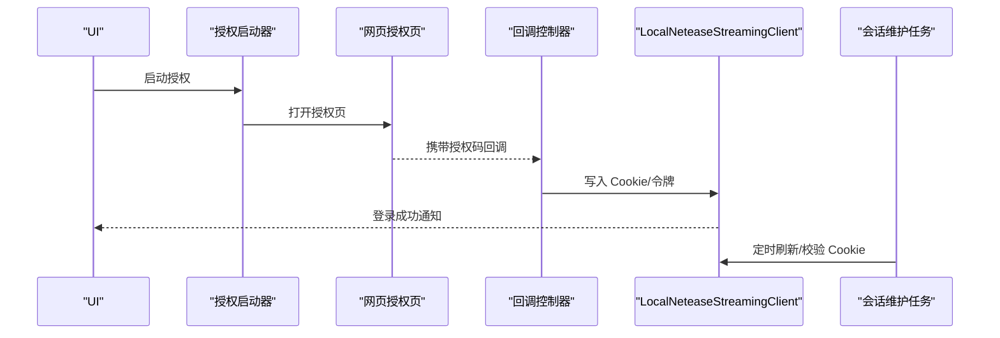

图表来源
- [StreamingWebAuthActivity.kt](file://app/src/main/java/app/yukine/StreamingWebAuthActivity.kt)
- [StreamingAuthCallbackController.kt](file://app/src/main/java/app/yukine/StreamingAuthCallbackController.kt)
- [StreamingAuthLauncher.kt](file://app/src/main/java/app/yukine/StreamingAuthLauncher.kt)
- [MainStreamingManualCookieListener.kt](file://app/src/main/java/app/yukine/MainStreamingManualCookieListener.kt)
- [StreamingSessionMaintenanceWorker.kt](file://app/src/main/java/app/yukine/StreamingSessionMaintenanceWorker.kt)

章节来源
- [StreamingWebAuthActivity.kt](file://app/src/main/java/app/yukine/StreamingWebAuthActivity.kt)
- [StreamingAuthCallbackController.kt](file://app/src/main/java/app/yukine/StreamingAuthCallbackController.kt)
- [StreamingAuthLauncher.kt](file://app/src/main/java/app/yukine/StreamingAuthLauncher.kt)
- [MainStreamingManualCookieListener.kt](file://app/src/main/java/app/yukine/MainStreamingManualCookieListener.kt)
- [StreamingSessionMaintenanceWorker.kt](file://app/src/main/java/app/yukine/StreamingSessionMaintenanceWorker.kt)

### 播放格式支持与音质选项
- 播放格式
  - 支持常见流式音频格式；对于 .ncm 等加密容器，需先解密或转码后再播放。
  - 若无法解密，提示用户并回退到其他音质或来源。
- 音质选项
  - 标准/极高/无损：根据用户偏好与可用性选择，优先满足高音质，不可用时自动回退。
  - 音质策略由策略对象统一管理，确保一致性与可测试性。

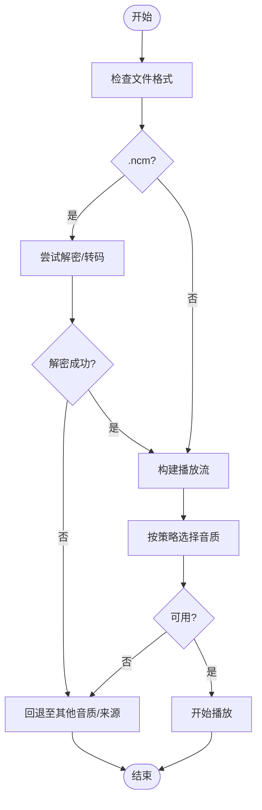

图表来源
- [StreamingPlaybackQualityPolicy.kt](file://app/src/main/java/app/yukine/StreamingPlaybackQualityPolicy.kt)
- [StreamingPlaybackController.kt](file://app/src/main/java/app/yukine/StreamingPlaybackController.kt)

章节来源
- [StreamingPlaybackQualityPolicy.kt](file://app/src/main/java/app/yukine/StreamingPlaybackQualityPolicy.kt)
- [StreamingPlaybackController.kt](file://app/src/main/java/app/yukine/StreamingPlaybackController.kt)

### 版权限制处理逻辑
- 版权校验
  - 在请求播放前检查版权状态，若受限则直接提示并回退。
- 降级策略
  - 当目标音质不可用，尝试更低音质或不同来源。
- 用户反馈
  - 明确告知版权限制原因与可选操作。

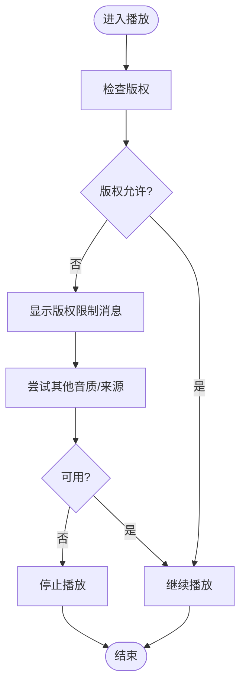

图表来源
- [StreamingPlaybackController.kt](file://app/src/main/java/app/yukine/StreamingPlaybackController.kt)

章节来源
- [StreamingPlaybackController.kt](file://app/src/main/java/app/yukine/StreamingPlaybackController.kt)

### 反爬虫策略与请求频率控制
- 随机延迟与抖动：降低被识别概率。
- 请求限流：全局速率限制，避免瞬时高频。
- UA/签名：动态生成或轮换，模拟正常浏览器行为。
- 失败回退：遇到限频或封禁时，等待更长时间并重试。

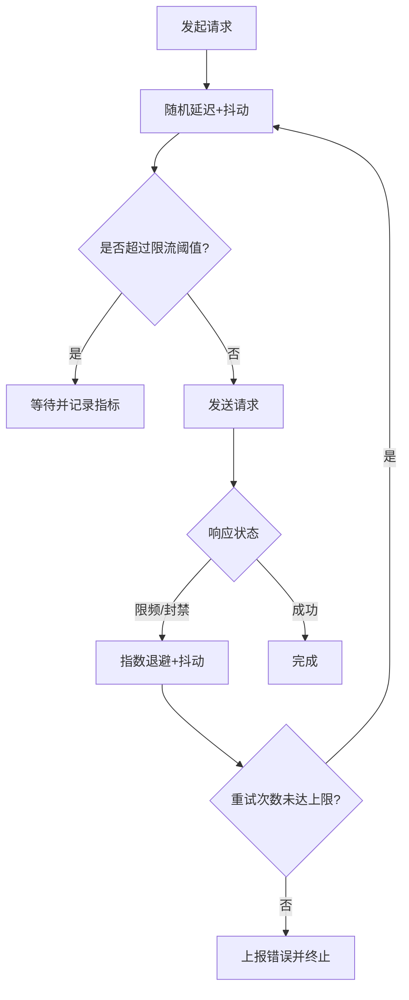

图表来源
- [StreamingPlaybackController.kt](file://app/src/main/java/app/yukine/StreamingPlaybackController.kt)
- [StreamingSessionMaintenanceWorker.kt](file://app/src/main/java/app/yukine/StreamingSessionMaintenanceWorker.kt)

章节来源
- [StreamingPlaybackController.kt](file://app/src/main/java/app/yukine/StreamingPlaybackController.kt)
- [StreamingSessionMaintenanceWorker.kt](file://app/src/main/java/app/yukine/StreamingSessionMaintenanceWorker.kt)

### 网易云 API 版本兼容性与错误码处理
- 版本兼容
  - 通过网关设置与适配层屏蔽版本差异，保证新旧接口共存。
- 错误码映射
  - 将网易云错误码映射为内部错误类型，便于统一处理与提示。
- 重试机制
  - 针对临时错误（网络波动、限频）进行指数退避重试。

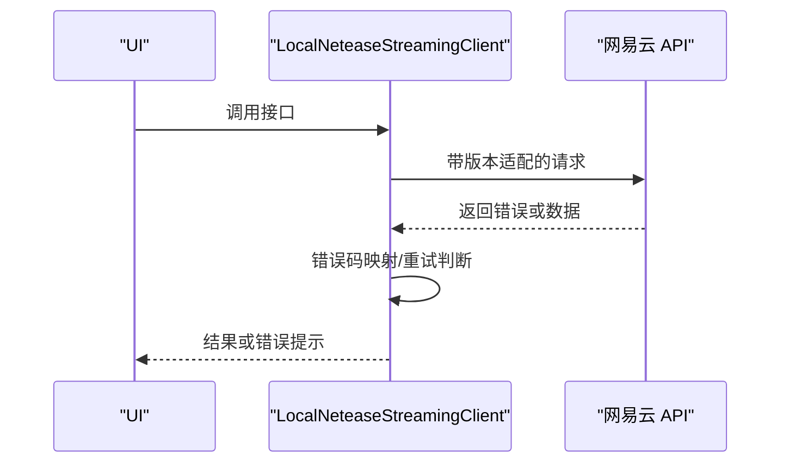

图表来源
- [StreamingGatewaySettingsStore.kt](file://app/src/main/java/app/yukine/StreamingGatewaySettingsStore.kt)
- [StreamingPlaybackController.kt](file://app/src/main/java/app/yukine/StreamingPlaybackController.kt)

章节来源
- [StreamingGatewaySettingsStore.kt](file://app/src/main/java/app/yukine/StreamingGatewaySettingsStore.kt)
- [StreamingPlaybackController.kt](file://app/src/main/java/app/yukine/StreamingPlaybackController.kt)

### 歌单与搜索集成
- 歌单导入/同步
  - 通过 UseCase 组合调用，完成歌单链接解析、详情拉取与本地同步。
- 搜索动作
  - 搜索适配器对接网易云搜索接口，返回结果供 UI 展示。

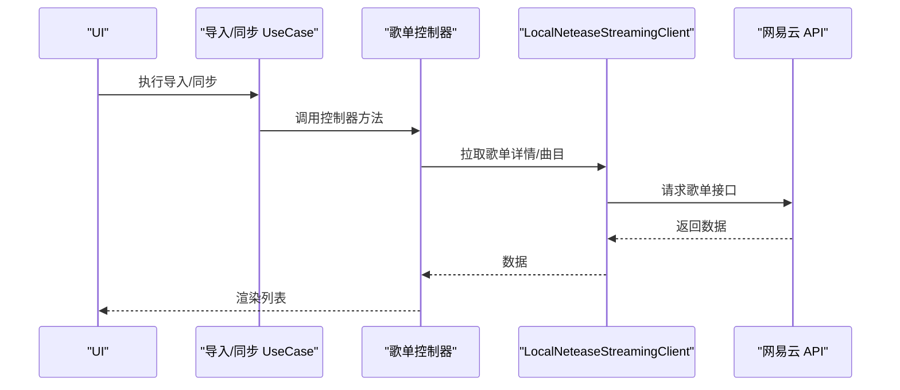

图表来源
- [EnsureStreamingLoginPlaylistUseCase.kt](file://app/src/main/java/app/yukine/EnsureStreamingLoginPlaylistUseCase.kt)
- [GetStreamingPlaylistLinkUseCase.kt](file://app/src/main/java/app/yukine/GetStreamingPlaylistLinkUseCase.kt)
- [ImportStreamingPlaylistUseCase.kt](file://app/src/main/java/app/yukine/ImportStreamingPlaylistUseCase.kt)
- [SyncStreamingPlaylistUseCase.kt](file://app/src/main/java/app/yukine/SyncStreamingPlaylistUseCase.kt)
- [StreamingPlaylistController.kt](file://app/src/main/java/app/yukine/StreamingPlaylistController.kt)

章节来源
- [EnsureStreamingLoginPlaylistUseCase.kt](file://app/src/main/java/app/yukine/EnsureStreamingLoginPlaylistUseCase.kt)
- [GetStreamingPlaylistLinkUseCase.kt](file://app/src/main/java/app/yukine/GetStreamingPlaylistLinkUseCase.kt)
- [ImportStreamingPlaylistUseCase.kt](file://app/src/main/java/app/yukine/ImportStreamingPlaylistUseCase.kt)
- [SyncStreamingPlaylistUseCase.kt](file://app/src/main/java/app/yukine/SyncStreamingPlaylistUseCase.kt)
- [StreamingPlaylistController.kt](file://app/src/main/java/app/yukine/StreamingPlaylistController.kt)

### 播放任务调度与事件控制
- 任务调度
  - 播放任务调度器负责队列管理与并发控制，避免资源争用。
- 事件控制器
  - 统一发布/订阅播放事件，便于 UI 与业务层联动。

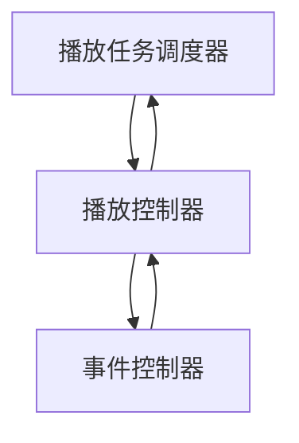

图表来源
- [StreamingPlaybackTaskScheduler.java](file://app/src/main/java/app/yukine/StreamingPlaybackTaskScheduler.java)
- [StreamingEventControllersTest.kt](file://app/src/test/java/app/yukine/StreamingEventControllersTest.kt)

章节来源
- [StreamingPlaybackTaskScheduler.java](file://app/src/main/java/app/yukine/StreamingPlaybackTaskScheduler.java)
- [StreamingEventControllersTest.kt](file://app/src/test/java/app/yukine/StreamingEventControllersTest.kt)

## 依赖关系分析
- 组件耦合
  - LocalNeteaseStreamingClient 依赖 Cookie 管理、音质策略与反爬策略，解耦清晰。
  - 播放与歌单控制器通过 UseCase 与适配器间接依赖客户端，降低耦合度。
- 外部依赖
  - 网易云 API 作为外部服务，通过网关设置与适配层屏蔽差异。
- 循环依赖
  - 未发现明显循环依赖，控制器与客户端单向依赖。

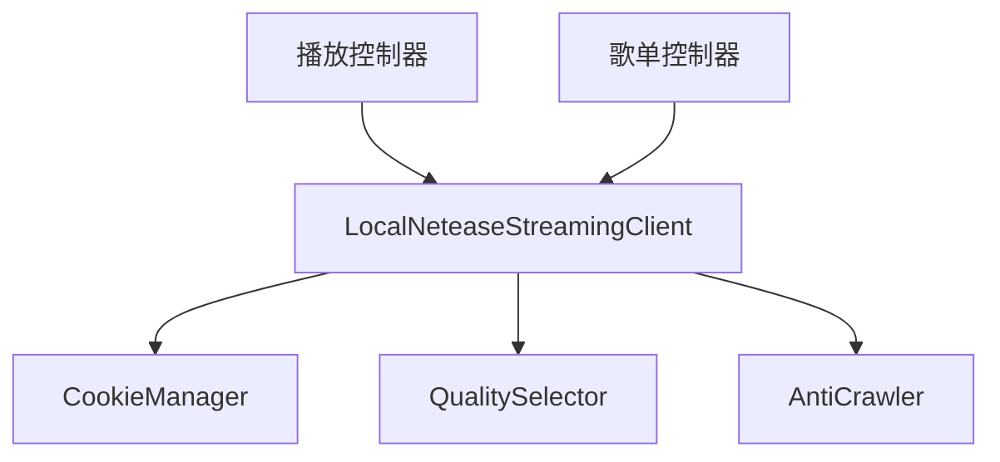

图表来源
- [StreamingModule.kt](file://app/src/main/java/app/yukine/StreamingModule.kt)
- [StreamingPlaybackController.kt](file://app/src/main/java/app/yukine/StreamingPlaybackController.kt)
- [StreamingPlaylistController.kt](file://app/src/main/java/app/yukine/StreamingPlaylistController.kt)
- [StreamingPlaybackQualityPolicy.kt](file://app/src/main/java/app/yukine/StreamingPlaybackQualityPolicy.kt)

章节来源
- [StreamingModule.kt](file://app/src/main/java/app/yukine/StreamingModule.kt)
- [StreamingPlaybackController.kt](file://app/src/main/java/app/yukine/StreamingPlaybackController.kt)
- [StreamingPlaylistController.kt](file://app/src/main/java/app/yukine/StreamingPlaylistController.kt)
- [StreamingPlaybackQualityPolicy.kt](file://app/src/main/java/app/yukine/StreamingPlaybackQualityPolicy.kt)

## 性能考量
- 连接复用与缓存
  - 复用 HTTP 连接，缓存热门歌单与元数据，减少重复请求。
- 并发控制
  - 通过任务调度器限制并发数，避免过载。
- 音质选择
  - 默认优先高音质，但考虑带宽与设备能力，动态调整。
- 重试与退避
  - 指数退避与抖动，避免雪崩效应。
- 日志与指标
  - 记录关键指标（成功率、延迟、限频次数），便于定位问题。

[本节为通用指导，不直接分析具体文件]

## 故障排查指南
- 常见问题
  - 授权失败：检查回调是否正确、Cookie 是否写入成功。
  - 播放失败：确认版权状态、音质可用性、网络状况。
  - 限频/封禁：观察重试日志，适当延长间隔。
- 定位步骤
  - 查看会话维护任务日志，确认 Cookie 刷新情况。
  - 检查音质策略与回退路径，确认降级是否生效。
  - 核对错误码映射与重试策略，确认是否符合预期。
- 工具与测试
  - 使用单元测试验证授权回调、播放控制与歌单同步逻辑。
  - 使用 Instrumented Test 验证库去重与播放链路。

章节来源
- [StreamingSessionMaintenanceWorker.kt](file://app/src/main/java/app/yukine/StreamingSessionMaintenanceWorker.kt)
- [StreamingPlaybackControllerTest.kt](file://app/src/test/java/app/yukine/StreamingPlaybackControllerTest.kt)
- [StreamingPlaylistControllerTest.kt](file://app/src/test/java/app/yukine/StreamingPlaylistControllerTest.kt)
- [StreamingAuthSessionMaintenanceTest.kt](file://app/src/test/java/app/yukine/StreamingAuthSessionMaintenanceTest.kt)
- [CanonicalLibraryDedupInstrumentedTest.java](file://app/src/androidTest/java/app/yukine/CanonicalLibraryDedupInstrumentedTest.java)

## 结论
LocalNeteaseStreamingClient 以清晰的职责边界与良好的解耦设计，实现了网易云音乐的完整播放体验。通过授权与 Cookie 管理、音质策略与版权处理、反爬与限频控制、错误码映射与重试机制，系统具备较强的鲁棒性与可维护性。建议在后续迭代中持续完善日志与指标体系，提升问题定位效率与用户体验。

[本节为总结，不直接分析具体文件]

## 附录
- 相关 UseCase 与适配器
  - 歌单导入/同步：EnsureStreamingLoginPlaylistUseCase、GetStreamingPlaylistLinkUseCase、ImportStreamingPlaylistUseCase、SyncStreamingPlaylistUseCase。
  - 搜索与交互：StreamingSearchActionAdapter、StreamingPlaylistDialogListener、StreamingPlaylistImportDialogListener。
  - 设置与策略：StreamingProviderSettingsOwner、StreamingGatewaySettingsStore、PersistentPlaybackSourcePolicy、StoredStreamingSourceMatchCodec。
  - 网络请求：NetworkRequestController。

章节来源
- [EnsureStreamingLoginPlaylistUseCase.kt](file://app/src/main/java/app/yukine/EnsureStreamingLoginPlaylistUseCase.kt)
- [GetStreamingPlaylistLinkUseCase.kt](file://app/src/main/java/app/yukine/GetStreamingPlaylistLinkUseCase.kt)
- [ImportStreamingPlaylistUseCase.kt](file://app/src/main/java/app/yukine/ImportStreamingPlaylistUseCase.kt)
- [SyncStreamingPlaylistUseCase.kt](file://app/src/main/java/app/yukine/SyncStreamingPlaylistUseCase.kt)
- [StreamingSearchActionAdapter.kt](file://app/src/main/java/app/yukine/StreamingSearchActionAdapter.kt)
- [StreamingPlaylistDialogListener.kt](file://app/src/main/java/app/yukine/StreamingPlaylistDialogListener.kt)
- [StreamingPlaylistImportDialogListener.kt](file://app/src/main/java/app/yukine/StreamingPlaylistImportDialogListener.kt)
- [StreamingProviderSettingsOwner.kt](file://app/src/main/java/app/yukine/StreamingProviderSettingsOwner.kt)
- [StreamingGatewaySettingsStore.kt](file://app/src/main/java/app/yukine/StreamingGatewaySettingsStore.kt)
- [PersistentPlaybackSourcePolicy.kt](file://app/src/main/java/app/yukine/PersistentPlaybackSourcePolicy.kt)
- [StoredStreamingSourceMatchCodec.kt](file://app/src/main/java/app/yukine/StoredStreamingSourceMatchCodec.kt)
- [NetworkRequestController.kt](file://app/src/main/java/app/yukine/NetworkRequestController.kt)