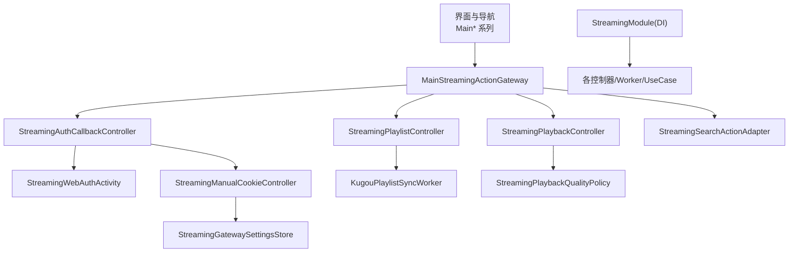
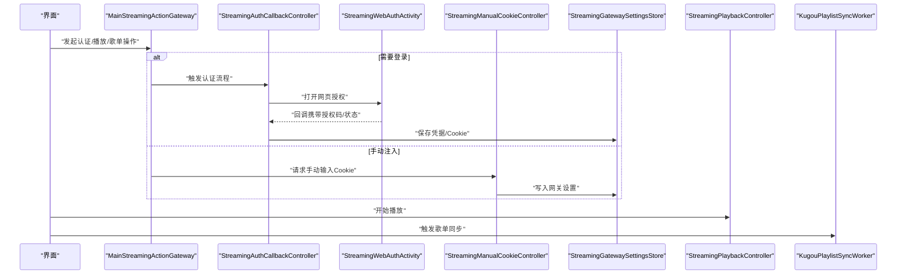
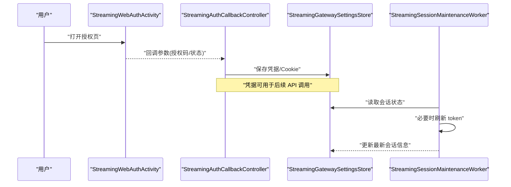
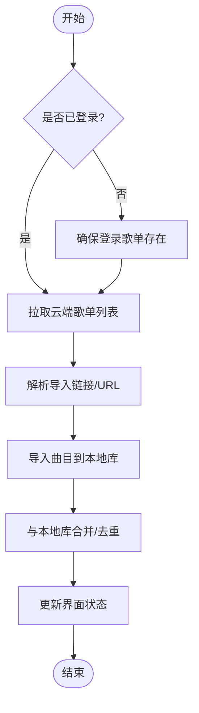
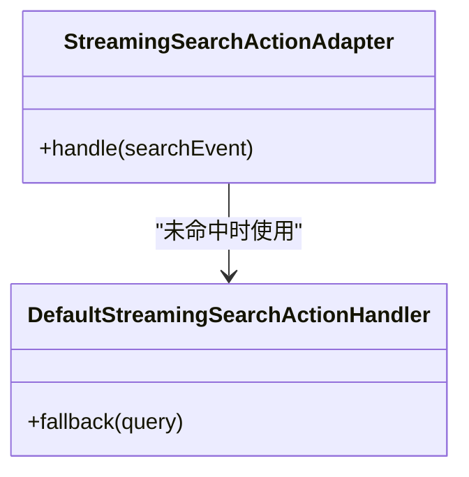
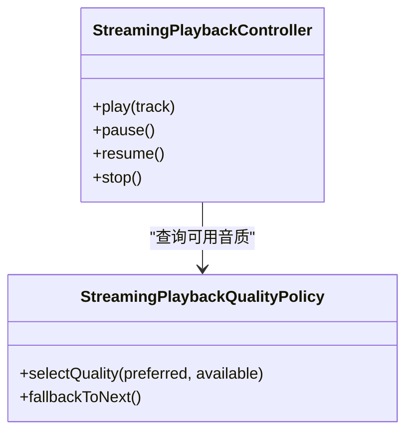
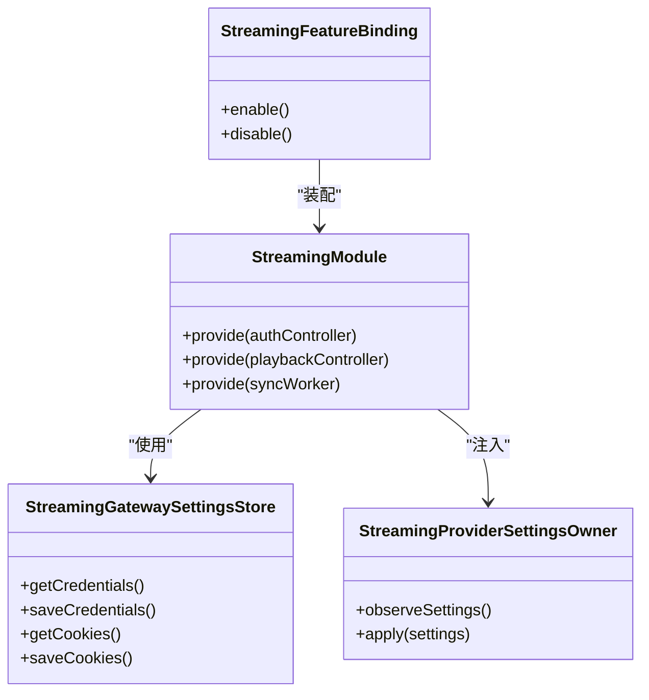
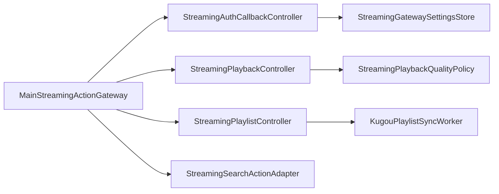

# 酷狗音乐实现

<cite>
**本文引用的文件**   
- [KugouPlaylistSyncWorker.kt](file://app/src/main/java/app/yukine/KugouPlaylistSyncWorker.kt)
- [StreamingAuthCallbackController.kt](file://app/src/main/java/app/yukine/StreamingAuthCallbackController.kt)
- [StreamingWebAuthActivity.kt](file://app/src/main/java/app/yukine/StreamingWebAuthActivity.kt)
- [StreamingSessionMaintenanceWorker.kt](file://app/src/main/java/app/yukine/StreamingSessionMaintenanceWorker.kt)
- [StreamingRepositoryProvider.kt](file://app/src/main/java/app/yukine/StreamingRepositoryProvider.kt)
- [StreamingModule.kt](file://app/src/main/java/app/yukine/StreamingModule.kt)
- [MainStreamingActionGateway.kt](file://app/src/main/java/app/yukine/MainStreamingActionGateway.kt)
- [StreamingPlaybackController.kt](file://app/src/main/java/app/yukine/StreamingPlaybackController.kt)
- [StreamingPlaylistController.kt](file://app/src/main/java/app/yukine/StreamingPlaylistController.kt)
- [StreamingSearchActionAdapter.kt](file://app/src/main/java/app/yukine/StreamingSearchActionAdapter.kt)
- [DefaultStreamingSearchActionHandler.kt](file://app/src/main/java/app/yukine/DefaultStreamingSearchActionHandler.kt)
- [StreamingAuthLauncher.kt](file://app/src/main/java/app/yukine/StreamingAuthLauncher.kt)
- [StreamingManualCookieListener.kt](file://app/src/main/java/app/yukine/StreamingManualCookieListener.kt)
- [StreamingManualCookieDialogController.java](file://app/src/main/java/app/yukine/StreamingManualCookieDialogController.java)
- [StreamingManualCookieController.kt](file://app/src/main/java/app/yukine/StreamingManualCookieController.kt)
- [StreamingProviderSettingsOwner.kt](file://app/src/main/java/app/yukine/StreamingProviderSettingsOwner.kt)
- [StreamingGatewaySettingsStore.kt](file://app/src/main/java/app/yukine/StreamingGatewaySettingsStore.kt)
- [StreamingFeatureBinding.java](file://app/src/main/java/app/yukine/StreamingFeatureBinding.java)
- [EnsureStreamingLoginPlaylistUseCase.kt](file://app/src/main/java/app/yukine/EnsureStreamingLoginPlaylistUseCase.kt)
- [GetStreamingPlaylistLinkUseCase.kt](file://app/src/main/java/app/yukine/GetStreamingPlaylistLinkUseCase.kt)
- [ImportStreamingPlaylistUseCase.kt](file://app/src/main/java/app/yukine/ImportStreamingPlaylistUseCase.kt)
- [SyncStreamingPlaylistUseCase.kt](file://app/src/main/java/app/yukine/SyncStreamingPlaylistUseCase.kt)
- [StreamingAccountPlaylistImportText.kt](file://app/src/main/java/app/yukine/StreamingAccountPlaylistImportText.kt)
- [StreamingStatusTextFactory.kt](file://app/src/main/java/app/yukine/StreamingStatusTextFactory.kt)
- [StreamingPlaybackQualityPolicy.kt](file://app/src/main/java/app/yukine/StreamingPlaybackQualityPolicy.kt)
- [StreamingTrackMatchUseCase.kt](file://app/src/main/java/app/yukine/StreamingTrackMatchUseCase.kt)
- [StreamingEventControllersTest.kt](file://app/src/test/java/app/yukine/StreamingEventControllersTest.kt)
- [StreamingAuthSessionMaintenanceTest.kt](file://app/src/test/java/app/yukine/StreamingAuthSessionMaintenanceTest.kt)
- [StreamingPlaylistControllerTest.kt](file://app/src/test/java/app/yukine/StreamingPlaylistControllerTest.kt)
- [StreamingSearchScreenStatusTest.kt](file://app/src/test/java/app/yukine/StreamingSearchScreenStatusTest.kt)
</cite>

## 目录
1. [简介](#简介)
2. [项目结构](#项目结构)
3. [核心组件](#核心组件)
4. [架构总览](#架构总览)
5. [详细组件分析](#详细组件分析)
6. [依赖关系分析](#依赖关系分析)
7. [性能与限流](#性能与限流)
8. [故障排查指南](#故障排查指南)
9. [结论](#结论)
10. [附录](#附录)

## 简介
本文件面向“酷狗音乐平台客户端实现”，聚焦于本地流媒体客户端在应用中的集成方式、认证与会话管理、播放与歌单同步、搜索行为适配，以及错误恢复与调试手段。文档以代码级事实为依据，结合测试用例与模块装配点，给出可操作的架构说明与排障建议。

## 项目结构
围绕酷狗（Kugou）相关能力，主要分布在 app 主模块的 streaming 特性入口与数据/播放层之间：
- 认证与会话：Web 授权回调、手动 Cookie 注入、会话维护 Worker
- 歌单同步：后台 Worker 与一系列 UseCase
- 搜索与推荐：搜索动作适配器与默认处理器
- 播放控制：统一播放控制器与质量策略
- 配置与装配：DI 模块、设置存储、特性绑定

图表来源
- [MainStreamingActionGateway.kt](file://app/src/main/java/app/yukine/MainStreamingActionGateway.kt)
- [StreamingAuthCallbackController.kt](file://app/src/main/java/app/yukine/StreamingAuthCallbackController.kt)
- [StreamingWebAuthActivity.kt](file://app/src/main/java/app/yukine/StreamingWebAuthActivity.kt)
- [StreamingPlaylistController.kt](file://app/src/main/java/app/yukine/StreamingPlaylistController.kt)
- [KugouPlaylistSyncWorker.kt](file://app/src/main/java/app/yukine/KugouPlaylistSyncWorker.kt)
- [StreamingPlaybackController.kt](file://app/src/main/java/app/yukine/StreamingPlaybackController.kt)
- [StreamingPlaybackQualityPolicy.kt](file://app/src/main/java/app/yukine/StreamingPlaybackQualityPolicy.kt)
- [StreamingModule.kt](file://app/src/main/java/app/yukine/StreamingModule.kt)

章节来源
- [StreamingModule.kt](file://app/src/main/java/app/yukine/StreamingModule.kt)
- [StreamingFeatureBinding.java](file://app/src/main/java/app/yukine/StreamingFeatureBinding.java)

## 核心组件
- 认证与会话
  - Web 授权回调：处理第三方登录返回并持久化凭据
  - 手动 Cookie 注入：通过对话框与监听器收集 Cookie，写入设置存储
  - 会话维护：后台定时刷新 token/会话状态
- 歌单同步
  - 后台 Worker 拉取/合并歌单
  - 导入链接解析与去重
  - 登录态缺失时自动引导创建登录歌单
- 搜索与动作
  - 搜索动作适配器将通用搜索事件路由到具体提供方
  - 默认处理器提供兜底逻辑
- 播放控制与音质
  - 统一播放控制器协调源选择与播放
  - 音质策略根据用户偏好与可用性降级/升级

章节来源
- [StreamingAuthCallbackController.kt](file://app/src/main/java/app/yukine/StreamingAuthCallbackController.kt)
- [StreamingManualCookieController.kt](file://app/src/main/java/app/yukine/StreamingManualCookieController.kt)
- [StreamingSessionMaintenanceWorker.kt](file://app/src/main/java/app/yukine/StreamingSessionMaintenanceWorker.kt)
- [KugouPlaylistSyncWorker.kt](file://app/src/main/java/app/yukine/KugouPlaylistSyncWorker.kt)
- [EnsureStreamingLoginPlaylistUseCase.kt](file://app/src/main/java/app/yukine/EnsureStreamingLoginPlaylistUseCase.kt)
- [GetStreamingPlaylistLinkUseCase.kt](file://app/src/main/java/app/yukine/GetStreamingPlaylistLinkUseCase.kt)
- [ImportStreamingPlaylistUseCase.kt](file://app/src/main/java/app/yukine/ImportStreamingPlaylistUseCase.kt)
- [SyncStreamingPlaylistUseCase.kt](file://app/src/main/java/app/yukine/SyncStreamingPlaylistUseCase.kt)
- [StreamingSearchActionAdapter.kt](file://app/src/main/java/app/yukine/StreamingSearchActionAdapter.kt)
- [DefaultStreamingSearchActionHandler.kt](file://app/src/main/java/app/yukine/DefaultStreamingSearchActionHandler.kt)
- [StreamingPlaybackController.kt](file://app/src/main/java/app/yukine/StreamingPlaybackController.kt)
- [StreamingPlaybackQualityPolicy.kt](file://app/src/main/java/app/yukine/StreamingPlaybackQualityPolicy.kt)

## 架构总览
下图展示从 UI 到后端服务的调用链路与关键中间件：

图表来源
- [MainStreamingActionGateway.kt](file://app/src/main/java/app/yukine/MainStreamingActionGateway.kt)
- [StreamingAuthCallbackController.kt](file://app/src/main/java/app/yukine/StreamingAuthCallbackController.kt)
- [StreamingWebAuthActivity.kt](file://app/src/main/java/app/yukine/StreamingWebAuthActivity.kt)
- [StreamingManualCookieController.kt](file://app/src/main/java/app/yukine/StreamingManualCookieController.kt)
- [StreamingGatewaySettingsStore.kt](file://app/src/main/java/app/yukine/StreamingGatewaySettingsStore.kt)
- [StreamingPlaybackController.kt](file://app/src/main/java/app/yukine/StreamingPlaybackController.kt)
- [KugouPlaylistSyncWorker.kt](file://app/src/main/java/app/yukine/KugouPlaylistSyncWorker.kt)

## 详细组件分析

### 认证与会话管理
- 目标
  - 完成 Web 授权回调处理与凭据持久化
  - 支持手动 Cookie 注入，便于无头或受限环境
  - 后台维护会话，避免频繁失效
- 关键类与职责
  - 回调控制器：接收授权结果，更新设置存储
  - Web 授权页面：承载第三方登录页
  - 手动 Cookie 控制器：弹窗/监听器驱动，落盘到设置存储
  - 会话维护 Worker：周期性检查并刷新 token/会话
- 交互时序

图表来源
- [StreamingWebAuthActivity.kt](file://app/src/main/java/app/yukine/StreamingWebAuthActivity.kt)
- [StreamingAuthCallbackController.kt](file://app/src/main/java/app/yukine/StreamingAuthCallbackController.kt)
- [StreamingGatewaySettingsStore.kt](file://app/src/main/java/app/yukine/StreamingGatewaySettingsStore.kt)
- [StreamingSessionMaintenanceWorker.kt](file://app/src/main/java/app/yukine/StreamingSessionMaintenanceWorker.kt)

章节来源
- [StreamingAuthCallbackController.kt](file://app/src/main/java/app/yukine/StreamingAuthCallbackController.kt)
- [StreamingWebAuthActivity.kt](file://app/src/main/java/app/yukine/StreamingWebAuthActivity.kt)
- [StreamingManualCookieListener.kt](file://app/src/main/java/app/yukine/StreamingManualCookieListener.kt)
- [StreamingManualCookieDialogController.java](file://app/src/main/java/app/yukine/StreamingManualCookieDialogController.java)
- [StreamingManualCookieController.kt](file://app/src/main/java/app/yukine/StreamingManualCookieController.kt)
- [StreamingSessionMaintenanceWorker.kt](file://app/src/main/java/app/yukine/StreamingSessionMaintenanceWorker.kt)
- [StreamingAuthLauncher.kt](file://app/src/main/java/app/yukine/StreamingAuthLauncher.kt)
- [StreamingAuthSessionMaintenanceTest.kt](file://app/src/test/java/app/yukine/StreamingAuthSessionMaintenanceTest.kt)

### 歌单同步与导入
- 目标
  - 从账户拉取歌单并与本地库合并
  - 支持通过链接导入外部歌单
  - 在未登录时自动引导创建登录歌单
- 关键类与职责
  - 同步 Worker：调度拉取与合并任务
  - UseCase 集合：确保登录歌单存在、解析链接、导入、增量同步
- 流程图

图表来源
- [KugouPlaylistSyncWorker.kt](file://app/src/main/java/app/yukine/KugouPlaylistSyncWorker.kt)
- [EnsureStreamingLoginPlaylistUseCase.kt](file://app/src/main/java/app/yukine/EnsureStreamingLoginPlaylistUseCase.kt)
- [GetStreamingPlaylistLinkUseCase.kt](file://app/src/main/java/app/yukine/GetStreamingPlaylistLinkUseCase.kt)
- [ImportStreamingPlaylistUseCase.kt](file://app/src/main/java/app/yukine/ImportStreamingPlaylistUseCase.kt)
- [SyncStreamingPlaylistUseCase.kt](file://app/src/main/java/app/yukine/SyncStreamingPlaylistUseCase.kt)
- [StreamingAccountPlaylistImportText.kt](file://app/src/main/java/app/yukine/StreamingAccountPlaylistImportText.kt)

章节来源
- [KugouPlaylistSyncWorker.kt](file://app/src/main/java/app/yukine/KugouPlaylistSyncWorker.kt)
- [EnsureStreamingLoginPlaylistUseCase.kt](file://app/src/main/java/app/yukine/EnsureStreamingLoginPlaylistUseCase.kt)
- [GetStreamingPlaylistLinkUseCase.kt](file://app/src/main/java/app/yukine/GetStreamingPlaylistLinkUseCase.kt)
- [ImportStreamingPlaylistUseCase.kt](file://app/src/main/java/app/yukine/ImportStreamingPlaylistUseCase.kt)
- [SyncStreamingPlaylistUseCase.kt](file://app/src/main/java/app/yukine/SyncStreamingPlaylistUseCase.kt)
- [StreamingAccountPlaylistImportText.kt](file://app/src/main/java/app/yukine/StreamingAccountPlaylistImportText.kt)
- [StreamingPlaylistControllerTest.kt](file://app/src/test/java/app/yukine/StreamingPlaylistControllerTest.kt)

### 搜索与动作路由
- 目标
  - 将通用搜索事件分发到具体提供方（如酷狗）
  - 提供默认处理器作为兜底
- 关键类与职责
  - 搜索动作适配器：按来源类型路由
  - 默认处理器：未匹配时的回退逻辑
- 类图

图表来源
- [StreamingSearchActionAdapter.kt](file://app/src/main/java/app/yukine/StreamingSearchActionAdapter.kt)
- [DefaultStreamingSearchActionHandler.kt](file://app/src/main/java/app/yukine/DefaultStreamingSearchActionHandler.kt)

章节来源
- [StreamingSearchActionAdapter.kt](file://app/src/main/java/app/yukine/StreamingSearchActionAdapter.kt)
- [DefaultStreamingSearchActionHandler.kt](file://app/src/main/java/app/yukine/DefaultStreamingSearchActionHandler.kt)
- [StreamingSearchScreenStatusTest.kt](file://app/src/test/java/app/yukine/StreamingSearchScreenStatusTest.kt)

### 播放控制与音质策略
- 目标
  - 统一接入不同来源的播放能力
  - 依据用户偏好与可用性选择音质
- 关键类与职责
  - 播放控制器：编排播放生命周期与源切换
  - 音质策略：标准/高品质/无损/Hi-Res 的选择与降级
- 类图

图表来源
- [StreamingPlaybackController.kt](file://app/src/main/java/app/yukine/StreamingPlaybackController.kt)
- [StreamingPlaybackQualityPolicy.kt](file://app/src/main/java/app/yukine/StreamingPlaybackQualityPolicy.kt)

章节来源
- [StreamingPlaybackController.kt](file://app/src/main/java/app/yukine/StreamingPlaybackController.kt)
- [StreamingPlaybackQualityPolicy.kt](file://app/src/main/java/app/yukine/StreamingPlaybackQualityPolicy.kt)

### 配置与装配
- 目标
  - 集中装配 streaming 特性相关依赖
  - 暴露设置项与特性开关
- 关键类与职责
  - DI 模块：注册控制器、Worker、UseCase
  - 设置存储：读写网关凭据、Cookie、偏好
  - 特性绑定：启用/禁用 streaming 功能
- 类图

图表来源
- [StreamingModule.kt](file://app/src/main/java/app/yukine/StreamingModule.kt)
- [StreamingGatewaySettingsStore.kt](file://app/src/main/java/app/yukine/StreamingGatewaySettingsStore.kt)
- [StreamingProviderSettingsOwner.kt](file://app/src/main/java/app/yukine/StreamingProviderSettingsOwner.kt)
- [StreamingFeatureBinding.java](file://app/src/main/java/app/yukine/StreamingFeatureBinding.java)

章节来源
- [StreamingModule.kt](file://app/src/main/java/app/yukine/StreamingModule.kt)
- [StreamingGatewaySettingsStore.kt](file://app/src/main/java/app/yukine/StreamingGatewaySettingsStore.kt)
- [StreamingProviderSettingsOwner.kt](file://app/src/main/java/app/yukine/StreamingProviderSettingsOwner.kt)
- [StreamingFeatureBinding.java](file://app/src/main/java/app/yukine/StreamingFeatureBinding.java)

## 依赖关系分析
- 耦合与内聚
  - MainStreamingActionGateway 作为对外门面，聚合认证、播放、歌单、搜索等子域，降低上层耦合
  - 控制器与 Worker/UseCase 解耦，通过 DI 装配，提升可测性
- 外部依赖
  - 设置存储用于持久化凭据与 Cookie
  - 系统服务（WorkManager、WebView 等）由对应组件间接使用
- 潜在循环依赖
  - 当前分层清晰，未见直接循环；需关注 UseCase 与 Controller 间仅单向依赖

图表来源
- [MainStreamingActionGateway.kt](file://app/src/main/java/app/yukine/MainStreamingActionGateway.kt)
- [StreamingAuthCallbackController.kt](file://app/src/main/java/app/yukine/StreamingAuthCallbackController.kt)
- [StreamingPlaybackController.kt](file://app/src/main/java/app/yukine/StreamingPlaybackController.kt)
- [StreamingPlaylistController.kt](file://app/src/main/java/app/yukine/StreamingPlaylistController.kt)
- [KugouPlaylistSyncWorker.kt](file://app/src/main/java/app/yukine/KugouPlaylistSyncWorker.kt)
- [StreamingPlaybackQualityPolicy.kt](file://app/src/main/java/app/yukine/StreamingPlaybackQualityPolicy.kt)
- [StreamingGatewaySettingsStore.kt](file://app/src/main/java/app/yukine/StreamingGatewaySettingsStore.kt)

章节来源
- [MainStreamingActionGateway.kt](file://app/src/main/java/app/yukine/MainStreamingActionGateway.kt)
- [StreamingRepositoryProvider.kt](file://app/src/main/java/app/yukine/StreamingRepositoryProvider.kt)

## 性能与限流
- 限流与重试
  - 建议在网络层对上游接口实施指数退避与并发限制，避免突发流量导致 429/5xx
  - 对歌单同步采用分片拉取与批量合并，减少大响应体压力
- 缓存与去重
  - 歌单与元数据引入本地缓存，增量同步优先
  - 导入阶段进行曲目级去重，避免重复入库
- 资源释放
  - WebView 与音频流需在生命周期结束时正确释放，防止内存泄漏
- 监控与指标
  - 记录认证成功率、会话过期率、同步耗时、播放首帧延迟等关键指标

[本节为通用指导，不直接分析具体文件]

## 故障排查指南
- 认证失败
  - 检查回调参数是否完整、凭据是否成功写入设置存储
  - 确认会话维护 Worker 是否按时刷新 token
- 歌单同步异常
  - 核对链接解析与导入 UseCase 的错误分支
  - 查看 Worker 日志与重试次数
- 搜索无结果
  - 验证搜索动作适配器是否正确路由至提供方
  - 检查默认处理器兜底逻辑
- 播放卡顿/无法播放
  - 观察音质策略降级路径与可用源
  - 检查网络层限流与重试策略

章节来源
- [StreamingEventControllersTest.kt](file://app/src/test/java/app/yukine/StreamingEventControllersTest.kt)
- [StreamingAuthSessionMaintenanceTest.kt](file://app/src/test/java/app/yukine/StreamingAuthSessionMaintenanceTest.kt)
- [StreamingPlaylistControllerTest.kt](file://app/src/test/java/app/yukine/StreamingPlaylistControllerTest.kt)
- [StreamingSearchScreenStatusTest.kt](file://app/src/test/java/app/yukine/StreamingSearchScreenStatusTest.kt)
- [StreamingStatusTextFactory.kt](file://app/src/main/java/app/yukine/StreamingStatusTextFactory.kt)

## 结论
本项目通过清晰的模块化与 DI 装配，将酷狗相关的认证、会话、歌单同步、搜索与播放能力整合进统一的 streaming 特性中。控制器与 Worker/UseCase 的职责边界明确，配合设置存储与特性开关，具备良好的可维护性与可扩展性。建议在网络层完善限流与重试策略，并在关键路径增加可观测性指标，以提升稳定性与用户体验。

## 附录
- 术语
  - 凭据：访问上游 API 所需的令牌或会话标识
  - Cookie：用于维持登录态的浏览器侧键值对
  - 音质：标准/高品质/无损/Hi-Res 四级体系
- 参考
  - 设置项与特性开关见对应 Owner/Store 类
  - 测试用例覆盖认证、会话、歌单与搜索的关键路径

[本节为补充说明，不直接分析具体文件]