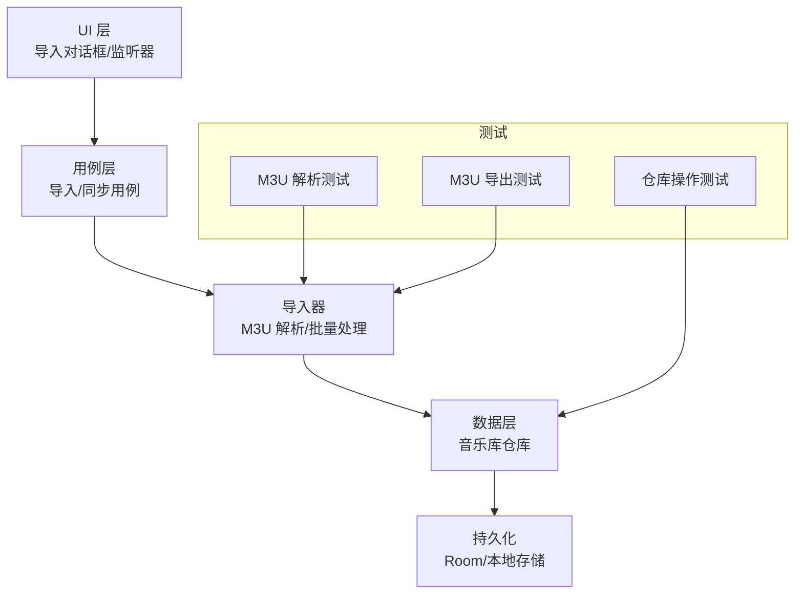
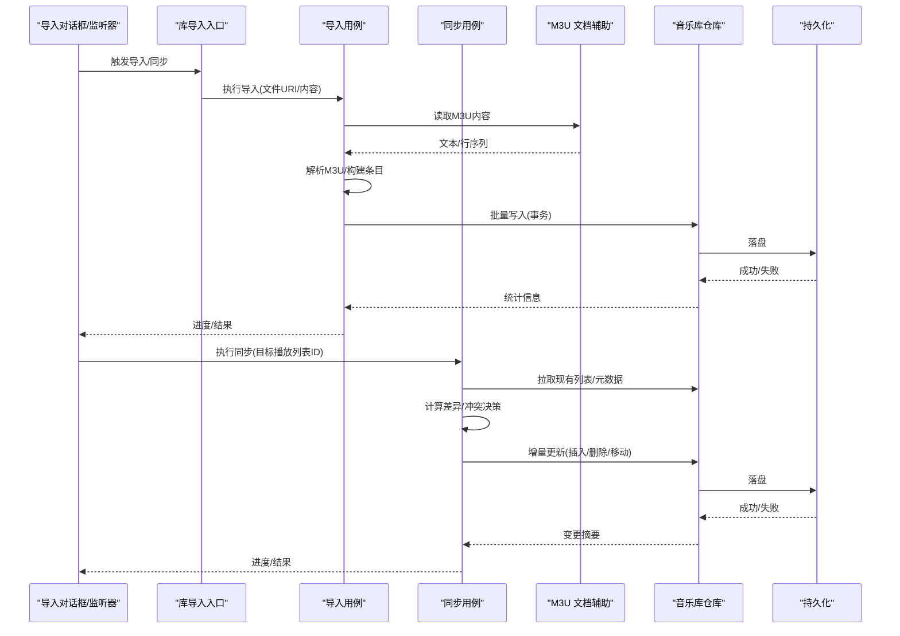
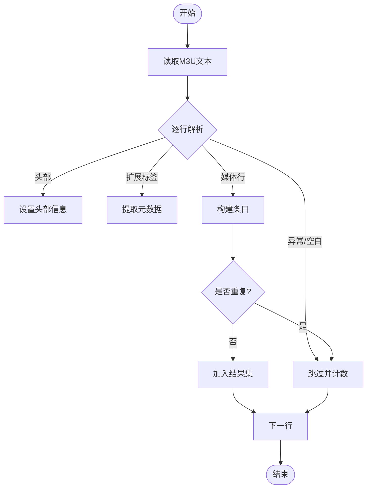
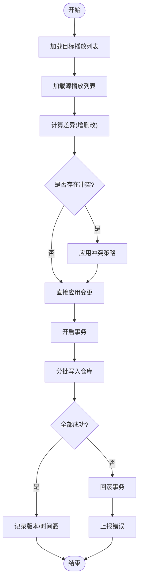
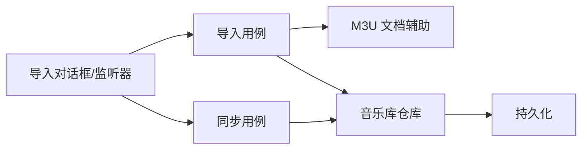

# 播放列表同步

<cite>
**本文引用的文件**   
- [M3uPlaylistParserInstrumentedTest.java](file://app/src/androidTest/java/app/yukine/data/M3uPlaylistParserInstrumentedTest.java)
- [M3uPlaylistExporterInstrumentedTest.java](file://app/src/androidTest/java/app/yukine/data/M3uPlaylistExporterInstrumentedTest.java)
- [M3uDocumentHelper.java](file://app/src/main/java/app/yukine/M3uDocumentHelper.java)
- [ImportStreamingPlaylistUseCase.kt](file://app/src/main/java/app/yukine/ImportStreamingPlaylistUseCase.kt)
- [SyncStreamingPlaylistUseCase.kt](file://app/src/main/java/app/yukine/SyncStreamingPlaylistUseCase.kt)
- [MainStreamingPlaylistImportDialogListener.java](file://app/src/main/java/app/yukine/MainStreamingPlaylistImportDialogListener.java)
- [StreamingPlaylistImportDialogController.java](file://app/src/main/java/app/yukine/StreamingPlaylistImportDialogController.java)
- [LibraryImportOwner.kt](file://app/src/main/java/app/yukine/LibraryImportOwner.kt)
- [LibraryImportUseCases.kt](file://app/src/main/java/app/yukine/LibraryImportUseCases.kt)
- [MusicLibraryRepositoryInstrumentedTest.java](file://app/src/androidTest/java/app/yukine/data/MusicLibraryRepositoryInstrumentedTest.java)
</cite>

## 目录
1. [简介](#简介)
2. [项目结构](#项目结构)
3. [核心组件](#核心组件)
4. [架构总览](#架构总览)
5. [详细组件分析](#详细组件分析)
6. [依赖关系分析](#依赖关系分析)
7. [性能与内存优化](#性能与内存优化)
8. [故障排查指南](#故障排查指南)
9. [结论](#结论)
10. [附录](#附录)

## 简介
本文件聚焦“播放列表同步”能力，围绕以下目标展开：
- 播放列表导入器工作原理与 M3U 格式解析流程
- 批量数据处理策略与增量同步算法
- 冲突解决策略与版本控制机制
- 同步状态跟踪、失败重试机制与进度反馈
- 大数据量处理的性能优化与内存管理
- 调试方法与数据一致性保证方案

## 项目结构
与播放列表同步相关的主要代码分布在应用层（app）的 main 与 androidTest 中，涉及文档辅助、导入用例、流媒体播放列表导入对话框以及库导入入口等。测试覆盖 M3U 解析与导出、仓库操作等关键路径。

图表来源
- [M3uDocumentHelper.java](file://app/src/main/java/app/yukine/M3uDocumentHelper.java)
- [ImportStreamingPlaylistUseCase.kt](file://app/src/main/java/app/yukine/ImportStreamingPlaylistUseCase.kt)
- [SyncStreamingPlaylistUseCase.kt](file://app/src/main/java/app/yukine/SyncStreamingPlaylistUseCase.kt)
- [M3uPlaylistParserInstrumentedTest.java](file://app/src/androidTest/java/app/yukine/data/M3uPlaylistParserInstrumentedTest.java)
- [M3uPlaylistExporterInstrumentedTest.java](file://app/src/androidTest/java/app/yukine/data/M3uPlaylistExporterInstrumentedTest.java)
- [MusicLibraryRepositoryInstrumentedTest.java](file://app/src/androidTest/java/app/yukine/data/MusicLibraryRepositoryInstrumentedTest.java)

章节来源
- [M3uDocumentHelper.java](file://app/src/main/java/app/yukine/M3uDocumentHelper.java)
- [ImportStreamingPlaylistUseCase.kt](file://app/src/main/java/app/yukine/ImportStreamingPlaylistUseCase.kt)
- [SyncStreamingPlaylistUseCase.kt](file://app/src/main/java/app/yukine/SyncStreamingPlaylistUseCase.kt)
- [M3uPlaylistParserInstrumentedTest.java](file://app/src/androidTest/java/app/yukine/data/M3uPlaylistParserInstrumentedTest.java)
- [M3uPlaylistExporterInstrumentedTest.java](file://app/src/androidTest/java/app/yukine/data/M3uPlaylistExporterInstrumentedTest.java)
- [MusicLibraryRepositoryInstrumentedTest.java](file://app/src/androidTest/java/app/yukine/data/MusicLibraryRepositoryInstrumentedTest.java)

## 核心组件
- 文档辅助类：负责从系统文档提供程序读取 M3U 内容并转换为可解析的数据流。
- 导入用例：封装一次完整的导入流程，包括选择、解析、去重、写入与结果上报。
- 同步用例：在已有播放列表基础上进行差异对比与增量更新，支持冲突策略与版本记录。
- 导入对话框与监听器：协调用户交互、权限获取、任务调度与进度回调。
- 库导入入口与用例聚合：统一暴露导入/同步接口给上层 UI 或后台任务。
- 测试套件：覆盖 M3U 解析、导出、仓库读写等关键路径，保障正确性与稳定性。

章节来源
- [M3uDocumentHelper.java](file://app/src/main/java/app/yukine/M3uDocumentHelper.java)
- [ImportStreamingPlaylistUseCase.kt](file://app/src/main/java/app/yukine/ImportStreamingPlaylistUseCase.kt)
- [SyncStreamingPlaylistUseCase.kt](file://app/src/main/java/app/yukine/SyncStreamingPlaylistUseCase.kt)
- [MainStreamingPlaylistImportDialogListener.java](file://app/src/main/java/app/yukine/MainStreamingPlaylistImportDialogListener.java)
- [StreamingPlaylistImportDialogController.java](file://app/src/main/java/app/yukine/StreamingPlaylistImportDialogController.java)
- [LibraryImportOwner.kt](file://app/src/main/java/app/yukine/LibraryImportOwner.kt)
- [LibraryImportUseCases.kt](file://app/src/main/java/app/yukine/LibraryImportUseCases.kt)
- [M3uPlaylistParserInstrumentedTest.java](file://app/src/androidTest/java/app/yukine/data/M3uPlaylistParserInstrumentedTest.java)
- [M3uPlaylistExporterInstrumentedTest.java](file://app/src/androidTest/java/app/yukine/data/M3uPlaylistExporterInstrumentedTest.java)
- [MusicLibraryRepositoryInstrumentedTest.java](file://app/src/androidTest/java/app/yukine/data/MusicLibraryRepositoryInstrumentedTest.java)

## 架构总览
播放列表同步采用“UI → 用例 → 导入器 → 仓库 → 持久化”的分层架构。导入与同步分别由独立用例编排，导入器专注 M3U 解析与批量处理，仓库负责事务性写入与并发安全。

图表来源
- [MainStreamingPlaylistImportDialogListener.java](file://app/src/main/java/app/yukine/MainStreamingPlaylistImportListener.java)
- [StreamingPlaylistImportDialogController.java](file://app/src/main/java/app/yukine/StreamingPlaylistImportDialogController.java)
- [LibraryImportOwner.kt](file://app/src/main/java/app/yukine/LibraryImportOwner.kt)
- [LibraryImportUseCases.kt](file://app/src/main/java/app/yukine/LibraryImportUseCases.kt)
- [ImportStreamingPlaylistUseCase.kt](file://app/src/main/java/app/yukine/ImportStreamingPlaylistUseCase.kt)
- [SyncStreamingPlaylistUseCase.kt](file://app/src/main/java/app/yukine/SyncStreamingPlaylistUseCase.kt)
- [M3uDocumentHelper.java](file://app/src/main/java/app/yukine/M3uDocumentHelper.java)
- [MusicLibraryRepositoryInstrumentedTest.java](file://app/src/androidTest/java/app/yukine/data/MusicLibraryRepositoryInstrumentedTest.java)

## 详细组件分析

### M3U 解析与导入器
- 输入来源：通过文档辅助类从系统 URI 读取文本，按行迭代，跳过注释与空行，识别扩展标签与媒体项。
- 解析规则：
  - 首行以特定标记为头部；后续每行若为扩展标签则携带元数据（如时长、标题），否则视为媒体路径。
  - 相对路径需基于当前文档上下文解析为绝对路径；非法路径将被忽略并记录。
  - 重复条目依据唯一键（如路径+标题）去重。
- 输出模型：统一的播放列表条目集合，包含顺序、媒体标识、可选元数据。
- 错误处理：对编码异常、IO 异常、路径不可达等情况进行捕获与计数，最终汇总到结果对象。

图表来源
- [M3uPlaylistParserInstrumentedTest.java](file://app/src/androidTest/java/app/yukine/data/M3uPlaylistParserInstrumentedTest.java)
- [M3uDocumentHelper.java](file://app/src/main/java/app/yukine/M3uDocumentHelper.java)

章节来源
- [M3uPlaylistParserInstrumentedTest.java](file://app/src/androidTest/java/app/yukine/data/M3uPlaylistParserInstrumentedTest.java)
- [M3uDocumentHelper.java](file://app/src/main/java/app/yukine/M3uDocumentHelper.java)

### 导入用例（ImportStreamingPlaylistUseCase）
- 职责：编排一次完整导入流程，包括权限校验、文件读取、解析、批量写入与结果上报。
- 批量写入：将解析后的条目分批提交至仓库，使用事务包裹，确保原子性。
- 进度反馈：按批次推进进度，向调用方报告已处理数量与错误数。
- 失败处理：遇到 IO 或解析异常时中断当前批次，记录错误并继续后续批次（可配置）。

章节来源
- [ImportStreamingPlaylistUseCase.kt](file://app/src/main/java/app/yukine/ImportStreamingPlaylistUseCase.kt)
- [LibraryImportUseCases.kt](file://app/src/main/java/app/yukine/LibraryImportUseCases.kt)

### 同步用例（SyncStreamingPlaylistUseCase）
- 职责：在目标播放列表上执行增量同步，比较源与目标的差异，应用插入、删除、移动等操作。
- 差异计算：基于条目唯一键与顺序生成变更集；对冲突场景（同名不同路径、顺序不一致）应用策略。
- 冲突策略：
  - 保留本地优先：当本地存在且未修改时不覆盖。
  - 远端优先：强制对齐远端顺序与成员。
  - 合并策略：仅新增缺失项，不删除本地新增项。
- 版本控制：每次同步生成版本号或时间戳，用于审计与回滚。
- 事务与回滚：批量变更在事务内执行，任一失败整体回滚。

图表来源
- [SyncStreamingPlaylistUseCase.kt](file://app/src/main/java/app/yukine/SyncStreamingPlaylistUseCase.kt)
- [MusicLibraryRepositoryInstrumentedTest.java](file://app/src/androidTest/java/app/yukine/data/MusicLibraryRepositoryInstrumentedTest.java)

章节来源
- [SyncStreamingPlaylistUseCase.kt](file://app/src/main/java/app/yukine/SyncStreamingPlaylistUseCase.kt)
- [MusicLibraryRepositoryInstrumentedTest.java](file://app/src/androidTest/java/app/yukine/data/MusicLibraryRepositoryInstrumentedTest.java)

### 导入对话框与监听器
- 对话框控制器：负责展示导入选项（覆盖/追加/新建）、确认与取消。
- 监听器：接收用户选择，启动导入/同步任务，订阅进度与结果。
- 权限与选择：通过系统文档选择器获取 M3U 文件 URI，并在必要时请求读取权限。

章节来源
- [StreamingPlaylistImportDialogController.java](file://app/src/main/java/app/yukine/StreamingPlaylistImportDialogController.java)
- [MainStreamingPlaylistImportDialogListener.java](file://app/src/main/java/app/yukine/MainStreamingPlaylistImportDialogListener.java)

### 库导入入口与用例聚合
- 入口：对外暴露统一的导入/同步方法，供 UI 或后台任务调用。
- 用例聚合：根据参数决定走导入还是同步路径，并传递必要上下文（目标 ID、策略、进度回调）。

章节来源
- [LibraryImportOwner.kt](file://app/src/main/java/app/yukine/LibraryImportOwner.kt)
- [LibraryImportUseCases.kt](file://app/src/main/java/app/yukine/LibraryImportUseCases.kt)

### 测试覆盖
- M3U 解析测试：验证头部识别、扩展标签解析、路径归一化、重复处理与异常分支。
- M3U 导出测试：验证导出格式符合规范、顺序一致、元数据正确。
- 仓库操作测试：验证批量写入、事务回滚、并发安全与一致性约束。

章节来源
- [M3uPlaylistParserInstrumentedTest.java](file://app/src/androidTest/java/app/yukine/data/M3uPlaylistParserInstrumentedTest.java)
- [M3uPlaylistExporterInstrumentedTest.java](file://app/src/androidTest/java/app/yukine/data/M3uPlaylistExporterInstrumentedTest.java)
- [MusicLibraryRepositoryInstrumentedTest.java](file://app/src/androidTest/java/app/yukine/data/MusicLibraryRepositoryInstrumentedTest.java)

## 依赖关系分析
- 低耦合：UI 仅依赖用例接口；用例依赖导入器与仓库；导入器依赖文档辅助与解析逻辑。
- 明确边界：解析与写入分离，便于替换实现与单元测试。
- 外部依赖：系统文档提供程序、Room 数据库、线程池与协程调度器。

图表来源
- [MainStreamingPlaylistImportDialogListener.java](file://app/src/main/java/app/yukine/MainStreamingPlaylistImportDialogListener.java)
- [StreamingPlaylistImportDialogController.java](file://app/src/main/java/app/yukine/StreamingPlaylistImportDialogController.java)
- [ImportStreamingPlaylistUseCase.kt](file://app/src/main/java/app/yukine/ImportStreamingPlaylistUseCase.kt)
- [SyncStreamingPlaylistUseCase.kt](file://app/src/main/java/app/yukine/SyncStreamingPlaylistUseCase.kt)
- [M3uDocumentHelper.java](file://app/src/main/java/app/yukine/M3uDocumentHelper.java)
- [MusicLibraryRepositoryInstrumentedTest.java](file://app/src/androidTest/java/app/yukine/data/MusicLibraryRepositoryInstrumentedTest.java)

章节来源
- [MainStreamingPlaylistImportDialogListener.java](file://app/src/main/java/app/yukine/MainStreamingPlaylistImportDialogListener.java)
- [StreamingPlaylistImportDialogController.java](file://app/src/main/java/app/yukine/StreamingPlaylistImportDialogController.java)
- [ImportStreamingPlaylistUseCase.kt](file://app/src/main/java/app/yukine/ImportStreamingPlaylistUseCase.kt)
- [SyncStreamingPlaylistUseCase.kt](file://app/src/main/java/app/yukine/SyncStreamingPlaylistUseCase.kt)
- [M3uDocumentHelper.java](file://app/src/main/java/app/yukine/M3uDocumentHelper.java)
- [MusicLibraryRepositoryInstrumentedTest.java](file://app/src/androidTest/java/app/yukine/data/MusicLibraryRepositoryInstrumentedTest.java)

## 性能与内存优化
- 流式解析：按行读取与解析，避免一次性加载大文件到内存。
- 批处理写入：将条目分批提交至仓库，降低单次事务大小，减少锁竞争与回滚成本。
- 去重策略：在内存中使用轻量索引（如哈希表）维护已见条目键，快速判定重复。
- 并发控制：限制并行写入通道数量，避免 I/O 抖动与数据库压力过大。
- 内存回收：及时释放临时对象引用，避免长生命周期持有大对象。
- 进度反馈：按批次推送进度，提升用户体验与可观测性。

[本节为通用指导，无需源码引用]

## 故障排查指南
- 常见问题定位：
  - 解析失败：检查 M3U 编码、头部格式、扩展标签语法与路径合法性。
  - 写入失败：查看事务日志与错误码，确认外键约束与唯一性约束。
  - 同步不一致：比对源与目标差异集，确认冲突策略是否符合预期。
- 调试建议：
  - 启用详细日志，记录解析步骤、批次大小、错误计数与耗时。
  - 使用测试套件复现问题，逐步缩小范围。
  - 对大文件进行分片测试，定位性能瓶颈。
- 一致性保证：
  - 所有批量变更在事务内执行，失败即回滚。
  - 同步后生成版本记录，支持审计与回退。
  - 幂等设计：相同输入多次执行不会产生额外副作用。

章节来源
- [M3uPlaylistParserInstrumentedTest.java](file://app/src/androidTest/java/app/yukine/data/M3uPlaylistParserInstrumentedTest.java)
- [M3uPlaylistExporterInstrumentedTest.java](file://app/src/androidTest/java/app/yukine/data/M3uPlaylistExporterInstrumentedTest.java)
- [MusicLibraryRepositoryInstrumentedTest.java](file://app/src/androidTest/java/app/yukine/data/MusicLibraryRepositoryInstrumentedTest.java)

## 结论
播放列表同步功能通过分层架构与清晰职责划分，实现了可靠的 M3U 解析、批量处理与增量同步。结合冲突策略、版本控制与事务回滚，保障了数据一致性与可恢复性。针对大数据量场景，采用流式解析与批处理写入，有效降低内存占用与 I/O 压力。完善的测试覆盖与调试手段进一步提升了系统的稳定性与可维护性。

[本节为总结性内容，无需源码引用]

## 附录
- 术语说明：
  - 播放列表：一组有序媒体条目的集合。
  - 增量同步：仅对差异部分进行更新，避免全量重写。
  - 冲突策略：当源与目标不一致时的决策规则。
- 参考路径：
  - 导入用例：[ImportStreamingPlaylistUseCase.kt](file://app/src/main/java/app/yukine/ImportStreamingPlaylistUseCase.kt)
  - 同步用例：[SyncStreamingPlaylistUseCase.kt](file://app/src/main/java/app/yukine/SyncStreamingPlaylistUseCase.kt)
  - 文档辅助：[M3uDocumentHelper.java](file://app/src/main/java/app/yukine/M3uDocumentHelper.java)
  - 导入对话框：[StreamingPlaylistImportDialogController.java](file://app/src/main/java/app/yukine/StreamingPlaylistImportDialogController.java)
  - 导入监听器：[MainStreamingPlaylistImportDialogListener.java](file://app/src/main/java/app/yukine/MainStreamingPlaylistImportDialogListener.java)
  - 库导入入口：[LibraryImportOwner.kt](file://app/src/main/java/app/yukine/LibraryImportOwner.kt)
  - 库导入用例聚合：[LibraryImportUseCases.kt](file://app/src/main/java/app/yukine/LibraryImportUseCases.kt)
  - 解析测试：[M3uPlaylistParserInstrumentedTest.java](file://app/src/androidTest/java/app/yukine/data/M3uPlaylistParserInstrumentedTest.java)
  - 导出测试：[M3uPlaylistExporterInstrumentedTest.java](file://app/src/androidTest/java/app/yukine/data/M3uPlaylistExporterInstrumentedTest.java)
  - 仓库测试：[MusicLibraryRepositoryInstrumentedTest.java](file://app/src/androidTest/java/app/yukine/data/MusicLibraryRepositoryInstrumentedTest.java)