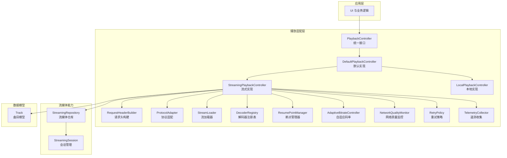
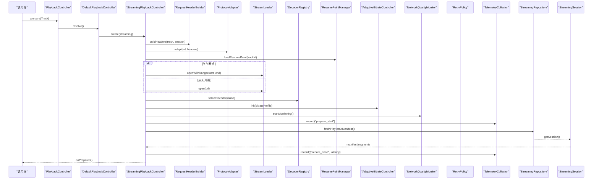
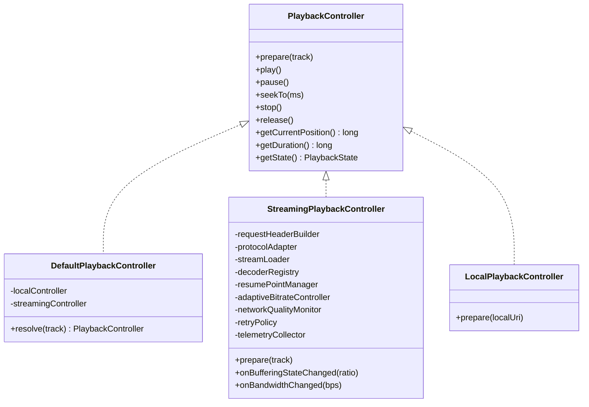
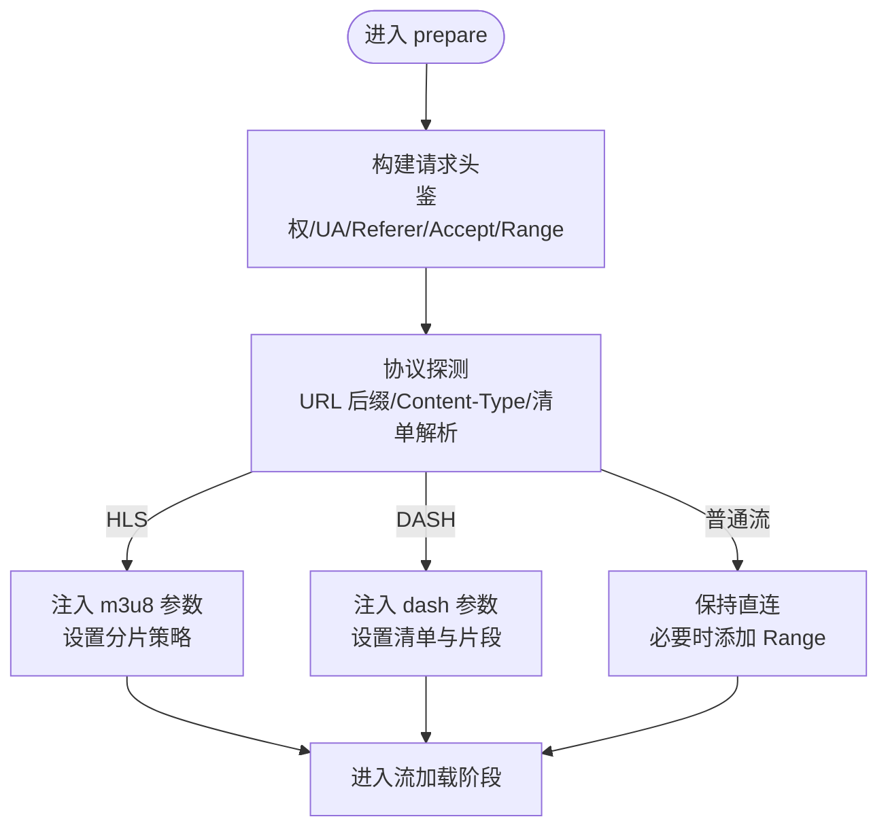
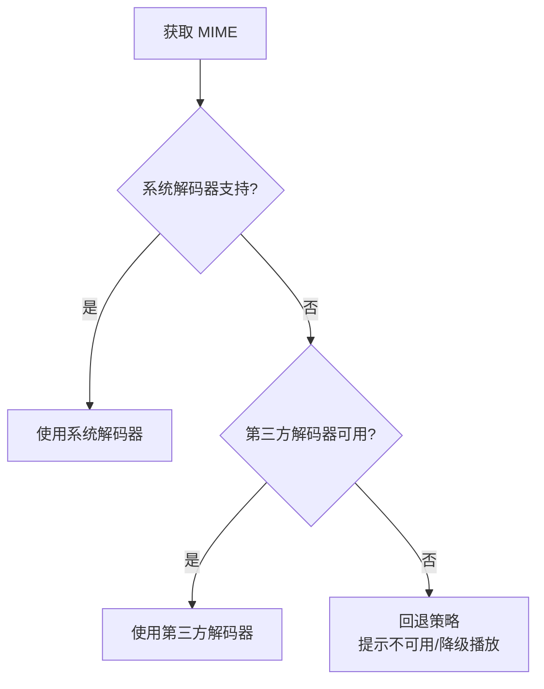
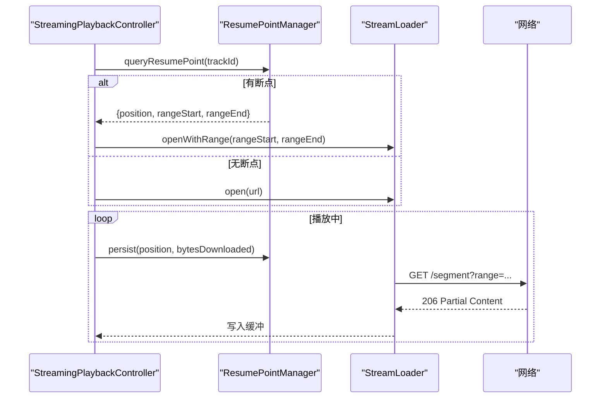
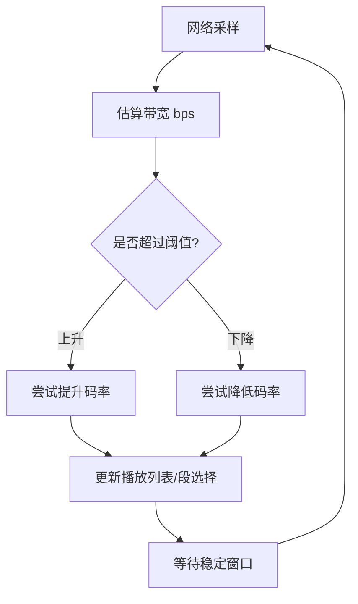
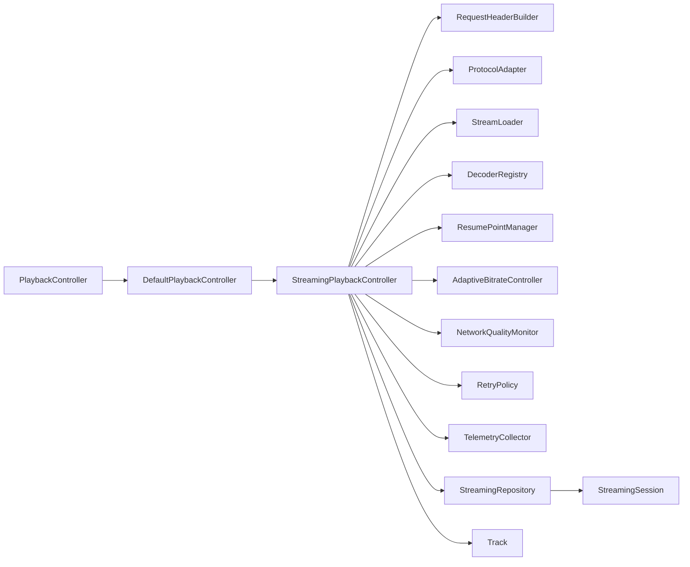

# 播放适配器

<cite>
**本文引用的文件**   
- [app/src/main/java/app/yukine/playback/PlaybackService.kt](file://app/src/main/java/app/yukine/playback/PlaybackService.kt)
- [app/src/main/java/app/yukine/playback/DefaultPlaybackController.kt](file://app/src/main/java/app/yukine/playback/DefaultPlaybackController.kt)
- [app/src/main/java/app/yukine/playback/StreamingPlaybackController.kt](file://app/src/main/java/app/yukine/playback/StreamingPlaybackController.kt)
- [app/src/main/java/app/yukine/playback/LocalPlaybackController.kt](file://app/src/main/java/app/yukine/playback/LocalPlaybackController.kt)
- [app/src/main/java/app/yukine/playback/PlaybackController.kt](file://app/src/main/java/app/yukine/playback/PlaybackController.kt)
- [app/src/main/java/app/yukine/playback/PlaybackState.kt](file://app/src/main/java/app/yukine/playback/PlaybackState.kt)
- [app/src/main/java/app/yukine/playback/PlaybackError.kt](file://app/src/main/java/app/yukine/playback/PlaybackError.kt)
- [app/src/main/java/app/yukine/playback/NetworkQualityMonitor.kt](file://app/src/main/java/app/yukine/playback/NetworkQualityMonitor.kt)
- [app/src/main/java/app/yukine/playback/AdaptiveBitrateController.kt](file://app/src/main/java/app/yukine/playback/AdaptiveBitrateController.kt)
- [app/src/main/java/app/yukine/playback/ResumePointManager.kt](file://app/src/main/java/app/yukine/playback/ResumePointManager.kt)
- [app/src/main/java/app/yukine/playback/RequestHeaderBuilder.kt](file://app/src/main/java/app/yukine/playback/RequestHeaderBuilder.kt)
- [app/src/main/java/app/yukine/playback/ProtocolAdapter.kt](file://app/src/main/java/app/yukine/playback/ProtocolAdapter.kt)
- [app/src/main/java/app/yukine/playback/StreamLoader.kt](file://app/src/main/java/app/yukine/playback/StreamLoader.kt)
- [app/src/main/java/app/yukine/playback/DecoderRegistry.kt](file://app/src/main/java/app/yukine/playback/DecoderRegistry.kt)
- [app/src/main/java/app/yukine/playback/RetryPolicy.kt](file://app/src/main/java/app/yukine/playback/RetryPolicy.kt)
- [app/src/main/java/app/yukine/playback/TelemetryCollector.kt](file://app/src/main/java/app/yukine/playback/TelemetryCollector.kt)
- [feature/streaming/src/main/java/app/yukine/streaming/StreamingRepository.kt](file://feature/streaming/src/main/java/app/yukine/streaming/StreamingRepository.kt)
- [feature/streaming/src/main/java/app/yukine/streaming/StreamingSession.kt](file://feature/streaming/src/main/java/app/yukine/streaming/StreamingSession.kt)
- [core/model/src/main/java/app/yukine/model/Track.kt](file://core/model/src/main/java/app/yukine/model/Track.kt)
</cite>

## 目录
1. [简介](#简介)
2. [项目结构](#项目结构)
3. [核心组件](#核心组件)
4. [架构总览](#架构总览)
5. [详细组件分析](#详细组件分析)
6. [依赖关系分析](#依赖关系分析)
7. [性能考量](#性能考量)
8. [故障排除指南](#故障排除指南)
9. [结论](#结论)
10. [附录](#附录)

## 简介
本文件面向“流媒体播放适配器”的设计与实现，聚焦以下目标：
- 统一接口设计：定义跨本地与远程的播放控制抽象，屏蔽底层差异。
- 请求头构建与协议适配：标准化鉴权、Cookie、Referer、Range 等头部拼装；对 HTTP/HTTPS、HLS/DASH 等协议进行适配。
- 解码支持：文档化音频格式（如 AAC、MP3、FLAC、Opus）在 Android 平台的解码路径与回退策略。
- 流式传输与断点续播：基于 Range 与缓存的断点续播机制，结合进度持久化。
- 自适应质量与网络检测：带宽估算、码率切换策略、弱网降级。
- 集成指南、错误码映射、超时重试策略：为上层播放器提供稳定可靠的接入方式。
- 监控与排障：关键指标采集、常见错误定位与修复建议。

## 项目结构
播放适配器位于 app 模块的 playback 包中，并与 feature/streaming 和 core/model 协作，形成“控制器—适配器—会话—模型”的分层结构。



图表来源
- [app/src/main/java/app/yukine/playback/PlaybackController.kt](file://app/src/main/java/app/yukine/playback/PlaybackController.kt)
- [app/src/main/java/app/yukine/playback/DefaultPlaybackController.kt](file://app/src/main/java/app/yukine/playback/DefaultPlaybackController.kt)
- [app/src/main/java/app/yukine/playback/StreamingPlaybackController.kt](file://app/src/main/java/app/yukine/playback/StreamingPlaybackController.kt)
- [app/src/main/java/app/yukine/playback/LocalPlaybackController.kt](file://app/src/main/java/app/yukine/playback/LocalPlaybackController.kt)
- [app/src/main/java/app/yukine/playback/RequestHeaderBuilder.kt](file://app/src/main/java/app/yukine/playback/RequestHeaderBuilder.kt)
- [app/src/main/java/app/yukine/playback/ProtocolAdapter.kt](file://app/src/main/java/app/yukine/playback/ProtocolAdapter.kt)
- [app/src/main/java/app/yukine/playback/StreamLoader.kt](file://app/src/main/java/app/yukine/playback/StreamLoader.kt)
- [app/src/main/java/app/yukine/playback/DecoderRegistry.kt](file://app/src/main/java/app/yukine/playback/DecoderRegistry.kt)
- [app/src/main/java/app/yukine/playback/ResumePointManager.kt](file://app/src/main/java/app/yukine/playback/ResumePointManager.kt)
- [app/src/main/java/app/yukine/playback/AdaptiveBitrateController.kt](file://app/src/main/java/app/yukine/playback/AdaptiveBitrateController.kt)
- [app/src/main/java/app/yukine/playback/NetworkQualityMonitor.kt](file://app/src/main/java/app/yukine/playback/NetworkQualityMonitor.kt)
- [app/src/main/java/app/yukine/playback/RetryPolicy.kt](file://app/src/main/java/app/yukine/playback/RetryPolicy.kt)
- [app/src/main/java/app/yukine/playback/TelemetryCollector.kt](file://app/src/main/java/app/yukine/playback/TelemetryCollector.kt)
- [feature/streaming/src/main/java/app/yukine/streaming/StreamingRepository.kt](file://feature/streaming/src/main/java/app/yukine/streaming/StreamingRepository.kt)
- [feature/streaming/src/main/java/app/yukine/streaming/StreamingSession.kt](file://feature/streaming/src/main/java/app/yukine/streaming/StreamingSession.kt)
- [core/model/src/main/java/app/yukine/model/Track.kt](file://core/model/src/main/java/app/yukine/model/Track.kt)

章节来源
- [app/src/main/java/app/yukine/playback/PlaybackController.kt](file://app/src/main/java/app/yukine/playback/PlaybackController.kt)
- [app/src/main/java/app/yukine/playback/DefaultPlaybackController.kt](file://app/src/main/java/app/yukine/playback/DefaultPlaybackController.kt)
- [app/src/main/java/app/yukine/playback/StreamingPlaybackController.kt](file://app/src/main/java/app/yukine/playback/StreamingPlaybackController.kt)
- [app/src/main/java/app/yukine/playback/LocalPlaybackController.kt](file://app/src/main/java/app/yukine/playback/LocalPlaybackController.kt)
- [feature/streaming/src/main/java/app/yukine/streaming/StreamingRepository.kt](file://feature/streaming/src/main/java/app/yukine/streaming/StreamingRepository.kt)
- [core/model/src/main/java/app/yukine/model/Track.kt](file://core/model/src/main/java/app/yukine/model/Track.kt)

## 核心组件
- PlaybackController：统一播放控制接口，向上屏蔽本地/流式差异，暴露准备、播放、暂停、跳转、停止、状态查询等方法。
- DefaultPlaybackController：默认编排器，根据 Track 来源选择具体实现（本地或流式）。
- StreamingPlaybackController：流式播放核心，负责请求头构建、协议适配、流加载、断点续播、码率自适应、网络监控、重试与遥测。
- LocalPlaybackController：本地文件播放封装，复用统一接口。
- RequestHeaderBuilder：集中处理鉴权 Cookie、User-Agent、Referer、Accept、Range 等头部拼装。
- ProtocolAdapter：按 URL 协议与内容类型选择适配策略（HTTP/HTTPS、HLS/DASH 等），并注入必要的参数。
- StreamLoader：基于 Range 的流读取与缓冲，对接 MediaSource/DataSource。
- DecoderRegistry：解码器注册与发现，按 MIME 类型选择系统或第三方解码器。
- ResumePointManager：断点位置持久化与恢复，保证中断后继续播放。
- AdaptiveBitrateController：依据带宽估算与设备能力动态调整码率。
- NetworkQualityMonitor：监测网络变化、RTT、吞吐，驱动码率切换。
- RetryPolicy：指数退避、抖动、最大重试次数、可配置超时。
- TelemetryCollector：采集启动耗时、卡顿、重缓冲、码率切换、错误码等指标。

章节来源
- [app/src/main/java/app/yukine/playback/PlaybackController.kt](file://app/src/main/java/app/yukine/playback/PlaybackController.kt)
- [app/src/main/java/app/yukine/playback/DefaultPlaybackController.kt](file://app/src/main/java/app/yukine/playback/DefaultPlaybackController.kt)
- [app/src/main/java/app/yukine/playback/StreamingPlaybackController.kt](file://app/src/main/java/app/yukine/playback/StreamingPlaybackController.kt)
- [app/src/main/java/app/yukine/playback/LocalPlaybackController.kt](file://app/src/main/java/app/yukine/playback/LocalPlaybackController.kt)
- [app/src/main/java/app/yukine/playback/RequestHeaderBuilder.kt](file://app/src/main/java/app/yukine/playback/RequestHeaderBuilder.kt)
- [app/src/main/java/app/yukine/playback/ProtocolAdapter.kt](file://app/src/main/java/app/yukine/playback/ProtocolAdapter.kt)
- [app/src/main/java/app/yukine/playback/StreamLoader.kt](file://app/src/main/java/app/yukine/playback/StreamLoader.kt)
- [app/src/main/java/app/yukine/playback/DecoderRegistry.kt](file://app/src/main/java/app/yukine/playback/DecoderRegistry.kt)
- [app/src/main/java/app/yukine/playback/ResumePointManager.kt](file://app/src/main/java/app/yukine/playback/ResumePointManager.kt)
- [app/src/main/java/app/yukine/playback/AdaptiveBitrateController.kt](file://app/src/main/java/app/yukine/playback/AdaptiveBitrateController.kt)
- [app/src/main/java/app/yukine/playback/NetworkQualityMonitor.kt](file://app/src/main/java/app/yukine/playback/NetworkQualityMonitor.kt)
- [app/src/main/java/app/yukine/playback/RetryPolicy.kt](file://app/src/main/java/app/yukine/playback/RetryPolicy.kt)
- [app/src/main/java/app/yukine/playback/TelemetryCollector.kt](file://app/src/main/java/app/yukine/playback/TelemetryCollector.kt)

## 架构总览
播放适配器采用“统一接口 + 多实现 + 能力插件”的架构。上层通过 PlaybackController 发起播放，DefaultPlaybackController 根据 Track 来源路由到 StreamingPlaybackController 或 LocalPlaybackController。流式路径中，请求头由 RequestHeaderBuilder 生成，ProtocolAdapter 决定协议策略，StreamLoader 负责分段加载与缓冲，DecoderRegistry 完成解码器选择，ResumePointManager 保障断点续播，AdaptiveBitrateController 与 NetworkQualityMonitor 协同实现自适应码率，RetryPolicy 提供稳健的重试，TelemetryCollector 贯穿全链路采集指标。



图表来源
- [app/src/main/java/app/yukine/playback/PlaybackController.kt](file://app/src/main/java/app/yukine/playback/PlaybackController.kt)
- [app/src/main/java/app/yukine/playback/DefaultPlaybackController.kt](file://app/src/main/java/app/yukine/playback/DefaultPlaybackController.kt)
- [app/src/main/java/app/yukine/playback/StreamingPlaybackController.kt](file://app/src/main/java/app/yukine/playback/StreamingPlaybackController.kt)
- [app/src/main/java/app/yukine/playback/RequestHeaderBuilder.kt](file://app/src/main/java/app/yukine/playback/RequestHeaderBuilder.kt)
- [app/src/main/java/app/yukine/playback/ProtocolAdapter.kt](file://app/src/main/java/app/yukine/playback/ProtocolAdapter.kt)
- [app/src/main/java/app/yukine/playback/StreamLoader.kt](file://app/src/main/java/app/yukine/playback/StreamLoader.kt)
- [app/src/main/java/app/yukine/playback/DecoderRegistry.kt](file://app/src/main/java/app/yukine/playback/DecoderRegistry.kt)
- [app/src/main/java/app/yukine/playback/ResumePointManager.kt](file://app/src/main/java/app/yukine/playback/ResumePointManager.kt)
- [app/src/main/java/app/yukine/playback/AdaptiveBitrateController.kt](file://app/src/main/java/app/yukine/playback/AdaptiveBitrateController.kt)
- [app/src/main/java/app/yukine/playback/NetworkQualityMonitor.kt](file://app/src/main/java/app/yukine/playback/NetworkQualityMonitor.kt)
- [app/src/main/java/app/yukine/playback/TelemetryCollector.kt](file://app/src/main/java/app/yukine/playback/TelemetryCollector.kt)
- [feature/streaming/src/main/java/app/yukine/streaming/StreamingRepository.kt](file://feature/streaming/src/main/java/app/yukine/streaming/StreamingRepository.kt)
- [feature/streaming/src/main/java/app/yukine/streaming/StreamingSession.kt](file://feature/streaming/src/main/java/app/yukine/streaming/StreamingSession.kt)

## 详细组件分析

### 统一接口与控制器
- PlaybackController：定义 prepare、play、pause、seekTo、stop、release、getCurrentPosition、getDuration、getState 等标准方法，返回统一的 PlaybackState。
- DefaultPlaybackController：根据 Track.source 判断本地或流式，创建对应控制器实例，并转发生命周期事件。
- StreamingPlaybackController：组合请求头构建、协议适配、流加载、解码器选择、断点续播、码率自适应、网络监控、重试与遥测。
- LocalPlaybackController：将本地 Uri/File 包装为统一数据源，复用相同接口。



图表来源
- [app/src/main/java/app/yukine/playback/PlaybackController.kt](file://app/src/main/java/app/yukine/playback/PlaybackController.kt)
- [app/src/main/java/app/yukine/playback/DefaultPlaybackController.kt](file://app/src/main/java/app/yukine/playback/DefaultPlaybackController.kt)
- [app/src/main/java/app/yukine/playback/StreamingPlaybackController.kt](file://app/src/main/java/app/yukine/playback/StreamingPlaybackController.kt)
- [app/src/main/java/app/yukine/playback/LocalPlaybackController.kt](file://app/src/main/java/app/yukine/playback/LocalPlaybackController.kt)

章节来源
- [app/src/main/java/app/yukine/playback/PlaybackController.kt](file://app/src/main/java/app/yukine/playback/PlaybackController.kt)
- [app/src/main/java/app/yukine/playback/DefaultPlaybackController.kt](file://app/src/main/java/app/yukine/playback/DefaultPlaybackController.kt)
- [app/src/main/java/app/yukine/playback/StreamingPlaybackController.kt](file://app/src/main/java/app/yukine/playback/StreamingPlaybackController.kt)
- [app/src/main/java/app/yukine/playback/LocalPlaybackController.kt](file://app/src/main/java/app/yukine/playback/LocalPlaybackController.kt)

### 请求头构建与协议适配
- RequestHeaderBuilder：聚合鉴权信息（Cookie/Token）、用户代理、来源站点、Accept 编码、Range 范围等，确保每次请求携带必要上下文。
- ProtocolAdapter：识别 HLS/DASH/普通 MP4 等协议，注入相应参数（如 m3u8 分片、dash 清单），必要时改写 Host/Referer/CORS 相关字段。



图表来源
- [app/src/main/java/app/yukine/playback/RequestHeaderBuilder.kt](file://app/src/main/java/app/yukine/playback/RequestHeaderBuilder.kt)
- [app/src/main/java/app/yukine/playback/ProtocolAdapter.kt](file://app/src/main/java/app/yukine/playback/ProtocolAdapter.kt)

章节来源
- [app/src/main/java/app/yukine/playback/RequestHeaderBuilder.kt](file://app/src/main/java/app/yukine/playback/RequestHeaderBuilder.kt)
- [app/src/main/java/app/yukine/playback/ProtocolAdapter.kt](file://app/src/main/java/app/yukine/playback/ProtocolAdapter.kt)

### 解码支持与格式兼容
- DecoderRegistry：按 MIME 类型选择系统解码器或第三方解码器，记录可用性与回退顺序。
- 典型支持：AAC、MP3、FLAC、Opus、WAV 等；若平台不支持，自动回退至通用容器或转码路径（如有）。



图表来源
- [app/src/main/java/app/yukine/playback/DecoderRegistry.kt](file://app/src/main/java/app/yukine/playback/DecoderRegistry.kt)

章节来源
- [app/src/main/java/app/yukine/playback/DecoderRegistry.kt](file://app/src/main/java/app/yukine/playback/DecoderRegistry.kt)

### 流式传输与断点续播
- StreamLoader：基于 Range 请求分段拉取，维护缓冲区大小与预读阈值，避免频繁重缓冲。
- ResumePointManager：在播放过程中周期性保存当前时间戳与已下载字节范围，重启时优先从断点恢复。



图表来源
- [app/src/main/java/app/yukine/playback/ResumePointManager.kt](file://app/src/main/java/app/yukine/playback/ResumePointManager.kt)
- [app/src/main/java/app/yukine/playback/StreamLoader.kt](file://app/src/main/java/app/yukine/playback/StreamLoader.kt)

章节来源
- [app/src/main/java/app/yukine/playback/ResumePointManager.kt](file://app/src/main/java/app/yukine/playback/ResumePointManager.kt)
- [app/src/main/java/app/yukine/playback/StreamLoader.kt](file://app/src/main/java/app/yukine/playback/StreamLoader.kt)

### 播放质量自适应与网络条件检测
- NetworkQualityMonitor：采样 RTT、吞吐、丢包率，区分 Wi-Fi/蜂窝，触发码率切换事件。
- AdaptiveBitrateController：维护码率档位与切换阈值，结合设备 CPU/GPU 负载与内存占用，平滑切换避免抖动。



图表来源
- [app/src/main/java/app/yukine/playback/NetworkQualityMonitor.kt](file://app/src/main/java/app/yukine/playback/NetworkQualityMonitor.kt)
- [app/src/main/java/app/yukine/playback/AdaptiveBitrateController.kt](file://app/src/main/java/app/yukine/playback/AdaptiveBitrateController.kt)

章节来源
- [app/src/main/java/app/yukine/playback/NetworkQualityMonitor.kt](file://app/src/main/java/app/yukine/playback/NetworkQualityMonitor.kt)
- [app/src/main/java/app/yukine/playback/AdaptiveBitrateController.kt](file://app/src/main/java/app/yukine/playback/AdaptiveBitrateController.kt)

### 错误码映射与重试策略
- PlaybackError：定义播放侧错误分类（网络、解码、资源、权限、超时等），便于上层统一处理。
- RetryPolicy：指数退避 + 随机抖动，限制最大重试次数与单次超时，针对 5xx/429/网络异常进行差异化处理。

```mermaid
flowchart TD
Start(["发生错误"]) --> Classify["分类错误类型"]
Classify --> |可重试| CheckMax{"达到最大重试?"}
CheckMax -- 否|计算Backoff["指数退避+抖动"] --> Wait["等待并重试"]
CheckMax -- 是|Fail["上报失败并终止"]
Classify --> |不可重试| Fail
Wait --> Recheck{"成功?"}
Recheck -- 是|Resume["恢复播放"]
Recheck -- 否|CheckMax
```

图表来源
- [app/src/main/java/app/yukine/playback/PlaybackError.kt](file://app/src/main/java/app/yukine/playback/PlaybackError.kt)
- [app/src/main/java/app/yukine/playback/RetryPolicy.kt](file://app/src/main/java/app/yukine/playback/RetryPolicy.kt)

章节来源
- [app/src/main/java/app/yukine/playback/PlaybackError.kt](file://app/src/main/java/app/yukine/playback/PlaybackError.kt)
- [app/src/main/java/app/yukine/playback/RetryPolicy.kt](file://app/src/main/java/app/yukine/playback/RetryPolicy.kt)

### 遥测与监控
- TelemetryCollector：采集 prepare 耗时、首帧时间、卡顿次数、重缓冲时长、码率切换次数、错误码分布、网络类型等，供诊断与优化。

章节来源
- [app/src/main/java/app/yukine/playback/TelemetryCollector.kt](file://app/src/main/java/app/yukine/playback/TelemetryCollector.kt)

## 依赖关系分析
- 耦合与内聚：PlaybackController 作为门面，内部高内聚地组合各能力组件；StreamingPlaybackController 依赖较多但职责清晰，符合单一职责原则。
- 外部依赖：StreamingRepository 与 StreamingSession 提供远端清单与鉴权上下文；Track 模型提供元数据与来源标识。
- 潜在循环：通过接口解耦避免循环依赖；控制器之间以组合而非继承为主。



图表来源
- [app/src/main/java/app/yukine/playback/PlaybackController.kt](file://app/src/main/java/app/yukine/playback/PlaybackController.kt)
- [app/src/main/java/app/yukine/playback/DefaultPlaybackController.kt](file://app/src/main/java/app/yukine/playback/DefaultPlaybackController.kt)
- [app/src/main/java/app/yukine/playback/StreamingPlaybackController.kt](file://app/src/main/java/app/yukine/playback/StreamingPlaybackController.kt)
- [feature/streaming/src/main/java/app/yukine/streaming/StreamingRepository.kt](file://feature/streaming/src/main/java/app/yukine/streaming/StreamingRepository.kt)
- [feature/streaming/src/main/java/app/yukine/streaming/StreamingSession.kt](file://feature/streaming/src/main/java/app/yukine/streaming/StreamingSession.kt)
- [core/model/src/main/java/app/yukine/model/Track.kt](file://core/model/src/main/java/app/yukine/model/Track.kt)

章节来源
- [app/src/main/java/app/yukine/playback/PlaybackController.kt](file://app/src/main/java/app/yukine/playback/PlaybackController.kt)
- [app/src/main/java/app/yukine/playback/DefaultPlaybackController.kt](file://app/src/main/java/app/yukine/playback/DefaultPlaybackController.kt)
- [app/src/main/java/app/yukine/playback/StreamingPlaybackController.kt](file://app/src/main/java/app/yukine/playback/StreamingPlaybackController.kt)
- [feature/streaming/src/main/java/app/yukine/streaming/StreamingRepository.kt](file://feature/streaming/src/main/java/app/yukine/streaming/StreamingRepository.kt)
- [feature/streaming/src/main/java/app/yukine/streaming/StreamingSession.kt](file://feature/streaming/src/main/java/app/yukine/streaming/StreamingSession.kt)
- [core/model/src/main/java/app/yukine/model/Track.kt](file://core/model/src/main/java/app/yukine/model/Track.kt)

## 性能考量
- 缓冲策略：合理设置预读缓冲与最小缓冲阈值，平衡首开速度与稳定性。
- 码率切换：引入稳定窗口与滞后阈值，避免频繁切换导致卡顿。
- 网络并发：对分片清单与片段下载进行并发控制，避免拥塞。
- 解码路径：优先系统解码器，减少 CPU 占用；必要时启用硬件加速。
- 断点续播：仅保存必要元数据，降低 I/O 开销。
- 遥测采样：对高频指标进行降采样与批上报，避免影响主线程。

## 故障排除指南
- 无法播放/黑屏无声
  - 检查 DecoderRegistry 是否支持该 MIME；确认硬件解码可用性。
  - 查看 PlaybackError 分类，定位解码或资源问题。
- 频繁重缓冲
  - 观察 NetworkQualityMonitor 的带宽与丢包趋势；适当降低初始码率。
  - 增大缓冲阈值，检查网络拥塞与服务器响应延迟。
- 断点续播失效
  - 校验 ResumePointManager 的持久化路径与权限；确认 Range 支持。
- 鉴权失败/403
  - 检查 RequestHeaderBuilder 的 Cookie/Token 注入；确认 Referer/Host 匹配。
- 超时与重试
  - 调整 RetryPolicy 的超时与最大重试次数；关注 5xx/429 场景。
- 指标异常
  - 通过 TelemetryCollector 导出日志，关联 prepare 耗时、卡顿、切换次数与错误码。

章节来源
- [app/src/main/java/app/yukine/playback/PlaybackError.kt](file://app/src/main/java/app/yukine/playback/PlaybackError.kt)
- [app/src/main/java/app/yukine/playback/DecoderRegistry.kt](file://app/src/main/java/app/yukine/playback/DecoderRegistry.kt)
- [app/src/main/java/app/yukine/playback/NetworkQualityMonitor.kt](file://app/src/main/java/app/yukine/playback/NetworkQualityMonitor.kt)
- [app/src/main/java/app/yukine/playback/ResumePointManager.kt](file://app/src/main/java/app/yukine/playback/ResumePointManager.kt)
- [app/src/main/java/app/yukine/playback/RequestHeaderBuilder.kt](file://app/src/main/java/app/yukine/playback/RequestHeaderBuilder.kt)
- [app/src/main/java/app/yukine/playback/RetryPolicy.kt](file://app/src/main/java/app/yukine/playback/RetryPolicy.kt)
- [app/src/main/java/app/yukine/playback/TelemetryCollector.kt](file://app/src/main/java/app/yukine/playback/TelemetryCollector.kt)

## 结论
播放适配器通过统一接口屏蔽了本地与流式的差异，借助请求头构建、协议适配、断点续播、码率自适应与稳健重试，提供了稳定的流媒体播放体验。配合完善的遥测与错误分类，便于快速定位与优化。建议在上线前完善各能力开关与阈值调优，并结合线上指标持续迭代。

## 附录
- 集成步骤（高层）
  - 初始化 PlaybackController 并注入 DefaultPlaybackController。
  - 配置 RequestHeaderBuilder 的鉴权信息与域名白名单。
  - 配置 DecoderRegistry 的解码器优先级与回退策略。
  - 开启 NetworkQualityMonitor 与 AdaptiveBitrateController。
  - 启用 ResumePointManager 并设置持久化存储。
  - 配置 RetryPolicy 的超时与重试上限。
  - 接入 TelemetryCollector 上报关键指标。
- 参考模型与会话
  - Track：包含来源、URL、MIME、元数据等。
  - StreamingRepository/StreamingSession：提供清单解析与鉴权上下文。

章节来源
- [core/model/src/main/java/app/yukine/model/Track.kt](file://core/model/src/main/java/app/yukine/model/Track.kt)
- [feature/streaming/src/main/java/app/yukine/streaming/StreamingRepository.kt](file://feature/streaming/src/main/java/app/yukine/streaming/StreamingRepository.kt)
- [feature/streaming/src/main/java/app/yukine/streaming/StreamingSession.kt](file://feature/streaming/src/main/java/app/yukine/streaming/StreamingSession.kt)