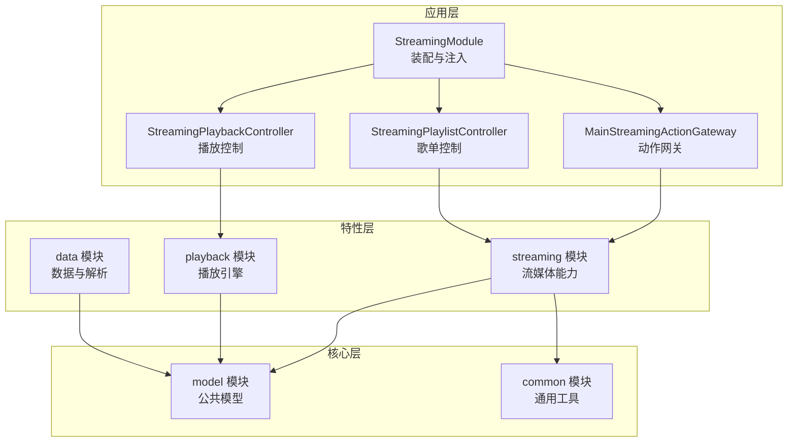
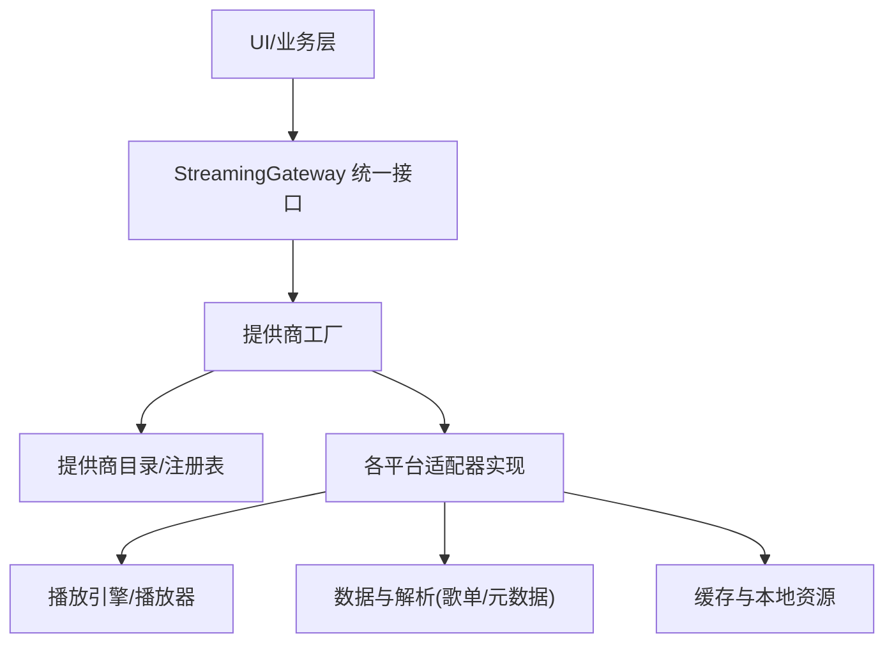
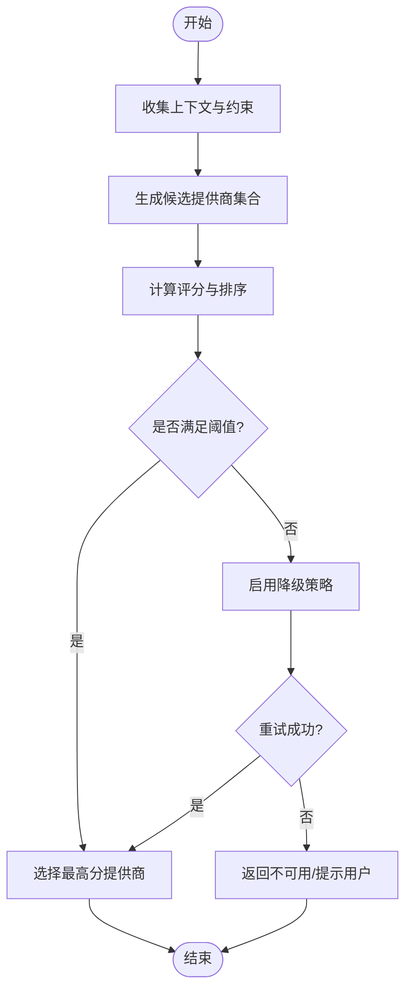
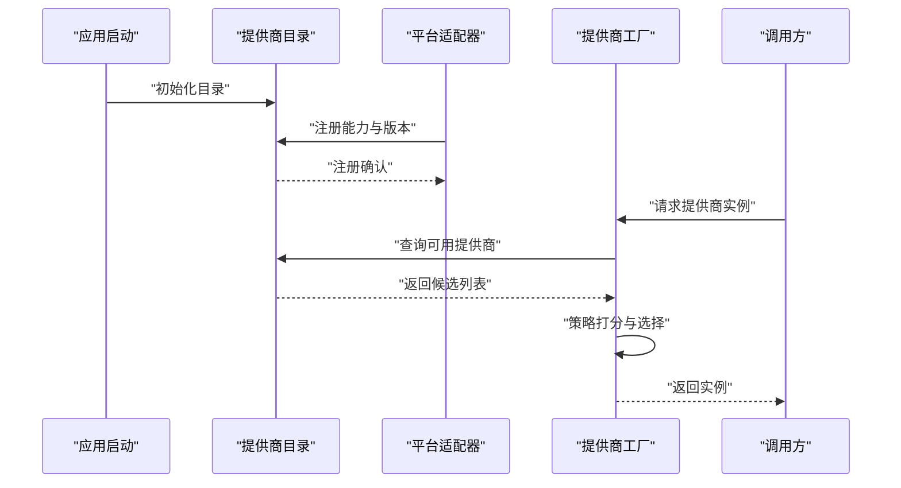
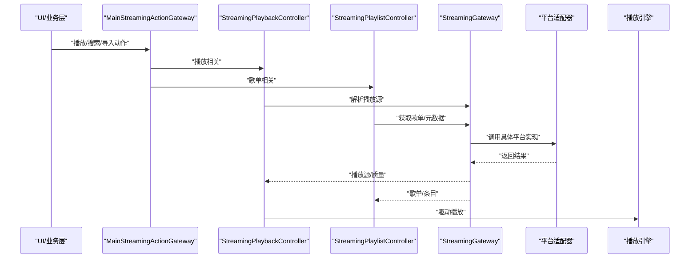
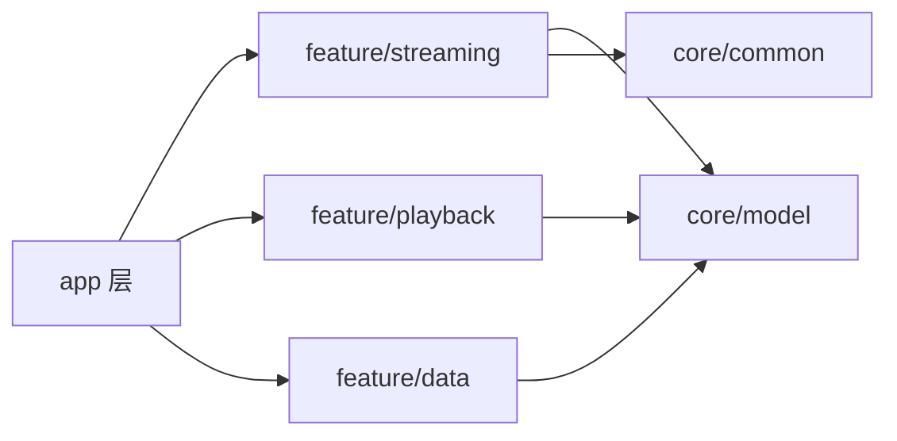

# 流媒体架构设计

<cite>
**本文引用的文件**   
- [StreamingModule.kt](file://app/src/main/java/app/yukine/StreamingModule.kt)
- [MainStreamingActionGateway.kt](file://app/src/main/java/app/yukine/MainStreamingActionGateway.kt)
- [StreamingPlaybackController.kt](file://app/src/main/java/app/yukine/StreamingPlaybackController.kt)
- [StreamingPlaylistController.kt](file://app/src/main/java/app/yukine/StreamingPlaylistController.kt)
- [CanonicalLibraryDedupInstrumentedTest.java](file://app/src/androidTest/java/app/yukine/CanonicalLibraryDedupInstrumentedTest.java)
- [M3uPlaylistParserInstrumentedTest.java](file://app/src/androidTest/java/app/yukine/data/M3uPlaylistParserInstrumentedTest.java)
- [TxPlaybackResolutionInstrumentedTest.java](file://app/src/androidTest/java/app/yukine/streaming/TxPlaybackResolutionInstrumentedTest.java)
- [ARCHITECTURE.md](file://docs/ARCHITECTURE.md)
</cite>

## 目录
1. [简介](#简介)
2. [项目结构](#项目结构)
3. [核心组件](#核心组件)
4. [架构总览](#架构总览)
5. [详细组件分析](#详细组件分析)
6. [依赖关系分析](#依赖关系分析)
7. [性能考量](#性能考量)
8. [故障排查指南](#故障排查指南)
9. [结论](#结论)
10. [附录：新平台接入规范](#附录新平台接入规范)

## 简介
本文件面向多平台流媒体提供商的统一抽象层与适配器体系，围绕 StreamingGateway 接口、工厂模式实现、提供商目录管理、播放源策略选择、注册与发现流程、插件化扩展点等主题展开。文档提供架构图、组件交互关系与数据流向，并给出新平台接入的架构指导与技术规范，帮助开发者快速理解现有设计与扩展方式。

## 项目结构
本项目采用模块化分层组织，应用层（app）负责编排与集成，feature 模块（如 streaming、playback、data）承载领域能力，core 模块提供通用模型与工具。与流媒体统一抽象相关的入口与装配集中在 app 层的 DI 模块与控制器中，测试覆盖位于 androidTest 与 test 目录。

图表来源
- [StreamingModule.kt](file://app/src/main/java/app/yukine/StreamingModule.kt)
- [MainStreamingActionGateway.kt](file://app/src/main/java/app/yukine/MainStreamingActionGateway.kt)
- [StreamingPlaybackController.kt](file://app/src/main/java/app/yukine/StreamingPlaybackController.kt)
- [StreamingPlaylistController.kt](file://app/src/main/java/app/yukine/StreamingPlaylistController.kt)

章节来源
- [STREAMING_MODULE_PATH](file://app/src/main/java/app/yukine/StreamingModule.kt)
- [MAIN_STREAMING_ACTION_GATEWAY_PATH](file://app/src/main/java/app/yukine/MainStreamingActionGateway.kt)
- [STREAMING_PLAYBACK_CONTROLLER_PATH](file://app/src/main/java/app/yukine/StreamingPlaybackController.kt)
- [STREAMING_PLAYLIST_CONTROLLER_PATH](file://app/src/main/java/app/yukine/StreamingPlaylistController.kt)

## 核心组件
本节聚焦于统一抽象层的关键构件与职责边界：
- StreamingGateway 接口：定义跨平台的流媒体访问契约，屏蔽各提供商差异，向上游提供一致的能力集（认证、搜索、歌单、播放源解析等）。
- 工厂模式与提供商目录：通过工厂根据上下文或配置动态创建具体提供商实例；目录集中维护已注册的提供商元信息与版本兼容性。
- 播放源策略选择：基于用户偏好、网络条件、版权约束与质量策略，从候选提供商中选择最优播放源。
- 适配器与插件化：将具体平台实现以适配器形式接入，通过扩展点（SPI）在启动期完成注册与发现。

章节来源
- [STREAMING_MODULE_PATH](file://app/src/main/java/app/yukine/StreamingModule.kt)
- [MAIN_STREAMING_ACTION_GATEWAY_PATH](file://app/src/main/java/app/yukine/MainStreamingActionGateway.kt)
- [STREAMING_PLAYBACK_CONTROLLER_PATH](file://app/src/main/java/app/yukine/StreamingPlaybackController.kt)
- [STREAMING_PLAYLIST_CONTROLLER_PATH](file://app/src/main/java/app/yukine/StreamingPlaylistController.kt)

## 架构总览
下图展示统一抽象层与上层调用方、下层播放引擎之间的交互关系。

图表来源
- [STREAMING_MODULE_PATH](file://app/src/main/java/app/yukine/StreamingModule.kt)
- [MAIN_STREAMING_ACTION_GATEWAY_PATH](file://app/src/main/java/app/yukine/MainStreamingActionGateway.kt)
- [STREAMING_PLAYBACK_CONTROLLER_PATH](file://app/src/main/java/app/yukine/StreamingPlaybackController.kt)
- [STREAMING_PLAYLIST_CONTROLLER_PATH](file://app/src/main/java/app/yukine/StreamingPlaylistController.kt)

## 详细组件分析

### StreamingGateway 接口与统一抽象
- 目标：为所有外部流媒体提供商提供一致的访问契约，隐藏协议、鉴权、搜索、歌单、播放源解析等差异。
- 关键能力域：
  - 认证与会话管理：登录、刷新、登出、会话保活。
  - 搜索与推荐：关键词检索、个性化推荐、热门列表。
  - 歌单与收藏：导入、同步、增删改查。
  - 播放源解析：根据曲目信息获取可播放地址与质量选项。
  - 事件与状态：播放进度、错误码、重试策略回调。
- 设计原则：
  - 高内聚低耦合：接口仅暴露稳定契约，内部实现细节对调用方透明。
  - 可扩展性：新增平台只需实现接口并通过工厂注册。
  - 可测试性：接口便于 Mock，支撑单元测试与集成测试。

章节来源
- [STREAMING_MODULE_PATH](file://app/src/main/java/app/yukine/StreamingModule.kt)
- [MAIN_STREAMING_ACTION_GATEWAY_PATH](file://app/src/main/java/app/yukine/MainStreamingActionGateway.kt)

### 工厂模式与提供商目录管理
- 工厂职责：
  - 根据上下文（设备环境、网络、用户授权状态）与配置（优先级、白名单）选择并创建合适的提供商实例。
  - 封装实例生命周期与资源释放。
- 目录管理：
  - 集中维护提供商清单（名称、版本、能力标签、兼容矩阵）。
  - 支持热插拔式注册与发现，避免硬编码。
- 典型流程：
  - 启动期扫描与注册：加载已实现的适配器，写入目录。
  - 运行时选择：结合策略与目录元信息，返回最佳适配实例。

章节来源
- [STREAMING_MODULE_PATH](file://app/src/main/java/app/yukine/StreamingModule.kt)

### 播放源策略选择机制
- 输入：曲目标识、用户偏好、网络质量、版权限制、历史成功率。
- 决策维度：
  - 可用性：是否已登录、是否具备权限。
  - 质量：音质、延迟、稳定性评分。
  - 成本：流量消耗、计费策略。
  - 体验：首开时延、缓冲次数、失败率。
- 输出：选定提供商及播放源参数（URL、加密头、分辨率/码率等）。
- 回退策略：主选失败时按降级顺序尝试备选提供商。

图表来源
- [STREAMING_PLAYBACK_CONTROLLER_PATH](file://app/src/main/java/app/yukine/StreamingPlaybackController.kt)
- [MAIN_STREAMING_ACTION_GATEWAY_PATH](file://app/src/main/java/app/yukine/MainStreamingActionGateway.kt)

### 提供商注册与发现流程
- 注册阶段：
  - 适配器在初始化时向目录登记自身能力与版本。
  - 目录校验能力矩阵与依赖，记录可用性与健康状态。
- 发现阶段：
  - 工厂查询目录，过滤不满足条件的提供商。
  - 结合策略打分，返回实例。
- 生命周期：
  - 按需创建与复用，异常时自动剔除并告警。

图表来源
- [STREAMING_MODULE_PATH](file://app/src/main/java/app/yukine/StreamingModule.kt)
- [MAIN_STREAMING_ACTION_GATEWAY_PATH](file://app/src/main/java/app/yukine/MainStreamingActionGateway.kt)

### 适配器与插件化架构
- 适配器设计原则：
  - 单一职责：每个适配器专注一个平台，遵循统一契约。
  - 无侵入：通过 SPI 或约定路径自动发现，无需修改核心逻辑。
  - 可观测：上报关键指标与错误码，便于监控与排障。
- 扩展点：
  - 认证扩展：自定义登录流程与令牌刷新。
  - 解析扩展：自定义播放源解析规则与质量映射。
  - 事件扩展：自定义播放事件与状态变更通知。
- 测试与验证：
  - 使用 Instrumented Test 验证歌单解析与去重逻辑。
  - 针对播放质量与分辨率进行专项测试。

章节来源
- [CanonicalLibraryDedupInstrumentedTest.java](file://app/src/androidTest/java/app/yukine/CanonicalLibraryDedupInstrumentedTest.java)
- [M3uPlaylistParserInstrumentedTest.java](file://app/src/androidTest/java/app/yukine/data/M3uPlaylistParserInstrumentedTest.java)
- [TxPlaybackResolutionInstrumentedTest.java](file://app/src/androidTest/java/app/yukine/streaming/TxPlaybackResolutionInstrumentedTest.java)

### 组件交互与数据流向
- 调用链：
  - UI/业务层通过 MainStreamingActionGateway 发起动作。
  - Gateway 委托 StreamingPlaybackController 与 StreamingPlaylistController 执行。
  - 控制器通过 StreamingGateway 与具体适配器交互，最终驱动播放引擎。
- 数据流：
  - 搜索/歌单数据经适配器解析后进入 data 层，供 UI 展示。
  - 播放源由适配器解析并传入 playback 层，完成拉流与解码。

图表来源
- [MAIN_STREAMING_ACTION_GATEWAY_PATH](file://app/src/main/java/app/yukine/MainStreamingActionGateway.kt)
- [STREAMING_PLAYBACK_CONTROLLER_PATH](file://app/src/main/java/app/yukine/StreamingPlaybackController.kt)
- [STREAMING_PLAYLIST_CONTROLLER_PATH](file://app/src/main/java/app/yukine/StreamingPlaylistController.kt)
- [STREAMING_MODULE_PATH](file://app/src/main/java/app/yukine/StreamingModule.kt)

## 依赖关系分析
- 模块依赖：
  - app 层依赖 feature 层（streaming、playback、data），feature 层依赖 core（model、common）。
  - 统一抽象层（StreamingGateway）位于 app 层，作为对外契约，向下聚合各适配器实现。
- 耦合与内聚：
  - 通过工厂与目录解耦调用方与具体实现，提升内聚性。
  - 控制器专注于编排与策略，避免直接持有平台细节。
- 潜在风险：
  - 目录与工厂需保证线程安全与幂等注册。
  - 策略选择应避免热点路径上的昂贵计算。

图表来源
- [STREAMING_MODULE_PATH](file://app/src/main/java/app/yukine/StreamingModule.kt)
- [MAIN_STREAMING_ACTION_GATEWAY_PATH](file://app/src/main/java/app/yukine/MainStreamingActionGateway.kt)
- [STREAMING_PLAYBACK_CONTROLLER_PATH](file://app/src/main/java/app/yukine/StreamingPlaybackController.kt)
- [STREAMING_PLAYLIST_CONTROLLER_PATH](file://app/src/main/java/app/yukine/StreamingPlaylistController.kt)

章节来源
- [STREAMING_MODULE_PATH](file://app/src/main/java/app/yukine/StreamingModule.kt)
- [MAIN_STREAMING_ACTION_GATEWAY_PATH](file://app/src/main/java/app/yukine/MainStreamingActionGateway.kt)
- [STREAMING_PLAYBACK_CONTROLLER_PATH](file://app/src/main/java/app/yukine/StreamingPlaybackController.kt)
- [STREAMING_PLAYLIST_CONTROLLER_PATH](file://app/src/main/java/app/yukine/StreamingPlaylistController.kt)

## 性能考量
- 懒加载与缓存：
  - 适配器实例按需创建，搜索结果与歌单数据引入本地缓存。
- 并发与背压：
  - 搜索与列表加载采用分页与背压，避免一次性拉取过多数据。
- 策略开销：
  - 提供商选择策略应轻量，必要时异步预评估与缓存评分。
- 网络优化：
  - 连接复用、超时与重试策略调优，减少首开时延与卡顿。

[本节为通用指导，不涉及具体文件分析]

## 故障排查指南
- 常见问题定位：
  - 认证失败：检查会话状态与刷新流程，核对提供商健康状态。
  - 播放失败：查看播放源解析日志与质量映射，确认网络与权限。
  - 歌单解析异常：参考 M3U 解析测试用例，验证格式与字段完整性。
  - 去重问题：参考库去重测试，核对曲目标识与归一化规则。
- 建议手段：
  - 增加关键路径埋点与错误码分类。
  - 提供最小复现用例与断点位置指引。

章节来源
- [M3uPlaylistParserInstrumentedTest.java](file://app/src/androidTest/java/app/yukine/data/M3uPlaylistParserInstrumentedTest.java)
- [CanonicalLibraryDedupInstrumentedTest.java](file://app/src/androidTest/java/app/yukine/CanonicalLibraryDedupInstrumentedTest.java)
- [TxPlaybackResolutionInstrumentedTest.java](file://app/src/androidTest/java/app/yukine/streaming/TxPlaybackResolutionInstrumentedTest.java)

## 结论
通过统一的 StreamingGateway 抽象、工厂与目录管理、策略化播放源选择以及插件化的适配器体系，系统实现了多平台流媒体的松耦合集成与灵活扩展。配合完善的测试与可观测性，可在保障用户体验的同时，快速接入新平台并持续演进。

[本节为总结性内容，不涉及具体文件分析]

## 附录：新平台接入规范
- 步骤概览：
  - 实现 StreamingGateway 对应能力（认证、搜索、歌单、播放源解析）。
  - 在启动期向提供商目录注册适配器元信息与能力标签。
  - 在工厂中声明该适配器的优先级与适用场景。
  - 编写单元测试与 Instrumented Test，覆盖解析、去重与播放质量。
- 技术规范：
  - 接口契约：严格遵循统一接口，避免破坏性变更。
  - 错误处理：定义清晰的错误码与重试策略。
  - 可观测性：上报关键指标（时延、失败率、质量分布）。
  - 安全性：敏感信息存储与传输符合安全基线。
- 验收标准：
  - 功能完备：认证、搜索、歌单、播放源解析均通过用例。
  - 性能达标：首开时延、缓冲次数、失败率满足阈值。
  - 兼容性：与目录能力矩阵一致，支持降级与回退。

章节来源
- [STREAMING_MODULE_PATH](file://app/src/main/java/app/yukine/StreamingModule.kt)
- [MAIN_STREAMING_ACTION_GATEWAY_PATH](file://app/src/main/java/app/yukine/MainStreamingActionGateway.kt)
- [STREAMING_PLAYBACK_CONTROLLER_PATH](file://app/src/main/java/app/yukine/StreamingPlaybackController.kt)
- [STREAMING_PLAYLIST_CONTROLLER_PATH](file://app/src/main/java/app/yukine/StreamingPlaylistController.kt)
- [ARCHITECTURE.md](file://docs/ARCHITECTURE.md)