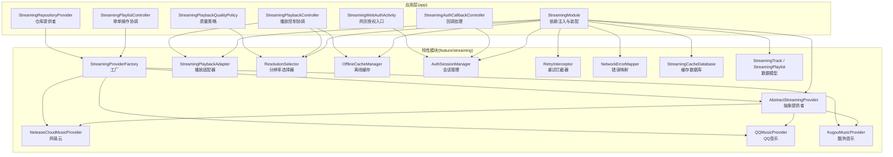
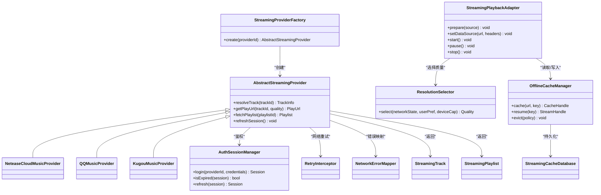
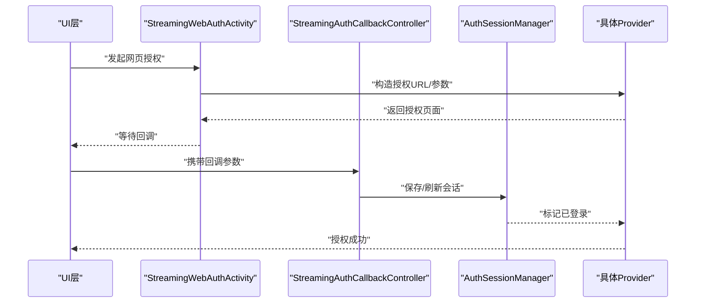
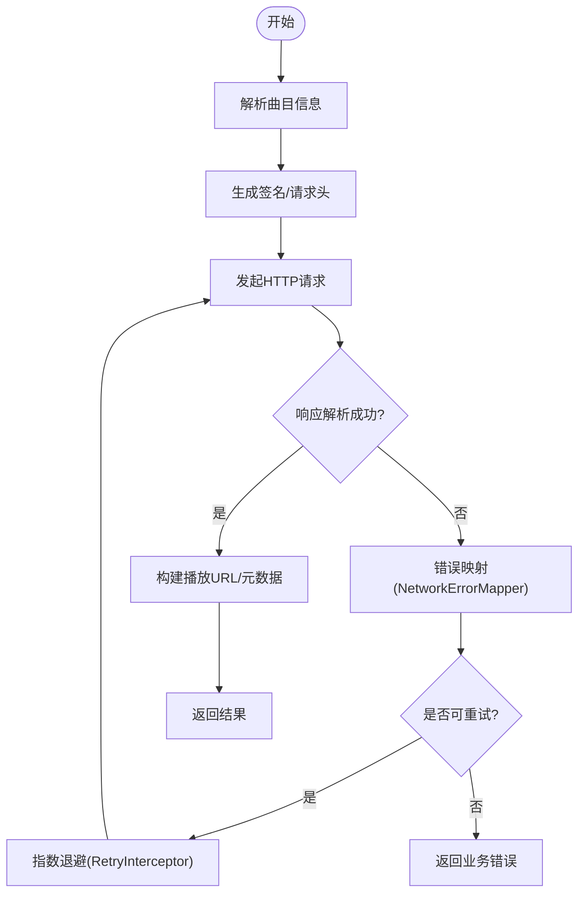
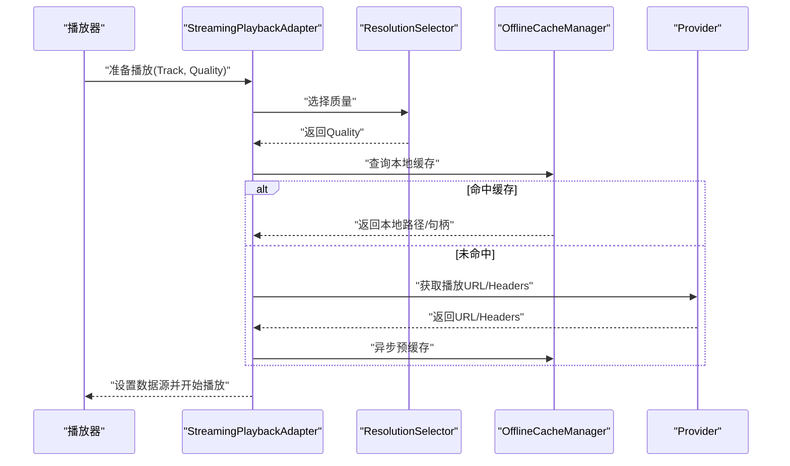
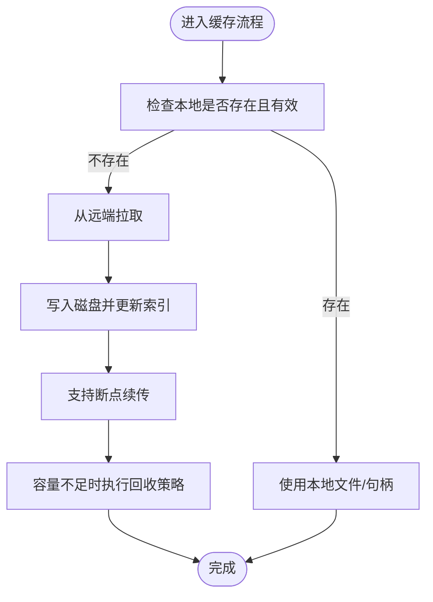
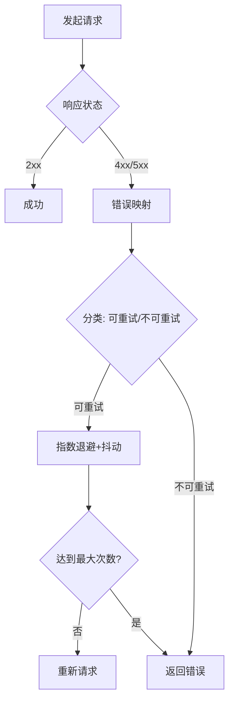
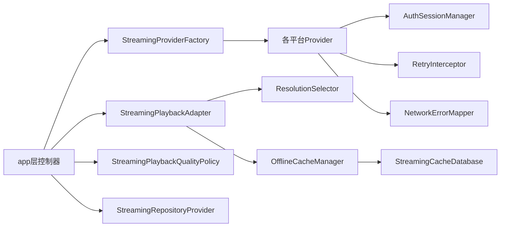

# 流媒体集成

<cite>
**本文引用的文件**   
- [app/src/main/java/app/yukine/StreamingModule.kt](file://app/src/main/java/app/yukine/StreamingModule.kt)
- [app/src/main/java/app/yukine/StreamingPlaybackController.kt](file://app/src/main/java/app/yukine/StreamingPlaybackController.kt)
- [app/src/main/java/app/yukine/StreamingPlaylistController.kt](file://app/src/main/java/app/yukine/StreamingPlaylistController.kt)
- [app/src/main/java/app/yukine/StreamingAuthCallbackController.kt](file://app/src/main/java/app/yukine/StreamingAuthCallbackController.kt)
- [app/src/main/java/app/yukine/StreamingWebAuthActivity.kt](file://app/src/main/java/app/yukine/StreamingWebAuthActivity.kt)
- [app/src/main/java/app/yukine/StreamingPlaybackQualityPolicy.kt](file://app/src/main/java/app/yukine/StreamingPlaybackQualityPolicy.kt)
- [app/src/main/java/app/yukine/StreamingRepositoryProvider.kt](file://app/src/main/java/app/yukine/StreamingRepositoryProvider.kt)
- [feature/streaming/src/main/java/app/yukine/streaming/cache/StreamingCacheDatabase.kt](file://feature/streaming/src/main/java/app/yukine/streaming/cache/StreamingCacheDatabase.kt)
- [feature/streaming/src/main/java/app/yukine/streaming/providers/NeteaseCloudMusicProvider.kt](file://feature/streaming/src/main/java/app/yukine/streaming/providers/NeteaseCloudMusicProvider.kt)
- [feature/streaming/src/main/java/app/yukine/streaming/providers/QQMusicProvider.kt](file://feature/streaming/src/main/java/app/yukine/streaming/providers/QQMusicProvider.kt)
- [feature/streaming/src/main/java/app/yukine/streaming/providers/KugouMusicProvider.kt](file://feature/streaming/src/main/java/app/yukine/streaming/providers/KugouMusicProvider.kt)
- [feature/streaming/src/main/java/app/yukine/streaming/providers/AbstractStreamingProvider.kt](file://feature/streaming/src/main/java/app/yukine/streaming/providers/AbstractStreamingProvider.kt)
- [feature/streaming/src/main/java/app/yukine/streaming/providers/StreamingProviderFactory.kt](file://feature/streaming/src/main/java/app/yukine/streaming/providers/StreamingProviderFactory.kt)
- [feature/streaming/src/main/java/app/yukine/streaming/network/RetryInterceptor.kt](file://feature/streaming/src/main/java/app/yukine/streaming/network/RetryInterceptor.kt)
- [feature/streaming/src/main/java/app/yukine/streaming/network/NetworkErrorMapper.kt](file://feature/streaming/src/main/java/app/yukine/streaming/network/NetworkErrorMapper.kt)
- [feature/streaming/src/main/java/app/yukine/streaming/playback/StreamingPlaybackAdapter.kt](file://feature/streaming/src/main/java/app/yukine/streaming/playback/StreamingPlaybackAdapter.kt)
- [feature/streaming/src/main/java/app/yukine/streaming/playback/ResolutionSelector.kt](file://feature/streaming/src/main/java/app/yukine/streaming/playback/ResolutionSelector.kt)
- [feature/streaming/src/main/java/app/yukine/streaming/cache/OfflineCacheManager.kt](file://feature/streaming/src/main/java/app/yukine/streaming/cache/OfflineCacheManager.kt)
- [feature/streaming/src/main/java/app/yukine/streaming/auth/AuthSessionManager.kt](file://feature/streaming/src/main/java/app/yukine/streaming/auth/AuthSessionManager.kt)
- [feature/streaming/src/main/java/app/yukine/streaming/model/StreamingTrack.kt](file://feature/streaming/src/main/java/app/yukine/streaming/model/StreamingTrack.kt)
- [feature/streaming/src/main/java/app/yukine/streaming/model/StreamingPlaylist.kt](file://feature/streaming/src/main/java/app/yukine/streaming/model/StreamingPlaylist.kt)
</cite>

## 目录
1. [简介](#简介)
2. [项目结构](#项目结构)
3. [核心组件](#核心组件)
4. [架构总览](#架构总览)
5. [详细组件分析](#详细组件分析)
6. [依赖关系分析](#依赖关系分析)
7. [性能考虑](#性能考虑)
8. [故障排查指南](#故障排查指南)
9. [结论](#结论)
10. [附录：新平台接入指南](#附录新平台接入指南)

## 简介
本文件面向 Echo Android 的“流媒体集成”子系统，系统性说明多平台流媒体提供商的统一接入架构、认证授权流程、API 适配层设计、播放适配器与质量选择策略、离线缓存机制、错误处理与网络重试策略，并提供调试方法与性能优化建议。文档同时覆盖已支持的网易云音乐、QQ音乐、酷狗音乐等平台的实现要点，并给出新增平台的接入步骤。

## 项目结构
Echo 的流媒体能力由应用层（app）与特性模块（feature/streaming）共同组成：
- app 层负责 UI 交互、会话维护、任务调度、设置与入口编排；
- feature/streaming 提供统一的 Provider 抽象、网络与缓存、播放适配与质量选择、模型定义等。

图表来源
- [app/src/main/java/app/yukine/StreamingModule.kt](file://app/src/main/java/app/yukine/StreamingModule.kt)
- [app/src/main/java/app/yukine/StreamingPlaybackController.kt](file://app/src/main/java/app/yukine/StreamingPlaybackController.kt)
- [app/src/main/java/app/yukine/StreamingPlaylistController.kt](file://app/src/main/java/app/yukine/StreamingPlaylistController.kt)
- [app/src/main/java/app/yukine/StreamingAuthCallbackController.kt](file://app/src/main/java/app/yukine/StreamingAuthCallbackController.kt)
- [app/src/main/java/app/yukine/StreamingWebAuthActivity.kt](file://app/src/main/java/app/yukine/StreamingWebAuthActivity.kt)
- [app/src/main/java/app/yukine/StreamingPlaybackQualityPolicy.kt](file://app/src/main/java/app/yukine/StreamingPlaybackQualityPolicy.kt)
- [app/src/main/java/app/yukine/StreamingRepositoryProvider.kt](file://app/src/main/java/app/yukine/StreamingRepositoryProvider.kt)
- [feature/streaming/src/main/java/app/yukine/streaming/providers/AbstractStreamingProvider.kt](file://feature/streaming/src/main/java/app/yukine/streaming/providers/AbstractStreamingProvider.kt)
- [feature/streaming/src/main/java/app/yukine/streaming/providers/StreamingProviderFactory.kt](file://feature/streaming/src/main/java/app/yukine/streaming/providers/StreamingProviderFactory.kt)
- [feature/streaming/src/main/java/app/yukine/streaming/playback/StreamingPlaybackAdapter.kt](file://feature/streaming/src/main/java/app/yukine/streaming/playback/StreamingPlaybackAdapter.kt)
- [feature/streaming/src/main/java/app/yukine/streaming/playback/ResolutionSelector.kt](file://feature/streaming/src/main/java/app/yukine/streaming/playback/ResolutionSelector.kt)
- [feature/streaming/src/main/java/app/yukine/streaming/cache/OfflineCacheManager.kt](file://feature/streaming/src/main/java/app/yukine/streaming/cache/OfflineCacheManager.kt)
- [feature/streaming/src/main/java/app/yukine/streaming/auth/AuthSessionManager.kt](file://feature/streaming/src/main/java/app/yukine/streaming/auth/AuthSessionManager.kt)
- [feature/streaming/src/main/java/app/yukine/streaming/network/RetryInterceptor.kt](file://feature/streaming/src/main/java/app/yukine/streaming/network/RetryInterceptor.kt)
- [feature/streaming/src/main/java/app/yukine/streaming/network/NetworkErrorMapper.kt](file://feature/streaming/src/main/java/app/yukine/streaming/network/NetworkErrorMapper.kt)
- [feature/streaming/src/main/java/app/yukine/streaming/cache/StreamingCacheDatabase.kt](file://feature/streaming/src/main/java/app/yukine/streaming/cache/StreamingCacheDatabase.kt)
- [feature/streaming/src/main/java/app/yukine/streaming/model/StreamingTrack.kt](file://feature/streaming/src/main/java/app/yukine/streaming/model/StreamingTrack.kt)
- [feature/streaming/src/main/java/app/yukine/streaming/model/StreamingPlaylist.kt](file://feature/streaming/src/main/java/app/yukine/streaming/model/StreamingPlaylist.kt)

章节来源
- [app/src/main/java/app/yukine/StreamingModule.kt](file://app/src/main/java/app/yukine/StreamingModule.kt)
- [feature/streaming/src/main/java/app/yukine/streaming/providers/AbstractStreamingProvider.kt](file://feature/streaming/src/main/java/app/yukine/streaming/providers/AbstractStreamingProvider.kt)

## 核心组件
- 抽象提供者与具体实现
  - AbstractStreamingProvider：统一封装鉴权、请求头、签名、UA、代理等通用逻辑，暴露解析歌曲、获取播放链接、拉取歌单等标准接口。
  - NeteaseCloudMusicProvider、QQMusicProvider、KugouMusicProvider：分别实现对应平台的协议细节与差异点。
- 工厂与仓库
  - StreamingProviderFactory：按平台标识创建对应 Provider 实例。
  - StreamingRepositoryProvider：为上层提供统一的仓库访问入口，屏蔽底层 Provider 差异。
- 播放适配与质量选择
  - StreamingPlaybackAdapter：将上游 URL/元数据适配到播放器可消费的数据源，处理加密、分片、Cookie 注入等。
  - ResolutionSelector：根据网络状态、用户偏好、设备能力选择最佳清晰度/码率。
- 认证与会话
  - AuthSessionManager：集中管理各平台登录态、Token 刷新、过期续期。
  - StreamingWebAuthActivity + StreamingAuthCallbackController：完成 OAuth/网页登录回调与状态同步。
- 网络与错误
  - RetryInterceptor：对失败请求进行指数退避重试，支持幂等判断与最大次数限制。
  - NetworkErrorMapper：将 HTTP/网络异常映射为业务错误码，便于 UI 提示与重试决策。
- 缓存与离线
  - OfflineCacheManager：基于磁盘与内存的二级缓存，支持断点续传、去重、容量回收。
  - StreamingCacheDatabase：持久化缓存索引、下载进度、元数据。
- 数据模型
  - StreamingTrack、StreamingPlaylist：跨平台统一的数据表示，用于 UI 展示与队列管理。

章节来源
- [feature/streaming/src/main/java/app/yukine/streaming/providers/AbstractStreamingProvider.kt](file://feature/streaming/src/main/java/app/yukine/streaming/providers/AbstractStreamingProvider.kt)
- [feature/streaming/src/main/java/app/yukine/streaming/providers/NeteaseCloudMusicProvider.kt](file://feature/streaming/src/main/java/app/yukine/streaming/providers/NeteaseCloudMusicProvider.kt)
- [feature/streaming/src/main/java/app/yukine/streaming/providers/QQMusicProvider.kt](file://feature/streaming/src/main/java/app/yukine/streaming/providers/QQMusicProvider.kt)
- [feature/streaming/src/main/java/app/yukine/streaming/providers/KugouMusicProvider.kt](file://feature/streaming/src/main/java/app/yukine/streaming/providers/KugouMusicProvider.kt)
- [feature/streaming/src/main/java/app/yukine/streaming/providers/StreamingProviderFactory.kt](file://feature/streaming/src/main/java/app/yukine/streaming/providers/StreamingProviderFactory.kt)
- [feature/streaming/src/main/java/app/yukine/streaming/playback/StreamingPlaybackAdapter.kt](file://feature/streaming/src/main/java/app/yukine/streaming/playback/StreamingPlaybackAdapter.kt)
- [feature/streaming/src/main/java/app/yukine/streaming/playback/ResolutionSelector.kt](file://feature/streaming/src/main/java/app/yukine/streaming/playback/ResolutionSelector.kt)
- [feature/streaming/src/main/java/app/yukine/streaming/auth/AuthSessionManager.kt](file://feature/streaming/src/main/java/app/yukine/streaming/auth/AuthSessionManager.kt)
- [feature/streaming/src/main/java/app/yukine/streaming/network/RetryInterceptor.kt](file://feature/streaming/src/main/java/app/yukine/streaming/network/RetryInterceptor.kt)
- [feature/streaming/src/main/java/app/yukine/streaming/network/NetworkErrorMapper.kt](file://feature/streaming/src/main/java/app/yukine/streaming/network/NetworkErrorMapper.kt)
- [feature/streaming/src/main/java/app/yukine/streaming/cache/OfflineCacheManager.kt](file://feature/streaming/src/main/java/app/yukine/streaming/cache/OfflineCacheManager.kt)
- [feature/streaming/src/main/java/app/yukine/streaming/cache/StreamingCacheDatabase.kt](file://feature/streaming/src/main/java/app/yukine/streaming/cache/StreamingCacheDatabase.kt)
- [feature/streaming/src/main/java/app/yukine/streaming/model/StreamingTrack.kt](file://feature/streaming/src/main/java/app/yukine/streaming/model/StreamingTrack.kt)
- [feature/streaming/src/main/java/app/yukine/streaming/model/StreamingPlaylist.kt](file://feature/streaming/src/main/java/app/yukine/streaming/model/StreamingPlaylist.kt)

## 架构总览
整体采用“统一抽象 + 多实现 + 工厂分发”的适配层模式，结合播放适配与质量选择，形成跨平台一致的播放体验。

图表来源
- [feature/streaming/src/main/java/app/yukine/streaming/providers/AbstractStreamingProvider.kt](file://feature/streaming/src/main/java/app/yukine/streaming/providers/AbstractStreamingProvider.kt)
- [feature/streaming/src/main/java/app/yukine/streaming/providers/NeteaseCloudMusicProvider.kt](file://feature/streaming/src/main/java/app/yukine/streaming/providers/NeteaseCloudMusicProvider.kt)
- [feature/streaming/src/main/java/app/yukine/streaming/providers/QQMusicProvider.kt](file://feature/streaming/src/main/java/app/yukine/streaming/providers/QQMusicProvider.kt)
- [feature/streaming/src/main/java/app/yukine/streaming/providers/KugouMusicProvider.kt](file://feature/streaming/src/main/java/app/yukine/streaming/providers/KugouMusicProvider.kt)
- [feature/streaming/src/main/java/app/yukine/streaming/providers/StreamingProviderFactory.kt](file://feature/streaming/src/main/java/app/yukine/streaming/providers/StreamingProviderFactory.kt)
- [feature/streaming/src/main/java/app/yukine/streaming/playback/StreamingPlaybackAdapter.kt](file://feature/streaming/src/main/java/app/yukine/streaming/playback/StreamingPlaybackAdapter.kt)
- [feature/streaming/src/main/java/app/yukine/streaming/playback/ResolutionSelector.kt](file://feature/streaming/src/main/java/app/yukine/streaming/playback/ResolutionSelector.kt)
- [feature/streaming/src/main/java/app/yukine/streaming/cache/OfflineCacheManager.kt](file://feature/streaming/src/main/java/app/yukine/streaming/cache/OfflineCacheManager.kt)
- [feature/streaming/src/main/java/app/yukine/streaming/auth/AuthSessionManager.kt](file://feature/streaming/src/main/java/app/yukine/streaming/auth/AuthSessionManager.kt)
- [feature/streaming/src/main/java/app/yukine/streaming/network/RetryInterceptor.kt](file://feature/streaming/src/main/java/app/yukine/streaming/network/RetryInterceptor.kt)
- [feature/streaming/src/main/java/app/yukine/streaming/network/NetworkErrorMapper.kt](file://feature/streaming/src/main/java/app/yukine/streaming/network/NetworkErrorMapper.kt)
- [feature/streaming/src/main/java/app/yukine/streaming/cache/StreamingCacheDatabase.kt](file://feature/streaming/src/main/java/app/yukine/streaming/cache/StreamingCacheDatabase.kt)
- [feature/streaming/src/main/java/app/yukine/streaming/model/StreamingTrack.kt](file://feature/streaming/src/main/java/app/yukine/streaming/model/StreamingTrack.kt)
- [feature/streaming/src/main/java/app/yukine/streaming/model/StreamingPlaylist.kt](file://feature/streaming/src/main/java/app/yukine/streaming/model/StreamingPlaylist.kt)

## 详细组件分析

### 认证授权流程
- 入口与回调
  - 通过 StreamingWebAuthActivity 拉起浏览器完成 OAuth/网页登录；
  - 回调由 StreamingAuthCallbackController 接收并转发至 AuthSessionManager 更新会话。
- 会话管理
  - AuthSessionManager 负责 Token 存储、过期检测、自动刷新与失效清理。
- 典型调用序列

图表来源
- [app/src/main/java/app/yukine/StreamingWebAuthActivity.kt](file://app/src/main/java/app/yukine/StreamingWebAuthActivity.kt)
- [app/src/main/java/app/yukine/StreamingAuthCallbackController.kt](file://app/src/main/java/app/yukine/StreamingAuthCallbackController.kt)
- [feature/streaming/src/main/java/app/yukine/streaming/auth/AuthSessionManager.kt](file://feature/streaming/src/main/java/app/yukine/streaming/auth/AuthSessionManager.kt)

章节来源
- [app/src/main/java/app/yukine/StreamingWebAuthActivity.kt](file://app/src/main/java/app/yukine/StreamingWebAuthActivity.kt)
- [app/src/main/java/app/yukine/StreamingAuthCallbackController.kt](file://app/src/main/java/app/yukine/StreamingAuthCallbackController.kt)
- [feature/streaming/src/main/java/app/yukine/streaming/auth/AuthSessionManager.kt](file://feature/streaming/src/main/java/app/yukine/streaming/auth/AuthSessionManager.kt)

### API 适配层设计
- 抽象层
  - AbstractStreamingProvider 定义统一接口：解析曲目、获取播放链接、拉取歌单、刷新会话等。
- 具体实现
  - NeteaseCloudMusicProvider、QQMusicProvider、KugouMusicProvider 分别实现各自平台的签名、反爬、加密与播放地址解析。
- 工厂与仓库
  - StreamingProviderFactory 按 providerId 创建实例；
  - StreamingRepositoryProvider 向上层提供统一仓库访问，屏蔽 Provider 差异。

图表来源
- [feature/streaming/src/main/java/app/yukine/streaming/providers/AbstractStreamingProvider.kt](file://feature/streaming/src/main/java/app/yukine/streaming/providers/AbstractStreamingProvider.kt)
- [feature/streaming/src/main/java/app/yukine/streaming/providers/NeteaseCloudMusicProvider.kt](file://feature/streaming/src/main/java/app/yukine/streaming/providers/NeteaseCloudMusicProvider.kt)
- [feature/streaming/src/main/java/app/yukine/streaming/providers/QQMusicProvider.kt](file://feature/streaming/src/main/java/app/yukine/streaming/providers/QQMusicProvider.kt)
- [feature/streaming/src/main/java/app/yukine/streaming/providers/KugouMusicProvider.kt](file://feature/streaming/src/main/java/app/yukine/streaming/providers/KugouMusicProvider.kt)
- [feature/streaming/src/main/java/app/yukine/streaming/providers/StreamingProviderFactory.kt](file://feature/streaming/src/main/java/app/yukine/streaming/providers/StreamingProviderFactory.kt)
- [feature/streaming/src/main/java/app/yukine/streaming/network/RetryInterceptor.kt](file://feature/streaming/src/main/java/app/yukine/streaming/network/RetryInterceptor.kt)
- [feature/streaming/src/main/java/app/yukine/streaming/network/NetworkErrorMapper.kt](file://feature/streaming/src/main/java/app/yukine/streaming/network/NetworkErrorMapper.kt)

章节来源
- [feature/streaming/src/main/java/app/yukine/streaming/providers/AbstractStreamingProvider.kt](file://feature/streaming/src/main/java/app/yukine/streaming/providers/AbstractStreamingProvider.kt)
- [feature/streaming/src/main/java/app/yukine/streaming/providers/StreamingProviderFactory.kt](file://feature/streaming/src/main/java/app/yukine/streaming/providers/StreamingProviderFactory.kt)

### 播放适配器与质量选择
- 播放适配器
  - StreamingPlaybackAdapter 负责将上游 URL/Headers/Cookie 等适配到播放器数据源，处理加密、分片、范围请求等。
- 质量选择
  - ResolutionSelector 依据网络状态、用户偏好、设备能力选择最佳清晰度/码率，并与播放适配器协作切换。

图表来源
- [feature/streaming/src/main/java/app/yukine/streaming/playback/StreamingPlaybackAdapter.kt](file://feature/streaming/src/main/java/app/yukine/streaming/playback/StreamingPlaybackAdapter.kt)
- [feature/streaming/src/main/java/app/yukine/streaming/playback/ResolutionSelector.kt](file://feature/streaming/src/main/java/app/yukine/streaming/playback/ResolutionSelector.kt)
- [feature/streaming/src/main/java/app/yukine/streaming/cache/OfflineCacheManager.kt](file://feature/streaming/src/main/java/app/yukine/streaming/cache/OfflineCacheManager.kt)

章节来源
- [feature/streaming/src/main/java/app/yukine/streaming/playback/StreamingPlaybackAdapter.kt](file://feature/streaming/src/main/java/app/yukine/streaming/playback/StreamingPlaybackAdapter.kt)
- [feature/streaming/src/main/java/app/yukine/streaming/playback/ResolutionSelector.kt](file://feature/streaming/src/main/java/app/yukine/streaming/playback/ResolutionSelector.kt)

### 离线缓存机制
- 缓存策略
  - OfflineCacheManager 提供按 Key 的缓存读写、断点续传、并发控制与容量回收；
  - StreamingCacheDatabase 持久化缓存索引、进度与元数据。
- 触发时机
  - 播放前预缓存、后台批量缓存、用户手动下载。

图表来源
- [feature/streaming/src/main/java/app/yukine/streaming/cache/OfflineCacheManager.kt](file://feature/streaming/src/main/java/app/yukine/streaming/cache/OfflineCacheManager.kt)
- [feature/streaming/src/main/java/app/yukine/streaming/cache/StreamingCacheDatabase.kt](file://feature/streaming/src/main/java/app/yukine/streaming/cache/StreamingCacheDatabase.kt)

章节来源
- [feature/streaming/src/main/java/app/yukine/streaming/cache/OfflineCacheManager.kt](file://feature/streaming/src/main/java/app/yukine/streaming/cache/OfflineCacheManager.kt)
- [feature/streaming/src/main/java/app/yukine/streaming/cache/StreamingCacheDatabase.kt](file://feature/streaming/src/main/java/app/yukine/streaming/cache/StreamingCacheDatabase.kt)

### 错误处理与网络重试
- 错误映射
  - NetworkErrorMapper 将网络异常、HTTP 状态码映射为业务错误类型，便于 UI 提示与重试决策。
- 重试策略
  - RetryInterceptor 对非幂等请求谨慎重试，支持指数退避、抖动、最大次数与超时控制。

图表来源
- [feature/streaming/src/main/java/app/yukine/streaming/network/NetworkErrorMapper.kt](file://feature/streaming/src/main/java/app/yukine/streaming/network/NetworkErrorMapper.kt)
- [feature/streaming/src/main/java/app/yukine/streaming/network/RetryInterceptor.kt](file://feature/streaming/src/main/java/app/yukine/streaming/network/RetryInterceptor.kt)

章节来源
- [feature/streaming/src/main/java/app/yukine/streaming/network/NetworkErrorMapper.kt](file://feature/streaming/src/main/java/app/yukine/streaming/network/NetworkErrorMapper.kt)
- [feature/streaming/src/main/java/app/yukine/streaming/network/RetryInterceptor.kt](file://feature/streaming/src/main/java/app/yukine/streaming/network/RetryInterceptor.kt)

### 已支持平台实现要点
- 网易云音乐
  - 重点：签名算法、Referer/UA 校验、播放地址解析、版权限制处理。
- QQ音乐
  - 重点：Cookie/Token 传递、域名白名单、分片与加密格式兼容。
- 酷狗音乐
  - 重点：动态密钥、防盗链、音质等级映射。

章节来源
- [feature/streaming/src/main/java/app/yukine/streaming/providers/NeteaseCloudMusicProvider.kt](file://feature/streaming/src/main/java/app/yukine/streaming/providers/NeteaseCloudMusicProvider.kt)
- [feature/streaming/src/main/java/app/yukine/streaming/providers/QQMusicProvider.kt](file://feature/streaming/src/main/java/app/yukine/streaming/providers/QQMusicProvider.kt)
- [feature/streaming/src/main/java/app/yukine/streaming/providers/KugouMusicProvider.kt](file://feature/streaming/src/main/java/app/yukine/streaming/providers/KugouMusicProvider.kt)

## 依赖关系分析
- 耦合与内聚
  - 抽象层与具体实现解耦良好，通过工厂与仓库进一步降低上层耦合；
  - 播放适配与质量选择职责清晰，缓存与网络层独立。
- 外部依赖
  - 网络库、缓存数据库、播放器 SDK 等通过接口或中间件隔离，便于替换与测试。

图表来源
- [app/src/main/java/app/yukine/StreamingModule.kt](file://app/src/main/java/app/yukine/StreamingModule.kt)
- [app/src/main/java/app/yukine/StreamingPlaybackController.kt](file://app/src/main/java/app/yukine/StreamingPlaybackController.kt)
- [app/src/main/java/app/yukine/StreamingPlaylistController.kt](file://app/src/main/java/app/yukine/StreamingPlaylistController.kt)
- [app/src/main/java/app/yukine/StreamingPlaybackQualityPolicy.kt](file://app/src/main/java/app/yukine/StreamingPlaybackQualityPolicy.kt)
- [app/src/main/java/app/yukine/StreamingRepositoryProvider.kt](file://app/src/main/java/app/yukine/StreamingRepositoryProvider.kt)
- [feature/streaming/src/main/java/app/yukine/streaming/providers/StreamingProviderFactory.kt](file://feature/streaming/src/main/java/app/yukine/streaming/providers/StreamingProviderFactory.kt)
- [feature/streaming/src/main/java/app/yukine/streaming/playback/StreamingPlaybackAdapter.kt](file://feature/streaming/src/main/java/app/yukine/streaming/playback/StreamingPlaybackAdapter.kt)
- [feature/streaming/src/main/java/app/yukine/streaming/playback/ResolutionSelector.kt](file://feature/streaming/src/main/java/app/yukine/streaming/playback/ResolutionSelector.kt)
- [feature/streaming/src/main/java/app/yukine/streaming/cache/OfflineCacheManager.kt](file://feature/streaming/src/main/java/app/yukine/streaming/cache/OfflineCacheManager.kt)
- [feature/streaming/src/main/java/app/yukine/streaming/auth/AuthSessionManager.kt](file://feature/streaming/src/main/java/app/yukine/streaming/auth/AuthSessionManager.kt)
- [feature/streaming/src/main/java/app/yukine/streaming/network/RetryInterceptor.kt](file://feature/streaming/src/main/java/app/yukine/streaming/network/RetryInterceptor.kt)
- [feature/streaming/src/main/java/app/yukine/streaming/network/NetworkErrorMapper.kt](file://feature/streaming/src/main/java/app/yukine/streaming/network/NetworkErrorMapper.kt)
- [feature/streaming/src/main/java/app/yukine/streaming/cache/StreamingCacheDatabase.kt](file://feature/streaming/src/main/java/app/yukine/streaming/cache/StreamingCacheDatabase.kt)

章节来源
- [app/src/main/java/app/yukine/StreamingModule.kt](file://app/src/main/java/app/yukine/StreamingModule.kt)
- [app/src/main/java/app/yukine/StreamingPlaybackController.kt](file://app/src/main/java/app/yukine/StreamingPlaybackController.kt)
- [app/src/main/java/app/yukine/StreamingPlaylistController.kt](file://app/src/main/java/app/yukine/StreamingPlaylistController.kt)
- [app/src/main/java/app/yukine/StreamingPlaybackQualityPolicy.kt](file://app/src/main/java/app/yukine/StreamingPlaybackQualityPolicy.kt)
- [app/src/main/java/app/yukine/StreamingRepositoryProvider.kt](file://app/src/main/java/app/yukine/StreamingRepositoryProvider.kt)

## 性能考虑
- 网络层
  - 合理配置连接池、Keep-Alive、超时与重试上限，避免雪崩；
  - 对大文件下载启用分块并行与断点续传。
- 缓存层
  - 采用 LRU/LFU 混合淘汰策略，结合热点预热与预加载；
  - 定期清理过期与碎片文件，监控磁盘占用。
- 播放层
  - 首帧加速：优先加载低码率快速起播，随后无缝切换到高码率；
  - 缓冲阈值自适应，弱网下提高缓冲冗余。
- 资源与线程
  - 控制并发下载数，避免抢占系统 IO；
  - 使用协程/线程池隔离不同任务，防止阻塞主线程。

[本节为通用指导，不直接分析具体文件]

## 故障排查指南
- 常见问题定位
  - 授权失败：检查回调参数、Token 刷新逻辑与有效期；
  - 无法播放：核对 URL 合法性、Headers/Cookie、域名白名单与 DRM；
  - 卡顿/缓冲：观察网络质量、缓冲阈值与码率选择策略；
  - 缓存异常：检查磁盘空间、索引一致性与回收策略。
- 日志与指标
  - 记录关键节点耗时（解析、请求、解码、首帧）；
  - 统计错误分布（HTTP 状态码、业务错误码、重试次数）。
- 工具与建议
  - 使用抓包工具验证请求头与签名；
  - 在弱网/高丢包环境下复现问题，调整重试与缓冲策略。

[本节为通用指导，不直接分析具体文件]

## 结论
Echo 的流媒体集成以抽象 Provider 为核心，配合工厂与仓库屏蔽平台差异，并通过播放适配与质量选择提供一致体验。结合会话管理、网络重试与离线缓存，系统在稳定性与用户体验之间取得平衡。后续可按附录指南快速接入新平台，持续完善错误处理与性能调优。

[本节为总结性内容，不直接分析具体文件]

## 附录：新平台接入指南
- 步骤概览
  1) 新建 Provider 实现类，继承 AbstractStreamingProvider，实现解析曲目、获取播放链接、拉取歌单等方法；
  2) 在 StreamingProviderFactory 中注册新平台标识与构造逻辑；
  3) 如需自定义质量映射，扩展 ResolutionSelector 的策略或配置；
  4) 若需特殊鉴权流程，补充 AuthSessionManager 的会话字段与刷新逻辑；
  5) 编写单元测试与端到端用例，覆盖正常、异常与边界场景。
- 注意事项
  - 遵循统一错误映射与重试规范；
  - 注意 Cookie/Token 的安全存储与最小权限原则；
  - 针对目标平台特性优化请求头、签名与反爬策略；
  - 评估缓存命中率与存储空间，制定合理的回收策略。

[本节为通用指导，不直接分析具体文件]