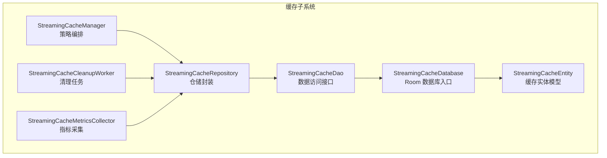
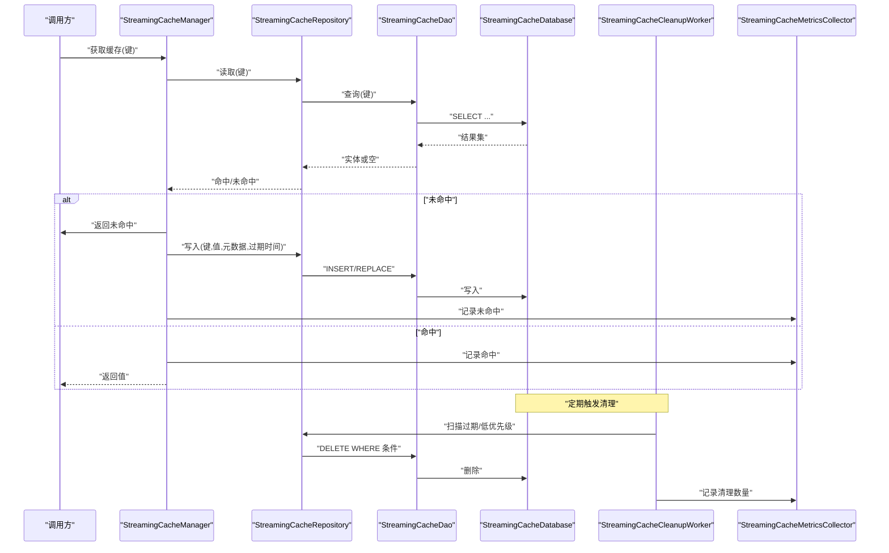
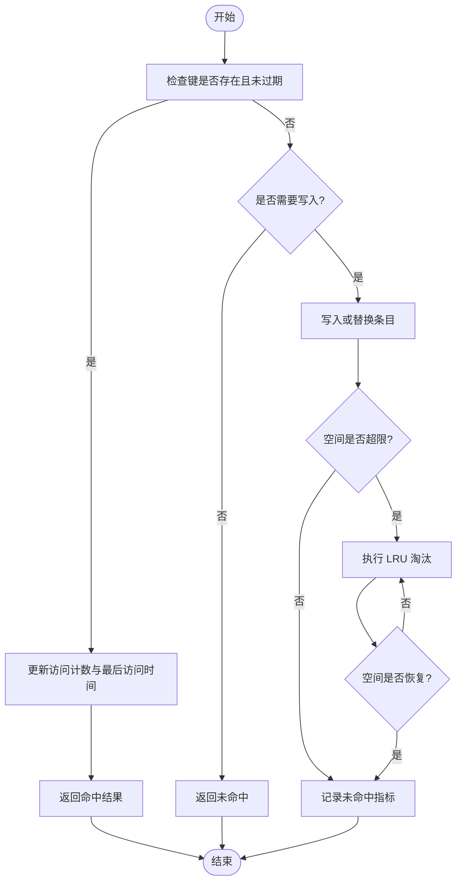
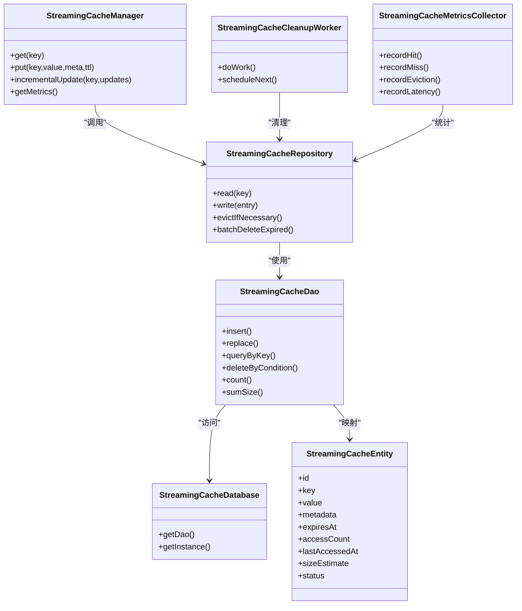

# 缓存策略

<cite>
**本文引用的文件**   
- [app.yukine.streaming.cache.StreamingCacheDatabase/1.json](file://feature/streaming/schemas/app.yukine.streaming.cache.StreamingCacheDatabase/1.json)
- [StreamingCacheDatabase.kt](file://feature/streaming/src/main/java/app/yukine/streaming/cache/StreamingCacheDatabase.kt)
- [StreamingCacheDao.kt](file://feature/streaming/src/main/java/app/yukine/streaming/cache/StreamingCacheDao.kt)
- [StreamingCacheEntity.kt](file://feature/streaming/src/main/java/app/yukine/streaming/cache/StreamingCacheEntity.kt)
- [StreamingCacheRepository.kt](file://feature/streaming/src/main/java/app/yukine/streaming/cache/StreamingCacheRepository.kt)
- [StreamingCacheManager.kt](file://feature/streaming/src/main/java/app/yukine/streaming/cache/StreamingCacheManager.kt)
- [StreamingCacheCleanupWorker.kt](file://feature/streaming/src/main/java/app/yukine/streaming/cache/StreamingCacheCleanupWorker.kt)
- [StreamingCacheMetricsCollector.kt](file://feature/streaming/src/main/java/app/yukine/streaming/cache/StreamingCacheMetricsCollector.kt)
- [StreamingModule.kt](file://app/src/main/java/app/yukine/StreamingModule.kt)
</cite>

## 目录
1. [简介](#简介)
2. [项目结构](#项目结构)
3. [核心组件](#核心组件)
4. [架构总览](#架构总览)
5. [详细组件分析](#详细组件分析)
6. [依赖关系分析](#依赖关系分析)
7. [性能考量](#性能考量)
8. [故障排查指南](#故障排查指南)
9. [结论](#结论)
10. [附录](#附录)

## 简介
本文件面向流媒体播放场景的本地缓存子系统，系统性说明缓存数据库设计、实体模型定义、DAO 操作接口，以及缓存策略的配置项、过期时间管理、存储空间控制。文档还覆盖缓存命中算法、LRU 淘汰策略、增量更新机制，并给出监控指标、清理任务调度与性能调优参数建议，最后提供问题诊断工具与内存使用优化建议，帮助开发者快速定位与优化缓存相关问题。

## 项目结构
缓存子系统位于 feature/streaming 模块中，采用 Room 持久化方案，结合 DAO 层与 Repository 抽象，上层由 Manager 统一编排策略（命中、淘汰、增量更新），并由 Worker 定时执行清理任务，Metrics 负责采集关键指标。

图表来源
- [StreamingCacheDatabase.kt](file://feature/streaming/src/main/java/app/yukine/streaming/cache/StreamingCacheDatabase.kt)
- [StreamingCacheDao.kt](file://feature/streaming/src/main/java/app/yukine/streaming/cache/StreamingCacheDao.kt)
- [StreamingCacheEntity.kt](file://feature/streaming/src/main/java/app/yukine/streaming/cache/StreamingCacheEntity.kt)
- [StreamingCacheRepository.kt](file://feature/streaming/src/main/java/app/yukine/streaming/cache/StreamingCacheRepository.kt)
- [StreamingCacheManager.kt](file://feature/streaming/src/main/java/app/yukine/streaming/cache/StreamingCacheManager.kt)
- [StreamingCacheCleanupWorker.kt](file://feature/streaming/src/main/java/app/yukine/streaming/cache/StreamingCacheCleanupWorker.kt)
- [StreamingCacheMetricsCollector.kt](file://feature/streaming/src/main/java/app/yukine/streaming/cache/StreamingCacheMetricsCollector.kt)

章节来源
- [StreamingCacheDatabase.kt](file://feature/streaming/src/main/java/app/yukine/streaming/cache/StreamingCacheDatabase.kt)
- [StreamingCacheDao.kt](file://feature/streaming/src/main/java/app/yukine/streaming/cache/StreamingCacheDao.kt)
- [StreamingCacheEntity.kt](file://feature/streaming/src/main/java/app/yukine/streaming/cache/StreamingCacheEntity.kt)
- [StreamingCacheRepository.kt](file://feature/streaming/src/main/java/app/yukine/streaming/cache/StreamingCacheRepository.kt)
- [StreamingCacheManager.kt](file://feature/streaming/src/main/java/app/yukine/streaming/cache/StreamingCacheManager.kt)
- [StreamingCacheCleanupWorker.kt](file://feature/streaming/src/main/java/app/yukine/streaming/cache/StreamingCacheCleanupWorker.kt)
- [StreamingCacheMetricsCollector.kt](file://feature/streaming/src/main/java/app/yukine/streaming/cache/StreamingCacheMetricsCollector.kt)

## 核心组件
- 数据库入口：提供单例数据库实例与版本迁移配置，暴露 DAO 集合。
- 实体模型：定义缓存表结构与字段约束，包含键、值、元数据、过期时间、访问计数等。
- DAO 接口：提供增删改查、按条件查询、批量删除、统计聚合等原子操作。
- 仓储层：封装事务性操作与跨表一致性，对外暴露业务级方法。
- 管理器：实现缓存命中、LRU 淘汰、增量更新、空间阈值控制等策略。
- 清理任务：周期性扫描过期与低优先级条目，释放空间。
- 指标采集：记录命中率、淘汰次数、写入延迟、空间占用等。

章节来源
- [StreamingCacheDatabase.kt](file://feature/streaming/src/main/java/app/yukine/streaming/cache/StreamingCacheDatabase.kt)
- [StreamingCacheEntity.kt](file://feature/streaming/src/main/java/app/yukine/streaming/cache/StreamingCacheEntity.kt)
- [StreamingCacheDao.kt](file://feature/streaming/src/main/java/app/yukine/streaming/cache/StreamingCacheDao.kt)
- [StreamingCacheRepository.kt](file://feature/streaming/src/main/java/app/yukine/streaming/cache/StreamingCacheRepository.kt)
- [StreamingCacheManager.kt](file://feature/streaming/src/main/java/app/yukine/streaming/cache/StreamingCacheManager.kt)
- [StreamingCacheCleanupWorker.kt](file://feature/streaming/src/main/java/app/yukine/streaming/cache/StreamingCacheCleanupWorker.kt)
- [StreamingCacheMetricsCollector.kt](file://feature/streaming/src/main/java/app/yukine/streaming/cache/StreamingCacheMetricsCollector.kt)

## 架构总览
下图展示从调用方到存储层的完整流程，包括命中判断、淘汰决策、增量更新与清理调度。

图表来源
- [StreamingCacheManager.kt](file://feature/streaming/src/main/java/app/yukine/streaming/cache/StreamingCacheManager.kt)
- [StreamingCacheRepository.kt](file://feature/streaming/src/main/java/app/yukine/streaming/cache/StreamingCacheRepository.kt)
- [StreamingCacheDao.kt](file://feature/streaming/src/main/java/app/yukine/streaming/cache/StreamingCacheDao.kt)
- [StreamingCacheDatabase.kt](file://feature/streaming/src/main/java/app/yukine/streaming/cache/StreamingCacheDatabase.kt)
- [StreamingCacheCleanupWorker.kt](file://feature/streaming/src/main/java/app/yukine/streaming/cache/StreamingCacheCleanupWorker.kt)
- [StreamingCacheMetricsCollector.kt](file://feature/streaming/src/main/java/app/yukine/streaming/cache/StreamingCacheMetricsCollector.kt)

## 详细组件分析

### 数据库设计与实体模型
- 数据库版本与迁移：通过 JSON 描述当前版本 schema，确保升级路径正确。
- 实体字段建议：
  - 主键：自增 ID
  - 唯一键：缓存键（用于快速查找）
  - 值：二进制或序列化文本（根据内容类型选择）
  - 元数据：JSON 字符串（如来源、质量、标签）
  - 过期时间：毫秒时间戳
  - 访问计数：整数（用于 LRU 近似）
  - 最后访问时间：毫秒时间戳（辅助 LRU）
  - 大小估计：字节数（便于空间控制）
  - 状态：枚举（有效/过期/待清理）
- 索引建议：
  - 唯一索引：缓存键
  - 普通索引：过期时间、最后访问时间、状态
- 约束建议：
  - 非空约束：键、过期时间
  - 默认值：访问计数=0，状态=有效

章节来源
- [app.yukine.streaming.cache.StreamingCacheDatabase/1.json](file://feature/streaming/schemas/app.yukine.streaming.cache.StreamingCacheDatabase/1.json)
- [StreamingCacheEntity.kt](file://feature/streaming/src/main/java/app/yukine/streaming/cache/StreamingCacheEntity.kt)

### DAO 操作接口
- 基本读写：插入、替换、按键查询、按键删除
- 批量操作：批量插入、批量删除（按过期时间或状态）
- 条件查询：按过期时间范围、按状态、按大小阈值
- 统计聚合：条目总数、总大小、最近访问时间分布
- 事务支持：在仓储层组合多个 DAO 调用保证一致性

章节来源
- [StreamingCacheDao.kt](file://feature/streaming/src/main/java/app/yukine/streaming/cache/StreamingCacheDao.kt)

### 仓储层封装
- 事务边界：将“读-写-淘汰”打包为一次事务，避免中间态不一致
- 错误处理：捕获异常并上报指标，必要时回滚
- 重试策略：对瞬时失败进行有限次重试
- 并发控制：使用锁或协程限流防止热点键竞争

章节来源
- [StreamingCacheRepository.kt](file://feature/streaming/src/main/java/app/yukine/streaming/cache/StreamingCacheRepository.kt)

### 管理器与策略
- 命中算法：
  - 先查键是否存在且未过期
  - 若存在则更新访问计数与最后访问时间
  - 命中时记录指标
- LRU 淘汰策略：
  - 当空间超过阈值时，按最后访问时间或访问计数排序，优先淘汰最久未访问或最少访问条目
  - 可结合权重（如大小、优先级）进行加权淘汰
- 增量更新机制：
  - 支持部分字段更新（如元数据、大小估计、访问计数）
  - 使用 REPLACE 或 UPDATE 减少全量重写开销
- 过期时间管理：
  - 写入时设置过期时间
  - 读取时检查是否过期，过期则标记并延迟删除
- 存储空间控制：
  - 维护总大小估计，超过阈值触发清理
  - 支持软阈值与硬阈值，软阈值触发轻度清理，硬阈值强制清理

图表来源
- [StreamingCacheManager.kt](file://feature/streaming/src/main/java/app/yukine/streaming/cache/StreamingCacheManager.kt)
- [StreamingCacheRepository.kt](file://feature/streaming/src/main/java/app/yukine/streaming/cache/StreamingCacheRepository.kt)
- [StreamingCacheDao.kt](file://feature/streaming/src/main/java/app/yukine/streaming/cache/StreamingCacheDao.kt)

章节来源
- [StreamingCacheManager.kt](file://feature/streaming/src/main/java/app/yukine/streaming/cache/StreamingCacheManager.kt)

### 清理任务调度
- 调度方式：使用系统任务调度器（如 WorkManager）周期性执行
- 触发条件：
  - 固定周期（例如每 15 分钟）
  - 空间阈值触发（后台监听磁盘变化）
- 清理策略：
  - 删除已过期条目
  - 删除低优先级或长时间未访问条目
  - 压缩或合并小条目以减少碎片
- 幂等性与健壮性：
  - 支持中断与重试
  - 记录清理日志与指标

章节来源
- [StreamingCacheCleanupWorker.kt](file://feature/streaming/src/main/java/app/yukine/streaming/cache/StreamingCacheCleanupWorker.kt)

### 监控指标
- 命中率：命中请求数 / 总请求数
- 未命中率：未命中请求数 / 总请求数
- 淘汰次数：每次触发 LRU 淘汰的次数
- 写入延迟：P50/P95/P99 写入耗时
- 空间占用：总大小、条目数、平均大小
- 过期清理：清理条目数、清理耗时
- 错误率：读写异常比例

章节来源
- [StreamingCacheMetricsCollector.kt](file://feature/streaming/src/main/java/app/yukine/streaming/cache/StreamingCacheMetricsCollector.kt)

### DI 与装配
- 模块注入：在应用启动时注册数据库、DAO、仓储、管理器、清理任务与指标采集
- 作用域：数据库单例，DAO 无状态，仓储与管理器可按需注入
- 测试友好：提供 Fake/Mock 实现以便单元测试与集成测试

章节来源
- [StreamingModule.kt](file://app/src/main/java/app/yukine/StreamingModule.kt)

## 依赖关系分析
- 内聚性：
  - DAO 仅关注数据访问，职责单一
  - Repository 封装事务与一致性，屏蔽底层细节
  - Manager 专注策略逻辑，不直接操作数据库
- 耦合度：
  - Manager 依赖 Repository，间接依赖 DAO 与 Database
  - Worker 与 Metrics 通过 Repository 与 Manager 协作
- 外部依赖：
  - Room 数据库框架
  - 任务调度框架（WorkManager 或平台等价物）
  - 指标上报通道（可选）

图表来源
- [StreamingCacheDatabase.kt](file://feature/streaming/src/main/java/app/yukine/streaming/cache/StreamingCacheDatabase.kt)
- [StreamingCacheDao.kt](file://feature/streaming/src/main/java/app/yukine/streaming/cache/StreamingCacheDao.kt)
- [StreamingCacheEntity.kt](file://feature/streaming/src/main/java/app/yukine/streaming/cache/StreamingCacheEntity.kt)
- [StreamingCacheRepository.kt](file://feature/streaming/src/main/java/app/yukine/streaming/cache/StreamingCacheRepository.kt)
- [StreamingCacheManager.kt](file://feature/streaming/src/main/java/app/yukine/streaming/cache/StreamingCacheManager.kt)
- [StreamingCacheCleanupWorker.kt](file://feature/streaming/src/main/java/app/yukine/streaming/cache/StreamingCacheCleanupWorker.kt)
- [StreamingCacheMetricsCollector.kt](file://feature/streaming/src/main/java/app/yukine/streaming/cache/StreamingCacheMetricsCollector.kt)

章节来源
- [StreamingCacheDatabase.kt](file://feature/streaming/src/main/java/app/yukine/streaming/cache/StreamingCacheDatabase.kt)
- [StreamingCacheDao.kt](file://feature/streaming/src/main/java/app/yukine/streaming/cache/StreamingCacheDao.kt)
- [StreamingCacheEntity.kt](file://feature/streaming/src/main/java/app/yukine/streaming/cache/StreamingCacheEntity.kt)
- [StreamingCacheRepository.kt](file://feature/streaming/src/main/java/app/yukine/streaming/cache/StreamingCacheRepository.kt)
- [StreamingCacheManager.kt](file://feature/streaming/src/main/java/app/yukine/streaming/cache/StreamingCacheManager.kt)
- [StreamingCacheCleanupWorker.kt](file://feature/streaming/src/main/java/app/yukine/streaming/cache/StreamingCacheCleanupWorker.kt)
- [StreamingCacheMetricsCollector.kt](file://feature/streaming/src/main/java/app/yukine/streaming/cache/StreamingCacheMetricsCollector.kt)

## 性能考量
- 索引优化：
  - 为键建立唯一索引，加速查找
  - 为过期时间与最后访问时间建立普通索引，提升清理效率
- 批量操作：
  - 使用批量插入/删除减少事务开销
  - 合并多次更新为单次提交
- 内存使用：
  - 限制单次查询返回行数，分页处理
  - 避免加载大值到内存，按需读取
- 并发控制：
  - 热点键加锁或使用原子操作
  - 控制并发写入队列长度
- 空间阈值：
  - 软阈值触发轻度清理，硬阈值强制清理
  - 动态调整阈值基于设备可用空间

[本节为通用指导，无需具体文件引用]

## 故障排查指南
- 常见问题：
  - 命中率偏低：检查 TTL 设置与键生成策略
  - 空间持续增长：确认清理任务是否正常运行
  - 写入延迟升高：检查索引与批量操作是否生效
  - 淘汰频繁：评估阈值与权重策略
- 诊断工具：
  - 指标导出：导出命中率、淘汰次数、写入延迟、空间占用
  - 日志追踪：记录关键操作的耗时与错误码
  - 快照导出：导出当前缓存表结构与统计信息
- 内存优化建议：
  - 减小值大小（压缩或分块）
  - 降低访问计数精度（采样）
  - 合理设置最大条目数与平均大小上限

章节来源
- [StreamingCacheMetricsCollector.kt](file://feature/streaming/src/main/java/app/yukine/streaming/cache/StreamingCacheMetricsCollector.kt)
- [StreamingCacheCleanupWorker.kt](file://feature/streaming/src/main/java/app/yukine/streaming/cache/StreamingCacheCleanupWorker.kt)

## 结论
本缓存子系统以 Room 为核心，通过 DAO 与 Repository 分层，配合 Manager 的策略编排与 Worker 的清理调度，实现了高可用的流媒体缓存能力。合理的索引设计、批量操作与空间阈值控制是保障性能的关键；完善的指标与日志有助于快速定位问题。建议在上线前完成容量规划与压力测试，持续监控命中率与淘汰行为，动态调优阈值与 TTL。

[本节为总结，无需具体文件引用]

## 附录
- 配置项建议：
  - TTL 默认值：按内容类型区分（短生命周期与长生命周期）
  - 空间阈值：软阈值=可用空间的 70%，硬阈值=可用空间的 90%
  - 清理周期：15 分钟
  - 最大条目数：根据设备内存与存储估算
- 最佳实践：
  - 键命名规范：包含来源、ID、质量等维度
  - 元数据最小化：仅保留必要信息
  - 增量更新优先：避免全量重写
  - 指标上报：接入集中式监控平台

[本节为补充信息，无需具体文件引用]