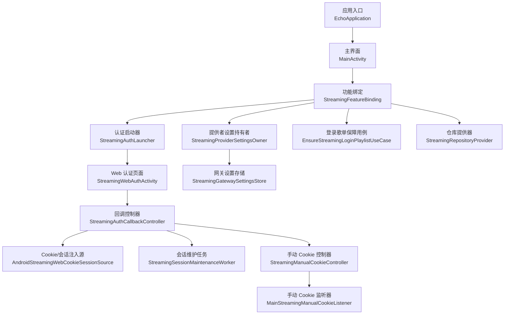
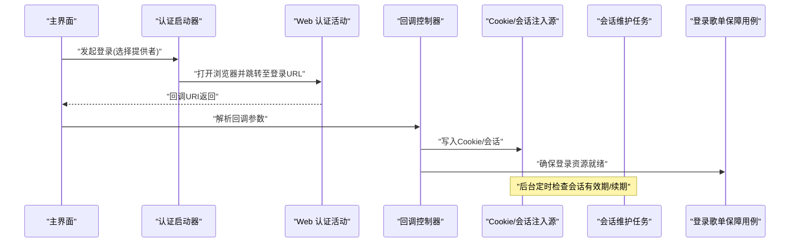
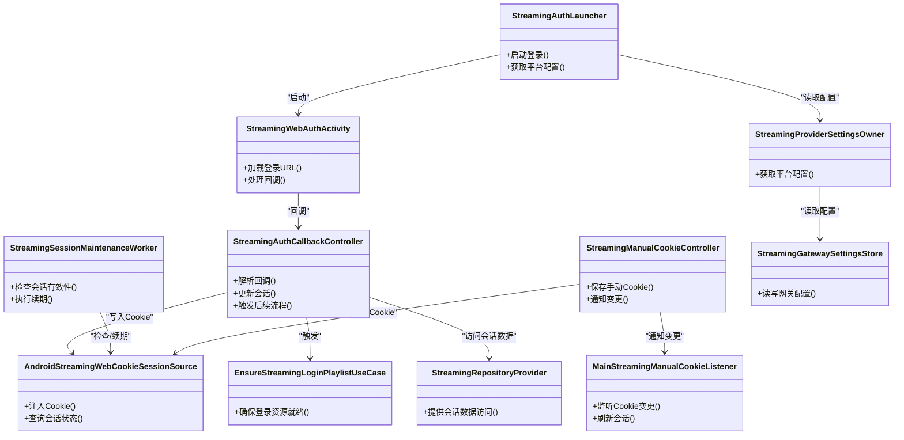

# 认证授权系统

<cite>
**本文引用的文件**   
- [StreamingAuthCallbackController.kt](file://app/src/main/java/app/yukine/StreamingAuthCallbackController.kt)
- [StreamingAuthLauncher.kt](file://app/src/main/java/app/yukine/StreamingAuthLauncher.kt)
- [StreamingWebAuthActivity.kt](file://app/src/main/java/app/yukine/StreamingWebAuthActivity.kt)
- [AndroidStreamingWebCookieSessionSource.kt](file://app/src/main/java/app/yukine/AndroidStreamingWebCookieSessionSource.kt)
- [StreamingSessionMaintenanceWorker.kt](file://app/src/main/java/app/yukine/StreamingSessionMaintenanceWorker.kt)
- [MainStreamingManualCookieListener.kt](file://app/src/main/java/app/yukine/MainStreamingManualCookieListener.kt)
- [StreamingManualCookieController.kt](file://app/src/main/java/app/yukine/StreamingManualCookieController.kt)
- [StreamingModule.kt](file://app/src/main/java/app/yukine/StreamingModule.kt)
- [AppPermissions.kt](file://app/src/main/java/app/yukine/AppPermissions.kt)
- [EchoApplication.kt](file://app/src/main/java/app/yukine/EchoApplication.kt)
- [MainActivity.kt](file://app/src/main/java/app/yukine/MainActivity.kt)
- [StreamingFeatureBinding.java](file://app/src/main/java/app/yukine/StreamingFeatureBinding.java)
- [StreamingProviderSettingsOwner.kt](file://app/src/main/java/app/yukine/StreamingProviderSettingsOwner.kt)
- [StreamingGatewaySettingsStore.kt](file://app/src/main/java/app/yukine/StreamingGatewaySettingsStore.kt)
- [EnsureStreamingLoginPlaylistUseCase.kt](file://app/src/main/java/app/yukine/EnsureStreamingLoginPlaylistUseCase.kt)
- [StreamingRepositoryProvider.kt](file://app/src/main/java/app/yukine/StreamingRepositoryProvider.kt)
</cite>

## 目录
1. [简介](#简介)
2. [项目结构](#项目结构)
3. [核心组件](#核心组件)
4. [架构总览](#架构总览)
5. [详细组件分析](#详细组件分析)
6. [依赖关系分析](#依赖关系分析)
7. [性能与可靠性](#性能与可靠性)
8. [故障排查指南](#故障排查指南)
9. [结论](#结论)
10. [附录](#附录)

## 简介
本文件面向流媒体认证授权子系统，聚焦 OAuth2 认证流程、令牌管理、会话维护机制；文档化各平台登录端点配置、回调处理、错误重试策略；解释 Web 认证活动、本地存储安全、自动续期机制；并覆盖认证状态同步、跨设备登录支持、登出清理流程，以及认证失败的调试方法与常见问题解决方案。

## 项目结构
认证相关能力分布在 app 模块的多个文件中，围绕“启动认证”、“Web 浏览器认证”、“回调处理”、“Cookie/会话注入”、“后台会话维护”、“手动 Cookie 输入”等职责进行组织：

图表来源
- [EchoApplication.kt](file://app/src/main/java/app/yukine/EchoApplication.kt)
- [MainActivity.kt](file://app/src/main/java/app/yukine/MainActivity.kt)
- [StreamingFeatureBinding.java](file://app/src/main/java/app/yukine/StreamingFeatureBinding.java)
- [StreamingAuthLauncher.kt](file://app/src/main/java/app/yukine/StreamingAuthLauncher.kt)
- [StreamingWebAuthActivity.kt](file://app/src/main/java/app/yukine/StreamingWebAuthActivity.kt)
- [StreamingAuthCallbackController.kt](file://app/src/main/java/app/yukine/StreamingAuthCallbackController.kt)
- [AndroidStreamingWebCookieSessionSource.kt](file://app/src/main/java/app/yukine/AndroidStreamingWebCookieSessionSource.kt)
- [StreamingSessionMaintenanceWorker.kt](file://app/src/main/java/app/yukine/StreamingSessionMaintenanceWorker.kt)
- [StreamingManualCookieController.kt](file://app/src/main/java/app/yukine/StreamingManualCookieController.kt)
- [MainStreamingManualCookieListener.kt](file://app/src/main/java/app/yukine/MainStreamingManualCookieListener.kt)
- [StreamingProviderSettingsOwner.kt](file://app/src/main/java/app/yukine/StreamingProviderSettingsOwner.kt)
- [StreamingGatewaySettingsStore.kt](file://app/src/main/java/app/yukine/StreamingGatewaySettingsStore.kt)
- [EnsureStreamingLoginPlaylistUseCase.kt](file://app/src/main/java/app/yukine/EnsureStreamingLoginPlaylistUseCase.kt)
- [StreamingRepositoryProvider.kt](file://app/src/main/java/app/yukine/StreamingRepositoryProvider.kt)

章节来源
- [StreamingFeatureBinding.java](file://app/src/main/java/app/yukine/StreamingFeatureBinding.java)
- [StreamingAuthLauncher.kt](file://app/src/main/java/app/yukine/StreamingAuthLauncher.kt)
- [StreamingWebAuthActivity.kt](file://app/src/main/java/app/yukine/StreamingWebAuthActivity.kt)
- [StreamingAuthCallbackController.kt](file://app/src/main/java/app/yukine/StreamingAuthCallbackController.kt)
- [AndroidStreamingWebCookieSessionSource.kt](file://app/src/main/java/app/yukine/AndroidStreamingWebCookieSessionSource.kt)
- [StreamingSessionMaintenanceWorker.kt](file://app/src/main/java/app/yukine/StreamingSessionMaintenanceWorker.kt)
- [StreamingManualCookieController.kt](file://app/src/main/java/app/yukine/StreamingManualCookieController.kt)
- [MainStreamingManualCookieListener.kt](file://app/src/main/java/app/yukine/MainStreamingManualCookieListener.kt)
- [StreamingProviderSettingsOwner.kt](file://app/src/main/java/app/yukine/StreamingProviderSettingsOwner.kt)
- [StreamingGatewaySettingsStore.kt](file://app/src/main/java/app/yukine/StreamingGatewaySettingsStore.kt)
- [EnsureStreamingLoginPlaylistUseCase.kt](file://app/src/main/java/app/yukine/EnsureStreamingLoginPlaylistUseCase.kt)
- [StreamingRepositoryProvider.kt](file://app/src/main/java/app/yukine/StreamingRepositoryProvider.kt)

## 核心组件
- 认证启动器：负责根据当前选中的流媒体提供者，组装登录 URL 并启动 Web 认证流程。
- Web 认证活动：承载浏览器控件，完成第三方登录页交互，并将回调结果转发给回调控制器。
- 回调控制器：解析回调参数，更新会话状态，触发后续业务（如刷新播放列表、注入 Cookie）。
- Cookie/会话注入源：将浏览器会话或用户提供的 Cookie 注入到网络层，供后续请求使用。
- 会话维护任务：周期性检查会话有效性，必要时执行静默续期或提示重新登录。
- 手动 Cookie 控制器与监听器：允许用户手动粘贴 Cookie，并在变更时通知系统刷新会话。
- 提供者设置持有者与网关设置存储：集中管理各平台的客户端 ID、重定向 URI、端点等配置。
- 登录歌单保障用例：在认证成功后确保必要的登录态资源（如登录歌单）可用。
- 仓库提供器：为上层提供统一的认证/会话数据访问入口。

章节来源
- [StreamingAuthLauncher.kt](file://app/src/main/java/app/yukine/StreamingAuthLauncher.kt)
- [StreamingWebAuthActivity.kt](file://app/src/main/java/app/yukine/StreamingWebAuthActivity.kt)
- [StreamingAuthCallbackController.kt](file://app/src/main/java/app/yukine/StreamingAuthCallbackController.kt)
- [AndroidStreamingWebCookieSessionSource.kt](file://app/src/main/java/app/yukine/AndroidStreamingWebCookieSessionSource.kt)
- [StreamingSessionMaintenanceWorker.kt](file://app/src/main/java/app/yukine/StreamingSessionMaintenanceWorker.kt)
- [StreamingManualCookieController.kt](file://app/src/main/java/app/yukine/StreamingManualCookieController.kt)
- [MainStreamingManualCookieListener.kt](file://app/src/main/java/app/yukine/MainStreamingManualCookieListener.kt)
- [StreamingProviderSettingsOwner.kt](file://app/src/main/java/app/yukine/StreamingProviderSettingsOwner.kt)
- [StreamingGatewaySettingsStore.kt](file://app/src/main/java/app/yukine/StreamingGatewaySettingsStore.kt)
- [EnsureStreamingLoginPlaylistUseCase.kt](file://app/src/main/java/app/yukine/EnsureStreamingLoginPlaylistUseCase.kt)
- [StreamingRepositoryProvider.kt](file://app/src/main/java/app/yukine/StreamingRepositoryProvider.kt)

## 架构总览
下图展示了从用户点击“登录”到认证成功、会话注入与后续业务触发的整体时序。

图表来源
- [MainActivity.kt](file://app/src/main/java/app/yukine/MainActivity.kt)
- [StreamingAuthLauncher.kt](file://app/src/main/java/app/yukine/StreamingAuthLauncher.kt)
- [StreamingWebAuthActivity.kt](file://app/src/main/java/app/yukine/StreamingWebAuthActivity.kt)
- [StreamingAuthCallbackController.kt](file://app/src/main/java/app/yukine/StreamingAuthCallbackController.kt)
- [AndroidStreamingWebCookieSessionSource.kt](file://app/src/main/java/app/yukine/AndroidStreamingWebCookieSessionSource.kt)
- [StreamingSessionMaintenanceWorker.kt](file://app/src/main/java/app/yukine/StreamingSessionMaintenanceWorker.kt)
- [EnsureStreamingLoginPlaylistUseCase.kt](file://app/src/main/java/app/yukine/EnsureStreamingLoginPlaylistUseCase.kt)

## 详细组件分析

### 认证启动器（按平台选择登录端点）
- 职责：根据当前选择的流媒体提供者，读取对应配置（客户端 ID、重定向 URI、登录端点），生成登录 URL 并启动 Web 认证。
- 关键点：
  - 通过提供者设置持有者获取平台配置。
  - 将回调地址与状态参数附加到登录 URL。
  - 调用 Web 认证活动以完成浏览器内登录。
- 扩展性：新增平台只需在提供者设置中补充端点与重定向 URI，无需改动启动逻辑。

章节来源
- [StreamingAuthLauncher.kt](file://app/src/main/java/app/yukine/StreamingAuthLauncher.kt)
- [StreamingProviderSettingsOwner.kt](file://app/src/main/java/app/yukine/StreamingProviderSettingsOwner.kt)
- [StreamingGatewaySettingsStore.kt](file://app/src/main/java/app/yukine/StreamingGatewaySettingsStore.kt)

### Web 认证活动（浏览器内登录）
- 职责：承载浏览器控件，展示第三方登录页面，拦截回调 URI，将结果回传给上层。
- 关键点：
  - 支持自定义重定向 URI Scheme。
  - 捕获登录成功/失败/取消等事件，统一封装后回调。
  - 可配置是否启用 Cookie 持久化与跨域策略。
- 安全建议：避免在日志中输出敏感信息；回调页面仅做最小化处理。

章节来源
- [StreamingWebAuthActivity.kt](file://app/src/main/java/app/yukine/StreamingWebAuthActivity.kt)
- [AppPermissions.kt](file://app/src/main/java/app/yukine/AppPermissions.kt)

### 回调控制器（解析回调与状态更新）
- 职责：接收回调 URI，校验 state 参数，提取必要凭证（如临时 code 或直接 Cookie），更新会话状态，并触发后续流程。
- 关键点：
  - 校验回调来源与 state 一致性，防止 CSRF。
  - 若服务端采用 code 交换模式，需在此处发起令牌交换（由仓库提供器或网络层实现）。
  - 成功后调用 Cookie/会话注入源写入 Cookie，并触发登录歌单保障用例。
- 错误处理：对无效回调、state 不匹配、网络异常等进行分类处理与重试提示。

章节来源
- [StreamingAuthCallbackController.kt](file://app/src/main/java/app/yukine/StreamingAuthCallbackController.kt)
- [AndroidStreamingWebCookieSessionSource.kt](file://app/src/main/java/app/yukine/AndroidStreamingWebCookieSessionSource.kt)
- [EnsureStreamingLoginPlaylistUseCase.kt](file://app/src/main/java/app/yukine/EnsureStreamingLoginPlaylistUseCase.kt)

### Cookie/会话注入源（会话维护与注入）
- 职责：将浏览器会话或用户提供的 Cookie 注入到网络层，供后续 API 调用使用。
- 关键点：
  - 支持按域名/路径精确注入。
  - 提供查询接口用于判断会话是否有效。
  - 与后台维护任务协作，定期刷新或续期。
- 安全建议：优先使用系统级安全存储保存敏感 Cookie；避免明文落盘。

章节来源
- [AndroidStreamingWebCookieSessionSource.kt](file://app/src/main/java/app/yukine/AndroidStreamingWebCookieSessionSource.kt)
- [StreamingSessionMaintenanceWorker.kt](file://app/src/main/java/app/yukine/StreamingSessionMaintenanceWorker.kt)

### 会话维护任务（自动续期与失效检测）
- 职责：周期性检查会话有效性，必要时执行静默续期或提示重新登录。
- 关键点：
  - 基于上次更新时间与过期时间计算续期时机。
  - 支持指数退避重试与最大重试次数限制。
  - 与手动 Cookie 控制器联动，当检测到 Cookie 变更时立即刷新。
- 调度策略：结合系统 JobScheduler/WorkManager 进行低功耗调度。

章节来源
- [StreamingSessionMaintenanceWorker.kt](file://app/src/main/java/app/yukine/StreamingSessionMaintenanceWorker.kt)
- [StreamingManualCookieController.kt](file://app/src/main/java/app/yukine/StreamingManualCookieController.kt)
- [MainStreamingManualCookieListener.kt](file://app/src/main/java/app/yukine/MainStreamingManualCookieListener.kt)

### 手动 Cookie 控制器与监听器（用户辅助）
- 职责：提供手动粘贴 Cookie 的能力，并在 Cookie 变更时通知系统刷新会话。
- 关键点：
  - 提供输入校验与格式提示。
  - 变更后广播或回调通知会话注入源更新。
  - 记录最近一次更新时间，便于维护任务判断。
- 用户体验：明确告知风险与用途，避免误用导致账号安全问题。

章节来源
- [StreamingManualCookieController.kt](file://app/src/main/java/app/yukine/StreamingManualCookieController.kt)
- [MainStreamingManualCookieListener.kt](file://app/src/main/java/app/yukine/MainStreamingManualCookieListener.kt)

### 提供者设置与网关设置存储（平台配置）
- 职责：集中管理各平台的客户端 ID、重定向 URI、登录端点、令牌端点等配置。
- 关键点：
  - 支持多环境切换（开发/测试/生产）。
  - 提供默认值与校验规则。
  - 与认证启动器和回调控制器共享配置。
- 扩展性：新增平台仅需添加配置项，无需修改核心流程。

章节来源
- [StreamingProviderSettingsOwner.kt](file://app/src/main/java/app/yukine/StreamingProviderSettingsOwner.kt)
- [StreamingGatewaySettingsStore.kt](file://app/src/main/java/app/yukine/StreamingGatewaySettingsStore.kt)

### 登录歌单保障用例（登录后资源准备）
- 职责：在认证成功后确保必要的登录态资源（如登录歌单）可用。
- 关键点：
  - 幂等设计，重复执行不会造成副作用。
  - 失败时记录原因并延迟重试。
  - 与回调控制器协同，作为登录成功后的收尾步骤。

章节来源
- [EnsureStreamingLoginPlaylistUseCase.kt](file://app/src/main/java/app/yukine/EnsureStreamingLoginPlaylistUseCase.kt)

### 仓库提供器（统一数据访问）
- 职责：为上层提供统一的认证/会话数据访问入口，屏蔽底层实现细节。
- 关键点：
  - 暴露会话状态查询、写入、续期等方法。
  - 与 Cookie/会话注入源、维护任务解耦。
  - 便于单元测试与替换实现。

章节来源
- [StreamingRepositoryProvider.kt](file://app/src/main/java/app/yukine/StreamingRepositoryProvider.kt)

## 依赖关系分析

图表来源
- [StreamingAuthLauncher.kt](file://app/src/main/java/app/yukine/StreamingAuthLauncher.kt)
- [StreamingWebAuthActivity.kt](file://app/src/main/java/app/yukine/StreamingWebAuthActivity.kt)
- [StreamingAuthCallbackController.kt](file://app/src/main/java/app/yukine/StreamingAuthCallbackController.kt)
- [AndroidStreamingWebCookieSessionSource.kt](file://app/src/main/java/app/yukine/AndroidStreamingWebCookieSessionSource.kt)
- [StreamingSessionMaintenanceWorker.kt](file://app/src/main/java/app/yukine/StreamingSessionMaintenanceWorker.kt)
- [StreamingManualCookieController.kt](file://app/src/main/java/app/yukine/StreamingManualCookieController.kt)
- [MainStreamingManualCookieListener.kt](file://app/src/main/java/app/yukine/MainStreamingManualCookieListener.kt)
- [StreamingProviderSettingsOwner.kt](file://app/src/main/java/app/yukine/StreamingProviderSettingsOwner.kt)
- [StreamingGatewaySettingsStore.kt](file://app/src/main/java/app/yukine/StreamingGatewaySettingsStore.kt)
- [EnsureStreamingLoginPlaylistUseCase.kt](file://app/src/main/java/app/yukine/EnsureStreamingLoginPlaylistUseCase.kt)
- [StreamingRepositoryProvider.kt](file://app/src/main/java/app/yukine/StreamingRepositoryProvider.kt)

章节来源
- [StreamingAuthLauncher.kt](file://app/src/main/java/app/yukine/StreamingAuthLauncher.kt)
- [StreamingWebAuthActivity.kt](file://app/src/main/java/app/yukine/StreamingWebAuthActivity.kt)
- [StreamingAuthCallbackController.kt](file://app/src/main/java/app/yukine/StreamingAuthCallbackController.kt)
- [AndroidStreamingWebCookieSessionSource.kt](file://app/src/main/java/app/yukine/AndroidStreamingWebCookieSessionSource.kt)
- [StreamingSessionMaintenanceWorker.kt](file://app/src/main/java/app/yukine/StreamingSessionMaintenanceWorker.kt)
- [StreamingManualCookieController.kt](file://app/src/main/java/app/yukine/StreamingManualCookieController.kt)
- [MainStreamingManualCookieListener.kt](file://app/src/main/java/app/yukine/MainStreamingManualCookieListener.kt)
- [StreamingProviderSettingsOwner.kt](file://app/src/main/java/app/yukine/StreamingProviderSettingsOwner.kt)
- [StreamingGatewaySettingsStore.kt](file://app/src/main/java/app/yukine/StreamingGatewaySettingsStore.kt)
- [EnsureStreamingLoginPlaylistUseCase.kt](file://app/src/main/java/app/yukine/EnsureStreamingLoginPlaylistUseCase.kt)
- [StreamingRepositoryProvider.kt](file://app/src/main/java/app/yukine/StreamingRepositoryProvider.kt)

## 性能与可靠性
- 后台续期策略：采用指数退避与最大重试次数限制，避免频繁唤醒与网络风暴。
- 批量操作：登录成功后批量准备资源（如登录歌单），减少多次往返。
- 缓存与会话复用：尽可能复用已建立的会话，降低鉴权开销。
- 低电量优化：在设备低电量模式下降低续期频率或暂停非关键任务。

[本节为通用指导，不涉及具体文件]

## 故障排查指南
- 常见错误与定位
  - 回调参数缺失或 state 不匹配：检查回调控制器对参数的校验逻辑与上游生成的 state。
  - Cookie 未生效：确认注入源的域名/路径范围是否正确，以及是否被系统策略拦截。
  - 会话频繁失效：检查维护任务的续期间隔与最大重试次数，确认后端会话生命周期。
  - 手动 Cookie 粘贴失败：验证格式与字段完整性，关注敏感字段是否包含过期时间。
- 调试方法
  - 开启详细日志：在回调控制器与维护任务中增加关键路径日志（注意脱敏）。
  - 模拟回调：构造不同场景的回调 URI，验证边界条件与异常分支。
  - 抓包分析：对比登录流程的请求/响应，确认重定向 URI 与参数是否符合预期。
- 恢复策略
  - 自动重试：对网络抖动导致的失败进行有限次重试。
  - 降级方案：在无法自动续期时提示用户重新登录或手动粘贴 Cookie。
  - 清理与重置：登出时彻底清除本地 Cookie 与缓存，避免脏状态影响后续登录。

章节来源
- [StreamingAuthCallbackController.kt](file://app/src/main/java/app/yukine/StreamingAuthCallbackController.kt)
- [AndroidStreamingWebCookieSessionSource.kt](file://app/src/main/java/app/yukine/AndroidStreamingWebCookieSessionSource.kt)
- [StreamingSessionMaintenanceWorker.kt](file://app/src/main/java/app/yukine/StreamingSessionMaintenanceWorker.kt)
- [StreamingManualCookieController.kt](file://app/src/main/java/app/yukine/StreamingManualCookieController.kt)

## 结论
该认证授权子系统围绕“启动—浏览器登录—回调处理—会话注入—后台维护”的主链路构建，具备多平台可扩展性与良好的容错能力。通过明确的职责划分与解耦设计，新增平台与功能扩展较为便捷。建议在后续迭代中持续完善错误码体系、增强安全性（如更严格的 state 校验与敏感数据保护）、并提供更友好的用户引导与诊断工具。

[本节为总结，不涉及具体文件]

## 附录
- 术语说明
  - OAuth2：开放标准，用于授权与令牌颁发。
  - Cookie：服务器下发的小型文本片段，常用于维持会话。
  - 会话续期：在会话即将过期前主动刷新，以保持登录态。
- 最佳实践
  - 始终校验回调来源与 state，防范 CSRF。
  - 使用系统级安全存储保存敏感信息。
  - 对网络异常进行有界重试，避免无限循环。
  - 登出时彻底清理本地状态，保证跨设备登录一致性。

[本节为概念性内容，不涉及具体文件]