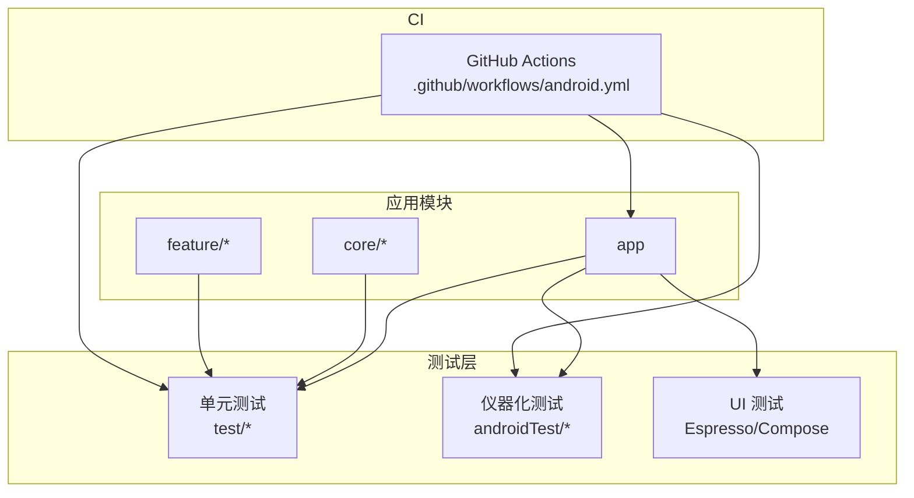
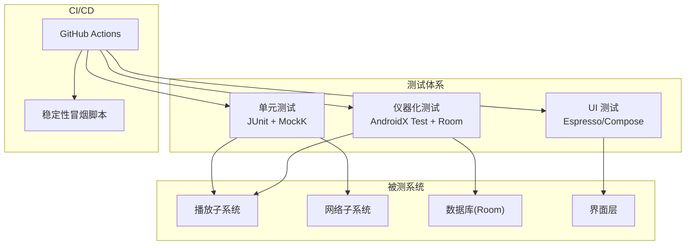
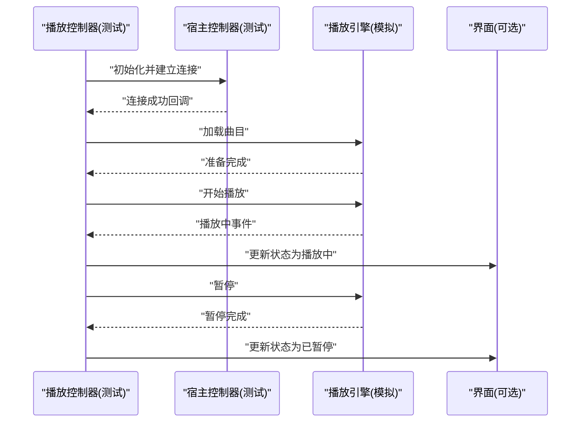
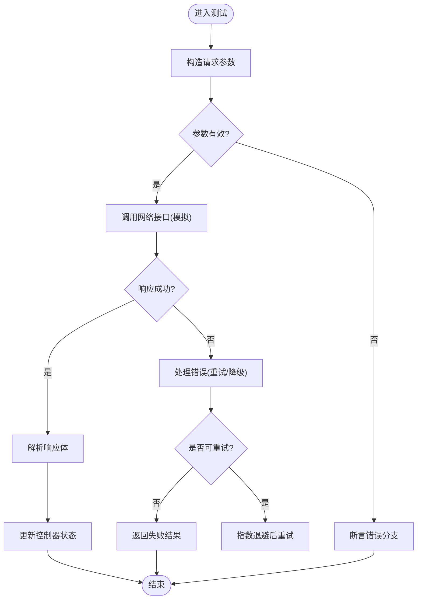
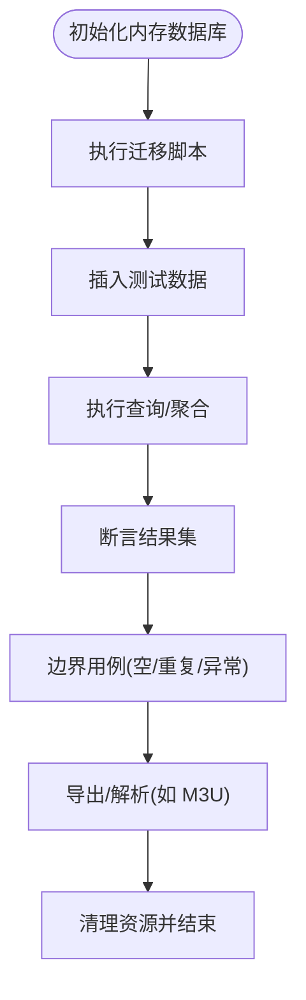
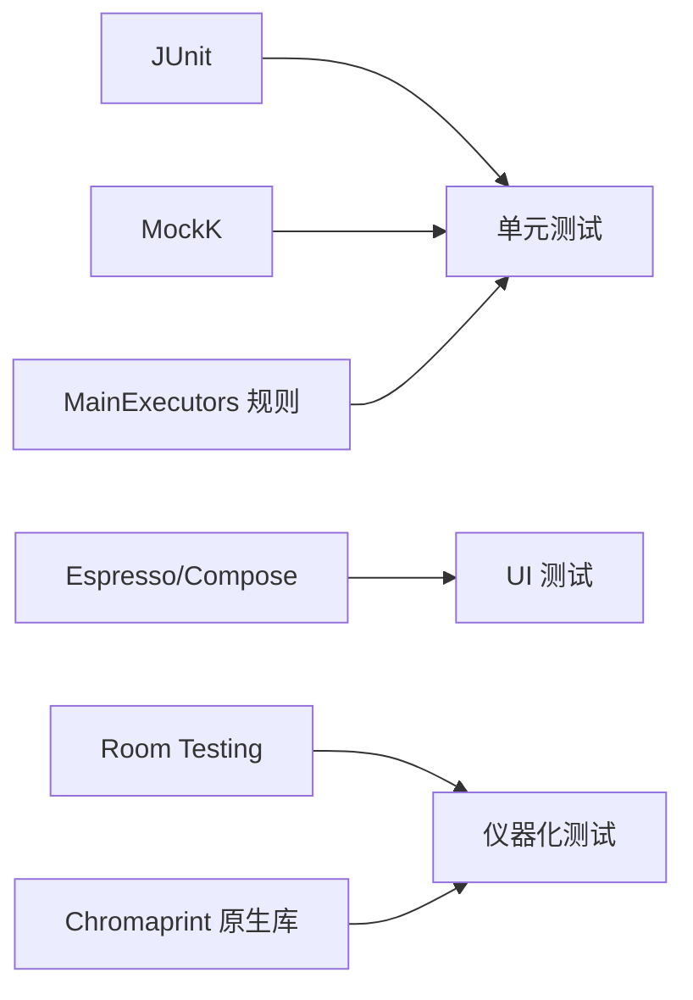

# 测试策略

<cite>
**本文引用的文件**   
- [android.yml](file://.github/workflows/android.yml)
- [build.gradle](file://app/build.gradle)
- [MainActivity.kt](file://app/src/main/java/app/yukine/MainActivity.kt)
- [MainExecutorsTest.kt](file://app/src/test/java/app/yukine/MainExecutorsTest.kt)
- [PlaybackServiceHostControllerTest.kt](file://app/src/test/java/app/yukine/PlaybackServiceHostControllerTest.kt)
- [StreamingPlaybackControllerTest.kt](file://app/src/test/java/app/yukine/StreamingPlaybackControllerTest.kt)
- [NetworkRequestControllerTest.java](file://app/src/test/java/app/yukine/NetworkRequestControllerTest.java)
- [RoomRepositoriesInstrumentedTest.kt](file://app/src/androidTest/java/app/yukine/data/RoomRepositoriesInstrumentedTest.kt)
- [M3uPlaylistParserInstrumentedTest.java](file://app/src/androidTest/java/app/yukine/data/M3uPlaylistParserInstrumentedTest.java)
- [ChromaprintNativeInstrumentedTest.kt](file://app/src/androidTest/java/app/yukine/fingerprint/ChromaprintNativeInstrumentedTest.kt)
- [TxPlaybackResolutionInstrumentedTest.kt](file://app/src/androidTest/java/app/yukine/streaming/TxPlaybackResolutionInstrumentedTest.kt)
- [playback-stability-smoke.ps1](file://scripts/playback-stability-smoke.ps1)
</cite>

## 目录
1. [简介](#简介)
2. [项目结构](#项目结构)
3. [核心组件](#核心组件)
4. [架构总览](#架构总览)
5. [详细组件分析](#详细组件分析)
6. [依赖分析](#依赖分析)
7. [性能考量](#性能考量)
8. [故障排查指南](#故障排查指南)
9. [结论](#结论)
10. [附录](#附录)

## 简介
本测试策略面向 Echo Android 应用，覆盖单元测试、集成测试与 UI 测试的实施方案。文档基于仓库现有测试代码与 CI 配置进行归纳，明确测试框架选择（JUnit、MockK、Espresso）、测试数据管理、模拟对象策略，并针对播放服务、网络请求、数据库操作等关键组件给出可操作的测试方法。同时包含覆盖率要求、持续集成配置与自动化流程建议，以及编写最佳实践与常见问题解决方案。

## 项目结构
仓库采用多模块组织，测试按类型分层：
- 单元测试位于各模块的 test 目录，使用 JVM 环境运行，适合业务逻辑、状态机、工具类与协程调度验证。
- 仪器化测试位于 androidTest 目录，运行在设备或模拟器上，用于验证 Room、原生库、UI 交互等需要 Android 环境的场景。
- CI 流水线定义于 .github/workflows，提供构建与测试执行入口。

图表来源
- [android.yml](file://.github/workflows/android.yml)
- [build.gradle](file://app/build.gradle)

章节来源
- [android.yml](file://.github/workflows/android.yml)
- [build.gradle](file://app/build.gradle)

## 核心组件
本节聚焦三类关键组件的测试方法与策略：播放服务、网络请求、数据库操作。

- 播放服务
  - 目标：验证播放状态机、队列变更、生命周期回调、与宿主控制器交互。
  - 方法：通过单元测试对播放器控制器与服务宿主控制器进行行为断言；必要时结合仪器化测试验证真实播放链路。
  - 参考实现路径：
    - [PlaybackServiceHostControllerTest.kt](file://app/src/test/java/app/yukine/PlaybackServiceHostControllerTest.kt)
    - [StreamingPlaybackControllerTest.kt](file://app/src/test/java/app/yukine/StreamingPlaybackControllerTest.kt)
    - [MainActivity.kt](file://app/src/main/java/app/yukine/MainActivity.kt)

- 网络请求
  - 目标：验证请求构造、重试、错误处理、与上层控制器的协作。
  - 方法：使用 MockK 对网络层接口进行模拟，断言调用次数与参数；结合记录式探针验证实际请求体（如 RecordingHttpProbe）。
  - 参考实现路径：
    - [NetworkRequestControllerTest.java](file://app/src/test/java/app/yukine/NetworkRequestControllerTest.java)

- 数据库操作
  - 目标：验证 Room 迁移、查询正确性、事务与并发安全。
  - 方法：使用 InMemory 数据库或快照迁移进行仪器化测试；对解析器与导出器进行边界用例覆盖。
  - 参考实现路径：
    - [RoomRepositoriesInstrumentedTest.kt](file://app/src/androidTest/java/app/yukine/data/RoomRepositoriesInstrumentedTest.kt)
    - [M3uPlaylistParserInstrumentedTest.java](file://app/src/androidTest/java/app/yukine/data/M3uPlaylistParserInstrumentedTest.java)

章节来源
- [PlaybackServiceHostControllerTest.kt](file://app/src/test/java/app/yukine/PlaybackServiceHostControllerTest.kt)
- [StreamingPlaybackControllerTest.kt](file://app/src/test/java/app/yukine/StreamingPlaybackControllerTest.kt)
- [MainActivity.kt](file://app/src/main/java/app/yukine/MainActivity.kt)
- [NetworkRequestControllerTest.java](file://app/src/test/java/app/yukine/NetworkRequestControllerTest.java)
- [RoomRepositoriesInstrumentedTest.kt](file://app/src/androidTest/java/app/yukine/data/RoomRepositoriesInstrumentedTest.kt)
- [M3uPlaylistParserInstrumentedTest.java](file://app/src/androidTest/java/app/yukine/data/M3uPlaylistParserInstrumentedTest.java)

## 架构总览
下图展示测试在整体架构中的位置与职责划分：单元测试验证纯逻辑与协程调度；仪器化测试覆盖 Android 平台能力（Room、原生库）；UI 测试覆盖用户交互；CI 统一编排执行。

图表来源
- [android.yml](file://.github/workflows/android.yml)
- [playback-stability-smoke.ps1](file://scripts/playback-stability-smoke.ps1)

## 详细组件分析

### 播放服务测试
- 测试范围
  - 播放状态机转换（准备、播放、暂停、停止、错误恢复）
  - 队列操作（添加、移除、重排、循环/随机模式）
  - 与宿主控制器交互（连接、断开、事件广播）
  - 流媒体播放控制器（分辨率切换、缓存、异常回退）
- 设计要点
  - 使用协程调度规则隔离时间相关逻辑，避免真实音频输出。
  - 对底层播放引擎接口进行模拟，仅验证上层状态流转与事件分发。
  - 对关键路径增加失败注入（超时、解码失败、网络中断），验证健壮性。
- 参考实现路径
  - [PlaybackServiceHostControllerTest.kt](file://app/src/test/java/app/yukine/PlaybackServiceHostControllerTest.kt)
  - [StreamingPlaybackControllerTest.kt](file://app/src/test/java/app/yukine/StreamingPlaybackControllerTest.kt)
  - [MainActivity.kt](file://app/src/main/java/app/yukine/MainActivity.kt)

图表来源
- [PlaybackServiceHostControllerTest.kt](file://app/src/test/java/app/yukine/PlaybackServiceHostControllerTest.kt)
- [StreamingPlaybackControllerTest.kt](file://app/src/test/java/app/yukine/StreamingPlaybackControllerTest.kt)
- [MainActivity.kt](file://app/src/main/java/app/yukine/MainActivity.kt)

章节来源
- [PlaybackServiceHostControllerTest.kt](file://app/src/test/java/app/yukine/PlaybackServiceHostControllerTest.kt)
- [StreamingPlaybackControllerTest.kt](file://app/src/test/java/app/yukine/StreamingPlaybackControllerTest.kt)
- [MainActivity.kt](file://app/src/main/java/app/yukine/MainActivity.kt)

### 网络请求测试
- 测试范围
  - 请求构造与参数校验
  - 重试与退避策略
  - 错误码与异常分支（超时、鉴权失败、服务端错误）
  - 与控制器/仓储层的协作
- 设计要点
  - 使用 MockK 对网络接口进行模拟，断言调用次数与入参。
  - 使用记录式探针捕获实际请求体，确保序列化与签名正确。
  - 对并发请求与取消语义进行压力与竞态测试。
- 参考实现路径
  - [NetworkRequestControllerTest.java](file://app/src/test/java/app/yukine/NetworkRequestControllerTest.java)

图表来源
- [NetworkRequestControllerTest.java](file://app/src/test/java/app/yukine/NetworkRequestControllerTest.java)

章节来源
- [NetworkRequestControllerTest.java](file://app/src/test/java/app/yukine/NetworkRequestControllerTest.java)

### 数据库操作测试
- 测试范围
  - Room 实体映射与查询正确性
  - 迁移脚本（版本升级）
  - 事务与并发写入
  - 外部格式解析与导入（如 M3U 播放列表）
- 设计要点
  - 使用内存数据库或快照迁移进行快速、稳定的仪器化测试。
  - 对边界数据（空集、重复键、超长字段）进行覆盖。
  - 对解析器进行鲁棒性测试（非法行、编码问题、缺失字段）。
- 参考实现路径
  - [RoomRepositoriesInstrumentedTest.kt](file://app/src/androidTest/java/app/yukine/data/RoomRepositoriesInstrumentedTest.kt)
  - [M3uPlaylistParserInstrumentedTest.java](file://app/src/androidTest/java/app/yukine/data/M3uPlaylistParserInstrumentedTest.java)

图表来源
- [RoomRepositoriesInstrumentedTest.kt](file://app/src/androidTest/java/app/yukine/data/RoomRepositoriesInstrumentedTest.kt)
- [M3uPlaylistParserInstrumentedTest.java](file://app/src/androidTest/java/app/yukine/data/M3uPlaylistParserInstrumentedTest.java)

章节来源
- [RoomRepositoriesInstrumentedTest.kt](file://app/src/androidTest/java/app/yukine/data/RoomRepositoriesInstrumentedTest.kt)
- [M3uPlaylistParserInstrumentedTest.java](file://app/src/androidTest/java/app/yukine/data/M3uPlaylistParserInstrumentedTest.java)

### 其他仪器化测试示例
- 指纹识别（Chromaprint 原生库）
  - 参考实现路径：[ChromaprintNativeInstrumentedTest.kt](file://app/src/androidTest/java/app/yukine/fingerprint/ChromaprintNativeInstrumentedTest.kt)
- 流媒体传输质量与分辨率决策
  - 参考实现路径：[TxPlaybackResolutionInstrumentedTest.kt](file://app/src/androidTest/java/app/yukine/streaming/TxPlaybackResolutionInstrumentedTest.kt)

章节来源
- [ChromaprintNativeInstrumentedTest.kt](file://app/src/androidTest/java/app/yukine/fingerprint/ChromaprintNativeInstrumentedTest.kt)
- [TxPlaybackResolutionInstrumentedTest.kt](file://app/src/androidTest/java/app/yukine/streaming/TxPlaybackResolutionInstrumentedTest.kt)

## 依赖分析
- 测试框架与工具
  - JUnit：基础测试框架，贯穿单元与仪器化测试。
  - MockK：Kotlin 友好的模拟框架，广泛用于网络与外部依赖模拟。
  - Espresso/Compose：UI 交互与界面状态验证。
  - AndroidX Test/Room Testing：仪器化测试基础设施与数据库测试支持。
- 调度与并发
  - 主线程调度规则：用于协程与异步任务的可控执行。
  - 参考实现路径：[MainExecutorsTest.kt](file://app/src/test/java/app/yukine/MainExecutorsTest.kt)
- 外部依赖
  - 原生库（Chromaprint JNI）：通过仪器化测试验证本地方法调用。
  - 文件系统与权限：通过仪器化测试覆盖真实权限与存储访问。

图表来源
- [MainExecutorsTest.kt](file://app/src/test/java/app/yukine/MainExecutorsTest.kt)
- [ChromaprintNativeInstrumentedTest.kt](file://app/src/androidTest/java/app/yukine/fingerprint/ChromaprintNativeInstrumentedTest.kt)

章节来源
- [MainExecutorsTest.kt](file://app/src/test/java/app/yukine/MainExecutorsTest.kt)
- [ChromaprintNativeInstrumentedTest.kt](file://app/src/androidTest/java/app/yukine/fingerprint/ChromaprintNativeInstrumentedTest.kt)

## 性能考量
- 单元测试优先：尽量将可测逻辑下沉到无 Android 依赖的模块，提升执行速度与稳定性。
- 并行执行：合理拆分测试套件，利用 Gradle 并行与设备池缩短反馈周期。
- 数据库测试优化：使用内存数据库与最小数据集，减少磁盘 IO。
- UI 测试瘦身：聚焦关键用户路径，避免过度依赖动画与复杂布局。
- 冒烟与回归：在 CI 中加入轻量冒烟脚本，快速发现阻塞性问题。

## 故障排查指南
- 常见失败原因
  - 协程调度未设置规则导致时序不稳定。
  - 仪器化测试缺少必要权限或存储路径不可写。
  - 原生库加载失败（ABI 不匹配或缺少符号）。
  - UI 测试因设备渲染差异导致定位失败。
- 定位手段
  - 启用详细日志与堆栈追踪，结合测试报告定位失败点。
  - 对网络层使用记录式探针，回放请求体与响应头。
  - 对数据库测试打印 SQL 语句与迁移日志。
- 参考实现路径
  - [RecordingHttpProbeTest.kt](file://app/src/test/java/app/yukine/RecordingHttpProbeTest.kt)
  - [playback-stability-smoke.ps1](file://scripts/playback-stability-smoke.ps1)

章节来源
- [RecordingHttpProbeTest.kt](file://app/src/test/java/app/yukine/RecordingHttpProbeTest.kt)
- [playback-stability-smoke.ps1](file://scripts/playback-stability-smoke.ps1)

## 结论
本测试策略以“快、稳、准”为目标：单元测试保证核心逻辑正确性，仪器化测试覆盖平台与原生能力，UI 测试保障关键用户体验。通过明确的模拟策略、数据管理与 CI 编排，形成闭环的质量保障体系。建议在迭代中持续提升覆盖率与稳定性，并将测试作为交付门禁的一部分。

## 附录

### 测试框架与工具清单
- 单元测试
  - JUnit、MockK、协程调度规则
- 仪器化测试
  - AndroidX Test、Room Testing、JNI 桥接测试
- UI 测试
  - Espresso、Compose Testing
- 辅助工具
  - 记录式 HTTP 探针、稳定性冒烟脚本

### 测试数据管理
- 静态数据：JSON/Kotlin 常量，便于复用与对比。
- 动态数据：工厂方法生成边界值与随机值。
- 数据库数据：内存数据库与迁移快照，确保可重现。
- 外部资源：使用只读资源与最小数据集，避免污染。

### 模拟对象策略
- 原则：仅模拟外部依赖，保持被测单元内聚。
- 粒度：接口级模拟，避免过度侵入实现细节。
- 断言：关注行为与副作用（调用次数、参数、状态变化）。
- 参考实现路径：
  - [NetworkRequestControllerTest.java](file://app/src/test/java/app/yukine/NetworkRequestControllerTest.java)
  - [PlaybackServiceHostControllerTest.kt](file://app/src/test/java/app/yukine/PlaybackServiceHostControllerTest.kt)

### 关键组件测试方法速览
- 播放服务
  - 状态机驱动测试、事件总线验证、失败注入与恢复。
  - 参考实现路径：
    - [PlaybackServiceHostControllerTest.kt](file://app/src/test/java/app/yukine/PlaybackServiceHostControllerTest.kt)
    - [StreamingPlaybackControllerTest.kt](file://app/src/test/java/app/yukine/StreamingPlaybackControllerTest.kt)
- 网络请求
  - 参数校验、重试与退避、错误分支覆盖。
  - 参考实现路径：
    - [NetworkRequestControllerTest.java](file://app/src/test/java/app/yukine/NetworkRequestControllerTest.java)
- 数据库操作
  - 迁移、查询、事务、并发与边界用例。
  - 参考实现路径：
    - [RoomRepositoriesInstrumentedTest.kt](file://app/src/androidTest/java/app/yukine/data/RoomRepositoriesInstrumentedTest.kt)
    - [M3uPlaylistParserInstrumentedTest.java](file://app/src/androidTest/java/app/yukine/data/M3uPlaylistParserInstrumentedTest.java)

### 覆盖率要求
- 建议指标
  - 单元测试行覆盖率 ≥ 80%
  - 关键路径（播放、网络、数据库）≥ 90%
  - UI 测试覆盖核心用户旅程
- 度量方式
  - 使用 Jacoco 或 Kover 生成报告，纳入 CI 门禁。

### 持续集成与自动化流程
- GitHub Actions
  - 构建、单元测试、仪器化测试、UI 测试、覆盖率上报。
  - 参考实现路径：[android.yml](file://.github/workflows/android.yml)
- 稳定性冒烟
  - 播放稳定性脚本在 CI 中执行，快速发现回归。
  - 参考实现路径：[playback-stability-smoke.ps1](file://scripts/playback-stability-smoke.ps1)

章节来源
- [android.yml](file://.github/workflows/android.yml)
- [playback-stability-smoke.ps1](file://scripts/playback-stability-smoke.ps1)

### 最佳实践
- 命名清晰：用例名表达意图与输入条件。
- 单一职责：每个测试只验证一个行为。
- 可重现：固定时间源、随机种子与外部依赖。
- 快速反馈：优先运行快速测试，慢测试按需触发。
- 渐进增强：先保核心路径，再扩展边界与异常。

### 常见问题与解决方案
- 协程时序不稳定
  - 使用调度规则与延迟注入，避免真实等待。
- 仪器化测试权限不足
  - 在清单与运行时声明必要权限，测试前预置数据。
- UI 定位失败
  - 使用稳定标识符与等待策略，减少布局抖动影响。
- 原生库加载失败
  - 检查 ABI 与打包配置，确保测试设备兼容。