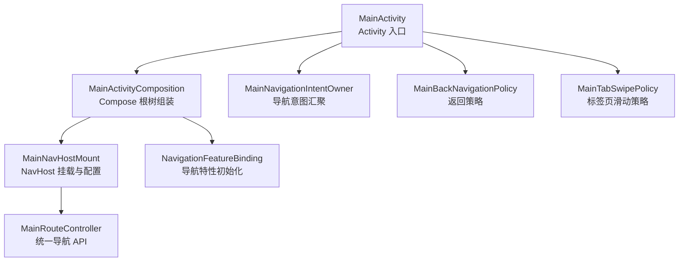
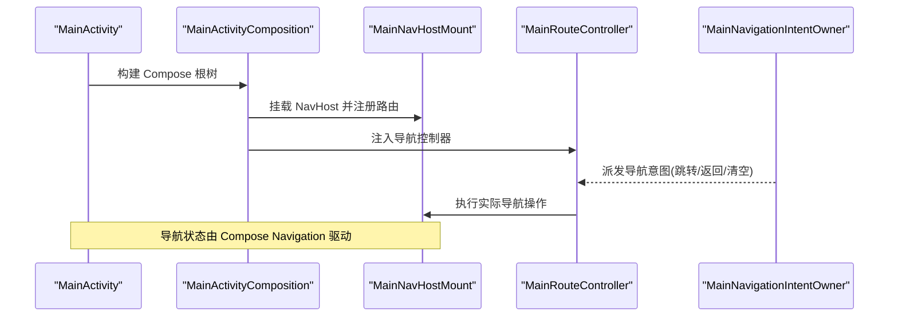
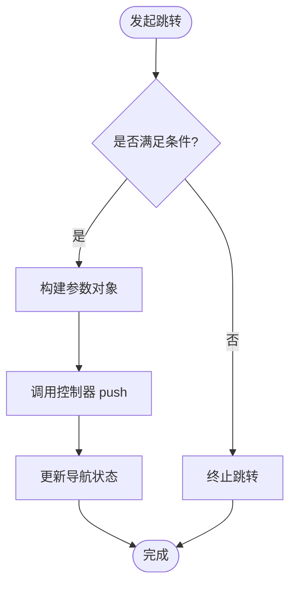
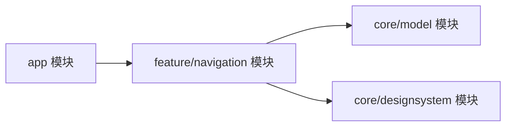

# 导航系统

<cite>
**本文引用的文件**   
- [MainActivity.kt](file://app/src/main/java/app/yukine/MainActivity.kt)
- [MainActivityComposition.kt](file://app/src/main/java/app/yukine/MainActivityComposition.kt)
- [MainNavHostMount.kt](file://app/src/main/java/app/yukine/MainNavHostMount.kt)
- [MainRouteController.kt](file://app/src/main/java/app/yukine/MainRouteController.kt)
- [MainNavigationIntentOwner.kt](file://app/src/main/java/app/yukine/MainNavigationIntentOwner.kt)
- [MainBackNavigationPolicy.kt](file://app/src/main/java/app/yukine/MainBackNavigationPolicy.kt)
- [MainTabSwipePolicy.kt](file://app/src/main/java/app/yukine/MainTabSwipePolicy.kt)
- [NavigationFeatureBinding.kt](file://app/src/main/java/app/yukine/NavigationFeatureBinding.kt)
- [feature/navigation/build.gradle](file://feature/navigation/build.gradle)
</cite>

## 目录
1. [简介](#简介)
2. [项目结构](#项目结构)
3. [核心组件](#核心组件)
4. [架构总览](#架构总览)
5. [详细组件分析](#详细组件分析)
6. [依赖关系分析](#依赖关系分析)
7. [性能考虑](#性能考虑)
8. [故障排查指南](#故障排查指南)
9. [结论](#结论)
10. [附录](#附录)

## 简介
本文件系统化梳理 Echo Android 的导航体系，围绕基于 Jetpack Compose Navigation 的页面路由架构展开，覆盖主导航图设计、路由定义、页面跳转逻辑、底部标签与抽屉导航、条件导航、深链接支持、参数传递、返回栈管理与动画配置等主题。文档同时给出最佳实践与性能优化建议，帮助读者快速理解并高效扩展导航能力。

## 项目结构
Echo 将导航相关能力集中在应用层与 feature/navigation 模块中：
- 应用入口与组合层：MainActivity 负责 Activity 生命周期与 Compose 根树；MainActivityComposition 组织顶层 UI 壳（如脚手架）与导航宿主挂载点。
- 导航宿主挂载：MainNavHostMount 提供 NavHost 的装配与配置位置，集中管理路由注册与动画策略。
- 路由控制器：MainRouteController 暴露统一的导航 API，封装 push/pop/clear 等操作，屏蔽底层实现细节。
- 意图与策略：MainNavigationIntentOwner 聚合来自各处的导航意图；MainBackNavigationPolicy 与 MainTabSwipePolicy 分别处理返回键与标签页滑动策略。
- 特性绑定：NavigationFeatureBinding 在应用启动时完成导航相关的特性初始化与注入。

图表来源
- [MainActivity.kt](file://app/src/main/java/app/yukine/MainActivity.kt)
- [MainActivityComposition.kt](file://app/src/main/java/app/yukine/MainActivityComposition.kt)
- [MainNavHostMount.kt](file://app/src/main/java/app/yukine/MainNavHostMount.kt)
- [MainRouteController.kt](file://app/src/main/java/app/yukine/MainRouteController.kt)
- [MainNavigationIntentOwner.kt](file://app/src/main/java/app/yukine/MainNavigationIntentOwner.kt)
- [MainBackNavigationPolicy.kt](file://app/src/main/java/app/yukine/MainBackNavigationPolicy.kt)
- [MainTabSwipePolicy.kt](file://app/src/main/java/app/yukine/MainTabSwipePolicy.kt)
- [NavigationFeatureBinding.kt](file://app/src/main/java/app/yukine/NavigationFeatureBinding.kt)

章节来源
- [MainActivity.kt](file://app/src/main/java/app/yukine/MainActivity.kt)
- [MainActivityComposition.kt](file://app/src/main/java/app/yukine/MainActivityComposition.kt)
- [MainNavHostMount.kt](file://app/src/main/java/app/yukine/MainNavHostMount.kt)
- [MainRouteController.kt](file://app/src/main/java/app/yukine/MainRouteController.kt)
- [MainNavigationIntentOwner.kt](file://app/src/main/java/app/yukine/MainNavigationIntentOwner.kt)
- [MainBackNavigationPolicy.kt](file://app/src/main/java/app/yukine/MainBackNavigationPolicy.kt)
- [MainTabSwipePolicy.kt](file://app/src/main/java/app/yukine/MainTabSwipePolicy.kt)
- [NavigationFeatureBinding.kt](file://app/src/main/java/app/yukine/NavigationFeatureBinding.kt)

## 核心组件
- MainActivity 与 MainActivityComposition
  - 职责：作为应用入口，创建 Compose 根树，承载脚手架与导航宿主挂载点，协调权限、主题、输入法等全局状态。
  - 关键点：在 Composition 阶段完成 NavHost 挂载与导航控制器注入，确保首次渲染即具备完整导航能力。
- MainNavHostMount
  - 职责：集中定义 NavHost 及其子图（包含底部标签、抽屉、条件分支等），统一管理路由表、参数类型与动画。
  - 关键点：通过模块化方式注册路由，避免单点膨胀；为不同场景提供可插拔的过渡动画策略。
- MainRouteController
  - 职责：对外暴露一致的导航方法（如跳转到某页面、携带参数、返回、清空栈等），内部委托给 Compose Navigation 的 NavController。
  - 关键点：对复杂跳转进行封装，保证调用方无需感知具体路由字符串或参数序列化细节。
- MainNavigationIntentOwner
  - 职责：收集来自 UI、系统事件、后台任务等的导航意图，统一派发至控制器执行。
  - 关键点：解耦业务逻辑与导航实现，便于测试与替换。
- MainBackNavigationPolicy / MainTabSwipePolicy
  - 职责：定制返回键行为与标签页滑动策略，满足产品交互要求。
  - 关键点：与返回栈深度结合，避免误返回或重复入栈。
- NavigationFeatureBinding
  - 职责：在应用启动时完成导航相关特性的初始化与依赖注入。
  - 关键点：确保导航子系统在其它功能使用前已就绪。

章节来源
- [MainActivity.kt](file://app/src/main/java/app/yukine/MainActivity.kt)
- [MainActivityComposition.kt](file://app/src/main/java/app/yukine/MainActivityComposition.kt)
- [MainNavHostMount.kt](file://app/src/main/java/app/yukine/MainNavHostMount.kt)
- [MainRouteController.kt](file://app/src/main/java/app/yukine/MainRouteController.kt)
- [MainNavigationIntentOwner.kt](file://app/src/main/java/app/yukine/MainNavigationIntentOwner.kt)
- [MainBackNavigationPolicy.kt](file://app/src/main/java/app/yukine/MainBackNavigationPolicy.kt)
- [MainTabSwipePolicy.kt](file://app/src/main/java/app/yukine/MainTabSwipePolicy.kt)
- [NavigationFeatureBinding.kt](file://app/src/main/java/app/yukine/NavigationFeatureBinding.kt)

## 架构总览
下图展示了从 Activity 到 NavHost 再到路由控制器的整体流程，以及导航意图的来源与分发路径。

图表来源
- [MainActivity.kt](file://app/src/main/java/app/yukine/MainActivity.kt)
- [MainActivityComposition.kt](file://app/src/main/java/app/yukine/MainActivityComposition.kt)
- [MainNavHostMount.kt](file://app/src/main/java/app/yukine/MainNavHostMount.kt)
- [MainRouteController.kt](file://app/src/main/java/app/yukine/MainRouteController.kt)
- [MainNavigationIntentOwner.kt](file://app/src/main/java/app/yukine/MainNavigationIntentOwner.kt)

## 详细组件分析

### 主导航图与路由定义
- 主导航图位于导航宿主挂载处，采用模块化注册的方式组织路由，便于按功能域拆分与维护。
- 路由定义包括：
  - 基础路由：首页、设置、播放列表等
  - 嵌套路由：底部标签容器、抽屉容器、条件分支容器
  - 动态路由：根据运行时条件决定目标页面
- 参数传递：
  - 使用强类型参数对象，避免字符串拼接错误
  - 对敏感或大数据量参数采用引用 ID + 数据源查询模式
- 动画配置：
  - 针对进入/退出/横向切换/共享元素等场景提供统一动画策略
  - 可通过路由级别覆盖默认动画

章节来源
- [MainNavHostMount.kt](file://app/src/main/java/app/yukine/MainNavHostMount.kt)

### 页面跳转逻辑与统一控制器
- MainRouteController 提供统一 API，屏蔽底层 NavController 差异，简化调用方复杂度。
- 典型操作：
  - 推入新页面：push(route, params)
  - 返回：pop()
  - 清空返回栈：clearStack()
  - 条件跳转：navigateIf(condition, route, params)
- 与意图系统的集成：
  - 所有外部导航请求通过 MainNavigationIntentOwner 汇聚后交由控制器执行，保证一致性与可观测性。

图表来源
- [MainRouteController.kt](file://app/src/main/java/app/yukine/MainRouteController.kt)
- [MainNavigationIntentOwner.kt](file://app/src/main/java/app/yukine/MainNavigationIntentOwner.kt)

章节来源
- [MainRouteController.kt](file://app/src/main/java/app/yukine/MainRouteController.kt)
- [MainNavigationIntentOwner.kt](file://app/src/main/java/app/yukine/MainNavigationIntentOwner.kt)

### 底部标签导航
- 标签容器作为主导航图的顶级子图之一，负责维护当前选中标签与对应页面。
- 与返回栈的关系：
  - 标签切换通常不改变返回栈深度，仅在各自标签内维护独立栈
  - 返回键优先处理当前标签内的返回，若无可返回则回到上一个标签
- 滑动策略：
  - 通过滑动策略组件控制左右滑动时的标签切换与边界行为

章节来源
- [MainNavHostMount.kt](file://app/src/main/java/app/yukine/MainNavHostMount.kt)
- [MainTabSwipePolicy.kt](file://app/src/main/java/app/yukine/MainTabSwipePolicy.kt)

### 抽屉导航
- 抽屉作为侧边导航容器，常用于二级导航或全局入口。
- 与主导航图的关系：
  - 抽屉项点击触发路由跳转，可能进入新的标签或覆盖当前页面
  - 关闭抽屉不影响返回栈，仅隐藏侧边面板
- 与返回键的协同：
  - 当抽屉打开时，返回键优先关闭抽屉；否则走常规返回逻辑

章节来源
- [MainNavHostMount.kt](file://app/src/main/java/app/yukine/MainNavHostMount.kt)
- [MainBackNavigationPolicy.kt](file://app/src/main/java/app/yukine/MainBackNavigationPolicy.kt)

### 条件导航
- 条件导航用于根据用户状态、设备能力或网络情况决定目标页面。
- 常见场景：
  - 未登录跳转到登录页，登录后继续原目标
  - 新功能开关控制是否展示新页面
- 实现要点：
  - 在路由解析阶段进行条件判断
  - 失败路径提供降级方案（如提示或回退到默认页）

章节来源
- [MainNavHostMount.kt](file://app/src/main/java/app/yukine/MainNavHostMount.kt)

### 深链接支持
- 深链接通过系统 URI 或 App Links 直接唤起特定页面。
- 关键步骤：
  - 在清单文件中声明支持的 URI 模式
  - 在导航图中注册对应的 deep link 路由
  - 启动时解析 URI 并执行跳转，必要时携带额外参数
- 注意事项：
  - 处理重复启动与任务栈清理，避免产生多余实例
  - 对缺失参数的深链接提供友好提示或回退

章节来源
- [MainNavHostMount.kt](file://app/src/main/java/app/yukine/MainNavHostMount.kt)

### 导航状态管理与返回栈
- 导航状态由 Compose Navigation 内部管理，上层通过控制器进行读写。
- 返回栈管理：
  - 明确何时入栈、何时替换、何时清空
  - 标签容器内保持独立栈，避免跨标签污染
- 返回键策略：
  - 自定义返回键行为，优先处理抽屉、弹窗等局部状态
  - 在根页面时根据产品策略决定是否退出应用

章节来源
- [MainBackNavigationPolicy.kt](file://app/src/main/java/app/yukine/MainBackNavigationPolicy.kt)
- [MainNavHostMount.kt](file://app/src/main/java/app/yukine/MainNavHostMount.kt)

### 导航动画配置
- 统一动画策略：
  - 进入/退出动画、横向切换、共享元素转场
  - 针对不同路由可覆盖默认动画
- 性能考量：
  - 避免过度复杂的动画导致掉帧
  - 在大列表或媒体页面谨慎使用重型动画

章节来源
- [MainNavHostMount.kt](file://app/src/main/java/app/yukine/MainNavHostMount.kt)

### EchoScaffold 脚手架组件
- 说明：在当前代码库中未发现名为 EchoScaffold 的脚手架组件定义。若该组件属于未来规划或尚未合并的代码，请在相应模块中添加并在导航宿主挂载处集成。
- 建议：
  - 将顶部栏、底部标签、抽屉、内容区与导航宿主解耦，便于复用与测试
  - 在脚手架中集中处理全局导航状态（如抽屉开合、标签选中）

章节来源
- [MainActivityComposition.kt](file://app/src/main/java/app/yukine/MainActivityComposition.kt)
- [MainNavHostMount.kt](file://app/src/main/java/app/yukine/MainNavHostMount.kt)

## 依赖关系分析
- 模块依赖
  - app 模块依赖 feature/navigation 模块以获取导航能力
  - navigation 模块应仅依赖必要的 UI 与模型层，避免反向耦合
- 组件耦合
  - MainRouteController 与 MainNavHostMount 紧密协作，前者为后者提供高层 API
  - MainNavigationIntentOwner 与控制器松耦合，通过接口或事件总线通信

图表来源
- [feature/navigation/build.gradle](file://feature/navigation/build.gradle)

章节来源
- [feature/navigation/build.gradle](file://feature/navigation/build.gradle)

## 性能考虑
- 路由注册与解析
  - 将路由按功能域拆分，减少单次解析开销
  - 对热点路由建立缓存映射，避免重复计算
- 参数传递
  - 大对象使用 ID 引用而非直接序列化传输
  - 避免在路由参数中传递频繁变更的状态
- 动画与过渡
  - 选择轻量级动画，避免在低端设备上造成卡顿
  - 对长列表页面禁用重型转场
- 返回栈管理
  - 合理使用 replace 与 clearStack，防止栈过深导致内存压力
  - 标签容器内维护独立栈，避免不必要的重建

## 故障排查指南
- 常见问题
  - 深链接无法命中：检查清单声明与导航图中的 deep link 路由是否匹配
  - 参数丢失或类型错误：确认参数对象构造与反序列化的完整性
  - 返回键行为异常：核对返回策略与抽屉/弹窗状态的优先级
  - 标签切换导致页面重建：检查标签容器的保留策略与状态提升
- 定位手段
  - 在控制器入口处打印导航日志，记录路由、参数与调用栈
  - 使用 Compose Navigation 的调试工具观察当前导航栈
  - 针对条件导航增加失败路径的日志输出

章节来源
- [MainRouteController.kt](file://app/src/main/java/app/yukine/MainRouteController.kt)
- [MainBackNavigationPolicy.kt](file://app/src/main/java/app/yukine/MainBackNavigationPolicy.kt)
- [MainNavHostMount.kt](file://app/src/main/java/app/yukine/MainNavHostMount.kt)

## 结论
Echo 的导航系统以 Compose Navigation 为核心，通过统一的控制器与清晰的挂载点实现了可扩展、可维护的路由架构。底部标签与抽屉导航、条件导航与深链接均得到良好支持。遵循本文的最佳实践与性能建议，可在保证用户体验的同时，持续演进导航能力。

## 附录
- 最佳实践清单
  - 使用强类型参数对象，避免字符串拼接
  - 将导航意图与业务逻辑解耦，便于测试与替换
  - 为不同路由配置合适的动画策略，兼顾体验与性能
  - 合理划分标签容器与返回栈，避免状态污染
  - 深链接需处理重复启动与任务栈清理
- 参考文件
  - 入口与组合：[MainActivity.kt](file://app/src/main/java/app/yukine/MainActivity.kt)、[MainActivityComposition.kt](file://app/src/main/java/app/yukine/MainActivityComposition.kt)
  - 导航宿主与路由：[MainNavHostMount.kt](file://app/src/main/java/app/yukine/MainNavHostMount.kt)
  - 控制器与意图：[MainRouteController.kt](file://app/src/main/java/app/yukine/MainRouteController.kt)、[MainNavigationIntentOwner.kt](file://app/src/main/java/app/yukine/MainNavigationIntentOwner.kt)
  - 策略与特性：[MainBackNavigationPolicy.kt](file://app/src/main/java/app/yukine/MainBackNavigationPolicy.kt)、[MainTabSwipePolicy.kt](file://app/src/main/java/app/yukine/MainTabSwipePolicy.kt)、[NavigationFeatureBinding.kt](file://app/src/main/java/app/yukine/NavigationFeatureBinding.kt)
  - 模块依赖：[feature/navigation/build.gradle](file://feature/navigation/build.gradle)