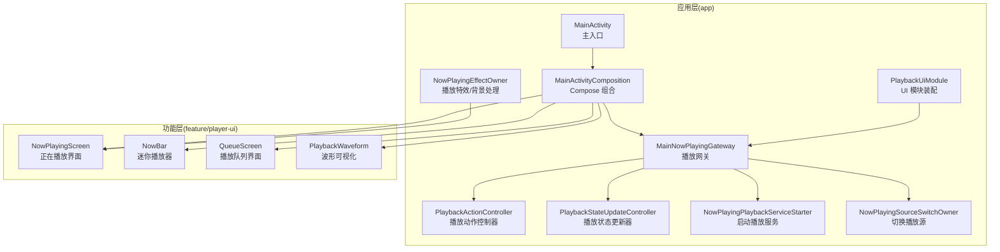
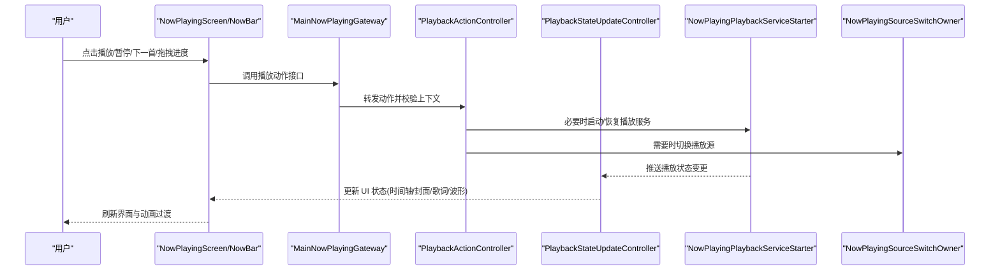
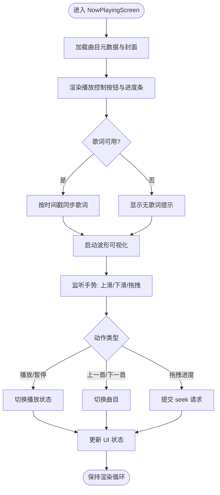
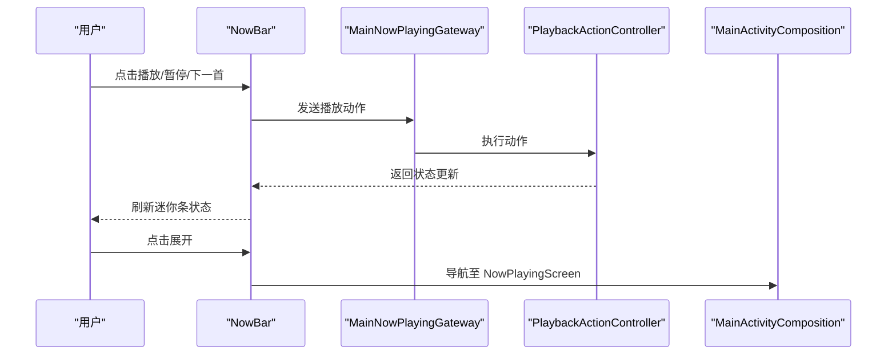
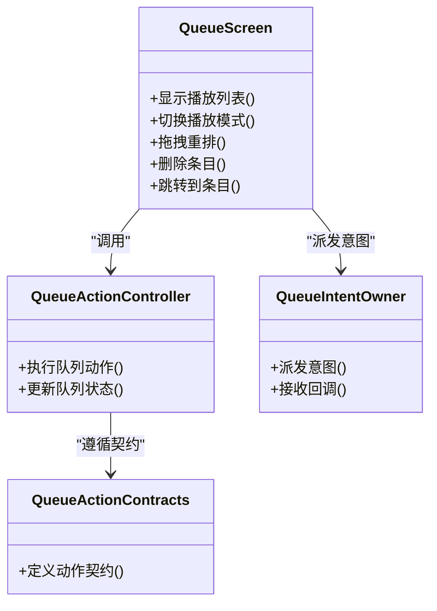
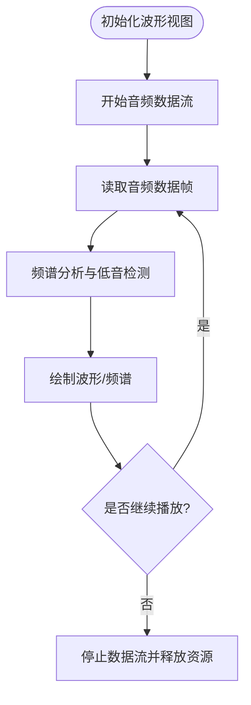
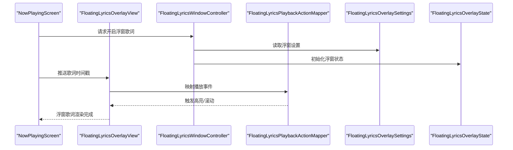
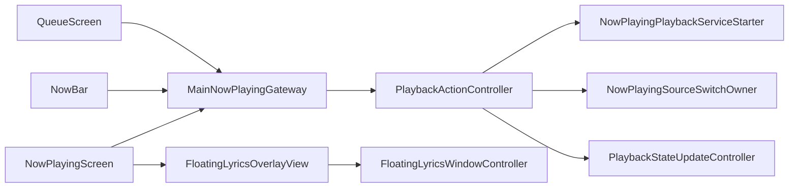

# 播放器界面

<cite>
**本文引用的文件**   
- [MainActivity.kt](file://app/src/main/java/app/yukine/MainActivity.kt)
- [MainActivityComposition.kt](file://app/src/main/java/app/yukine/MainActivityComposition.kt)
- [MainNowPlayingGateway.kt](file://app/src/main/java/app/yukine/MainNowPlayingGateway.kt)
- [PlaybackUiModule.kt](file://app/src/main/java/app/yukine/PlaybackUiModule.kt)
- [NowPlayingEffectOwner.kt](file://app/src/main/java/app/yukine/NowPlayingEffectOwner.kt)
- [NowPlayingPlaybackServiceStarter.kt](file://app/src/main/java/app/yukine/NowPlayingPlaybackServiceStarter.kt)
- [NowPlayingSourceSwitchOwner.kt](file://app/src/main/java/app/yukine/NowPlayingSourceSwitchOwner.kt)
- [PlaybackActionController.kt](file://app/src/main/java/app/yukine/PlaybackActionController.kt)
- [PlaybackStateUpdateController.kt](file://app/src/main/java/app/yukine/PlaybackStateUpdateController.kt)
- [PlaybackViewModelTest.kt](file://app/src/test/java/app/yukine/playback/PlaybackViewModelTest.kt)
- [NowPlayingEffectOwnerTest.kt](file://app/src/test/java/app/yukine/NowPlayingEffectOwnerTest.kt)
- [NowPlayingViewModelTest.kt](file://app/src/test/java/app/yukine/now/NowPlayingViewModelTest.kt)
- [QueueActionController.kt](file://app/src/main/java/app/yukine/QueueActionController.kt)
- [QueueIntentOwner.kt](file://app/src/main/java/app/yukine/QueueIntentOwner.kt)
- [QueueActionContracts.kt](file://app/src/main/java/app/yukine/QueueActionContracts.kt)
- [FloatingLyricsOverlayView.kt](file://app/src/main/java/app/yukine/FloatingLyricsOverlayView.kt)
- [FloatingLyricsWindowController.kt](file://app/src/main/java/app/yukine/FloatingLyricsWindowController.kt)
- [FloatingLyricsPlaybackActionMapper.kt](file://app/src/main/java/app/yukine/FloatingLyricsPlaybackActionMapper.kt)
- [FloatingLyricsOverlaySettings.kt](file://app/src/main/java/app/yukine/FloatingLyricsOverlaySettings.kt)
- [FloatingLyricsOverlayState.kt](file://app/src/main/java/app/yukine/FloatingLyricsOverlayState.kt)
- [PlaybackWaveform.kt](file://feature/player-ui/src/main/java/app/yukine/ui/PlaybackWaveform.kt)
- [NowBar.kt](file://feature/player-ui/src/main/java/app/yukine/ui/NowBar.kt)
- [NowPlayingScreen.kt](file://feature/player-ui/src/main/java/app/yukine/ui/NowPlayingScreen.kt)
- [QueueScreen.kt](file://feature/player-ui/src/main/java/app/yukine/ui/QueueScreen.kt)
</cite>

## 目录
1. [简介](#简介)
2. [项目结构](#项目结构)
3. [核心组件](#核心组件)
4. [架构总览](#架构总览)
5. [详细组件分析](#详细组件分析)
6. [依赖关系分析](#依赖关系分析)
7. [性能考量](#性能考量)
8. [故障排查指南](#故障排查指南)
9. [结论](#结论)
10. [附录](#附录)

## 简介
本文件聚焦于播放器界面的设计与实现，覆盖以下关键能力：
- 正在播放界面 NowPlayingScreen、迷你播放器 NowBar、播放队列 QueueScreen、波形可视化 PlaybackWaveform
- 播放控制按钮、进度条拖拽、歌词同步显示、专辑封面展示
- 手势识别、触摸反馈、动画过渡效果
- 实时频谱分析、低音检测、音频可视化渲染
- 播放器交互模式、用户自定义选项、无障碍访问支持

文档以“从用户可见界面到内部状态与数据流”的层次展开，既帮助开发者快速定位实现位置，也便于非技术读者理解整体交互流程。

## 项目结构
播放器相关代码主要分布在两个模块：
- app 层：负责导航、入口、与播放服务/宿主通信、UI 组合与生命周期管理
- feature/player-ui 层：提供可复用的播放器 UI 组件（屏幕、迷你条、波形等）

图表来源
- [MainActivity.kt:1-120](file://app/src/main/java/app/yukine/MainActivity.kt#L1-L120)
- [MainActivityComposition.kt:1-200](file://app/src/main/java/app/yukine/MainActivityComposition.kt#L1-L200)
- [MainNowPlayingGateway.kt:1-200](file://app/src/main/java/app/yukine/MainNowPlayingGateway.kt#L1-L200)
- [PlaybackUiModule.kt:1-120](file://app/src/main/java/app/yukine/PlaybackUiModule.kt#L1-L120)
- [PlaybackActionController.kt:1-200](file://app/src/main/java/app/yukine/PlaybackActionController.kt#L1-L200)
- [PlaybackStateUpdateController.kt:1-200](file://app/src/main/java/app/yukine/PlaybackStateUpdateController.kt#L1-L200)
- [NowPlayingEffectOwner.kt:1-200](file://app/src/main/java/app/yukine/NowPlayingEffectOwner.kt#L1-L200)
- [NowPlayingPlaybackServiceStarter.kt:1-120](file://app/src/main/java/app/yukine/NowPlayingPlaybackServiceStarter.kt#L1-L120)
- [NowPlayingSourceSwitchOwner.kt:1-120](file://app/src/main/java/app/yukine/NowPlayingSourceSwitchOwner.kt#L1-L120)
- [NowPlayingScreen.kt:1-200](file://feature/player-ui/src/main/java/app/yukine/ui/NowPlayingScreen.kt#L1-L200)
- [NowBar.kt:1-200](file://feature/player-ui/src/main/java/app/yukine/ui/NowBar.kt#L1-L200)
- [QueueScreen.kt:1-200](file://feature/player-ui/src/main/java/app/yukine/ui/QueueScreen.kt#L1-L200)
- [PlaybackWaveform.kt:1-200](file://feature/player-ui/src/main/java/app/yukine/ui/PlaybackWaveform.kt#L1-L200)

章节来源
- [MainActivity.kt:1-120](file://app/src/main/java/app/yukine/MainActivity.kt#L1-L120)
- [MainActivityComposition.kt:1-200](file://app/src/main/java/app/yukine/MainActivityComposition.kt#L1-L200)
- [PlaybackUiModule.kt:1-120](file://app/src/main/java/app/yukine/PlaybackUiModule.kt#L1-L120)

## 核心组件
- 正在播放界面 NowPlayingScreen：承载当前曲目信息、专辑封面、歌词同步、播放控制按钮、进度条拖拽、波形可视化、全屏/退出全屏动画过渡
- 迷你播放器 NowBar：常驻底部或悬浮态的轻量播放控件，支持最小化播放、快捷切歌、进度预览
- 播放队列 QueueScreen：展示当前播放列表、顺序/随机/单曲循环、拖动排序、删除、跳转播放
- 波形可视化 PlaybackWaveform：基于实时音频数据的频谱/波形绘制，支持低音增强指示、动态颜色与缩放

章节来源
- [NowPlayingScreen.kt:1-200](file://feature/player-ui/src/main/java/app/yukine/ui/NowPlayingScreen.kt#L1-L200)
- [NowBar.kt:1-200](file://feature/player-ui/src/main/java/app/yukine/ui/NowBar.kt#L1-L200)
- [QueueScreen.kt:1-200](file://feature/player-ui/src/main/java/app/yukine/ui/QueueScreen.kt#L1-L200)
- [PlaybackWaveform.kt:1-200](file://feature/player-ui/src/main/java/app/yukine/ui/PlaybackWaveform.kt#L1-L200)

## 架构总览
播放器界面采用“UI 组件 + 状态控制器 + 网关/宿主”的分层设计：
- UI 层：NowPlayingScreen、NowBar、QueueScreen、PlaybackWaveform 通过 Compose 组合呈现
- 状态与控制层：PlaybackActionController 处理用户操作；PlaybackStateUpdateController 将底层播放状态映射为 UI 状态
- 网关与宿主：MainNowPlayingGateway 统一对外暴露播放能力；NowPlayingPlaybackServiceStarter 负责启动/绑定播放服务；NowPlayingSourceSwitchOwner 负责切换播放源
- 特效与背景：NowPlayingEffectOwner 根据当前播放内容驱动背景/动效

图表来源
- [MainNowPlayingGateway.kt:1-200](file://app/src/main/java/app/yukine/MainNowPlayingGateway.kt#L1-L200)
- [PlaybackActionController.kt:1-200](file://app/src/main/java/app/yukine/PlaybackActionController.kt#L1-L200)
- [PlaybackStateUpdateController.kt:1-200](file://app/src/main/java/app/yukine/PlaybackStateUpdateController.kt#L1-L200)
- [NowPlayingPlaybackServiceStarter.kt:1-120](file://app/src/main/java/app/yukine/NowPlayingPlaybackServiceStarter.kt#L1-L120)
- [NowPlayingSourceSwitchOwner.kt:1-120](file://app/src/main/java/app/yukine/NowPlayingSourceSwitchOwner.kt#L1-L120)
- [NowPlayingScreen.kt:1-200](file://feature/player-ui/src/main/java/app/yukine/ui/NowPlayingScreen.kt#L1-L200)
- [NowBar.kt:1-200](file://feature/player-ui/src/main/java/app/yukine/ui/NowBar.kt#L1-L200)

## 详细组件分析

### 正在播放界面 NowPlayingScreen
- 职责
  - 展示当前曲目元数据、专辑封面、歌词同步、播放控制按钮、进度条拖拽、波形可视化
  - 管理全屏/退出全屏的过渡动画与手势交互
- 关键交互
  - 播放控制按钮：播放/暂停、上一首/下一首、收藏、分享、打开队列
  - 进度条拖拽：长按/滑动调整播放位置，释放后提交 seek
  - 歌词同步：按时间戳滚动高亮当前行，支持双击/长按触发浮窗歌词
  - 专辑封面：加载策略、占位图、圆角/阴影、点击放大预览
  - 波形可视化：嵌入在界面中，随播放实时更新
- 手势与动画
  - 上滑进入全屏、下滑退出全屏
  - 封面旋转/缩放动画
  - 歌词行淡入淡出与平滑滚动
- 错误与边界
  - 无歌词/歌词解析失败时的降级显示
  - 封面加载失败回退默认图
  - 进度条拖拽中断与网络缓冲提示

图表来源
- [NowPlayingScreen.kt:1-200](file://feature/player-ui/src/main/java/app/yukine/ui/NowPlayingScreen.kt#L1-L200)
- [PlaybackActionController.kt:1-200](file://app/src/main/java/app/yukine/PlaybackActionController.kt#L1-L200)
- [PlaybackStateUpdateController.kt:1-200](file://app/src/main/java/app/yukine/PlaybackStateUpdateController.kt#L1-L200)
- [PlaybackWaveform.kt:1-200](file://feature/player-ui/src/main/java/app/yukine/ui/PlaybackWaveform.kt#L1-L200)

章节来源
- [NowPlayingScreen.kt:1-200](file://feature/player-ui/src/main/java/app/yukine/ui/NowPlayingScreen.kt#L1-L200)
- [PlaybackActionController.kt:1-200](file://app/src/main/java/app/yukine/PlaybackActionController.kt#L1-L200)
- [PlaybackStateUpdateController.kt:1-200](file://app/src/main/java/app/yukine/PlaybackStateUpdateController.kt#L1-L200)
- [PlaybackWaveform.kt:1-200](file://feature/player-ui/src/main/java/app/yukine/ui/PlaybackWaveform.kt#L1-L200)

### 迷你播放器 NowBar
- 职责
  - 常驻底部或悬浮态的轻量播放控件，显示当前曲目缩略信息与基础控制
- 关键交互
  - 点击展开至 NowPlayingScreen
  - 播放/暂停、下一首、关闭
  - 短按/长按不同行为（如长按弹出更多操作）
- 状态联动
  - 与 MainNowPlayingGateway 同步播放状态
  - 与 QueueScreen 联动，支持从迷你条直接打开队列

图表来源
- [NowBar.kt:1-200](file://feature/player-ui/src/main/java/app/yukine/ui/NowBar.kt#L1-L200)
- [MainNowPlayingGateway.kt:1-200](file://app/src/main/java/app/yukine/MainNowPlayingGateway.kt#L1-L200)
- [PlaybackActionController.kt:1-200](file://app/src/main/java/app/yukine/PlaybackActionController.kt#L1-L200)
- [MainActivityComposition.kt:1-200](file://app/src/main/java/app/yukine/MainActivityComposition.kt#L1-L200)

章节来源
- [NowBar.kt:1-200](file://feature/player-ui/src/main/java/app/yukine/ui/NowBar.kt#L1-L200)
- [MainActivityComposition.kt:1-200](file://app/src/main/java/app/yukine/MainActivityComposition.kt#L1-L200)

### 播放队列 QueueScreen
- 职责
  - 展示当前播放列表、顺序/随机/单曲循环模式、拖动排序、删除条目、跳转到指定曲目
- 关键交互
  - 点击条目播放
  - 长按弹出菜单（删除、移动到顶部/底部）
  - 拖拽重排
  - 模式切换（顺序/随机/单曲循环）
- 状态联动
  - 与 PlaybackActionController 协作执行队列操作
  - 与 NowPlayingScreen 共享当前播放项

图表来源
- [QueueScreen.kt:1-200](file://feature/player-ui/src/main/java/app/yukine/ui/QueueScreen.kt#L1-L200)
- [QueueActionController.kt:1-200](file://app/src/main/java/app/yukine/QueueActionController.kt#L1-L200)
- [QueueIntentOwner.kt:1-200](file://app/src/main/java/app/yukine/QueueIntentOwner.kt#L1-L200)
- [QueueActionContracts.kt:1-200](file://app/src/main/java/app/yukine/QueueActionContracts.kt#L1-L200)

章节来源
- [QueueScreen.kt:1-200](file://feature/player-ui/src/main/java/app/yukine/ui/QueueScreen.kt#L1-L200)
- [QueueActionController.kt:1-200](file://app/src/main/java/app/yukine/QueueActionController.kt#L1-L200)
- [QueueIntentOwner.kt:1-200](file://app/src/main/java/app/yukine/QueueIntentOwner.kt#L1-L200)
- [QueueActionContracts.kt:1-200](file://app/src/main/java/app/yukine/QueueActionContracts.kt#L1-L200)

### 波形可视化 PlaybackWaveform
- 职责
  - 基于实时音频数据进行频谱/波形绘制，支持低音增强指示、动态颜色与缩放
- 关键特性
  - 实时渲染：每帧读取音频数据并更新图形
  - 低音检测：对低频段能量进行阈值判断，用于视觉强调
  - 自适应布局：适配不同屏幕尺寸与方向
- 性能优化
  - 使用高效绘图 API，避免频繁分配对象
  - 按需采样与降采样，降低 CPU/GPU 压力
  - 节流更新频率，保证流畅度

图表来源
- [PlaybackWaveform.kt:1-200](file://feature/player-ui/src/main/java/app/yukine/ui/PlaybackWaveform.kt#L1-L200)

章节来源
- [PlaybackWaveform.kt:1-200](file://feature/player-ui/src/main/java/app/yukine/ui/PlaybackWaveform.kt#L1-L200)

### 歌词同步与浮窗歌词
- 歌词同步
  - 基于时间戳逐行高亮，支持平滑滚动与淡入淡出
  - 无歌词或解析失败时降级显示
- 浮窗歌词
  - FloatingLyricsOverlayView 负责悬浮窗口绘制
  - FloatingLyricsWindowController 管理窗口生命周期与权限
  - FloatingLyricsPlaybackActionMapper 将播放事件映射为浮窗动作
  - FloatingLyricsOverlaySettings 与 FloatingLyricsOverlayState 管理设置与状态

图表来源
- [FloatingLyricsOverlayView.kt:1-200](file://app/src/main/java/app/yukine/FloatingLyricsOverlayView.kt#L1-L200)
- [FloatingLyricsWindowController.kt:1-200](file://app/src/main/java/app/yukine/FloatingLyricsWindowController.kt#L1-L200)
- [FloatingLyricsPlaybackActionMapper.kt:1-200](file://app/src/main/java/app/yukine/FloatingLyricsPlaybackActionMapper.kt#L1-L200)
- [FloatingLyricsOverlaySettings.kt:1-200](file://app/src/main/java/app/yukine/FloatingLyricsOverlaySettings.kt#L1-L200)
- [FloatingLyricsOverlayState.kt:1-200](file://app/src/main/java/app/yukine/FloatingLyricsOverlayState.kt#L1-L200)

章节来源
- [FloatingLyricsOverlayView.kt:1-200](file://app/src/main/java/app/yukine/FloatingLyricsOverlayView.kt#L1-L200)
- [FloatingLyricsWindowController.kt:1-200](file://app/src/main/java/app/yukine/FloatingLyricsWindowController.kt#L1-L200)
- [FloatingLyricsPlaybackActionMapper.kt:1-200](file://app/src/main/java/app/yukine/FloatingLyricsPlaybackActionMapper.kt#L1-L200)
- [FloatingLyricsOverlaySettings.kt:1-200](file://app/src/main/java/app/yukine/FloatingLyricsOverlaySettings.kt#L1-L200)
- [FloatingLyricsOverlayState.kt:1-200](file://app/src/main/java/app/yukine/FloatingLyricsOverlayState.kt#L1-L200)

## 依赖关系分析
- 组件耦合
  - NowPlayingScreen/NowBar/QueueScreen 均依赖 MainNowPlayingGateway 获取播放能力
  - PlaybackActionController 作为动作中枢，协调服务启动、源切换与状态更新
  - PlaybackStateUpdateController 将底层状态转换为 UI 状态，供各屏幕消费
- 外部集成点
  - 播放服务启动与绑定由 NowPlayingPlaybackServiceStarter 负责
  - 播放源切换由 NowPlayingSourceSwitchOwner 负责
  - 浮窗歌词涉及系统窗口权限与悬浮窗生命周期

图表来源
- [NowPlayingScreen.kt:1-200](file://feature/player-ui/src/main/java/app/yukine/ui/NowPlayingScreen.kt#L1-L200)
- [NowBar.kt:1-200](file://feature/player-ui/src/main/java/app/yukine/ui/NowBar.kt#L1-L200)
- [QueueScreen.kt:1-200](file://feature/player-ui/src/main/java/app/yukine/ui/QueueScreen.kt#L1-L200)
- [MainNowPlayingGateway.kt:1-200](file://app/src/main/java/app/yukine/MainNowPlayingGateway.kt#L1-L200)
- [PlaybackActionController.kt:1-200](file://app/src/main/java/app/yukine/PlaybackActionController.kt#L1-L200)
- [NowPlayingPlaybackServiceStarter.kt:1-120](file://app/src/main/java/app/yukine/NowPlayingPlaybackServiceStarter.kt#L1-L120)
- [NowPlayingSourceSwitchOwner.kt:1-120](file://app/src/main/java/app/yukine/NowPlayingSourceSwitchOwner.kt#L1-L120)
- [PlaybackStateUpdateController.kt:1-200](file://app/src/main/java/app/yukine/PlaybackStateUpdateController.kt#L1-L200)
- [FloatingLyricsOverlayView.kt:1-200](file://app/src/main/java/app/yukine/FloatingLyricsOverlayView.kt#L1-L200)
- [FloatingLyricsWindowController.kt:1-200](file://app/src/main/java/app/yukine/FloatingLyricsWindowController.kt#L1-L200)

章节来源
- [MainNowPlayingGateway.kt:1-200](file://app/src/main/java/app/yukine/MainNowPlayingGateway.kt#L1-L200)
- [PlaybackActionController.kt:1-200](file://app/src/main/java/app/yukine/PlaybackActionController.kt#L1-L200)
- [PlaybackStateUpdateController.kt:1-200](file://app/src/main/java/app/yukine/PlaybackStateUpdateController.kt#L1-L200)

## 性能考量
- 波形渲染
  - 合理采样率与降采样策略，避免每帧全量计算
  - 使用高效的绘图 API，减少对象分配与 GC 压力
  - 在后台或锁屏时降低更新频率或暂停渲染
- 封面加载
  - 启用磁盘缓存与内存缓存，避免重复 IO
  - 占位图与渐进式加载提升感知性能
- 歌词同步
  - 时间戳索引与二分查找提高匹配效率
  - 滚动节流与增量更新减少重绘
- 状态更新
  - 批量合并状态变更，避免频繁重组
  - 使用不可变状态与 diff 算法减少不必要的重建

[本节为通用性能建议，不直接分析具体文件]

## 故障排查指南
- 常见问题
  - 播放无法启动：检查 NowPlayingPlaybackServiceStarter 的启动流程与服务绑定状态
  - 状态不同步：确认 PlaybackStateUpdateController 的状态映射逻辑与订阅是否正确
  - 歌词不显示：验证歌词解析与时间戳格式，检查浮窗歌词权限与窗口创建
  - 波形卡顿：降低采样率或更新频率，检查 GPU/CPU 占用
- 调试要点
  - 在 PlaybackActionController 中记录动作序列与异常
  - 在 PlaybackStateUpdateController 中输出状态快照
  - 在 NowPlayingEffectOwner 中观察背景/特效触发条件
- 测试参考
  - PlaybackViewModelTest 提供播放状态断言示例
  - NowPlayingEffectOwnerTest 验证特效/背景逻辑
  - NowPlayingViewModelTest 验证正在播放界面状态机

章节来源
- [PlaybackActionController.kt:1-200](file://app/src/main/java/app/yukine/PlaybackActionController.kt#L1-L200)
- [PlaybackStateUpdateController.kt:1-200](file://app/src/main/java/app/yukine/PlaybackStateUpdateController.kt#L1-L200)
- [NowPlayingEffectOwner.kt:1-200](file://app/src/main/java/app/yukine/NowPlayingEffectOwner.kt#L1-L200)
- [PlaybackViewModelTest.kt:1-200](file://app/src/test/java/app/yukine/playback/PlaybackViewModelTest.kt#L1-L200)
- [NowPlayingEffectOwnerTest.kt:1-200](file://app/src/test/java/app/yukine/NowPlayingEffectOwnerTest.kt#L1-L200)
- [NowPlayingViewModelTest.kt:1-200](file://app/src/test/java/app/yukine/now/NowPlayingViewModelTest.kt#L1-L200)

## 结论
播放器界面通过清晰的组件分层与明确的状态流转，实现了丰富的交互体验与高性能的可视化渲染。NowPlayingScreen、NowBar、QueueScreen 与 PlaybackWaveform 各司其职，配合 MainNowPlayingGateway 与 PlaybackActionController 形成稳定的控制中枢。歌词同步与浮窗歌词增强了沉浸感，而波形可视化提供了直观的听觉反馈。建议在后续迭代中持续优化采样与渲染策略，完善无障碍支持与用户自定义选项，以提升整体用户体验。

[本节为总结性内容，不直接分析具体文件]

## 附录
- 用户自定义选项
  - 波形样式与颜色主题
  - 歌词字体大小与对齐方式
  - 浮窗歌词透明度与位置
- 无障碍访问支持
  - 所有按钮与控件提供内容描述
  - 支持键盘导航与 TalkBack 朗读
  - 对比度与色彩模式适配
- 交互模式
  - 标准模式：NowPlayingScreen 为主交互入口
  - 迷你模式：NowBar 常驻，快速控制
  - 队列模式：QueueScreen 管理播放列表

[本节为概念性说明，不直接分析具体文件]