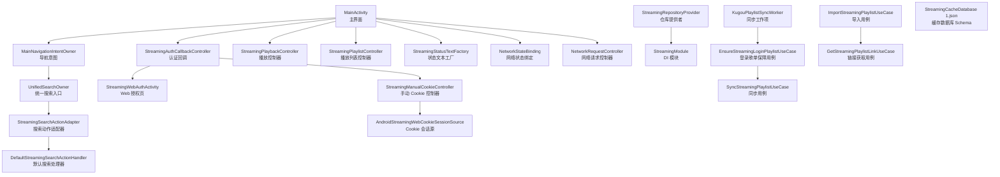
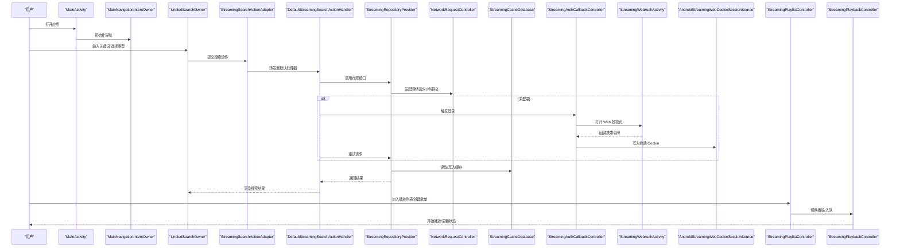
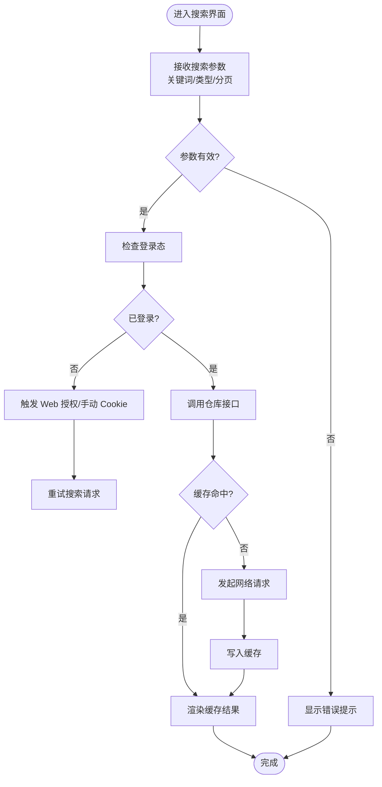
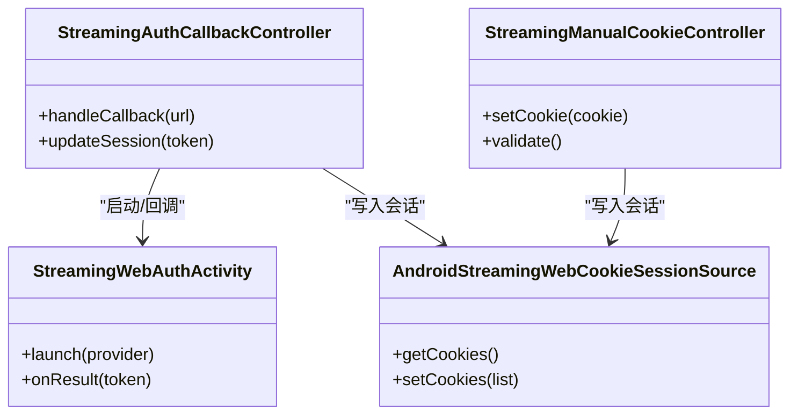
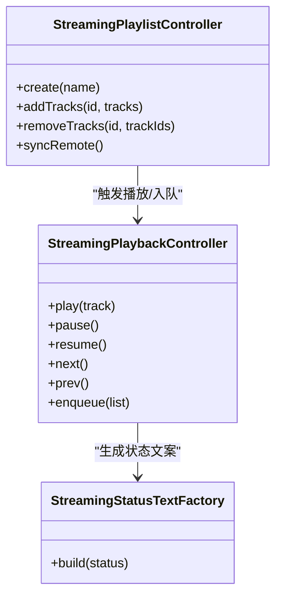
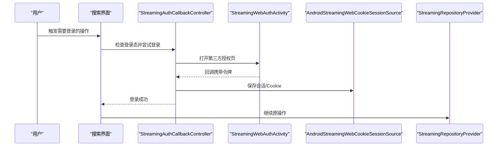
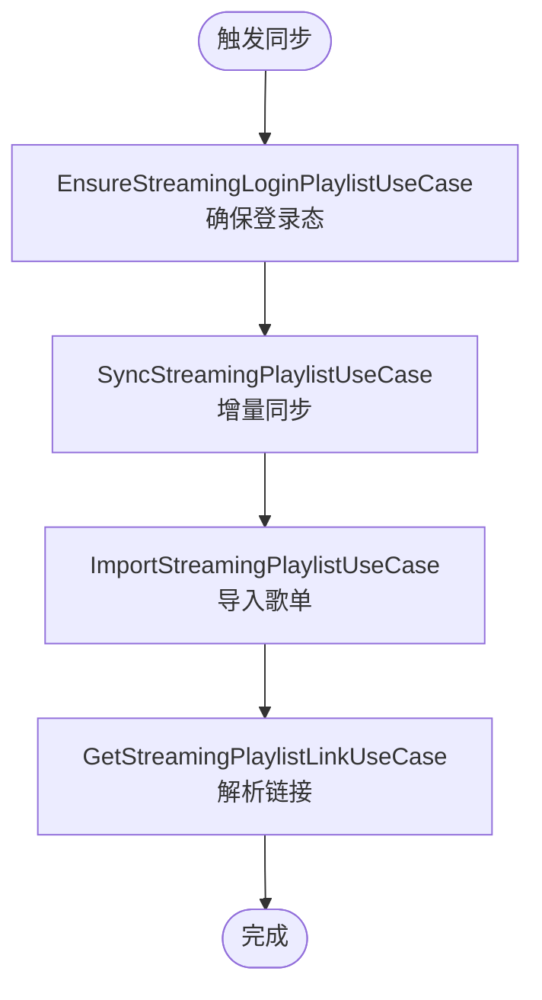
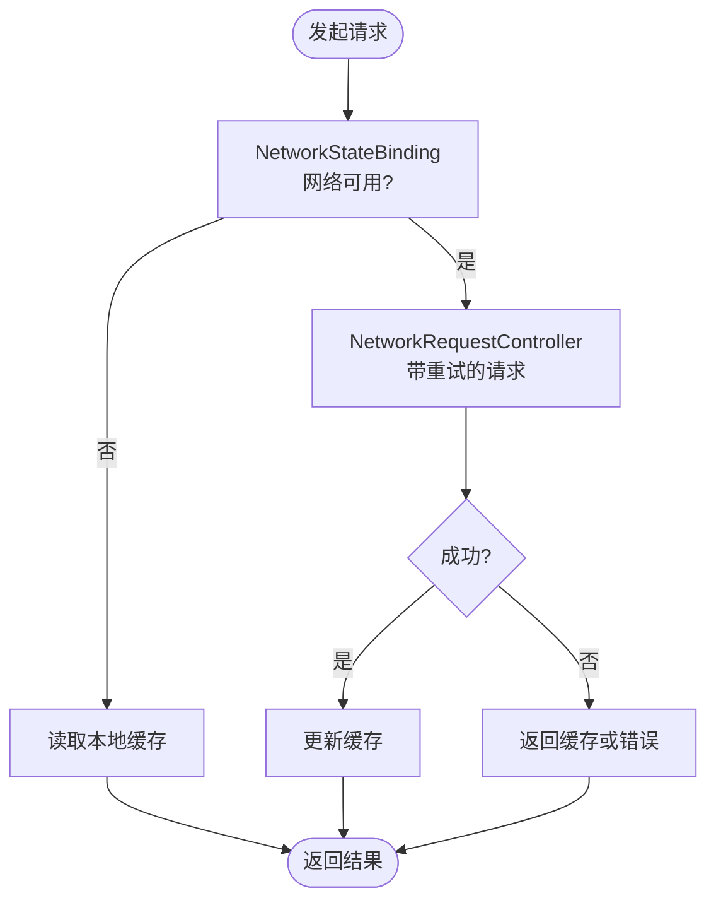
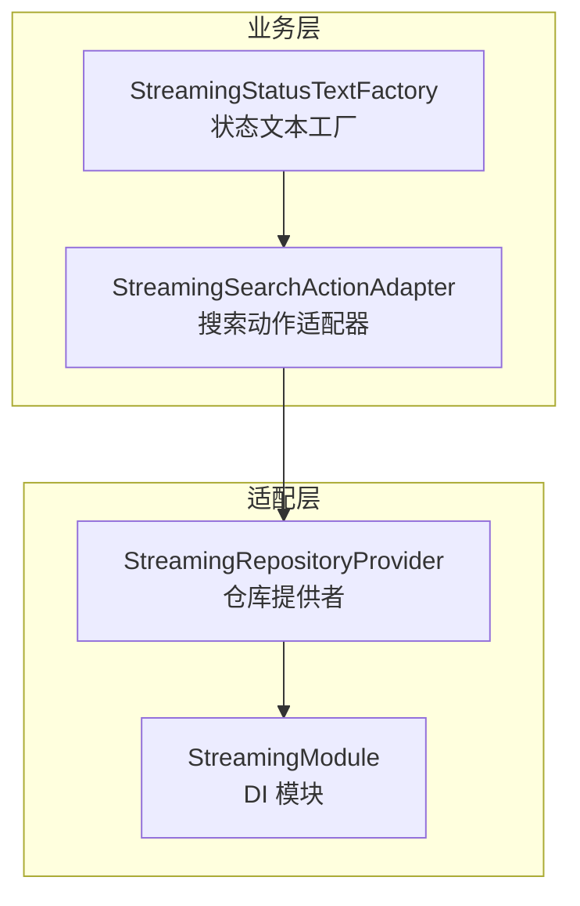
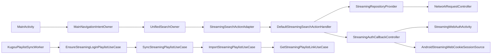

# 流媒体界面

<cite>
**本文引用的文件**   
- [MainActivity.kt](file://app/src/main/java/app/yukine/MainActivity.kt)
- [MainNavigationIntentOwner.kt](file://app/src/main/java/app/yukine/MainNavigationIntentOwner.kt)
- [StreamingSearchActionAdapter.kt](file://app/src/main/java/app/yukine/StreamingSearchActionAdapter.kt)
- [DefaultStreamingSearchActionHandler.kt](file://app/src/main/java/app/yukine/DefaultStreamingSearchActionHandler.kt)
- [UnifiedSearchOwner.kt](file://app/src/main/java/app/yukine/UnifiedSearchOwner.kt)
- [StreamingAuthCallbackController.kt](file://app/src/main/java/app/yukine/StreamingAuthCallbackController.kt)
- [StreamingWebAuthActivity.kt](file://app/src/main/java/app/yukine/StreamingWebAuthActivity.kt)
- [StreamingManualCookieController.kt](file://app/src/main/java/app/yukine/StreamingManualCookieController.kt)
- [AndroidStreamingWebCookieSessionSource.kt](file://app/src/main/java/app/yukine/AndroidStreamingWebCookieSessionSource.kt)
- [EnsureStreamingLoginPlaylistUseCase.kt](file://app/src/main/java/app/yukine/EnsureStreamingLoginPlaylistUseCase.kt)
- [SyncStreamingPlaylistUseCase.kt](file://app/src/main/java/app/yukine/SyncStreamingPlaylistUseCase.kt)
- [ImportStreamingPlaylistUseCase.kt](file://app/src/main/java/app/yukine/ImportStreamingPlaylistUseCase.kt)
- [GetStreamingPlaylistLinkUseCase.kt](file://app/src/main/java/app/yukine/GetStreamingPlaylistLinkUseCase.kt)
- [KugouPlaylistSyncWorker.kt](file://app/src/main/java/app/yukine/KugouPlaylistSyncWorker.kt)
- [StreamingRepositoryProvider.kt](file://app/src/main/java/app/yukine/StreamingRepositoryProvider.kt)
- [StreamingModule.kt](file://app/src/main/java/app/yukine/StreamingModule.kt)
- [NetworkStateBinding.kt](file://app/src/main/java/app/yukine/NetworkStateBinding.kt)
- [NetworkRequestController.kt](file://app/src/main/java/app/yukine/NetworkRequestController.kt)
- [StreamingPlaybackController.kt](file://app/src/main/java/app/yukine/StreamingPlaybackController.kt)
- [StreamingPlaylistController.kt](file://app/src/main/java/app/yukine/StreamingPlaylistController.kt)
- [StreamingStatusTextFactory.kt](file://app/src/main/java/app/yukine/StreamingStatusTextFactory.kt)
- [StreamingFeatureBinding.java](file://app/src/main/java/app/yukine/StreamingFeatureBinding.java)
- [StreamingCacheDatabase 1.json](file://app/schemas/app.yukine.streaming.cache.StreamingCacheDatabase/1.json)
</cite>

## 目录
1. [简介](#简介)
2. [项目结构](#项目结构)
3. [核心组件](#核心组件)
4. [架构总览](#架构总览)
5. [详细组件分析](#详细组件分析)
6. [依赖关系分析](#依赖关系分析)
7. [性能与网络优化](#性能与网络优化)
8. [故障排查指南](#故障排查指南)
9. [结论](#结论)

## 简介
本文件聚焦于“流媒体界面”的在线音乐搜索、认证状态管理、数据协调与播放控制，覆盖多平台登录流程、在线浏览与播放列表同步、搜索结果展示、网络状态处理、错误重试与缓存策略，以及流媒体提供商适配、内容过滤与个性化推荐展示。文档以代码级事实为依据，提供可视化架构图与流程图，帮助开发者快速理解并扩展该模块。

## 项目结构
围绕“流媒体界面”的关键入口与职责划分如下：
- 主界面与导航：负责将用户意图路由到搜索、播放、设置等子功能。
- 搜索与动作分发：统一搜索入口、搜索动作适配器与默认处理器。
- 认证与会话：Web 授权回调、手动 Cookie 注入、会话来源。
- 播放与播放列表：播放控制器、播放列表控制器、状态文本工厂。
- 数据与仓库：仓库提供者、DI 模块、本地缓存数据库。
- 网络与状态：网络状态绑定、请求控制器。
- 同步任务：定时或触发式播放列表同步工作项。

图表来源
- [MainActivity.kt](file://app/src/main/java/app/yukine/MainActivity.kt)
- [MainNavigationIntentOwner.kt](file://app/src/main/java/app/yukine/MainNavigationIntentOwner.kt)
- [UnifiedSearchOwner.kt](file://app/src/main/java/app/yukine/UnifiedSearchOwner.kt)
- [StreamingSearchActionAdapter.kt](file://app/src/main/java/app/yukine/StreamingSearchActionAdapter.kt)
- [DefaultStreamingSearchActionHandler.kt](file://app/src/main/java/app/yukine/DefaultStreamingSearchActionHandler.kt)
- [StreamingAuthCallbackController.kt](file://app/src/main/java/app/yukine/StreamingAuthCallbackController.kt)
- [StreamingWebAuthActivity.kt](file://app/src/main/java/app/yukine/StreamingWebAuthActivity.kt)
- [StreamingManualCookieController.kt](file://app/src/main/java/app/yukine/StreamingManualCookieController.kt)
- [AndroidStreamingWebCookieSessionSource.kt](file://app/src/main/java/app/yukine/AndroidStreamingWebCookieSessionSource.kt)
- [StreamingPlaybackController.kt](file://app/src/main/java/app/yukine/StreamingPlaybackController.kt)
- [StreamingPlaylistController.kt](file://app/src/main/java/app/yukine/StreamingPlaylistController.kt)
- [StreamingStatusTextFactory.kt](file://app/src/main/java/app/yukine/StreamingStatusTextFactory.kt)
- [NetworkStateBinding.kt](file://app/src/main/java/app/yukine/NetworkStateBinding.kt)
- [NetworkRequestController.kt](file://app/src/main/java/app/yukine/NetworkRequestController.kt)
- [StreamingRepositoryProvider.kt](file://app/src/main/java/app/yukine/StreamingRepositoryProvider.kt)
- [StreamingModule.kt](file://app/src/main/java/app/yukine/StreamingModule.kt)
- [KugouPlaylistSyncWorker.kt](file://app/src/main/java/app/yukine/KugouPlaylistSyncWorker.kt)
- [EnsureStreamingLoginPlaylistUseCase.kt](file://app/src/main/java/app/yukine/EnsureStreamingLoginPlaylistUseCase.kt)
- [SyncStreamingPlaylistUseCase.kt](file://app/src/main/java/app/yukine/SyncStreamingPlaylistUseCase.kt)
- [ImportStreamingPlaylistUseCase.kt](file://app/src/main/java/app/yukine/ImportStreamingPlaylistUseCase.kt)
- [GetStreamingPlaylistLinkUseCase.kt](file://app/src/main/java/app/yukine/GetStreamingPlaylistLinkUseCase.kt)
- [StreamingCacheDatabase 1.json](file://app/schemas/app.yukine.streaming.cache.StreamingCacheDatabase/1.json)

章节来源
- [MainActivity.kt](file://app/src/main/java/app/yukine/MainActivity.kt)
- [MainNavigationIntentOwner.kt](file://app/src/main/java/app/yukine/MainNavigationIntentOwner.kt)
- [StreamingFeatureBinding.java](file://app/src/main/java/app/yukine/StreamingFeatureBinding.java)

## 核心组件
- 在线音乐搜索界面（StreamingSearchScreen）
  - 通过统一搜索入口进入，由搜索动作适配器解析用户操作，交由默认搜索处理器执行查询、过滤与结果渲染。
  - 支持按关键词、类型（歌曲/专辑/艺人）、排序与分页加载。
- 认证状态管理
  - Web 授权回调控制器接收第三方登录回调，更新会话；手动 Cookie 控制器允许用户粘贴 Cookie 作为备选登录方式；Cookie 会话源为下游提供鉴权上下文。
- 流媒体数据协调器
  - 播放控制器协调播放状态、队列与播放进度；播放列表控制器负责增删改查与跨端同步；状态文本工厂生成面向用户的提示文案。
- 多平台登录流程
  - 支持浏览器 OAuth 跳转与回跳，同时兼容手动 Cookie 注入，确保不同平台账号体系可接入。
- 在线音乐浏览与播放列表同步
  - 通过同步用例与工作项在后台拉取远端歌单，必要时先保障登录态，再增量同步差异。
- 搜索结果展示
  - 适配器将领域模型转换为 UI 行项，支持点击、长按、收藏、加入队列等操作。
- 网络状态处理、错误重试与缓存
  - 网络状态绑定监听连接变化；请求控制器封装重试、超时与降级；本地缓存数据库用于离线与弱网体验。
- 流媒体提供商适配、内容过滤与个性化推荐
  - 通过仓库提供者与 DI 模块抽象不同提供商接口；搜索与列表支持过滤规则；推荐入口与心跳推荐控制器协同。

章节来源
- [UnifiedSearchOwner.kt](file://app/src/main/java/app/yukine/UnifiedSearchOwner.kt)
- [StreamingSearchActionAdapter.kt](file://app/src/main/java/app/yukine/StreamingSearchActionAdapter.kt)
- [DefaultStreamingSearchActionHandler.kt](file://app/src/main/java/app/yukine/DefaultStreamingSearchActionHandler.kt)
- [StreamingAuthCallbackController.kt](file://app/src/main/java/app/yukine/StreamingAuthCallbackController.kt)
- [StreamingWebAuthActivity.kt](file://app/src/main/java/app/yukine/StreamingWebAuthActivity.kt)
- [StreamingManualCookieController.kt](file://app/src/main/java/app/yukine/StreamingManualCookieController.kt)
- [AndroidStreamingWebCookieSessionSource.kt](file://app/src/main/java/app/yukine/AndroidStreamingWebCookieSessionSource.kt)
- [StreamingPlaybackController.kt](file://app/src/main/java/app/yukine/StreamingPlaybackController.kt)
- [StreamingPlaylistController.kt](file://app/src/main/java/app/yukine/StreamingPlaylistController.kt)
- [StreamingStatusTextFactory.kt](file://app/src/main/java/app/yukine/StreamingStatusTextFactory.kt)
- [NetworkStateBinding.kt](file://app/src/main/java/app/yukine/NetworkStateBinding.kt)
- [NetworkRequestController.kt](file://app/src/main/java/app/yukine/NetworkRequestController.kt)
- [StreamingRepositoryProvider.kt](file://app/src/main/java/app/yukine/StreamingRepositoryProvider.kt)
- [StreamingModule.kt](file://app/src/main/java/app/yukine/StreamingModule.kt)
- [KugouPlaylistSyncWorker.kt](file://app/src/main/java/app/yukine/KugouPlaylistSyncWorker.kt)
- [EnsureStreamingLoginPlaylistUseCase.kt](file://app/src/main/java/app/yukine/EnsureStreamingLoginPlaylistUseCase.kt)
- [SyncStreamingPlaylistUseCase.kt](file://app/src/main/java/app/yukine/SyncStreamingPlaylistUseCase.kt)
- [ImportStreamingPlaylistUseCase.kt](file://app/src/main/java/app/yukine/ImportStreamingPlaylistUseCase.kt)
- [GetStreamingPlaylistLinkUseCase.kt](file://app/src/main/java/app/yukine/GetStreamingPlaylistLinkUseCase.kt)
- [StreamingCacheDatabase 1.json](file://app/schemas/app.yukine.streaming.cache.StreamingCacheDatabase/1.json)

## 架构总览
下图展示了从用户交互到数据层与外部服务的端到端路径，包括搜索、认证、播放与同步。

图表来源
- [MainActivity.kt](file://app/src/main/java/app/yukine/MainActivity.kt)
- [MainNavigationIntentOwner.kt](file://app/src/main/java/app/yukine/MainNavigationIntentOwner.kt)
- [UnifiedSearchOwner.kt](file://app/src/main/java/app/yukine/UnifiedSearchOwner.kt)
- [StreamingSearchActionAdapter.kt](file://app/src/main/java/app/yukine/StreamingSearchActionAdapter.kt)
- [DefaultStreamingSearchActionHandler.kt](file://app/src/main/java/app/yukine/DefaultStreamingSearchActionHandler.kt)
- [StreamingRepositoryProvider.kt](file://app/src/main/java/app/yukine/StreamingRepositoryProvider.kt)
- [NetworkRequestController.kt](file://app/src/main/java/app/yukine/NetworkRequestController.kt)
- [StreamingCacheDatabase 1.json](file://app/schemas/app.yukine.streaming.cache.StreamingCacheDatabase/1.json)
- [StreamingAuthCallbackController.kt](file://app/src/main/java/app/yukine/StreamingAuthCallbackController.kt)
- [StreamingWebAuthActivity.kt](file://app/src/main/java/app/yukine/StreamingWebAuthActivity.kt)
- [AndroidStreamingWebCookieSessionSource.kt](file://app/src/main/java/app/yukine/AndroidStreamingWebCookieSessionSource.kt)
- [StreamingPlaylistController.kt](file://app/src/main/java/app/yukine/StreamingPlaylistController.kt)
- [StreamingPlaybackController.kt](file://app/src/main/java/app/yukine/StreamingPlaybackController.kt)

## 详细组件分析

### 在线音乐搜索界面（StreamingSearchScreen）
- 入口与路由
  - 主界面通过导航意图将搜索入口挂载到宿主容器。
- 搜索动作与处理器
  - 搜索动作适配器负责解析 UI 事件（如筛选、分页、排序），并将动作分派给默认搜索处理器。
  - 默认处理器负责编排仓库调用、鉴权检查、缓存命中与结果映射。
- 结果展示
  - 将领域对象映射为 UI 行项，支持点击播放、加入收藏、加入队列、分享等。

图表来源
- [UnifiedSearchOwner.kt](file://app/src/main/java/app/yukine/UnifiedSearchOwner.kt)
- [StreamingSearchActionAdapter.kt](file://app/src/main/java/app/yukine/StreamingSearchActionAdapter.kt)
- [DefaultStreamingSearchActionHandler.kt](file://app/src/main/java/app/yukine/DefaultStreamingSearchActionHandler.kt)
- [StreamingAuthCallbackController.kt](file://app/src/main/java/app/yukine/StreamingAuthCallbackController.kt)
- [StreamingWebAuthActivity.kt](file://app/src/main/java/app/yukine/StreamingWebAuthActivity.kt)
- [AndroidStreamingWebCookieSessionSource.kt](file://app/src/main/java/app/yukine/AndroidStreamingWebCookieSessionSource.kt)
- [StreamingRepositoryProvider.kt](file://app/src/main/java/app/yukine/StreamingRepositoryProvider.kt)
- [NetworkRequestController.kt](file://app/src/main/java/app/yukine/NetworkRequestController.kt)
- [StreamingCacheDatabase 1.json](file://app/schemas/app.yukine.streaming.cache.StreamingCacheDatabase/1.json)

章节来源
- [UnifiedSearchOwner.kt](file://app/src/main/java/app/yukine/UnifiedSearchOwner.kt)
- [StreamingSearchActionAdapter.kt](file://app/src/main/java/app/yukine/StreamingSearchActionAdapter.kt)
- [DefaultStreamingSearchActionHandler.kt](file://app/src/main/java/app/yukine/DefaultStreamingSearchActionHandler.kt)

### 认证状态管理
- Web 授权回调
  - 回调控制器接收第三方页面回跳，提取令牌并持久化会话。
- 手动 Cookie 注入
  - 手动 Cookie 控制器允许用户粘贴 Cookie，写入会话源供后续请求使用。
- 会话来源
  - Cookie 会话源为下游仓库与网络层提供统一的鉴权上下文。

图表来源
- [StreamingAuthCallbackController.kt](file://app/src/main/java/app/yukine/StreamingAuthCallbackController.kt)
- [StreamingWebAuthActivity.kt](file://app/src/main/java/app/yukine/StreamingWebAuthActivity.kt)
- [StreamingManualCookieController.kt](file://app/src/main/java/app/yukine/StreamingManualCookieController.kt)
- [AndroidStreamingWebCookieSessionSource.kt](file://app/src/main/java/app/yukine/AndroidStreamingWebCookieSessionSource.kt)

章节来源
- [StreamingAuthCallbackController.kt](file://app/src/main/java/app/yukine/StreamingAuthCallbackController.kt)
- [StreamingWebAuthActivity.kt](file://app/src/main/java/app/yukine/StreamingWebAuthActivity.kt)
- [StreamingManualCookieController.kt](file://app/src/main/java/app/yukine/StreamingManualCookieController.kt)
- [AndroidStreamingWebCookieSessionSource.kt](file://app/src/main/java/app/yukine/AndroidStreamingWebCookieSessionSource.kt)

### 流媒体数据协调器（播放与播放列表）
- 播放控制器
  - 负责播放状态机、队列管理与播放事件广播。
- 播放列表控制器
  - 负责歌单的增删改查、合并与跨端同步。
- 状态文本工厂
  - 根据当前状态生成用户可读的提示文案。

图表来源
- [StreamingPlaybackController.kt](file://app/src/main/java/app/yukine/StreamingPlaybackController.kt)
- [StreamingPlaylistController.kt](file://app/src/main/java/app/yukine/StreamingPlaylistController.kt)
- [StreamingStatusTextFactory.kt](file://app/src/main/java/app/yukine/StreamingStatusTextFactory.kt)

章节来源
- [StreamingPlaybackController.kt](file://app/src/main/java/app/yukine/StreamingPlaybackController.kt)
- [StreamingPlaylistController.kt](file://app/src/main/java/app/yukine/StreamingPlaylistController.kt)
- [StreamingStatusTextFactory.kt](file://app/src/main/java/app/yukine/StreamingStatusTextFactory.kt)

### 多平台登录流程（序列图）

图表来源
- [StreamingAuthCallbackController.kt](file://app/src/main/java/app/yukine/StreamingAuthCallbackController.kt)
- [StreamingWebAuthActivity.kt](file://app/src/main/java/app/yukine/StreamingWebAuthActivity.kt)
- [AndroidStreamingWebCookieSessionSource.kt](file://app/src/main/java/app/yukine/AndroidStreamingWebCookieSessionSource.kt)
- [StreamingRepositoryProvider.kt](file://app/src/main/java/app/yukine/StreamingRepositoryProvider.kt)

### 在线音乐浏览与播放列表同步
- 同步工作项
  - 针对特定平台（如酷狗）的播放列表同步任务，周期性或触发式执行。
- 登录保障用例
  - 在执行同步前确保登录态存在，否则引导用户完成登录。
- 同步与导入用例
  - 同步用例负责增量差异合并；导入用例负责从链接或导出文件导入歌单。
- 链接获取用例
  - 解析远端歌单链接，提取必要元数据与资源地址。

图表来源
- [KugouPlaylistSyncWorker.kt](file://app/src/main/java/app/yukine/KugouPlaylistSyncWorker.kt)
- [EnsureStreamingLoginPlaylistUseCase.kt](file://app/src/main/java/app/yukine/EnsureStreamingLoginPlaylistUseCase.kt)
- [SyncStreamingPlaylistUseCase.kt](file://app/src/main/java/app/yukine/SyncStreamingPlaylistUseCase.kt)
- [ImportStreamingPlaylistUseCase.kt](file://app/src/main/java/app/yukine/ImportStreamingPlaylistUseCase.kt)
- [GetStreamingPlaylistLinkUseCase.kt](file://app/src/main/java/app/yukine/GetStreamingPlaylistLinkUseCase.kt)

章节来源
- [KugouPlaylistSyncWorker.kt](file://app/src/main/java/app/yukine/KugouPlaylistSyncWorker.kt)
- [EnsureStreamingLoginPlaylistUseCase.kt](file://app/src/main/java/app/yukine/EnsureStreamingLoginPlaylistUseCase.kt)
- [SyncStreamingPlaylistUseCase.kt](file://app/src/main/java/app/yukine/SyncStreamingPlaylistUseCase.kt)
- [ImportStreamingPlaylistUseCase.kt](file://app/src/main/java/app/yukine/ImportStreamingPlaylistUseCase.kt)
- [GetStreamingPlaylistLinkUseCase.kt](file://app/src/main/java/app/yukine/GetStreamingPlaylistLinkUseCase.kt)

### 网络状态处理、错误重试与缓存策略
- 网络状态绑定
  - 监听系统网络变化，向 UI 层暴露可用/不可用状态，驱动降级或提示。
- 网络请求控制器
  - 封装重试、退避、超时与错误分类，结合缓存实现离线优先。
- 本地缓存数据库
  - 基于 Room 的缓存表结构定义，支撑搜索结果与歌单数据的离线访问。

图表来源
- [NetworkStateBinding.kt](file://app/src/main/java/app/yukine/NetworkStateBinding.kt)
- [NetworkRequestController.kt](file://app/src/main/java/app/yukine/NetworkRequestController.kt)
- [StreamingCacheDatabase 1.json](file://app/schemas/app.yukine.streaming.cache.StreamingCacheDatabase/1.json)

章节来源
- [NetworkStateBinding.kt](file://app/src/main/java/app/yukine/NetworkStateBinding.kt)
- [NetworkRequestController.kt](file://app/src/main/java/app/yukine/NetworkRequestController.kt)
- [StreamingCacheDatabase 1.json](file://app/schemas/app.yukine.streaming.cache.StreamingCacheDatabase/1.json)

### 流媒体提供商适配、内容过滤与个性化推荐展示
- 提供商适配
  - 通过仓库提供者与 DI 模块抽象不同提供商的实现，便于扩展新平台。
- 内容过滤
  - 搜索与列表支持按类型、时间、热度等维度过滤，适配器负责映射到 UI。
- 个性化推荐
  - 结合心跳推荐控制器与种子解析器，在首页或搜索页展示个性化卡片。

图表来源
- [StreamingRepositoryProvider.kt](file://app/src/main/java/app/yukine/StreamingRepositoryProvider.kt)
- [StreamingModule.kt](file://app/src/main/java/app/yukine/StreamingModule.kt)
- [StreamingSearchActionAdapter.kt](file://app/src/main/java/app/yukine/StreamingSearchActionAdapter.kt)
- [StreamingStatusTextFactory.kt](file://app/src/main/java/app/yukine/StreamingStatusTextFactory.kt)

章节来源
- [StreamingRepositoryProvider.kt](file://app/src/main/java/app/yukine/StreamingRepositoryProvider.kt)
- [StreamingModule.kt](file://app/src/main/java/app/yukine/StreamingModule.kt)
- [StreamingSearchActionAdapter.kt](file://app/src/main/java/app/yukine/StreamingSearchActionAdapter.kt)
- [StreamingStatusTextFactory.kt](file://app/src/main/java/app/yukine/StreamingStatusTextFactory.kt)

## 依赖关系分析
- 组件耦合
  - 搜索界面依赖适配器与处理器；处理器依赖仓库提供者与网络控制器；认证控制器与会话源解耦，便于替换实现。
- 直接依赖
  - 主界面仅持有导航与关键控制器引用，避免过度耦合。
- 间接依赖
  - 同步工作项通过用例链间接依赖仓库与网络层。
- 外部集成点
  - 第三方授权页、Cookie 会话源、本地缓存数据库。

图表来源
- [MainActivity.kt](file://app/src/main/java/app/yukine/MainActivity.kt)
- [MainNavigationIntentOwner.kt](file://app/src/main/java/app/yukine/MainNavigationIntentOwner.kt)
- [UnifiedSearchOwner.kt](file://app/src/main/java/app/yukine/UnifiedSearchOwner.kt)
- [StreamingSearchActionAdapter.kt](file://app/src/main/java/app/yukine/StreamingSearchActionAdapter.kt)
- [DefaultStreamingSearchActionHandler.kt](file://app/src/main/java/app/yukine/DefaultStreamingSearchActionHandler.kt)
- [StreamingRepositoryProvider.kt](file://app/src/main/java/app/yukine/StreamingRepositoryProvider.kt)
- [NetworkRequestController.kt](file://app/src/main/java/app/yukine/NetworkRequestController.kt)
- [StreamingAuthCallbackController.kt](file://app/src/main/java/app/yukine/StreamingAuthCallbackController.kt)
- [StreamingWebAuthActivity.kt](file://app/src/main/java/app/yukine/StreamingWebAuthActivity.kt)
- [AndroidStreamingWebCookieSessionSource.kt](file://app/src/main/java/app/yukine/AndroidStreamingWebCookieSessionSource.kt)
- [KugouPlaylistSyncWorker.kt](file://app/src/main/java/app/yukine/KugouPlaylistSyncWorker.kt)
- [EnsureStreamingLoginPlaylistUseCase.kt](file://app/src/main/java/app/yukine/EnsureStreamingLoginPlaylistUseCase.kt)
- [SyncStreamingPlaylistUseCase.kt](file://app/src/main/java/app/yukine/SyncStreamingPlaylistUseCase.kt)
- [ImportStreamingPlaylistUseCase.kt](file://app/src/main/java/app/yukine/ImportStreamingPlaylistUseCase.kt)
- [GetStreamingPlaylistLinkUseCase.kt](file://app/src/main/java/app/yukine/GetStreamingPlaylistLinkUseCase.kt)

章节来源
- [MainActivity.kt](file://app/src/main/java/app/yukine/MainActivity.kt)
- [MainNavigationIntentOwner.kt](file://app/src/main/java/app/yukine/MainNavigationIntentOwner.kt)
- [UnifiedSearchOwner.kt](file://app/src/main/java/app/yukine/UnifiedSearchOwner.kt)
- [StreamingSearchActionAdapter.kt](file://app/src/main/java/app/yukine/StreamingSearchActionAdapter.kt)
- [DefaultStreamingSearchActionHandler.kt](file://app/src/main/java/app/yukine/DefaultStreamingSearchActionHandler.kt)
- [StreamingRepositoryProvider.kt](file://app/src/main/java/app/yukine/StreamingRepositoryProvider.kt)
- [NetworkRequestController.kt](file://app/src/main/java/app/yukine/NetworkRequestController.kt)
- [StreamingAuthCallbackController.kt](file://app/src/main/java/app/yukine/StreamingAuthCallbackController.kt)
- [StreamingWebAuthActivity.kt](file://app/src/main/java/app/yukine/StreamingWebAuthActivity.kt)
- [AndroidStreamingWebCookieSessionSource.kt](file://app/src/main/java/app/yukine/AndroidStreamingWebCookieSessionSource.kt)
- [KugouPlaylistSyncWorker.kt](file://app/src/main/java/app/yukine/KugouPlaylistSyncWorker.kt)
- [EnsureStreamingLoginPlaylistUseCase.kt](file://app/src/main/java/app/yukine/EnsureStreamingLoginPlaylistUseCase.kt)
- [SyncStreamingPlaylistUseCase.kt](file://app/src/main/java/app/yukine/SyncStreamingPlaylistUseCase.kt)
- [ImportStreamingPlaylistUseCase.kt](file://app/src/main/java/app/yukine/ImportStreamingPlaylistUseCase.kt)
- [GetStreamingPlaylistLinkUseCase.kt](file://app/src/main/java/app/yukine/GetStreamingPlaylistLinkUseCase.kt)

## 性能与网络优化
- 请求去重与合并
  - 对相同参数的并发请求进行合并，减少重复网络开销。
- 指数退避与熔断
  - 失败时采用指数退避重试，连续失败后短暂熔断，避免雪崩。
- 缓存分层
  - 内存缓存优先，其次磁盘缓存，最后才发起网络请求；对热点搜索结果与歌单设置合理过期策略。
- 分页与懒加载
  - 搜索结果与歌单采用分页加载，按需预取下一页以提升滚动流畅度。
- 图片与封面优化
  - 使用合适的尺寸与压缩策略，配合占位图与骨架屏提升首帧体验。
- 线程与调度
  - 网络与 IO 操作置于独立线程池，UI 更新在主线程，避免阻塞。
- 弱网与离线
  - 网络不可用时自动降级到缓存，并提供明确的用户提示与重试入口。

[本节为通用指导，不直接分析具体文件]

## 故障排查指南
- 登录失败
  - 检查 Web 授权回调是否被正确拦截与解析；确认 Cookie 会话源是否成功写入；验证下游请求是否携带有效会话。
- 搜索无结果
  - 确认网络状态绑定是否正常；检查请求控制器是否触发重试；查看缓存是否过期或被清理。
- 播放列表不同步
  - 核对同步工作项是否按计划执行；检查登录保障用例是否前置成功；对比远端与本地差异日志。
- 状态文案异常
  - 审查状态文本工厂的状态枚举与分支逻辑，确保与播放器状态一致。

章节来源
- [StreamingAuthCallbackController.kt](file://app/src/main/java/app/yukine/StreamingAuthCallbackController.kt)
- [AndroidStreamingWebCookieSessionSource.kt](file://app/src/main/java/app/yukine/AndroidStreamingWebCookieSessionSource.kt)
- [NetworkStateBinding.kt](file://app/src/main/java/app/yukine/NetworkStateBinding.kt)
- [NetworkRequestController.kt](file://app/src/main/java/app/yukine/NetworkRequestController.kt)
- [KugouPlaylistSyncWorker.kt](file://app/src/main/java/app/yukine/KugouPlaylistSyncWorker.kt)
- [EnsureStreamingLoginPlaylistUseCase.kt](file://app/src/main/java/app/yukine/EnsureStreamingLoginPlaylistUseCase.kt)
- [StreamingStatusTextFactory.kt](file://app/src/main/java/app/yukine/StreamingStatusTextFactory.kt)

## 结论
本模块围绕“搜索—认证—播放—同步”的主链路构建，采用清晰的职责分离与可插拔的提供商适配机制。通过统一搜索入口、认证回调与手动 Cookie 注入，兼顾多平台登录体验；借助网络状态绑定、请求控制器与本地缓存，提升弱网与离线可用性；播放与播放列表控制器协同保证稳定的播放体验。建议在生产环境中完善监控与埋点，持续优化缓存命中率与重试策略，进一步提升用户体验与稳定性。