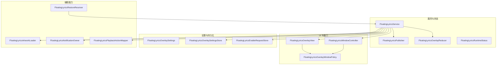
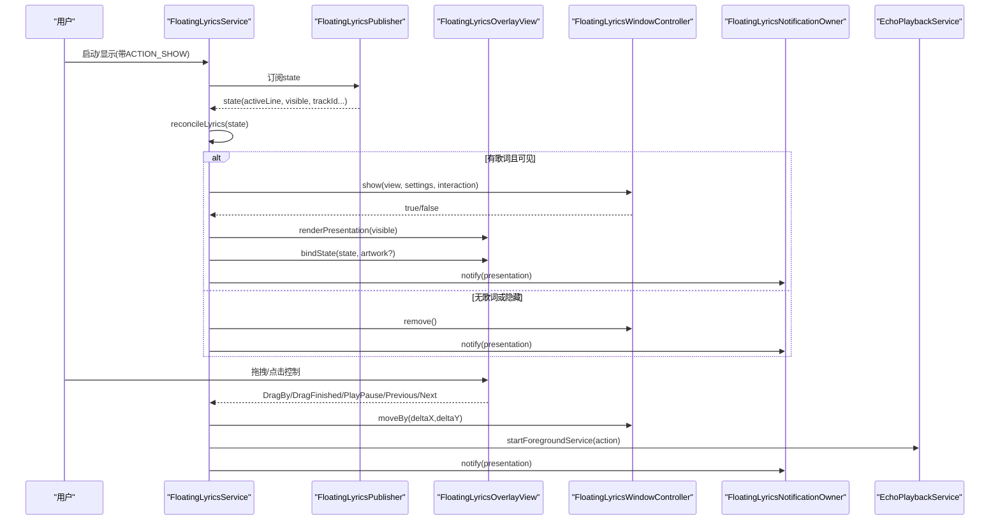
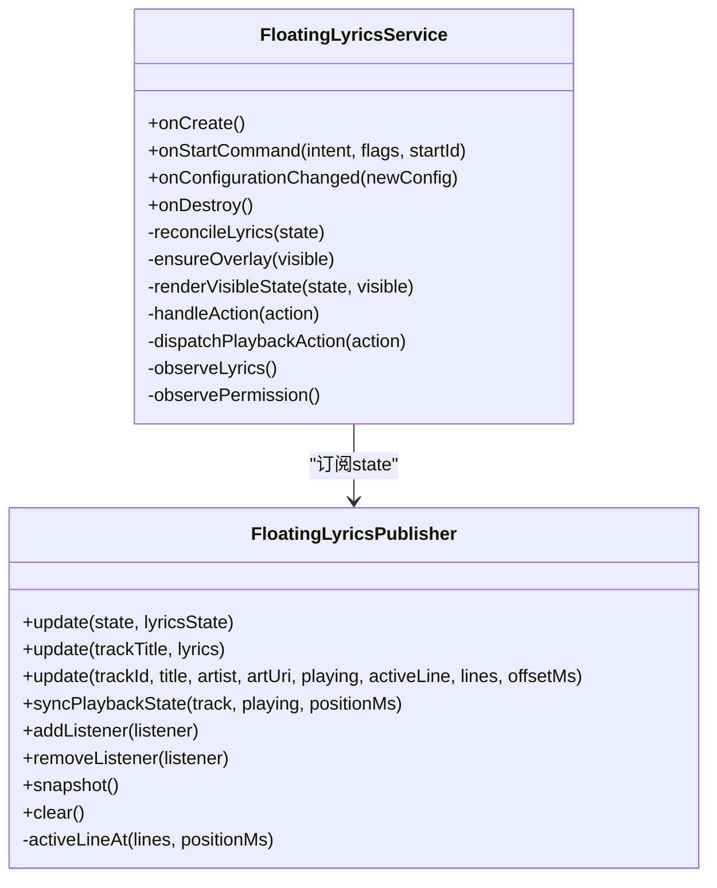
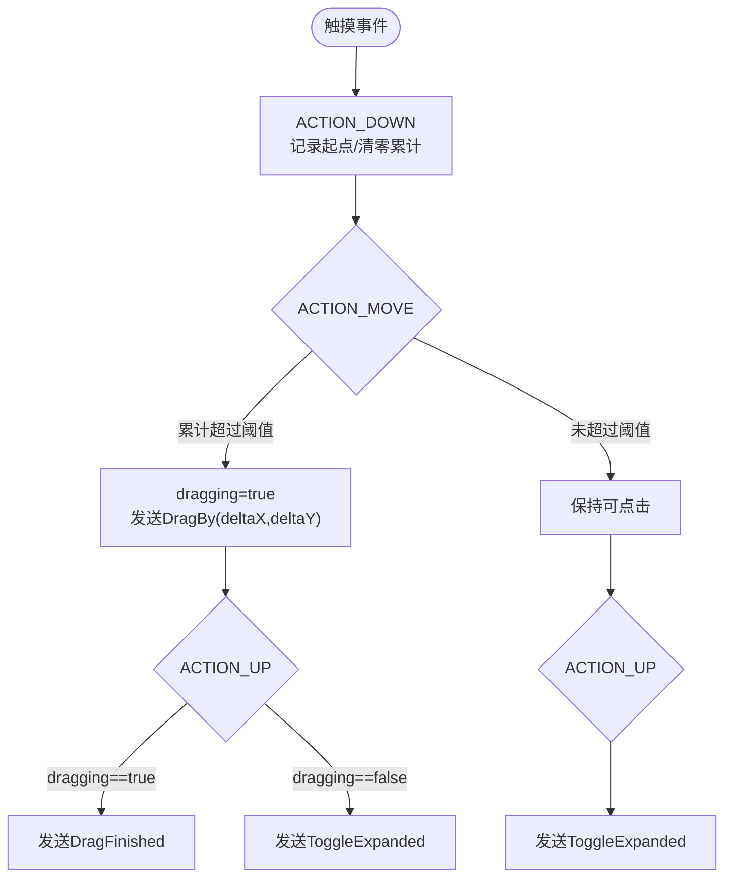
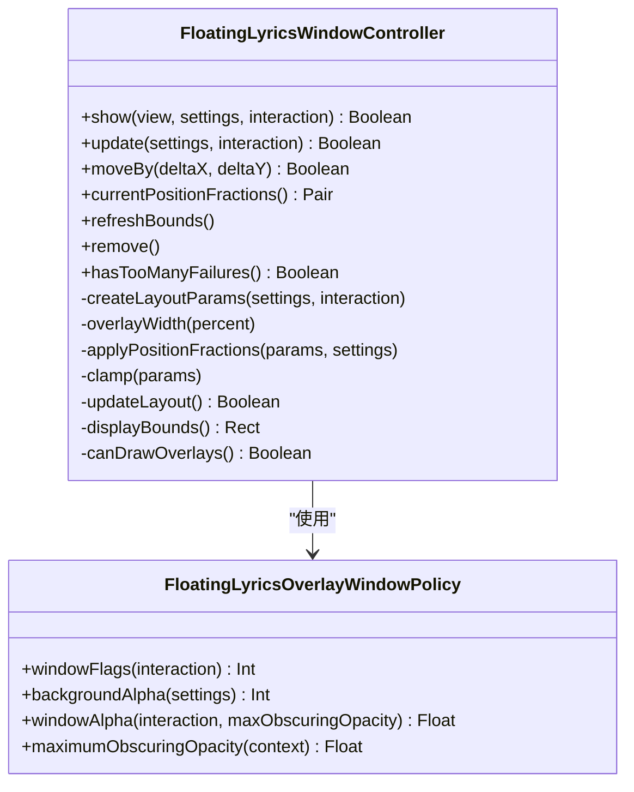
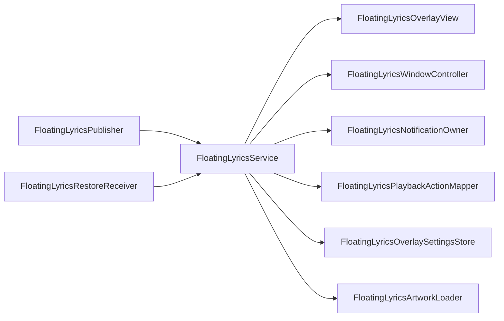

# 浮动歌词功能

<cite>
**本文引用的文件列表**
- [FloatingLyricsService.kt](file://app/src/main/java/app/yukine/FloatingLyricsService.kt)
- [FloatingLyricsOverlayView.kt](file://app/src/main/java/app/yukine/FloatingLyricsOverlayView.kt)
- [FloatingLyricsWindowController.kt](file://app/src/main/java/app/yukine/FloatingLyricsWindowController.kt)
- [FloatingLyricsOverlaySettings.kt](file://app/src/main/java/app/yukine/FloatingLyricsOverlaySettings.kt)
- [FloatingLyricsOverlayState.kt](file://app/src/main/java/app/yukine/FloatingLyricsOverlayState.kt)
- [FloatingLyricsPlaybackActionMapper.kt](file://app/src/main/java/app/yukine/FloatingLyricsPlaybackActionMapper.kt)
- [FloatingLyricsArtworkLoader.kt](file://app/src/main/java/app/yukine/FloatingLyricsArtworkLoader.kt)
- [FloatingLyricsNotificationOwner.kt](file://app/src/main/java/app/yukine/FloatingLyricsNotificationOwner.kt)
- [FloatingLyricsEnableRequestStore.kt](file://app/src/main/java/app/yukine/FloatingLyricsEnableRequestStore.kt)
- [FloatingLyricsRestoreReceiver.java](file://app/src/main/java/app/yukine/FloatingLyricsRestoreReceiver.java)
- [PlaybackLyricsManager.kt](file://app/src/main/java/app/yukine/playback/manager/PlaybackLyricsManager.kt)
</cite>

## 目录
1. [简介](#简介)
2. [项目结构](#项目结构)
3. [核心组件](#核心组件)
4. [架构总览](#架构总览)
5. [详细组件分析](#详细组件分析)
6. [依赖关系分析](#依赖关系分析)
7. [性能与资源考量](#性能与资源考量)
8. [故障排查指南](#故障排查指南)
9. [结论](#结论)

## 简介
本文件围绕“浮动歌词”功能进行系统化文档化，覆盖系统架构、组件职责、数据流、交互流程、权限与前台服务策略、窗口显示与拖拽定位、设置持久化、通知联动以及开机恢复等关键实现点。目标是为开发者与维护者提供清晰、可追溯的技术参考，同时兼顾非技术读者的理解门槛。

## 项目结构
浮动歌词功能主要位于 app 模块的 main 包下，采用“服务 + 视图 + 窗口控制器 + 状态/设置 + 辅助工具”的分层组织方式：
- 服务层：负责前台运行、权限轮询、状态协调、动作分发与通知更新
- UI 层：悬浮窗根视图与控件组装、手势处理、展示模式切换
- 窗口层：基于 WindowManager 的悬浮窗创建、更新、边界约束与失败保护
- 状态与设置：公开的状态发布器、UI 呈现状态机、设置模型与持久化
- 辅助工具：封面加载、播放动作映射、通知构建、运行时开关请求存储、开机恢复广播接收器

图表来源
- [FloatingLyricsService.kt:245-632](file://app/src/main/java/app/yukine/FloatingLyricsService.kt#L245-L632)
- [FloatingLyricsOverlayView.kt:23-464](file://app/src/main/java/app/yukine/FloatingLyricsOverlayView.kt#L23-L464)
- [FloatingLyricsWindowController.kt:15-256](file://app/src/main/java/app/yukine/FloatingLyricsWindowController.kt#L15-L256)
- [FloatingLyricsOverlaySettings.kt:8-175](file://app/src/main/java/app/yukine/FloatingLyricsOverlaySettings.kt#L8-L175)
- [FloatingLyricsOverlayState.kt:1-126](file://app/src/main/java/app/yukine/FloatingLyricsOverlayState.kt#L1-L126)
- [FloatingLyricsPlaybackActionMapper.kt:5-17](file://app/src/main/java/app/yukine/FloatingLyricsPlaybackActionMapper.kt#L5-L17)
- [FloatingLyricsArtworkLoader.kt:11-47](file://app/src/main/java/app/yukine/FloatingLyricsArtworkLoader.kt#L11-L47)
- [FloatingLyricsNotificationOwner.kt:12-147](file://app/src/main/java/app/yukine/FloatingLyricsNotificationOwner.kt#L12-L147)
- [FloatingLyricsEnableRequestStore.kt:9-36](file://app/src/main/java/app/yukine/FloatingLyricsEnableRequestStore.kt#L9-L36)
- [FloatingLyricsRestoreReceiver.java:15-51](file://app/src/main/java/app/yukine/FloatingLyricsRestoreReceiver.java#L15-L51)

章节来源
- [FloatingLyricsService.kt:245-632](file://app/src/main/java/app/yukine/FloatingLyricsService.kt#L245-L632)
- [FloatingLyricsOverlayView.kt:23-464](file://app/src/main/java/app/yukine/FloatingLyricsOverlayView.kt#L23-L464)
- [FloatingLyricsWindowController.kt:15-256](file://app/src/main/java/app/yukine/FloatingLyricsWindowController.kt#L15-L256)
- [FloatingLyricsOverlaySettings.kt:8-175](file://app/src/main/java/app/yukine/FloatingLyricsOverlaySettings.kt#L8-L175)
- [FloatingLyricsOverlayState.kt:1-126](file://app/src/main/java/app/yukine/FloatingLyricsOverlayState.kt#L1-L126)
- [FloatingLyricsPlaybackActionMapper.kt:5-17](file://app/src/main/java/app/yukine/FloatingLyricsPlaybackActionMapper.kt#L5-L17)
- [FloatingLyricsArtworkLoader.kt:11-47](file://app/src/main/java/app/yukine/FloatingLyricsArtworkLoader.kt#L11-L47)
- [FloatingLyricsNotificationOwner.kt:12-147](file://app/src/main/java/app/yukine/FloatingLyricsNotificationOwner.kt#L12-L147)
- [FloatingLyricsEnableRequestStore.kt:9-36](file://app/src/main/java/app/yukine/FloatingLyricsEnableRequestStore.kt#L9-L36)
- [FloatingLyricsRestoreReceiver.java:15-51](file://app/src/main/java/app/yukine/FloatingLyricsRestoreReceiver.java#L15-L51)

## 核心组件
- FloatingLyricsService：前台服务，负责启动/停止、权限轮询、歌词状态收集、窗口显隐控制、动作派发与通知更新。
- FloatingLyricsPublisher：静态发布者，对外暴露当前歌词状态（标题、艺人、封面、播放态、活跃行、可见性、曲目 ID），供服务订阅。
- FloatingLyricsOverlayView：悬浮窗根视图，包含紧凑/展开两种模式、拖拽手势、播放控制按钮、透明度滑块、点击穿透确认面板等。
- FloatingLyricsWindowController：封装 WindowManager.LayoutParams 的创建、更新、移动、边界钳制与失败计数；计算屏幕安全区域与位置分数。
- FloatingLyricsOverlaySettings / Store：悬浮窗外观与行为设置（字号、宽度百分比、位置分数、背景透明度、透明背景、文本颜色）及其持久化。
- FloatingLyricsOverlayState：UI 呈现状态机（等待/隐藏/可见）、交互模式（可交互/点击穿透）、运行时状态枚举、动作定义与归约器。
- FloatingLyricsPlaybackActionMapper：将 UI 动作映射为播放服务动作字符串（播放/暂停/上一首/下一首）。
- FloatingLyricsArtworkLoader：本地 URI 封面的 LRU 缓存解码与采样缩放。
- FloatingLyricsNotificationOwner：构建并更新前台通知，提供显示/隐藏/解锁等操作入口。
- FloatingLyricsEnableRequestStore：一次性“开启请求”标记，用于权限申请后的幂等恢复。
- FloatingLyricsRestoreReceiver：开机广播后检查并尝试恢复已启用的浮动歌词服务。

章节来源
- [FloatingLyricsService.kt:32-243](file://app/src/main/java/app/yukine/FloatingLyricsService.kt#L32-L243)
- [FloatingLyricsOverlayView.kt:23-464](file://app/src/main/java/app/yukine/FloatingLyricsOverlayView.kt#L23-L464)
- [FloatingLyricsWindowController.kt:15-256](file://app/src/main/java/app/yukine/FloatingLyricsWindowController.kt#L15-L256)
- [FloatingLyricsOverlaySettings.kt:8-175](file://app/src/main/java/app/yukine/FloatingLyricsOverlaySettings.kt#L8-L175)
- [FloatingLyricsOverlayState.kt:1-126](file://app/src/main/java/app/yukine/FloatingLyricsOverlayState.kt#L1-L126)
- [FloatingLyricsPlaybackActionMapper.kt:5-17](file://app/src/main/java/app/yukine/FloatingLyricsPlaybackActionMapper.kt#L5-L17)
- [FloatingLyricsArtworkLoader.kt:11-47](file://app/src/main/java/app/yukine/FloatingLyricsArtworkLoader.kt#L11-L47)
- [FloatingLyricsNotificationOwner.kt:12-147](file://app/src/main/java/app/yukine/FloatingLyricsNotificationOwner.kt#L12-L147)
- [FloatingLyricsEnableRequestStore.kt:9-36](file://app/src/main/java/app/yukine/FloatingLyricsEnableRequestStore.kt#L9-L36)
- [FloatingLyricsRestoreReceiver.java:15-51](file://app/src/main/java/app/yukine/FloatingLyricsRestoreReceiver.java#L15-L51)

## 架构总览
整体采用“服务驱动 + 状态发布 + 视图渲染 + 窗口管理”的解耦设计。服务作为中枢，订阅歌词状态变更，结合用户会话交互模式与设置，决定悬浮窗的显隐与渲染；窗口控制器负责底层 Window 操作；通知与播放服务通过动作映射进行跨进程协作。

图表来源
- [FloatingLyricsService.kt:347-461](file://app/src/main/java/app/yukine/FloatingLyricsService.kt#L347-L461)
- [FloatingLyricsOverlayView.kt:339-403](file://app/src/main/java/app/yukine/FloatingLyricsOverlayView.kt#L339-L403)
- [FloatingLyricsWindowController.kt:30-86](file://app/src/main/java/app/yukine/FloatingLyricsWindowController.kt#L30-L86)
- [FloatingLyricsNotificationOwner.kt:30-83](file://app/src/main/java/app/yukine/FloatingLyricsNotificationOwner.kt#L30-L83)
- [FloatingLyricsPlaybackActionMapper.kt:5-17](file://app/src/main/java/app/yukine/FloatingLyricsPlaybackActionMapper.kt#L5-L17)

## 详细组件分析

### 服务与状态发布（FloatingLyricsService 与 Publisher）
- 服务生命周期：onCreate 初始化设置、通知、窗口控制器，进入前台，开始监听歌词状态与权限变化；onStartCommand 根据 ACTION 执行显示/隐藏/刷新设置/重置布局；onDestroy 清理窗口与协程。
- 状态发布：FloatingLyricsPublisher 维护 StateFlow 与内部时间轴，支持从 NowPlaying 状态同步进度行、从 UI 直接更新、从外部同步播放进度三种路径，确保后台也能推进活跃行。
- 权限轮询：周期性检查悬浮窗权限，一旦丢失则禁用功能并停止服务。
- 动作派发：将 UI 动作转换为播放服务动作，通过 Intent 启动 EchoPlaybackService。

图表来源
- [FloatingLyricsService.kt:245-632](file://app/src/main/java/app/yukine/FloatingLyricsService.kt#L245-L632)
- [FloatingLyricsService.kt:46-243](file://app/src/main/java/app/yukine/FloatingLyricsService.kt#L46-L243)

章节来源
- [FloatingLyricsService.kt:325-384](file://app/src/main/java/app/yukine/FloatingLyricsService.kt#L325-L384)
- [FloatingLyricsService.kt:403-421](file://app/src/main/java/app/yukine/FloatingLyricsService.kt#L403-L421)
- [FloatingLyricsService.kt:423-461](file://app/src/main/java/app/yukine/FloatingLyricsService.kt#L423-L461)
- [FloatingLyricsService.kt:493-551](file://app/src/main/java/app/yukine/FloatingLyricsService.kt#L493-L551)
- [FloatingLyricsService.kt:583-602](file://app/src/main/java/app/yukine/FloatingLyricsService.kt#L583-L602)
- [FloatingLyricsService.kt:612-626](file://app/src/main/java/app/yukine/FloatingLyricsService.kt#L612-L626)
- [FloatingLyricsService.kt:62-216](file://app/src/main/java/app/yukine/FloatingLyricsService.kt#L62-L216)

### 悬浮窗视图与交互（FloatingLyricsOverlayView）
- 视图结构：紧凑模式仅显示歌词行；展开模式显示封面、标题、艺人、播放控制、透明度滑块、点击穿透确认、隐藏/设置/折叠等按钮。
- 手势处理：单指拖拽触发 DragBy，抬起时若未拖拽则视为点击，触发 ToggleExpanded；拖拽结束保存位置分数。
- 设置应用：动态调整字号、文本颜色、背景透明度与滑块可用性；动画受系统动画开关影响。
- 状态绑定：根据最新状态更新歌词、标题、艺人、封面与播放图标。

图表来源
- [FloatingLyricsOverlayView.kt:339-403](file://app/src/main/java/app/yukine/FloatingLyricsOverlayView.kt#L339-L403)

章节来源
- [FloatingLyricsOverlayView.kt:140-162](file://app/src/main/java/app/yukine/FloatingLyricsOverlayView.kt#L140-L162)
- [FloatingLyricsOverlayView.kt:166-182](file://app/src/main/java/app/yukine/FloatingLyricsOverlayView.kt#L166-L182)
- [FloatingLyricsOverlayView.kt:184-208](file://app/src/main/java/app/yukine/FloatingLyricsOverlayView.kt#L184-L208)
- [FloatingLyricsOverlayView.kt:210-308](file://app/src/main/java/app/yukine/FloatingLyricsOverlayView.kt#L210-L308)
- [FloatingLyricsOverlayView.kt:310-337](file://app/src/main/java/app/yukine/FloatingLyricsOverlayView.kt#L310-L337)
- [FloatingLyricsOverlayView.kt:339-403](file://app/src/main/java/app/yukine/FloatingLyricsOverlayView.kt#L339-L403)

### 窗口管理与策略（FloatingLyricsWindowController 与 Policy）
- 窗口创建：根据 Android 版本选择 TYPE_APPLICATION_OVERLAY 或 TYPE_PHONE，设置重力、透明度、尺寸与初始位置。
- 位置与尺寸：按屏幕安全区域与设置中的宽度百分比计算 overlay 宽度；使用 X/Y 分数换算像素坐标，并在边界内钳制。
- 交互模式：Interactive 允许触摸；ClickThrough 禁止触摸，降低窗口不透明度以符合系统限制。
- 失败保护：连续失败达到阈值则上报并停止服务；权限被回收时主动移除窗口并回调上层。

图表来源
- [FloatingLyricsWindowController.kt:15-256](file://app/src/main/java/app/yukine/FloatingLyricsWindowController.kt#L15-L256)
- [FloatingLyricsOverlaySettings.kt:51-91](file://app/src/main/java/app/yukine/FloatingLyricsOverlaySettings.kt#L51-L91)

章节来源
- [FloatingLyricsWindowController.kt:30-56](file://app/src/main/java/app/yukine/FloatingLyricsWindowController.kt#L30-L56)
- [FloatingLyricsWindowController.kt:58-78](file://app/src/main/java/app/yukine/FloatingLyricsWindowController.kt#L58-L78)
- [FloatingLyricsWindowController.kt:80-101](file://app/src/main/java/app/yukine/FloatingLyricsWindowController.kt#L80-L101)
- [FloatingLyricsWindowController.kt:122-146](file://app/src/main/java/app/yukine/FloatingLyricsWindowController.kt#L122-L146)
- [FloatingLyricsWindowController.kt:154-166](file://app/src/main/java/app/yukine/FloatingLyricsWindowController.kt#L154-L166)
- [FloatingLyricsWindowController.kt:170-211](file://app/src/main/java/app/yukine/FloatingLyricsWindowController.kt#L170-L211)
- [FloatingLyricsOverlaySettings.kt:51-91](file://app/src/main/java/app/yukine/FloatingLyricsOverlaySettings.kt#L51-L91)

### 设置与持久化（Settings 与 Store）
- 设置项：字号、宽度百分比、位置分数、背景透明度、透明背景、文本颜色。
- 规范化：所有值在保存前进行范围校验与非法值回退。
- 迁移：兼容旧键名（如垂直百分比），读取后自动写入新键并清理旧键。
- 持久化：SharedPreferences 读写，支持一键重置为默认值。

章节来源
- [FloatingLyricsOverlaySettings.kt:8-49](file://app/src/main/java/app/yukine/FloatingLyricsOverlaySettings.kt#L8-L49)
- [FloatingLyricsOverlaySettings.kt:93-175](file://app/src/main/java/app/yukine/FloatingLyricsOverlaySettings.kt#L93-L175)

### 播放动作映射与封面加载
- 动作映射：将 UI 的播放/暂停/上一首/下一首映射为播放服务的动作常量字符串，由服务通过 Intent 启动播放服务。
- 封面加载：对本地 URI 进行 LRU 缓存与采样解码，避免大图导致的内存压力；网络 URI 直接忽略。

章节来源
- [FloatingLyricsPlaybackActionMapper.kt:5-17](file://app/src/main/java/app/yukine/FloatingLyricsPlaybackActionMapper.kt#L5-L17)
- [FloatingLyricsArtworkLoader.kt:11-47](file://app/src/main/java/app/yukine/FloatingLyricsArtworkLoader.kt#L11-L47)

### 通知与前台服务
- 前台服务：创建低优先级通知通道，持续更新内容文本与操作按钮（显示/隐藏/解锁）。
- 通知动作：通过 PendingIntent 向服务发送 ACTION，实现从通知栏控制悬浮窗。

章节来源
- [FloatingLyricsNotificationOwner.kt:12-147](file://app/src/main/java/app/yukine/FloatingLyricsNotificationOwner.kt#L12-L147)
- [FloatingLyricsService.kt:386-401](file://app/src/main/java/app/yukine/FloatingLyricsService.kt#L386-L401)

### 运行时开关与开机恢复
- 一次性开启请求：FloatingLyricsEnableRequestStore 记录一次性的“权限通过后启用”标记，消费后即清除，避免重复拉起。
- 开机恢复：FloatingLyricsRestoreReceiver 监听开机完成，检查是否已启用且具备悬浮窗权限，满足条件则尝试启动服务。

章节来源
- [FloatingLyricsEnableRequestStore.kt:9-36](file://app/src/main/java/app/yukine/FloatingLyricsEnableRequestStore.kt#L9-L36)
- [FloatingLyricsRestoreReceiver.java:15-51](file://app/src/main/java/app/yukine/FloatingLyricsRestoreReceiver.java#L15-L51)

## 依赖关系分析
- 服务依赖：
  - 状态源：FloatingLyricsPublisher（歌词状态与活跃行）
  - UI 渲染：FloatingLyricsOverlayView（视图与手势）
  - 窗口管理：FloatingLyricsWindowController（WindowManager 封装）
  - 设置：FloatingLyricsOverlaySettingsStore（持久化）
  - 通知：FloatingLyricsNotificationOwner（前台通知）
  - 播放：FloatingLyricsPlaybackActionMapper → EchoPlaybackService（通过 Intent）
  - 封面：FloatingLyricsArtworkLoader（本地图片解码）
- 外部集成：
  - 系统权限：Settings.canDrawOverlays
  - 系统 API：WindowManager、NotificationManager、InputManager（最大遮挡不透明度）
  - 开机广播：Intent.ACTION_BOOT_COMPLETED

图表来源
- [FloatingLyricsService.kt:245-632](file://app/src/main/java/app/yukine/FloatingLyricsService.kt#L245-L632)
- [FloatingLyricsRestoreReceiver.java:15-51](file://app/src/main/java/app/yukine/FloatingLyricsRestoreReceiver.java#L15-L51)

章节来源
- [FloatingLyricsService.kt:245-632](file://app/src/main/java/app/yukine/FloatingLyricsService.kt#L245-L632)
- [FloatingLyricsRestoreReceiver.java:15-51](file://app/src/main/java/app/yukine/FloatingLyricsRestoreReceiver.java#L15-L51)

## 性能与资源考量
- 封面解码：使用 LruCache 与 inSampleSize 采样，避免大图导致 OOM；仅处理本地 URI，跳过网络 URL。
- 窗口更新：仅在必要字段变化时调用 updateViewLayout，减少重绘开销；位置分数转换与钳制在内存中完成。
- 前台通知：低优先级、常驻但轻量，避免频繁重建，仅在 presentation 变化时更新。
- 协程作用域：主线程立即调度，IO 任务在 IO 线程执行，避免阻塞 UI。

[本节为通用指导，无需列出具体文件来源]

## 故障排查指南
- 无法显示悬浮窗
  - 检查悬浮窗权限：服务会周期性检测，若权限丢失会进入 PermissionRequired 并停止服务。
  - 查看窗口失败次数：连续失败达阈值会停止服务，需检查系统限制或设备差异。
- 歌词不同步
  - 确认 FloatingLyricsPublisher 是否正确更新（NowPlaying 状态或外部同步）。
  - 检查活跃行计算逻辑是否与播放进度一致。
- 拖拽异常
  - 检查手势阈值与多点触控分支，确认 DragFinished 与 ToggleExpanded 的互斥逻辑。
- 通知不可用
  - 确认通知渠道创建成功，且前台服务已进入前台。
- 开机未恢复
  - 检查开机广播是否注册、是否具备悬浮窗权限、是否已被系统阻止后台启动。

章节来源
- [FloatingLyricsService.kt:412-421](file://app/src/main/java/app/yukine/FloatingLyricsService.kt#L412-L421)
- [FloatingLyricsService.kt:612-626](file://app/src/main/java/app/yukine/FloatingLyricsService.kt#L612-L626)
- [FloatingLyricsWindowController.kt:168-211](file://app/src/main/java/app/yukine/FloatingLyricsWindowController.kt#L168-L211)
- [FloatingLyricsNotificationOwner.kt:15-28](file://app/src/main/java/app/yukine/FloatingLyricsNotificationOwner.kt#L15-L28)
- [FloatingLyricsRestoreReceiver.java:19-49](file://app/src/main/java/app/yukine/FloatingLyricsRestoreReceiver.java#L19-L49)

## 结论
浮动歌词功能通过前台服务与悬浮窗的组合，实现了跨应用的歌词实时展示与基础播放控制。其架构清晰、职责分离良好：服务负责编排与协调，视图专注交互与展示，窗口控制器屏蔽系统细节，设置与通知提供可配置性与可达性。配合开机恢复与一次性开启请求机制，提升了用户体验与稳定性。建议在后续迭代中继续优化封面加载策略、窗口失败重试与更细粒度的日志埋点，以便快速定位复杂设备上的边缘问题。