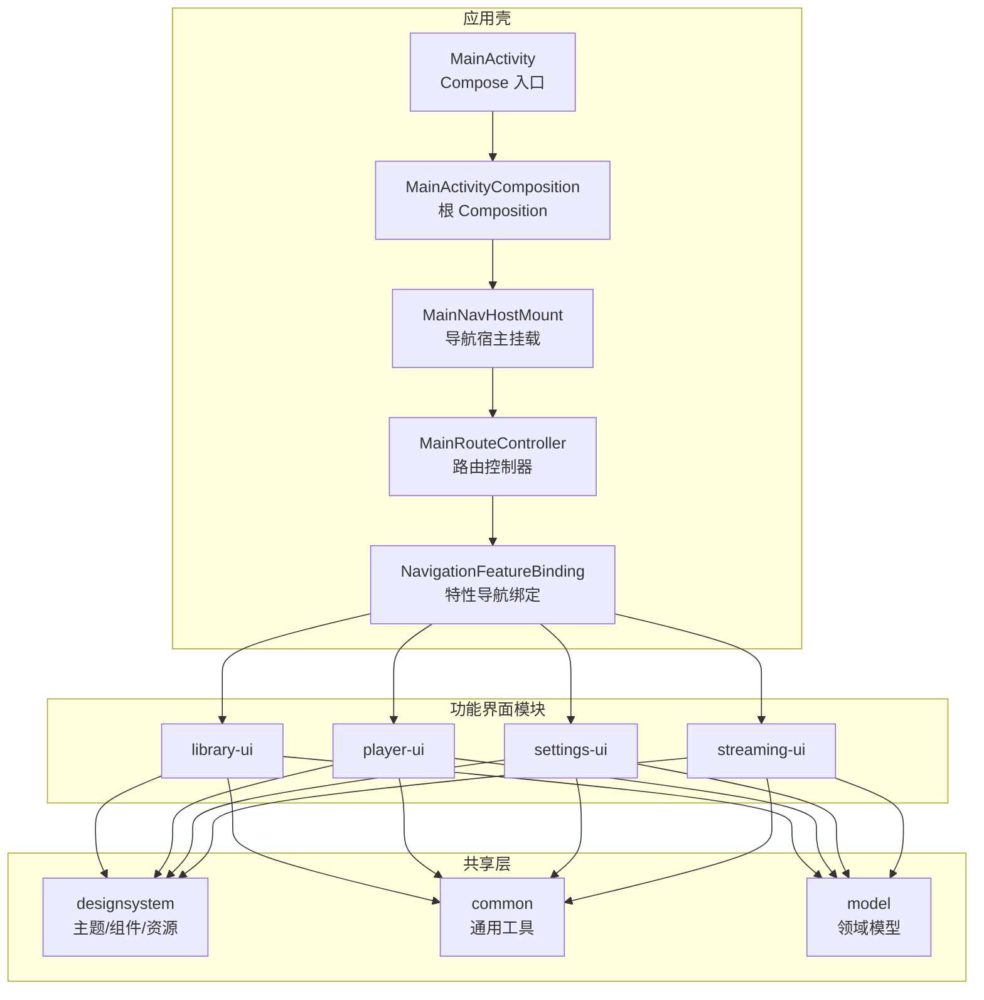
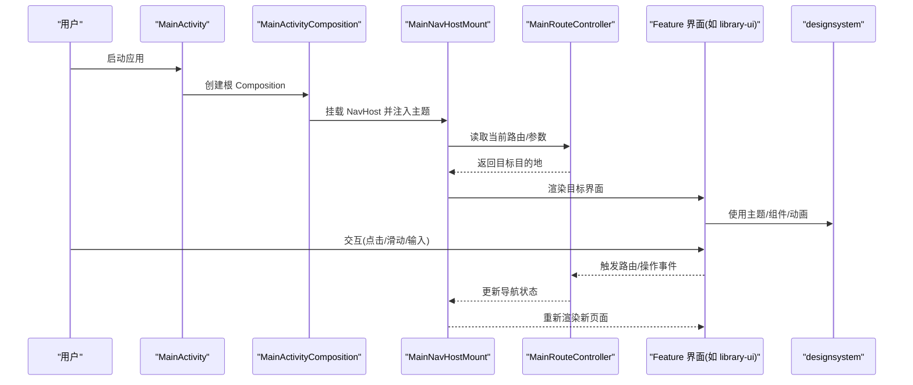
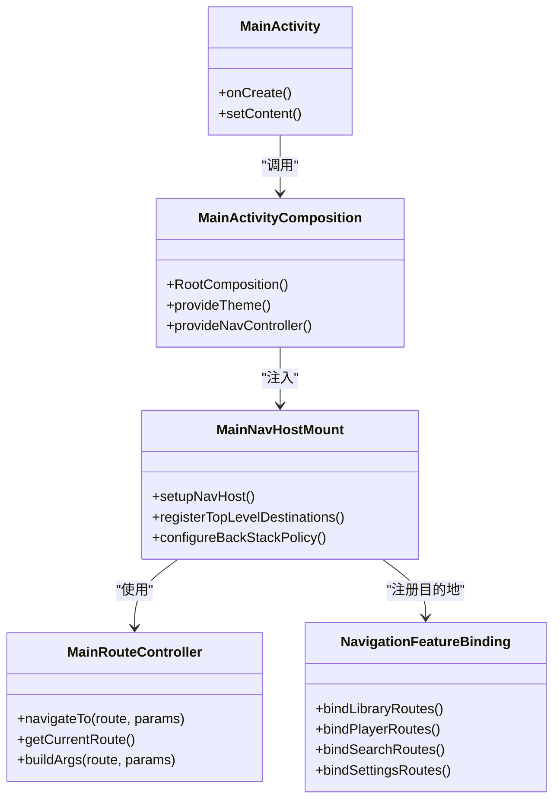
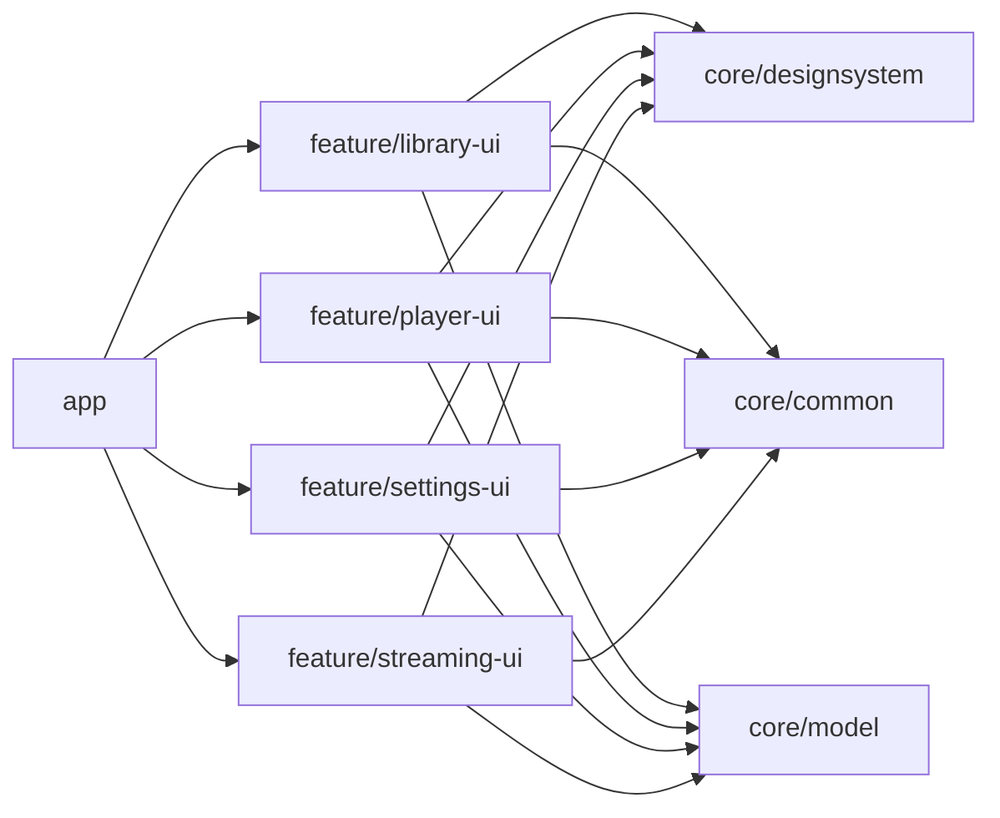

# 用户界面

<cite>
**本文引用的文件**   
- [MainActivity.kt](file://app/src/main/java/app/yukine/MainActivity.kt)
- [MainActivityComposition.kt](file://app/src/main/java/app/yukine/MainActivityComposition.kt)
- [MainNavHostMount.kt](file://app/src/main/java/app/yukine/MainNavHostMount.kt)
- [MainRouteController.kt](file://app/src/main/java/app/yukine/MainRouteController.kt)
- [NavigationFeatureBinding.kt](file://app/src/main/java/app/yukine/NavigationFeatureBinding.kt)
- [EchoApp.kt](file://app/src/main/java/app/yukine/EchoApp.kt)
- [LibraryModule.kt](file://app/src/main/java/app/yukine/LibraryModule.kt)
- [PlaybackUiModule.kt](file://app/src/main/java/app/yukine/PlaybackUiModule.kt)
- [SettingsModule.kt](file://app/src/main/java/app/yukine/SettingsModule.kt)
- [StreamingModule.kt](file://app/src/main/java/app/yukine/StreamingModule.kt)
- [feature/library-ui/build.gradle](file://feature/library-ui/build.gradle)
- [feature/player-ui/build.gradle](file://feature/player-ui/build.gradle)
- [feature/settings-ui/build.gradle](file://feature/settings-ui/build.gradle)
- [feature/streaming-ui/build.gradle](file://feature/streaming-ui/build.gradle)
- [core/designsystem/build.gradle](file://core/designsystem/build.gradle)
- [core/common/build.gradle](file://core/common/build.gradle)
- [core/model/build.gradle](file://core/model/build.gradle)
</cite>

## 目录
1. [简介](#简介)
2. [项目结构](#项目结构)
3. [核心组件](#核心组件)
4. [架构总览](#架构总览)
5. [详细组件分析](#详细组件分析)
6. [依赖分析](#依赖分析)
7. [性能考虑](#性能考虑)
8. [故障排查指南](#故障排查指南)
9. [结论](#结论)
10. [附录](#附录)

## 简介
本文件聚焦 Echo Android 应用的用户界面层，围绕基于 Jetpack Compose 的现代 UI 架构进行系统化说明。文档覆盖页面组件设计、导航系统、状态管理，并对主要界面模块（音乐库界面、播放器界面、搜索界面、设置界面）进行分层解析。同时阐述响应式设计、主题系统、动画效果与无障碍支持，总结 UI 组件复用模式、自定义控件开发方法与界面性能优化策略，并提供可落地的最佳实践与设计规范。

## 项目结构
UI 层采用“功能模块 + 共享设计系统”的模块化组织方式：
- app 模块负责组合入口、导航挂载、特性绑定与运行时装配
- feature/*-ui 模块按业务域拆分界面（library-ui、player-ui、settings-ui、streaming-ui）
- core/designsystem 提供统一的设计令牌、主题、基础组件与样式
- core/common 与 core/model 提供通用能力与领域模型

图表来源
- [MainActivity.kt:1-200](file://app/src/main/java/app/yukine/MainActivity.kt#L1-L200)
- [MainActivityComposition.kt:1-200](file://app/src/main/java/app/yukine/MainActivityComposition.kt#L1-L200)
- [MainNavHostMount.kt:1-200](file://app/src/main/java/app/yukine/MainNavHostMount.kt#L1-L200)
- [MainRouteController.kt:1-200](file://app/src/main/java/app/yukine/MainRouteController.kt#L1-L200)
- [NavigationFeatureBinding.kt:1-200](file://app/src/main/java/app/yukine/NavigationFeatureBinding.kt#L1-L200)
- [feature/library-ui/build.gradle](file://feature/library-ui/build.gradle)
- [feature/player-ui/build.gradle](file://feature/player-ui/build.gradle)
- [feature/settings-ui/build.gradle](file://feature/settings-ui/build.gradle)
- [feature/streaming-ui/build.gradle](file://feature/streaming-ui/build.gradle)
- [core/designsystem/build.gradle](file://core/designsystem/build.gradle)
- [core/common/build.gradle](file://core/common/build.gradle)
- [core/model/build.gradle](file://core/model/build.gradle)

章节来源
- [MainActivity.kt:1-200](file://app/src/main/java/app/yukine/MainActivity.kt#L1-L200)
- [MainActivityComposition.kt:1-200](file://app/src/main/java/app/yukine/MainActivityComposition.kt#L1-L200)
- [MainNavHostMount.kt:1-200](file://app/src/main/java/app/yukine/MainNavHostMount.kt#L1-L200)
- [MainRouteController.kt:1-200](file://app/src/main/java/app/yukine/MainRouteController.kt#L1-L200)
- [NavigationFeatureBinding.kt:1-200](file://app/src/main/java/app/yukine/NavigationFeatureBinding.kt#L1-L200)

## 核心组件
- 应用入口与组合
  - MainActivity 作为 Activity 入口，承载 WindowInsets、系统栏适配与 Compose 初始化
  - MainActivityComposition 负责根 Composition 树构建、主题注入、全局状态与生命周期桥接
  - EchoApp 提供应用级配置与 DI 上下文暴露点

- 导航系统
  - MainNavHostMount 挂载 NavHost，注册顶级目的地与返回栈策略
  - MainRouteController 维护路由定义、参数序列化与跳转意图
  - NavigationFeatureBinding 将各 feature 模块的目的地与动作绑定到导航图

- 特性模块装配
  - LibraryModule / PlaybackUiModule / SettingsModule / StreamingModule 分别声明对应界面的 ViewModel、UseCase、本地存储与 UI 依赖

章节来源
- [MainActivity.kt:1-200](file://app/src/main/java/app/yukine/MainActivity.kt#L1-L200)
- [MainActivityComposition.kt:1-200](file://app/src/main/java/app/yukine/MainActivityComposition.kt#L1-L200)
- [EchoApp.kt:1-200](file://app/src/main/java/app/yukine/EchoApp.kt#L1-L200)
- [MainNavHostMount.kt:1-200](file://app/src/main/java/app/yukine/MainNavHostMount.kt#L1-L200)
- [MainRouteController.kt:1-200](file://app/src/main/java/app/yukine/MainRouteController.kt#L1-L200)
- [NavigationFeatureBinding.kt:1-200](file://app/src/main/java/app/yukine/NavigationFeatureBinding.kt#L1-L200)
- [LibraryModule.kt:1-200](file://app/src/main/java/app/yukine/LibraryModule.kt#L1-L200)
- [PlaybackUiModule.kt:1-200](file://app/src/main/java/app/yukine/PlaybackUiModule.kt#L1-L200)
- [SettingsModule.kt:1-200](file://app/src/main/java/app/yukine/SettingsModule.kt#L1-L200)
- [StreamingModule.kt:1-200](file://app/src/main/java/app/yukine/StreamingModule.kt#L1-L200)

## 架构总览
UI 层遵循“声明式 UI + 单向数据流”的 Compose 范式：
- 状态提升：界面只消费不可变状态，通过回调或事件总线向上提交变更
- 导航即状态：路由由集中控制器驱动，避免在组件内直接耦合跳转逻辑
- 模块化边界：feature-* 模块仅依赖 designsystem/common/model，不反向依赖 app 模块
- 主题与可访问性：通过 designsystem 提供的主题与语义化组件保证一致性与可达性

图表来源
- [MainActivity.kt:1-200](file://app/src/main/java/app/yukine/MainActivity.kt#L1-L200)
- [MainActivityComposition.kt:1-200](file://app/src/main/java/app/yukine/MainActivityComposition.kt#L1-L200)
- [MainNavHostMount.kt:1-200](file://app/src/main/java/app/yukine/MainNavHostMount.kt#L1-L200)
- [MainRouteController.kt:1-200](file://app/src/main/java/app/yukine/MainRouteController.kt#L1-L200)
- [NavigationFeatureBinding.kt:1-200](file://app/src/main/java/app/yukine/NavigationFeatureBinding.kt#L1-L200)

## 详细组件分析

### 导航系统与路由控制
- 职责划分
  - MainNavHostMount：负责 NavHost 的创建、顶级目的地注册、返回栈策略与过渡动画
  - MainRouteController：维护路由常量、参数类型与跳转方法，屏蔽具体实现细节
  - NavigationFeatureBinding：在各 feature 模块中注册其目的地与动作，保持模块解耦
- 关键流程
  - 进入应用时，Composition 注入主题与导航上下文
  - 根据当前路由渲染对应页面；用户操作通过 RouteController 派发
  - 导航状态变化后，Compose 自动重组受影响子树

图表来源
- [MainActivity.kt:1-200](file://app/src/main/java/app/yukine/MainActivity.kt#L1-L200)
- [MainActivityComposition.kt:1-200](file://app/src/main/java/app/yukine/MainActivityComposition.kt#L1-L200)
- [MainNavHostMount.kt:1-200](file://app/src/main/java/app/yukine/MainNavHostMount.kt#L1-L200)
- [MainRouteController.kt:1-200](file://app/src/main/java/app/yukine/MainRouteController.kt#L1-L200)
- [NavigationFeatureBinding.kt:1-200](file://app/src/main/java/app/yukine/NavigationFeatureBinding.kt#L1-L200)

章节来源
- [MainNavHostMount.kt:1-200](file://app/src/main/java/app/yukine/MainNavHostMount.kt#L1-L200)
- [MainRouteController.kt:1-200](file://app/src/main/java/app/yukine/MainRouteController.kt#L1-L200)
- [NavigationFeatureBinding.kt:1-200](file://app/src/main/java/app/yukine/NavigationFeatureBinding.kt#L1-L200)

### 音乐库界面（library-ui）
- 模块职责
  - 展示专辑、艺术家、播放列表等集合视图
  - 提供搜索、筛选、批量操作入口
  - 与播放队列、收藏、下载等能力联动
- 状态与数据流
  - 通过 ViewModel 暴露不可变状态，界面以纯函数形式渲染
  - 列表项采用稳定 key 与懒加载，减少重组开销
- 组件复用
  - 复用 designsystem 中的卡片、列表、空态与骨架屏组件
  - 统一的行布局与占位符策略，确保跨屏幕一致性

章节来源
- [feature/library-ui/build.gradle](file://feature/library-ui/build.gradle)
- [LibraryModule.kt:1-200](file://app/src/main/java/app/yukine/LibraryModule.kt#L1-L200)

### 播放器界面（player-ui）
- 模块职责
  - 呈现当前播放信息、进度条、歌词、封面与播放控制
  - 与播放服务/状态机通信，同步播放状态
- 交互与动画
  - 使用 Compose 动画 API 实现平滑过渡与微交互
  - 封面缩放、进度指示与手势反馈增强体验
- 状态管理
  - 播放状态集中管理，界面订阅最小必要状态片段

章节来源
- [feature/player-ui/build.gradle](file://feature/player-ui/build.gradle)
- [PlaybackUiModule.kt:1-200](file://app/src/main/java/app/yukine/PlaybackUiModule.kt#L1-L200)

### 搜索界面（streaming-ui/search）
- 模块职责
  - 聚合多源搜索结果，提供关键词联想与过滤
  - 处理网络请求、缓存命中与错误提示
- 用户体验
  - 防抖输入、分页加载与结果去重
  - 空态与错误态的统一展示

章节来源
- [feature/streaming-ui/build.gradle](file://feature/streaming-ui/build.gradle)

### 设置界面（settings-ui）
- 模块职责
  - 展示与编辑应用偏好、播放行为、网络与隐私选项
  - 将设置变更下发至运行时与持久化存储
- 一致性
  - 使用 designsystem 的设置项组件，保证视觉与交互一致

章节来源
- [feature/settings-ui/build.gradle](file://feature/settings-ui/build.gradle)
- [SettingsModule.kt:1-200](file://app/src/main/java/app/yukine/SettingsModule.kt#L1-L200)

### 主题系统与可访问性
- 主题
  - 通过 designsystem 暴露颜色、排版、形状与动效令牌
  - 支持明暗主题切换与对比度增强
- 可访问性
  - 为所有交互元素提供内容描述与焦点顺序
  - 支持系统字体缩放与高对比度模式

章节来源
- [core/designsystem/build.gradle](file://core/designsystem/build.gradle)

## 依赖分析
- 模块依赖方向
  - app → feature-* 模块（导航与装配）
  - feature-* → designsystem/common/model（UI 与模型）
  - designsystem 不依赖任何 feature 模块，保持纯净
- 潜在风险
  - 若 feature 模块引入 app 内部类，会破坏模块化边界
  - 过度在界面层持有长生命周期对象可能导致内存泄漏

图表来源
- [feature/library-ui/build.gradle](file://feature/library-ui/build.gradle)
- [feature/player-ui/build.gradle](file://feature/player-ui/build.gradle)
- [feature/settings-ui/build.gradle](file://feature/settings-ui/build.gradle)
- [feature/streaming-ui/build.gradle](file://feature/streaming-ui/build.gradle)
- [core/designsystem/build.gradle](file://core/designsystem/build.gradle)
- [core/common/build.gradle](file://core/common/build.gradle)
- [core/model/build.gradle](file://core/model/build.gradle)

章节来源
- [feature/library-ui/build.gradle](file://feature/library-ui/build.gradle)
- [feature/player-ui/build.gradle](file://feature/player-ui/build.gradle)
- [feature/settings-ui/build.gradle](file://feature/settings-ui/build.gradle)
- [feature/streaming-ui/build.gradle](file://feature/streaming-ui/build.gradle)
- [core/designsystem/build.gradle](file://core/designsystem/build.gradle)
- [core/common/build.gradle](file://core/common/build.gradle)
- [core/model/build.gradle](file://core/model/build.gradle)

## 性能考虑
- 重组优化
  - 使用 remember 与 derivedStateOf 缓存计算结果
  - 列表项分配稳定 key，避免不必要的重建
- 图片与媒体
  - 使用异步加载与磁盘缓存，避免主线程阻塞
  - 对大图进行采样与尺寸适配
- 导航与过渡
  - 合理配置转场动画时长与插值，避免卡顿
- 内存与生命周期
  - 在 Composition 外持有重型对象，必要时使用 DisposableEffect 清理资源

[本节为通用指导，无需源码引用]

## 故障排查指南
- 导航异常
  - 检查路由参数序列化与反序列化是否匹配
  - 确认目的地已在 NavigationFeatureBinding 中正确注册
- 主题不一致
  - 验证根 Composition 是否正确注入主题与配色方案
- 列表卡顿
  - 审查列表项重组范围与 key 稳定性
  - 检查图片加载是否在后台线程执行
- 可访问性问题
  - 为所有可交互元素补充 contentDescription
  - 测试焦点顺序与键盘导航

章节来源
- [MainRouteController.kt:1-200](file://app/src/main/java/app/yukine/MainRouteController.kt#L1-L200)
- [NavigationFeatureBinding.kt:1-200](file://app/src/main/java/app/yukine/NavigationFeatureBinding.kt#L1-L200)
- [MainActivityComposition.kt:1-200](file://app/src/main/java/app/yukine/MainActivityComposition.kt#L1-L200)

## 结论
Echo Android 的 UI 层以 Compose 为核心，结合模块化与统一设计系统，实现了清晰的分层与良好的扩展性。通过集中化的导航控制、稳定的状态管理与一致的组件体系，应用在可维护性、可测试性与用户体验方面具备坚实基础。后续可在动画细节、无障碍覆盖与性能监控方面持续精进。

[本节为总结性内容，无需源码引用]

## 附录
- 响应式设计建议
  - 使用自适应布局与断点策略，适配手机、平板与折叠屏
  - 优先使用 Compose 的约束与弹性布局能力
- 自定义控件开发
  - 封装可复用的原子组件，暴露清晰的参数与回调
  - 为自定义控件提供主题覆盖与可访问性支持
- 设计规范
  - 统一间距、字号、颜色与圆角
  - 明确交互反馈与错误提示规范

[本节为通用指导，无需源码引用]