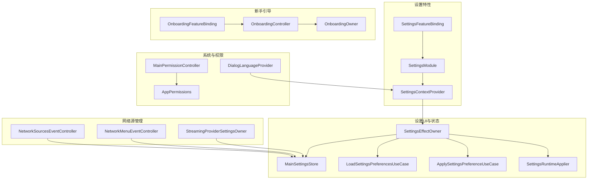
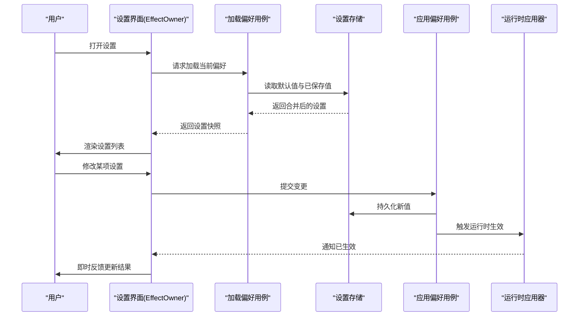
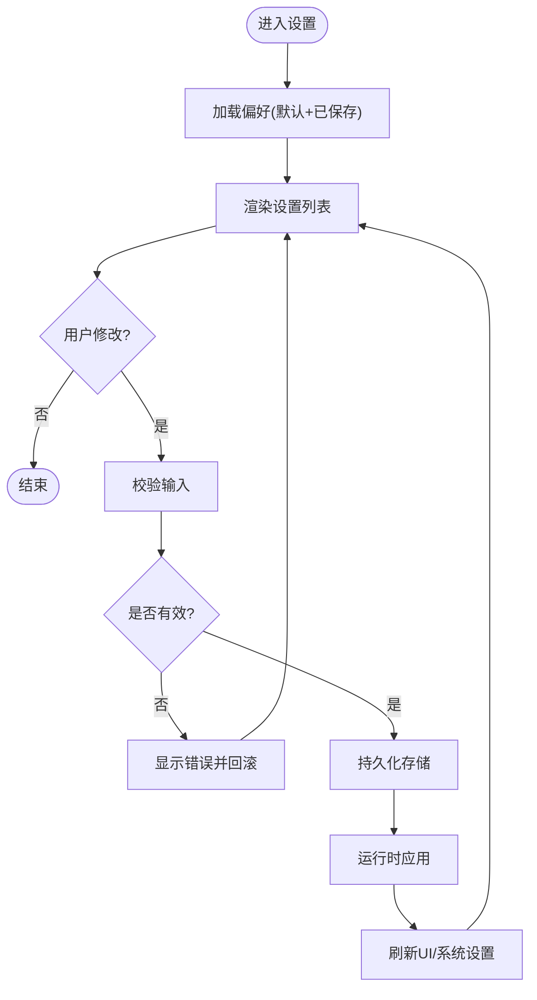
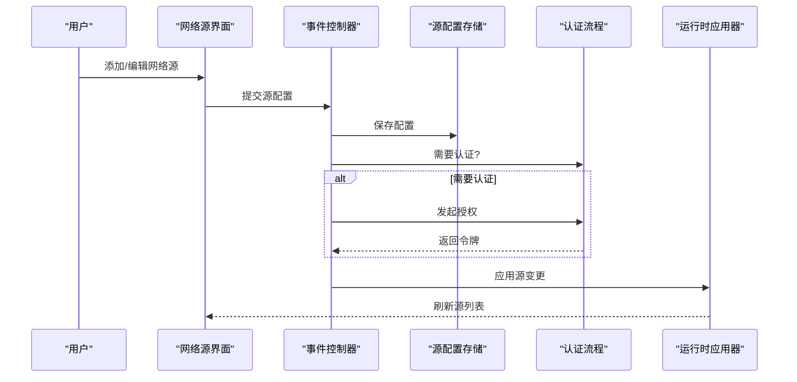
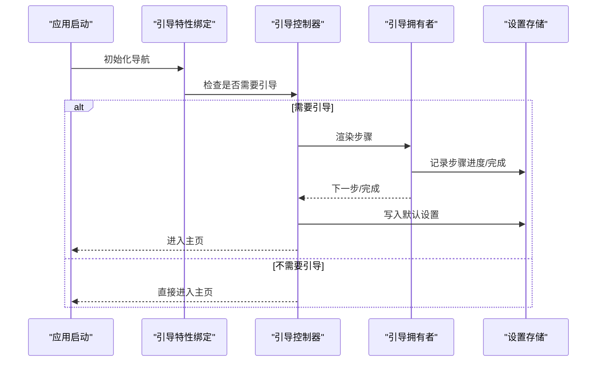
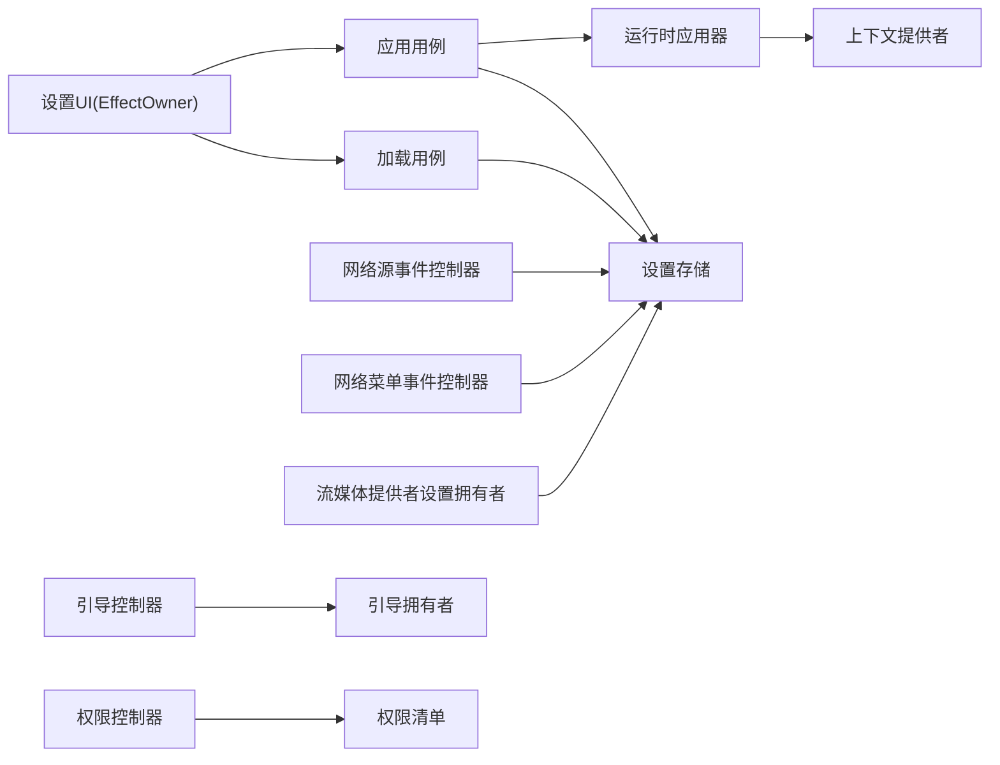

# 设置界面

<cite>
**本文引用的文件**   
- [SettingsFeatureBinding.java](file://app/src/main/java/app/yukine/SettingsFeatureBinding.java)
- [SettingsModule.kt](file://app/src/main/java/app/yukine/SettingsModule.kt)
- [MainSettingsStore.kt](file://app/src/main/java/app/yukine/MainSettingsStore.kt)
- [LoadSettingsPreferencesUseCase.kt](file://app/src/main/java/app/yukine/LoadSettingsPreferencesUseCase.kt)
- [ApplySettingsPreferenceUseCase.kt](file://app/src/main/java/app/yukine/ApplySettingsPreferenceUseCase.kt)
- [SettingsRuntimeApplier.kt](file://app/src/main/java/app/yukine/SettingsRuntimeApplier.kt)
- [SettingsEffectOwner.kt](file://app/src/main/java/app/yukine/SettingsEffectOwner.kt)
- [OnboardingController.kt](file://app/src/main/java/app/yukine/OnboardingController.kt)
- [OnboardingOwner.kt](file://app/src/main/java/app/yukine/OnboardingOwner.kt)
- [OnboardingFeatureBinding.java](file://app/src/main/java/app/yukine/OnboardingFeatureBinding.java)
- [NetworkSourcesEventController.kt](file://app/src/main/java/app/yukine/NetworkSourcesEventController.kt)
- [NetworkMenuEventController.kt](file://app/src/main/java/app/yukine/NetworkMenuEventController.kt)
- [AppPermissions.kt](file://app/src/main/java/app/yukine/AppPermissions.kt)
- [MainPermissionController.kt](file://app/src/main/java/app/yukine/MainPermissionController.kt)
- [SettingsContextProvider.kt](file://app/src/main/java/app/yukine/SettingsContextProvider.kt)
- [DialogLanguageProvider.kt](file://app/src/main/java/app/yukine/DialogLanguageProvider.kt)
- [StreamingProviderSettingsOwner.kt](file://app/src/main/java/app/yukine/StreamingProviderSettingsOwner.kt)
</cite>

## 目录
1. [简介](#简介)
2. [项目结构](#项目结构)
3. [核心组件](#核心组件)
4. [架构总览](#架构总览)
5. [详细组件分析](#详细组件分析)
6. [依赖关系分析](#依赖关系分析)
7. [性能与体验考量](#性能与体验考量)
8. [故障排查指南](#故障排查指南)
9. [结论](#结论)
10. [附录](#附录)

## 简介
本文件面向“设置界面”子系统，覆盖主设置界面 SettingsScreen、网络源管理 NetworkSourcesScreen、新手引导 OnboardingScreen 的设计与实现。文档重点说明：
- 设置项分类、偏好存储、主题切换、语言选择
- 设置验证、默认值管理、导入导出
- 网络源配置、权限管理、应用信息展示
- 用户体验设计、配置热重载、设置迁移方案

## 项目结构
设置相关代码主要分布在 app 模块的 java 包中，采用“特性绑定 + 控制器/所有者 + UseCase + Store”的分层组织方式：
- 特性绑定（FeatureBinding）负责将导航路由与具体功能模块对接
- 控制器/所有者（Controller/Owner）负责 UI 状态与交互编排
- UseCase 封装业务用例（加载、应用、校验等）
- Store 提供持久化读写能力
- RuntimeApplier 负责运行时生效（热重载）

图表来源
- [SettingsFeatureBinding.java](file://app/src/main/java/app/yukine/SettingsFeatureBinding.java)
- [SettingsModule.kt](file://app/src/main/java/app/yukine/SettingsModule.kt)
- [SettingsContextProvider.kt](file://app/src/main/java/app/yukine/SettingsContextProvider.kt)
- [SettingsEffectOwner.kt](file://app/src/main/java/app/yukine/SettingsEffectOwner.kt)
- [MainSettingsStore.kt](file://app/src/main/java/app/yukine/MainSettingsStore.kt)
- [LoadSettingsPreferencesUseCase.kt](file://app/src/main/java/app/yukine/LoadSettingsPreferencesUseCase.kt)
- [ApplySettingsPreferenceUseCase.kt](file://app/src/main/java/app/yukine/ApplySettingsPreferenceUseCase.kt)
- [SettingsRuntimeApplier.kt](file://app/src/main/java/app/yukine/SettingsRuntimeApplier.kt)
- [NetworkSourcesEventController.kt](file://app/src/main/java/app/yukine/NetworkSourcesEventController.kt)
- [NetworkMenuEventController.kt](file://app/src/main/java/app/yukine/NetworkMenuEventController.kt)
- [StreamingProviderSettingsOwner.kt](file://app/src/main/java/app/yukine/StreamingProviderSettingsOwner.kt)
- [OnboardingController.kt](file://app/src/main/java/app/yukine/OnboardingController.kt)
- [OnboardingOwner.kt](file://app/src/main/java/app/yukine/OnboardingOwner.kt)
- [OnboardingFeatureBinding.java](file://app/src/main/java/app/yukine/OnboardingFeatureBinding.java)
- [AppPermissions.kt](file://app/src/main/java/app/yukine/AppPermissions.kt)
- [MainPermissionController.kt](file://app/src/main/java/app/yukine/MainPermissionController.kt)
- [DialogLanguageProvider.kt](file://app/src/main/java/app/yukine/DialogLanguageProvider.kt)

章节来源
- [SettingsFeatureBinding.java](file://app/src/main/java/app/yukine/SettingsFeatureBinding.java)
- [SettingsModule.kt](file://app/src/main/java/app/yukine/SettingsModule.kt)
- [SettingsContextProvider.kt](file://app/src/main/java/app/yukine/SettingsContextProvider.kt)

## 核心组件
- 主设置界面（SettingsScreen）
  - 通过特性绑定接入导航，由 EffectOwner 编排加载与应用逻辑，使用 Store 读取/写入偏好，RuntimeApplier 进行运行时生效。
- 网络源管理（NetworkSourcesScreen）
  - 事件控制器负责用户操作到数据变更的映射；菜单事件控制器处理网络相关入口；流媒体提供者设置拥有者负责特定源的参数编辑与校验。
- 新手引导（OnboardingScreen）
  - Controller 驱动流程，Owner 持有页面状态，FeatureBinding 完成路由挂载。

章节来源
- [SettingsEffectOwner.kt](file://app/src/main/java/app/yukine/SettingsEffectOwner.kt)
- [SettingsRuntimeApplier.kt](file://app/src/main/java/app/yukine/SettingsRuntimeApplier.kt)
- [MainSettingsStore.kt](file://app/src/main/java/app/yukine/MainSettingsStore.kt)
- [LoadSettingsPreferencesUseCase.kt](file://app/src/main/java/app/yukine/LoadSettingsPreferencesUseCase.kt)
- [ApplySettingsPreferenceUseCase.kt](file://app/src/main/java/app/yukine/ApplySettingsPreferenceUseCase.kt)
- [NetworkSourcesEventController.kt](file://app/src/main/java/app/yukine/NetworkSourcesEventController.kt)
- [NetworkMenuEventController.kt](file://app/src/main/java/app/yukine/NetworkMenuEventController.kt)
- [StreamingProviderSettingsOwner.kt](file://app/src/main/java/app/yukine/StreamingProviderSettingsOwner.kt)
- [OnboardingController.kt](file://app/src/main/java/app/yukine/OnboardingController.kt)
- [OnboardingOwner.kt](file://app/src/main/java/app/yukine/OnboardingOwner.kt)
- [OnboardingFeatureBinding.java](file://app/src/main/java/app/yukine/OnboardingFeatureBinding.java)

## 架构总览
设置子系统遵循“UI 编排 -> 用例 -> 存储 -> 运行时应用”的单向数据流，并通过上下文提供者注入语言、主题等环境信息。

图表来源
- [SettingsEffectOwner.kt](file://app/src/main/java/app/yukine/SettingsEffectOwner.kt)
- [LoadSettingsPreferencesUseCase.kt](file://app/src/main/java/app/yukine/LoadSettingsPreferencesUseCase.kt)
- [MainSettingsStore.kt](file://app/src/main/java/app/yukine/MainSettingsStore.kt)
- [ApplySettingsPreferenceUseCase.kt](file://app/src/main/java/app/yukine/ApplySettingsPreferenceUseCase.kt)
- [SettingsRuntimeApplier.kt](file://app/src/main/java/app/yukine/SettingsRuntimeApplier.kt)

## 详细组件分析

### 主设置界面（SettingsScreen）
- 职责
  - 呈现设置分组与条目，承载主题、语言、播放行为、下载路径等选项。
  - 协调加载、保存、校验与运行时生效。
- 关键流程
  - 进入页面时调用加载用例，从存储读取默认值与用户值并合并。
  - 用户修改后调用应用用例，先做基本校验，再落盘并触发运行时应用。
  - 主题与语言变化通过上下文提供者刷新 UI 语言与主题资源。
- 设置项分类建议
  - 通用：主题、语言、字体大小、对比度
  - 播放：音质、缓存策略、后台控制
  - 下载：目标目录、并发数、命名规则
  - 网络：代理、超时、重试
  - 高级：日志级别、调试开关、实验特性
- 默认值与验证
  - 默认值由加载用例在空值时回填；验证由应用用例执行，失败则提示并回滚。
- 导入导出
  - 导入：解析外部配置，合并至现有设置，必要时执行迁移脚本。
  - 导出：序列化当前设置，生成可分享文件。

图表来源
- [SettingsEffectOwner.kt](file://app/src/main/java/app/yukine/SettingsEffectOwner.kt)
- [LoadSettingsPreferencesUseCase.kt](file://app/src/main/java/app/yukine/LoadSettingsPreferencesUseCase.kt)
- [ApplySettingsPreferenceUseCase.kt](file://app/src/main/java/app/yukine/ApplySettingsPreferenceUseCase.kt)
- [SettingsRuntimeApplier.kt](file://app/src/main/java/app/yukine/SettingsRuntimeApplier.kt)
- [MainSettingsStore.kt](file://app/src/main/java/app/yukine/MainSettingsStore.kt)

章节来源
- [SettingsEffectOwner.kt](file://app/src/main/java/app/yukine/SettingsEffectOwner.kt)
- [LoadSettingsPreferencesUseCase.kt](file://app/src/main/java/app/yukine/LoadSettingsPreferencesUseCase.kt)
- [ApplySettingsPreferenceUseCase.kt](file://app/src/main/java/app/yukine/ApplySettingsPreferenceUseCase.kt)
- [SettingsRuntimeApplier.kt](file://app/src/main/java/app/yukine/SettingsRuntimeApplier.kt)
- [MainSettingsStore.kt](file://app/src/main/java/app/yukine/MainSettingsStore.kt)
- [SettingsContextProvider.kt](file://app/src/main/java/app/yukine/SettingsContextProvider.kt)
- [DialogLanguageProvider.kt](file://app/src/main/java/app/yukine/DialogLanguageProvider.kt)

### 网络源管理（NetworkSourcesScreen）
- 职责
  - 管理网络播放源（如第三方服务）的增删改查、启用/禁用、认证与参数配置。
- 关键参与者
  - 事件控制器：将用户操作转换为源配置变更事件。
  - 菜单事件控制器：统一处理网络相关入口与快捷操作。
  - 流媒体提供者设置拥有者：针对特定源的表单校验、鉴权回调与连接测试。
- 典型流程
  - 新增/编辑源：收集参数 -> 校验 -> 保存 -> 测试连通性 -> 启用或提示失败原因。
  - 删除源：二次确认 -> 清理本地缓存 -> 刷新列表。
  - 认证：跳转授权页 -> 回调处理 -> 更新凭据 -> 刷新可用列表。

图表来源
- [NetworkSourcesEventController.kt](file://app/src/main/java/app/yukine/NetworkSourcesEventController.kt)
- [NetworkMenuEventController.kt](file://app/src/main/java/app/yukine/NetworkMenuEventController.kt)
- [StreamingProviderSettingsOwner.kt](file://app/src/main/java/app/yukine/StreamingProviderSettingsOwner.kt)
- [MainSettingsStore.kt](file://app/src/main/java/app/yukine/MainSettingsStore.kt)
- [SettingsRuntimeApplier.kt](file://app/src/main/java/app/yukine/SettingsRuntimeApplier.kt)

章节来源
- [NetworkSourcesEventController.kt](file://app/src/main/java/app/yukine/NetworkSourcesEventController.kt)
- [NetworkMenuEventController.kt](file://app/src/main/java/app/yukine/NetworkMenuEventController.kt)
- [StreamingProviderSettingsOwner.kt](file://app/src/main/java/app/yukine/StreamingProviderSettingsOwner.kt)
- [MainSettingsStore.kt](file://app/src/main/java/app/yukine/MainSettingsStore.kt)

### 新手引导（OnboardingScreen）
- 职责
  - 首次启动或重置后，引导用户完成必要设置（如语言、主题、权限）。
- 关键参与者
  - 控制器：驱动步骤流转、条件判断与完成态判定。
  - 拥有者：维护步骤状态与交互结果。
  - 特性绑定：注册引导入口与路由。
- 流程要点
  - 检测是否需要引导（版本/标记位）。
  - 逐步引导关键设置，完成后写入默认值或用户偏好。
  - 支持跳过与返回，保证可逆性与容错。

图表来源
- [OnboardingFeatureBinding.java](file://app/src/main/java/app/yukine/OnboardingFeatureBinding.java)
- [OnboardingController.kt](file://app/src/main/java/app/yukine/OnboardingController.kt)
- [OnboardingOwner.kt](file://app/src/main/java/app/yukine/OnboardingOwner.kt)
- [MainSettingsStore.kt](file://app/src/main/java/app/yukine/MainSettingsStore.kt)

章节来源
- [OnboardingFeatureBinding.java](file://app/src/main/java/app/yukine/OnboardingFeatureBinding.java)
- [OnboardingController.kt](file://app/src/main/java/app/yukine/OnboardingController.kt)
- [OnboardingOwner.kt](file://app/src/main/java/app/yukine/OnboardingOwner.kt)

### 设置项分类与偏好存储
- 分类建议
  - 通用：主题、语言、字体、对比度
  - 播放：音质、缓存、后台控制、浮窗歌词
  - 下载：目录、并发、命名、去重
  - 网络：代理、超时、重试、证书
  - 高级：日志、调试、实验特性
- 偏好存储
  - 使用统一的设置存储接口，区分默认值与用户值，合并后供 UI 消费。
  - 对敏感字段（如令牌）采用安全存储。
- 默认值管理
  - 首次运行或升级时按版本策略填充默认值。
  - 提供迁移脚本，将旧键名映射到新结构。

章节来源
- [MainSettingsStore.kt](file://app/src/main/java/app/yukine/MainSettingsStore.kt)
- [LoadSettingsPreferencesUseCase.kt](file://app/src/main/java/app/yukine/LoadSettingsPreferencesUseCase.kt)
- [ApplySettingsPreferenceUseCase.kt](file://app/src/main/java/app/yukine/ApplySettingsPreferenceUseCase.kt)

### 主题切换与语言选择
- 主题切换
  - 通过运行时应用器立即生效，避免重启。
  - 结合上下文提供者刷新主题资源。
- 语言选择
  - 通过对话框语言提供者动态切换语言。
  - 重新创建必要的 Activity/Fragment 以应用新语言。

章节来源
- [SettingsRuntimeApplier.kt](file://app/src/main/java/app/yukine/SettingsRuntimeApplier.kt)
- [SettingsContextProvider.kt](file://app/src/main/java/app/yukine/SettingsContextProvider.kt)
- [DialogLanguageProvider.kt](file://app/src/main/java/app/yukine/DialogLanguageProvider.kt)

### 设置验证、导入导出与迁移
- 验证
  - 应用前进行格式、范围、依赖关系校验，失败则提示并回滚。
- 导入导出
  - 导入：解析 JSON/XML，校验并合并，必要时执行迁移。
  - 导出：序列化当前设置，附带版本与时间戳。
- 迁移
  - 基于版本号比对，执行增量迁移脚本，确保向后兼容。

章节来源
- [ApplySettingsPreferenceUseCase.kt](file://app/src/main/java/app/yukine/ApplySettingsPreferenceUseCase.kt)
- [MainSettingsStore.kt](file://app/src/main/java/app/yukine/MainSettingsStore.kt)

### 权限管理与应用信息展示
- 权限管理
  - 集中定义所需权限清单，按需申请并处理拒绝场景。
  - 权限结果统一上报，影响相关功能可用性。
- 应用信息
  - 展示版本、构建信息、许可证与开源声明。
  - 提供反馈与问题上报入口。

章节来源
- [AppPermissions.kt](file://app/src/main/java/app/yukine/AppPermissions.kt)
- [MainPermissionController.kt](file://app/src/main/java/app/yukine/MainPermissionController.kt)

## 依赖关系分析
- 耦合与内聚
  - UI 层仅依赖控制器与用例，不直接访问存储，提升内聚与可测性。
  - 运行时应用器作为横切关注点，被多处复用。
- 外部依赖
  - 系统权限、语言资源、主题资源、网络库等通过抽象接口隔离。
- 循环依赖
  - 通过特性绑定与模块装配解耦，避免直接循环引用。

图表来源
- [SettingsEffectOwner.kt](file://app/src/main/java/app/yukine/SettingsEffectOwner.kt)
- [LoadSettingsPreferencesUseCase.kt](file://app/src/main/java/app/yukine/LoadSettingsPreferencesUseCase.kt)
- [ApplySettingsPreferenceUseCase.kt](file://app/src/main/java/app/yukine/ApplySettingsPreferenceUseCase.kt)
- [MainSettingsStore.kt](file://app/src/main/java/app/yukine/MainSettingsStore.kt)
- [SettingsRuntimeApplier.kt](file://app/src/main/java/app/yukine/SettingsRuntimeApplier.kt)
- [SettingsContextProvider.kt](file://app/src/main/java/app/yukine/SettingsContextProvider.kt)
- [NetworkSourcesEventController.kt](file://app/src/main/java/app/yukine/NetworkSourcesEventController.kt)
- [NetworkMenuEventController.kt](file://app/src/main/java/app/yukine/NetworkMenuEventController.kt)
- [StreamingProviderSettingsOwner.kt](file://app/src/main/java/app/yukine/StreamingProviderSettingsOwner.kt)
- [OnboardingController.kt](file://app/src/main/java/app/yukine/OnboardingController.kt)
- [OnboardingOwner.kt](file://app/src/main/java/app/yukine/OnboardingOwner.kt)
- [MainPermissionController.kt](file://app/src/main/java/app/yukine/MainPermissionController.kt)
- [AppPermissions.kt](file://app/src/main/java/app/yukine/AppPermissions.kt)

章节来源
- [SettingsFeatureBinding.java](file://app/src/main/java/app/yukine/SettingsFeatureBinding.java)
- [SettingsModule.kt](file://app/src/main/java/app/yukine/SettingsModule.kt)

## 性能与体验考量
- 首屏加载
  - 预加载默认值，延迟加载重型设置项。
- 热重载
  - 主题、语言、网络代理等变更后即时生效，减少用户等待。
- 批量更新
  - 合并多次修改为一次持久化，降低 I/O 压力。
- 错误反馈
  - 明确错误位置与修复建议，支持一键回滚。
- 无障碍与国际化
  - 所有文案走多语言资源，支持高对比度与大字体。

[本节为通用指导，无需源码引用]

## 故障排查指南
- 设置未生效
  - 检查运行时应用器是否被调用，确认上下文提供者是否正确刷新。
- 语言/主题异常
  - 确认语言资源与主题资源是否存在对应键值，检查重建流程。
- 网络源不可用
  - 查看认证回调与连通性测试结果，核对凭据与代理配置。
- 权限导致功能受限
  - 检查权限申请结果与后续降级逻辑。

章节来源
- [SettingsRuntimeApplier.kt](file://app/src/main/java/app/yukine/SettingsRuntimeApplier.kt)
- [SettingsContextProvider.kt](file://app/src/main/java/app/yukine/SettingsContextProvider.kt)
- [DialogLanguageProvider.kt](file://app/src/main/java/app/yukine/DialogLanguageProvider.kt)
- [NetworkSourcesEventController.kt](file://app/src/main/java/app/yukine/NetworkSourcesEventController.kt)
- [MainPermissionController.kt](file://app/src/main/java/app/yukine/MainPermissionController.kt)

## 结论
设置子系统通过清晰的分层与单向数据流，实现了良好的可维护性与可扩展性。主设置界面、网络源管理与新手引导三大模块各司其职，配合运行时应用与上下文注入，提供了流畅的用户体验。建议在后续迭代中完善导入导出的可视化流程与迁移脚本的版本治理，进一步提升稳定性与易用性。

[本节为总结，无需源码引用]

## 附录
- 术语
  - 运行时应用：在不重启应用的前提下使设置变更立即生效。
  - 上下文提供者：向 UI 层注入语言、主题等环境信息的机制。
  - 特性绑定：将导航路由与具体功能模块对接的装配层。

[本节为概念说明，无需源码引用]