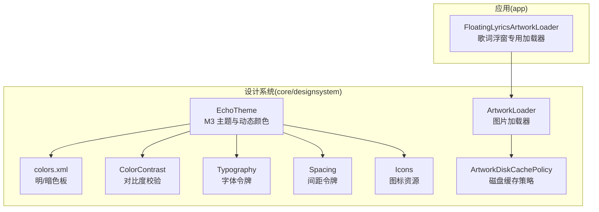
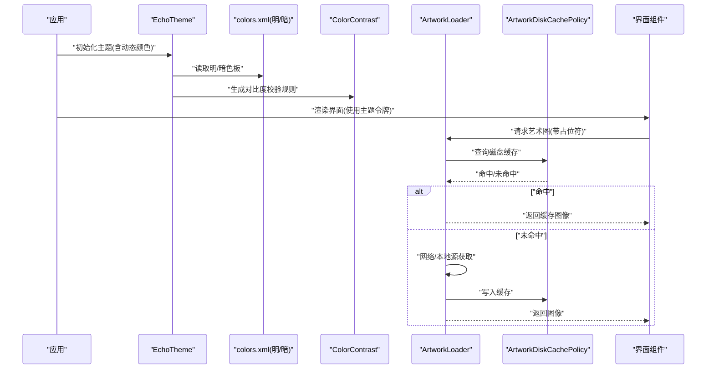
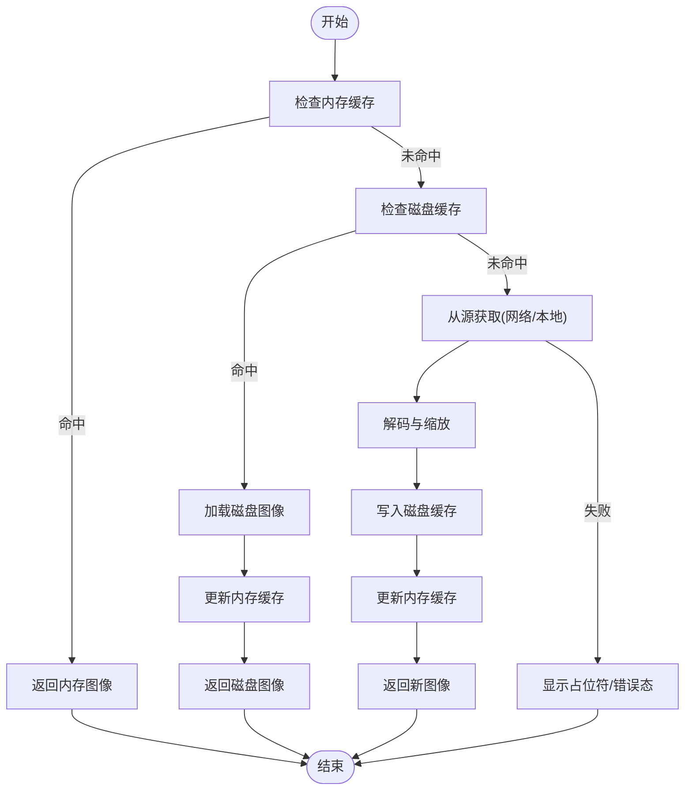
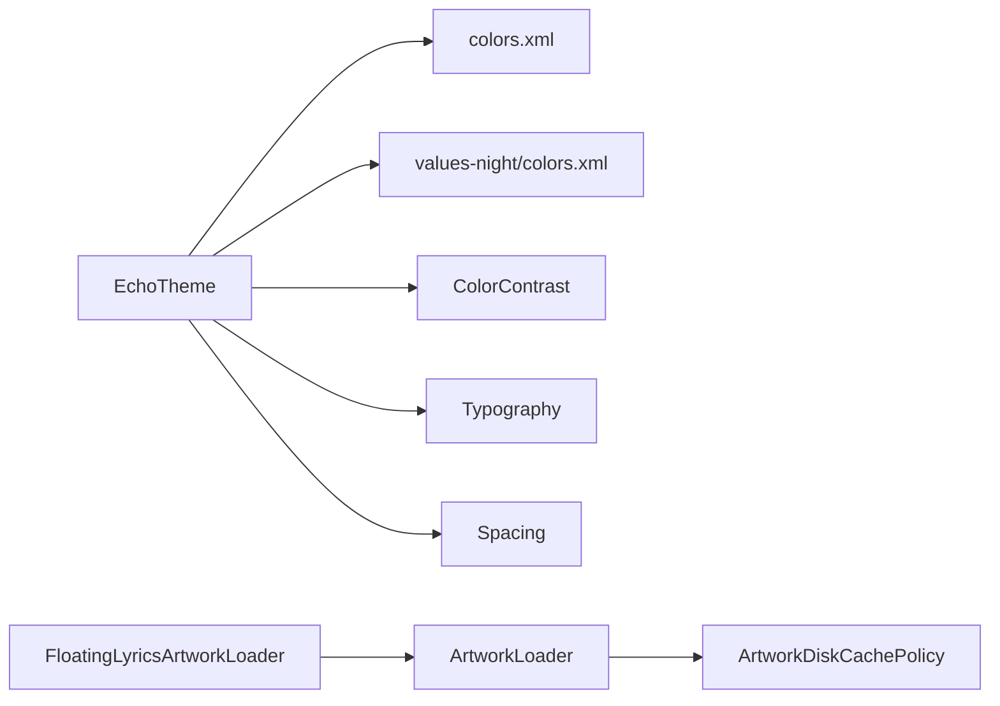

# 设计系统

<cite>
**本文引用的文件**   
- [core/designsystem/src/main/java/app/yukine/ui/theme/EchoTheme.kt](file://core/designsystem/src/main/java/app/yukine/ui/theme/EchoTheme.kt)
- [core/designsystem/src/main/java/app/yukine/ui/theme/ColorContrast.kt](file://core/designsystem/src/main/java/app/yukine/ui/theme/ColorContrast.kt)
- [core/designsystem/src/main/java/app/yukine/ui/theme/Typography.kt](file://core/designsystem/src/main/java/app/yukine/ui/theme/Typography.kt)
- [core/designsystem/src/main/java/app/yukine/ui/theme/Spacing.kt](file://core/designsystem/src/main/java/app/yukine/ui/theme/Spacing.kt)
- [core/designsystem/src/main/java/app/yukine/ui/theme/Icons.kt](file://core/designsystem/src/main/java/app/yukine/ui/theme/Icons.kt)
- [core/designsystem/src/main/java/app/yukine/ui/artwork/ArtworkLoader.kt](file://core/designsystem/src/main/java/app/yukine/ui/artwork/ArtworkLoader.kt)
- [core/designsystem/src/main/java/app/yukine/ui/artwork/ArtworkDiskCachePolicy.kt](file://core/designsystem/src/main/java/app/yukine/ui/artwork/ArtworkDiskCachePolicy.kt)
- [core/designsystem/src/test/java/app/yukine/ui/ArtworkDiskCachePolicyTest.kt](file://core/designsystem/src/test/java/app/yukine/ui/ArtworkDiskCachePolicyTest.kt)
- [app/src/main/java/app/yukine/FloatingLyricsArtworkLoader.kt](file://app/src/main/java/app/yukine/FloatingLyricsArtworkLoader.kt)
- [core/designsystem/src/main/res/values/colors.xml](file://core/designsystem/src/main/res/values/colors.xml)
- [core/designsystem/src/main/res/values-night/colors.xml](file://core/designsystem/src/main/res/values-night/colors.xml)
- [core/designsystem/src/main/res/font/inter_font_family.xml](file://core/designsystem/src/main/res/font/inter_font_family.xml)
</cite>

## 目录
1. [简介](#简介)
2. [项目结构](#项目结构)
3. [核心组件](#核心组件)
4. [架构总览](#架构总览)
5. [详细组件分析](#详细组件分析)
6. [依赖关系分析](#依赖关系分析)
7. [性能考量](#性能考量)
8. [故障排查指南](#故障排查指南)
9. [结论](#结论)
10. [附录](#附录)

## 简介
本设计系统文档聚焦于 Echo 主题系统、颜色对比度、图标资源与图片加载器，并说明其与 Material Design 3（M3）的集成方式、动态颜色支持、深色模式适配。同时覆盖组件样式规范、字体排版、间距系统，以及艺术图片加载优化、占位符处理、缓存策略。最后提供设计令牌管理、主题定制扩展与跨屏幕适配方案建议。

## 项目结构
设计系统位于 core/designsystem 模块中，围绕“主题—色彩—排版—间距—图标—图片加载”分层组织：
- 主题与 M3 集成：EchoTheme 负责将 M3 主题应用到应用层，并提供动态颜色与深色模式入口。
- 色彩与对比度：colors.xml 定义明暗两套调色板；ColorContrast 提供对比度校验与可访问性保障。
- 排版与间距：Typography 与 Spacing 分别封装字体与间距令牌，确保一致性与可扩展性。
- 图标：Icons 集中管理矢量图标资源与使用约定。
- 图片加载：ArtworkLoader 与 ArtworkDiskCachePolicy 实现高效的艺术图加载、占位符与磁盘缓存策略。

图表来源
- [core/designsystem/src/main/java/app/yukine/ui/theme/EchoTheme.kt](file://core/designsystem/src/main/java/app/yukine/ui/theme/EchoTheme.kt)
- [core/designsystem/src/main/res/values/colors.xml](file://core/designsystem/src/main/res/values/colors.xml)
- [core/designsystem/src/main/res/values-night/colors.xml](file://core/designsystem/src/main/res/values-night/colors.xml)
- [core/designsystem/src/main/java/app/yukine/ui/theme/ColorContrast.kt](file://core/designsystem/src/main/java/app/yukine/ui/theme/ColorContrast.kt)
- [core/designsystem/src/main/java/app/yukine/ui/theme/Typography.kt](file://core/designsystem/src/main/java/app/yukine/ui/theme/Typography.kt)
- [core/designsystem/src/main/java/app/yukine/ui/theme/Spacing.kt](file://core/designsystem/src/main/java/app/yukine/ui/theme/Spacing.kt)
- [core/designsystem/src/main/java/app/yukine/ui/theme/Icons.kt](file://core/designsystem/src/main/java/app/yukine/ui/theme/Icons.kt)
- [core/designsystem/src/main/java/app/yukine/ui/artwork/ArtworkLoader.kt](file://core/designsystem/src/main/java/app/yukine/ui/artwork/ArtworkLoader.kt)
- [core/designsystem/src/main/java/app/yukine/ui/artwork/ArtworkDiskCachePolicy.kt](file://core/designsystem/src/main/java/app/yukine/ui/artwork/ArtworkDiskCachePolicy.kt)
- [app/src/main/java/app/yukine/FloatingLyricsArtworkLoader.kt](file://app/src/main/java/app/yukine/FloatingLyricsArtworkLoader.kt)

章节来源
- [core/designsystem/src/main/java/app/yukine/ui/theme/EchoTheme.kt](file://core/designsystem/src/main/java/app/yukine/ui/theme/EchoTheme.kt)
- [core/designsystem/src/main/res/values/colors.xml](file://core/designsystem/src/main/res/values/colors.xml)
- [core/designsystem/src/main/res/values-night/colors.xml](file://core/designsystem/src/main/res/values-night/colors.xml)
- [core/designsystem/src/main/java/app/yukine/ui/theme/ColorContrast.kt](file://core/designsystem/src/main/java/app/yukine/ui/theme/ColorContrast.kt)
- [core/designsystem/src/main/java/app/yukine/ui/theme/Typography.kt](file://core/designsystem/src/main/java/app/yukine/ui/theme/Typography.kt)
- [core/designsystem/src/main/java/app/yukine/ui/theme/Spacing.kt](file://core/designsystem/src/main/java/app/yukine/ui/theme/Spacing.kt)
- [core/designsystem/src/main/java/app/yukine/ui/theme/Icons.kt](file://core/designsystem/src/main/java/app/yukine/ui/theme/Icons.kt)
- [core/designsystem/src/main/java/app/yukine/ui/artwork/ArtworkLoader.kt](file://core/designsystem/src/main/java/app/yukine/ui/artwork/ArtworkLoader.kt)
- [core/designsystem/src/main/java/app/yukine/ui/artwork/ArtworkDiskCachePolicy.kt](file://core/designsystem/src/main/java/app/yukine/ui/artwork/ArtworkDiskCachePolicy.kt)
- [app/src/main/java/app/yukine/FloatingLyricsArtworkLoader.kt](file://app/src/main/java/app/yukine/FloatingLyricsArtworkLoader.kt)

## 核心组件
- Echo 主题系统
  - 基于 M3 构建，统一提供浅色/深色主题、动态颜色注入、组件配色派生与全局主题上下文。
  - 通过主题配置暴露给各功能模块，保证视觉一致性。
- 颜色对比度
  - 提供文本与背景对比度计算与校验能力，辅助满足 WCAG 可访问性要求。
- 图标资源
  - 集中管理矢量图标，定义命名与尺寸规范，便于在主题中按角色复用。
- 图片加载器
  - 面向专辑封面等艺术图的加载流程，包含占位符、错误态、内存/磁盘缓存与解码优化。
- 字体排版与间距
  - Typography 与 Spacing 作为设计令牌，为组件提供一致的字号、字重、行高与间距。

章节来源
- [core/designsystem/src/main/java/app/yukine/ui/theme/EchoTheme.kt](file://core/designsystem/src/main/java/app/yukine/ui/theme/EchoTheme.kt)
- [core/designsystem/src/main/java/app/yukine/ui/theme/ColorContrast.kt](file://core/designsystem/src/main/java/app/yukine/ui/theme/ColorContrast.kt)
- [core/designsystem/src/main/java/app/yukine/ui/theme/Icons.kt](file://core/designsystem/src/main/java/app/yukine/ui/theme/Icons.kt)
- [core/designsystem/src/main/java/app/yukine/ui/artwork/ArtworkLoader.kt](file://core/designsystem/src/main/java/app/yukine/ui/artwork/ArtworkLoader.kt)
- [core/designsystem/src/main/java/app/yukine/ui/artwork/ArtworkDiskCachePolicy.kt](file://core/designsystem/src/main/java/app/yukine/ui/artwork/ArtworkDiskCachePolicy.kt)
- [core/designsystem/src/main/java/app/yukine/ui/theme/Typography.kt](file://core/designsystem/src/main/java/app/yukine/ui/theme/Typography.kt)
- [core/designsystem/src/main/java/app/yukine/ui/theme/Spacing.kt](file://core/designsystem/src/main/java/app/yukine/ui/theme/Spacing.kt)

## 架构总览
下图展示设计系统与应用的交互关系，包括 M3 主题、动态颜色、深色模式、图片加载链路及缓存策略。

图表来源
- [core/designsystem/src/main/java/app/yukine/ui/theme/EchoTheme.kt](file://core/designsystem/src/main/java/app/yukine/ui/theme/EchoTheme.kt)
- [core/designsystem/src/main/res/values/colors.xml](file://core/designsystem/src/main/res/values/colors.xml)
- [core/designsystem/src/main/res/values-night/colors.xml](file://core/designsystem/src/main/res/values-night/colors.xml)
- [core/designsystem/src/main/java/app/yukine/ui/theme/ColorContrast.kt](file://core/designsystem/src/main/java/app/yukine/ui/theme/ColorContrast.kt)
- [core/designsystem/src/main/java/app/yukine/ui/artwork/ArtworkLoader.kt](file://core/designsystem/src/main/java/app/yukine/ui/artwork/ArtworkLoader.kt)
- [core/designsystem/src/main/java/app/yukine/ui/artwork/ArtworkDiskCachePolicy.kt](file://core/designsystem/src/main/java/app/yukine/ui/artwork/ArtworkDiskCachePolicy.kt)

## 详细组件分析

### Echo 主题系统（M3 集成、动态颜色、深色模式）
- 职责
  - 封装 M3 主题创建与配置，提供浅色/深色主题切换。
  - 接入系统动态颜色，使主题随壁纸或系统色板变化。
  - 向组件层暴露主题令牌（颜色、形状、排版、阴影等）。
- 关键要点
  - 主题作用域：在应用启动时设置，供所有 Compose/View 树共享。
  - 动态颜色：根据设备能力与用户偏好启用，回退到静态色板。
  - 深色模式：通过 values-night 资源与运行时开关协同。
- 扩展建议
  - 新增业务色板时，优先映射到 M3 语义化颜色（如 primary、onPrimary），避免硬编码。
  - 对对比度敏感区域，结合 ColorContrast 进行自动化校验。

章节来源
- [core/designsystem/src/main/java/app/yukine/ui/theme/EchoTheme.kt](file://core/designsystem/src/main/java/app/yukine/ui/theme/EchoTheme.kt)
- [core/designsystem/src/main/res/values/colors.xml](file://core/designsystem/src/main/res/values/colors.xml)
- [core/designsystem/src/main/res/values-night/colors.xml](file://core/designsystem/src/main/res/values-night/colors.xml)

### 颜色对比度（可访问性）
- 职责
  - 计算前景/背景对比度，判定是否满足目标等级（如 AA/AAA）。
  - 提供自动调整或告警机制，帮助设计师与开发者规避可读性问题。
- 使用场景
  - 自定义控件文本与背景组合。
  - 主题切换后对关键信息（状态、提示）进行对比度检查。
- 最佳实践
  - 以语义化颜色为基础，避免直接写死对比度阈值。
  - 在 CI 中加入对比度测试用例，防止回归。

章节来源
- [core/designsystem/src/main/java/app/yukine/ui/theme/ColorContrast.kt](file://core/designsystem/src/main/java/app/yukine/ui/theme/ColorContrast.kt)

### 图标资源
- 职责
  - 统一管理矢量图标，定义命名、尺寸与描边风格。
  - 与主题联动，支持按角色着色（如主色、强调色）。
- 规范
  - 使用统一的图标集与网格对齐，保持视觉一致性。
  - 图标资源按功能分组，减少重复与冲突。
- 使用建议
  - 在组件中通过主题令牌引用图标颜色，而非固定色值。

章节来源
- [core/designsystem/src/main/java/app/yukine/ui/theme/Icons.kt](file://core/designsystem/src/main/java/app/yukine/ui/theme/Icons.kt)

### 字体排版与间距系统
- 字体排版（Typography）
  - 定义标题、正文、标签等字阶，统一字号、字重、行高与字母间距。
  - 与 M3 排版体系对齐，支持多语言与不同密度屏幕。
- 间距（Spacing）
  - 提供 4dp/8dp 等基础单位与组合间距，确保布局节奏一致。
  - 在卡片、列表、表单等常见场景中复用。
- 扩展建议
  - 新增排版层级时，遵循既有字阶与比例，避免引入过多变体。
  - 间距尽量使用组合而非绝对数值，提升可维护性。

章节来源
- [core/designsystem/src/main/java/app/yukine/ui/theme/Typography.kt](file://core/designsystem/src/main/java/app/yukine/ui/theme/Typography.kt)
- [core/designsystem/src/main/java/app/yukine/ui/theme/Spacing.kt](file://core/designsystem/src/main/java/app/yukine/ui/theme/Spacing.kt)
- [core/designsystem/src/main/res/font/inter_font_family.xml](file://core/designsystem/src/main/res/font/inter_font_family.xml)

### 图片加载器与缓存策略（艺术图优化）
- 职责
  - 提供统一的艺术图加载接口，支持占位符、错误态与加载动画。
  - 管理内存与磁盘缓存，降低重复 IO 与网络开销。
  - 针对大图进行采样、缩放与格式优化，减少内存峰值。
- 关键流程
  - 先查内存缓存，再查磁盘缓存，最后从源获取并回填缓存。
  - 失败时回退到占位符或默认图，保证界面稳定。
- 策略要点
  - 磁盘缓存键需包含分辨率、质量与变换参数，避免脏数据。
  - 对高频缩略图与大封面采用不同策略（尺寸、压缩比、过期时间）。
- 测试
  - 通过单元测试验证缓存命中/失效逻辑与边界条件。

图表来源
- [core/designsystem/src/main/java/app/yukine/ui/artwork/ArtworkLoader.kt](file://core/designsystem/src/main/java/app/yukine/ui/artwork/ArtworkLoader.kt)
- [core/designsystem/src/main/java/app/yukine/ui/artwork/ArtworkDiskCachePolicy.kt](file://core/designsystem/src/main/java/app/yukine/ui/artwork/ArtworkDiskCachePolicy.kt)
- [core/designsystem/src/test/java/app/yukine/ui/ArtworkDiskCachePolicyTest.kt](file://core/designsystem/src/test/java/app/yukine/ui/ArtworkDiskCachePolicyTest.kt)

章节来源
- [core/designsystem/src/main/java/app/yukine/ui/artwork/ArtworkLoader.kt](file://core/designsystem/src/main/java/app/yukine/ui/artwork/ArtworkLoader.kt)
- [core/designsystem/src/main/java/app/yukine/ui/artwork/ArtworkDiskCachePolicy.kt](file://core/designsystem/src/main/java/app/yukine/ui/artwork/ArtworkDiskCachePolicy.kt)
- [core/designsystem/src/test/java/app/yukine/ui/ArtworkDiskCachePolicyTest.kt](file://core/designsystem/src/test/java/app/yukine/ui/ArtworkDiskCachePolicyTest.kt)

### 歌词浮窗专用加载器
- 职责
  - 在歌词浮窗场景下复用通用 ArtworkLoader，但可能采用更激进的缓存与更快的回退策略，以满足悬浮窗的性能与稳定性需求。
- 集成点
  - 通过依赖注入或工厂方法获取加载器实例，传入浮窗生命周期感知策略。

章节来源
- [app/src/main/java/app/yukine/FloatingLyricsArtworkLoader.kt](file://app/src/main/java/app/yukine/FloatingLyricsArtworkLoader.kt)

## 依赖关系分析
- 主题与资源
  - EchoTheme 依赖 colors.xml 与 values-night/colors.xml 提供明暗色板。
  - Typography 与 Inter 字体族配合，确保跨语言与跨密度的一致性。
- 图片加载与缓存
  - ArtworkLoader 依赖 ArtworkDiskCachePolicy 决定磁盘缓存键、容量与清理策略。
  - FloatingLyricsArtworkLoader 作为上层消费者，复用底层加载能力。
- 可访问性
  - ColorContrast 被主题与组件共同消费，用于对比度校验与自动修正。

图表来源
- [core/designsystem/src/main/java/app/yukine/ui/theme/EchoTheme.kt](file://core/designsystem/src/main/java/app/yukine/ui/theme/EchoTheme.kt)
- [core/designsystem/src/main/res/values/colors.xml](file://core/designsystem/src/main/res/values/colors.xml)
- [core/designsystem/src/main/res/values-night/colors.xml](file://core/designsystem/src/main/res/values-night/colors.xml)
- [core/designsystem/src/main/java/app/yukine/ui/theme/ColorContrast.kt](file://core/designsystem/src/main/java/app/yukine/ui/theme/ColorContrast.kt)
- [core/designsystem/src/main/java/app/yukine/ui/theme/Typography.kt](file://core/designsystem/src/main/java/app/yukine/ui/theme/Typography.kt)
- [core/designsystem/src/main/java/app/yukine/ui/theme/Spacing.kt](file://core/designsystem/src/main/java/app/yukine/ui/theme/Spacing.kt)
- [core/designsystem/src/main/java/app/yukine/ui/artwork/ArtworkLoader.kt](file://core/designsystem/src/main/java/app/yukine/ui/artwork/ArtworkLoader.kt)
- [core/designsystem/src/main/java/app/yukine/ui/artwork/ArtworkDiskCachePolicy.kt](file://core/designsystem/src/main/java/app/yukine/ui/artwork/ArtworkDiskCachePolicy.kt)
- [app/src/main/java/app/yukine/FloatingLyricsArtworkLoader.kt](file://app/src/main/java/app/yukine/FloatingLyricsArtworkLoader.kt)

章节来源
- [core/designsystem/src/main/java/app/yukine/ui/theme/EchoTheme.kt](file://core/designsystem/src/main/java/app/yukine/ui/theme/EchoTheme.kt)
- [core/designsystem/src/main/res/values/colors.xml](file://core/designsystem/src/main/res/values/colors.xml)
- [core/designsystem/src/main/res/values-night/colors.xml](file://core/designsystem/src/main/res/values-night/colors.xml)
- [core/designsystem/src/main/java/app/yukine/ui/theme/ColorContrast.kt](file://core/designsystem/src/main/java/app/yukine/ui/theme/ColorContrast.kt)
- [core/designsystem/src/main/java/app/yukine/ui/theme/Typography.kt](file://core/designsystem/src/main/java/app/yukine/ui/theme/Typography.kt)
- [core/designsystem/src/main/java/app/yukine/ui/theme/Spacing.kt](file://core/designsystem/src/main/java/app/yukine/ui/theme/Spacing.kt)
- [core/designsystem/src/main/java/app/yukine/ui/artwork/ArtworkLoader.kt](file://core/designsystem/src/main/java/app/yukine/ui/artwork/ArtworkLoader.kt)
- [core/designsystem/src/main/java/app/yukine/ui/artwork/ArtworkDiskCachePolicy.kt](file://core/designsystem/src/main/java/app/yukine/ui/artwork/ArtworkDiskCachePolicy.kt)
- [app/src/main/java/app/yukine/FloatingLyricsArtworkLoader.kt](file://app/src/main/java/app/yukine/FloatingLyricsArtworkLoader.kt)

## 性能考量
- 图片加载
  - 合理设置采样率与目标尺寸，避免大对象分配。
  - 利用磁盘缓存命中减少 I/O 与网络延迟。
  - 对缩略图与大封面采用差异化策略，平衡清晰度与体积。
- 主题与渲染
  - 动态颜色仅在设备支持时启用，避免不必要的计算。
  - 主题变更应批量刷新，减少重绘次数。
- 可访问性
  - 对比度校验前置到设计与开发阶段，降低运行时修复成本。

[本节为通用指导，不直接分析具体文件]

## 故障排查指南
- 主题相关
  - 现象：颜色异常或深浅模式不一致。
  - 排查：确认 colors.xml 与 values-night/colors.xml 对应项是否成对存在；检查动态颜色开关与回退逻辑。
- 对比度问题
  - 现象：文本可读性差。
  - 排查：使用 ColorContrast 工具复现问题，定位前景/背景组合，调整语义色或增加对比度。
- 图片加载卡顿或白屏
  - 现象：首屏加载慢、频繁闪烁。
  - 排查：检查缓存命中率与磁盘策略；确认解码尺寸与线程池；核对占位符与错误态路径。
- 歌词浮窗图片异常
  - 现象：浮窗内图片不显示或加载缓慢。
  - 排查：查看 FloatingLyricsArtworkLoader 的生命周期与缓存策略是否与主界面一致。

章节来源
- [core/designsystem/src/main/res/values/colors.xml](file://core/designsystem/src/main/res/values/colors.xml)
- [core/designsystem/src/main/res/values-night/colors.xml](file://core/designsystem/src/main/res/values-night/colors.xml)
- [core/designsystem/src/main/java/app/yukine/ui/theme/ColorContrast.kt](file://core/designsystem/src/main/java/app/yukine/ui/theme/ColorContrast.kt)
- [core/designsystem/src/main/java/app/yukine/ui/artwork/ArtworkLoader.kt](file://core/designsystem/src/main/java/app/yukine/ui/artwork/ArtworkLoader.kt)
- [core/designsystem/src/main/java/app/yukine/ui/artwork/ArtworkDiskCachePolicy.kt](file://core/designsystem/src/main/java/app/yukine/ui/artwork/ArtworkDiskCachePolicy.kt)
- [app/src/main/java/app/yukine/FloatingLyricsArtworkLoader.kt](file://app/src/main/java/app/yukine/FloatingLyricsArtworkLoader.kt)

## 结论
本设计系统以 M3 为主题基座，结合动态颜色与深色模式，形成统一、可演进的主题生态。通过对比度校验、标准化排版与间距、集中化的图标资源，以及高性能的图片加载与缓存策略，确保了视觉一致性与用户体验。建议在后续迭代中持续完善设计令牌、自动化测试与性能监控，进一步提升可维护性与稳定性。

[本节为总结性内容，不直接分析具体文件]

## 附录
- 设计令牌管理建议
  - 将颜色、排版、间距、圆角、阴影等抽象为令牌，并通过主题与资源文件集中管理。
  - 建立令牌字典与命名规范，避免散落的魔法值。
- 主题定制扩展
  - 新增业务主题时，仅替换令牌映射，不改动组件实现。
  - 对动态颜色不可用的设备，提供高质量回退色板。
- 跨屏幕适配方案
  - 使用响应式排版与间距，依据屏幕宽度与密度选择合适字阶与留白。
  - 对大图在不同密度下提供多倍资源或运行时缩放策略。

[本节为概念性内容，不直接分析具体文件]