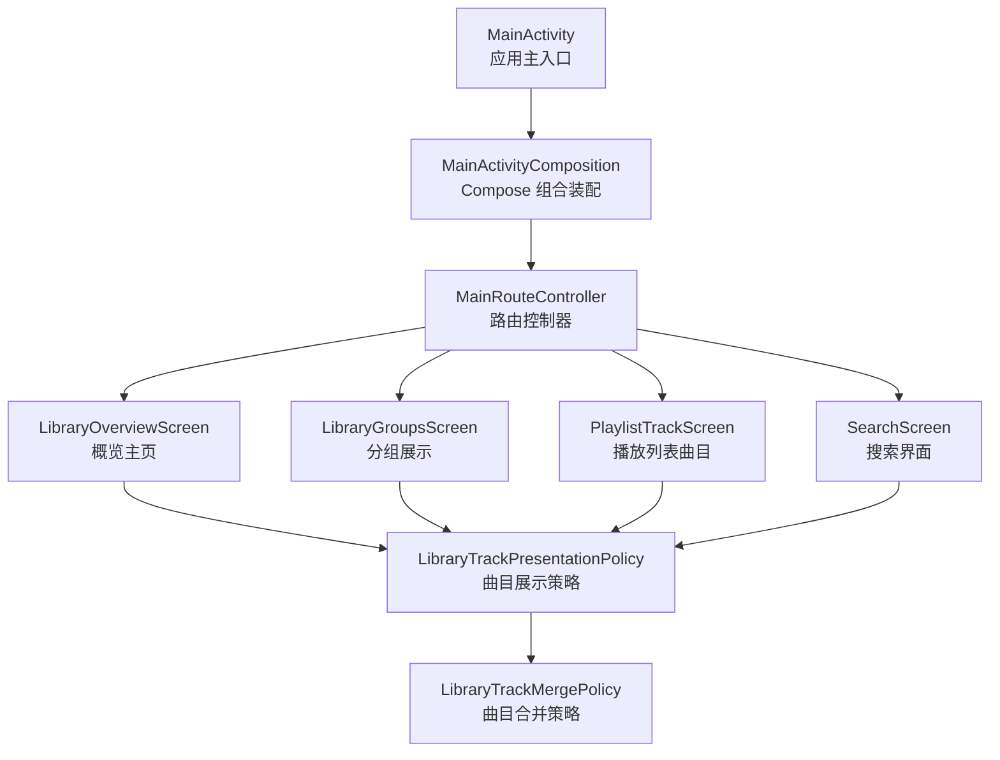
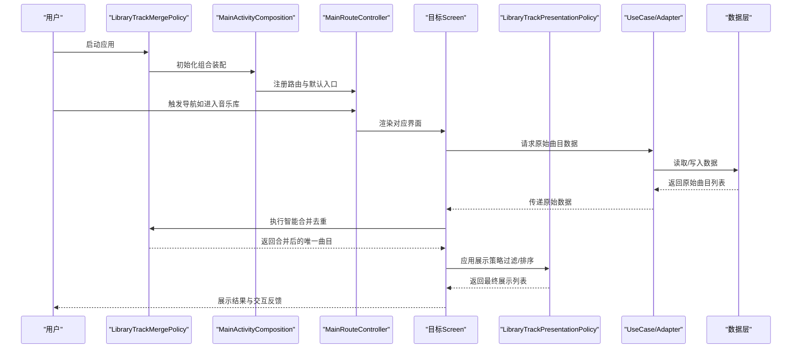
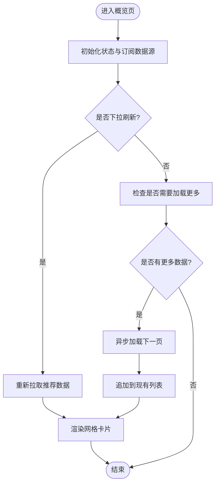
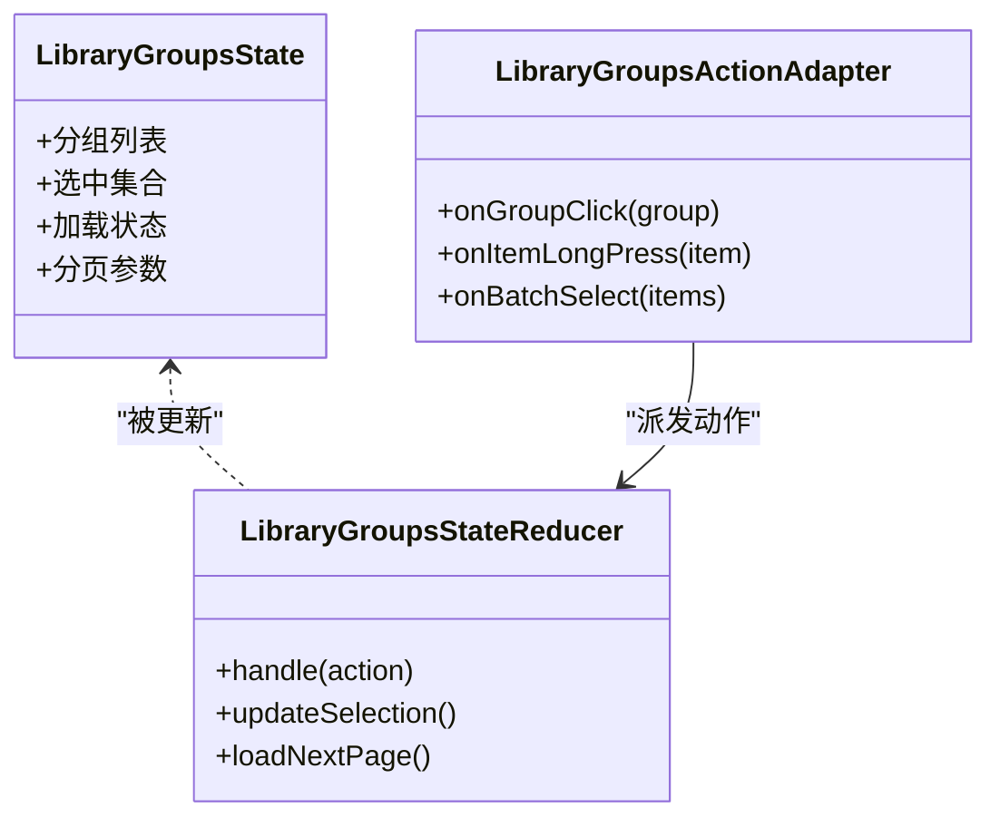
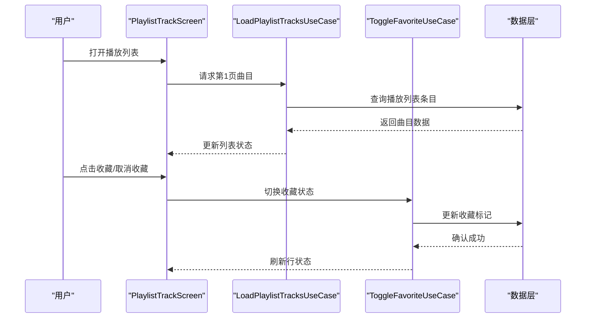
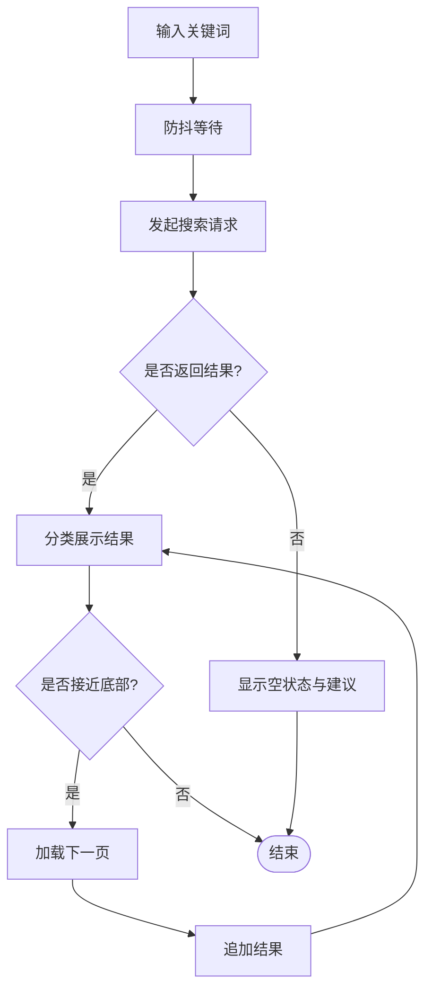
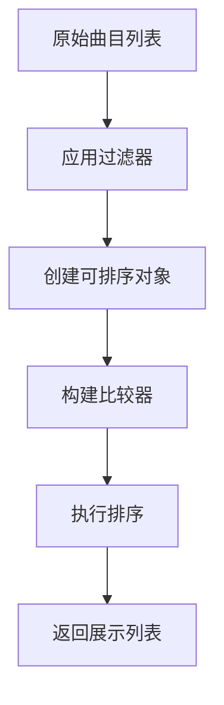
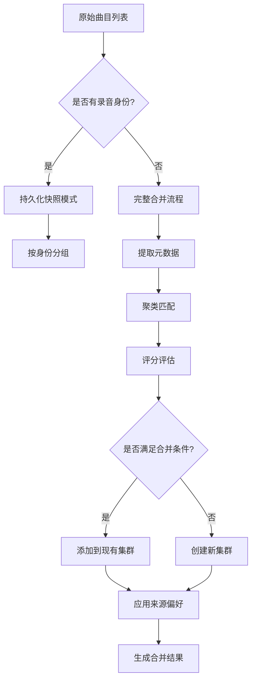
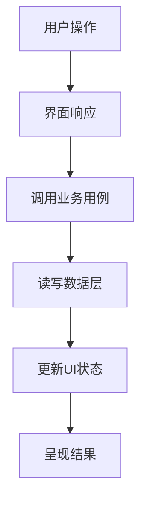
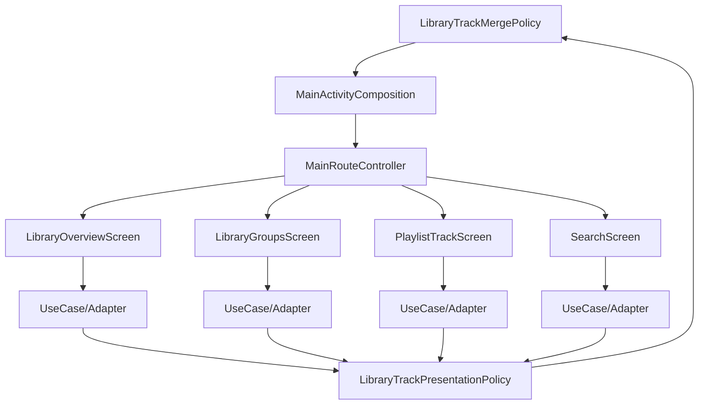

# 音乐库界面

<cite>
**本文引用的文件**   
- [MainActivity.kt](file://app/src/main/java/app/yukine/MainActivity.kt)
- [MainActivityComposition.kt](file://app/src/main/java/app/yukine/MainActivityComposition.kt)
- [MainRouteController.kt](file://app/src/main/java/app/yukine/MainRouteController.kt)
- [LibraryOverviewScreenTest.kt](file://app/src/test/java/app/yukine/LibraryOverviewScreenTest.kt)
- [LibraryGroupsStateReducerTest.kt](file://app/src/test/java/app/yukine/LibraryGroupsStateReducerTest.kt)
- [LibraryPlaylistsStateReducerTest.kt](file://app/src/test/java/app/yukine/LibraryPlaylistsStateReducerTest.kt)
- [SearchViewModelTest.kt](file://app/src/test/java/app/yukine/SearchViewModelTest.kt)
- [StreamingSearchScreenStatusTest.kt](file://app/src/test/java/app/yukine/StreamingSearchScreenStatusTest.kt)
- [UnifiedSearchOwnerTest.kt](file://app/src/test/java/app/yukine/UnifiedSearchOwnerTest.kt)
- [TrackListActionAdapterTest.kt](file://app/src/test/java/app/yukine/TrackListActionAdapterTest.kt)
- [PlaylistActionUseCasesTest.kt](file://app/src/test/java/app/yukine/PlaylistActionUseCasesTest.kt)
- [ToggleFavoriteUseCaseTest.kt](file://app/src/test/java/app/yukine/ToggleFavoriteUseCaseTest.kt)
- [LoadPlaylistTracksUseCaseTest.kt](file://app/src/test/java/app/yukine/LoadPlaylistTracksUseCaseTest.kt)
- [LibraryGroupsActionAdapterTest.kt](file://app/src/test/java/app/yukine/LibraryGroupsActionAdapterTest.kt)
- [CollectionsActionAdapterTest.kt](file://app/src/test/java/app/yukine/CollectionsActionAdapterTest.kt)
- [TrackListStatePublisherTest.kt](file://app/src/test/java/app/yukine/TrackListStatePublisherTest.kt)
- [TrackListStateReducerTest.kt](file://app/src/test/java/app/yukine/TrackListStateReducerTest.kt)
- [LibraryTrackPresentationPolicy.kt](file://feature/library-ui/src/main/java/app/yukine/LibraryTrackPresentationPolicy.kt)
- [LibraryTrackMergePolicy.kt](file://feature/library-ui/src/main/java/app/yukine/LibraryTrackMergePolicy.kt)
- [LibraryTrackPresentationPolicyTest.kt](file://app/src/test/java/app/yukine/LibraryTrackPresentationPolicyTest.kt)
- [LibraryTrackMergePolicyTest.kt](file://app/src/test/java/app/yukine/LibraryTrackMergePolicyTest.kt)
- [LibraryInteraction.kt](file://feature/library-ui/src/main/java/app/yukine/ui/LibraryInteraction.kt)
</cite>

## 更新摘要
**所做更改**   
- 更新了曲目展示策略章节，新增合并策略和重复曲目处理机制的详细说明
- 增强了数据层架构分析，添加了 LibraryTrackMergePolicy 的详细文档
- 完善了性能优化部分，增加了智能去重和合并优化的内容
- 更新了故障排查指南，添加了合并策略相关的调试方法

## 目录
1. [简介](#简介)
2. [项目结构](#项目结构)
3. [核心组件](#核心组件)
4. [架构总览](#架构总览)
5. [详细组件分析](#详细组件分析)
6. [依赖关系分析](#依赖关系分析)
7. [性能与体验优化](#性能与体验优化)
8. [故障排查指南](#故障排查指南)
9. [结论](#结论)

## 简介
本文件面向"音乐库"相关界面的设计与实现，覆盖以下关键页面与能力：
- 音乐库概览主页（LibraryOverviewScreen）
- 专辑分组展示（LibraryGroupsScreen）
- 播放列表曲目列表（PlaylistTrackScreen）
- 搜索功能（SearchScreen）

文档将解释响应式网格布局、卡片组件设计、下拉刷新、无限滚动加载等交互模式；并说明音乐元数据显示、收藏状态管理、批量操作等功能点。同时提供架构图、时序图与流程图，帮助读者快速理解数据流与交互流程。

**更新** 新增了智能曲目合并策略和重复处理机制的详细说明，提升了多源曲目管理的准确性和用户体验。

## 项目结构
从仓库结构看，UI 层位于 app 模块的 main 源码中，测试用例集中在 app/src/test 下。与音乐库界面相关的入口与路由控制主要分布在 MainActivity 及其组合配置文件中，而各页面的具体实现与行为通过测试文件进行契约化验证。

图表来源
- [MainActivity.kt](file://app/src/main/java/app/yukine/MainActivity.kt)
- [MainActivityComposition.kt](file://app/src/main/java/app/yukine/MainActivityComposition.kt)
- [MainRouteController.kt](file://app/src/main/java/app/yukine/MainRouteController.kt)
- [LibraryTrackPresentationPolicy.kt](file://feature/library-ui/src/main/java/app/yukine/LibraryTrackPresentationPolicy.kt)
- [LibraryTrackMergePolicy.kt](file://feature/library-ui/src/main/java/app/yukine/LibraryTrackMergePolicy.kt)

章节来源
- [MainActivity.kt](file://app/src/main/java/app/yukine/MainActivity.kt)
- [MainActivityComposition.kt](file://app/src/main/java/app/yukine/MainActivityComposition.kt)
- [MainRouteController.kt](file://app/src/main/java/app/yukine/MainRouteController.kt)

## 核心组件
- LibraryOverviewScreen（概览主页）
  - 职责：聚合展示最近播放、热门专辑、精选歌单等入口；支持下拉刷新与快捷导航。
  - 关键特性：响应式网格布局、卡片组件、下拉刷新、无限滚动加载。
  - 参考测试：[LibraryOverviewScreenTest.kt](file://app/src/test/java/app/yukine/LibraryOverviewScreenTest.kt)

- LibraryGroupsScreen（分组展示）
  - 职责：按专辑/艺术家/日期等维度对音乐进行分组展示；支持分组内滚动与分页加载。
  - 关键特性：分组标题锚定、卡片网格、下拉刷新、无限滚动。
  - 参考测试：[LibraryGroupsStateReducerTest.kt](file://app/src/test/java/app/yukine/LibraryGroupsStateReducerTest.kt)、[LibraryGroupsActionAdapterTest.kt](file://app/src/test/java/app/yukine/LibraryGroupsActionAdapterTest.kt)

- PlaylistTrackScreen（播放列表曲目）
  - 职责：展示指定播放列表中的全部曲目；支持排序、筛选、批量操作与收藏切换。
  - 关键特性：长列表渲染、行级操作、批量选择、收藏状态同步。
  - 参考测试：[PlaylistActionUseCasesTest.kt](file://app/src/test/java/app/yukine/PlaylistActionUseCasesTest.kt)、[TrackListActionAdapterTest.kt](file://app/src/test/java/app/yukine/TrackListActionAdapterTest.kt)、[LoadPlaylistTracksUseCaseTest.kt](file://app/src/test/java/app/yukine/LoadPlaylistTracksUseCaseTest.kt)

- SearchScreen（搜索界面）
  - 职责：提供全局搜索入口，支持关键词输入、联想建议、结果分类展示与分页加载。
  - 关键特性：防抖输入、实时建议、分类标签、无限滚动。
  - 参考测试：[SearchViewModelTest.kt](file://app/src/test/java/app/yukine/SearchViewModelTest.kt)、[StreamingSearchScreenStatusTest.kt](file://app/src/test/java/app/yukine/StreamingSearchScreenStatusTest.kt)、[UnifiedSearchOwnerTest.kt](file://app/src/test/java/app/yukine/UnifiedSearchOwnerTest.kt)

- LibraryTrackPresentationPolicy（曲目展示策略）
  - 职责：负责曲目的过滤、排序和展示逻辑，支持多种排序方式和过滤器。
  - 关键特性：智能过滤、稳定排序、播放次数统计、来源类型识别。
  - 参考测试：[LibraryTrackPresentationPolicyTest.kt](file://app/src/test/java/app/yukine/LibraryTrackPresentationPolicyTest.kt)

- LibraryTrackMergePolicy（曲目合并策略）
  - 职责：处理多源曲目的智能合并，避免重复显示相同曲目。
  - 关键特性：基于录音身份的智能匹配、版本区分、硬冲突检测、候选源索引。
  - 参考测试：[LibraryTrackMergePolicyTest.kt](file://app/src/test/java/app/yukine/LibraryTrackMergePolicyTest.kt)

章节来源
- [LibraryOverviewScreenTest.kt](file://app/src/test/java/app/yukine/LibraryOverviewScreenTest.kt)
- [LibraryGroupsStateReducerTest.kt](file://app/src/test/java/app/yukine/LibraryGroupsStateReducerTest.kt)
- [LibraryGroupsActionAdapterTest.kt](file://app/src/test/java/app/yukine/LibraryGroupsActionAdapterTest.kt)
- [PlaylistActionUseCasesTest.kt](file://app/src/test/java/app/yukine/PlaylistActionUseCasesTest.kt)
- [TrackListActionAdapterTest.kt](file://app/src/test/java/app/yukine/TrackListActionAdapterTest.kt)
- [LoadPlaylistTracksUseCaseTest.kt](file://app/src/test/java/app/yukine/LoadPlaylistTracksUseCaseTest.kt)
- [SearchViewModelTest.kt](file://app/src/test/java/app/yukine/SearchViewModelTest.kt)
- [StreamingSearchScreenStatusTest.kt](file://app/src/test/java/app/yukine/StreamingSearchScreenStatusTest.kt)
- [UnifiedSearchOwnerTest.kt](file://app/src/test/java/app/yukine/UnifiedSearchOwnerTest.kt)
- [LibraryTrackPresentationPolicyTest.kt](file://app/src/test/java/app/yukine/LibraryTrackPresentationPolicyTest.kt)
- [LibraryTrackMergePolicyTest.kt](file://app/src/test/java/app/yukine/LibraryTrackMergePolicyTest.kt)

## 架构总览
整体采用"入口-路由-页面-业务用例"的分层组织方式。MainActivity 负责生命周期与基础 UI 装配，MainActivityComposition 注入 Compose 所需依赖，MainRouteController 根据导航意图分发到对应 Screen。各 Screen 通过 UseCase/Adapter 与数据层交互，完成元数据展示、收藏状态更新与批量操作。

**更新** 新增了曲目展示策略和合并策略层，实现了更智能的多源曲目管理和重复处理机制。

图表来源
- [MainActivity.kt](file://app/src/main/java/app/yukine/MainActivity.kt)
- [MainActivityComposition.kt](file://app/src/main/java/app/yukine/MainActivityComposition.kt)
- [MainRouteController.kt](file://app/src/main/java/app/yukine/MainRouteController.kt)
- [LibraryTrackPresentationPolicy.kt](file://feature/library-ui/src/main/java/app/yukine/LibraryTrackPresentationPolicy.kt)
- [LibraryTrackMergePolicy.kt](file://feature/library-ui/src/main/java/app/yukine/LibraryTrackMergePolicy.kt)

## 详细组件分析

### LibraryOverviewScreen（概览主页）
- 布局与交互
  - 响应式网格：根据屏幕宽度动态调整列数，保证卡片在不同设备上均有良好展示。
  - 卡片组件：统一封面、标题、副标题与操作按钮；点击跳转详情或开始播放。
  - 下拉刷新：顶部手势触发，重新拉取推荐内容并刷新网格。
  - 无限滚动：当接近底部时自动加载下一页数据，避免一次性加载过多导致卡顿。
- 数据与状态
  - 元数据展示：标题、艺术家、发行年份、时长等字段由数据层提供。
  - 收藏状态：通过 UseCase 获取当前收藏标记，并在 UI 上即时反映。
  - 批量操作：在编辑模式下支持多选与批量加入播放列表、批量收藏等。
- 错误处理
  - 网络异常：显示重试提示与占位图。
  - 空状态：无数据时展示引导文案与操作入口。

图表来源
- [LibraryOverviewScreenTest.kt](file://app/src/test/java/app/yukine/LibraryOverviewScreenTest.kt)

章节来源
- [LibraryOverviewScreenTest.kt](file://app/src/test/java/app/yukine/LibraryOverviewScreenTest.kt)

### LibraryGroupsScreen（分组展示）
- 分组策略
  - 按专辑/艺术家/时间等维度分组，每组独立标题与卡片网格。
  - 分组内支持滚动与分页加载，提升大集合浏览体验。
- 交互模式
  - 分组锚点：侧边索引或顶部固定栏快速定位分组。
  - 卡片操作：点击打开专辑详情，长按进入编辑模式以执行批量操作。
- 状态管理
  - 使用 StateReducer 管理分组展开/折叠、选中项集合与加载状态。
  - ActionAdapter 将用户动作转换为可被 reducer 处理的动作事件。

图表来源
- [LibraryGroupsStateReducerTest.kt](file://app/src/test/java/app/yukine/LibraryGroupsStateReducerTest.kt)
- [LibraryGroupsActionAdapterTest.kt](file://app/src/test/java/app/yukine/LibraryGroupsActionAdapterTest.kt)

章节来源
- [LibraryGroupsStateReducerTest.kt](file://app/src/test/java/app/yukine/LibraryGroupsStateReducerTest.kt)
- [LibraryGroupsActionAdapterTest.kt](file://app/src/test/java/app/yukine/LibraryGroupsActionAdapterTest.kt)

### PlaylistTrackScreen（播放列表曲目）
- 列表渲染
  - 长列表采用分页加载与虚拟滚动策略，减少内存占用与绘制开销。
  - 行级操作：播放、添加到队列、分享、收藏等。
- 批量操作
  - 多选模式：勾选多行后执行批量收藏、批量移除、批量加入播放列表。
  - 全选/反选：便捷选择所有可见项或排除已选项。
- 收藏状态管理
  - 通过 ToggleFavoriteUseCase 切换收藏状态，UI 即时同步。
  - 支持批量收藏与取消收藏，确保状态一致性。
- 数据加载
  - LoadPlaylistTracksUseCase 负责按页加载播放列表曲目，结合 TrackListStatePublisher/Reducer 维护列表状态。

图表来源
- [LoadPlaylistTracksUseCaseTest.kt](file://app/src/test/java/app/yukine/LoadPlaylistTracksUseCaseTest.kt)
- [ToggleFavoriteUseCaseTest.kt](file://app/src/test/java/app/yukine/ToggleFavoriteUseCaseTest.kt)
- [PlaylistActionUseCasesTest.kt](file://app/src/test/java/app/yukine/PlaylistActionUseCasesTest.kt)
- [TrackListActionAdapterTest.kt](file://app/src/test/java/app/yukine/TrackListActionAdapterTest.kt)
- [TrackListStatePublisherTest.kt](file://app/src/test/java/app/yukine/TrackListStatePublisherTest.kt)
- [TrackListStateReducerTest.kt](file://app/src/test/java/app/yukine/TrackListStateReducerTest.kt)

章节来源
- [LoadPlaylistTracksUseCaseTest.kt](file://app/src/test/java/app/yukine/LoadPlaylistTracksUseCaseTest.kt)
- [ToggleFavoriteUseCaseTest.kt](file://app/src/test/java/app/yukine/ToggleFavoriteUseCaseTest.kt)
- [PlaylistActionUseCasesTest.kt](file://app/src/test/java/app/yukine/PlaylistActionUseCasesTest.kt)
- [TrackListActionAdapterTest.kt](file://app/src/test/java/app/yukine/TrackListActionAdapterTest.kt)
- [TrackListStatePublisherTest.kt](file://app/src/test/java/app/yukine/TrackListStatePublisherTest.kt)
- [TrackListStateReducerTest.kt](file://app/src/test/java/app/yukine/TrackListStateReducerTest.kt)

### SearchScreen（搜索界面）
- 输入与联想
  - 防抖输入：降低频繁请求带来的性能压力。
  - 实时建议：根据关键词返回候选词与分类标签。
- 结果展示
  - 分类结果：歌曲、专辑、艺术家等类别分块展示。
  - 分页加载：滚动到底部自动加载下一页。
- 状态与错误
  - 空结果：展示友好提示与搜索建议。
  - 网络异常：显示重试按钮与错误信息。

图表来源
- [SearchViewModelTest.kt](file://app/src/test/java/app/yukine/SearchViewModelTest.kt)
- [StreamingSearchScreenStatusTest.kt](file://app/src/test/java/app/yukine/StreamingSearchScreenStatusTest.kt)
- [UnifiedSearchOwnerTest.kt](file://app/src/test/java/app/yukine/UnifiedSearchOwnerTest.kt)

章节来源
- [SearchViewModelTest.kt](file://app/src/test/java/app/yukine/SearchViewModelTest.kt)
- [StreamingSearchScreenStatusTest.kt](file://app/src/test/java/app/yukine/StreamingSearchScreenStatusTest.kt)
- [UnifiedSearchOwnerTest.kt](file://app/src/test/java/app/yukine/UnifiedSearchOwnerTest.kt)

### LibraryTrackPresentationPolicy（曲目展示策略）
- 过滤与排序
  - 支持多种过滤器：全部、收藏、本地、网络来源。
  - 丰富的排序选项：标题、艺术家、专辑、时长、添加日期、播放次数。
  - 稳定的排序算法：使用预计算的排序键，确保排序稳定性。
- 来源识别
  - 智能来源分类：媒体存储、文档、WebDAV、流媒体等。
  - 统一的来源标识：基于 dataPath 前缀判断来源类型。
- 展示优化
  - 细节信息附加：为每个曲目保留对应的详细信息字符串。
  - 播放次数统计：支持基于播放历史的降序排列。

图表来源
- [LibraryTrackPresentationPolicy.kt](file://feature/library-ui/src/main/java/app/yukine/LibraryTrackPresentationPolicy.kt)

章节来源
- [LibraryTrackPresentationPolicy.kt](file://feature/library-ui/src/main/java/app/yukine/LibraryTrackPresentationPolicy.kt)
- [LibraryTrackPresentationPolicyTest.kt](file://app/src/test/java/app/yukine/LibraryTrackPresentationPolicyTest.kt)

### LibraryTrackMergePolicy（曲目合并策略）
- 智能合并算法
  - 基于录音身份匹配：使用 RecordingMatchEvaluatorV2 进行精确匹配。
  - 版本区分机制：自动识别现场版、混音版、翻唱版等不同版本。
  - 硬冲突检测：防止 A≈B 且 B≈C 但 A≠C 的错误合并。
- 多源支持
  - 本地文件优先：优先选择本地高质量音频作为代表曲目。
  - 云端备选：保留 WebDAV、流媒体等其他来源作为候选。
  - 来源偏好排序：document > local > webdav > streaming providers。
- 性能优化
  - 快照模式：一次性构建合并结果和候选索引，避免重复计算。
  - 持久化路径：对于已持久化的录音身份，跳过模糊匹配直接合并。
  - 增量更新：仅索引重复组，单例曲目不占用额外内存。

图表来源
- [LibraryTrackMergePolicy.kt](file://feature/library-ui/src/main/java/app/yukine/LibraryTrackMergePolicy.kt)

章节来源
- [LibraryTrackMergePolicy.kt](file://feature/library-ui/src/main/java/app/yukine/LibraryTrackMergePolicy.kt)
- [LibraryTrackMergePolicyTest.kt](file://app/src/test/java/app/yukine/LibraryTrackMergePolicyTest.kt)

### 概念性总览
以下为概念性流程图，用于说明通用交互模式（不直接映射到具体代码文件）。

## 依赖关系分析
- 入口与路由
  - MainActivity 作为应用入口，负责生命周期管理与基础 UI 装配。
  - MainActivityComposition 注入 Compose 依赖，构建页面组合。
  - MainRouteController 根据导航意图分发到具体 Screen。
- 页面与用例
  - 各 Screen 通过 UseCase/Adapter 与数据层交互，保持 UI 与业务解耦。
  - 测试文件定义了各组件的行为契约，便于回归与重构。
- 曲目处理策略
  - LibraryTrackMergePolicy 负责底层的数据合并逻辑。
  - LibraryTrackPresentationPolicy 负责上层的数据展示逻辑。
  - 两层策略分离，确保了数据处理的可测试性和可维护性。

图表来源
- [MainActivity.kt](file://app/src/main/java/app/yukine/MainActivity.kt)
- [MainActivityComposition.kt](file://app/src/main/java/app/yukine/MainActivityComposition.kt)
- [MainRouteController.kt](file://app/src/main/java/app/yukine/MainRouteController.kt)
- [LibraryTrackPresentationPolicy.kt](file://feature/library-ui/src/main/java/app/yukine/LibraryTrackPresentationPolicy.kt)
- [LibraryTrackMergePolicy.kt](file://feature/library-ui/src/main/java/app/yukine/LibraryTrackMergePolicy.kt)

章节来源
- [MainActivity.kt](file://app/src/main/java/app/yukine/MainActivity.kt)
- [MainActivityComposition.kt](file://app/src/main/java/app/yukine/MainActivityComposition.kt)
- [MainRouteController.kt](file://app/src/main/java/app/yukine/MainRouteController.kt)

## 性能与体验优化
- 响应式网格
  - 依据屏幕宽度计算列数，避免过度绘制与布局抖动。
  - 使用稳定的 key 与懒加载策略，提高滚动流畅度。
- 卡片组件
  - 封面图片启用磁盘缓存与尺寸适配，减少内存峰值。
  - 文本截断与换行策略统一，保证视觉一致性。
- 下拉刷新
  - 仅在必要时触发数据重载，避免重复请求。
  - 失败时提供明确的重试入口与错误提示。
- 无限滚动
  - 预加载阈值设置合理，平衡首屏速度与后续加载延迟。
  - 合并去重与增量更新，避免重复渲染。
- 收藏状态与批量操作
  - 局部状态更新，避免整表重绘。
  - 批量操作采用事务式提交，确保一致性与回滚能力。
- 搜索体验
  - 防抖与节流策略降低请求频率。
  - 分类结果分页加载，提升大数据集下的响应速度。
- **更新** 智能曲目合并优化
  - 快照模式减少重复计算，提升大数据集处理性能。
  - 持久化路径跳过模糊匹配，加速已识别曲目的加载。
  - 候选索引仅针对重复组，避免单例曲目的内存浪费。
  - 稳定的排序算法确保用户体验的一致性。

## 故障排查指南
- 概览页无法加载
  - 检查网络状态与重试逻辑；查看空状态与错误提示是否正确展示。
  - 参考测试：[LibraryOverviewScreenTest.kt](file://app/src/test/java/app/yukine/LibraryOverviewScreenTest.kt)
- 分组展示卡顿或错位
  - 核对分组状态 reducer 的动作处理与分页参数；确认 action adapter 的事件派发顺序。
  - 参考测试：[LibraryGroupsStateReducerTest.kt](file://app/src/test/java/app/yukine/LibraryGroupsStateReducerTest.kt)、[LibraryGroupsActionAdapterTest.kt](file://app/src/test/java/app/yukine/LibraryGroupsActionAdapterTest.kt)
- 播放列表收藏状态不同步
  - 检查 ToggleFavoriteUseCase 的调用路径与状态发布机制；确认行级更新是否生效。
  - 参考测试：[ToggleFavoriteUseCaseTest.kt](file://app/src/test/java/app/yukine/ToggleFavoriteUseCaseTest.kt)、[PlaylistActionUseCasesTest.kt](file://app/src/test/java/app/yukine/PlaylistActionUseCasesTest.kt)
- 搜索结果异常或无结果
  - 验证防抖输入与请求参数；检查分类结果的分页加载逻辑。
  - 参考测试：[SearchViewModelTest.kt](file://app/src/test/java/app/yukine/SearchViewModelTest.kt)、[StreamingSearchScreenStatusTest.kt](file://app/src/test/java/app/yukine/StreamingSearchScreenStatusTest.kt)、[UnifiedSearchOwnerTest.kt](file://app/src/test/java/app/yukine/UnifiedSearchOwnerTest.kt)
- **更新** 曲目展示问题
  - 检查过滤器配置是否正确应用；验证排序键的计算逻辑。
  - 确认来源类型识别是否符合预期；检查播放次数统计数据的完整性。
  - 参考测试：[LibraryTrackPresentationPolicyTest.kt](file://app/src/test/java/app/yukine/LibraryTrackPresentationPolicyTest.kt)
- **更新** 曲目合并异常
  - 验证录音身份匹配算法的准确性；检查硬冲突检测逻辑。
  - 确认来源偏好排序是否符合业务需求；检查快照模式的性能表现。
  - 参考测试：[LibraryTrackMergePolicyTest.kt](file://app/src/test/java/app/yukine/LibraryTrackMergePolicyTest.kt)

章节来源
- [LibraryOverviewScreenTest.kt](file://app/src/test/java/app/yukine/LibraryOverviewScreenTest.kt)
- [LibraryGroupsStateReducerTest.kt](file://app/src/test/java/app/yukine/LibraryGroupsStateReducerTest.kt)
- [LibraryGroupsActionAdapterTest.kt](file://app/src/test/java/app/yukine/LibraryGroupsActionAdapterTest.kt)
- [ToggleFavoriteUseCaseTest.kt](file://app/src/test/java/app/yukine/ToggleFavoriteUseCaseTest.kt)
- [PlaylistActionUseCasesTest.kt](file://app/src/test/java/app/yukine/PlaylistActionUseCasesTest.kt)
- [SearchViewModelTest.kt](file://app/src/test/java/app/yukine/SearchViewModelTest.kt)
- [StreamingSearchScreenStatusTest.kt](file://app/src/test/java/app/yukine/StreamingSearchScreenStatusTest.kt)
- [UnifiedSearchOwnerTest.kt](file://app/src/test/java/app/yukine/UnifiedSearchOwnerTest.kt)
- [LibraryTrackPresentationPolicyTest.kt](file://app/src/test/java/app/yukine/LibraryTrackPresentationPolicyTest.kt)
- [LibraryTrackMergePolicyTest.kt](file://app/src/test/java/app/yukine/LibraryTrackMergePolicyTest.kt)

## 结论
音乐库界面通过清晰的入口-路由-页面分层与用例驱动的数据访问，实现了良好的可扩展性与可测试性。概览主页、分组展示、播放列表与搜索四大核心页面均具备响应式网格、卡片组件、下拉刷新与无限滚动等现代交互能力；同时提供完善的收藏状态管理与批量操作支持。

**更新** 新增的智能曲目合并策略和展示策略层，显著提升了多源曲目管理的准确性和性能。通过基于录音身份的精确匹配、版本区分机制和硬冲突检测，有效避免了重复曲目的显示问题。快照模式和持久化路径优化确保了大数据集下的良好性能表现。建议在后续迭代中持续优化图片缓存策略、分页阈值与错误提示，进一步提升整体性能与用户体验。