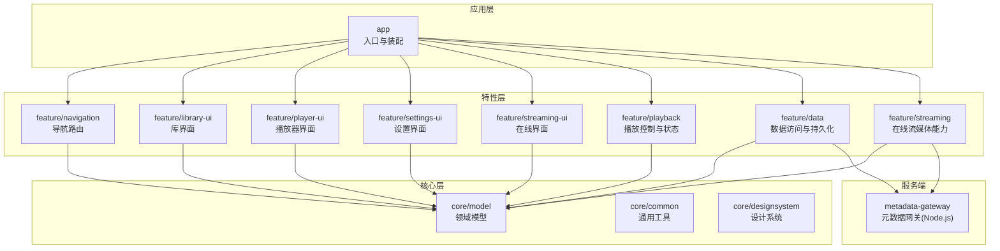
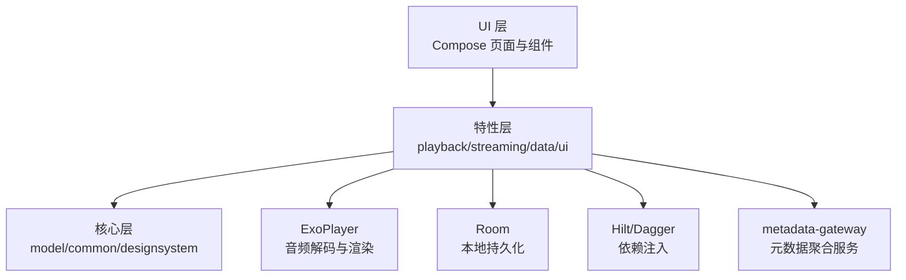
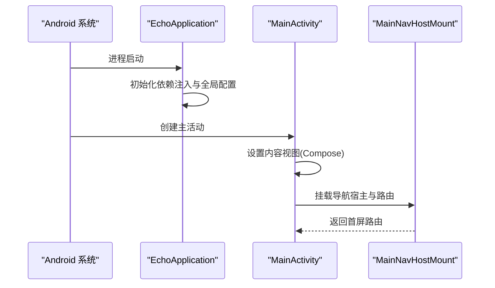
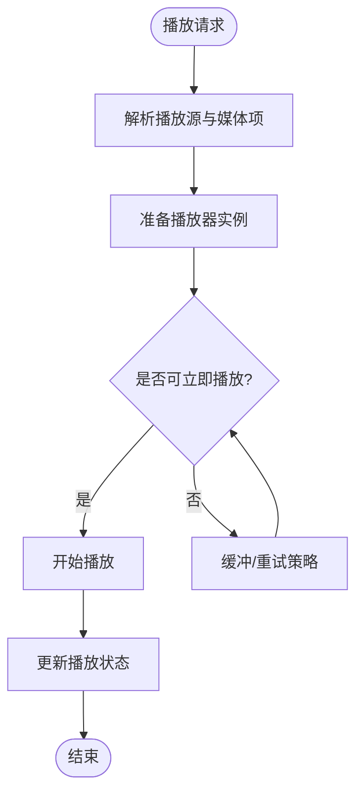
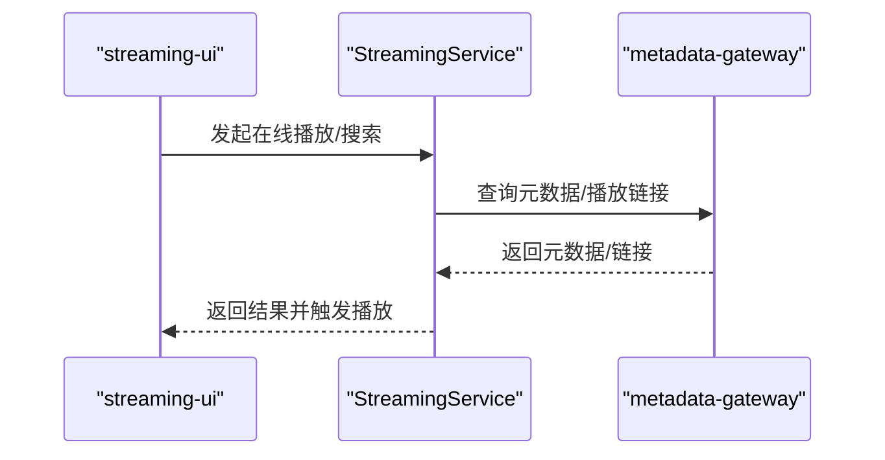
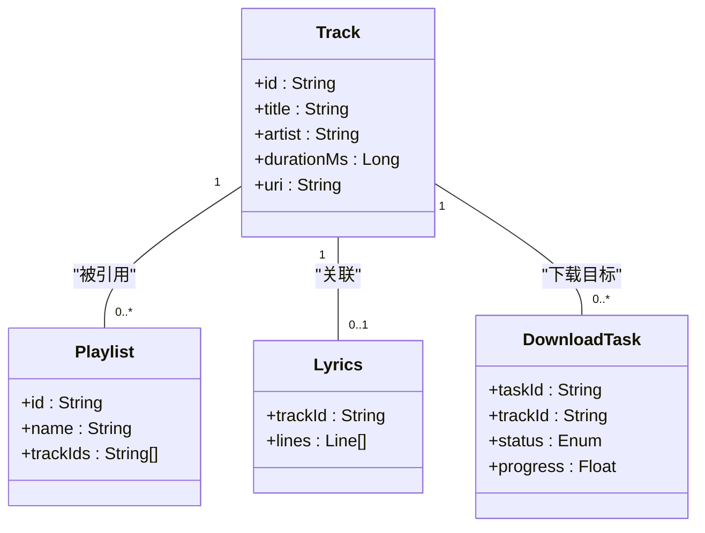
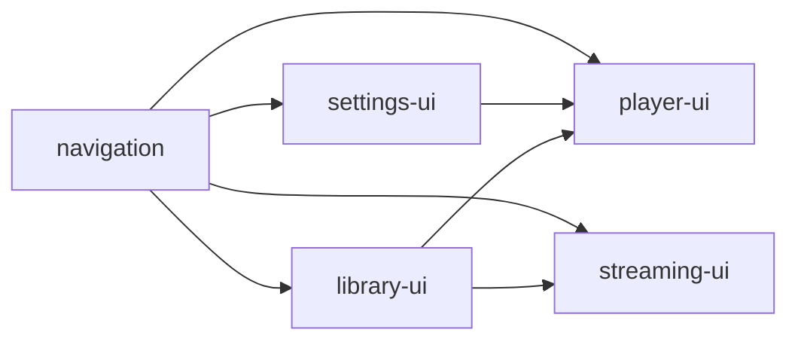
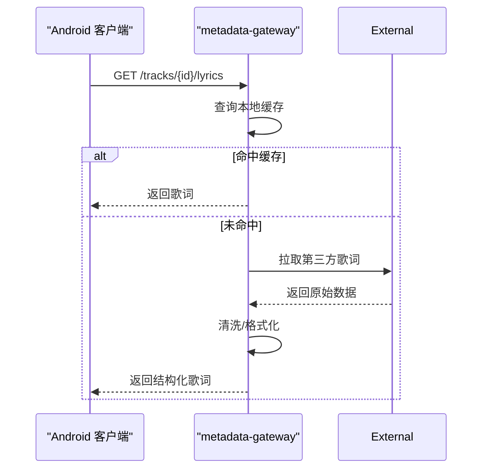
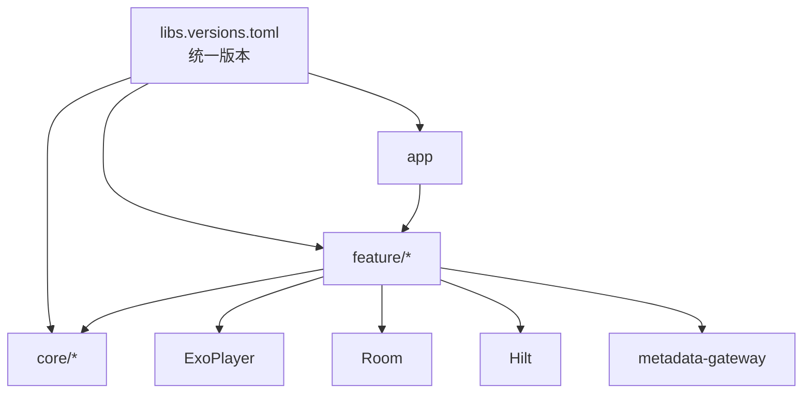

# 项目概述

<cite>
**本文引用的文件**   
- [README.md](file://README.md)
- [build.gradle](file://build.gradle)
- [settings.gradle](file://settings.gradle)
- [gradle/libs.versions.toml](file://gradle/libs.versions.toml)
- [app/src/main/AndroidManifest.xml](file://app/src/main/AndroidManifest.xml)
- [app/src/main/java/app/yukine/EchoApplication.kt](file://app/src/main/java/app/yukine/EchoApplication.kt)
- [app/src/main/java/app/yukine/MainActivity.kt](file://app/src/main/java/app/yukine/MainActivity.kt)
- [core/model/src/main/AndroidManifest.xml](file://core/model/src/main/AndroidManifest.xml)
- [feature/data/src/main/AndroidManifest.xml](file://feature/data/src/main/AndroidManifest.xml)
- [feature/streaming/src/main/AndroidManifest.xml](file://feature/streaming/src/main/AndroidManifest.xml)
- [feature/playback/src/main/AndroidManifest.xml](file://feature/playback/src/main/AndroidManifest.xml)
- [feature/library-ui/src/main/AndroidManifest.xml](file://feature/library-ui/src/main/AndroidManifest.xml)
- [feature/player-ui/src/main/AndroidManifest.xml](file://feature/player-ui/src/main/AndroidManifest.xml)
- [feature/settings-ui/src/main/AndroidManifest.xml](file://feature/settings-ui/src/main/AndroidManifest.xml)
- [feature/navigation/src/main/AndroidManifest.xml](file://feature/navigation/src/main/AndroidManifest.xml)
- [metadata-gateway/package.json](file://metadata-gateway/package.json)
- [metadata-gateway/src/index.ts](file://metadata-gateway/src/index.ts)
</cite>

## 目录
1. [简介](#简介)
2. [项目结构](#项目结构)
3. [核心组件](#核心组件)
4. [架构总览](#架构总览)
5. [详细组件分析](#详细组件分析)
6. [依赖分析](#依赖分析)
7. [性能考虑](#性能考虑)
8. [故障排查指南](#故障排查指南)
9. [结论](#结论)
10. [附录](#附录)

## 简介
Echo Android 是一款现代化的音乐流媒体与本地播放应用，基于 Kotlin/Java 构建，采用 Jetpack Compose 作为 UI 框架，结合 Room、ExoPlayer、Dagger/Hilt 等主流技术栈。应用支持本地与在线音乐播放、歌词显示、下载管理、收藏同步、网络源接入与元数据网关等能力，面向初学者提供清晰的学习路径，同时为有经验的开发者提供深入的技术细节与扩展点。

## 项目结构
仓库采用多模块（Multi-module）架构，顶层包含：
- app：应用入口与主界面装配，集成各功能模块
- core：共享模型与通用能力（model、common、designsystem）
- feature：按领域划分的特性模块（data、playback、library-ui、player-ui、settings-ui、streaming、streaming-ui、navigation）
- metadata-gateway：Node.js 实现的元数据网关服务（用于聚合外部来源的元数据）
- docs：架构与设计文档
- scripts：CI/质量脚本
- gradle/libs.versions.toml：统一版本管理

图表来源
- [settings.gradle](file://settings.gradle)
- [app/build.gradle](file://app/build.gradle)
- [feature/data/build.gradle](file://feature/data/build.gradle)
- [feature/playback/build.gradle](file://feature/playback/build.gradle)
- [feature/library-ui/build.gradle](file://feature/library-ui/build.gradle)
- [feature/player-ui/build.gradle](file://feature/player-ui/build.gradle)
- [feature/settings-ui/build.gradle](file://feature/settings-ui/build.gradle)
- [feature/streaming/build.gradle](file://feature/streaming/build.gradle)
- [feature/streaming-ui/build.gradle](file://feature/streaming-ui/build.gradle)
- [feature/navigation/build.gradle](file://feature/navigation/build.gradle)
- [core/model/build.gradle](file://core/model/build.gradle)
- [core/common/build.gradle](file://core/common/build.gradle)
- [core/designsystem/build.gradle](file://core/designsystem/build.gradle)

章节来源
- [settings.gradle](file://settings.gradle)
- [build.gradle](file://build.gradle)
- [gradle/libs.versions.toml](file://gradle/libs.versions.toml)

## 核心组件
- 应用入口与生命周期
  - EchoApplication：应用初始化、依赖注入与全局配置
  - MainActivity：Compose 主壳、导航挂载与权限处理
- 播放子系统
  - playback 模块：封装 ExoPlayer 播放控制、队列、状态机与事件总线
  - streaming 模块：在线源解析、鉴权、缓存与播放策略
- 数据与持久化
  - data 模块：Room 数据库、Repository 抽象、下载任务与元数据写入
  - model 模块：统一的 Track、Playlist、Artist、Lyrics 等领域模型
- 用户界面
  - library-ui、player-ui、settings-ui、streaming-ui：基于 Jetpack Compose 的页面与组件
  - navigation：路由定义与页面跳转契约
- 元数据网关
  - metadata-gateway：Node.js 服务，聚合第三方元数据并对外暴露 API

章节来源
- [app/src/main/java/app/yukine/EchoApplication.kt](file://app/src/main/java/app/yukine/EchoApplication.kt)
- [app/src/main/java/app/yukine/MainActivity.kt](file://app/src/main/java/app/yukine/MainActivity.kt)
- [feature/playback/src/main/AndroidManifest.xml](file://feature/playback/src/main/AndroidManifest.xml)
- [feature/streaming/src/main/AndroidManifest.xml](file://feature/streaming/src/main/AndroidManifest.xml)
- [feature/data/src/main/AndroidManifest.xml](file://feature/data/src/main/AndroidManifest.xml)
- [core/model/src/main/AndroidManifest.xml](file://core/model/src/main/AndroidManifest.xml)
- [feature/library-ui/src/main/AndroidManifest.xml](file://feature/library-ui/src/main/AndroidManifest.xml)
- [feature/player-ui/src/main/AndroidManifest.xml](file://feature/player-ui/src/main/AndroidManifest.xml)
- [feature/settings-ui/src/main/AndroidManifest.xml](file://feature/settings-ui/src/main/AndroidManifest.xml)
- [feature/streaming-ui/src/main/AndroidManifest.xml](file://feature/streaming-ui/src/main/AndroidManifest.xml)
- [feature/navigation/src/main/AndroidManifest.xml](file://feature/navigation/src/main/AndroidManifest.xml)

## 架构总览
整体遵循“UI 层 → 特性层 → 核心层”的分层与模块化边界，通过清晰的接口契约解耦。UI 使用 Compose 声明式构建；业务逻辑集中在特性模块；核心模型与通用能力下沉至 core。

图表来源
- [app/src/main/AndroidManifest.xml](file://app/src/main/AndroidManifest.xml)
- [feature/playback/src/main/AndroidManifest.xml](file://feature/playback/src/main/AndroidManifest.xml)
- [feature/streaming/src/main/AndroidManifest.xml](file://feature/streaming/src/main/AndroidManifest.xml)
- [feature/data/src/main/AndroidManifest.xml](file://feature/data/src/main/AndroidManifest.xml)
- [core/model/src/main/AndroidManifest.xml](file://core/model/src/main/AndroidManifest.xml)

## 详细组件分析

### 应用启动与主界面装配
- EchoApplication 负责应用级初始化与依赖注入容器准备
- MainActivity 挂载 Compose 根节点、导航宿主与权限控制器
- 主界面通过 MainNavHostMount 组织各特性页面的路由与状态绑定

图表来源
- [app/src/main/java/app/yukine/EchoApplication.kt](file://app/src/main/java/app/yukine/EchoApplication.kt)
- [app/src/main/java/app/yukine/MainActivity.kt](file://app/src/main/java/app/yukine/MainActivity.kt)

章节来源
- [app/src/main/java/app/yukine/EchoApplication.kt](file://app/src/main/java/app/yukine/EchoApplication.kt)
- [app/src/main/java/app/yukine/MainActivity.kt](file://app/src/main/java/app/yukine/MainActivity.kt)

### 播放子系统（playback）
- 职责：封装 ExoPlayer 的播放、暂停、跳转、队列管理与播放状态广播
- 关键流程：播放请求进入 → 解析播放源 → 构造媒体项 → 提交到播放器 → 状态回调驱动 UI

图表来源
- [feature/playback/src/main/AndroidManifest.xml](file://feature/playback/src/main/AndroidManifest.xml)

章节来源
- [feature/playback/src/main/AndroidManifest.xml](file://feature/playback/src/main/AndroidManifest.xml)

### 在线流媒体（streaming）
- 职责：对接外部在线源，完成鉴权、会话维护、播放质量策略与缓存
- 与元数据网关交互：获取歌曲详情、封面、歌词等元数据

图表来源
- [feature/streaming/src/main/AndroidManifest.xml](file://feature/streaming/src/main/AndroidManifest.xml)
- [metadata-gateway/src/index.ts](file://metadata-gateway/src/index.ts)

章节来源
- [feature/streaming/src/main/AndroidManifest.xml](file://feature/streaming/src/main/AndroidManifest.xml)
- [metadata-gateway/src/index.ts](file://metadata-gateway/src/index.ts)

### 数据与持久化（data）
- 职责：通过 Repository 抽象屏蔽数据源差异，使用 Room 进行本地持久化，管理下载任务与元数据写入
- 典型场景：本地扫描入库、在线列表缓存、下载进度与失败重试

图表来源
- [feature/data/src/main/AndroidManifest.xml](file://feature/data/src/main/AndroidManifest.xml)
- [core/model/src/main/AndroidManifest.xml](file://core/model/src/main/AndroidManifest.xml)

章节来源
- [feature/data/src/main/AndroidManifest.xml](file://feature/data/src/main/AndroidManifest.xml)
- [core/model/src/main/AndroidManifest.xml](file://core/model/src/main/AndroidManifest.xml)

### 用户界面（library-ui / player-ui / settings-ui / streaming-ui）
- library-ui：展示本地/在线曲库、专辑、歌手、播放列表
- player-ui：全屏播放器、歌词浮窗、播放控制
- settings-ui：播放质量、下载目录、主题与语言等设置
- streaming-ui：在线源登录、歌单导入、搜索与推荐

图表来源
- [feature/library-ui/src/main/AndroidManifest.xml](file://feature/library-ui/src/main/AndroidManifest.xml)
- [feature/player-ui/src/main/AndroidManifest.xml](file://feature/player-ui/src/main/AndroidManifest.xml)
- [feature/settings-ui/src/main/AndroidManifest.xml](file://feature/settings-ui/src/main/AndroidManifest.xml)
- [feature/streaming-ui/src/main/AndroidManifest.xml](file://feature/streaming-ui/src/main/AndroidManifest.xml)
- [feature/navigation/src/main/AndroidManifest.xml](file://feature/navigation/src/main/AndroidManifest.xml)

章节来源
- [feature/library-ui/src/main/AndroidManifest.xml](file://feature/library-ui/src/main/AndroidManifest.xml)
- [feature/player-ui/src/main/AndroidManifest.xml](file://feature/player-ui/src/main/AndroidManifest.xml)
- [feature/settings-ui/src/main/AndroidManifest.xml](file://feature/settings-ui/src/main/AndroidManifest.xml)
- [feature/streaming-ui/src/main/AndroidManifest.xml](file://feature/streaming-ui/src/main/AndroidManifest.xml)
- [feature/navigation/src/main/AndroidManifest.xml](file://feature/navigation/src/main/AndroidManifest.xml)

### 元数据网关（metadata-gateway）
- 职责：聚合第三方元数据服务，提供统一 API 供客户端查询歌曲信息、歌词、封面等
- 技术栈：Node.js/TypeScript，提供 REST/Worker 接口，SQLite 缓存提升响应速度

图表来源
- [metadata-gateway/package.json](file://metadata-gateway/package.json)
- [metadata-gateway/src/index.ts](file://metadata-gateway/src/index.ts)

章节来源
- [metadata-gateway/package.json](file://metadata-gateway/package.json)
- [metadata-gateway/src/index.ts](file://metadata-gateway/src/index.ts)

## 依赖分析
- 版本管理：通过 gradle/libs.versions.toml 集中管理 AndroidX、Compose、Room、ExoPlayer、Hilt 等依赖版本
- 模块耦合：UI 模块仅依赖 model 与 navigation；playback/streaming 依赖 model 与 common；data 依赖 model 与 Room
- 外部依赖：ExoPlayer 负责音视频解码；Room 负责本地存储；Hilt 负责依赖注入；metadata-gateway 提供远程元数据

图表来源
- [gradle/libs.versions.toml](file://gradle/libs.versions.toml)
- [app/build.gradle](file://app/build.gradle)
- [feature/data/build.gradle](file://feature/data/build.gradle)
- [feature/playback/build.gradle](file://feature/playback/build.gradle)
- [feature/streaming/build.gradle](file://feature/streaming/build.gradle)

章节来源
- [gradle/libs.versions.toml](file://gradle/libs.versions.toml)
- [build.gradle](file://build.gradle)

## 性能考虑
- 播放体验
  - 合理设置 ExoPlayer 缓冲策略与码率自适应，避免卡顿
  - 使用预加载与无缝切歌减少等待时间
- 内存与资源
  - 图片与封面使用磁盘缓存与缩略图策略
  - 大列表分页加载与懒加载，避免一次性加载过多数据
- 网络与缓存
  - 对热门元数据与歌词做本地缓存，降低重复请求
  - 离线优先策略：优先读取本地，再回退到网络
- 后台任务
  - 下载任务使用 WorkManager 或前台服务，保证稳定性与电量友好

[本节为通用指导，不直接分析具体文件]

## 故障排查指南
- 播放异常
  - 检查播放源 URI 合法性与权限
  - 查看 ExoPlayer 错误码与日志，定位解码或网络问题
- 下载失败
  - 确认存储空间与下载目录权限
  - 校验网络状态与重试策略
- 在线源登录
  - 核对 Cookie/Token 有效期与会话刷新机制
  - 检查 metadata-gateway 连通性与鉴权参数
- 歌词缺失
  - 验证歌词匹配规则与本地缓存一致性
  - 检查网关返回结构与字段完整性

章节来源
- [feature/playback/src/main/AndroidManifest.xml](file://feature/playback/src/main/AndroidManifest.xml)
- [feature/streaming/src/main/AndroidManifest.xml](file://feature/streaming/src/main/AndroidManifest.xml)
- [feature/data/src/main/AndroidManifest.xml](file://feature/data/src/main/AndroidManifest.xml)
- [metadata-gateway/src/index.ts](file://metadata-gateway/src/index.ts)

## 结论
Echo Android 以模块化与分层架构为基础，结合现代 Android 技术栈，实现了本地与在线音乐播放、歌词显示、下载管理等核心能力。通过清晰的模块边界与接口契约，既便于初学者理解与应用，也为高级开发者提供了良好的扩展与维护性。建议后续持续优化播放稳定性、缓存策略与测试覆盖率，进一步提升用户体验与工程效率。

[本节为总结性内容，不直接分析具体文件]

## 附录
- 快速上手
  - 安装 Gradle 与 Android Studio，打开仓库根目录
  - 同步依赖后运行 app 模块
  - 首次启动会初始化数据库与基础配置
- 常用命令
  - 构建与打包：./gradlew assembleDebug / assembleRelease
  - 运行测试：./gradlew test / connectedAndroidTest
  - 代码检查：./gradlew lint
- 参考文档
  - README.md：项目背景与使用说明
  - docs/ARCHITECTURE.md：架构设计与演进计划

章节来源
- [README.md](file://README.md)
- [build.gradle](file://build.gradle)
- [settings.gradle](file://settings.gradle)