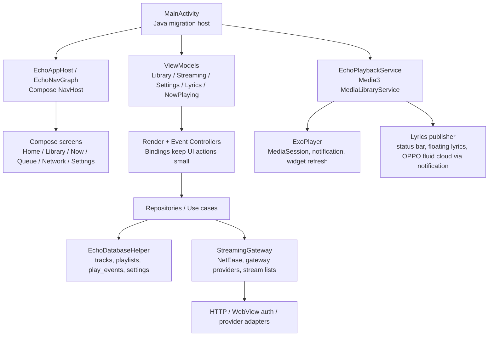

# YUKINE Android

YUKINE 是一款以本地曲库为核心、兼顾流媒体导入和后台播放体验的 Android 音乐播放器。当前工程仍保留部分 `Echo` 命名作为迁移期内部标识，但对外应用名、主体验和文档统一使用 `YUKINE`。

> English documentation is included after the Chinese version. Keep both sections updated when changing product behavior.

## 当前定位

YUKINE 面向重度听歌和本地曲库用户，优先保证这些体验：

- 本地歌曲扫描、曲库浏览、收藏、播放历史和歌单管理。
- Media3 后台播放、媒体通知、桌面小部件、耳机/车机控制入口。
- 正在播放页、底部 NowBar、歌词、波形和沉浸歌词。
- 网易云等流媒体账号接入、搜索、歌单选择导入、播放源解析。
- WebDAV、M3U/M3U8、远程流列表等网络曲库入口。
- 音效、ReplayGain、状态栏歌词、悬浮歌词、下载管理等播放器增强能力。

## 技术栈

| 层级 | 当前实现 |
|---|---|
| 平台 | Android, minSdk 23, targetSdk 35, compileSdk 35 |
| UI | Jetpack Compose, Material3, 单 Activity + Compose NavHost |
| 播放 | AndroidX Media3 ExoPlayer, MediaSession, MediaLibraryService |
| 数据 | SQLite helper + repository, 本地 tracks/playlists/play_events/settings 等表 |
| 架构 | Java MainActivity 迁移期宿主 + Kotlin ViewModel/Controller/Bindings |
| 依赖注入 | Hilt |
| 网络与账号 | StreamingGateway, provider descriptor, WebView/cookie/local auth store |
| 构建 | Gradle, Kotlin, Java 17 |

## 架构总览



### 主要模块

- `app.yukine.MainActivity`
  - 迁移期 Activity 宿主，负责服务绑定、页面导航、对话框、权限、文档选择器和部分平台 API。
- `app.yukine.navigation`
  - Compose NavHost、Scaffold、底部导航、NowBar 挂载和 legacy route 映射。
- `app.yukine.playback`
  - Media3 播放服务、队列恢复、播放通知、小部件、音效、ReplayGain、后台控制。
- `app.yukine.streaming`
  - 流媒体 provider、账号状态、搜索、歌单导入、播放源解析和网关能力协商。
- `app.yukine.data`
  - 本地曲库、歌单、设置、播放事件、ReplayGain 和音频规格解析。
- `app.yukine.ui`
  - Compose 页面、主题、图标、NowBar、播放页、歌词、波形和 Onboarding。

## 功能矩阵

### 已实现

- 首次启动引导：权限、扫描、歌单导入、流媒体连接入口。
- 本地曲库：歌曲、专辑、艺人、文件夹、歌单分组。
- 收藏歌单：曲库歌单页提供 `收藏歌单` 入口，收藏歌曲集中查看。
- 播放队列：顺序播放、列表循环、单曲循环、随机、关闭循环播完停止。
- 后台播放：Media3 前台服务、MediaSession、媒体通知、耳机控制、开机恢复入口。
- 桌面小部件：封面、标题、艺人、上一首、播放/暂停、下一首。
- NowBar：歌词条、进度、波形、收藏、随机、循环、队列入口。
- 歌词：本地/在线歌词加载、偏移、当前行高亮、沉浸歌词、复制和状态同步。
- 状态栏/悬浮歌词：播放通知歌词、锁屏/状态栏歌词、悬浮窗歌词，支持 OPPO 流体云依赖通知展示。
- 音效：系统 Equalizer、BassBoost、Virtualizer、LoudnessEnhancer 设置入口。
- ReplayGain：读取本地音频 ReplayGain 标签并在播放时应用。
- 流媒体：网易云登录、账号歌单加载、登录后弹窗选择导入歌单、在线搜索和播放源解析。
- 网络曲库：WebDAV、远程流列表、M3U/M3U8 导入。
- 下载管理：设置页入口、当前歌曲/封面下载、单首暂停/继续、全部暂停/继续、系统下载通知。
- 搜索：本地和在线搜索入口，搜索历史保留，离开搜索后不污染曲库显示。
- 艺人详情：本地艺人目录和在线资料补充入口。
- 多语言：应用内语言映射、Android 13+ per-app language `LocaleConfig`。

### 部分实现或受限

- QQ 音乐、LX/洛雪等 provider：已接入 provider 列表和登录状态约束，但本机直连解析能力仍需逐个补 Provider；不支持时不再显示为已登录。
- 流媒体下载：当前优先走系统 DownloadManager。需要私有请求头或临时鉴权的音源可能下载失败，需要后续接入 provider 专用下载链路。
- OPPO 流体云：通过播放通知和状态栏歌词提供内容，实际展示形态由系统和机型决定。
- Android Auto：服务已以 MediaLibraryService 暴露基础能力，完整车机浏览树仍需继续验收和扩展。
- 频谱/波形：NowBar 波形已可用，状态环频谱仍是体验调优项，不能阻塞音频播放。

### 规划中

- QQ/LX 本机 Provider 直连搜索、播放源、歌词、封面和歌单导入。
- 更完整的多音源切换，同一首歌不同 provider/音质快速切换。
- 歌曲介绍、更多歌词源、更多播放源优先级策略。
- 批量歌单下载的 provider 鉴权链路和失败重试。
- 标签编辑器、备份/恢复、Last.fm Scrobble。
- 平板/折叠屏双栏布局、Predictive back 深度适配。

## 多语言要求

本项目以中文体验为主，英文为同步维护语言。

### UI 文案

- 新增任何用户可见文案时，必须同时提供中文和英文。
- 现阶段主要入口是 `app/src/main/java/app/yukine/AppLanguage.java`：
  - 英文写在第二个参数。
  - 中文写在第三个参数。
  - 中文语气优先自然、短句、面向普通用户。
- 避免在 Compose 页面、Activity、Service、Dialog 中硬编码单语言文案。
- 如果必须临时硬编码，必须在同一次改动里补回 `AppLanguage` key。

示例：

```java
put("download.manager", "Download manager", "下载管理");
```

### 系统语言

- Android 13+ per-app language 使用 `android:localeConfig="@xml/locales_config"`。
- 新增语言时需要同步检查：
  - `app/src/main/res/xml/locales_config.xml`
  - `AppLanguage.java`
  - README 的语言说明

### README 和文档

- README 必须保持中文主文档和英文文档同步。
- 面向用户的功能说明优先中文，面向贡献者的构建/测试命令保持原始命令格式。
- 设计、发布、迁移类文档可以只写中文，但新增公共能力时 README 必须补英文摘要。

## 免责声明与测试版说明

YUKINE 当前按个人学习、本地音乐管理和测试体验定位维护。请在合规前提下使用本项目和测试包。

- 版权与音源：流媒体搜索、播放、下载、歌词和封面能力可能受版权、会员、地区、平台协议和接口策略限制。本项目不提供、鼓励或承诺绕过版权保护，也不应宣传为“免费下载付费音乐”“破解音源”或“全网无损”工具。
- 账号与 Cookie：网易云、QQ 等账号登录可能通过本机 WebView 捕获 Cookie。凭据仅用于本机播放、搜索和歌单同步，不应上传到第三方服务器。设置中应保留退出登录和清除登录态能力。
- 第三方平台：网易云、QQ、LX/洛雪、酷狗等名称仅表示可选的第三方来源适配目标，不代表官方合作、授权或背书。相关接口可能随时变更、限流、失效，功能可用性不保证。
- 隐私与权限：应用可能读取本地音乐、媒体库、通知权限、悬浮窗权限、下载目录、网络请求和本机保存的账号凭据。测试和分发时应提供清晰的隐私说明。
- 下载功能：下载仅用于用户有权保存的个人内容和本地管理场景。批量下载、封面下载和歌词下载都应遵守来源平台规则和当地法律。
- 稳定性：当前包含播放、歌词、下载、流体云、状态环、后台保活和多音源实验能力，仍建议以 Beta/自用测试包形式分发，并收集设备型号、系统版本、复现步骤和日志。
- APK 分发：公开分发时应固定发布渠道，标注版本号、更新时间和校验值，避免旧包、二改包或来源不明的 APK 混用。
- 上架限制：Google Play 和国内应用商店可能对后台播放、悬浮窗、下载、第三方音源和版权内容有额外审核要求。正式上架前需单独完成合规、隐私和版权风险评估。

## 构建

```powershell
.\gradlew.bat --no-daemon :app:assembleDebug --console=plain
```

Debug APK:

```text
app/build/outputs/apk/debug/app-debug.apk
```

Release 签名通过环境变量或 Gradle property 提供：

```text
ECHO_RELEASE_STORE_FILE
ECHO_RELEASE_STORE_PASSWORD
ECHO_RELEASE_KEY_ALIAS
ECHO_RELEASE_KEY_PASSWORD
```

## 测试

常用验证命令：

```powershell
.\gradlew.bat --no-daemon :app:compileDebugKotlin :app:compileDebugJavaWithJavac --console=plain
.\gradlew.bat --no-daemon :app:testDebugUnitTest --console=plain
.\gradlew.bat --no-daemon :app:assembleDebug --console=plain
```

完整 `check` 会额外执行 mojibake 扫描：

```powershell
.\gradlew.bat --no-daemon :app:check --console=plain
```

## 维护约束

- 应用图标受保护，详见 `docs/APP_ICON_LOCK.md`。
- 外部显示名保持 `YUKINE`，内部遗留 `Echo` 命名只作为迁移期技术债处理。
- 播放线程优先级高于视觉分析、波形、频谱、封面解码和下载 UI。
- 不要让下载、频谱、歌词源请求阻塞 ExoPlayer 播放链路。
- 修改播放服务、队列恢复或后台保活时，参考 `docs/PLAYBACK_SERVICE_STABILITY_MATRIX.md`。
- 修改成熟度路线时，参考 `docs/MATURITY_ROADMAP.md`。

---

# YUKINE Android English

YUKINE is an Android music player centered on local libraries, streaming playlist import, lyrics, and reliable background playback. Some internal classes still use `Echo` names during the migration, but the user-facing app identity is `YUKINE`.

## Product Focus

YUKINE is designed for local-library and long-session music listeners:

- Scan and browse local tracks, albums, artists, folders, favorites, history, and playlists.
- Play through a Media3 foreground service with notifications, widget controls, headset controls, and car/media session integration.
- Use a Now Playing page, bottom NowBar, synchronized lyrics, waveform progress, and immersive lyrics.
- Connect streaming accounts, search online music, choose account playlists after login, and import them into the local library.
- Use WebDAV, M3U/M3U8, and remote stream lists as network library sources.
- Configure audio effects, ReplayGain, live lyric notifications, floating lyrics, and download management.

## Stack

| Layer | Implementation |
|---|---|
| Platform | Android, minSdk 23, targetSdk 35, compileSdk 35 |
| UI | Jetpack Compose, Material3, single Activity + Compose NavHost |
| Playback | AndroidX Media3 ExoPlayer, MediaSession, MediaLibraryService |
| Data | SQLite helper + repositories for tracks, playlists, play events, settings |
| Architecture | Java MainActivity migration host + Kotlin ViewModels, Controllers, Bindings |
| DI | Hilt |
| Streaming | StreamingGateway, provider descriptors, WebView/cookie/local auth store |
| Build | Gradle, Kotlin, Java 17 |

## Architecture


## Features

### Implemented

- First-run onboarding for permissions, scanning, playlist import, and streaming connection.
- Local library by songs, albums, artists, folders, and playlists.
- Favorites collection entry from the playlist grouping page.
- Queue modes: sequential playback, repeat all, repeat one, shuffle, and repeat off that stops after the current track.
- Background playback through Media3 foreground service, MediaSession, notifications, headset controls, and boot restore entry.
- Home screen widget with artwork, title, artist, previous, play/pause, and next actions.
- NowBar with lyric strip, progress, waveform, favorite, shuffle, repeat, and queue controls.
- Lyrics loading, offset control, active-line highlight, immersive lyrics, copy support, and state publishing.
- Live lyric notification and floating lyrics. Supported OPPO fluid cloud panels can display lyric content from the notification.
- Android system audio effects: Equalizer, BassBoost, Virtualizer, and LoudnessEnhancer.
- ReplayGain parsing and playback gain application for local tracks.
- NetEase login, account playlist loading, post-login playlist picker, online search, and playback URL resolution.
- WebDAV, remote stream lists, and M3U/M3U8 import.
- Download manager entry, current track/cover downloads, per-item pause/resume, pause/resume all, and system download notification.
- Local and online search with history preservation.
- Artist directory and online artist profile enrichment entry.
- In-app language mapping plus Android 13+ per-app language support.

### Partial or Limited

- QQ Music and LX providers are listed and their auth states are guarded, but full native provider search/playback/lyrics/artwork import still needs provider-specific implementation.
- Streaming downloads currently use Android DownloadManager first. Header-protected or temporary authenticated URLs may require provider-specific download code.
- OPPO fluid cloud display is driven through notifications and depends on OS support.
- Android Auto support has a MediaLibraryService base; the full browsable tree still needs device/emulator validation.
- Spectrum and waveform visuals must never block audio playback.

### Planned

- Native QQ/LX provider search, playback URL, lyrics, artwork, and playlist import.
- Multi-source switching for the same track across provider and quality variants.
- Song descriptions, more lyric sources, and richer playback source ranking.
- Authenticated batch playlist downloads with retry handling.
- Tag editor, backup/restore, and Last.fm scrobbling.
- Tablet/foldable layouts and deeper predictive back handling.

## Localization Requirements

YUKINE is Chinese-first, with English maintained in parallel.

- Every new user-visible string must provide both Chinese and English.
- The main string registry is currently `app/src/main/java/app/yukine/AppLanguage.java`.
- Avoid hardcoded single-language strings in Compose screens, Activity, Service, or dialogs.
- If a temporary hardcoded label is unavoidable, add its `AppLanguage` key in the same change.
- New Android per-app languages must update `app/src/main/res/xml/locales_config.xml`.
- README must keep Chinese and English feature descriptions in sync.

Example:

```java
put("download.manager", "Download manager", "下载管理");
```

## Disclaimer And Beta Notes

YUKINE is maintained as a personal learning, local music management, and beta testing project. Use the project and test APKs only where you have the right to do so.

- Copyright and sources: streaming search, playback, downloads, lyrics, and artwork may be limited by copyright, membership status, region, platform terms, and API changes. This project does not provide, encourage, or guarantee bypassing copyright protection, and should not be advertised as a free paid-music or source-unlocking tool.
- Accounts and cookies: NetEase, QQ, and similar logins may capture cookies through a local WebView. Credentials are intended only for local playback, search, and playlist sync, and should not be uploaded to third-party servers. Settings should keep sign-out and clear-login-state actions available.
- Third-party platforms: NetEase, QQ, LX, KuGou, and similar names only describe optional third-party source adapters. They do not imply official partnership, authorization, or endorsement. Interfaces may change, rate-limit, or stop working at any time.
- Privacy and permissions: the app may read local audio, media library data, notification permission, floating-window permission, download directories, network requests, and locally stored account credentials. Test builds and public distribution should include a clear privacy notice.
- Downloads: downloads are intended only for personal content that the user has the right to save and manage locally. Batch downloads, artwork downloads, and lyric downloads must follow source-platform rules and local law.
- Stability: playback, lyrics, downloads, OPPO fluid cloud, status-ring visuals, background keep-alive, and multi-source experiments can affect one another. Public builds should be labeled as Beta or personal test builds, with feedback including device model, OS version, reproduction steps, and logs.
- APK distribution: public APKs should come from a fixed official channel and include version number, release time, and checksum to avoid stale, modified, or unknown packages.
- Store review: Google Play and domestic app stores may apply additional review requirements to background playback, floating windows, downloads, third-party sources, and copyrighted content. Complete compliance, privacy, and copyright review before any formal store release.

## Build

```powershell
.\gradlew.bat --no-daemon :app:assembleDebug --console=plain
```

Debug APK:

```text
app/build/outputs/apk/debug/app-debug.apk
```

Release signing can be supplied through environment variables or Gradle properties:

```text
ECHO_RELEASE_STORE_FILE
ECHO_RELEASE_STORE_PASSWORD
ECHO_RELEASE_KEY_ALIAS
ECHO_RELEASE_KEY_PASSWORD
```

## Test

```powershell
.\gradlew.bat --no-daemon :app:compileDebugKotlin :app:compileDebugJavaWithJavac --console=plain
.\gradlew.bat --no-daemon :app:testDebugUnitTest --console=plain
.\gradlew.bat --no-daemon :app:assembleDebug --console=plain
```

`check` also runs the mojibake scan:

```powershell
.\gradlew.bat --no-daemon :app:check --console=plain
```

## Maintenance Notes

- The app icon is locked. See `docs/APP_ICON_LOCK.md`.
- User-facing identity is `YUKINE`; legacy `Echo` names are migration debt.
- Audio playback must stay higher priority than visual analysis, waveform/spectrum work, artwork decoding, downloads, and UI feedback.
- Download, spectrum, lyric, and metadata requests must not block ExoPlayer playback.
- For playback-service changes, see `docs/PLAYBACK_SERVICE_STABILITY_MATRIX.md`.
- For roadmap changes, see `docs/MATURITY_ROADMAP.md`.
