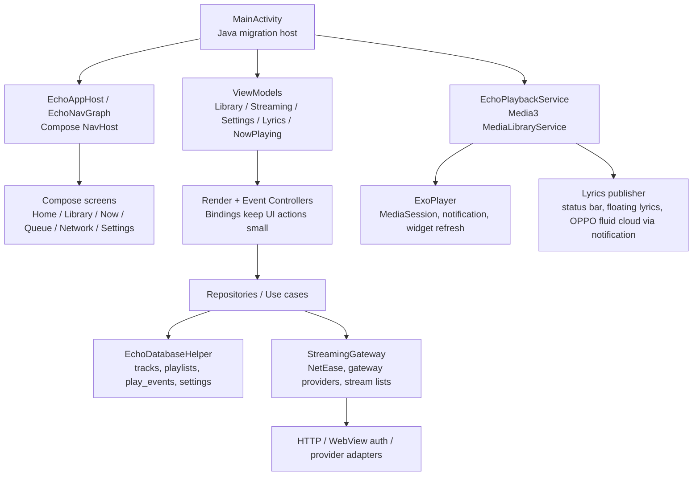

# YUKINE Android

YUKINE 是一款以本地曲库为核心、兼顾流媒体导入和后台播放体验的 Android 音乐播放器。当前工程仍保留部分 `Echo` 命名作为迁移期内部标识，但对外应用名、主体验和文档统一使用 `YUKINE`。

> English documentation is included after the Chinese version. Keep both sections updated when changing product behavior.

> 项目交流群 QQ 群：1013122077

## 当前定位

YUKINE 面向重度听歌和本地曲库用户，优先保证这些体验：

- 本地歌曲扫描、曲库浏览、收藏、播放历史和歌单管理。
- Media3 后台播放、媒体通知、桌面小部件、耳机/车机控制入口。
- 正在播放页、底部 NowBar、歌词、波形和沉浸歌词。
- 网易云等流媒体账号接入、搜索、歌单选择导入、播放源解析。
- WebDAV、M3U/M3U8、远程流列表等网络曲库入口。
- 音效、ReplayGain、状态栏歌词、悬浮歌词、下载管理等播放器增强能力。

## 技术栈

| 层级 | 当前实现 |
|---|---|
| 平台 | Android, minSdk 23, targetSdk 35, compileSdk 35 |
| UI | Jetpack Compose, Material3, 单 Activity + Compose NavHost |
| 播放 | AndroidX Media3 ExoPlayer, MediaSession, MediaLibraryService |
| 数据 | SQLite helper + repository, 本地 tracks/playlists/play_events/settings 等表 |
| 架构 | Java MainActivity 迁移期宿主 + Kotlin ViewModel/Controller/Bindings |
| 依赖注入 | Hilt |
| 网络与账号 | StreamingGateway, provider descriptor, WebView/cookie/local auth store |
| 构建 | Gradle, Kotlin, Java 17 |

## 架构总览



### 主要模块

- `app.yukine.MainActivity`
  - 迁移期 Activity 宿主，负责服务绑定、页面导航、对话框、权限、文档选择器和部分平台 API。
- `app.yukine.navigation`
  - Compose NavHost、Scaffold、底部导航、NowBar 挂载和 legacy route 映射。
- `app.yukine.playback`
  - Media3 播放服务、队列恢复、播放通知、小部件、音效、ReplayGain、后台控制。
- `app.yukine.streaming`
  - 流媒体 provider、账号状态、搜索、歌单导入、播放源解析和网关能力协商。
- `app.yukine.data`
  - 本地曲库、歌单、设置、播放事件、ReplayGain 和音频规格解析。
- `app.yukine.ui`
  - Compose 页面、主题、图标、NowBar、播放页、歌词、波形和 Onboarding。

## 功能矩阵

## 最新更新

- **播放边界统一（2026-06-25）**: 新增 `PlaybackController` 接口隔离 EchoPlaybackService 实现细节，提供 `PlaybackServiceController` 适配器和 `FakePlaybackController` 测试实现，便于 ViewModel 测试和未来播放引擎替换。
- **曲库状态收敛（2026-06-25）**: `MainLibraryStore` 写接口已移除（setFavorite, toggleFavorite, clearPlayHistory），退化为只读兼容facade，收藏状态由 `MainActivityViewModel` 统一管理，通过单向同步保证一致性。
- **测试稳定性修复（2026-06-25）**: `LyricsViewModel` 与 `StreamingViewModel` 改为注入 `ioDispatcher`（默认仍 `Dispatchers.IO`），替换硬编码后台调度，消除完整单测套件并行运行时的偶发失败；完整套件连续清运行已稳定全绿。
- 启动体验优化：实时音频频谱轮询只在实际播放时运行，服务未连接或未播放时复用空频谱，避免打开动画期间每帧触发 Compose 重组。
- 播放缓存提速：当前歌曲首段缓存改为立即高优先级执行，旧预缓存会主动取消；下一首 URL 预解析不再阻塞用户刚点击的当前歌曲解析，减少点播放时的卡顿。
- 大曲库刷新提速：Android 11+ 的 MediaStore generation 未变化时跳过全量扫描，无法读取 generation 或旧系统会安全回退全扫；刷新会依次提示检查、扫描、原子更新和重载阶段，超过 45 秒会给出可重新扫描的提示；整库去重与搜索在后台运行且旧任务不能覆盖新结果，列表每次刷新只发布一次状态、父层只订阅分支布尔值，音频规格解析仅处理当前批量候选。
- 队列解析与刷新提速：大队列恢复先在普通列表中完成过滤和索引计算，再一次性写入线程安全队列；在线预解析窗口会合并同一未完成解析请求，并将同一窗口的解析结果作为一次队列提交，避免多次持久化、全队列复制和中间 UI 版本。队列内容版本变化会立即刷新当前列表，但单纯播放进度不会重建整条队列；当前行按实际播放索引标记，重复曲目不会同时显示为正在播放。
- 播放进度隔离：暂停只暂存当前未切歌时的位置；手动切歌、随机切歌、自动切歌和自然播放完成后的新歌曲都会清除旧检查点并从 0 开始，避免旧进度被流媒体换源带到下一首。
- 自定义页面背景预览：新图会先完整显示原图，并以手机画幅选框标出最终可见区域；可双指缩放、拖动图片选择截取范围。每次应用的新图都会获得新的本地身份，清空后再选图也不会复用旧位图缓存；应用后仍按所选区域铺满页面，且不会继承上一张图的缩放或偏移。进入沉浸式播放页时会淡出当前页的自定义背景及其遮罩、保留主题渐变，退出时恢复，避免半透明专辑封面叠在壁纸上。
- 曲库同曲多音源合并：本地扫描、文档导入、WebDAV、远程流和已导入的网络曲目在歌名、歌手、专辑归一化后匹配且时长相差不超过 3 秒时折叠为一条；会识别并忽略有明确译名标记或中文语法信号的括号译名，以及歌名/专辑末尾的 `feat.` / `featuring` 客串尾缀。所有源文件和数据库条目都会保留，并可在播放页“音源切换”中切换。Remix、Live、Ver.、混音、现场、不同专辑、未知元数据和时长明显不同的版本不会合并。
- 播放页音源切换：同一提供方且同一曲目 ID 的多个音质档（如 QQ 音乐 `STANDARD` / `HIGH`）合并为一个选项，优先使用最高可用音质；真正不同的提供方仍可热切换并保持当前播放进度，点击音源卡片会立即开始解析和切换，无需先暂停；连续点击时以最后一次选择为准。
- QQ 音乐登录态修正：QQ 本机直连不再把只有 `uin/p_uin` 的 Cookie 当作有效登录，播放解析前会要求 `qqmusic_key` / `qm_keyst` / `psrf_qqaccess_token` 等真实凭证，减少“已登录但无法解析需登录”的假阳性。
- QQ 音乐播放解析兼容：仅使用新版无签名 `UrlGetVkey` 与新版 CDN 分发，不再请求旧 `CgiGetVkey`；有 `mediaMid` 时使用该文件标识，缺失时按 `songMid + songMid` 兼容。搜索建议会保留 `mediaMid`，避免解析时丢失文件标识；仅接受合法 HTTP(S) SIP 与可播放 `purl`，会拒绝 `IP;invalid;` 等内部诊断值，旧的坏播放缓存也不会恢复到播放器。`104009` / IP 校验失败会立即停止候选重试，避免反复卡住。QQ 网页登录前会显示平台风控和当前网络受限风险提示，需等待 5 秒后确认；异常时建议通过 QQ 音乐官方客户端退出并重新登录或联系官方支持。`psrf_qqaccess_token` 仍随 Cookie 保留，Netscape `#HttpOnly_` Cookie 记录可导入。QQ CDN 返回的 HTTP SIP 会在本机转换为 HTTPS；会员、地区、IP 校验和登录失败会显示明确原因，而不再被通用“需登录”提示覆盖。
- QQ 音乐歌单元数据兼容：兼容歌单歌曲顶层的 `albumname`、`albumid`、`albummid`、`strMediaMid` 字段；搜索和歌单条目会显示接口返回的专辑名与封面。
- 设置迁移继续推进：设置页面状态由 `SettingsViewModel` 直接构建，`SettingsRenderCoordinator`、`SettingsPageEventController`、`SettingsPageChromeBindings`、`SettingsScrollStateSink` 已移除，页面背景和备份选择通过平台 owner/effect 处理。
- 设置体验改造：首页按“授权/曲库 → 播放 → 歌词 → 外观”排序并展示当前状态；常用开关可直接操作，单选项会显示选中状态，缺少音乐权限时可从首页直接授权。
- 搜索页升级为本地 + 多音源聚合搜索：一次搜索会并发查询所有已启用且支持搜索的在线音源；同歌手、同曲名且时长接近的结果合并为一条，并以 `+N` 标记备用音源。所有合并音源仍保留，可在主音源解析失败时自动回退，并在播放页手动切换。
- 下载管理增强：应用内下载支持断点续传、暂停后保留缓存、继续下载不再清零进度；支持 HTTP Range 的音源会使用有限分片并发下载，不支持时自动回退单连接下载。
- 歌曲和封面下载：单曲下载会尽量同步保存封面；封面保存失败不应反向标记音频下载失败。
- 状态环优化：中心音质色球、下载进度细环、内部频谱、常态呼吸和低频鼓点缩放继续保留；频谱显示更强调变化量，降低持续响度占比，避免一直撑满。
- NowBar 排版优化：新 CJK 字体下歌名、歌手、专辑信息和收藏/循环/队列按钮不再挤压，底部控制区高度已重新分配。
- 艺人详情增强：先显示本地统计和懒加载简介，再补充在线简介；歌手全部在线专辑以底部卡片展示，点击专辑可加载曲目并播放。
- 流媒体账号与导入：网易云登录后可弹窗选择导入歌单；QQ 支持 Cookie 导入格式适配；LX/洛雪支持本地 `.js` 文件和网络链接导入多个自定义音源脚本。
- 文档与合规：README 补充测试版定位、版权与音源风险、Cookie 本机保存、APK 分发和上架注意事项。

### 已实现

- 首次启动引导：权限、扫描、歌单导入、流媒体连接入口。
- 本地曲库：歌曲、专辑、艺人、文件夹、歌单分组。
- 收藏歌单：曲库歌单页提供 `收藏歌单` 入口，收藏歌曲集中查看。
- 播放队列：顺序播放、列表循环、单曲循环、随机、关闭循环播完停止。
- 后台播放：Media3 前台服务、MediaSession、媒体通知、耳机控制、开机恢复入口。
- 音频独占：播放设置中默认开启，使用系统媒体焦点让兼容的其他媒体应用暂停或静音；关闭后可与其他媒体同时播放。Android 无法强制不遵守音频焦点的应用停止。
- 桌面小部件：封面、标题、艺人、上一首、播放/暂停、下一首。
- NowBar：歌词条、进度、波形、收藏、随机、循环、队列入口。
- 歌词：本地/在线歌词加载、偏移、当前行高亮、沉浸歌词、复制和状态同步。
- 状态栏/悬浮歌词：播放通知歌词、锁屏/状态栏歌词、悬浮窗歌词，歌词行变化、前后台切换和界面被系统回收但播放仍继续时，都会由播放服务同步刷新通知与媒体会话；支持 OPPO 流体云依赖通知展示。歌词设置还提供默认关闭的「系统媒体歌词标题兼容模式」，供只显示标题的车机或媒体面板把当前歌词作为标题，同时保留歌曲名和歌手元数据。
- 音效：系统 Equalizer、BassBoost、Virtualizer、LoudnessEnhancer 设置入口。
- ReplayGain：读取本地音频 ReplayGain 标签并在播放时应用。
- 流媒体：网易云登录、账号歌单加载、登录后弹窗选择导入歌单、在线搜索和播放源解析；QQ Cookie 导入和 LX 自定义源导入入口已接入。
- 网络曲库：WebDAV、远程流列表、M3U/M3U8 导入。
- 下载管理：设置页入口、当前歌曲/封面下载、单首暂停/继续、全部暂停/继续、应用内断点续传、Range 分片并发下载和系统下载通知。
- 搜索：本地和多音源在线聚合搜索入口，同曲多源合并并保留自动回退/手动切换候选；搜索历史保留，离开搜索后不污染曲库显示。
- 艺人详情：本地艺人目录、在线资料补充、懒加载简介和在线专辑卡片入口。
- 多语言：应用内语言映射、Android 13+ per-app language `LocaleConfig`。

### 部分实现或受限

- QQ 音乐、LX/洛雪等 provider：已接入 provider 列表、QQ Cookie 导入和 LX 自定义源导入入口，但完整本机直连搜索、播放源、歌词、封面和歌单同步仍需逐个补 Provider。
- 流媒体下载：应用内下载已支持断点续传和 Range 分片并发，但受音源鉴权、会员、地区、Range 支持和临时 URL 时效影响，仍可能失败。
- OPPO 流体云：通过播放通知和状态栏歌词提供内容，实际展示形态由系统和机型决定。
- Android Auto：服务已以 MediaLibraryService 暴露基础能力，完整车机浏览树仍需继续验收和扩展。
- 频谱/波形：NowBar 波形和状态环频谱已可用，仍属于体验调优项，不能阻塞音频播放。

### 规划中

- QQ/LX 本机 Provider 直连搜索、播放源、歌词、封面和歌单导入。
- 可配置多音源优先级、记住单曲首选音源，并继续完善不同 provider/音质的切换策略。
- 歌曲介绍、更多歌词源、更多播放源优先级策略。
- 批量歌单下载的 provider 鉴权链路和失败重试。
- 标签编辑器、备份/恢复、Last.fm Scrobble。
- 平板/折叠屏双栏布局、Predictive back 深度适配。

## 多语言要求

本项目以中文体验为主，英文为同步维护语言。

### UI 文案

- 新增任何用户可见文案时，必须同时提供中文和英文。
- 现阶段主要入口是 `app/src/main/java/app/yukine/AppLanguage.java`：
  - 英文写在第二个参数。
  - 中文写在第三个参数。
  - 中文语气优先自然、短句、面向普通用户。
- 避免在 Compose 页面、Activity、Service、Dialog 中硬编码单语言文案。
- 如果必须临时硬编码，必须在同一次改动里补回 `AppLanguage` key。

示例：

```java
put("download.manager", "Download manager", "下载管理");
```

### 系统语言

- Android 13+ per-app language 使用 `android:localeConfig="@xml/locales_config"`。
- 新增语言时需要同步检查：
  - `app/src/main/res/xml/locales_config.xml`
  - `AppLanguage.java`
  - README 的语言说明

### README 和文档

- README 必须保持中文主文档和英文文档同步。
- 面向用户的功能说明优先中文，面向贡献者的构建/测试命令保持原始命令格式。
- 设计、发布、迁移类文档可以只写中文，但新增公共能力时 README 必须补英文摘要。

## 免责声明与测试版说明

YUKINE 当前按个人学习、本地音乐管理和测试体验定位维护。请在合规前提下使用本项目和测试包。

- 版权与音源：流媒体搜索、播放、下载、歌词和封面能力可能受版权、会员、地区、平台协议和接口策略限制。本项目不提供、鼓励或承诺绕过版权保护，也不应宣传为“免费下载付费音乐”“破解音源”或“全网无损”工具。
- 账号与 Cookie：网易云、QQ 等账号登录可能通过本机 WebView 捕获 Cookie。凭据仅用于本机播放、搜索和歌单同步，不应上传到第三方服务器。设置中应保留退出登录和清除登录态能力。
- 第三方平台：网易云、QQ、LX/洛雪、酷狗等名称仅表示可选的第三方来源适配目标，不代表官方合作、授权或背书。相关接口可能随时变更、限流、失效，功能可用性不保证。
- 隐私与权限：应用可能读取本地音乐、媒体库、通知权限、悬浮窗权限、下载目录、网络请求和本机保存的账号凭据。测试和分发时应提供清晰的隐私说明。
- 下载功能：下载仅用于用户有权保存的个人内容和本地管理场景。批量下载、封面下载和歌词下载都应遵守来源平台规则和当地法律。
- 稳定性：当前包含播放、歌词、下载、流体云、状态环、后台保活和多音源实验能力，仍建议以 Beta/自用测试包形式分发，并收集设备型号、系统版本、复现步骤和日志。
- APK 分发：公开分发时应固定发布渠道，标注版本号、更新时间和校验值，避免旧包、二改包或来源不明的 APK 混用。
- 上架限制：Google Play 和国内应用商店可能对后台播放、悬浮窗、下载、第三方音源和版权内容有额外审核要求。正式上架前需单独完成合规、隐私和版权风险评估。

## 构建

```powershell
.\gradlew.bat :app:assembleDebug --console=plain
```

Debug APK:

```text
app/build/outputs/apk/debug/app-debug.apk
```

Release 签名通过环境变量或 Gradle property 提供：

```text
ECHO_RELEASE_STORE_FILE
ECHO_RELEASE_STORE_PASSWORD
ECHO_RELEASE_KEY_ALIAS
ECHO_RELEASE_KEY_PASSWORD
```

## 测试

常用验证命令：

```powershell
.\gradlew.bat :app:compileDebugKotlin :app:compileDebugJavaWithJavac --console=plain
.\gradlew.bat :app:testDebugUnitTest --console=plain
.\gradlew.bat :app:assembleDebug --console=plain
```

完整 `check` 会额外执行 mojibake 扫描：

```powershell
.\gradlew.bat :app:check --console=plain
```

## 维护约束

- 应用图标受保护，详见 `docs/APP_ICON_LOCK.md`。
- 外部显示名保持 `YUKINE`，内部遗留 `Echo` 命名只作为迁移期技术债处理。
- 播放线程优先级高于视觉分析、波形、频谱、封面解码和下载 UI。
- 不要让下载、频谱、歌词源请求阻塞 ExoPlayer 播放链路。
- 修改播放服务、队列恢复或后台保活时，参考 `docs/PLAYBACK_SERVICE_STABILITY_MATRIX.md`。
- 修改成熟度路线时，参考 `docs/MATURITY_ROADMAP.md`。

---

# YUKINE Android English

YUKINE is an Android music player centered on local libraries, streaming playlist import, lyrics, and reliable background playback. Some internal classes still use `Echo` names during the migration, but the user-facing app identity is `YUKINE`.

> Project discussion QQ group: 1013122077

## Product Focus

YUKINE is designed for local-library and long-session music listeners:

- Scan and browse local tracks, albums, artists, folders, favorites, history, and playlists.
- Play through a Media3 foreground service with notifications, widget controls, headset controls, and car/media session integration.
- Use a Now Playing page, bottom NowBar, synchronized lyrics, waveform progress, and immersive lyrics.
- Connect streaming accounts, search online music, choose account playlists after login, and import them into the local library.
- Use WebDAV, M3U/M3U8, and remote stream lists as network library sources.
- Configure audio effects, ReplayGain, live lyric notifications, floating lyrics, and download management.

## Stack

| Layer | Implementation |
|---|---|
| Platform | Android, minSdk 23, targetSdk 35, compileSdk 35 |
| UI | Jetpack Compose, Material3, single Activity + Compose NavHost |
| Playback | AndroidX Media3 ExoPlayer, MediaSession, MediaLibraryService |
| Data | SQLite helper + repositories for tracks, playlists, play events, settings |
| Architecture | Java MainActivity migration host + Kotlin ViewModels, Controllers, Bindings |
| DI | Hilt |
| Streaming | StreamingGateway, provider descriptors, WebView/cookie/local auth store |
| Build | Gradle, Kotlin, Java 17 |

## Architecture


## Features

## Latest Updates

- **Playback boundary unified (2026-06-25)**: a new `PlaybackController` interface isolates EchoPlaybackService internals, with a `PlaybackServiceController` adapter and a `FakePlaybackController` test double, making ViewModels testable and the playback engine replaceable.
- **Library state convergence (2026-06-25)**: `MainLibraryStore` write methods (setFavorite, toggleFavorite, clearPlayHistory) were removed; it is now a read-only compatibility facade, and favorite state is owned by `MainActivityViewModel` with one-way synchronization.
- **Test stability fix (2026-06-25)**: `LyricsViewModel` and `StreamingViewModel` now inject an `ioDispatcher` (still defaulting to `Dispatchers.IO`) instead of hardcoding the background dispatcher, removing intermittent failures when the full unit-test suite runs in parallel; repeated clean runs of the suite are now consistently green.
- Startup smoothness: realtime audio-spectrum polling now runs only while playback is active, and disconnected/stopped playback reuses an empty band array so app-open transitions do not trigger frame-by-frame Compose recomposition.
- Playback cache startup is faster: the current track's leading cache range now starts immediately with high priority, stale precache writers are cancelled, and next-track URL pre-resolve no longer blocks the track the user just tapped.
- Large-library refresh is faster: on Android 11+, an unchanged MediaStore generation skips the full scan; unavailable generation data and older Android versions safely fall back to a full scan. Refresh status now identifies checking, scanning, atomic replacement, and reloading, then offers a retryable scan message after 45 seconds. Whole-library deduplication and search run in the background, stale jobs cannot publish over newer results, each refresh publishes list state once while the parent observes only branch booleans, and audio-spec parsing handles only the current batch candidates.
- Queue parsing and refresh are faster: large restored queues are filtered and indexed in a regular list before one thread-safe queue commit; the streaming pre-resolve window coalesces the same in-flight target and commits one window's results as one queue mutation, avoiding repeated persistence, full-queue copies, and intermediate UI versions. A queue-content revision refreshes the visible list immediately, while progress-only updates still avoid rebuilding it; the active row uses the actual playback index so duplicate tracks do not all appear active.
- Playback-position isolation: a pause checkpoint is valid only until the current song changes. Manual, shuffled, and automatic track changes plus natural completion clear it, and the next song starts at 0 rather than inheriting an old streaming-source position.
- Custom page-background preview: a newly selected image first shows the full original with a phone-aspect crop frame. Pinch and drag the image to choose the crop. Each newly applied image receives a fresh local identity, so clearing and then choosing another image cannot reuse the old bitmap cache; after applying, that selection still fills the page, and no zoom or pan is inherited from the previous image. Entering immersive Now Playing fades out the active page's custom background and dim mask while preserving the base theme gradient, then restores them on exit so semi-transparent album art never stacks over custom wallpaper.
- Library same-song source merging: matching copies from device scans, document import, WebDAV, remote streams, and imported online tracks collapse into one item in the library, search, and play-all list when normalized title, artist, album, and duration (within three seconds) agree. Parenthesized aliases are ignored only with an explicit translation label or conservative Chinese-language signal, along with trailing `feat.` / `featuring` credits in titles or albums. Source files and database rows remain intact, and every alternative can be selected from the Now Playing source switcher. Remix, Live, Ver., mix, distinct albums, unknown metadata, and materially different durations remain separate.
- Now Playing source switching: quality variants with the same provider and provider track ID (for example, QQ Music `STANDARD` / `HIGH`) are one option, using the highest available quality. Genuine different providers hot-switch at the current position; tapping a source card starts resolution and switching immediately without a prior pause, and rapid taps honor the most recent choice.
- QQ Music auth state: QQ local playback no longer treats `uin/p_uin` alone as a valid login. Playback resolution now requires a real credential cookie such as `qqmusic_key`, `qm_keyst`, or `psrf_qqaccess_token`, reducing false "logged in but login required" failures.
- QQ Music playback compatibility: only the unsigned modern `UrlGetVkey` plus current CDN dispatch are used; legacy `CgiGetVkey` is no longer requested. A track uses its `mediaMid` filename when present and `songMid + songMid` only when it is absent. Smartbox search preserves `mediaMid` so resolution does not lose the file identifier. Only valid HTTP(S) SIP values and playable `purl` values are accepted; internal diagnostics such as `IP;invalid;` and stale invalid playback cache entries never reach the player. `104009` / IP-validation failures stop candidate retries immediately to avoid repeated stalls. QQ web sign-in now presents a five-second acknowledgement about risk controls and current-network restrictions; on failure, users should sign out and back in with the official QQ Music client or contact official support. `psrf_qqaccess_token` remains in the Cookie header and Netscape `#HttpOnly_` records are importable. HTTP QQ CDN SIP URLs are normalized to HTTPS, while membership, region, IP-validation, and login failures now show their real reason instead of a generic login prompt.
- QQ Music playlist metadata compatibility: top-level `albumname`, `albumid`, `albummid`, and `strMediaMid` fields are now handled; streaming search and playlist rows show the returned album title and artwork.
- Settings migration: settings page state is now built by `SettingsViewModel`; `SettingsRenderCoordinator`, `SettingsPageEventController`, `SettingsPageChromeBindings`, and `SettingsScrollStateSink` have been removed, while page-background and backup pickers route through platform owners/effects.
- Settings experience refresh: the home page now leads with permission/library setup, then playback, lyrics, and appearance; common switches work inline, choices show their selection, and missing music access can be granted directly from Settings.
- Search now combines local results with multi-source online aggregation. Results with the same artist, title, and a close duration are collapsed into one row with a `+N` source indicator. Every merged source remains available for automatic playback fallback and manual switching on the Now Playing screen.
- Download management now supports resumable in-app downloads. Paused tasks keep cache files and continue without resetting progress; sources with HTTP Range support use limited segmented parallel downloads, while unsupported sources fall back to a single connection.
- Track and artwork downloads are linked: track downloads try to save cover art as best effort, and artwork failures should not mark a completed audio download as failed.
- The status ring keeps the quality center, download progress arc, internal spectrum, idle breathing, and kick-driven scaling. Spectrum rendering now emphasizes changes and reduces the weight of constant loudness.
- NowBar layout was adjusted for the CJK font so title, artist/album, favorite, repeat, and queue controls do not crowd each other.
- Artist detail pages now show local stats first, lazy-load online introductions, and render online album cards at the bottom. Album cards can load tracks and start playback.
- Streaming account/import flow now includes NetEase playlist import selection after login, QQ cookie import normalization, and LX custom source import from local `.js` files or network links.
- Documentation now calls out beta status, copyright/source risk, local-only cookie storage, APK distribution expectations, and store-review caveats.

### Implemented

- First-run onboarding for permissions, scanning, playlist import, and streaming connection.
- Local library by songs, albums, artists, folders, and playlists.
- Favorites collection entry from the playlist grouping page.
- Queue modes: sequential playback, repeat all, repeat one, shuffle, and repeat off that stops after the current track.
- Background playback through Media3 foreground service, MediaSession, notifications, headset controls, and boot restore entry.
- Audio exclusive: enabled by default in Playback settings. It requests system media focus so compatible media apps pause or mute; turning it off allows mixing with other media. Android cannot force apps that ignore audio focus to stop.
- Home screen widget with artwork, title, artist, previous, play/pause, and next actions.
- NowBar with lyric strip, progress, waveform, favorite, shuffle, repeat, and queue controls.
- Lyrics loading, offset control, active-line highlight, immersive lyrics, copy support, and state publishing.
- Live lyric notification and floating lyrics. Lyric-line updates, foreground/background transitions, and Activity destruction while playback continues are synchronized by the playback service to both the notification and MediaSession; supported OPPO fluid cloud panels can display lyric content from the notification. Lyrics settings also include a default-off system-media lyric-title compatibility mode for car head units or media panels that only show a title; it keeps the real track title and artist in metadata.
- Android system audio effects: Equalizer, BassBoost, Virtualizer, and LoudnessEnhancer.
- ReplayGain parsing and playback gain application for local tracks.
- NetEase login, account playlist loading, post-login playlist picker, online search, and playback URL resolution; QQ cookie import and LX custom source import entries are available.
- WebDAV, remote stream lists, and M3U/M3U8 import.
- Download manager entry, current track/cover downloads, per-item pause/resume, pause/resume all, in-app resumable downloads, Range segmented downloads, and system download notification.
- Local plus multi-source online aggregate search with same-track source merging, automatic fallback, manual source candidates, and history preservation.
- Artist directory, online artist profile enrichment, lazy-loaded introductions, and online album card entry.
- In-app language mapping plus Android 13+ per-app language support.

### Partial or Limited

- QQ Music and LX providers are listed, QQ cookie import and LX custom-source import entries exist, but full native provider search, playback URL, lyrics, artwork, and playlist sync still need provider-specific implementation.
- Streaming downloads support resumable in-app downloads and Range segmented downloads, but may still fail because of authentication, membership, region, missing Range support, or temporary URL expiry.
- OPPO fluid cloud display is driven through notifications and depends on OS support.
- Android Auto support has a MediaLibraryService base; the full browsable tree still needs device/emulator validation.
- Spectrum and waveform visuals are available but remain tuning surfaces and must never block audio playback.

### Planned

- Native QQ/LX provider search, playback URL, lyrics, artwork, and playlist import.
- Configurable source priority, remembered per-track source preference, and richer provider/quality switching policies.
- Song descriptions, more lyric sources, and richer playback source ranking.
- Authenticated batch playlist downloads with retry handling.
- Tag editor, backup/restore, and Last.fm scrobbling.
- Tablet/foldable layouts and deeper predictive back handling.

## Localization Requirements

YUKINE is Chinese-first, with English maintained in parallel.

- Every new user-visible string must provide both Chinese and English.
- The main string registry is currently `app/src/main/java/app/yukine/AppLanguage.java`.
- Avoid hardcoded single-language strings in Compose screens, Activity, Service, or dialogs.
- If a temporary hardcoded label is unavoidable, add its `AppLanguage` key in the same change.
- New Android per-app languages must update `app/src/main/res/xml/locales_config.xml`.
- README must keep Chinese and English feature descriptions in sync.

Example:

```java
put("download.manager", "Download manager", "下载管理");
```

## Disclaimer And Beta Notes

YUKINE is maintained as a personal learning, local music management, and beta testing project. Use the project and test APKs only where you have the right to do so.

- Copyright and sources: streaming search, playback, downloads, lyrics, and artwork may be limited by copyright, membership status, region, platform terms, and API changes. This project does not provide, encourage, or guarantee bypassing copyright protection, and should not be advertised as a free paid-music or source-unlocking tool.
- Accounts and cookies: NetEase, QQ, and similar logins may capture cookies through a local WebView. Credentials are intended only for local playback, search, and playlist sync, and should not be uploaded to third-party servers. Settings should keep sign-out and clear-login-state actions available.
- Third-party platforms: NetEase, QQ, LX, KuGou, and similar names only describe optional third-party source adapters. They do not imply official partnership, authorization, or endorsement. Interfaces may change, rate-limit, or stop working at any time.
- Privacy and permissions: the app may read local audio, media library data, notification permission, floating-window permission, download directories, network requests, and locally stored account credentials. Test builds and public distribution should include a clear privacy notice.
- Downloads: downloads are intended only for personal content that the user has the right to save and manage locally. Batch downloads, artwork downloads, and lyric downloads must follow source-platform rules and local law.
- Stability: playback, lyrics, downloads, OPPO fluid cloud, status-ring visuals, background keep-alive, and multi-source experiments can affect one another. Public builds should be labeled as Beta or personal test builds, with feedback including device model, OS version, reproduction steps, and logs.
- APK distribution: public APKs should come from a fixed official channel and include version number, release time, and checksum to avoid stale, modified, or unknown packages.
- Store review: Google Play and domestic app stores may apply additional review requirements to background playback, floating windows, downloads, third-party sources, and copyrighted content. Complete compliance, privacy, and copyright review before any formal store release.

## Build

```powershell
.\gradlew.bat :app:assembleDebug --console=plain
```

Debug APK:

```text
app/build/outputs/apk/debug/app-debug.apk
```

Release signing can be supplied through environment variables or Gradle properties:

```text
ECHO_RELEASE_STORE_FILE
ECHO_RELEASE_STORE_PASSWORD
ECHO_RELEASE_KEY_ALIAS
ECHO_RELEASE_KEY_PASSWORD
```

## Test

```powershell
.\gradlew.bat :app:compileDebugKotlin :app:compileDebugJavaWithJavac --console=plain
.\gradlew.bat :app:testDebugUnitTest --console=plain
.\gradlew.bat :app:assembleDebug --console=plain
```

`check` also runs the mojibake scan:

```powershell
.\gradlew.bat :app:check --console=plain
```

## Maintenance Notes

- The app icon is locked. See `docs/APP_ICON_LOCK.md`.
- User-facing identity is `YUKINE`; legacy `Echo` names are migration debt.
- Audio playback must stay higher priority than visual analysis, waveform/spectrum work, artwork decoding, downloads, and UI feedback.
- Download, spectrum, lyric, and metadata requests must not block ExoPlayer playback.
- For playback-service changes, see `docs/PLAYBACK_SERVICE_STABILITY_MATRIX.md`.
- For roadmap changes, see `docs/MATURITY_ROADMAP.md`.
