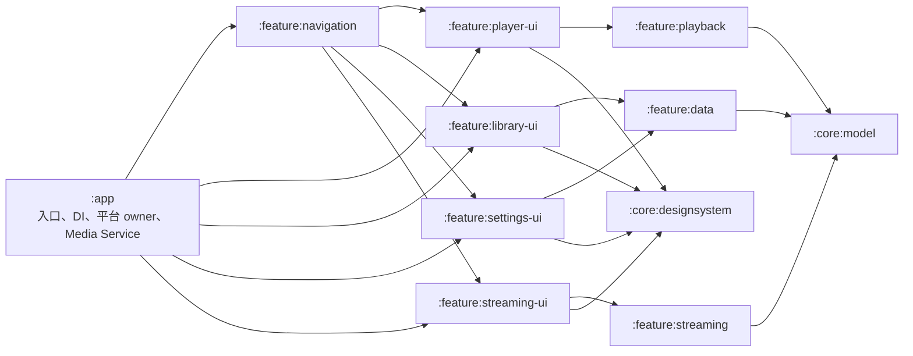

# YUKINE 当前架构

本文描述 2026-07-14 集中重构后的生产架构。历史迁移计划仅用于追溯，不再代表当前代码边界。

## 依赖方向

约束：

- feature 不得依赖 `:app`；`:app` 只做入口、DI 汇合、Android 平台委托和跨 feature Flow 绑定。
- 业务 screen、ViewModel、UI reducer 必须位于所属 feature。
- `:feature:navigation` 只持有类型化 route、SavedState 与 destination 装配，不成为业务状态仓库。
- 不允许全局 EventBus、万能 Coordinator、无校验/状态/生命周期价值的纯转发 Gateway。
- 简单 UI 命令从 typed intent 到领域命令不得超过五跳。

## 运行时边界

`MainActivity` 只负责生命周期、Compose 根节点、Service 连接和 Activity Result launcher 委托。领域装配由 Playback、Library、Streaming、Settings、Navigation、Network、Onboarding 与 Platform feature binding 成组完成；Activity 不持有业务 ViewModel 或页面回调表。

`EchoPlaybackService` 只保留 Media3/ExoPlayer、MediaSession、前台通知、媒体按钮、外部连接与资源生命周期。UI 和 ViewModel 通过：

- `PlaybackReadModel`：连接状态、`PlaybackStateSnapshot` 与 `PlaybackQueueSnapshot` 的只读 `StateFlow`。
- `PlaybackCommands`：play、play/pause、seek、next/previous、队列变更、shuffle/repeat 等语义命令。

队列内容、当前索引和当前曲目的唯一可变 owner 是 `PlaybackQueueManager`。进度发布不复制完整队列；仅队列 revision 变化时发布完整队列快照。

Service 关闭顺序固定为：停止状态发布 → 持久化队列和位置 → 清理通知 → 解绑 MediaSession → 释放 Player → 关闭 executor。相关行为由 Service runtime/owner 测试保护。

## 状态所有权

| 状态 | 唯一可变 owner | 只读消费者 |
|---|---|---|
| 播放连接、进度、模式快照 | `PlaybackServiceConnectionController` 的 read model | Player UI、Navigation、领域 reaction |
| 播放队列、当前索引、当前曲目 | `PlaybackQueueManager` | Service、MediaSession、`PlaybackReadModel` |
| Now Playing / Queue / Lyrics UI | `:feature:player-ui` 中对应 ViewModel/state owner | Compose destination |
| 曲库、收藏 ID、历史、歌单、远程源快照 | `LibraryDataStateOwner` | Library/Collections/Network state binding |
| Library 页面展示状态 | `LibraryViewModel` 与 `LibraryPresentationStateOwner` | Library Compose screen |
| Streaming 认证 | `StreamingAuthStateOwner` | Streaming ViewModel/screen |
| Streaming 搜索 | `StreamingSearchStateOwner` | Streaming ViewModel/screen |
| Streaming 歌单 | `StreamingPlaylistStateOwner` | Streaming ViewModel/screen |
| Streaming 播放解析 | `StreamingPlaybackResolutionStateOwner` | Playback start flow |
| 设置持久化与运行时快照 | `SettingsRepository` + `SettingsViewModel` 聚焦页面 owner | Settings screen、运行时 effect owner |
| 类型化导航 route | `NavigationViewModel` / `NavigationRouteStateStore` | NavGraph 与跨 feature state binding |
| 持久化用户数据 | Room `YukineDatabase` + 聚焦 DAO/Repository | 各领域用例 |

Compose 局部交互（Now Bar 停靠、折叠、手势过程）保持为局部 UI 状态，不写回全局播放快照。Now Bar/Now Playing 使用嵌套 Track、Progress、Modes、Lyrics、Labels、Artwork 子状态；波形使用稳定值对象。

## 模块职责

- `:core:model`：跨模块稳定模型和类型化 route 值对象。
- `:core:common`：无业务归属的通用能力。
- `:core:designsystem`：主题、token、图标、纯 UI primitive。
- `:feature:playback`：播放只读契约、快照与队列领域实现。
- `:feature:player-ui`：Now Bar、Now Playing、Queue、Lyrics 和对应 ViewModel/reducer。
- `:feature:library-ui`：Home、Library、Collections、Search、Downloads、曲库状态与 reducer。
- `:feature:settings-ui`：Settings、Network、Onboarding、设置/网络状态与 reducer。
- `:feature:streaming-ui`：Streaming screen、认证/搜索/歌单/解析状态 owner。
- `:feature:navigation`：类型化 destination 和 Compose NavHost 装配。
- `:feature:data`：Room、DAO、Repository、扫描/导入数据能力。
- `:feature:streaming`：provider、网关、缓存和底层流媒体适配。
- `:app`：Application/Activity、Hilt 汇合、平台 launcher、Media Service 与跨 feature binding。

## 自动边界报警

`MainActivityArchitectureContractTest` 检查：

- `MainActivityBase` 不存在且 Kotlin `MainActivity` 保持精简。
- `app/src/main` 不声明业务 ViewModel、Compose screen 或手动 `render(...)` controller 链。
- 业务 reducer 位于对应 feature。
- Service/UI、Room/旧 helper、类型化导航等关键边界不回退。

字符串检查仅是报警；真正依赖方向由 Gradle 模块编译边界、可见性和行为测试共同保证。
