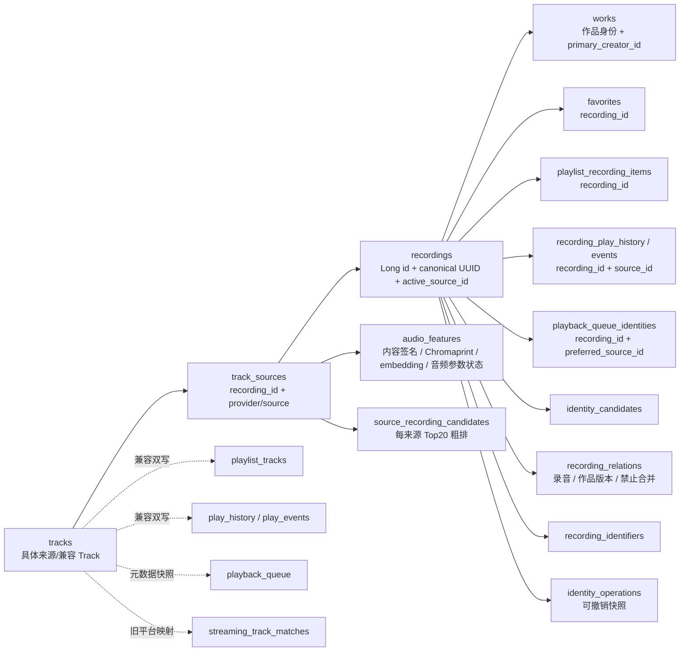

# 统一歌曲身份阶段 0 审计与性能基线

> 历史说明：本文记录 2026-07-16 的 v25 基线，不代表当前 schema。当前实现与迁移要求以 `DATABASE_MIGRATIONS.md` 的 Room v32 为准。

日期：2026-07-16

## 结论

当前工程不是计划中假定的 Room v16，而是 Room v25。`recordings.id(Long) + canonical_uuid`、`track_sources`、canonical 收藏/歌单/历史/队列、候选处理、手动合并/拆分和撤销能力大部分已经存在，不应重新建一套平行身份库。v22 持久化版本化的来源匹配特征，v23 进一步按来源持久化最多 20 个 recording 粗排候选，v24 持久化规范化录音对关系；v25 增量加入 `works`、`recordings.work_id` 和冷路径 `audio_features`，并用内容签名避免未变化或已知失败的文件反复解析。

当前“曲库仍未合并”的根因也已经由真机数据确认：734 条 `tracks` 对应 734 条 `recordings`；214 个 WebDAV 来源与 2 个本地来源中，归入同一 recording 的物理来源组为 0。现有展示层只做临时聚类，持久层没有让本地/WebDAV/平台来源统一走带约束的 canonical 聚类入口。

首批实现应集中在阶段 2、5、7、8，而不是立即做新数据库大迁移：

1. 让标准化、候选生成和严格聚类写回现有 `recordings/track_sources`；本地、WebDAV 与已确认平台来源现已进入统一 `SourceIdentityIngestor`。
2. 修复展示聚类只比较簇首、canonical 锚点跳过冲突检查的问题。
3. 让收藏同步只使用确认来源，并补齐 canonical 双轨缺失记录。
4. 播放成功/解析失败的来源健康度、`active_source_id`、首个 PCM 与单平台搜索/URL 解析分阶段耗时已补齐；下一步继续补同步阶段跨度。
5. 阶段 9 按最新目标采用 `Conformer-small + Chromaprint`，本阶段不实施，也不进入热路径。

## 当前实际数据模型



代码证据：

- Room 目标版本为 25，实体同时包含 legacy、canonical、作品、版本化特征、有界候选、录音关系和音频特征表：`feature/data/src/main/java/app/yukine/data/room/YukineDatabase.kt`。
- v1～v19 先原子规范化到 v20，再顺序执行 v21～v25 幂等规范化；v20～v24 只执行后续步骤：`feature/data/src/main/java/app/yukine/data/room/YukineMigrations.kt`。
- `recordings` 使用自增 Long 主键、唯一 UUID、`work_id` 和可空 `active_source_id`：`feature/data/src/main/java/app/yukine/data/room/YukineEntities.kt`。
- `track_sources` 保存来源、可播放状态、匹配状态、音质和成功/验证时间：`feature/data/src/main/java/app/yukine/data/room/YukineEntities.kt:430-463`。
- 新来源无需联网即可立即生成 UUID：`feature/data/src/main/java/app/yukine/data/OfflineMusicIdentityStore.java:36-84,447-468`。

## 现有能力—缺口—对应阶段

| 领域 | 已有能力 | 关键缺口 | 对应阶段 |
| --- | --- | --- | --- |
| Long ID + UUID | 已完整存在；热连接键为 Long，UUID 可稳定导入导出；v24 已增加录音关系表，v25 已增加作品身份与音频特征冷数据表 | `works` 目前按既有 recording 一对一保守回填，后续需按强证据归并同作品的不同录音版本 | 1、4 |
| 来源映射 | 本地、WebDAV、网易、QQ、LX 都写入 `track_sources`；本地/Document/WebDAV 和已确认平台来源已统一进入 `SourceIdentityIngestor`；标准化特征与每来源 Top20 粗排候选均已持久化 | 存量 confirmed 平台来源需要受控重扫/回填；候选尚未加入歌词、Chromaprint 等冷路径证据 | 2、4、5 |
| 展示合并 | `LibraryTrackMergePolicy` 支持 canonical 锚点、0.92/0.08 阈值，并已改为簇内 complete-link 复核 | 仍需在存量真机曲库验证 canonical 锚点和物理来源持久化结果一致 | 5 |
| 候选评分 | V3 已独立输出 `sameRecordingProbability`、`sameWorkProbability`、录音关系和证据置信度上限；v24 将 complete-link 结果写入独立 Room relation 表；播放来源单独输出 `sourceSelectionScore`；倒排标题/艺人/n-gram 粗排已持久化每来源 Top20 | 音频/歌词证据未接入候选 | 2、3、4 |
| 候选管理 | Room 只读快照、确认、拒绝、其他版本、刷新任务均已存在；页面已复用全局主题并计入系统栏、底栏和 Now Bar 安全区 | 需要继续验证所有 WebDAV 记录都有 local-track 映射，并在真机检查停靠/展开 Now Bar 下的视觉结果 | 6 |
| 合并/拆分 | 事务迁移收藏、歌单、历史、事件、队列和外部录音关系；拆分生成新 UUID 与锁定 `CANNOT_LINK`；撤销快照恢复关系；统一来源聚类复用同一 merge 事务 | 存量来源仍需批量回填入口与真机核验 | 5、6、7 |
| 收藏同步 | 本地先写、批处理持久化、分页拉取、重试；远端写入只接受 canonical confirmed source，旧映射会重新验证；批量条目以最多 4 路并发处理 | 真机仍需验证大收藏分页耗时和 canonical 来源覆盖率；未确认候选只能停留在待确认状态 | 7 |
| 歌单同步 | 已改为单事务批量替换并维护 canonical/legacy 表；v21 幂等补齐现有队列、历史和事件引用，逐次事件以唯一 legacy ID 关联 | PLG110 大曲库仍需实际执行 v20→v21 并核对原缺口；所有业务读路径还未完全切换 recording | 7 |
| WebDAV | ETag/修改时间/长度清单；简单路径移动可复用旧 Track ID；元数据满足严格阈值时可与本地物理来源持久化聚类 | 歧义移动不会保持 recording；指纹策略尚未形成闭环；存量数据需重扫触发 | 4、5 |
| 播放 Top1 | 活跃来源优先、已知平台 ID 刷新、失败后标题搜索；V2 Top1 不设最低阈值；首个 PCM 后后台写回来源成功时间，且仅 confirmed 来源可成为 active source；解析失败按错误类别更新健康度 | HTTP 状态与实际媒体读取失败尚未接入同一健康反馈；来源回退跨度仍需补齐 | 8 |
| 诊断 | 已有 resolve→URL、prepare→ready、click→ready、prepare/click→首个 PCM，以及按 provider 的标题搜索、候选排序、URL 解析 P50/P95、失败/超时/取消计数 | 同步各阶段、recording 查询和来源回退跨度未覆盖；真机结构化导出尚未实现 | 0、8、11 |
| 音频指纹 | Native Chromaprint/KissFFT 与候选桶原型已存在 | 尚未接入持久化特征、Range 分段和聚类证据 | 4 |
| 神经增强 | 暂无热路径依赖，符合约束 | 最新路线改为 `Conformer-small + Chromaprint`；需后续蒸馏/量化和 CPU 回退验证 | 9（暂缓） |

## 完整调用链审计

### 曲库与多来源同步

```text
LibraryWebDavSyncOwner
→ WebDAV 清单/Track
→ MusicLibraryRepository.syncRemoteSource
→ RemoteSourceRepository.applyIncrementalTracks
→ LibraryRepository / OfflineMusicIdentityStore
→ LibraryMultiSourceSyncCoordinator.syncIncremental
→ 每首 Track × 每个平台串行 search
→ streaming_track_matches / track_sources
→ LibraryTrackMergePolicy 临时展示聚类
```

平台增量同步现已先构造待处理的 Track×平台任务，再使用最多 4 个固定 worker 并发执行网络搜索和纯评分；候选与匹配结果仍按原曲目/平台顺序串行写入 Room，避免数据库竞态。协程取消会向上传播，不会被误记成“无音源”。实现见 `app/src/main/java/app/yukine/LibraryMultiSourceSync.kt`。本次 90,000 次纯评分总计约 545ms，评分不是瓶颈；真实同步长尾仍需用账号与真机网络复测。

阶段 0 后首批修复已把 `LibraryTrackMergePolicy.clusters()` 改为簇内 complete-link 复核，见 `feature/library-ui/src/main/java/app/yukine/LibraryTrackMergePolicy.kt:77-166`。即使 canonical ID 相同，也只会进入无硬冲突的兼容簇，避免 A≈B≈C 的传递式误合并。

物理来源聚类现已提升为统一 `SourceIdentityIngestor`：所有非拒绝来源都可生成并缓存特征/候选，但索引只让 `match_status=CONFIRMED` 的来源成为自动合并锚点，因此 local/document/WebDAV 与已确认的网易、QQ、LX 共享 0.92/0.08、无硬冲突、complete-link 和同一 recording merge 事务；`UNRESOLVED/CANDIDATE`、搜索 Top1、已拒绝候选、其他版本和有效手动拆分都不能触发自动合并。粗排通过标题、艺人和稀有 n-gram 倒排索引为每来源持久化最多 20 个候选，严格 complete-link 只精排这些 recording；硬版本冲突仍保留为候选证据，但不能自动合并。直接平台身份确认后会立即增量摄入对应 recording，普通曲库入库也复用同一入口。实现见 `feature/data/src/main/java/app/yukine/data/SourceRecordingCandidateGenerator.kt`、`OfflinePhysicalSourceClusterer.kt`、`OfflineMusicIdentityStore.java` 与 `LibraryRepository.java`。

### 收藏同步

```text
本地点击收藏
→ FavoriteSyncCoordinator.onLocalFavoriteChanged
→ 立即写 favorites(recording_id)
→ propagate
→ 只查询 confirmed canonical track_source
→ 平台 add/remove favorite
→ 保存 mapping、operation、sync_state
```

`FavoriteSyncCoordinator.syncIncremental()` 逐个平台分页拉取；同一页内按最多 4 个条目并发处理，任一条目失败时不推进游标，保留原有可重试语义。

`matchTarget()` 现在只允许当前 recording 下状态为 `CONFIRMED` 的目标平台来源返回 `SYNCED`。历史收藏 mapping 和旧 `streaming_track_matches` 只能形成 `NEEDS_CONFIRMATION` 候选，不能触发平台红心；即使旧 mapping 曾标记为 `SYNCED`，也必须与当前 confirmed canonical 来源完全一致才可复用。平台拉取到的新收藏只会把“同一条直接平台 Track 对应的持久化来源”确认为身份映射，不会因为搜索结果或 legacy 候选自动确认，也不会仅凭确认而升级为可播放 active source。

### 歌单、历史和队列

- 歌单批量替换已使用一个事务并批量查 recording：`feature/data/src/main/java/app/yukine/data/PlaylistRepository.java:156`。
- 流媒体歌单同步已调用批量入口：`feature/data/src/main/java/app/yukine/data/MusicLibraryRepository.java:848-871`。
- 合并操作会迁移 canonical 收藏、历史、事件、队列和歌单：`feature/data/src/main/java/app/yukine/data/RoomRecordingIdentityRepository.kt:282-330`。
- 拆分可按选项迁移收藏、歌单、队列并清理不再合法的 source 引用：`feature/data/src/main/java/app/yukine/data/RoomRecordingIdentityRepository.kt:378-420`。

缺口不是没有 canonical 表，而是兼容双轨覆盖不完整。真机中 `playback_queue=425`、`playback_queue_identities=407`；legacy 历史 37 条、canonical 历史 10 条；legacy 事件 56 条、canonical 事件 15 条。下一数据库版本必须先补齐并校验这些缺失引用，再允许业务只读 canonical。

### WebDAV 重扫

`RemoteSourceRepository.applyIncrementalTracks()` 会尝试用强标签或标题/艺人/近时长识别 1:1 路径移动：`feature/data/src/main/java/app/yukine/data/RemoteSourceRepository.java:97`。唯一移动可复用旧 Track ID；歧义候选会保守地产生新记录。因此它能处理简单改名，但不能代替 recording 层聚类。

### 播放解析

```text
用户播放/切歌
→ CanonicalPlaybackSourceResolver
→ LibraryRepository.loadActivePlaybackSource
→ active_source_id 命中则直接播放
→ 否则 StreamingRepository.resolvePlaybackTrack
→ 已知平台 ID 竞速
→ 失败后标题搜索
→ V2 相似度排序 Top1
→ ExoPlayer prepare
```

证据：

- 活跃来源查询是纯 Room 热路径：`feature/data/src/main/java/app/yukine/data/LibraryRepository.java:105-133`。
- 播放解析入口：`feature/streaming/src/main/java/app/yukine/streaming/StreamingRepository.kt:266`。
- Top1 排序复用 V2，且稳定保留平台原顺序作为最后 tie-break：`core/model/src/main/java/app/yukine/streaming/StreamingTrackMatchPolicy.kt:122-144`。
- `active_source_id` SQL 要求 confirmed/playable；网络源还要求验证或成功：`feature/data/src/main/java/app/yukine/data/room/YukineDaos.kt:1062-1106`。

播放器的首个 16-bit PCM 缓冲现在由 `YukineRealtimeBassAudioProcessor` 发出一次性回调，见 `feature/playback/src/main/java/app/yukine/playback/YukineRealtimeBassAudioProcessor.java:20-68`。服务通过窄 owner 把 Room 写入移到播放器调度线程，见 `app/src/main/java/app/yukine/playback/PlaybackServiceRuntime.java:212-238,326-333` 与 `PlaybackSourceHealthFeedbackOwner.java:9-31`。

`LibraryRepository.recordSuccessfulPlayback()` 会更新 `playable/last_verified_at/last_successful_at`、清除失败状态并补充 codec/bitrate；只有来源已经是 `CONFIRMED` 时才允许 SQL 更新 `active_source_id`，不会把“播放成功”误当成“确认是同一录音”，见 `feature/data/src/main/java/app/yukine/data/LibraryRepository.java:140-196`。

`active_source_id` 失效后的刷新不再复用录音相似度，也不再只靠一段不可解释的 SQL 排序；`PlaybackSourceSelectionEvaluator` 独立依据 confirmed/playable 门禁、物理或已验证网络来源、音质、最近成功和失败计数计算 `sourceSelectionScore`。相同音质的本地来源优先，但近期验证成功的高音质 WebDAV 可以超过陈旧低音质本地来源；未确认或未验证平台来源始终不能入选。

解析侧现在通过 `StreamingPlaybackTelemetry` 记录标题搜索、候选排序和 URL 解析的 provider、路径、耗时、缓存命中、超时与取消，不保存查询词、URL 或凭据。`PlaybackResolutionTelemetry` 只把可归因的 URL 解析失败异步写入 Room：取消不记失败，超时/认证/限流/区域限制不禁用来源；仅明确不支持立即禁用，或连续 3 次非超时 `SOURCE_UNAVAILABLE` 才禁用并刷新 active source。

### 曲库打开热路径

启动匹配快照已通过 `loadStreamingTrackMatches()` 固定执行 canonical 与 legacy 两次 Room 全量查询，不再按歌曲×平台逐条查询；第一次快照直接复用于内存候选缓存。canonical 与艺人快照分别使用 loaded 标记，即使结果为空也不会因单曲缺失再次触发全表加载。

本批次进一步移除了启动快照完成后的 `matchesChanged` 全列表失效：匹配候选缓存静默预热，只有显式/自动同步真正执行后才通知界面。大曲库的筛选、排序、行状态和稳定 key 已在 `Dispatchers.Default` 完整构建；发布阶段的行索引也改为后台生成，若构建期间收藏或当前播放歌曲变化，只修补受影响行，不再在主线程对全库执行 `map/groupBy`。

搜索热路径不再调用 `LibraryTrackMergePolicy.persistedSnapshot()` 重建 canonical 聚类，而是直接把播放列表别名重定向到曲库替换阶段已经确定的代表 Track，并按代表 ID 去重；非空搜索加入 200ms debounce。排序键改为每条可见歌曲只做一次 Unicode/大小写归一化，再执行稳定排序，避免比较器在 `O(n log n)` 过程中重复创建字符串。普通收藏变化仍只补丁受影响行；仅当当前筛选为“收藏”时才重建列表成员，保证性能与正确性同时成立。

### 候选确认、拒绝、合并和拆分

`RecordingMatchRepository` 是默认无网络的 Room facade，入口见 `feature/data/src/main/java/app/yukine/data/RecordingMatchRepository.kt:78-181`。确认/拒绝、合并预览、合并、拆分、来源验证和首选来源设置都已形成闭环。

`RoomRecordingIdentityRepository.mergeRecordings()` 在一个事务内移动来源、标识、艺人、版本、歌词绑定、候选和业务引用，并写可撤销操作：`feature/data/src/main/java/app/yukine/data/RoomRecordingIdentityRepository.kt:104-142`。

## 真机数据库快照

设备：PLG110，Android 16，App `0.2.0-rc.1`（versionCode 7）。数据库完整性检查为 `ok`，外键检查无异常。

| 项目 | 数量 |
| --- | ---: |
| tracks | 734 |
| recordings | 734 |
| track_sources | 796 |
| WebDAV / local 物理来源 | 214 / 2 |
| 网易 / QQ / LX 来源 | 308 / 270 / 2 |
| 多来源 recording | 62 |
| 同时包含多个物理来源的 recording | 0 |
| active_source_id 为空 | 518 |
| PENDING candidates | 879 |
| 没有 local_track source mapping 的 tracks | 3 |
| favorites | 270 |
| playlist_tracks / playlist_recording_items | 516 / 516 |
| playback_queue / playback_queue_identities | 425 / 407 |
| play_history / recording_play_history | 37 / 10 |
| play_events / recording_play_events | 56 / 15 |

按 `lower(trim(title)) + lower(trim(artist)) + 3 秒时长桶` 做只读审计，至少找到 4 组明显重复物理记录仍属于不同 recording。该检查只用于证明缺口，不直接作为自动合并规则。

## 性能基线

### 300×300 元数据评分

精排基线回归：`core/model/src/test/java/app/yukine/streaming/RecordingMatchGoldenFixturesTest.kt`。候选召回回归：`feature/data/src/test/java/app/yukine/data/SourceRecordingCandidateGeneratorTest.kt`。

主机 JVM 结果：

```text
comparisons = 90,000
Top1 correct = 300 / 300
P50 per 300 candidates = 1.6582 ms
P95 per 300 candidates = 3.5807 ms
total = 545.031708 ms
```

v23 的 300×300 成对来源夹具已达到 Recall@20 = 300/300；每来源候选不超过 20，粗排比较次数低于完整 90,000 次笛卡尔积。严格评分现只处理有界 Top20，以便后续加入歌词、Chromaprint 和 Conformer 特征时不退化成全库重型比较。

### 实机连续切歌

通过 App 可见“下一曲”按钮逐次触发，`PLAYER_READY` 作为当前可观测代理；它不是音频 sink 真正开始输出的时间。

顺序等待测试（每次最多等待 15 秒）：

```text
成功 7 / 8，超时 1 / 8
click → PLAYER_READY: 929, 1028, 1030, 1049, 1205, 3756, 3993 ms
P50 = 1049 ms
P95 = 3993 ms

prepare → PLAYER_READY: 50, 173, 187, 188, 190, 191, 325 ms
P50 = 188 ms
P95 = 325 ms
```

5 秒间隔压力测试中只有 2/10 次在采样窗口内产生 `PLAYER_READY`，其余请求被后续切歌覆盖或未完成。结果表明播放器 prepare 本身较快，长尾主要在 prepare 之前的来源/URL解析与调度。此前日志还观察到预缓存 URL 返回 HTTP 403，现有诊断会打印包含完整 query 的超长媒体地址，既难分析也不适合作为长期诊断格式。

## 诊断缺口

当前 `PlaybackStreamingDiagnostics` 已统计 `resolveToUrl`、`prepareToReady`、`clickToReady`、`prepareToFirstAudio`、`clickToFirstAudio` 及按来源分类的 P50/P95，并加入按 provider 的 `title_search/candidate_rank/url_resolve` 样本和失败、超时、取消计数。这里的首音频点是首个解码 PCM 缓冲经过应用 AudioProcessor 的时刻，比 `PLAYER_READY` 更接近真实出声，但仍早于硬件扬声器完成播放。

阶段 0/8 需要补齐：

1. 同步：开始、标准化、候选生成、评分、事务提交、UI 刷新。
2. 播放：继续补 recording 查询、来源回退和实际媒体 HTTP 读取；单平台搜索/排序/URL 解析、prepare 与首个 PCM 已覆盖。
3. 每次解析带 `recording_id/source_id/provider/resolution_path`，不记录凭据或完整 URL。
4. 统计取消、超时、403、来源回退和连续切歌被覆盖次数。
5. 把真机采样导出为结构化 JSON/CSV，而不是依赖超长 logcat 文本。

## 下一实施顺序

1. **阶段 2 + 5：存量候选回填。** `SourceIdentityIngestor` 已统一 local/Document/WebDAV 与 confirmed 平台来源；平台搜索使用有界并发并持久化 Top 12 供人工确认；来源标准化特征和 Top20 recording 粗排候选也已持久化并按快照复用。下一步增加只处理未摄入/算法版本过期 recording 的受控后台回填任务，并在真实大曲库核验 Recall@20。
2. **阶段 5：删除展示层特殊锚点。** 数据层统一来源入口已建立；下一步移除 LX 作为展示合并锚点的剩余兼容分支，让曲库完全读取 canonical 分组。
3. **阶段 7：canonical 引用补齐。** 收藏同步 confirmed-source 门禁和有界并发已完成；v21 已为队列 identity、聚合历史和逐次事件增加幂等回填与迁移断言。下一步在 PLG110 执行迁移，核对原缺失的 18/27/41 条引用并验证大收藏分页耗时。
4. **阶段 8：播放健康反馈。** 成功与 URL 解析失败反馈已完成；下一步接入实际媒体 HTTP 状态和来源回退，同时保持临时网络、认证、限流与取消不禁用来源。
5. **阶段 0 + 8：结构化诊断。** 首个 PCM 与单平台搜索/排序/URL 解析已完成；下一步补同步、recording 查询与来源回退跨度，再继续调超时/缓存参数。
6. **阶段 6：UI 收口。** Scaffold 已把实测底栏高度与 Now Bar 高度作为底部浮动层占位提供给页面，匹配页已启用该安全区；下一步真机验证停靠/展开状态，并验证 3 条无映射 Track 与全部 WebDAV 入口。
7. **阶段 1：仅补缺表。** 已由 v25 增量加入 works、`recordings.work_id` 和 audio features，现有 Long ID/UUID/来源/业务引用均未重建；下一步只在冷路径填充 Chromaprint/embedding，并按强证据归并作品身份。normalized metadata features 与有界候选已由 v22/v23 提供。
8. **阶段 4、9：冷路径增强。** 本地可读来源的 Chromaprint 原始序列、头/中/尾分段提取、内容签名条件写回、时序对齐和 complete-link 候选精炼已经接通；下一步为已缓存 WebDAV 接入同一路径。未缓存 WebDAV 的 Range 策略随后实现，再评估 `Conformer-small + Chromaprint`；CPU 路径始终保留，NPU 不成为功能前提。

在完成第 1～5 项前，不应接入新的在线元数据源，也不应调整 0.92/0.08 自动合并阈值。

## 阶段 0 验证结果

- `RecordingMatchGoldenFixturesTest`：4/4 通过，包含新增 300×300 基线。
- Room 数据层定向回归通过：迁移、匹配管理、合并/拆分、Library、WebDAV、Playlist。
- App 定向回归通过：收藏同步/持久化、多来源同步、流媒体歌单同步、播放诊断。
- 收藏同步门禁回归通过：搜索和 legacy 候选不能写远端红心；旧 `SYNCED` mapping 会按 canonical 来源重新验证；直接平台收藏只确认自己的持久化来源且不会提升为 active source；8 首批量同步并发度保持在 2～4 路。
- 首个 PCM 与播放健康反馈回归通过：AudioProcessor 每次 flush 只回调一次；暂停/恢复不会重复写库；成功来源更新健康度，candidate 保持 candidate，只有 confirmed 来源成为 active source。
- 播放解析遥测与失败策略回归通过：单平台搜索/排序/URL 解析记录成功、缓存、超时和取消；日志不保留 query/URL；取消、认证、限流和超时不会误禁用来源。
- 曲库热路径回归通过：启动只批量预热匹配缓存且不触发整页失效；空 canonical/艺人快照不会反复加载；后台行构建同时生成索引，发布时仅修补变化行；搜索复用已持久化 canonical 代表映射并以 200ms debounce 丢弃过期查询；所有排序模式使用预计算键，收藏筛选成员可随红心变化正确增删。
- v21 canonical 引用迁移回归通过：v1～v19 可直接升级；真实 v20 夹具能补齐共享平台来源对应的所有队列位置和聚合历史，也会为完全无来源的物理 Track 建立 confirmed 身份、为流媒体 Track 建立 unresolved 身份；相同时间戳的 legacy 事件逐条绑定，canonical-only 事件保留，重复执行不增加计数或事件。
- v22 匹配特征迁移回归通过：来源特征按 `source_id` 持久化，元数据签名或算法版本未变化时不重新归一化；未确认来源只缓存特征而不成为合并锚点；来源合并、拆分和重复扫描不会因 `REPLACE` 丢失缓存。后台增强任务会清理同目标同状态旧行，并把超过 15 分钟的陈旧 `RUNNING` 租约恢复为 `RETRY`。
- v23 有界候选迁移与召回回归通过：每来源最多持久化 Top20 recording 候选；300×300 成对来源 Recall@20 为 300/300；来源元数据、recording 归属、来源集合或算法版本未变化时复用候选快照，不执行归一化或候选重建；未确认来源可进入人工候选但不能成为自动合并锚点。
- V3 评分解耦回归通过：所有自动合并与播放 Top1 调用点显式使用 `sameRecordingProbability`；运行时候选证据同时持久化 `sameWorkProbability`、关系类型和录音/作品置信度上限。Live、Remix、Instrumental、Karaoke、Acoustic、Sped Up、Slowed、Alternate Take 均为 `SAME_WORK_DIFFERENT_VERSION` 且录音分数低于 0.92；同名不同艺人无作品强证据时为 `CANNOT_LINK`。`active_source_id` 刷新使用独立 `sourceSelectionScore`，未确认、不可播放和未验证网络来源不可入选。
- v24 录音关系回归通过：complete-link 将 `SAME_RECORDING/SAME_WORK_DIFFERENT_VERSION/CANNOT_LINK/UNKNOWN` 与两类概率、算法版本和证据持久化；人工拒绝/其他版本与拆分关系锁定，后台评分不可覆盖；合并会重锚外部关系，拆分撤销会删除新关系并恢复操作前快照。`feature:data` 127/127 通过。
- 最新完整 Debug APK 为 `app/build/outputs/apk/debug/app-debug.apk`，45,132,108 bytes，SHA-256 `3A5B7958650C2B7248C9DBAEACA9D82029BAC7D10BCD73AA9EC4ED7C3A2A30BA`；`app` 完整回归 1044/1044 通过，受影响模块既有全量回归为 `core:model 52/52`、`feature:streaming 165/165`、`feature:data 127/127`、`feature:library-ui 12/12`。Android Studio 模拟器保留 v24 数据覆盖安装后，`tracks=1`、`track_sources=1`、`recordings=1` 不变；冷启动 `Status: ok`、`LaunchState: COLD`、`TotalTime: 3370ms`，随后实际进入 Library 页面，主进程存活且无 `FATAL EXCEPTION/ANR/Room/SQLite/OOM`，外键与完整性检查通过。
- 当前无线调试端口 `192.168.1.24:40887` 连接超时，因此本批次无法在 PLG110 上复测真实大曲库打开耗时。
- 阶段 0 后首批实现回归已通过：物理来源 canonical 自动聚类、Live/Remix 隔离、手动拆分防重合并、展示 complete-link、手动合并/撤销事务。
- 平台同步有界并发回归已通过：固定 worker 上限生效，网络完成顺序不会改变 Room 提交顺序，取消不会写入负匹配。
- 统一来源摄入回归已通过：未确认 QQ 来源不能自动合并；确认网易直接来源后会与同录音本地来源合并；已确认 LX Live 仍被版本硬冲突隔离；显式同步可回填存量 confirmed 平台来源。曲库展示只接受持久化 canonical UUID，不再暴露 LX 临时身份锚点。
- 匹配管理页底部安全区契约已通过：系统导航栏与 Scaffold 测得的底栏、Now Bar 浮动层共同参与末项滚动留白。
- 4.001 秒安全漂移阻断已通过校准时长相似度核解决，自动阈值仍保持 0.92/0.08；8.001 秒漂移仍不会合并。
- PLG110 `192.168.1.24:40887` 已完成增量 APK 安装、冷启动和数据库前后快照：735 tracks 保持不变，recordings 735→734，物理多来源 recording 0→1，产生 1 条可撤销合并操作，`integrity_check=ok`。
- 真机首个已确认合并是两份 `Secret of my heart / 倉木麻衣 / 264594ms` 本地文件；收藏和 canonical 歌单项数量保持不变。存量 WebDAV 重复仍需完整 WebDAV 重扫触发新聚类。
- 曲库封面与音频参数热路径优化回归通过：封面改用 `core:common` 进程级 OkHttp 引擎，按原始 URL 进行跨尺寸下载去重，并增加 96 MiB/14 天原图磁盘缓存、16 MiB 单图上限和目标尺寸采样；MediaStore/Document 重扫在 URI、路径、时长未变化时保留既有 codec、码率、采样率、位深和声道，缺失参数每轮只解析 24 首，失败行后移，不再全库重复打开媒体文件。受影响模块与 App 回归合计 1452/1452 通过；最新 Debug APK 42,330,574 bytes，SHA-256 `CE660F70F77B640D22F943C0BB4F7D601057F24AD65C70EF56027B43C5EF5949`，v1/v2 签名有效并同时包含 `arm64-v8a`、`x86_64`。Android Studio 模拟器覆盖安装成功，实际进入 Library 页面，主进程存活且无 `FATAL EXCEPTION/ANR/SQLite/OOM`；无线实机未出现在本轮 ADB 设备列表。
- v25 作品与音频特征迁移回归通过：旧 recording 保持 Long ID 和 UUID 不变并回填稳定 `work_id`；新来源入库同步创建 Work，合并清理孤立 Work，拆分保留同作品关联；`audio_features` 以 `source_id` 级联，保存内容签名、传统指纹/embedding 槽位和音频参数解析状态。内容签名未变化的成功记录无需再解析，未变化的失败记录按算法版本退避，文件事实变化后重新尝试。`feature:data` 133/133、`app` 1044/1044 通过。
- Android Studio 模拟器用保留数据的 v24 数据库覆盖安装并原位迁移到 v25：`user_version=25`、`integrity_check=ok`、`foreign_key_check` 无结果；`tracks=1`、`recordings=1`、`track_sources=1` 均不变，`works=1`、非空 `recordings.work_id=1`、`audio_features=1 (READY)`。冷启动 `Status: ok`，前台仍为 `MainActivity`，无 AndroidRuntime fatal 记录。
- 当前 Debug APK 为 `app/build/outputs/apk/debug/app-debug.apk`，45,161,197 bytes，SHA-256 `B084F91D5D72250E7F7D715DDA33DDAB0913428652652B384AC85F94017C8576`；v1/v2 签名有效，包含 `arm64-v8a` 与 `x86_64`。
- 传统音频验证首批闭环已完成：`LibraryAudioVerificationOwner` 在曲库解析完成后以最低优先级单线程、每批最多 4 首处理；数据层只返回本地可读来源，使用 `source_id + content_signature` 条件写回，内容变化后旧 PCM/Chromaprint/embedding 全部失效，陈旧结果不能覆盖新文件，失败退避 6 小时且不改变来源可播放状态。长歌曲解码头/中/尾各 10 秒，短歌曲解码一个最长 30 秒片段；MediaCodec PCM 同时生成分段 SHA-256 与 Chromaprint JSON。未缓存 HTTP/WebDAV 和 streaming URI 不会被下载。
- vendored Chromaprint 未带内部重采样器，只接受 11025Hz；JNI 现对每个有界片段缓存最多 45 秒 PCM，确定性线性重采样到 11025Hz 后再计算指纹。Android Studio API 35 x86_64 模拟器上的原生流式 PCM 与真实 12 秒 WAV 解码测试均通过（2/2）。阶段性回归为 `core:model 52/52`、`feature:data 135/135`、`app 1046/1046`；最新 APK 45,103,514 bytes，SHA-256 `2B7660EF23321F7E7BACF374EDF7790144E5258ED11E0FFC767356921B3C1818`。覆盖安装冷启动 `Status: ok`、`MainActivity` 保持前台、无 AndroidRuntime fatal；数据库 `user_version=25`、`integrity_check=ok`。
- 分段 Chromaprint 已升级为同时保存编码值与原始 32 位序列；纯 CPU 对齐器在有界分段内搜索位移并拟合 `candidateTime = speedRatio * sourceTime + offset`，记录相似度、内点比例、连续覆盖、偏移、速度比和结构跳变。只有无硬冲突、至少两段稳定对齐且连续覆盖达到 18 秒的强证据才能抬升录音概率；单段局部相似上限为 0.90，Live/Remix/艺人/ISRC 等硬冲突不允许音频证据覆盖。自动合并仍严格执行 0.92 分数与 0.08 Top1 领先幅度。
- `SourceIdentityIngestor` 每次冷聚类只批量读取一次 `audio_features`，complete-link 的每一对来源统一使用 V4 音频精炼并将对齐指标写入 `recording_relations.evidence_json`；曲库、播放和在线 Top1 排序不读取该冷表。每批最多 4 首指纹全部持久化后只触发一次增量聚类，新证据无需等待下次全量同步。完整回归为 `core:model 59/59`、`feature:data 139/139`、`app 1046/1046`，UTF-8 扫描为 0；API 35 x86_64 模拟器上的原生 PCM 与真实 WAV 仪器测试再次通过（2/2）。
- 本阶段完整 Debug APK 为 `app/build/outputs/apk/debug/app-debug.apk`，45,114,782 bytes，SHA-256 `EFCCD24341AED4733809CC0194EB6C712478D2276B0BDD961873F6033548B880`；v1/v2 签名有效，包含 `arm64-v8a`、`x86_64` 的 Chromaprint 与 JNI 库。API 35 x86_64 模拟器覆盖安装成功，冷启动 `Status: ok`、`LaunchState: COLD`、`TotalTime: 4418ms`，主进程存活且无 AndroidRuntime/Room/SQLite fatal 日志。
