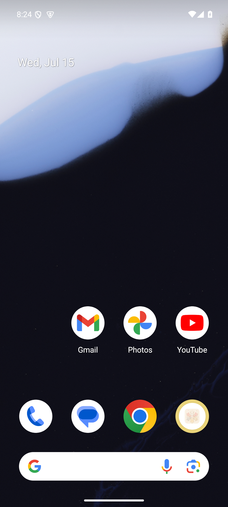
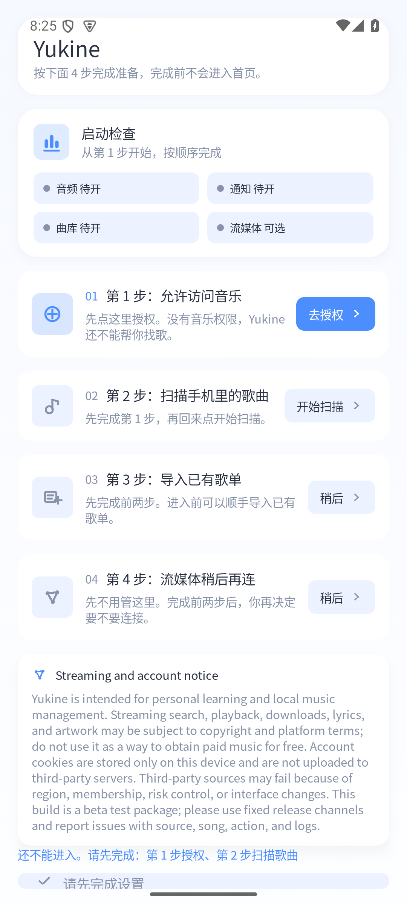

# MuMu 小白首次体验审计

日期：2026-07-16  
测试角色：完全不了解产品、未阅读代码或说明的首次用户  
覆盖范围：MuMu Android 桌面、寻找并启动 Yukine、首次启动检查页  
阻塞：继续操作必须授予“访问音乐”系统权限；本轮未修改权限，因此首页、扫描、导入歌单、播放、导航和设置未能验证。

## 总体结论

首次启动页把任务顺序和前置条件讲清楚了，但它是一条强制权限门槛：用户既无法体验首页，也看不到明确的“先逛逛/退出设置”路径。页面还存在底部内容贴边、中文与英文混排、不可用控件对比偏弱的问题。当前结果只能评价首次启动，不代表完整 App 体验。

## 流程证据

### 1. MuMu Android 桌面 — 良好

- 小白预期：先在桌面寻找 App 图标并打开。
- 实际：桌面状态稳定，但首屏没有明显的 Yukine/ECHO 图标，需要继续寻找应用。
- 困惑：用户给出的产品名若是 ECHO，而应用内显示 Yukine，名称不一致会增加“我是不是打开错了”的怀疑。

### 2. Yukine 首次启动检查 — 勉强 / 阻塞

- 小白预期：按 1→4 完成设置，第一步点击“去授权”。
- 实际：步骤编号、当前状态和第 2 步禁用原因清楚；但第 1 步是系统隐私权限，未授权就完全无法进入首页。
- 困惑：第 3、4 步按钮写“稍后”，但页面底部又说“还不能进入”；用户需要自己推断真正必做的只有第 1、2 步。
- 可见问题：英文 Streaming notice 与中文界面混排；底部提示和操作条紧贴系统导航区且有被截断迹象；浅灰蓝禁用控件与背景接近。

## 优先改进

### UI

1. **P1｜把底部阻塞区做成安全区内固定卡片。** 证据：`02-drawer.png` 底部提示与操作条贴近系统导航条。影响：用户可能看不全当前缺少什么，也可能误触系统返回。改法：增加系统安全区 padding，固定显示“还差 2 项”与唯一主按钮，长说明放在可滚动内容中。
2. **P1｜明确区分“必需”和“可选”。** 证据：四个状态平铺，但实际只有授权和扫描阻止进入。影响：用户会误以为四项都必须完成。改法：分成“进入前必须完成（2）”和“以后再设置（2）”，可选项不要占用与必需项同等视觉权重。
3. **P2｜统一语言。** 证据：整页中文，notice 标题和正文为英文。影响：削弱可读性和完成信心。改法：跟随系统语言展示完整中文，必要时提供“查看英文原文”。
4. **P2｜提高禁用态辨识度。** 证据：第 2～4 步按钮、图标和正文都使用接近背景的浅灰蓝。影响：低视力或低亮度环境下难以判断按钮、说明与状态。改法：提高文本对比度，保留清晰轮廓，并用锁图标或“完成第 1 步后可用”表达禁用原因。
5. **P2｜统一产品命名。** 证据：测试目标称 ECHO，界面标题为 Yukine。影响：首次用户可能怀疑进入了错误应用。改法：安装名、桌面名、启动页标题和帮助文案保持一致，若处于改名期应显示“Yukine（原 ECHO）”。

### 操作逻辑

1. **P0｜为权限门槛提供明确选择和后果说明。** 证据：`02-drawer.png` 明示“完成前不会进入首页”，唯一前进路径是“去授权”。影响：尚未建立信任的新用户被迫先交权限，可能直接流失。改法：优先提供“仅体验界面/稍后授权”的只读或空状态模式；若产品确实离不开本地音乐权限，至少提供“为什么需要、读取范围、数据是否上传、拒绝后还能做什么”。
2. **P1｜设计拒绝权限后的恢复路径。** 本轮受权限边界阻塞，尚未实际验证。影响：用户拒绝一次后可能陷入死路。改法：原位显示拒绝状态，提供“重新请求”和“前往系统设置”，并保留退出或只读入口。
3. **P1｜把前置条件写在动作上。** 证据：第 2 步主要依靠淡化按钮和下方说明表达依赖。影响：用户可能反复点“开始扫描”却不知道为何无效。改法：按钮文案改为“授权后可扫描”，完成授权后自动变成“开始扫描”，并给予状态变化反馈。
4. **P2｜减少首次流程中的法律/技术长文。** 证据：英文 notice 占据接近一屏高度。影响：把关键动作推到屏幕底部并增加阅读负担。改法：保留 2～3 行摘要，详细条款放到可展开面板或独立页面。

## 做得好的地方

- 用 01～04 和卡片顺序建立了明确的线性任务结构。
- 第 1 步使用高对比主按钮，下一步行动容易识别。
- 第 2 步明确写出“先完成第 1 步”，比单纯禁用按钮更容易理解。
- 顶部状态汇总让用户能快速判断音频、通知、曲库和流媒体的准备情况。

## 无障碍与证据限制

- 可见风险：禁用态对比偏低；底部控件靠近系统导航区；英文长段落阅读负担大。
- 本轮无法仅凭截图确认：TalkBack 标签与阅读顺序、键盘/焦点导航、触控目标尺寸、动态状态播报、权限拒绝后的错误恢复、字体放大和横屏重排。
- 未覆盖：权限弹窗、歌曲扫描、首页、核心播放路径、导入歌单、导航/返回、设置与个人页。

## 证据文件

- `E:\ECHO andriod\echo-android\ux-audit\novice-mumu-2026-07-16\01-start.png`
- `E:\ECHO andriod\echo-android\ux-audit\novice-mumu-2026-07-16\02-drawer.png`
